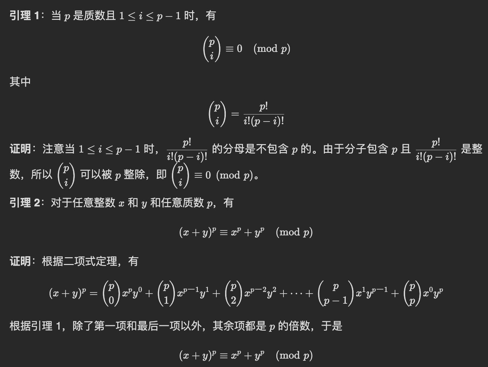
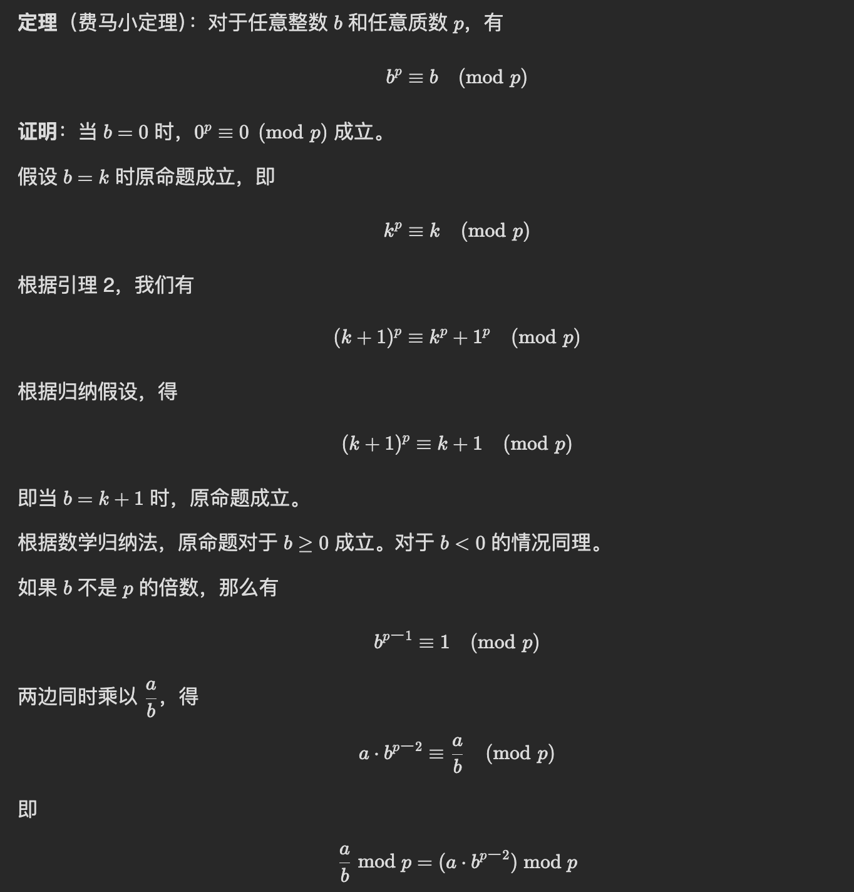

https://oi-wiki.org/

# OJ

```c++
stringstream ss(word);
while(ss>>tmp){
  	cout<<tmp<<endl;
}
```


```c++
while(std::getline(cin,line)){
  cout<<line<<endl;
}
#include <string>
std::stoi(str); //string to int

#include <functional>
function<int(int)> dfs=[&](int i)->int{
  	//...
};
//or just 
auto dfs=[&](auto &&dfs,int i)->int{
  //...
};
```

Readin c++

`stoi`是stirng to int

`atoi`是char to int

```c++
#include<bits/stdc++.h>
#include<iostream>
#include<sstream>
using namespace std;

cin>>n;
cin.ignore();//忽略换行符
for(int i=0;i<n;i++){
  string line;
  getline(cin,line);
  int tmp=stoi(line);//string to int
  istringstream iss(line);//or directly trun to int 
  int neighbor;
  while(iss>>neighbor){
     cout<<neighbor<<endl;
  }
}
```

```c++
  int n;
  cin >> n;
  cin.ignore(); 

  vector<vector<int>> graph(n);
  string line;

  // 读取图的邻接表表示
  for (int i = 0; i < n; i++) {
      getline(cin, line);
      istringstream iss(line);
      int neighbor;
      while (iss >> neighbor) {
          graph[i].push_back(neighbor);
      }
  }
```

Readin python

`input()` 函数每次调用时会读取一行输入，并将输入内容作为字符串返回

```python
from functools import cache
from collections import deque,Counter,defaultdict
import heapq
import itertools
import math
import bisect

a=[1,2,3]
permutations=list(itertools.permutation(a))
list(itertools.combinations(a, 2)) #2个数的组合

gcd=math.gcd(12,15)
factorial=math.factorial(5) #5!
sqrt_value=math.sqrt()

arr = [1, 2, 4, 5]
bisect.insort(arr, 3)
index = bisect.bisect(arr, 4)
bisect.bisect_left(arr, 3, lo=0, hi=len(a))
bisect.bisect_right(arr, 3, lo=0, hi=len(a))

n=int(input())
graph=[]
for i in range(n):
  line=input().split() #split space!
  graph.append(list(map(int,line))
               
#if there are different split way
line=input()               
input_string=line.replace(";",",").split(","); #split ","
a=list(map(int,input_string))
''.join(a)
               
m1 = [[] for _ in range(n)] 
for u, v, w in edges:
    m1[u].append((v, w))
    m1[v].append((u, w))               
               
m1 = defaultdict(list)
for i in edges:
    m1[i[0]].append((i[1], i[2]))
    m1[i[1]].append((i[0], i[2]))

inf = float('inf')     
               
return min([dfs(i) for i in m[node]])
```


# Algorithm

注意要&!不然占用内存!

[**2915**](https://leetcode.cn/problems/length-of-the-longest-subsequence-that-sums-to-target/)
$$
例如 \textit{nums} 前两个数的和是 5，那么枚举 j 的时候，最大只需要枚举 5，而不是 \textit{target}
$$

```python
class Solution {
public:
    int lengthOfLongestSubsequence(vector<int>& nums, int target) {
		int n=nums.size();
        vector<int> f(target+1,INT_MIN);
        f[0]=0;
        int s=0;
        for(int x:nums){
            s=min(s+x,target);
            for(int j=s;j>=x;j--){
                f[j]=max(f[j],f[j-x]+1);
            }
        }
        return f[target]>0?f[target]:-1;
    }
};
```

# Dynamic programming

### 最大子数组和

* 定义状态 `f[i]` 表示以 `a[i]` 结尾的最大子数组和。
  - 如果不和 `i` 左边拼起来，那么 `f[i] = a[i]`
  - 如果和 `i` 左边拼起来，那么 `f[i] = f[i-1] + a[i]`
  - 取最大值就得到了状态转移方程： f[i]=max⁡(f[i−1],0)+a[i] 答案为： max⁡(f) , 这个做法也叫做 Kadane 算法。

* 用前缀和解决

```c++
class Solution {
public:
    int maxSubArray(vector<int>& nums) {
        int ans = INT_MIN;
        int min_pre_sum = 0;
        int pre_sum = 0;
        for (int x : nums) {
            pre_sum += x; // 当前的前缀和
            ans = max(ans, pre_sum - min_pre_sum); // 减去前缀和的最小值
            min_pre_sum = min(min_pre_sum, pre_sum); // 维护前缀和的最小值
        }
        return ans;
    }
};

作者：灵茶山艾府
链接：https://leetcode.cn/problems/maximum-subarray/solutions/2533977/qian-zhui-he-zuo-fa-ben-zhi-shi-mai-mai-abu71/
来源：力扣（LeetCode）
著作权归作者所有。商业转载请联系作者获得授权，非商业转载请注明出处。
```


### 0-1 backpack

```python
def zero_one_knapsack(capacity:int, w:List[int],v:List[int])->int:
    n=len(w)
    @cache
  	def dfs(i,c):
        if i<0:
        	return 0
        if c<w[i]:
        	return dfs(i-1,c)
        return max(dfs(i-1,c),dfs(i-1,c-w[i])+v[i])
	return dfs(n-1,capacity)
```

LC494 (0-1 knapsack)


```python
def zero_one_knapsack(target:int, nums:List[int])->int:
    n=len(nums)
    f=[[0]*(target+1) for _ in range(n+1)]
    f[0][0]=1
    for i,x in enumerate(nums):
        for c in range(capacity+1):
            if c<x:
                f[i+1][c]=f[i][c]
            else:
                f[i+1][c]=f[i][c]+f[i][c-x]	
	return f[n][capacity]
```

```python
def zero_one_knapsack(target:int, nums:List[int])->int:
    n=len(nums)
    f=[[0]*(target+1) for _ in range(2)]
    f[0][0]=1
    for i,x in enumerate(nums):
        for c in range(target+1):
            if c<x:
                f[(i+1)%2][c]=f[i%2][c]
            else:
                f[(i+1)%2][c]=f[i%2][c]+f[i%2][c-x]	
	return f[n%2][target]
```

0-1 pack 反向遍历！不然前面的更新会影响后面！

```python
def zero_one_knapsack(target:int, nums:List[int])->int:
    n=len(nums)
    f=[0]*(target+1）
    f[0]=1
    for x in nums:
        for c in range(target,x-1,-1):
            f[c]=f[c]+f[c-x]	
  return f[target]
```

LC322 unbounded knapsack


```python
class Solution:
    def coinChange(self, coins: List[int], amount: int) -> int:
        n=len(coins)
        @cache
        def dfs(i,c):
            if i<0:
                return 0 if c==0 else inf
            if c<coins[i]:
                return dfs(i-1,c)
            return min(dfs(i-1,c),dfs(i,c-coins[i])+1)
        ans = dfs(n-1,amount)
        return ans if ans < inf else -1
```

memo array

```python
class Solution:
    def rob(self, nums: List[int]) -> int:
        n = len(nums)
        cache=[-1]*n
        def dfs(i):
            if i< 0:
                return 0
            if cache[i]!=-1:
                return cache[i]
            res=max(dfs(i-1),dfs(i-2)+nums[i])
            cache[i]=res
            return res
        return dfs(n-1)
```

dfs→ f array

space complexity O(n)

```python
class Solution:
    def rob(self, nums: List[int]) -> int:
        n = len(nums)
        cache=[0]*(n+2)
				for i,x in enumerate(nums):
		        f[i+2]=max(f[i+1],f[i]+x)
        return f[n+1]
```

**rolling array**

space complexity O(1)

```python
class Solution:
    def rob(self, nums: List[int]) -> int:
        n = len(nums)
            f0=f1=0
            for i,x in enumerate(nums):
                new_f=max(f1,f0+x)
                f0=f1
            f1=new_f
        return f1
```

[**1049. 最后一块石头的重量 II**](https://leetcode.cn/problems/last-stone-weight-ii/)

divide into two and as same weight as possible(0-1 package)

```cpp
int dp[n+1][target+1];
memset(dp,0,sizeof(dp));//can only use 0! cannot use -1 or 1!
dp[0][0]=1;
for(int i=0;i<n;++i){
    for(int j=0;j<=target;++j){
        if(j<stones[i]) 
            dp[i+1][j]=dp[i][j];
        else 
            dp[i+1][j]=dp[i][j]||dp[i][j-stones[i]];
    }
}
for(int j=target;;--j){
    if(dp[n][j]==1)
        return sum1-2*j;
    }
}
```

```cpp
int dp[2][target+1];
memset(dp,0,sizeof(dp));
//0-1 backpack
dp[0][0]=1;
for(int i=0;i<n;++i){
    for(int j=0;j<=target;++j){
        if(j<stones[i]) 
            dp[(i+1)%2][j]=dp[i%2][j];
        else 
            dp[(i+1)%2][j]=dp[i%2][j]||dp[i%2][j-stones[i]];
    }
}
for(int j=target;;--j){
    if(dp[n%2][j]==1)
        return sum1-2*j;
}
```

```cpp
int dp[target+1];
memset(dp,0,sizeof(dp));
//0-1 backpack
dp[0]=1;
for(int stone:stones)
    for(int j=target;j>=stone;--j)
        dp[j]=dp[j]||dp[j-stone];

for(int j=target;;--j){
    if(dp[j]==1)
        return sum1-2*j;
}
```

### 经典线性 DP

#### LIS等价于排序去重后的LCS

#### 最长公共子序列（LCS）

子数组/子串 subarray/substring sequence 连续的

子序列 subsequence 不连续的

#### 1143

```c++
class Solution {
public:
    int longestCommonSubsequence(string s, string t) {
        int n = s.length(), m = t.length(), f[n + 1][m + 1];
        memset(f, 0, sizeof(f));
        for (int i = 0; i < n; ++i)
            for (int j = 0; j < m; ++j)
                f[i + 1][j + 1] = s[i] == t[j] ? f[i][j] + 1 :
                                  max(f[i][j + 1], f[i + 1][j]);
        return f[n][m];
    }
};
```

一维数组优化

```c++
class Solution {
public:
    int longestCommonSubsequence(string s, string t) {
        int m = t.length(), f[m + 1];
        memset(f, 0, sizeof(f));
        for (char x : s)
            for (int j = 0, pre = 0; j < m; ++j) {
                int tmp = f[j + 1];
                f[j + 1] = x == t[j] ? pre + 1 : max(f[j + 1], f[j]);
                pre = tmp;
            }
        return f[m];
    }
};
```

- 相邻相关 LIS
- 相邻无关 0-1背包

#### 最长递增子序列（LIS）

枚举选哪个

贪心+二分

计算 a和把 a排序后的数组 sortedA 的最长公共子序列。

数据结构优化（见 2407 题）

#### 线段树优化 DP

线段树（或者 树状数组） 并不是只能用来计算一个区域的总和，还能做很多事情，只要是满足修改某区域的值就会影响某区域的结果，这样就能用线段树（或者 树状数组）

#### 2407

### **IS, Increasing Subsequence**

### **LIS, Longest Increasing Subsequence**

```c++
dfs(i)=max{dfs(j)}+1   //j<i && nums[j]<nums[i]
f[i]=max{f[j]}+1   //j<i && nums[j]<nums[i]
```

#### 300

```python
class Solution:
    def lengthOfLIS(self, nums: List[int]) -> int:
        n=len(nums)
		@cache
        def dfs(i):
            res=0
            for j in range(i):
                if nums[j]<nums[i]:
                    res=max(res,dfs(j))
            return res+1

        # ans=0
        # for i in range(n):
        #     ans=max(ans,dfs(i))
        # return ans

        return max(dfs(i) for i in range(n))
```

**进阶技巧：交换状态与状态值**

```python
class Solution:
    def lengthOfLIS(self, nums: List[int]) -> int:
        g=[]
        for x in nums:
            j=bisect_left(g,x)
            if j==len(g):
                g.append(x)
            else:
                g[j]=x
        return len(g)
```

这里g是严格递增的，而且每次要么添加一个数，或者修改一个数

**g[i] 表示长度为i+1的IS的末尾元素的最小值**

**复杂度 O(nlogn) 太牛逼啦！**

如果是非严格递增

修改>nums[i]的第一个g[j]

```python
bisect_left -> bisect_right
```

#### 2826

```python
class Solution:
    def minimumOperations(self, nums: List[int]) -> int:
        g=[]
        for x in nums:
            j=bisect_right(g,x)
            if j==len(g):
                g.append(x)
            else:
                g[j]=x
        return len(nums)-len(g)
```


dfs(i) 表示以nums[i] 结尾的LIS长度

转移： 枚举 j<i，如果nums[j]<nums[i] 就从dfs(j)+1转移过来

dfs(i,j)  表示以nums[i] 结尾，至多j对相邻元素不同

最长子序列长度

p<i

nums[p]≠nums[i], dfs(p,j-1)+1

nums[p]==nums[i], dfs(p,j)+1 

### LIS（二维）

对于 x 相同的点，要按照 **y 从大到小排序**。这可以保证在计算 LIS 时，对于相同的 x，我们至多选一个 y

#### 3288

```c++
class Solution {
public:
    int maxPathLength(vector<vector<int>>& c, int k) {
        int kx=c[k][0],ky=c[k][1];
        //sort(c.begin(),c.end(),[](vector<int> &a,vector<int> &b){if(a[0]==b[0]) return a[1]>b[1]; return a[0]<b[0];});
         ranges::sort(coordinates, [](const auto& a, const auto& b) {
            return a[0] < b[0] || a[0] == b[0] && a[1] > b[1];
        });

        vector<int> g;
        for(auto &p:c){
            int x=p[0],y=p[1];
            if(x<kx&&y<ky||x>kx&&y>ky){
                auto it=ranges::lower_bound(g,y);
                if(it!=g.end()){
                    *it=y;
                }else{
                    g.push_back(y);
                }
            }
        }
        return g.size()+1;
    }
};
```


### 状态机DP

**不限交易次数**


#### 122

```python
class Solution:
    def maxProfit(self, prices: List[int]) -> int:
        #attension! only 1 stock can be hold at one time!
        #dfs(i,0) mean ith day dont have stock 
        #1 mean ith day have stock
        @cache
        def dfs(i:int,hold:int)->int:
            if i<0:
                return -inf if hold else 0
            if hold:
                return max(dfs(i-1,True),dfs(i-1,False)-prices[i])
            return max(dfs(i-1,False),dfs(i-1,True)+prices[i])

        n=len(prices)
        return dfs(n-1,False)
```

翻译成递推

```c++
class Solution {
public:
    int maxProfit(vector<int>& prices) {
        int n = prices.size(), f[n + 1][2];
        memset(f, 0, sizeof(f));
        f[0][1] = INT_MIN;
        for (int i = 0; i < n; i++) {
            f[i + 1][0] = max(f[i][0], f[i][1] + prices[i]);
            f[i + 1][1] = max(f[i][1], f[i][0] - prices[i]);
        }
        return f[n][0];
    }
};
```

空间优化

```c++
class Solution {
public:
    int maxProfit(vector<int>& prices) {
        int n = prices.size();
        //  f[n + 1][2];
        // memset(f, 0, sizeof(f));
        // f[0][1] = INT_MIN;
        int f0=0;
        int f1=INT_MIN;

        for (auto p:prices) {
            int new_f0=max(f0,f1+p);
            f1=max(f1,f0-p);
            f0=new_f0;
        }
        return f0;
    }
};
```

#### 309

卖出股票后，你无法在第二天买入股票 (即冷冻期为 1 天)

和前面的区别就是

```python
dfs(i,1)=max(dfs(i-1,1),dfs(i-2,0)-prices[i])  #变成-2,间隔一天
```

```c++
class Solution {
public:
    int maxProfit(vector<int>& prices) {
        int n = prices.size(), f[n + 2][2];
        memset(f, 0, sizeof(f));
        f[1][1] = INT_MIN;
        for (int i = 0; i < n; i++) {
            f[i + 2][0] = max(f[i+1][0], f[i+1][1] + prices[i]);
            f[i + 2][1] = max(f[i+1][1], f[i][0] - prices[i]);
        }
        return f[n+1][0];
    }
};
```

限制交易次数

#### 188


```python
class Solution:
    def maxProfit(self, k: int, prices: List[int]) -> int:
        n=len(prices)
        @cache
        def dfs(i,j,hold):
            if j<0 :
                return -inf
            if i<0:
                return -inf if hold else 0
            if hold:
                return max(dfs(i-1,j,True),dfs(i-1,j,False)-prices[i])
            return max(dfs(i-1,j,False),dfs(i-1,j-1,True)+prices[i])
        return dfs(n-1,k,False)
```

这里一定要先判断j，也就是交易次数

### 前缀和DP

Week410 Q4

```c++
class Solution {
public:
    int countOfPairs(vector<int>& nums) {
        const int MOD = 1'000'000'007;
        int n = nums.size();
        int m = ranges::max(nums);
        vector<vector<long long>> f(n, vector<long long>(m + 1));
        //s is used to store prefix sum!
        vector<long long> s(m + 1);

        fill(f[0].begin(), f[0].begin() + nums[0] + 1, 1);
        for (int i = 1; i < n; i++) {
            partial_sum(f[i - 1].begin(), f[i - 1].end(), s.begin()); 
            for (int j = 0; j <= nums[i]; j++) {
                int max_k = j + min(nums[i - 1] - nums[i], 0);
                f[i][j] = max_k >= 0 ? s[max_k] % MOD : 0;
            }
        }

        return reduce(f[n - 1].begin(), f[n - 1].begin() + nums[n - 1] + 1, 0LL) % MOD;
    }
};
```

### 区间DP

#### 516

回文子序列

```c++
dfs(i,i)=1
dfs(i+1,i)=0

if(s[i]==s[j])
	dfs(i,j)= dfs(i+1,j-1)+2 
else 
	dfs(i,j)=max(dfs(i+1,j),dfs(i,j-1)) 
```

$n^2$的状态，每个状态O(1)时间，时间复杂度O(n^2)

递推： f[i+1]转移到f[i]，所以要i倒序枚举，j正序枚举

```python
    f=[[0]*n for _ in range(n)]
    for i in range(n-1,-1,-1):
        f[i][i]=1
        for j in range(i+1,n):
            if s[i]==s[j]:
                f[i][j]=f[i+1][j-1]+2
            else:
                f[i][j]=max(f[i][j-1],f[i+1][j])
    return f[0][n-1]
```

#### 1039

多边形

```python
#dfs(i,j)表示i到j区间的多边形的最低得分
dfs(i,j)= min(dfs(iclass Solution:
    def minScoreTriangulation(self, values: List[int]) -> int:
        n=len(values)
        @cache
        def dfs(i:int,j:int):
            if j==i+1:
                return 0
            return min(dfs(i,k)+dfs(k,j)+values[i]*values[j]*values[k] for k in range(i+1,j))
        
        return dfs(0,n-1),k)+dfs(k,j)+v[i]*v[j]*v[k] for k in range(i+1,j))
```

$n^2$的状态，每个状态O(n)时间，时间复杂度O(n^3)

翻译成递推

```python
class Solution:
    def minScoreTriangulation(self, values: List[int]) -> int:
        n=len(values)
        f= [[0]*n for _ in range(n)]
        for i in range(n-3,-1,-1):
            for j in range(i+2,n):
                res=inf
                for k in range(i+1,j):
                    res=min(res,f[i][k]+f[k][j]+values[i]*values[j]*values[k])
                f[i][j]=res

        return f[0][n-1]
```

### 树形DP

#### 543

```python
ans=0
def dfs(node):
  if node is None:
    return -1
  l_len=dfs(node.left)
  r_len=dfs(node.right)
  nonlocal ans
  ans=max(ans,l_len+r_len+2)
  return max(l_len,r_len)+1
dfs(root)
```

#### 124

```python
ans=-inf
def dfs(node):
  if node is None:
    return 0
  l_val=dfs(node.left)
  r_val=dfs(node.right)
  nonlocal ans
  ans=max(ans,l_val+r_val+node.val)
  return max(max(l_val,r_val)+node.val,0)
dfs(root)
```

#### 2246

1:遍历x子树，存列表，排序，取最大两个

2:遍历时取最长+次长

```python
  n=len(parent)
  g=[[] for _ in range(n)]
  for i in range(1,n):
    g[parent[i]].append(i)
  ans=0
  def dfs(x,fa):
    nonlocal ans
    x_len=0
    for y in g[x]:
      if y==fa: continue
      y_len=dfs(y,x)+1
      if s[y]!=s[x]:
        ans=max(ans,x_len+y_len)
        x_len=max(x_len,y_len)
  return x_len
dfs(0,-1)
return ans+1
```

#### 337

```python
def dfs(node):
  if node is None:
    return 0,0
  l_rob,l_not_rob=dfs(node.left)
  r_rob,r_not_rob=dfs(node.right)
  rob=l_not_rob+r_not_rob+node.val
  not_rob=max(l_rob,l_not_rob)+max(r_rob,r_not_rob)
  return rob,not_rob
return max(dfs(root))
```

没有上司的舞会

选=($\Sigma$ 不选子节点)+当前节点值

不选=$\Sigma$ max(选子节点,不选子节点)

#### 968

```python
def dfs(node):
  if node is None:
    return inf,0,0
  l_choose,l_by_fa,l_by_children=dfs(node.left)
  r_choose,r_by_fa,r_by_children=dfs(node.right)
  choose=min(l_choose,l_by_fa,l_by_children)+min(r_choose,r_by_fa,r_by_children)+1
  by_fa=min(l_choose,l_by_children)+min(r_choose,r_by_children)
  by_children=min(l_choose+r_by_children,r_choose+l_by_children,l_choose+r_choose)
  return choose,by_fa,by_children
choose,_,by_children=dfs(root)
return min(choose,by_children)
```

cost[x]

`choose=min(l_choose,l_by_fa,l_by_children)+min(r_choose,r_by_fa,r_by_children)+cost[node]`

#### 3367

```python
class Solution:
    def maximizeSumOfWeights(self, edges: List[List[int]], k: int) -> int:
        g = defaultdict(list)
        for x, y, wt in edges:
            g[x].append((y, wt))
            g[y].append((x, wt))

        def dfs(x: int, fa: int) -> Tuple[int, int]:
            not_choose = 0
            inc = []
            for y, wt in g[x]:
                if y == fa:
                    continue
                nc, c = dfs(y, x)
                not_choose += nc  # 先都不选
                if (d := c + wt - nc) > 0:
                    inc.append(d)
            inc.sort(reverse=True)
            # 再选增量最大的 k 个或者 k-1 个
            return not_choose + sum(inc[:k]), not_choose + sum(inc[:k - 1])
        return max(dfs(0, -1))

```

# DP BW 132 Q4

```python
"""
f[x][j] means end with value x, j different

not choose f[x][j]
choose nums[p]!=nums[i], f[x][j]=f[y][j-1]+1   and we need to enumeration y!
choose nums[p]==nums[i], f[x][j]=f[x][j]+1 

f[x][j]=max(f[x][j]+1,max(f[y][j-1] for y in set)+1)
mx[j] means the max(f[y][j] for y in set)

f[x][j]=max(f[x][j]+1,mx[j-1]+1)

"""

class Solution:
    def maximumLength(self, nums: List[int], k: int) -> int:
        fs={}
        mx=[0]*(k+1)
        for x in nums:
            if x not in fs:
                fs[x]=[0]*(k+1)
            f=fs[x]
            for j in range(k,-1,-1):
                f[j]+=1
                if j>0:
                    f[j]=max(f[j],mx[j-1]+1)
                mx[j]=max(mx[j],f[j])
        return mx[-1]
```


# Binary Search

**开区间写法**

以开区间二分为例：

求最小：check(mid) == true 时更新 right = mid，反之更新 left = mid，最后返回 right。
求最大：check(mid) == true 时更新 left = mid，反之更新 right = mid，最后返回 left。
对于开区间写法，简单来说 check(mid) == true 时更新的是谁，最后就返回谁。相比其他二分写法，开区间写法不需要思考加一减一等细节，个人推荐使用开区间写二分

```c++
l=-1,r=len(nums)
while(l+1<r){
    int m=(l+r)/2;
    if(check(m)){
        l=m;
    }ekse{
        r=m;
    }
}
return l;
```

开区间二分时线lower_bound 和upper_bound，带重复元素

注意这里`l=-1,r=len(nums)` !! 千万注意！这里l+(r-l)>>1是错误的！要l+((r-l)>>1) 有运算符优先级！

```c++
int target;
l=-1,r=len(nums)
while(l+1<r){
    int m=(l+r)/2;
    if(target<=nums[m]){
        r=m;
    }ekse{
        l=m;
    }
}
return r;
```


**左闭右开**

```c++
while(l<r){
    int m=(r+l)/2;
    if(check(m)){
        l=m;
    }else{
        r=m;
    }
}
return l;//l or r are both ok!
```


```c++
while(l<r){
	int m=(r+l+1)/2;
	if(check(m)){
		l=m;
	}else{
		r=m-1;
	}
}
```

[0,n)

because mid is floor(r+l)/2, so we can only use l=mid+1,r=mid!!

```cpp
class Solution {
public:
    int BS(vector<int>& nums, int target) {
        int l=0,r=nums.size();
        while(l<r){
            int mid=(r-l)/2+l;
            if(nums[mid]<target){
                l=mid+1;
            }
            else r=mid;
        }
        return r;
    }
};
```

#### [**1690. 石子游戏 VII**](https://leetcode.cn/problems/stone-game-vii/)

```cpp
#dfs(i,j) 先手-后手
#max(num[0]-dfs(1,n-1),num[n-1]-dfs(0,n-2))

class Solution:
    def stoneGameVII(self, stones: List[int]) -> int:   
        s = list(accumulate(stones, initial=0))  
        n=len(stones)
        @cache
        def dfs(i:int,j:int) -> int:
            if(i==j): 
                return 0
            return max(s[j+1]-s[i+1]-dfs(i+1,j),s[j]-s[i]-dfs(i,j-1))
        ans = dfs(0, n - 1)
        dfs.cache_clear()  # 防止爆内存
        return ans
```

# 线段树

### 线段树二分

```c++
class BookMyShow {
    int n, m;
    vector<int> mn;
    vector<int long> sum;

    // 把下标 i 上的元素值增加 val
    void update(int o, int l, int r, int i, int val) {
        if (l == r) {
            mn[o] += val;
            sum[o] += val;
            return;
        }
        int m = (l + r) / 2;
        if (i <= m) {
            update(o * 2, l, m, i, val);
        } else {
            update(o * 2 + 1, m + 1, r, i, val);
        }
        mn[o] = min(mn[o * 2], mn[o * 2 + 1]);
        sum[o] = sum[o * 2] + sum[o * 2 + 1];
    }

    // 返回区间 [L,R] 内的元素和
    long long querySum(int o, int l, int r, int L, int R) {
        if (L <= l && r <= R) {
            return sum[o];
        }
        long long res = 0;
        int m = (l + r) / 2;
        if (L <= m) {
            res = querySum(o * 2, l, m, L, R);
        }
        if (R > m) {
            res += querySum(o * 2 + 1, m + 1, r, L, R);
        }
        return res;
    }

    // 返回区间 [0,R] 中 <= val 的最靠左的位置，不存在时返回 -1
    int findFirst(int o, int l, int r, int R, int val) {
        if (mn[o] > val) {
            return -1; // 整个区间的元素值都大于 val
        }
        if (l == r) {
            return l;
        }
        int m = (l + r) / 2;
        if (mn[o * 2] <= val) {
            return findFirst(o * 2, l, m, R, val);
        }
        if (R > m) {
            return findFirst(o * 2 + 1, m + 1, r, R, val);
        }
        return -1;
    }

public:
    BookMyShow(int n, int m) : n(n), m(m), mn(2 << (__lg(n) + 1)), sum(2 << (__lg(n) + 1)) {}

    vector<int> gather(int k, int maxRow) {
        // 找第一个能倒入 k 升水的水桶
        int r = findFirst(1, 0, n - 1, maxRow, m - k);
        if (r < 0) { // 没有这样的水桶
            return {};
        }
        int c = querySum(1, 0, n - 1, r, r);
        update(1, 0, n - 1, r, k); // 倒水
        return {r, c};
    }

    bool scatter(int k, int maxRow) {
        // [0,maxRow] 的接水量之和
        long long s = querySum(1, 0, n - 1, 0, maxRow);
        if (s > (long long) m * (maxRow + 1) - k) {
            return false; // 水桶已经装了太多的水
        }
        // 从第一个没有装满的水桶开始
        int i = findFirst(1, 0, n - 1, maxRow, m - 1);
        while (k) {
            int left = min(m - (int) querySum(1, 0, n - 1, i, i), k);
            update(1, 0, n - 1, i, left); // 倒水
            k -= left;
            i++;
        }
        return true;
    }
};

作者：灵茶山艾府
链接：https://leetcode.cn/problems/booking-concert-tickets-in-groups/solutions/1523876/by-endlesscheng-okcu/
来源：力扣（LeetCode）
著作权归作者所有。商业转载请联系作者获得授权，非商业转载请注明出处。
```


更严格的大小是

```c++
vector<int> mx;
mx.resize(4<<__lg(n));
```

#### 307

use array → space 4n 

n=10 要32个，可以预估成4n

$$
2^{(log_n+1)}
$$


```python
class NumArray:
    def __init__(self, nums: List[int]):
        n = len(nums)
        self.n = n
        self.seg = [0] * (n * 4)
        self.build(nums, 0, 0, n - 1)

    def build(self, nums: List[int], node: int, s: int, e: int):
        if s == e:
            self.seg[node] = nums[s]
            return
        m = s + (e - s) // 2
        self.build(nums, node * 2 + 1, s, m)
        self.build(nums, node * 2 + 2, m + 1, e)
        self.seg[node] = self.seg[node * 2 + 1] + self.seg[node * 2 + 2]

    def change(self, index: int, val: int, node: int, s: int, e: int):
        if s == e:
            self.seg[node] = val
            return
        m = s + (e - s) // 2
        if index <= m:
            self.change(index, val, node * 2 + 1, s, m)
        else:
            self.change(index, val, node * 2 + 2, m + 1, e)
        self.seg[node] = self.seg[node * 2 + 1] + self.seg[node * 2 + 2]

    def range(self, left: int, right: int, node: int, s: int, e: int) -> int:
        if left == s and right == e:
            return self.seg[node]
        m = s + (e - s) // 2
        if right <= m:
            return self.range(left, right, node * 2 + 1, s, m)
        if left > m:
            return self.range(left, right, node * 2 + 2, m + 1, e)
        return self.range(left, m, node * 2 + 1, s, m) + self.range(m + 1, right, node * 2 + 2, m + 1, e)

    def update(self, index: int, val: int) -> None:
        self.change(index, val, 0, 0, self.n - 1)

    def sumRange(self, left: int, right: int) -> int:
        return self.range(left, right, 0, 0, self.n - 1)

作者：力扣官方题解
链接：https://leetcode.cn/problems/range-sum-query-mutable/solutions/1389182/qu-yu-he-jian-suo-shu-zu-ke-xiu-gai-by-l-76xj/
来源：力扣（LeetCode）
著作权归作者所有。商业转载请联系作者获得授权，非商业转载请注明出处。
```


```cpp
class NumArray {
public:
    vector<int> vec;
    int n;
    void build(vector<int> &nums,int l,int r,int o){
        if(l==r){
            vec[o]=nums[l];
            return;
        }
        int m=(l+r)>>1;
        build(nums,l,m,o*2);
        build(nums,m+1,r,o*2+1);
        vec[o]=vec[o*2]+vec[o*2+1];
    }
    int query(int l,int r, int o,int L,int R){
        if(L<=l&&R>=r){
            return vec[o];
        }
        int m=(l+r)>>1;
        if(R<=m){
            return query(l,m,o*2,L,R);
        }
        if(L>m){
            return query(m+1,r,o*2+1,L,R);
        }
        return query(l,m,o*2,L,R)+query(m+1,r,o*2+1,L,R);
    }
    void update1(int l,int r,int o,int i,int val){
        if(l==r){
            vec[o]=val;
            return;
        }
        int m=(l+r)>>1;
        if(i<=m)
            update1(l,m,o*2,i,val);
        else update1(m+1,r,o*2+1,i,val);
        vec[o]=vec[o*2]+vec[o*2+1];
    }

    NumArray(vector<int>& nums) {
        n=nums.size();
        vec.resize(4*n);
        build(nums,0,n-1,1);
    }
    
    void update(int index, int val) {
        update1(0,n-1,1,index,val);
    }
    
    int sumRange(int left, int right) {
        return query(0,n-1,1,left,right);
    }
};
```

#### 715 range 动态开点

pushdown

pushup

Tree→ flag,add

```python
MAX_RANGE = int(1e9 + 7)
class Node:
    def __init__(self):
        self.left=self.right=None
        self.flag=False
        self.add=False
    
class Tree:
    def __init__(self):
        self.root=Node()
    
    @staticmethod
    def update(node: Node, lc: int, rc: int, l: int, r :int, flag: bool) -> None:
        if l <= lc and r >= rc:
            node.flag = flag
            # 一旦产生了变化懒标记就变为True，需要往下面继续更新
            node.add = True
            return
        Tree.pushdown(node)
        mid = lc + rc >> 1
        if l <= mid:
            Tree.update(node.left, lc, mid, l, r, flag)
        if r > mid:
            Tree.update(node.right, mid + 1, rc, l, r, flag)
        Tree.pushup(node)
    
    @staticmethod
    def query(node: Node, lc: int, rc: int, l: int, r: int) -> bool:
        if l <= lc and r >= rc:
            return node.flag
        # 下放当前结点
        Tree.pushdown(node)
        mid = lc + rc >> 1
        ans = True
        if l <= mid:
            ans = ans and Tree.query(node.left, lc, mid, l, r)
        if r > mid:
            ans = ans and Tree.query(node.right, mid + 1, rc, l, r)
        return ans

    @staticmethod
    def pushdown(node:Node)->None:
        if node.left is None: # 动态开点，只有当用到了这些点时，才开辟空间
            node.left = Node()
        if node.right is None:
            node.right = Node()
        if not node.add: # 懒标记为false，不用下放
            return
        node.left.flag, node.right.flag = node.flag, node.flag # 下放操作，子节点区间是否存在更新为父节点是否存在的标记flag
        node.left.add, node.right.add = True, True # 下放操作，子节点的懒标记更新为父节点的懒标记
        node.add = False

    @staticmethod
    def pushup(node:Node)->None:
        node.flag = node.left.flag and node.right.flag
class RangeModule:

    def __init__(self):
        self.tree=Tree()

    def addRange(self, left: int, right: int) -> None:
        Tree.update(self.tree.root,1,MAX_RANGE,left,right-1,True)

    def queryRange(self, left: int, right: int) -> bool:
        return Tree.query(self.tree.root,1,MAX_RANGE,left,right-1)

    def removeRange(self, left: int, right: int) -> None:
        Tree.update(self.tree.root,1,MAX_RANGE,left,right-1,False)

# Your RangeModule object will be instantiated and called as such:
# obj = RangeModule()
# obj.addRange(left,right)
# param_2 = obj.queryRange(left,right)
# obj.removeRange(left,right)
```

#### 2940

```c++
class Solution {
    vector<int> mx;

    // 用 heights 初始化线段树，维护区间最大值
    void build(int o, int l, int r, vector<int>& heights) {
        if (l == r) {
            mx[o] = heights[l];
            return;
        }
        int m = (l + r) / 2;
        build(o * 2, l, m, heights);
        build(o * 2 + 1, m + 1, r, heights);
        mx[o] = max(mx[o * 2], mx[o * 2 + 1]);
    }

    // 返回 [L,n-1] 中第一个 > v 的值的下标
    // 如果不存在，返回 -1
    int query(int o, int l, int r, int L, int v) {
        if (mx[o] <= v) { // 区间最大值 <= v
            return -1; // 没有 > v 的数
        }
        if (l == r) { // 找到了
            return l;
        }
        int m = (l + r) / 2;
        if (L <= m) {
            int pos = query(o * 2, l, m, L, v); // 递归左子树
            if (pos >= 0) { // 找到了
                return pos;
            }
        }
        return query(o * 2 + 1, m + 1, r, L, v); // 递归右子树
    }

public:
    vector<int> leftmostBuildingQueries(vector<int>& heights, vector<vector<int>>& queries) {
        int n = heights.size();
        mx.resize(4 << __lg(n));
        build(1, 0, n - 1, heights);

        vector<int> ans;
        for (auto& q : queries) {
            int a = q[0], b = q[1];
            if (a > b) {
                swap(a, b); // 保证 a <= b
            }
            if (a == b || heights[a] < heights[b]) {
                ans.push_back(b); // a 直接跳到 b
            } else {
                // 线段树二分，找 [b+1,n-1] 中的第一个 > heights[a] 的位置
                ans.push_back(query(1, 0, n - 1, b + 1, heights[a]));
            }
        }
        return ans;
    }
};

作者：灵茶山艾府
链接：https://leetcode.cn/problems/find-building-where-alice-and-bob-can-meet/solutions/2533058/chi-xian-zui-xiao-dui-pythonjavacgo-by-e-9ewj/
来源：力扣（LeetCode）
著作权归作者所有。商业转载请联系作者获得授权，非商业转载请注明出处。
```

# Lazy线段树

#### [729](https://leetcode.cn/problems/my-calendar-i/)

```c++
class MyCalendar {
    unordered_set<int> tree, lazy;

public:
    bool query(int start, int end, int l, int r, int idx) {
        if (r < start || end < l) {
            return false;
        }
        /* 如果该区间已被预订，则直接返回 */
        if (lazy.count(idx)) {
            return true;
        }
        if (start <= l && r <= end) {
            return tree.count(idx);
        }
        int mid = (l + r) >> 1;
        return query(start, end, l, mid, 2 * idx) ||
               query(start, end, mid + 1, r, 2 * idx + 1);
    }

    void update(int start, int end, int l, int r, int idx) {
        if (r < start || end < l) {
            return;
        }
        if (start <= l && r <= end) {
            tree.emplace(idx);
            lazy.emplace(idx);
        } else {
            int mid = (l + r) >> 1;
            update(start, end, l, mid, 2 * idx);
            update(start, end, mid + 1, r, 2 * idx + 1);
            tree.emplace(idx);
            if (lazy.count(2 * idx) && lazy.count(2 * idx + 1)) {
                lazy.emplace(idx);
            }
        }
    }

    bool book(int start, int end) {
        if (query(start, end - 1, 0, 1e9, 1)) {
            return false;
        }
        update(start, end - 1, 0, 1e9, 1);
        return true;
    }
};

作者：力扣官方题解
链接：https://leetcode.cn/problems/my-calendar-i/solutions/1643942/wo-de-ri-cheng-an-pai-biao-i-by-leetcode-nlxr/
来源：力扣（LeetCode）
著作权归作者所有。商业转载请联系作者获得授权，非商业转载请注明出处。
```


线段树上限4n O(n)<=4n

最后一行补满<=2n,求和4n

递归次数或者区间个数(用路径来看就是树高O(logn))

挑选O(n)个区间

lazy更新

> lazy tag:用一个数组维护每个区间要更新的值
>
> 值=0表示不更新
>
> 值!=需要更新,更新操作止步于此,不需要继续递归更新子区间
>
> 如果后面又来一个更新,破坏了lazy tag区间,这个区间需要继续递归更新

这里的todo数组就是lazy tag!下面是模板!

#### 2569 灵神模版题

```python
class Solution:
    def handleQuery(self, nums1: List[int], nums2: List[int], queries: List[List[int]]) -> List[int]:       
        n=len(nums1)
        todo=[False]*(4*n)
        cnt=[0]*(4*n)

        #求和1的个数
        def maintain(o:int)->None:
            cnt[o]=cnt[o*2]+cnt[o*2+1]
        #线段树从1-n？
        #r,l are the tree range, L,R are update range
        def build(o:int,l:int,r:int)->None:
            if l==r:
                cnt[o]=nums1[l-1]#从0开始
                return
            m=(l+r)//2
            build(o*2,l,m)
            build(o*2+1,m+1,r)
            maintain(o)
            #维护

        def do(o:int,l:int,r:int)->None:
            cnt[o]=r-l+1-cnt[o]
            todo[o]=not todo[o]
        
        def query(o:int,l:int,r:int,L:int,R:int)->int:
            if L<=l and R>=r:
                return cnt[o]
            m=(l+r)//2
            if todo[o]:
                do(o*2,l,m)
                do(o*2+1,m+1,r)
                todo[o]=False
            #tranverse right tree first
            if m>=L: return query(o*2,l,m,L,R)
            if m+1<=R: return query(o*2+1,m+1,r,L,R)
            return query(o*2,l,m,L,R)+query(o*2+1,m+1,r,L,R)

        #l,r 就是线段树的范围，L，R是我更新的范围，是固定的，变的是l，r
        def update(o:int,l:int,r:int,L:int,R:int)->None:
            if L<=l and R>=r:
                
                # todo[o]+=add
                do(o,l,r)
                return
            m=(l+r)//2
            
            #传递lazy tag
            # if todo[o]!=0:
            #     todo[o*2]+=todo[o]
            #     todo[o*2+1]+=todo[o]
            #     todo[o]=0
            if todo[o]:
                do(o*2,l,m)
                do(o*2+1,m+1,r)
                todo[o]=False

            if m>=L: update(o*2,l,m,L,R)
            if m+1<=R: update(o*2+1,m+1,r,L,R)
            maintain(o)

        build(1,1,n)
        ans=[]
        s=sum(nums2)
        for op,l,r in queries:
            if op==1: update(1,1,n,l+1,r+1)
            elif op==2: s+=l*cnt[1]
            else: ans.append(s)
        return ans
```

#### 3356

```c++
class SegmentTree {
    int n;
    vector<int> mx;
    vector<int> todo;

    void do_(int o, int v) {
        mx[o] -= v;
        todo[o] += v;
    }

    void spread(int o) {
        if (todo[o]) {
            do_(o * 2, todo[o]);
            do_(o * 2 + 1, todo[o]);
            todo[o] = 0;
        }
    }

    void maintain(int o) {
        mx[o] = max(mx[o * 2], mx[o * 2 + 1]);
    }

    void build(int o, int l, int r, vector<int>& nums) {
        if (l == r) {
            mx[o] = nums[l];
            return;
        }
        int m = (l + r) / 2;
        build(o * 2, l, m, nums);
        build(o * 2 + 1, m + 1, r, nums);
        maintain(o);
    }

    void update(int o, int l, int r, int ql, int qr, int v) {
        if (ql <= l && r <= qr) {
            do_(o, v);
            return;
        }
        spread(o);
        int m = (l + r) / 2;
        if (ql <= m) {
            update(o * 2, l, m, ql, qr, v);
        }
        if (m < qr) {
            update(o * 2 + 1, m + 1, r, ql, qr, v);
        }
        maintain(o);
    }

public:
    SegmentTree(vector<int>& nums) {
        n = nums.size();
        int m = 2 << (32 - __builtin_clz(n));
        mx.resize(m);
        todo.resize(m);
        build(1, 0, n - 1, nums);
    }

    void update(int ql, int qr, int v) {
        update(1, 0, n - 1, ql, qr, v);
    }

    int query_all() {
        return mx[1];
    }
};

class Solution {
public:
    int minZeroArray(vector<int>& nums, vector<vector<int>>& queries) {
        SegmentTree tree(nums);
        if (tree.query_all() <= 0) {
            return 0;
        }
        for (int i = 0; i < queries.size(); ++i) {
            auto& q = queries[i];
            tree.update(q[0], q[1], q[2]);
            if (tree.query_all() <= 0) {
                return i + 1;
            }
        }
        return -1;
    }
};

作者：灵茶山艾府
链接：https://leetcode.cn/problems/zero-array-transformation-ii/solutions/2991505/liang-chong-fang-fa-er-fen-da-an-chai-fe-rcvg/
来源：力扣（LeetCode）
著作权归作者所有。商业转载请联系作者获得授权，非商业转载请注明出处
```

动态开点

```c++
struct Node {
    int val, lazy;
    Node *left, *right;
    Node() : val(0), lazy(0), left(nullptr), right(nullptr) {}
};

class Solution {
    // vector<int> lazy;   
    // vector<int> tree;
    // void build(int o,int l,int r,vector<int> nums){
    //     if(l==r){
    //         tree[o]=nums[l];
    //         return;
    //     }
    //     int m=(l+r)/2;
    //     build(o*2,l,m,nums);
    //     build(o*2+1,m+1,r,nums);
    //     tree[o]=max(tree[o*2],tree[o*2+1]);
    // }
    void propagate(Node *node, int l, int r) {
        if (node->lazy != 0) {
            node->val += node->lazy;
            if (l != r) { 
                if (!node->left) node->left = new Node();
                if (!node->right) node->right = new Node();
                node->left->lazy += node->lazy;
                node->right->lazy += node->lazy;
            }
            node->lazy = 0; 
        }
    }
    
    void update(Node *node,int l,int r,int L,int R,int val){
        propagate(node, l, r);
        if(l>R||r<L) return;
        if (L <= l && r <= R) {
            node->lazy += val; 
            propagate(node, l, r); 
            return;
        }
        
        
        int m=(l+r)/2;
        if (!node->left) node->left = new Node();
        if (!node->right) node->right = new Node();
        update(node->left,l,m,L,R,val);
        update(node->right,m+1,r,L,R,val);
        node->val = max(node->left->val, node->right->val);
        return;
    }
    int query(Node* node,int l,int r,int L,int R){
        propagate(node, l, r);
        if (!node || l > R || r < L) return INT_MIN;
        if(L<=l&&R>=r){
            return node->val;
        }
        int m=(l+r)/2;
        return max(query(node->left,l,m,L,R),query(node->right,m+1,r,L,R));
    }
public:
    int minZeroArray(vector<int>& nums, vector<vector<int>>& queries) {
        if(ranges::max(nums)<=0) return 0;
        int n=nums.size();
        Node* root = new Node();
        for (int i = 0; i < n; i++) {
            update(root, 0, n - 1, i, i, nums[i]);
        }
        for (int i = 0; i < queries.size(); i++) {
            int l = queries[i][0];
            int r = queries[i][1];
            int v = queries[i][2];
            update(root, 0, n - 1, l, r, -v); 
            if (query(root, 0, n - 1, 0, n - 1) <= 0) {
                return i + 1;
            }
        }
        return -1;
    }
};
```

#### [2589. 完成所有任务的最少时间](https://leetcode.cn/problems/minimum-time-to-complete-all-tasks/)

```python
class Solution:
    def findMinimumTime(self, tasks: List[List[int]]) -> int:
        tasks.sort(key=lambda t: t[1])
        u = tasks[-1][1]
        m = 2 << u.bit_length()
        cnt = [0] * m
        todo = [False] * m

        def do(o: int, l: int, r: int) -> None:
            cnt[o] = r - l + 1
            todo[o] = True

        def spread(o: int, l: int, m: int, r: int) -> None:
            if todo[o]:
                todo[o] = False
                do(o * 2, l, m)
                do(o * 2 + 1, m + 1, r)

        # 查询区间正在运行的时间点 [L,R]   o,l,r=1,1,u
        def query(o: int, l: int, r: int, L: int, R: int) -> int:
            if L <= l and r <= R: return cnt[o]
            m = (l + r) // 2
            spread(o, l, m, r)
            if m >= R: return query(o * 2, l, m, L, R)
            if m < L: return query(o * 2 + 1, m + 1, r, L, R)
            return query(o * 2, l, m, L, R) + query(o * 2 + 1, m + 1, r, L, R)

        # 在区间 [L,R] 的后缀上新增 suffix 个时间点    o,l,r=1,1,u
        # 相当于把线段树二分和线段树更新合并成了一个函数，时间复杂度为 O(log u)
        def update(o: int, l: int, r: int, L: int, R: int) -> None:
            size = r - l + 1
            if cnt[o] == size: return  # 全部为运行中
            nonlocal suffix
            if L <= l and r <= R and size - cnt[o] <= suffix:  # 整个区间全部改为运行中
                suffix -= size - cnt[o]
                do(o, l, r)
                return
            m = (l + r) // 2
            spread(o, l, m, r)
            if m < R: update(o * 2 + 1, m + 1, r, L, R)  # 先更新右子树
            if suffix: update(o * 2, l, m, L, R)  # 再更新左子树（如果还有需要新增的时间点）
            cnt[o] = cnt[o * 2] + cnt[o * 2 + 1]

        for start, end, d in tasks:
            suffix = d - query(1, 1, u, start, end)  # 去掉运行中的时间点
            if suffix > 0: update(1, 1, u, start, end)  # 新增时间点
        return cnt[1]

```

# 离线算法

把询问**排序**，通过改变回答询问的顺序，使问题更容易处理。

> 相应的，**在线算法**就是按照 queries*queries* 的顺序一个一个处理


# XOR+0-1trie

421

2935

372 Q3!!

1707. 与数组中元素的最大异或值 2359
1708. 统计异或值在范围内的数对有多少 2479
1709. 查询最大基因差 2503
1710. 两个不重叠子树的最大异或值（会员题）

# DP+Binary

**Discrete(1e9) Continuous(only can be used in small range)**

[**1235. 规划兼职工作**](https://leetcode.cn/problems/maximum-profit-in-job-scheduling/)


```cpp
class Solution {
public:
    //attention! cannot use continue array! 1 <= startTime[i] < endTime[i] <= 10^9 (TLE)
    // int jobScheduling(vector<int>& startTime, vector<int>& endTime, vector<int>& profit) {
    //     unordered_map<int,vector<pair<int,int>>> m;
    //     for(int i=0;i<startTime.size();i++){
    //         m[endTime[i]].emplace_back(startTime[i],profit[i]);
    //     }
    //     int end=*max_element(endTime.begin(),endTime.end());
    //     vector<int> dp(end+1,0);
    //     for(int i=1;i<=end;i++){
    //         dp[i]=dp[i-1];
    //         if(m.count(i)>0){
    //             for(auto x:m[i]){
    //                 dp[i]=max(dp[i],dp[x.first]+x.second);            
    //             }
    //         }
    //     }
    //     return dp[end];
    // }
    int jobScheduling(vector<int>& startTime, vector<int>& endTime, vector<int>& profit) {
        vector<tuple<int,int,int>> vec;
        int n=startTime.size();
        for(int i=0;i<n;++i)
            vec.emplace_back(make_tuple(startTime[i],endTime[i],profit[i]));
        sort(vec.begin(),vec.end(),[](tuple<int,int,int> &a,tuple<int,int,int> &b){return get<1>(a)<get<1>(b);});
        vector<int> dp(n+1,0);
        for(int i=0;i<n;i++){
						//这里的j表示第一个大于的
            int j=upper_bound(vec.begin(),vec.begin()+i,get<0>(vec[i]),[](int val, const auto& tuple) {return val < std::get<1>(tuple);})-vec.begin();
            dp[i+1]=max(dp[i],dp[j]+get<2>(vec[i]));
        }
        return dp[n];
    }
};
```

灵茶山艾府

lambda is to find the first position that cannot satisfy `val < std::get<1>(tuple);`

[**1751. 最多可以参加的会议数目 II**](https://leetcode.cn/problems/maximum-number-of-events-that-can-be-attended-ii/)

二维数组

```cpp
class Solution {
public:
    int maxValue(vector<vector<int>>& events, int k) {
        sort(events.begin(),events.end(),[](vector<int> &a,vector<int> &b){return a[1]<b[1];});

        int n=events.size();
        int dp[n+1][k+1];
        memset(dp,0,sizeof(dp));
        for(int i=0;i<n;i++){
            int num = lower_bound(
                events.begin(),
                events.begin() + i,
                events[i][0],
                [](const vector<int> &tmp, int val) -> bool {
                    return tmp[1] < val;
                }
            ) - events.begin();

            for(int j=1;j<=k;j++){
                dp[i+1][j]=max(dp[i][j],dp[num][j-1]+events[i][2]);
            }
        }
        return dp[n][k];
    }
};
```

一个疑问，为什么这里用upper_bound，以及这里的lambda是什么用的，我不理解

- one can start right now, but other need to wait till the next day to start

Segment Tree(divide and conquer)

[**53. 最大子数组和**](https://leetcode.cn/problems/maximum-subarray/)

**类似于「线段树求解最长公共上升子序列问题」的 `pushUp` 操作**

```cpp
/*
lSum 表示 [l,r] 内以 l 为左端点的最大子段和
rSum 表示 [l,r] 内以 r 为右端点的最大子段和
mSum表示 [l,r]内的最大子段和
iSum 表示 [l,r] 的区间和
*/
class Solution {
public:
    struct Status{
        int lsum,rsum,msum,isum;
    };
    Status pushUp(Status l,Status r){
        //whole sum of the array
        int isum=l.isum+r.isum;
        //start from l max sub array
        int lsum = max(l.lsum, l.isum + r.lsum);
        //start from r max sub array
        int rsum = max(r.rsum, r.isum + l.rsum);
        //max sub array
        int msum = max(max(l.msum, r.msum), l.rsum + r.lsum);
        return (Status) {lsum,rsum,msum,isum};
    }
    Status get(vector<int> &a,int l,int r){
        if(l==r) return {a[l],a[l],a[l],a[l]};
        int m=(l+r)>>1;
        Status lsub=get(a,l,m);
        Status rsub=get(a,m+1,r);
        return pushUp(lsub,rsub);
    }
    int maxSubArray(vector<int>& nums) {
        return get(nums,0,nums.size()-1).msum;
    }
};
```

# 树状数组

树状数组是一种实现了高效查询「前缀和」与「单点更新」


这里一般得用到离散化，离散化就是比如[7,3,9,5,4]变成index [3,0,4,2,1]

```c++
//二分离散化
auto b=a;
ranges::sort(b);
b.erase(unique(b.begin(),b.end()),b.end());
int dis=upper_bound(b.begin(),b.end(),nums[i])-b.begin();
//unordered_map离散化
unordered_map<long long, int> values;

```


```cpp
//~x+1=-x
int lowbit(int x) {
  // x 的二进制中，最低位的 1 以及后面所有 0 组成的数。
  // lowbit(0b01011000) == 0b00001000
  //          ~~~~^~~~
  // lowbit(0b01110010) == 0b00000010
  //          ~~~~~~^~
  return x & -x;
}
```

```cpp
int t1[MAXN], t2[MAXN], n;

int lowbit(int x) { return x & (-x); }

void add(int k, int v) {
  int v1 = k * v;
  while (k <= n) {
    t1[k] += v, t2[k] += v1;
    // 注意不能写成 t2[k] += k * v，因为 k 的值已经不是原数组的下标了
    k += lowbit(k);
  }
}

int getsum(int *t, int k) {
  int ret = 0;
  while (k) {
    ret += t[k];
    k -= lowbit(k);
  }
  return ret;
}

void add1(int l, int r, int v) {
  add(l, v), add(r + 1, -v);  // 将区间加差分为两个前缀加
}

long long getsum1(int l, int r) {
  return (r + 1ll) * getsum(t1, r) - 1ll * l * getsum(t1, l - 1) -
         (getsum(t2, r) - getsum(t2, l - 1));
}
```

**灵茶山艾府 板子**

python

```python
#动态维护arr的前缀和
#树状数组从1开始
class BIT:
	def __init__(self,n:int):
		self.tree=[0]*n

	#arr[i]+=val
	def add(self,i:int,val:int):
		while i<len(self.tree):
			self.tree[i]+=val
			i+=i&-i
	#return sum(arr[:i+1])
	def query(self,i:int)->int:
		res=0
		while i>0:
			res+=self.tree[i]
			i-=i&-i
		return res
```

c++

```cpp
class BIT {
private:
    vector<int> tree;

public:
    BIT(int n) : tree(n) {}

    void add(int x) {
        while (x < tree.size()) {
            ++tree[x];
            x += x & -x;
        }
    }

    int query(int x) {
        int res = 0;
        while (x > 0) {
            res += tree[x];
            x &= x - 1;
        }
        return res;
    }
};
class Solution {
public:
    long long numberOfPairs(vector<int> &a, vector<int> &nums2, int diff) {
        int n = a.size();
        for (int i = 0; i < n; ++i)
            a[i] -= nums2[i];
        auto b = a;
        sort(b.begin(), b.end());
        b.erase(unique(b.begin(), b.end()), b.end()); // 配合下面的二分，离散化

        long ans = 0L;
        auto t = new BIT(n + 1);
        for (int x : a) {
            ans += t->query(upper_bound(b.begin(), b.end(), x + diff) - b.begin());
            t->add(lower_bound(b.begin(), b.end(), x) - b.begin() + 1);
        }
        return ans;
    }
};
```

[**2426. 满足不等式的数对数目**](https://leetcode.cn/problems/number-of-pairs-satisfying-inequality/)

[**315. 计算右侧小于当前元素的个数**](https://leetcode.cn/problems/count-of-smaller-numbers-after-self/)

[**LCR 170. 交易逆序对的总数**](https://leetcode.cn/problems/shu-zu-zhong-de-ni-xu-dui-lcof/)

```c++
class BIT{
public:
    vector<int> tree;
    BIT(int n):tree(n){}
    int query(int n){
        int res=0;
        while(n>0){
            res+=tree[n];
            n-=n&-n;
        }
        return res;
    }   
    void add(int n,int val){
        while(n<tree.size()){
            tree[n]+=val;
            n+=n&-n;
        }
    } 
};
class Solution {
public:
    int reversePairs(vector<int>& record) {
        int n=record.size(),ans=0;
        BIT *t=new BIT(n+1);//1-n
        vector<int> a(record.begin(),record.end());
        sort(a.begin(),a.end());
        a.erase(unique(a.begin(),a.end()),a.end());
        for(int i=n-1;i>=0;i--){
            int id=lower_bound(a.begin(),a.end(),record[i])-a.begin()+1;
            ans+=t->query(id-1);
            t->add(id,1);
        }
        return ans;
    }
};
```

变化的前缀和（离散化树状数组）

[https://leetcode.cn/problems/count-of-smaller-numbers-after-self/solutions/324892/ji-suan-you-ce-xiao-yu-dang-qian-yuan-su-de-ge-s-7/?envType=list&envId=xqvxqpx3](https://leetcode.cn/problems/count-of-smaller-numbers-after-self/solutions/324892/ji-suan-you-ce-xiao-yu-dang-qian-yuan-su-de-ge-s-7/?envType=list&envId=xqvxqpx3)

BIT or divide&conquer

```cpp
//a[i] ≤a[j]+diff
for(auto x:nums)
		upper_bound(x+diff);

//a[i]>a[j]
for(int i=n-1;i>=0;i--)
		lower_bound(nums[i]);
```

[https://leetcode.cn/problems/peaks-in-array/solutions/2812394/shu-zhuang-shu-zu-pythonjavacgo-by-endle-tj0w/](https://leetcode.cn/problems/peaks-in-array/solutions/2812394/shu-zhuang-shu-zu-pythonjavacgo-by-endle-tj0w/)

```cpp
class Fenwick {
    vector<int> f;

public:
    Fenwick(int n) : f(n) {}

    void update(int i, int val) {
        for (; i < f.size(); i += i & -i) {
            f[i] += val;
        }
    }

    int pre(int i) {
        int res = 0;
        for (; i > 0; i &= i - 1) {
            res += f[i];
        }
        return res;
    }

    int query(int l, int r) {
        if (r < l) {
            return 0;
        }
        return pre(r) - pre(l - 1);
    }
};

class Solution {
public:
    vector<int> countOfPeaks(vector<int>& nums, vector<vector<int>>& queries) {
        int n = nums.size();
        Fenwick f(n - 1);
        auto update = [&](int i, int val) {
            if (nums[i - 1] < nums[i] && nums[i] > nums[i + 1]) {
                f.update(i, val);
            }
        };
        for (int i = 1; i < n - 1; i++) {
            update(i, 1);
        }

        vector<int> ans;
        for (auto& q : queries) {
            if (q[0] == 1) {
                ans.push_back(f.query(q[1] + 1, q[2] - 1));
                continue;
            }
            int i = q[1];
            for (int j = max(i - 1, 1); j <= min(i + 1, n - 2); ++j) {
                update(j, -1);
            }
            nums[i] = q[2];
            for (int j = max(i - 1, 1); j <= min(i + 1, n - 2); ++j) {
                update(j, 1);
            }
        }
        return ans;
    }
};

作者：灵茶山艾府
链接：https://leetcode.cn/problems/peaks-in-array/solutions/2812394/shu-zhuang-shu-zu-pythonjavacgo-by-endle-tj0w/
来源：力扣（LeetCode）
著作权归作者所有。商业转载请联系作者获得授权，非商业转载请注明出处。
```

# 伪回文

bit operation

一条路径不能出现两个及以上的奇数

# 单调栈

#### 739

从后往前

```python
n=len(temperatures)
ans=[0]*n
st=[]
for i in range(n-1,-1,-1):
  t=temperatures[i]
  while st and t >=temperatures[st[-1]]:
    st.pop()
  if st:
  	ans[i]=st[-1]-i
  st.append(i)
return ans
```

```python
n=len(temperatures)
ans=[0]*n
st=[]
for i,t in enumerate(temperatures):
  while st and t>temperatures[st[-1]]:
    j=st.pop()
    ans[i]=i-j
  st.append(i)
return ans
```

#### 42

```python
ans=0
st=[]
for i,h in enumerate(height):
  while st and h>=height[st[-1]]:
  	bottom_h=height[st.pop()]
    if len(st)==0:
      break
    left=st[-1]
    dh=min(height[left],h)-bottom_h
    ans+=dh*(i-left-1)
  st.append(i)
return ans
```


# 单调队列优化

W373 Q3

从递归到递推，递推array 是从n到1赋值

```cpp
//if buy ith fruit, then next to buy is [i+1,2i+1]
min(f[i+1:i*2+2])

class Solution:
    def minimumCoins(self, prices: List[int]) -> int:
        n=len(prices)
        @cache
        def dfs(i:int)->int:
            if i*2>=n:
                return prices[i-1]
            res=inf
            for j in range(i+1,2*i+2):
                res=min(res,dfs(j))
            return res+prices[i-1]
        return dfs(1)

class Solution:
    def minimumCoins(self, prices: List[int]) -> int:
        n=len(prices)
        @cache
        def dfs(i:int)->int:
            if i*2>=n:
                return prices[i-1]
            return min(dfs(j) for j in range(i+1,2*i+2))+prices[i-1]
        return dfs(1)

class Solution:
    def minimumCoins(self, prices: List[int]) -> int:
        n=len(prices)
        f=[0]*(n+1)
        for i in range(n,0,-1):
            if i*2>=n:
                f[i]=prices[i-1]
            else:
                f[i]=min(f[j] for j in range(i+1,2*i+2))+prices[i-1]
        return f[1]
```

# 滑动窗口 

#### 239

deque存下标！

```python
ans=[]
q=deque()
for i,x in enumerate(nums):   #x=nums[i]
	#入
  while q and nums[q[-1]]<=x:
    q.pop()
  q.append(i)
  #出
  if i-q[0]+1>k:
    q.popleft()
  #记录答案
 	if i>=k-1:
    ans.append(nums[q[0]])
return ans
```

U=len(set(nums))

O(min(k,U))

向左滑动，右侧滑出窗口pop，左侧滑入窗口，若比队列顶小，先单调队列pop掉，然后push进这个小的，就可以实现

```python
//min(f[i+1:i*2+2])

class Solution:
    def minimumCoins(self, prices: List[int]) -> int:
        n = len(prices)
        q = deque([(n + 1, 0)])  # 哨兵
        for i in range(n, 0, -1):
            while q[-1][0] > i * 2 + 1:  # 右边离开窗口
                q.pop()
            f = prices[i - 1] + q[-1][1]
            while f <= q[0][1]:
                q.popleft()
            q.appendleft((i, f))  # 左边进入窗口
        return q[0][1]
```

```cpp
class Solution {
public:
    int minimumCoins(vector<int> &prices) {
        int n = prices.size();
        deque<pair<int, int>> q;
        q.emplace_front(n + 1, 0); // 哨兵
        for (int i = n; i ; i--) {
            while (q.back().first > i * 2 + 1) { // 右边离开窗口
                q.pop_back();
            }
            int f = prices[i - 1] + q.back().second;
            while (f <= q.front().second) {
                q.pop_front();
            }
            q.emplace_front(i, f); // 左边进入窗口
        }
        return q.front().second;
    }
};
//单调队列
```

[**239. 滑动窗口最大值**](https://leetcode.cn/problems/sliding-window-maximum/)

```cpp
//双端队列（左右都可删除，右可插入）
//单调队列
class Solution {
public:
    vector<int> maxSlidingWindow(vector<int>& nums, int k) {
        deque<int> q;//record index of nums
        vector<int> ans;
        for(int i=0;i<nums.size();i++){
            //push
            while(!q.empty()&&nums[q.back()]<nums[i]){
                q.pop_back();
            }
            q.push_back(i);
            //pop
            if(i-q.front()>=k){
                q.pop_front();
            }
            //record
            if(i>=k-1){
                ans.push_back(nums[q.front()]);
            }
        }
        return ans;
    }
};
```

2398. 预算内的最多机器人数目 1917
2399. 和至少为 K 的最短子数组 2307
2400. 满足不等式的最大值 2456
2401. 带限制的子序列和 2032
2402. 猜数字大小 II 
2403. 从仓库到码头运输箱子 2610

[**1438. 绝对差不超过限制的最长连续子数组**](https://leetcode.cn/problems/longest-continuous-subarray-with-absolute-diff-less-than-or-equal-to-limit/)

```cpp
class Solution {
public:
    int longestSubarray(vector<int>& nums, int limit) {
        std::multiset<int> s;
        int l=0,r=0;
        int n=nums.size();
        int ans=0;
        while(r<n){
            s.insert(nums[r]);
            while(abs(*s.begin()-*s.rbegin())>limit){
                s.erase(s.find(nums[l]));
                l++;
            }
            ans=max(ans,r-l+1);
            r++;
        }
        return ans;
    }
};
```

单调队列

```cpp
class Solution {
public:
    int longestSubarray(vector<int>& nums, int limit) {
        deque<int> q_min,q_max;
        int n=nums.size();
        int ans=0;
        int l=0,r=0;
        for(;r<nums.size();){
            //push
            while(!q_max.empty()&&q_max.back()<nums[r]){
                q_max.pop_back();
            }
            q_max.push_back(nums[r]);
            while(!q_min.empty()&&q_min.back()>nums[r]){
                q_min.pop_back();
            }
            q_min.push_back(nums[r]);
            r++;
            //pop
            while(q_max.front()-q_min.front()>limit){
                if(nums[l]==q_max.front()) q_max.pop_front();
                if(nums[l]==q_min.front()) q_min.pop_front();
                l++;
            }
            //record
            ans=max(ans,r-l);
        }
        return ans;
    }
};
```

53. 最大子数组和
54. 找到最大开销的子字符串
55. 拼接数组的最大分数
56. 删除一次得到子数组最大和
57. 矩形区域不超过 K 的最大数值和

# Merge sort

```cpp
// 315. Count of Smaller Number After Self
typedef pair<int, int> pii;
vector<int> res;
vector<int> countSmaller(vector<int>& nums) {
    int n = nums.size();
    res.resize(n, 0);
    vector<pii> numsIdx;
    for (int i = 0; i < n; i++) {
        numsIdx.emplace_back(nums[i], i);
    }
    mergesort(numsIdx, 0, n);
    return res;
}
void mergesort(vector<pii>& numsIdx, int left, int right) {
    if (right-left <= 1) return;
    int mid = (left+right)/2;
    mergesort(numsIdx, left, mid);
    mergesort(numsIdx, mid, right);
    
    int j = mid;
    for (int i = left; i < mid; i++) {
        while (j < right && numsIdx[i].first > numsIdx[j].first) j++;
        res[numsIdx[i].second] += (j-mid);
    }
    inplace_merge(numsIdx.begin()+left, numsIdx.begin()+mid, numsIdx.begin()+right);
}

// 327. Count of Range Sum
int lower, upper;
int countRangeSum(vector<int>& nums, int l, int u) {
    lower = l, upper = u;
    int n = nums.size();
    vector<long> sum(n+1, 0);
    for(int i=0; i<n; i++) sum[i+1] = sum[i]+nums[i];
    return mergeSort(sum, 0, n+1);
}

int mergeSort(vector<long>& sum, int left, int right) {
    if (right-left <= 1) return 0;
    int mid = (left+right)/2;
    int j=mid, k=mid, count=0;
    count = mergeSort(sum,left,mid) + mergeSort(sum,mid,right);

    for(int i = left; i<mid; i++) {
        while (j < right && sum[j] - sum[i] < lower) j++;
        while (k < right && sum[k] - sum[i] <= upper) k++;
        count += k-j;
    }

    inplace_merge(sum.begin()+left, sum.begin()+mid, sum.begin()+right);
    return count;
}

// 2426. Numbers of Pairs Satisfying Inequality
long long numberOfPairs(vector<int>& A, vector<int>& B, int diff) {
    for (int i = 0; i < A.size(); i++) {
        C.emplace_back(A[i]-B[i]);
    }
    int left = 0, right = A.size();
    return mergesort(left, right);
}

long long mergesort(int left, int right) {
    if (right - left <= 1) return 0;
    int mid = (left+right) / 2;
    long long count = 0;
    int j = mid;
    count = mergesort(left, mid) + mergesort(mid, right);
    for (int i = left; i < mid; i++) {
        while (j < right && C[i] > C[j] + dif) {
            j++;
        }
        count += (right - j);
    }
    inplace_merge(C.begin()+left, C.begin()+mid, C.begin()+right);
    return count;
}
```

#327

```cpp
class BIT{
public:
    vector<int> tree;
    BIT(int n):tree(n+1){}
    void add(int i,int val){
        while(i<tree.size()){
            tree[i]+=val;
            i+=i&-i;
        }
    }
    int query(int i){
        int res=0;
        while(i){
            res+=tree[i];
            i-=i&-i;
        }
        return res;
    }
};

using ll=long long;
class Solution {
public:
    int countRangeSum(vector<int>& nums, int lower, int upper) {
        long long sum = 0;
        vector<long long> preSum = {0};
        for (int v: nums) {
            sum += v;
            preSum.push_back(sum);
        }
        
        set<long long> allNumbers;
        for (long long x: preSum) {
            allNumbers.insert(x);
            allNumbers.insert(x - lower);
            allNumbers.insert(x - upper);
        }
        // 利用哈希表进行离散化
        unordered_map<long long, int> values;
        int idx = 0;
        for (long long x: allNumbers) {
            values[x] = idx;
            idx++;
        }

        int ret = 0;
        BIT bit(values.size());
        for (int i = 0; i < preSum.size(); i++) {
            int left = values[preSum[i] - upper], right = values[preSum[i] - lower];
            ret += bit.query(right + 1) - bit.query(left);
            bit.add(values[preSum[i]] + 1, 1);
        }
        return ret;
    }
};
```

# 一维前缀和

```cpp
partial_sum(s.begin(),s.end(),new_s.begin()+1);
```

```python
new_s=list(accumulate(s,initial=0))
```

# 二维前缀和


```cpp
class MatrixSum {
private:
    vector<vector<int>> sum;

public:
    MatrixSum(vector<vector<int>> &matrix) {
        int m = matrix.size(), n = matrix[0].size();
        // 注意：如果 matrix[i][j] 范围很大，需要使用 long long
        sum = vector<vector<int>>(m + 1, vector<int>(n + 1));
        for (int i = 0; i < m; i++) {
            for (int j = 0; j < n; j++) {
                sum[i + 1][j + 1] = sum[i + 1][j] + sum[i][j + 1] - sum[i][j] + matrix[i][j];
            }
        }
    }

    // 返回左上角在 (r1,c1) 右下角在 (r2-1,c2-1) 的子矩阵元素和（类似前缀和的左闭右开）
    int query(int r1, int c1, int r2, int c2) {
        return sum[r2][c2] - sum[r2][c1] - sum[r1][c2] + sum[r1][c1];
    }

    // 如果你不习惯左闭右开，也可以这样写
    // 返回左上角在 (r1,c1) 右下角在 (r2,c2) 的子矩阵元素和
    int query2(int r1, int c1, int r2, int c2) {
        return sum[r2 + 1][c2 + 1] - sum[r2 + 1][c1] - sum[r1][c2 + 1] + sum[r1][c1];
    }
};
```

```cpp
1277. 统计全为 1 的正方形子矩阵（双倍经验 221. 最大正方形）
1504. 统计全 1 子矩形
```


# Link List

Reverse

Cur指向下一个节点，pre在原链表反转的最后一个


206

```cpp
while(cur){
	nxt=cur->next;
	cur->next=pre;
	pre=cur;
	cur=nxt;
}
```


92

```cpp
/**
 * Definition for singly-linked list.
 * struct ListNode {
 *     int val;
 *     ListNode *next;
 *     ListNode() : val(0), next(nullptr) {}
 *     ListNode(int x) : val(x), next(nullptr) {}
 *     ListNode(int x, ListNode *next) : val(x), next(next) {}
 * };
 */
class Solution {
public:
    ListNode* reverseBetween(ListNode* head, int left, int right) {
        ListNode *dummy=new ListNode(-1,head);

        ListNode *cur,*pre,*nxt;
        ListNode *p0=dummy;
        for(int i=0;i<left-1;i++){
            p0=p0->next;
        }
        pre=nullptr;
        cur=p0->next;
        for(int i=left;i<=right;i++){
            nxt=cur->next;
            cur->next=pre;
            pre=cur;
            cur=nxt;
        }
        
        p0->next->next=cur;
        p0->next=pre;

        return dummy->next;
    }
};
```


25

```cpp
class Solution {
public:
    ListNode* reverseKGroup(ListNode* head, int k) {
        ListNode *dummy=new ListNode(-1,head);
        int n = 0;
        for (ListNode *cur = head; cur; cur = cur->next)
            ++n; // 统计节点个数
        if(n<k) return head;
        ListNode *p0=dummy;
        ListNode *cur,*nxt,*pre;
        pre=nullptr,cur=head;
        for(;n>=k;n-=k){
            //reverse list
            for(int i=0;i<k;i++){
                nxt=cur->next;
                cur->next=pre;
                pre=cur;
                cur=nxt;
            }
            ListNode *tmp=p0->next;
            p0->next->next=cur;
            p0->next=pre;
            p0=tmp;
        }
        return dummy->next;
    }
};
```

感觉重点就是前面的哨兵结点p0

首先pre=nullptr

完成reverse后我的pre就是在链表开头，cur就是在反转链表外的下一个

p0→next就是reverse的最后一个

# 2276

### **珂朵莉树**

平衡树的 key 存区间右端点，value 存区间左端点。我们要找的就是第一个 key≥left 的区间

erase(it) 后，不能使用原来的 it，必须先把 it 移动后再 erase，也就是 erase(it++)

```cpp
class CountIntervals {
private:
    map<int,int> m;
    int cnt=0;
public:
    CountIntervals() {}
    
    void add(int left, int right) {
        for(auto it=m.lower_bound(left);it!=m.end()&&it->second<=right;m.erase(it++)){
            int l=it->second,r=it->first;
            left=min(left,l);
            right=max(right,r);
            cnt-=r-l+1;
        }
        cnt+=right-left+1;
        m[right]=left;
    }
    
    int count() {
        return cnt;
    }
};
```

### 动态开点

```
struct Node{

}
```


```cpp
class CountIntervals {
    CountIntervals *left = nullptr, *right = nullptr;
    int l, r, cnt = 0;

public:
    CountIntervals() : l(1), r(1e9) {}

    CountIntervals(int l, int r) : l(l), r(r) {}

    void add(int L, int R) { // 为方便区分变量名，将递归中始终不变的入参改为大写（视作常量）
        if (cnt == r - l + 1) return; // 当前节点已被完整覆盖，无需执行任何操作
        if (L <= l && r <= R) { // 当前节点已被区间 [L,R] 完整覆盖，不再继续递归
            cnt = r - l + 1;
            return;
        }
        int mid = (l + r) / 2;
        if (left == nullptr) left = new CountIntervals(l, mid); // 动态开点
        if (right == nullptr) right = new CountIntervals(mid + 1, r); // 动态开点
        if (L <= mid) left->add(L, R);
        if (mid < R) right->add(L, R);
        cnt = left->cnt + right->cnt;
    }

    int count() { return cnt; }
};

作者：灵茶山艾府
链接：https://leetcode.cn/problems/count-integers-in-intervals/solutions/1495396/by-endlesscheng-clk2/
来源：力扣（LeetCode）
著作权归作者所有。商业转载请联系作者获得授权，非商业转载请注明出处。
```

### 内存池

```cpp
class CountIntervals {
    CountIntervals* left_node, *right_node;
    int l, r;
    int cnt = 0;

    static constexpr std::size_t poolSize = 2e6+5;
    static CountIntervals* instancePool;
    static bool poolInitialized;
public:
    void* operator new(std::size_t size) {
        if (!poolInitialized) {
            instancePool = new CountIntervals[poolSize];
            poolInitialized = true;
        }
        CountIntervals* instance = instancePool;
        instancePool++;
        return instance;
    }
    void operator delete(void* ptr) noexcept {}
    CountIntervals():left_node(nullptr), right_node(nullptr), l(1), r(1e9) {}
    CountIntervals(int l, int r):l(l), r(r),left_node(nullptr), right_node(nullptr) {}
    
    void add(int left, int right) {
        if(cnt == r - l + 1) return;
        if(left <= l && r <= right) {
            cnt = r - l + 1;
            return;
        }
        int mid = l + r >> 1;
        if(!left_node) left_node = new CountIntervals(l, mid);
        if(!right_node) right_node = new CountIntervals(mid + 1, r);
        if(left <= mid) left_node->add(left, right);
        if(right > mid) right_node->add(left, right);
        cnt = left_node->cnt + right_node->cnt;
    }
    
    int count() {
        return cnt;
    }
};

bool CountIntervals::poolInitialized = false;
CountIntervals* CountIntervals::instancePool = nullptr;
```

### **中位数贪心**

Week 376 Q3&Q4

不同数变相等取中位数!而不是取平均值（注意需要先排序！！)

```cpp
nth_element(b.begin(), b.begin() + b.size() / 2, b.end());
//it's instructing the program to rearrange the elements in the container b so that the element at the middle position (the median) is placed in the correct position as it would be in a fully sorted array.
int mid=b[b.size()/2];
```

### **palindromic number**

nums[i]≤10^9

回文数有99999+9999=109998

1-99999 除了最后一个数外反转，奇数位

1-9999 反转全部，偶数位

```python
pal=[]
base=1
while base<=10000:
    for i in range(base,base*10):
        x=i
        t=i//10
        while t:
            x=x*10+t%10
            t//=10
        pal.append(x)
    if base<=1000:
        for i in range(base,base*10):
            x=t=i
            while t:
                x=x*10+ t % 10
                t//=10
            pal.append(x)
    base*=10
    pal.append(10**9+1)
```

字符串判断

```cpp
string a=to_string(n);
string b=a;
reverse(b.begin(),a.begin());
return a==b;
```

Q4

求前缀和T2602

```python
from itertools import accumulate
pre=list(accumulate(nums,initial=0))# this is prefix sum!
```


# 数位 DP

DP时间复杂度=状态个数×转移个数

```cpp
//2376
O(len(s))=O(logn)*O(n(mask个数))*O(状态个数)  //这里是(1<<10)*10
//902
O(len(s))=O(logn)*O(len(digits))
时间复杂度：O(dlog⁡n)，其中 d 是 digits 的长度。动态规划的时间复杂度 = 状态个数 × 单个状态的转移个数，
本题中状态个数等于 n 转成字符串后的长度，即 O(logn)，而单个状态的转移个数为 O(d)，因此时间复杂度为 O(dlogn)
空间复杂度：O(log⁡n)
```

20240112

[**2376. 统计特殊整数](https://leetcode.cn/problems/count-special-integers/)（记忆化搜索）**

```python
class Solution:
    def countSpecialNumbers(self, n: int) -> int:
        s = str(n)
				"""
        返回从i开始填数字，i前数字集合为mask,mask共10位，0000000001表示有0
        is_limit：是否是n对应位上的,true则s[i] 范围有限，false则0-9
        is_num：前面是否填了数字
        """
        @cache  # 记忆化搜索
        def f(i: int, mask: int, is_limit: bool, is_num: bool) -> int:
            if i == len(s):
                return int(is_num)  # is_num 为 True 表示得到了一个合法数字
            res = 0
            if not is_num:  # 可以跳过当前数位
                res = f(i + 1, mask, False, False)
            low = 0 if is_num else 1  # 如果前面没有填数字，必须从 1 开始（因为不能有前导零）
            up = int(s[i]) if is_limit else 9  # 如果前面填的数字都和 n 的一样，那么这一位至多填 s[i]（否则就超过 n 啦）
            for d in range(low, up + 1):  # 枚举要填入的数字 d
                if (mask >> d & 1) == 0:  # d 不在 mask 中
                    res += f(i + 1, mask | (1 << d), is_limit and d == up, True)
            return res
        return f(0, 0, True, False)

```

```cpp
class Solution {
public:
    int countSpecialNumbers(int n) {
        auto s = to_string(n);
        int m = s.length(), memo[m][1 << 10];
        memset(memo, -1, sizeof(memo)); // -1 表示没有计算过
        function<int(int, int, bool, bool)> f = [&](int i, int mask, bool is_limit, bool is_num) -> int {
            if (i == m)
                return is_num; // is_num 为 true 表示得到了一个合法数字
            if (!is_limit && is_num && memo[i][mask] != -1)
                return memo[i][mask];
            int res = 0;
            if (!is_num) // 可以跳过当前数位
                res = f(i + 1, mask, false, false);
            int up = is_limit ? s[i] - '0' : 9; // 如果前面填的数字都和 n 的一样，那么这一位至多填数字 s[i]（否则就超过 n 啦）
            for (int d = 1 - is_num; d <= up; ++d) // 枚举要填入的数字 d
                if ((mask >> d & 1) == 0) // d 不在 mask 中
                    res += f(i + 1, mask | (1 << d), is_limit && d == up, true);
            if (!is_limit && is_num)
                memo[i][mask] = res;
            return res;
        };
        return f(0, 0, true, false);
    }
};
```

[**902. 最大为 N 的数字组合**](https://leetcode.cn/problems/numbers-at-most-n-given-digit-set/)

```python
class Solution:
    def atMostNGivenDigitSet(self, digits: List[str], n: int) -> int:
        s=str(n)
        #i 位数
        #is_num表示前面有没有数字
        @cache
        def dfs(i:int,is_limit:bool,is_num:bool):
            if i==len(s):
                return int(is_num)
            res=0
            if not is_num :
                res=dfs(i+1,False,False)
            up=s[i] if is_limit else '9'
            for d in digits:
                if d>up: 
                    break
                res+=dfs(i+1, is_limit and d == up, True)
            return res
        return dfs(0,True,False)
```

```cpp
class Solution {
public:
    int atMostNGivenDigitSet(vector<string>& digits, int n) {
        //is_limit and is_num dont need to remember , since they will only go through once
        string s=to_string(n);
        int m=s.length();
        int memo[m];
        memset(memo,-1,sizeof(memo));
        function<int(int,bool,bool)> f=[&](int i,bool is_limit,bool is_num)->int{
            if (i == m)
                return is_num;
            //记忆化搜索 
            if (!is_limit && is_num && memo[i] != -1)
                return memo[i];
            int res = 0;
            if (!is_num) 
                res = f(i + 1, false, false);

            char up=is_limit?s[i]:'9';
            for (auto d:digits){
                if(d[0]>up) break;
                res += f(i + 1, is_limit && d[0] == up, true);
            } 
            //记忆化搜索 
            if(!is_limit&&is_num)
                memo[i]=res;
            return res;
        };
        return f(0,true,false);
    }
};
```

[**3007. 价值和小于等于 K 的最大数字](https://leetcode.cn/problems/maximum-number-that-sum-of-the-prices-is-less-than-or-equal-to-k/) （W380Q3）**

由于*num* 越大，价值和也越大，有单调性，可以二分答案

```python
class Solution:
    def findMaximumNumber(self, k: int, x: int) -> int:
        def check(num:int)->int:
            #bin(num) return 0bxxxxx, so slice  s=bin(num)[2:]
            @cache
            def dfs(i:int,cnt:int,is_limit:bool)->int:
                if i == 0:
                    return cnt
                res=0
                up=num >> (i - 1) & 1 if is_limit else 1
                for d in range(up+1):
                    res+=dfs(i-1,cnt+(d==1 and i%x==0),is_limit and up==d)
                return res
            return dfs(num.bit_length(),0,True)
        return bisect_left(range((k + 1) << x), k + 1, key=check) - 1
```

[**2719. 统计整数数目](https://leetcode.cn/problems/count-of-integers/) V2.0板子**

```python
class Solution:
    def count(self, num1: str, num2: str, min_sum: int, max_sum: int) -> int:
        n=len(num2)
        num1=num1.zfill(n)
        @cache
        def dfs(i:int,s:int,limit_low:bool,limit_high:bool)->int:
            if s>max_sum:
                return 0
            if i==n:
                return s>=min_sum
            
            res=0
            lo=int(num1[i]) if limit_low else 0
            hi=int(num2[i]) if limit_high else 9
            for d in range(lo,hi+1):
                res+=dfs(i+1,s+d,limit_low and d==lo,limit_high and hi==d)
            return res
        return dfs(0,0,True,True)%1_000_000_007
```

```cpp
class Solution {
public:
    const int MOD=1e9+7;
    int count(string num1, string num2, int min_sum, int max_sum) {
        int n = num2.length();
        num1 = string(n - num1.length(), '0') + num1; // 补前导零，和 num2 对齐

        vector<vector<int>> memo(n,vector<int>(min(9*n,max_sum)+1,-1));
        function<int(int,int,bool,bool)> dfs=[&](int i,int s,bool limit_low,bool limit_high)->int{
            if(s>max_sum) return 0;
            if(i==n) return s>=min_sum;
            if(!limit_low&&!limit_high&&memo[i][s]!=-1){
                return memo[i][s];
            }

            int res=0;
            int lo=limit_low?num1[i]-'0':0;
            int hi=limit_high?num2[i]-'0':9;
            for(int d=lo;d<=hi;d++){
                res=(res+dfs(i+1,s+d,limit_low&&d==lo,limit_high&&hi==d))%MOD;
            }

            if(!limit_low&&!limit_high){
                memo[i][s]=res;
            }
            return res;
        };
        return dfs(0,0,true,true);
    }
};
```

# Z函数

**Z[i] 表示从位置** i **开始的子串** s[i:] **与整个字符串** s **的前缀** s[0:] **的最长公共前缀（LCP, Longest Common Prefix）的长度**。

```c++
auto z=[&](vector<int> s,int len){
		int l=0,r=0;
		vector<int> z(len);
		for(int i=1;i<n;i++){
      	if(i<=r){
          	z[i]=max(min(z[i-l],r-i+1),0);
        }
				while(i+z[i]<n&&s[z[i]]==s[z[i]+i]){
          	l=i;
            r=z[i]+i;
          	++z[i];
        }
		}
		return z;
}
```

```c++
class Solution {
    vector<int> calc_z(vector<int>& s, int start) {
        int n = s.size() - start;
        vector<int> z(n); // 注意这样会每次创建一个新的 vector，复用的写法见写法二
        int box_l = 0, box_r = 0; // z-box 左右边界
        for (int i = 1; i < n; i++) {
            if (i <= box_r) {
                z[i] = min(z[i - box_l], box_r - i + 1);
            }
            while (i + z[i] < n && s[start + z[i]] == s[start + i + z[i]]) {
                box_l = i;
                box_r = i + z[i];
                z[i]++;
            }
        }
        return z;
    }

public:
    int beautifulSplits(vector<int>& nums) {
        int n = nums.size();
        int ans = 0;
        vector<int> z0 = calc_z(nums, 0);
        for (int i = 1; i < n - 1; i++) {
            vector<int> z = calc_z(nums, i);
            for (int j = i + 1; j < n; j++) {
                if (i <= j - i && z0[i] >= i || z[j - i] >= j - i) {
                    ans++;
                }
            }
        }
        return ans;
    }
};

作者：灵茶山艾府
链接：https://leetcode.cn/problems/count-beautiful-splits-in-an-array/solutions/3020939/liang-chong-fang-fa-lcp-shu-zu-z-shu-zu-dwbrd/
来源：力扣（LeetCode）
著作权归作者所有。商业转载请联系作者获得授权，非商业转载请注明出处。
```


# KMP

有一个长串text，有一个需要匹配的子串pattern，

text里的i只增不减，而pattern里的j会根据next数组回退！

```cpp
private:
    vector<int> kmp(string &text, string &pattern) {
        int m = pattern.length();
        vector<int> pi(m);
        int c = 0;
        for (int i = 1; i < m; i++) {
            char v = pattern[i];
            while (c && pattern[c] != v) {
                c = pi[c - 1];
            }
            if (pattern[c] == v) {
                c++;
            }
            pi[i] = c;
        }

        vector<int> res;
        c = 0;
        for (int i = 0; i < text.length(); i++) {
            char v = text[i];
            while (c && pattern[c] != v) {
                c = pi[c - 1];
            }
            if (pattern[c] == v) {
                c++;
            }
            if (c == m) {
                res.push_back(i - m + 1);
                c = pi[c - 1];
            }
        }
        return res;
    }
```

## 分组循环

[**100199. 判断一个数组是否可以变为有序**](https://leetcode.cn/problems/find-if-array-can-be-sorted/)

```cpp
class Solution:
    def canSortArray(self, nums: List[int]) -> bool:
        n=len(nums)
        i=0
        #外侧循环记录开始位置
        while i<n:
            start=i
            ones=nums[i].bit_count()
            #内侧循环找子数组在哪结束
            while i<n and nums[i].bit_count()==ones:
                i+=1
            nums[start:i]=sorted(nums[start:i])
        return all(x<=y for x,y in pairwise(nums))
```

**`pairwise([1, 2, 3, 4])`** would yield **`(1, 2)`**, **`(2, 3)`**, **`(3, 4)`**

`num.bit_count()` O(1) 统计二进制1个数Python

c++ **`__builtin_popcount`**

# lowest common ancestor (LCA) **树上倍增算法**

#### 235

#### 236

分类讨论

#### 1483

```cpp
class TreeAncestor {
private:
    vector<vector<int>> parent_{};

public:
    TreeAncestor(int n, vector<int>& parent) {
        int m=32-__builtin_clz(n);
        parent_.resize(n,vector<int>(m,-1));
        for(int i=0;i<n;i++){
            parent_[i][0]=parent[i];
        }
        for(int i=0;i<m-1;i++){
            for(int x=0;x<n;x++){
                if(int p=parent_[x][i];p!=-1){
                    parent_[x][i+1]=parent_[p][i];
                }
            }
        }
    }
    
    int getKthAncestor(int node, int k) {
        int m = 32 - __builtin_clz(k); // k 的二进制长度
        for (int i = 0; i < m; i++) {
            if ((k >> i) & 1) { // k 的二进制从低到高第 i 位是 1
                node = parent_[node][i];
                if (node < 0) break;
            }
        }
        return node;
    }
		// 另一种写法，不断去掉 k 的最低位的 1
    int getKthAncestor2(int node, int k) {
        for (; k && node != -1; k &= k - 1) // 也可以写成 ~node
            node = pa[node][__builtin_ctz(k)];
        return node;
    }
};
```

k &= k - 1 是一种位操作的快捷方式，用于将变量 k 的二进制表示中的最低位的 1 置为 0

__builtin_ctz 计算的是一个数的最低位1之前的0的个数。**`ctz`** 是 "count trailing zeros" 的缩写。

```cpp
__builtin_ctz(0b00100000) 会返回 5，因为有 5 个连续的0在最低位1之前。
__builtin_ctz(0b00000001) 会返回 0，因为最低位就是1，没有0在它之前。
```

## **Cable Protection**（基环树）

- [2127. 参加会议的最多员工数](https://leetcode.cn/problems/maximum-employees-to-be-invited-to-a-meeting/)
- [2359. 找到离给定两个节点最近的节点](https://leetcode.cn/problems/find-closest-node-to-given-two-nodes/)
- [2360. 图中的最长环](https://leetcode.cn/problems/longest-cycle-in-a-graph/)
- [2836. 在传球游戏中最大化函数值](https://leetcode.cn/problems/maximize-value-of-function-in-a-ball-passing-game)

# String Hash

**PRIME use 131 or 13331**

#### 1044

in case of hash conflict, we need to use unsigned long long! it will automatic cut down to 64 bit

```cpp
typedef unsigned long long ULL;
class Solution {
public:
    ULL PRIME = 131;
    int find(string s,int mid){
        ULL p=1;
        ULL d=0;
        for(int i=0;i<mid;i++){
            d=d*PRIME+s[i]-'a';
            p*=PRIME;
        }
        unordered_set<ULL> ss;
        ss.insert(d);
        for(int i=mid;i<s.length();i++){
            d=d*PRIME+s[i]-'a'-p*(s[i-mid]-'a');
            if(ss.count(d)){
                return i-mid+1;
            }
            ss.insert(d);
        }
        return -1;
    }
    string longestDupSubstring(string s) {
        int l=0,r=s.length()-1;
        int pos=-1;
        int len=0;
        while(l<r){
            int mid=(l+r+1)/2;
            int res=find(s,mid);
            if(res==-1){
                r=mid-1;
            }else {
                pos=res;
                l=mid;
            }
        }
        if(pos==-1) return "";
        return s.substr(pos,l);
    }
};
```

#### 3213

关键在于，枚举的子串 *t* 的**长度**，如果压根就不出现在 *words* 中，那么无需枚举这样的 *j*，或者说长度

设 *L* 是 *words* 中所有字符串的长度之和，那么 *words* 中至多有 $O(\sqrt{L})$ 个长度不同的字符串

```c++
class Solution {
public:
    int minimumCost(string target, vector<string>& words, vector<int>& costs) {
        int n = target.length();

        // 多项式字符串哈希（方便计算子串哈希值）
        // 哈希函数 hash(s) = s[0] * base^(n-1) + s[1] * base^(n-2) + ... + s[n-2] * base + s[n-1]
        const int MOD = 1'070'777'777;
        mt19937 gen{random_device{}()};
        const int BASE = uniform_int_distribution<>(8e8, 9e8)(gen); // 随机 base，防止 hack
        vector<int> pow_base(n + 1); // pow_base[i] = base^i
        vector<int> pre_hash(n + 1); // 前缀哈希值 pre_hash[i] = hash(s[:i])
        pow_base[0] = 1;
        for (int i = 0; i < n; i++) {
            pow_base[i + 1] = (long long) pow_base[i] * BASE % MOD;
            pre_hash[i + 1] = ((long long) pre_hash[i] * BASE + target[i]) % MOD; // 秦九韶算法计算多项式哈希
        }

        // 计算 target[l] 到 target[r-1] 的哈希值
        auto sub_hash = [&](int l, int r) {
            return ((pre_hash[r] - (long long) pre_hash[l] * pow_base[r - l]) % MOD + MOD) % MOD;
        };

        map<int, unordered_map<int, int>> min_cost; // 长度 -> 哈希值 -> 最小成本
        for (int i = 0; i < words.size(); i++) {
            long long h = 0;
            for (char b : words[i]) {
                h = (h * BASE + b) % MOD;
            }
            int m = words[i].length();
            if (min_cost[m].find(h) == min_cost[m].end()) {
                min_cost[m][h] = costs[i];
            } else {
                min_cost[m][h] = min(min_cost[m][h], costs[i]);
            }
        }

        vector<int> f(n + 1, INT_MAX / 2);
        f[0] = 0;
        for (int i = 1; i <= n; i++) {
            for (auto& [len, mc] : min_cost) {
                if (len > i) {
                    break;
                }
                auto it = mc.find(sub_hash(i - len, i));
                if (it != mc.end()) {
                    f[i] = min(f[i], f[i - len] + it->second);
                }
            }
        }
        return f[n] == INT_MAX / 2 ? -1 : f[n];
    }
};

作者：灵茶山艾府
链接：https://leetcode.cn/problems/construct-string-with-minimum-cost/solutions/2833949/hou-zhui-shu-zu-by-endlesscheng-32h9/
来源：力扣（LeetCode）
著作权归作者所有。商业转载请联系作者获得授权，非商业转载请注明出处。
```

#### 3292 (2600)

```c++
class Solution:
    def minValidStrings(self, words: List[str], target: str) -> int:
        n = len(target)

        # 多项式字符串哈希（方便计算子串哈希值）
        # 哈希函数 hash(s) = s[0] * BASE^(n-1) + s[1] * BASE^(n-2) + ... + s[n-2] * BASE + s[n-1]
        MOD = 1_070_777_777
        BASE = randint(8 * 10 ** 8, 9 * 10 ** 8)  # 随机 BASE，防止 hack
        pow_base = [1] + [0] * n  # pow_base[i] = BASE^i
        pre_hash = [0] * (n + 1)  # 前缀哈希值 pre_hash[i] = hash(s[:i])
        for i, b in enumerate(target):
            pow_base[i + 1] = pow_base[i] * BASE % MOD
            pre_hash[i + 1] = (pre_hash[i] * BASE + ord(b)) % MOD  # 秦九韶算法计算多项式哈希

        # 计算子串 target[l:r] 的哈希值，注意这是左闭右开区间 [l,r)
        # 计算方法类似前缀和
        def sub_hash(l: int, r: int) -> int:
            return (pre_hash[r] - pre_hash[l] * pow_base[r - l]) % MOD

        # 保存每个 words[i] 的每个前缀的哈希值，按照长度分组
        max_len = max(map(len, words))
        sets = [set() for _ in range(max_len)]
        for w in words:
            h = 0
            for j, b in enumerate(w):
                h = (h * BASE + ord(b)) % MOD
                sets[j].add(h)  # 注意 j 从 0 开始

        ans = 0
        cur_r = 0  # 已建造的桥的右端点
        nxt_r = 0  # 下一座桥的右端点的最大值
        for i in range(n):
            check = lambda sz: sub_hash(i, i + sz + 1) not in sets[sz]
            sz = bisect_left(range(min(n - i, max_len)), True, key=check)
            nxt_r = max(nxt_r, i + sz)
            if i == cur_r:  # 到达已建造的桥的右端点
                if i == nxt_r:  # 无论怎么造桥，都无法从 i 到 i+1
                    return -1
                cur_r = nxt_r  # 建造下一座桥
                ans += 1
        return ans

作者：灵茶山艾府
链接：https://leetcode.cn/problems/minimum-number-of-valid-strings-to-form-target-ii/solutions/2917929/ac-zi-dong-ji-pythonjavacgo-by-endlessch-hcqk/
来源：力扣（LeetCode）
著作权归作者所有。商业转载请联系作者获得授权，非商业转载请注明出处。
```

# 后缀数组

Golang 自带`suffixarray.New()`

#### 3213

```go
func minimumCost(target string, words []string, costs []int) int {
	minCost := map[string]uint16{}
	for i, w := range words {
		c := uint16(costs[i])
		if minCost[w] == 0 {
			minCost[w] = c
		} else {
			minCost[w] = min(minCost[w], c)
		}
	}

	n := len(target)
	type pair struct{ l, cost uint16 }
	from := make([][]pair, n+1)
	sa := suffixarray.New([]byte(target))
	for w, c := range minCost {
		for _, l := range sa.Lookup([]byte(w), -1) {
			r := l + len(w)
			from[r] = append(from[r], pair{uint16(l), c})
		}
	}

	f := make([]int, n+1)
	for i := 1; i <= n; i++ {
		f[i] = math.MaxInt / 2
		for _, p := range from[i] {
			f[i] = min(f[i], f[p.l]+int(p.cost))
		}
	}
	if f[n] == math.MaxInt/2 {
		return -1
	}
	return f[n]
}

作者：灵茶山艾府
链接：https://leetcode.cn/problems/construct-string-with-minimum-cost/solutions/2833949/hou-zhui-shu-zu-by-endlesscheng-32h9/
来源：力扣（LeetCode）
著作权归作者所有。商业转载请联系作者获得授权，非商业转载请注明出处。
```


# AC Auto

多模式串匹配问题考虑ac自动机

```c++
// Code by rickyxrc | https://www.luogu.com.cn/record/115706921
#include <bits/stdc++.h>
#define maxn 8000001
using namespace std;

char s[maxn];
int n, cnt, vis[maxn], rev[maxn], indeg[maxn], ans;

struct trie_node {
    int son[27];
    int fail;
    int flag;
    int ans;

    void init() {
        memset(son, 0, sizeof(son));
        fail = flag = 0;
    }
} trie[maxn];

queue<int> q;

void init() {
    for (int i = 0; i <= cnt; i++) trie[i].init();
    for (int i = 1; i <= n; i++) vis[i] = 0;
    cnt = 1;
    ans = 0;
}

void insert(char *s, int num) {
    int u = 1, len = strlen(s);
    for (int i = 0; i < len; i++) {
        int v = s[i] - 'a';
        if (!trie[u].son[v]) trie[u].son[v] = ++cnt;
        u = trie[u].son[v];
    }
    if (!trie[u].flag) trie[u].flag = num;
    rev[num] = trie[u].flag;
    return;
}

void getfail() {
    for (int i = 0; i < 26; i++) trie[0].son[i] = 1;
    q.push(1);
    trie[1].fail = 0;
    while (!q.empty()) {
        int u = q.front();
        q.pop();
        int Fail = trie[u].fail;
        for (int i = 0; i < 26; i++) {
            int v = trie[u].son[i];
            if (!v) {
                trie[u].son[i] = trie[Fail].son[i];
                continue;
            }
            trie[v].fail = trie[Fail].son[i];
            indeg[trie[Fail].son[i]]++;
            q.push(v);
        }
    }
}

void topu() {
    for (int i = 1; i <= cnt; i++)
        if (!indeg[i]) q.push(i);
    while (!q.empty()) {
        int fr = q.front();
        q.pop();
        vis[trie[fr].flag] = trie[fr].ans;
        int u = trie[fr].fail;
        trie[u].ans += trie[fr].ans;
        if (!(--indeg[u])) q.push(u);
    }
}

void query(char *s) {
    int u = 1, len = strlen(s);
    for (int i = 0; i < len; i++) {
        u = trie[u].son[s[i] - 'a'];
        trie[u].ans++;
    }
}

int main() {
    scanf("%d", &n);
    init();
    for (int i = 1; i <= n; i++) {
        scanf("%s", s);
        insert(s, i);
    }
    getfail();
    scanf("%s", s);
    query(s);
    topu();
    for (int i = 1; i <= n; i++) cout << vis[rev[i]] << std::endl;
    return 0;
}
```


# Union and Find

[https://leetcode.cn/problems/minimum-cost-walk-in-weighted-graph/description/](https://leetcode.cn/problems/minimum-cost-walk-in-weighted-graph/description/)

注意这里要路径压缩！

```cpp
   int find(int x){
        int y=fa[x];
        if(y!=x){
            fa[x]=find(y);
        }
        return fa[x];
    }
```

```cpp
class UnionFindSet{
public:

    int n;
    vector<int> fa;
    vector<int> weight;
    UnionFindSet(int size) : n(size),fa(size), weight(size, -1) {
        iota(fa.begin(), fa.end(), 0); 
    }
    int find(int x){
        int y=fa[x];
        if(y!=x){
            fa[x]=find(y);
        }
        return fa[x];
    }
    void add(int x,int y,int w){
        int fx=find(x);
        int fy=find(y);

        weight[fy]&=w;
        if(fx!=fy){
            weight[fy]&=weight[fx];
            fa[fx]=fy;
        }
    }
};
class Solution {
public:
    vector<int> minimumCost(int n, vector<vector<int>>& edges, vector<vector<int>>& query) {
        UnionFindSet s(n);
        for(auto &e:edges){
            s.add(e[0],e[1],e[2]);
        }
        vector<int> ans;
        for(auto &q:query){
            int f0=s.find(q[0]);
            int f1=s.find(q[1]);
            if(q[0]==q[1]){
                ans.push_back(0);
            } else if(f0!=f1){
                ans.push_back(-1);
            } else {
                ans.push_back(s.weight[f0]);
            }
        }
        return ans;
    }
};
```

# Bit 位运算

#### 3097

```python
"""
相当于
1 2 3 4
遍历i，然后j=i-1->0递减
# key 是右端点为 i 的子数组 OR, value 是该子数组左端点的最大值
1 2 3 4
{1:0}
{3:0,2:1}
{3:0,3:1,3:2}会覆盖成{3:2}

"""
class Solution:
    def minimumSubarrayLength(self, nums: List[int], k: int) -> int:
        ans=inf
        d=dict()
        for i,x in enumerate(nums):
            d={ or_|x:left for or_,left in d.items()}
            d[x]=i
            for or_,left in d.items():
                if or_>=k:
                    ans=min(ans,i-left+1)
        return ans if ans<inf else -1
```

# logTrick

#### 3209

https://leetcode.cn/problems/number-of-subarrays-with-and-value-of-k/solutions/2833497/jian-ji-xie-fa-o1-kong-jian-pythonjavacg-u7fv/

子数组的AND

O(n^2)的暴力算法

从左到右正向遍历 nums，对于 x=nums[i]，从 i−1 开始倒着遍历 nums[j]，更新 nums[j]=nums[j]&x

* i=1 时，我们会把 nums[0] 到 nums[1] 的 AND 记录在 nums[0] 中。
* i=2 时，我们会把 nums[1] 到 nums[2] 的 AND 记录在 nums[1] 中，nums[0] 到 nums[2] 的 AND 记录在 nums[0] 中。
* i=3 时，我们会把 nums[2] 到 nums[3] 的 AND 记录在 nums[2] 中；nums[1] 到 nums[3] 的 AND 记录在 nums[1] 中；nums[0] 到 nums[3] 的 AND 记录在 nums[0] 中。
* 按照该算法，可以计算出所有子数组的 AND。注意单个元素也算子数组。

把二进制数看成集合，两个数的 AND 就是两个集合的**交集**

对于两个二进制数 *a* 和 *b*，如果 *a*&*b*=*a*，从集合的角度上看，*a* 对应的集合是 *b* 对应的集合的子集。或者说，*b* 对应的集合是 *a* 对应的集合的**超集**

仍然是从左到右正向遍历 nums，对于 x=nums[i]，从 i−1 开始倒着遍历 nums[j]：

* 如果 nums[j]&x!=nums[j]，说明 nums[j] 可以变小（求交集后，集合元素只会减少不会变多），更新 nums[j]=nums[j]&x。
* 否则 nums[j]&x=nums[j]，从集合的角度看，此时 x 不仅是 nums[j] 的超集，同时也是 nums[k] (k<j) 的超集（因为前面的循环保证了每个集合都是其左侧相邻集合的超集），在 A⊆B 的前提下，A∩B=A，所以后续的循环都不会改变元素值，退出内层循环

LogTrick去重复杂度O(nlogU) U is max(value)值域

#### 400 T4

```python
MOD = 1000000007 # 998244353

def logTrick(nums: List[int], op):
    res = defaultdict(int)
    dp = []
    for pos, cur in enumerate(nums):
        for v in dp:
            v[2] = op(v[2], cur)
        dp.append([pos, pos + 1, cur])

        ptr = 0
        for v in dp[1:]:
            if dp[ptr][2] != v[2]:
                ptr += 1
                dp[ptr] = v
            else:
                dp[ptr][1] = v[1]
        dp = dp[: ptr + 1]

        for v in dp:
            res[v[2]] += v[1] - v[0]

    return res

class Solution:
    def minimumDifference(self, nums: List[int], k: int) -> int:
        res = logTrick(nums, and_)
        ans = inf
        for x in res:
            ans = min(ans, abs(k - x))
        return ans
```

#### 2411

```python
class Solution:
    def smallestSubarrays(self, nums: List[int]) -> List[int]:
        n = len(nums)
        ans = [0] * n
        ors = []  # 按位或的值 + 对应子数组的右端点的最小值
        for i in range(n - 1, -1, -1):
            num = nums[i]
            ors.append([0, i])
            k = 0
            for p in ors:
                p[0] |= num
                if ors[k][0] == p[0]:
                    ors[k][1] = p[1]  # 合并相同值，下标取最小的
                else:
                    k += 1
                    ors[k] = p
            del ors[k + 1:]
            # 本题只用到了 ors[0]，如果题目改成任意给定数值，可以在 ors 中查找
            ans[i] = ors[0][1] - i + 1
        return ans

作者：灵茶山艾府
链接：https://leetcode.cn/problems/smallest-subarrays-with-maximum-bitwise-or/solutions/1830911/by-endlesscheng-zai1/
来源：力扣（LeetCode）
著作权归作者所有。商业转载请联系作者获得授权，非商业转载请注明出处。
```

# PRIM算法


# Kruskal算法


# Dijkstra算法

#### W422 Q3

```c++
class Solution {
    static constexpr int dirs[4][2] = {{-1, 0}, {1, 0}, {0, -1}, {0, 1}};
public:
    int minTimeToReach(vector<vector<int>>& moveTime) {
        int n = moveTime.size(), m = moveTime[0].size();
        vector<vector<int>> dis(n, vector<int>(m, INT_MAX));
        dis[0][0] = 0;
        priority_queue<tuple<int, int, int>, vector<tuple<int, int, int>>, greater<>> pq;
        pq.emplace(0, 0, 0);
        for (;;) {
            auto [d, i, j] = pq.top();
            pq.pop();
            if (i == n - 1 && j == m - 1) {
                return d;
            }
            if (d > dis[i][j]) {
                continue;
            }
            for (auto& q : dirs) {
                int x = i + q[0], y = j + q[1];
                if (0 <= x && x < n && 0 <= y && y < m) {
                    int new_dis = max(d, moveTime[x][y]) + (i + j) % 2 + 1;
                    if (new_dis < dis[x][y]) {
                        dis[x][y] = new_dis;
                        pq.emplace(new_dis, x, y);
                    }
                }
            }
        }
    }
};

作者：灵茶山艾府
链接：https://leetcode.cn/problems/find-minimum-time-to-reach-last-room-ii/solutions/2975554/dijkstra-zui-duan-lu-pythonjavacgo-by-en-alms/
来源：力扣（LeetCode）
著作权归作者所有。商业转载请联系作者获得授权，非商业转载请注明出处。
```

#### 2642

```cpp
class Graph {
    vector<vector<pair<int, int>>> g; // 邻接表
public:
    Graph(int n, vector<vector<int>> &edges) : g(n) {
        for (auto &e : edges) {
            g[e[0]].emplace_back(e[1], e[2]);
        }
    }

    void addEdge(vector<int> e) {
        g[e[0]].emplace_back(e[1], e[2]);
    }

    int shortestPath(int start, int end) {
        // dis[i] 表示从起点 start 出发，到节点 i 的最短路长度
        vector<int> dis(g.size(), INT_MAX);
        dis[start] = 0;
        priority_queue<pair<int, int>, vector<pair<int, int>>, greater<>> pq;
        pq.emplace(0, start);
        while (!pq.empty()) {
            auto [d, x] = pq.top();
            pq.pop();
            if (x == end) { // 计算出从起点到终点的最短路长度
                return d;
            }
            if (d > dis[x]) { // x 之前出堆过，无需更新邻居的最短路
                continue;
            }
            for (auto &[y, w] : g[x]) {
                if (d + w < dis[y]) {
                    dis[y] = d + w; // 更新最短路长度
                    pq.push({dis[y], y});
                }
            }
        }
        return -1; // 无法到达终点
    }
};

作者：灵茶山艾府
链接：https://leetcode.cn/problems/design-graph-with-shortest-path-calculator/solutions/2229013/dijkstra-suan-fa-mo-ban-pythonjavacgo-by-unmv/
来源：力扣（LeetCode）
著作权归作者所有。商业转载请联系作者获得授权，非商业转载请注明出处。
```

#### 3112

```cpp
class Solution {
public:
    vector<int> minimumTime(int n, vector<vector<int>>& edges, vector<int>& disappear) {
        vector<vector<pair<int, int>>> g(n); // 稀疏图用邻接表
        for (auto& e : edges) {
            int x = e[0], y = e[1], wt = e[2];
            g[x].emplace_back(y, wt);
            g[y].emplace_back(x, wt);
        }

        vector<int> dis(n, -1);
        dis[0] = 0;
        priority_queue<pair<int, int>, vector<pair<int, int>>, greater<>> pq;
        pq.emplace(0, 0);
        while (!pq.empty()) {
            auto [dx, x] = pq.top();
            pq.pop();
            if (dx > dis[x]) { // x 之前出堆过
                continue;
            }
            for (auto& [y, d] : g[x]) {
                int new_dis = dx + d;
                if (new_dis < disappear[y] && (dis[y] < 0 || new_dis < dis[y])) {
                    dis[y] = new_dis; // 更新 x 的邻居的最短路
                    pq.emplace(new_dis, y);
                }
            }
        }
        return dis;
    }
};
```

# **Shortest distance/ Minimum distance → BFS→ queue (can store depth info)**

```c
queue<Node*> q;
while q is not empty:
  node,depth=q.pop();
  for(child:node.children):
    q.add(child)

queue<Node*> q,distance=0
  while q is not empty:
    size=length of q
    for _ in range(size):
      node=q.pop()
      for(child:node.children):
        q.add(child)
    distance++
```

# BFS->queue+unordered_set

#### 1210

```c++
class Solution {
    static constexpr int DIRS[3][3] = {{1, 0, 0}, {0, 1, 0}, {0, 0, 1}};
public:
    int minimumMoves(vector<vector<int>> &g) {
        int n = g.size();
        bool vis[n][n][2]; memset(vis, 0, sizeof(vis));
        vis[0][0][0] = true;
        vector<tuple<int, int, int>> q = {{0, 0, 0}}; // 初始位置
        for (int step = 1; !q.empty(); ++step) {
            vector<tuple<int, int, int>> nxt;
            for (const auto &[X, Y, S] : q) {
                for (const auto &d : DIRS) {
                    int x = X + d[0], y = Y + d[1], s = S ^ d[2];
                    int x2 = x + s, y2 = y + (s ^ 1); // 蛇头
                    if (x2 < n && y2 < n && !vis[x][y][s] &&
                        g[x][y] == 0 && g[x2][y2] == 0 && (d[2] == 0 || g[x + 1][y + 1] == 0)) {
                        if (x == n - 1 && y == n - 2) return step; // 此时蛇头一定在 (n-1,n-1)
                        vis[x][y][s] = true;
                        nxt.emplace_back(x, y, s);
                    }
                }
            }
            q = move(nxt);
        }
        return -1;
    }
};

作者：灵茶山艾府
链接：https://leetcode.cn/problems/minimum-moves-to-reach-target-with-rotations/solutions/2093126/huan-zai-if-elseyi-ge-xun-huan-chu-li-li-tw8b/
来源：力扣（LeetCode）
著作权归作者所有。商业转载请联系作者获得授权，非商业转载请注明出处。
```


# Bitset

#### 2166

快速flip的技巧（用flag标记是否flip，两次flip就是没翻转，再用cnt来标记1个数）lazy flag！

```cpp
class Bitset {
public:
    vector<int> vec;
    int f{};
    int cnt{};
    Bitset(int size):vec(size) {}
    
    // v 1 f 1 ->0 ->0
    // v 1 f 0 ->1 ->0
    // v 0 f 1 ->1 ->0
    // v 0 f 0 ->0 ->0

    void fix(int idx) {
        if(vec[idx]==f){
            vec[idx]=f^1;
            cnt++;
        }
    }
    
    void unfix(int idx) {
        if(vec[idx]==(f^1)){
            vec[idx]=f;
            cnt--;
        }
    }
    
    void flip() {
        f^=1;
        cnt=vec.size()-cnt;
    }
    
    bool all() {
        return cnt==vec.size();
    }
    
    bool one() {
        return cnt>=1;
    }
    
    int count() {
        return cnt;
    }
    
    string toString() {
        string ans="";
        for(auto &i:vec){
            ans+=to_string(i^f);
        }
        return ans;
    }
};
```

#### 3181

bitset<100000> f{1};

这里f[i] 表示第i的true/false

$f[i][j]=f[i-1][j]||f[i-1][j-v]$

这里f << shift >> shift就是把所有 >= v 的比特位置清0

```c++
class Solution {
public:
    int maxTotalReward(vector<int>& rewardValues) {
        ranges::sort(rewardValues);
        rewardValues.erase(unique(rewardValues.begin(), rewardValues.end()), rewardValues.end());

        bitset<100000> f{1};
        for (int v : rewardValues) {
            int shift = f.size() - v;
            // 左移 shift 再右移 shift，把所有 >= v 的比特位置 0
            // f |= f << shift >> shift << v;
            f |= f << shift >> (shift - v); // 简化上式
        }
        for (int i = rewardValues.back() * 2 - 1; ; i--) {
            if (f.test(i)) {
                return i;
            }
        }
    }
};
```

#### 1981

$f[i][j]$ is i row, reach value j (true/false)

正常dp版本

```c++
class Solution {
public:
    int minimizeTheDifference(vector<vector<int>>& mat, int target) {
        int m = mat.size(), n = mat[0].size();
        int maxsum = 0;
        vector<int> f = {1};
        for(int i=0;i<m;i++){
            int best=*max_element(mat[i].begin(),mat[i].end());
            vector<int> g(maxsum+best+1);
            for(int x:mat[i]){
                for(int j=x;j<=maxsum+x;j++){
                    g[j]|=f[j-x];
                }
            }
            f=move(g);
            maxsum+=best;
        }
        int ans = INT_MAX;
        for (int i = 0; i <= maxsum; ++i) {
            if (f[i] && abs(i - target) < ans) {
                ans = abs(i - target);
            }
        }
        return ans;
    }
};
```

bitset版本

```c++
class Solution {
public:
    int minimizeTheDifference(vector<vector<int>>& mat, int target) {
        int m = mat.size(), n = mat[0].size();
        bitset<5000> f(0);
        for (int i = 0; i < n; ++i) {
            f[mat[0][i]] = 1;
        }
        for(int i=1;i<m;i++){
            bitset<5000> tmp(0);
            for(int x:mat[i]){
                int shift=f.size()-x;
                tmp|=f<<x;
            }
            f=move(tmp);
        }
        int ans = INT_MAX;
        for (int i = 0; i < 4901; ++i) {
            if (f[i]) {
                ans = min(ans, abs(i - target));
            }
        }
        return ans;
    }
};
```

# Difference Array

[3347. 执行操作后元素的最高频率 II](https://leetcode.cn/problems/maximum-frequency-of-an-element-after-performing-operations-ii/)

```c++
class Solution {
public:
    int maxFrequency(vector<int>& nums, int k, int numOperations) {
        unordered_map<int, int> cnt;
        //to count itself's appeared times
        map<int,int> diff;
        for(int x:nums){
            cnt[x]++;
            diff[x];//first insert x into diff;
            diff[x-k]++;
            diff[x+k+1]--;
        }
        int ans=0,sum_d=0;
        for(auto &[x,d]:diff){
            sum_d+=d;
            ans=max(ans,min(sum_d,cnt[x]+numOperations));
        }
        return ans;
    }
};
```

!Attention

```c++
diff[x]//把 x 插入 diff，以保证下面能遍历到 x
//is just like
if(!m.contains(x)){
	m[x]=0;
}
```


#### 3229

```c++
class Solution {
public:
    long long minimumOperations(vector<int>& nums, vector<int>& target) {
        long long s = target[0] - nums[0];
        long long ans = abs(s);
        for (int i = 1; i < nums.size(); i++) {
            int k = (target[i] - target[i - 1]) - (nums[i] - nums[i - 1]);
            if (k > 0) {
                ans += s >= 0 ? k : max(k + s, 0LL);
            } else {
                ans -= s <= 0 ? k : min(k + s, 0LL);
            }
            s += k;
        }
        return ans;
    }
};

作者：灵茶山艾府
链接：https://leetcode.cn/problems/minimum-operations-to-make-array-equal-to-target/solutions/2851722/chai-fen-shu-zu-fen-lei-tao-lun-pythonja-f8lo/
来源：力扣（LeetCode）
著作权归作者所有。商业转载请联系作者获得授权，非商业转载请注明出处。
```

#### 1094

第一种写法是，创建一个长为 1001 的差分数组，这可以保证 d 数组不会下标越界。
第二种写法是，用平衡树（C++ 中的 map，Java 中的 TreeMap）代替差分数组，因为我们只需要考虑在 from i 和 to i 这些位置上的乘客数，其余位置的乘客是保持不变的，无需考虑。平衡树可以保证我们是从小到大遍历这些位置的。当然，如果你不想用平衡树的话，也可以用哈希表，把哈希表的 key 取出来排序，就可以从小到大遍历这些位置了。

代码实现时，其实无需创建数组 a，只需要用一个变量 s 累加差分值，如果在累加过程中发现 s>capacity 就返回 false。如果没有出现这种情况，就返回 true

```c++
class Solution {
public:
    bool carPooling(vector<vector<int>>& trips, int capacity) {
        map<int,int> d;
        for(auto &t:trips){
            int num=t[0],from=t[1],to=t[2];
            d[from]+=num;
            d[to]-=num;
        }
        int s=0;
        for(auto &[k,v]:d){
            s+=v;
            if(s>capacity){
                return false;
            }
        }
        return true;
    }
};
```

# Sieve of Eratosthenes

**质数筛预处理**

```python
MX=31622
pi=[0]*(MX+1)
for i in range(2,MX+1):
    if pi[i]==0:
        pi[i]=pi[i-1]+1
        for j in range(i*i,MX+1,i):
            pi[j]=-1
    else:
        pi[i]=pi[i-1]

class Solution:
    def nonSpecialCount(self, l: int, r: int) -> int:
        return r-l+1-(pi[isqrt(r)]-pi[isqrt(l-1)]);
```

# Binary Exponentiation

快速幂

```c++
int pow(int x,int n,int mod){
	int res=1;
	while(n){
		if(n&1){
			res=x*res%mod;
		}
		x=x*x % mod;
		n>>=1;
	}
	return res;
}
```

python just use

```python
pow(a,b,c)
```

# 枚举右，维护左

#### 1 两数之和

ai+aj=t, i<j

```python
for _,x in enumerate(num):
	ans+=cnt[t-x]  #枚举右
	cnt[x]+=1  #维护左
```

# Heap

#### 3266

```c++
vector<int> h(n);
ranges::max()
    
ranges::make_heap(h,greater<>());
h.back();
ranges::pop_heap(h,greater<>());
ranges::push_heap(h,greater<>());
```

# Trie Tree

#### 3291 week415 Q3

避免内存超，可以用vector<array<int,26>> 来存！

```c++
class Solution {
    using A = array<int, 26>;
    static constexpr A A0{};
    vector<A> tr;
    void insert(const string &word) {
        int pos = 0;
        for (char c : word) {
            c -= 'a';
            if (tr[pos][c] == 0) {
                tr[pos][c] = tr.size();
                tr.push_back(A0);
            }    
            pos = tr[pos][c];
        }
    }
public:
    int minValidStrings(vector<string>& words, string target) {
        tr.resize(1);
        for (auto & i : words) {
            insert(i);
        }
        
        int len = target.size();
        vector<int> dp(len + 1, 10000000);
        dp[0] = 0;
        int c, p;
        for (int i = 0; i < len; i++) {
            p = 0;
            for (int j = i; j < len; j++) {
                c = target[j] - 'a';
                if (tr[p][c] == 0) {
                    break;
                }
                p = tr[p][c];
                dp[j + 1] = min(dp[j + 1], dp[i] + 1);
            }
        }
        return dp.back() > 10000 ? -1 : dp.back();
    }
};
```

```python
class Node:
    __slots__ = ['child'] 
    def __init__(self):
        self.child = defaultdict(Node)

class Trie:
    def __init__(self):
        self.root = Node()

    def insert(self, s: str):
        node = self.root
        for ch in s:
            node = node.child[ch]

    def search(self, target: str, i: int):
        ans = []
        node = self.root
        for k in range(i, len(target)):
            if target[k] in node.child:
                node = node.child[target[k]]
                ans.append(k + 1)
            else:
                break
        return ans

class Solution:
    def minValidStrings(self, words, target):
        trie = Trie()
        for word in words:
            trie.insert(word)
        
        n = len(target)
        dp = [float('inf')] * (n + 1)
        dp[0] = 0
        
        for i in range(n):
            if dp[i] == float('inf'):
                continue
            ends = trie.search(target, i)
            for end in ends:
                dp[end] = min(dp[end], dp[i] + 1)
        
        return dp[n] if dp[n] != float('inf') else -1
```

# Trick

得到位数

```c++
32-__builtin_clz(n);
```

加之前底层用的哈希表存储的这些属性，加 `__slots__` 后相当于每个 `Node` 的大小是固定的了，不需要哈希表去维护属性，适合对象初始化后不会新增属性的场景。

`s.substr()`提速！ `string_view`， 还有`emplace`提速

`push_back(obj)`: **用于已存在的对象**，会有 **拷贝/移动**（如果对象不是 `std::move` 传入）

`emplace_back(args...)`: **直接在容器内部构造对象**，**避免拷贝/移动**，提高性能

```c++
//不好
unordered_set<string> dict(wordDict.begin(),wordDict.end());

unordered_set<string_view> dict;  // 直接存储 string_view
for (const string& word : wordDict) {
    dict.emplace(word); // string_view 指向 word，避免拷贝
}

string_view(s).substr();//比直接s.substr()更快
```

千万别忘记queue<> 是front！不是top！我个呆呆！

```c++
lower_bound(matrix.begin(), matrix.end(), target, [](const vector<int>& a,int val) { return a[0] < val; });
upper_bound(matrix.begin(), matrix.end(), target, [](int val, const vector<int>& a) { return val < a[0]; });
```

lower_bound 先a，再val，upper_bound 先val后a

`constexpr int dirs[4][2]={}`在class外用，因为这个是预编译的

或者class里用`constexpr static int dirs[4][2]={{0,1},{1,0},{0,-1},{-1,0}};`

c++的map<> 可以直接`==`比较!!

**反悔贪心：遍历过程维护一个heap** 忘了，得复习一下

python里对角线翻转` fruits = list(zip(*fruits))`

数位dp里python `string2.zfill(n)`, c++ `string str1=string(n-str1.length(),'0')+str1`

zfill 也就是zero fill，左边填充，总长度为n

### LLONG_MAX,LLONG_MIN

```c++
#include<climits>
using ll = long long;
ll a=1e14;//1e15 may out range!

vector<array<long long, 4>> memo(n);
for (auto& row : memo) {
    ranges::fill(row, LLONG_MIN); 
}

LLONG_MAX,LLONG_MIN
return (long long)a*b;
```

### `auto dfs=[&](auto &&dfs,int i)`

```cpp
auto dfs = [&](auto&& dfs, int i) -> long long {
      if (i < 0) {
          return 0;
      }
      long long& res = memo[i]; // 注意这里是引用
      if (res != -log1) {
          return res;
      }
      auto& [x, c] = a[i];
      int j = i;
      while (j && a[j - 1].first >= x - 2) {
          j--;
      }
      return res = max(dfs(dfs, i - 1), dfs(dfs, j - 1) + (long long) x * c);
  };
  return dfs(dfs, n - 1);
```

比下面更快？？

```cpp
  function<long long(int)> dfs = [&](int i)->long long {
      if(i<0){
          return 0;
      }
      long long &res=memo[i];
      if (res != -1) {
          return res;
      }
      auto &[k,v]=a[i];
      int j=i;
      while(j&&a[j-1].first>=k-2){
          j--;
      }
      return res=max(dfs(i-1),dfs(j-1)+(long long)k*v);
  };
  return dfs(n-1);
```

### Init

`init` 是一个 lambda 表达式，它的作用是对数组 `f` 进行初始化

```cpp
const int MOD=1e9+7,MX=1e4+1;
int f[MX]={1,2};
int init=[](){
    for(int i=2;i<MX;++i){
        f[i]=(f[i-1]+f[i-2])%MOD;
    }
    return 0;
}();
```

注意，dp要从0开始，这样会涵盖0开始的选择！

```cpp
int n;
vector<int> dp(n+1);
for(int i=0;i<n;i++){
	dp[i+1]=dp[i];
	//...
}
return dp[n];//!!
```

### Ranges::sort

俩个是不同的，stable_sort保证相对顺序一致！

```cpp
sort(m.begin(),m.end(),[&](int i, int j) { return nums[i] < nums[j]; });
ranges::stable_sort(m, [&](int i, int j) { return nums[i] < nums[j]; });
ranges::sort(m);
ranges::sort(container, comp, proj);
```

container：要排序的容器（如 vector）。

comp（比较函数）：决定排序顺序的函数，默认为升序（std::less<>）。

proj（投影函数）：指定一个转换函数，用于生成排序所依据的关键值。

```c++
ranges::sort(tiles,{},[](auto &t){return t[0];});//升序
ranges::sort(tiles,greater<>{},[](auto &t){return t[0];});//降序
ranges::sort(tiles,{},[](auto &t){return -t[0];});//降序
```

```cpp
int cnt=ranges::count(s,'?');
```

### next_permutation

```c++
vector<int> a;
do{
	//...
}while(next_permutation(a.begin(),a.end()));
```

### Prefix Sum

```c++
#include<numeric>
partial_sum(a.begin(),a.end(),s.begin());
//place prefix sum of a into s!
```

# multiset

python里的SortedList

```python
from sortedcontainers import SortedList

# 创建一个 SortedList
sl = SortedList([10, 5, 20, 15])

# 打印元素（已经自动排序）
print(sl)  # Output: SortedList([5, 10, 15, 20])

# 插入元素
sl.add(12)
print(sl)  # Output: SortedList([5, 10, 12, 15, 20])

# 删除元素
sl.remove(10)
print(sl)  # Output: SortedList([5, 12, 15, 20])

# 查找元素索引
index = sl.index(15)
print(index)  # Output: 2

# 检查元素是否在列表中
exists = 15 in sl
print(exists)  # Output: True

# 获取最小和最大值
min_value = sl[0]
max_value = sl[-1]
print(min_value, max_value)  # Output: 5 20

# 迭代元素
for value in sl:
    print(value, end=' ')  # Output: 5 12 15 20

from sortedcontainers import SortedList

# 创建一个 SortedList
sl = SortedList([1, 3, 4, 7, 9])

# 查找元素 5 的插入位置
index = sl.bisect_left(5)
print(f"The index to insert 5 is: {index}")  # Output: The index to insert 5 is: 3

# 插入元素 5
sl.add(5)
print(f"SortedList after inserting 5: {sl}")  # Output: SortedList after inserting 5: SortedList([1, 3, 4, 5, 7, 9])

# 查找元素 7 的插入位置
index = sl.bisect_left(7)
print(f"The index to insert 7 is: {index}")  # Output: The index to insert 7 is: 4
```

**O(log n)** 的插入和删除时间复杂度

```c++
multiset<int> ms;
ms.insert(a);
for (int elem : ms) {
    std::cout << elem << " ";  
}
auto it = ms.find(10);
//it != ms.end()
int count = ms.count(10);
ms.erase(10);
auto range = ms.equal_range(10);  // 获取 10 的范围
ms.erase(range.first);  // 删除范围的第一个元素

auto lb = ms.lower_bound(2);
//lb != ms.end()
```

## Binary & int

```python
a=date.split('-')
for i in range(len(a)):
	x=int(a[i])
	a[i]=bin(x)[2:]
return '-'.join(a)
#bin(x)  is 0b1001 such format!
```

```c++
auto bin = [](int x) -> string {
    string s = bitset<32>(x).to_string();
    return s.substr(s.find('1'));
};
//bitset<32>(x) is turn x into binary!
//s.substr(s.find('1')); remove the previous 0
//to_string()  stoi()
```

# Python heapify

```python
h= [(x,i) for i,x in enumerate(nums)]
heapify(h)
```

```python
import heapq
heapq.heapify(nums)
heapq.heappush(nums, 2)
smallest = heapq.heappop(nums)
#原子操作，比先调用 heappush() 再调用 heappop() 更高效
smallest = heapq.heappushpop(nums, 4)
#弹出并返回最小的元素，然后将 item 推入堆中。
heapreplace(heap, item)
```


`defaultdict(int)` is faster than `Counter()`

### Out Of Memory

```python
@cache
def dfs():

res=dfs()
dfs.cache_clear()
return res
```

#### set

```python
class Solution:
    def remainingMethods(self, n: int, k: int, invocations: List[List[int]]) -> List[int]:
        g=[[] for _ in range(n)]
        for x,y in invocations:
            g[x].append(y)
        
        suspicious=set()
        def dfs(x:int)->None:
            suspicious.add(x)
            for y in g[x]:
                if y not in suspicious:
                    dfs(y)
        dfs(k)
        for x,y in invocations:
            if x not in suspicious and y in suspicious:
                return list(range(n))
        return list(set(range(n))-suspicious)
```


# Week414 Q4

n=15 考虑状压dp！

# Booth's Algorithm

```python
def solution(dna_sequence):
    def booth(s):
        """Booth's Algorithm to find the lexicographically smallest rotation."""
        s = s + s  # Create a string that represents all rotations
        n = len(s) // 2
        f = [-1] * len(s)  # Failure function
        k = 0  # Least rotation of string found so far
        for j in range(1, len(s)):
            i = f[j - k - 1]
            while i != -1 and s[k + i + 1] != s[j]:
                if s[j] < s[k + i + 1]:
                    k = j - i - 1
                i = f[i]
            if s[k + i + 1] != s[j]:  # mismatch after i matches
                if s[j] < s[k]:
                    k = j
                f[j - k] = -1
            else:
                f[j - k] = i + 1
        return k

    min_rotation_start = booth(dna_sequence)
    return dna_sequence[min_rotation_start:] + dna_sequence[:min_rotation_start]
```

# modular multiplicative inverse

```c++
const int MOD = 1'000'000'007;
const int MX = 41;

long long F[MX]; // F[i] = i!
long long INV_F[MX]; // INV_F[i] = i!^-1

long long pow(long long x, int n) {
    long long res = 1;
    for (; n; n /= 2) {
        if (n % 2) {
            res = res * x % MOD;
        }
        x = x * x % MOD;
    }
    return res;
}

auto init = [] {
    F[0] = 1;
    for (int i = 1; i < MX; i++) {
        F[i] = F[i - 1] * i % MOD;
    }
    INV_F[MX - 1] = pow(F[MX - 1], MOD - 2);
    for (int i = MX - 1; i; i--) {
        INV_F[i - 1] = INV_F[i] * i % MOD;
    }
    return 0;
}();

class Solution {
public:
    int countBalancedPermutations(string num) {
        int cnt[10];
        int total = 0;
        for (char c : num) {
            cnt[c - '0']++;
            total += c - '0';
        }

        if (total % 2) {
            return 0;
        }

        // 原地求前缀和
        partial_sum(cnt, cnt + 10, cnt);

        int n = num.size(), n1 = n / 2;
        vector<vector<vector<int>>> memo(10, vector(n1 + 1, vector<int>(total / 2 + 1, -1))); // -1 表示没有计算过
        auto dfs = [&](auto& dfs, int i, int left1, int left_s) -> int {
            if (i < 0) {
                return left_s == 0;
            }
            int& res = memo[i][left1][left_s]; // 注意这里是引用
            if (res != -1) { // 之前计算过
                return res;
            }
            res = 0;
            int c = cnt[i] - (i ? cnt[i - 1] : 0);
            int left2 = cnt[i] - left1;
            for (int k = max(c - left2, 0); k <= min(c, left1) && k * i <= left_s; k++) {
                int r = dfs(dfs, i - 1, left1 - k, left_s - k * i);
                res = (res + r * INV_F[k] % MOD * INV_F[c - k]) % MOD;
            }
            return res;
        };
        return F[n1] * F[n - n1] % MOD * dfs(dfs, 9, n1, total / 2) % MOD;
    }
};

作者：灵茶山艾府
链接：https://leetcode.cn/problems/count-number-of-balanced-permutations/solutions/2975507/duo-zhong-ji-pai-lie-shu-ji-shu-dppython-42ky/
来源：力扣（LeetCode）
著作权归作者所有。商业转载请联系作者获得授权，非商业转载请注明出处。
```

https://leetcode.cn/circle/discuss/mDfnkW/

# MOD

congruence modulo

负数取模注意！

`(a+MOD)%MOD`

```c++
MOD = 1_000_000_007

// 加
(a + b) % MOD

// 减 
(a - b + MOD) % MOD

// 把任意整数 a 取模到 [0,MOD-1] 中，无论 a 是正是负
(a % MOD + MOD) % MOD

// 乘（注意使用 64 位整数）
a * b % MOD

// 多个数相乘，要步步取模，防止溢出
a * b % MOD * c % MOD

// 除（MOD 是质数且 b 不是 MOD 的倍数）
a * qpow(b, MOD - 2, MOD) % MOD

//Quick Power 
def qpow(base, exp, mod):
  result = 1
  base %= mod
  while exp > 0:
      if exp % 2 == 1:  # 如果当前位是1
          result = (result * base) % mod
      base = (base * base) % mod  # 平方
      exp //= 2  # 移动到下一位
  return result
```

```python
a*pow(b,MOD-2,MOD)%MOD
a*pow(b, -1, MOD) % MOD
```





所以这个就是逆元

# Manacher’s Algorithm

```c++
class Solution {
public:
    vector<bool> findAnswer(vector<int>& parent, string s) {
        int n = parent.size();
        vector<vector<int>> g(n);
        for (int i = 1; i < n; i++) {
            int p = parent[i];
            // 由于 i 是递增的，所以 g[p] 必然是有序的，下面无需排序
            g[p].push_back(i);
        }

        // dfsStr 是后序遍历整棵树得到的字符串
        string dfsStr(n, 0);
        // nodes[i] 表示子树 i 的后序遍历的开始时间戳和结束时间戳+1（左闭右开区间）
        vector<pair<int, int>> nodes(n);
        int time = 0;
        auto dfs = [&](auto&& dfs, int x) -> void {
            nodes[x].first = time;
            for (int y : g[x]) {
                dfs(dfs, y);
            }
            dfsStr[time++] = s[x]; // 后序遍历
            nodes[x].second = time;
        };
        dfs(dfs, 0);

        // Manacher 模板
        // 将 dfsStr 改造为 t，这样就不需要讨论 n 的奇偶性，因为新串 t 的每个回文子串都是奇回文串（都有回文中心）
        // dfsStr 和 t 的下标转换关系：
        // (dfsStr_i+1)*2 = ti
        // ti/2-1 = dfsStr_i
        // ti 为偶数，对应奇回文串（从 2 开始）
        // ti 为奇数，对应偶回文串（从 3 开始）
        string t = "^";
        for (char c : dfsStr) {
            t += '#';
            t += c;
        }
        t += "#$";

        // 定义一个奇回文串的回文半径=(长度+1)/2，即保留回文中心，去掉一侧后的剩余字符串的长度
        // halfLen[i] 表示在 t 上的以 t[i] 为回文中心的最长回文子串的回文半径
        // 即 [i-halfLen[i]+1,i+halfLen[i]-1] 是 t 上的一个回文子串
        vector<int> halfLen(t.length() - 2);
        halfLen[1] = 1;
        // boxR 表示当前右边界下标最大的回文子串的右边界下标+1
        // boxM 为该回文子串的中心位置，二者的关系为 r=mid+halfLen[mid]
        int boxM = 0, boxR = 0;
        for (int i = 2; i < halfLen.size(); i++) { // 循环的起止位置对应着原串的首尾字符
            int hl = 1;
            if (i < boxR) {
                // 记 i 关于 boxM 的对称位置 i'=boxM*2-i
                // 若以 i' 为中心的最长回文子串范围超出了以 boxM 为中心的回文串的范围（即 i+halfLen[i'] >= boxR）
                // 则 halfLen[i] 应先初始化为已知的回文半径 boxR-i，然后再继续暴力匹配
                // 否则 halfLen[i] 与 halfLen[i'] 相等
                hl = min(halfLen[boxM * 2 - i], boxR - i);
            }
            // 暴力扩展
            // 算法的复杂度取决于这部分执行的次数
            // 由于扩展之后 boxR 必然会更新（右移），且扩展的的次数就是 boxR 右移的次数
            // 因此算法的复杂度 = O(len(t)) = O(n)
            while (t[i - hl] == t[i + hl]) {
                hl++;
                boxM = i;
                boxR = i + hl;
            }
            halfLen[i] = hl;
        }

        // t 中回文子串的长度为 hl*2-1
        // 由于其中 # 的数量总是比字母的数量多 1
        // 因此其在 dfsStr 中对应的回文子串的长度为 hl-1
        // 这一结论可用在 isPalindrome 中

        // 判断左闭右开区间 [l,r) 是否为回文串  0<=l<r<=n
        // 根据下标转换关系得到 dfsStr 的 [l,r) 子串在 t 中对应的回文中心下标为 l+r+1
        // 需要满足 halfLen[l + r + 1] - 1 >= r - l，即 halfLen[l + r + 1] > r - l
        auto isPalindrome = [&](int l, int r) -> bool {
            return halfLen[l + r + 1] > r - l;
        };

        vector<bool> ans(n);
        for (int i = 0; i < n; i++) {
            ans[i] = isPalindrome(nodes[i].first, nodes[i].second);
        }
        return ans;
    }
};
```

# Intervals problem 经典贪心

#### [435. Non-overlapping Intervals](https://leetcode.cn/problems/non-overlapping-intervals/)

右端点排序

```c++
class Solution {
public:
    int eraseOverlapIntervals(vector<vector<int>>& intervals) {
        ranges::sort(intervals,{},[](auto &a){return a[1];});
        int ans=0;
        int pre=INT_MIN;
        for(auto &p:intervals){
            if(p[0]>=pre){
                pre=p[1];
                ans++;
            }
        }
        return intervals.size()-ans;
    }
};
```

# Quick select

```c++
#include <iostream>
#include <vector>
#include <algorithm>
#include <ctime>

using namespace std;

// 分区函数
int partition(vector<int>& arr, int left, int right) {
    int pivot = arr[right]; // 选取最右侧元素为 pivot
    int i = left;
    for (int j = left; j < right; j++) {
        if (arr[j] > pivot) { // 选择 Top K，所以大于 pivot 的在左边
            swap(arr[i], arr[j]);
            i++;
        }
    }
    swap(arr[i], arr[right]);
    return i;
}

// 快速选择算法
void quickSelect(vector<int>& arr, int left, int right, int k) {
    if (left < right) {
        int pivotIndex = partition(arr, left, right);
        int leftSize = pivotIndex - left + 1;
        if (leftSize == k) return;
        else if (leftSize > k) quickSelect(arr, left, pivotIndex - 1, k);
        else quickSelect(arr, pivotIndex + 1, right, k - leftSize);
    }
}

vector<int> findTopK(vector<int>& nums, int k) {
    quickSelect(nums, 0, nums.size() - 1, k);
    return vector<int>(nums.begin(), nums.begin() + k);
}

int main() {
    vector<int> nums = {3, 1, 5, 12, 2, 11, 15, 8, 7, 6, 20, 30, 25, 18, 19};
    int k = 5;
    vector<int> result = findTopK(nums, k);
    
    cout << "Top " << k << " numbers: ";
    for (int num : result) cout << num << " ";
    cout << endl;

    return 0;
}
```

# Big Integer Divide

二分+倍增

乘法倍增

[29. 两数相除](https://leetcode.cn/problems/divide-two-integers/)

```c++
int mul(int a, int k) {
    int ans = 0;
    while (k > 0) {
        if ((k & 1) == 1) ans += a;
        k >>= 1;
        a += a;
    }
    return ans;
}
//prune, here x,y are both negative!
auto quickAdd = [&](int y, int z, int x) -> bool {
    int res = 0, add = y;
    while (z) {
        if (z & 1) {
            if (res < x - add) return false;
            res += add;
        }
        if (z != 1) {
            if (add < x - add) return false;
            add += add;
        }
        z >>= 1;
    }
    return true;
};
```

# Difference 1 bit

```
int c=a^b;
return (c&(c-1))==0;
```

# SkipList

[1206. 设计跳表](https://leetcode.cn/problems/design-skiplist/)

```c++
struct Node{
  int val;
  vector<Node*> next; // record different level!
  Node(int _val,int _MaxLevel):val(_val),next(_MaxLevel,nullptr){}
};
```

随机简历索引

```c++
constexpr int MAX_LEVEL = 32;
constexpr double P_FACTOR = 0.25;

mt19937 gen{random_device{}()};
uniform_real_distribution<double> dis;

int randomLevel(){
    int lv=1;
    while(dis(gen)<P_FACTOR&&lv<MAX_LEVEL){
        lv++;
    }
    return lv;
}
```

或者更简单的方法

```c++
int randomLevel() {
    int lv = 1;
    while (rand() % 4 == 0 && lv < MAX_LEVEL) {  // 1/4 的概率进入下一层
        lv++;
    }
    return lv;
}
```

```c++
constexpr int MAX_LEVEL = 32;
struct Node{
    int val;
    vector<Node*> next;
    Node(int _val,int _maxLevel=MAX_LEVEL):val(_val),next(_maxLevel,nullptr){}
};

class Skiplist {
public:
    Node *root;
    int level;

    Skiplist():root(new Node(-1)),level(0){}
    
    bool search(int target) {
        Node* node=root;
        if(node==nullptr) return false;
        for(int i=level-1;i>=0;i--){
            while(node->next[i]&&node->next[i]->val<target){
                node=node->next[i];
            }
        }
        node=node->next[0];
        return node&&node->val==target;
    }
    
    void add(int num) {
        Node *cur=root;
        vector<Node*> update(MAX_LEVEL,root);
        //record the down path in update path
        for(int i=level-1;i>=0;i--){
            while(cur->next[i]&&cur->next[i]->val<num){
                cur=cur->next[i];
            }
            update[i]=cur;
        }
        //update level
        int lv=randomLevel();
        level=max(level,lv);

        Node* newNode=new Node(num,lv);
        for(int i=0;i<lv;i++){
            newNode->next[i]=update[i]->next[i];
            update[i]->next[i]=newNode;
        }
    }
    
    bool erase(int num) {
        Node *cur=root;
        vector<Node*> update(MAX_LEVEL,nullptr);
        //record the down path in update path
        for(int i=level-1;i>=0;i--){
            while(cur->next[i]&&cur->next[i]->val<num){
                cur=cur->next[i];
            }
            update[i]=cur;
        }
        cur=cur->next[0];
        if(!cur||cur->val!=num){
            return false;
        }

        for(int i=0;i<level;i++){
            if(update[i]->next[i]!=cur){
                break;
            }     
            update[i]->next[i]=cur->next[i];      
        }
        delete cur;
        while(level>1&&root->next[level-1]==nullptr){
            level--;
        }
        return true;
    }
    int randomLevel(){
        int lv=1;
        while(rand()%4==0&&lv<MAX_LEVEL){
            lv++;
        }
        return lv;
    }
};

/**
 * Your Skiplist object will be instantiated and called as such:
 * Skiplist* obj = new Skiplist();
 * bool param_1 = obj->search(target);
 * obj->add(num);
 * bool param_3 = obj->erase(num);
 */
```

# Deep copy

#### 135

这种都是要hashmap记录是否已经创建过new Node！

```c++
class Solution {
public:
    unordered_map<Node*,Node*> visited;//key oldnode, value newnode;

    Node* cloneGraph(Node* node) {
        if(node==nullptr) return node;
        if(visited.contains(node)){
            return visited[node];
        }

        Node *newNode=new Node(node->val);
        visited[node]=newNode;
        for(auto &neighbor:node->neighbors){
            newNode->neighbors.push_back(cloneGraph(neighbor));
        }
        return newNode;
    }
};
```

# Quick Sort

### Hoare Partition

找第k大，这里注意pivot是nums[l]!!

这里第k大的O(n)做法！就是类似于快排！

#### 215

```c++
class Solution {
public:
    int quickselect(vector<int> &nums, int l, int r, int k) {
        if (l == r)
            return nums[k];
        int partition = nums[l], i = l - 1, j = r + 1;
        while (i < j) {
            do i++; while (nums[i] < partition);
            do j--; while (nums[j] > partition);
            if (i < j)
                swap(nums[i], nums[j]);
        }
        if (k <= j)return quickselect(nums, l, j, k);
        else return quickselect(nums, j + 1, r, k);
    }

    int findKthLargest(vector<int> &nums, int k) {
        int n = nums.size();
        return quickselect(nums, 0, n - 1, n - k);
    }
};
```


```c++
class Solution {
public:
    void quickSort(vector<int>& nums, int l, int r) {
        if (l >= r) return;

        int pivot = nums[l];  // 选择左侧元素作为 pivot
        int i = l - 1, j = r + 1;
        while (i < j) {
            do { i++; } while (nums[i] < pivot);
            do { j--; } while (nums[j] > pivot);
            if (i < j) swap(nums[i], nums[j]);
        }

        quickSort(nums, l, j);  // 递归排序左半部分
        quickSort(nums, j + 1, r);  // 递归排序右半部分
    }
};
```

### Lomuto Partition

```c++
void quickSort(vector<int>& nums, int l, int r) {
    if (l >= r) return;

    int pivot = nums[r];  // 选最后一个元素作为 pivot
    int i = l;  // `i` 记录比 pivot 小的区域

    for (int j = l; j < r; j++) {
        if (nums[j] < pivot) {
            swap(nums[i], nums[j]);
            i++;
        }
    }
    swap(nums[i], nums[r]);  // 交换 pivot 到正确位置

    quickSort(nums, l, i - 1);
    quickSort(nums, i + 1, r);
}

```

# LRU

```c++
class LRUCache {
public:
    list<pair<int,int>> l;
    unordered_map<int,list<pair<int,int>>::iterator> m;
    int capacity;
    LRUCache(int capacity):capacity(capacity){}
    
    int get(int key) {
        if(!m.contains(key)) return -1;
        int value=m[key]->second;
        l.erase(m[key]);
        l.push_front({key,value});
        m[key]=l.begin();
        return value;
    }
    
    void put(int key, int value) {
        if(m.contains(key)){
            l.erase(m[key]);
            l.push_front({key,value});
            m[key]=l.begin();
            return;
        }

        if(l.size()<capacity){
            l.push_front({key,value});
            m[key]=l.begin();
            return;
        }else{
            int tmpk=l.back().first;
            l.erase(m[tmpk]);
            m.erase(tmpk);

            l.push_front({key,value});
            m[key]=l.begin();
            return;
        }
    }
};

/**
 * Your LRUCache object will be instantiated and called as such:
 * LRUCache* obj = new LRUCache(capacity);
 * int param_1 = obj->get(key);
 * obj->put(key,value);
 */
```

```java
class LRUCache extends LinkedHashMap<Integer,Integer>{
    private static final float DEFAULT_LOAD_FACTOR = 0.75f;
    private final int capacity;

    public LRUCache(int capacity) {
        super(capacity, DEFAULT_LOAD_FACTOR, true);
        this.capacity = capacity;
    }
    
    public int get(int key) {
        return super.getOrDefault(key, -1);
    }
    
    @Override
    protected boolean removeEldestEntry(Map.Entry<Integer, Integer> eldest) {
        return size() > capacity;
    }
}

/**
 * Your LRUCache object will be instantiated and called as such:
 * LRUCache obj = new LRUCache(capacity);
 * int param_1 = obj.get(key);
 * obj.put(key,value);
 */
```

# Bash

```bash
cat words.txt | tr -s ' ' '\n' | sort | uniq -c | sort -r | awk '{print $2, $1}'
```

`tr` translate, `-s ' '`是连续的space，把空格translate到换行

`uniq -c` 前面有计数

`sort -r `， -r是reverse

`awk` 处理文本数据

`$1 $2`是第一列，第二列


`grep -E` 正则匹配，`grep -P`更强大

`^`匹配行首

`$`匹配行尾

`.`匹配任意单个字符

`*`匹配前面字符 0 次或多次

`+`匹配前面字符 1 次或多次

`?` 匹配前面字符 **0 次或 1 次**

`{n}` 匹配前面字符正好 n 次

`[]`

`[^]` 取反，不匹配括号内字符

`[0-9]` 等价于`\d`

`[a-z]`

`\w` 等价于`[a-zA-Z0-9_]`

`\s` space

正则匹配 (xxx) xxx-xxxx 或 xxx-xxx-xxxx

```bash
^\([0-9]{3}\) [0-9]{3}-[0-9]{4}$
#^匹配首部，$匹配尾部
^[0-9]{3}-[0-9]{3}-[0-9]{4}$
#结合
^([0-9]{3}-|\([0-9]{3}\) )[0-9]{3}-[0-9]{4}$
```

# 树遍历，迭代方法

### preorder

```c++
class Solution {
public:
    vector<int> preorderTraversal(TreeNode* root) {
        vector<int> ans;
        stack<TreeNode *> st;
        TreeNode *prev=nullptr;
        while(!st.empty()||root!=nullptr){
            while(root){
                ans.push_back(root->val);
                st.push(root);
                root=root->left;
            }
            root=st.top();
            st.pop();
            root=root->right;
        }
        return ans;

    }
};
```

### inorder

```c++
class Solution {
public:
    vector<int> inorderTraversal(TreeNode* root) {
        if(root==nullptr) return {};
        vector<int> ans;
        stack<TreeNode *> st;
        while(!st.empty()||root!=nullptr){
            while(root){
                st.push(root);
                root=root->left;
            }
            auto node=st.top();
            st.pop();
            ans.push_back(node->val);
            root=node->right;
        }
        return ans;
    }
};
```

### postorder

与中序的不同之处在于：

- 中序遍历中，从栈中弹出的节点，其左子树是访问完了，可以直接访问该节点，然后接下来访问右子树。
- 后序遍历中，从栈中弹出的节点，我们只能确定其左子树肯定访问完了，但是无法确定右子树是否访问过。

因此，我们在后序遍历中，引入了一个prev来记录历史访问记录。

- 当访问完一棵子树的时候，我们用prev指向该节点。
- 这样，在回溯到父节点的时候，我们可以依据prev是指向左子节点，还是右子节点，来判断父节点的访问情况。

```c++
/**
 * Definition for a binary tree node.
 * struct TreeNode {
 *     int val;
 *     TreeNode *left;
 *     TreeNode *right;
 *     TreeNode() : val(0), left(nullptr), right(nullptr) {}
 *     TreeNode(int x) : val(x), left(nullptr), right(nullptr) {}
 *     TreeNode(int x, TreeNode *left, TreeNode *right) : val(x), left(left), right(right) {}
 * };
 */
class Solution {
public:
    vector<int> postorderTraversal(TreeNode* root) {
        vector<int> ans;
        stack<TreeNode *> st;
        TreeNode *prev=nullptr;
        while(!st.empty()||root!=nullptr){
            while(root){
                st.push(root);
                root=root->left;
            }
            root=st.top();
            st.pop();
            if(root->right==nullptr||root->right==prev){
                ans.push_back(root->val);
                prev=root;
                root=nullptr;
            }else{
                st.push(root);
                root=root->right;
            }   
        }
        return ans;
    }
};
```


