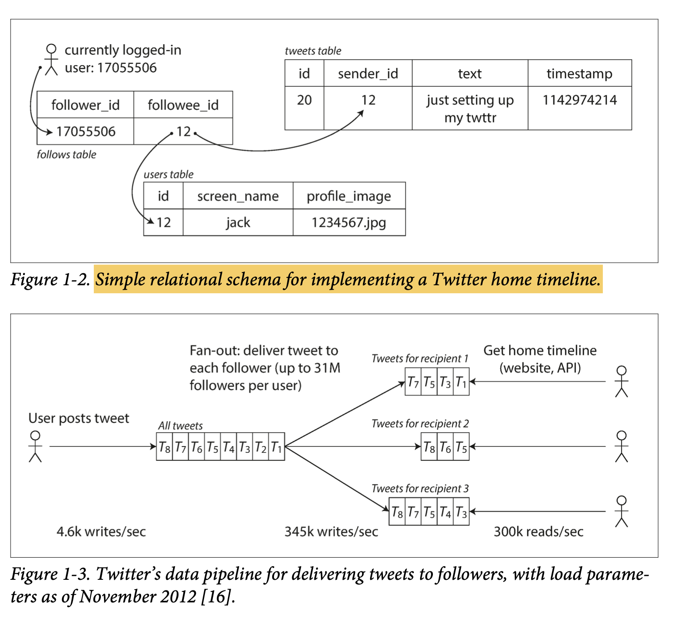
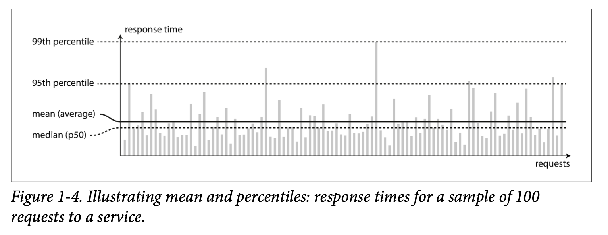
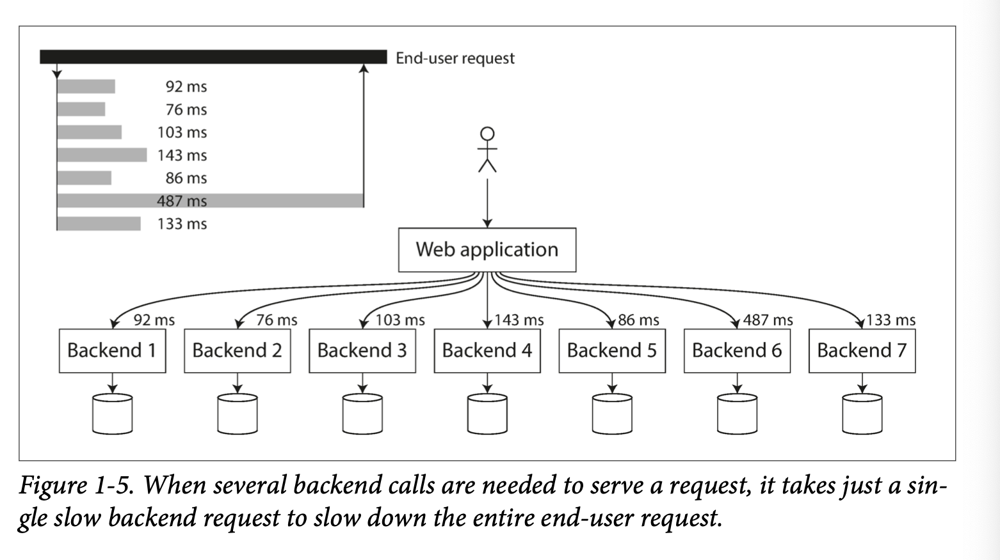

# Chapter 1 Reliable, Scalable, and Maintainable Applications

#### Summary

In short, reliable is work under failure. And there are three kinds of faults, 1. hardware error, like disk, network or machine failure. 2, software error like bugs in a system. 3,human operations, like incorrect operation or wrong access control

#### Reliability

And in corresponding, we have several ways to deal with. First is to set access control(ACL) to prevent unauthorized or accidental changes. Second is fully featured non-production sandbox environments, we can have load-testing in it, without affecting users. Third, we can use continuous integration and continuous deployment (CI/CD) with automatic testing to identify why faults may occur, and in the next version, we can add into automatic testing. Fourth is to set up detailed and clear monitoring, like performance metrics and error rates. Last one is to roll out a new feature gradually, we can send to small subset of user first, if it is ok, then we send to more and more users rather than send to all user at one time, so unexpected bugs affect only a small subset of users.

#### Scalability

scaling up (vertical scaling, moving to a more powerful machine) like get better cpu or server and scaling out (horizontal scaling, distributing the load across multiple smaller machines) like get more servers.

### load

**requests per second to a web server, the ratio of reads to writes in a database, the number of simultaneously active users in a chat room, the hit rate on a cache...**

Example in Twitter, it has two operations:

1. Post tweet. A user can publish a new message to their followers (4.6k requests/sec on average,  over 12k requests/sec at peak), 
2. Home timeline.A user can view tweets posted by the people they follow (300k requests/sec)

Posting a tweet simply inserts the new tweet into a global collection of tweets. When a user requests their home timeline, look up all the people they follow, find all the tweets for each of those users, and merge them (sorted by time)

it's like want to get all Posts published by the users that I followed.

```sql
SELECT tweets.*, users.* FROM tweets
JOIN users ON tweets.sender_id = users.id 
JOIN follows ON follows.followee_id = users.id 
WHERE follows.follower_id = current_user
```

This way, the systems struggled to keep up with the load of home timeline queries.

And the better strategy is when a user posts a tweet, look up all the people who follow that user, and insert the new tweet into each of their home timeline caches. The request to read is cheap but posting a tweet now requires a lot of extra work.



### Performance

**throughput** the number of records we can process per second, or the total time it takes to run a job on a dataset of a certain size.

throughput #Request/ per second

Response time: meansure the system scale, when a client sends a request to server, the time server handle request and response back.

Latency, when requests are sent to server, some requests may need to wait for handle, so this is latency. In short is the duration that a request is waiting to be handled.

### Percentile



variation: 

random additional latency could be introduced by a context switch to a background process, the loss of a network packet and TCP retransmission, a garbage collection pause, a page fault forcing a read from disk, mechanical vibrations in the server rack

Usually, we looked at *95th*, *99th*, and *99.9th* percentiles are common (abbreviated *p95*, *p99*, and *p999*)

#### tail latencies



Even if only a small percentage of backend calls are slow, the chance of getting a slow call increases if an end-user request requires multiple back‐ end calls, and so a higher proportion of end-user requests end up being slow

当一个请求需要多个后端服务支持时，即便大部分后端服务响应迅速，只要其中有一个服务响应较慢，整个用户请求的响应时间也会被拖慢。这种现象在多后端分布式系统中很常见，称为“尾部延迟”问题

### Maintainability

We focus on these three design principles,*Operability* ,*Simplicity* ,*Evolvability*

# CHAPTER 2 Data Models and Query Languages

SQL: relation SQL, IMS

##### SQL

NoSQL: Document model(JSON, HTML), 

(coding) OOP <-ORM->SQL (storage)

Mybatis, JDBC

##### NoSQL

Relational Model Versus Document Model

SQL: data is organized into *relations* (called *tables* in SQL), where each relation is an unordered collection of *tuples* (*rows* in SQL).

Object-Relational Mapping (ORM) is a technology used to simplify data interaction between the object model (Object Model) and the relational database (Relational Database). Its main function is to allow developers to use an object-oriented approach to operate databases in applications without directly writing cumbersome SQL queries or managing complex data conversion logic.

# Chapter 3 Storage and Retrieval

### Primary Index/ Secondary Index

Primary Index (Cluster Index) is the physical storage order.

Secondary Index(Non-Cluster Index), that stores the indexed column’s values (e.g., Name) in sorted order, along with pointers to the actual data rows. It does not affect the physical storage order of the table and allows for efficient lookups and range queries on the indexed column.

```
StudentID	Name	Grade
1	Charlie	78
2	Alice	85
3	David	88
4	Bob	92
```

Cluster Index `{1: Charlie}, {2: Alice}, {3: David}, {4: Bob}`

Non-Clustered Index

```
Alice    -> 指向 StudentID = 2
Bob      -> 指向 StudentID = 4
Charlie  -> 指向 StudentID = 1
David    -> 指向 StudentID = 3
```

```sql
SELECT * FROM Students WHERE Name = 'Charlie';
#数据库首先使用 Name 列的非聚簇索引定位到 “Charlie” 对应的 StudentID = 3。
#然后通过 StudentID 到物理存储的数据行（主键为聚簇索引的行）中找到完整记录：
{ StudentID: 3, Name: Charlie, Grade: 78 }
```

非聚簇索引只存储索引列（Name）和指针（StudentID）

为了获取完整的行数据（如 Grade 列），数据库需要**回表**，即根据索引指针访问聚簇索引存储的实际数据行

Create

```sql
CREATE TABLE Students (
    StudentID INT PRIMARY KEY,  -- By default, this creates a clustered index
    Name NVARCHAR(50),
    Grade INT
);

CREATE INDEX idx_name ON Students (Name);
```

#### *online transaction processing* (OLTP)

