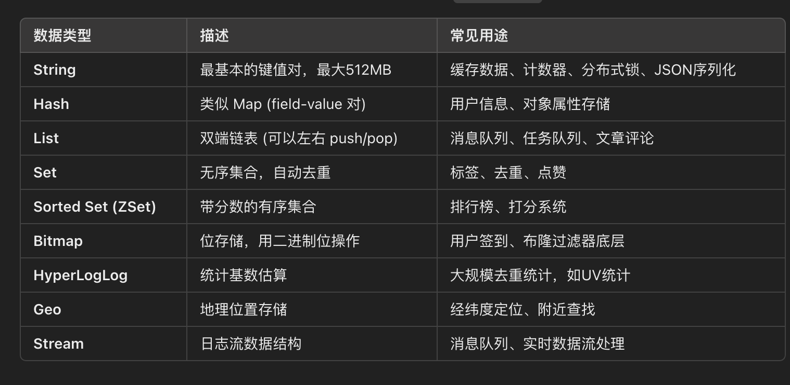
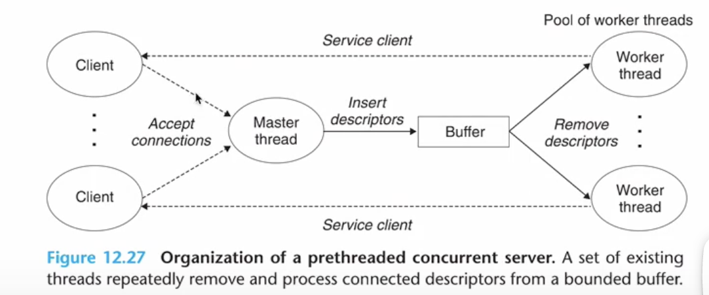
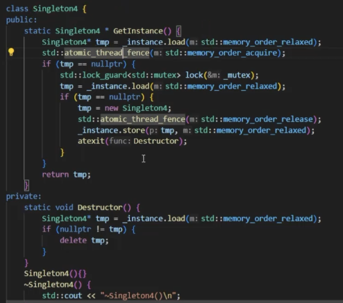
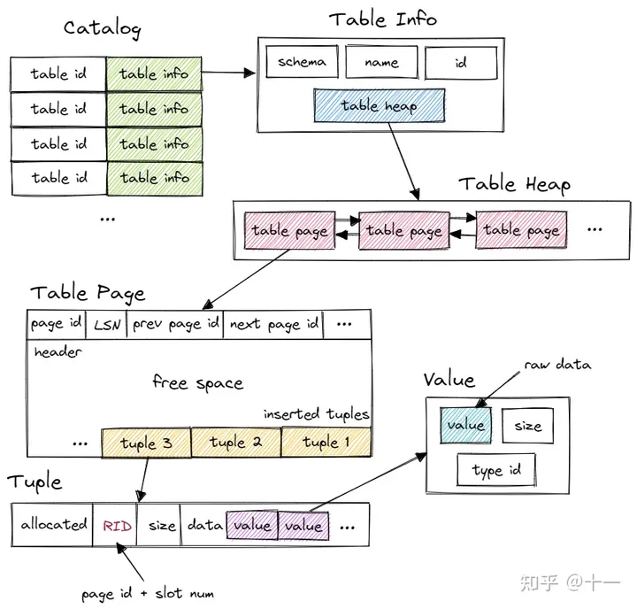
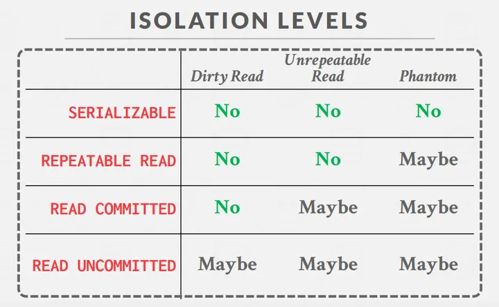

vector什么情况下会迭代器失效？ 

| 操作          | 迭代器是否失效             | 原因               |
| ------------- | -------------------------- | ------------------ |
| `push_back()` | ✅ 若容量不足会失效         | 扩容后底层地址变动 |
| `insert()`    | ✅ 插入点及之后的迭代器失效 | 元素右移           |
| `erase()`     | ✅ 删除点及之后迭代器失效   | 元素左移           |
| `clear()`     | ✅ 全部失效                 | 所有元素销毁       |
| `resize()`    | ✅ 若扩容触发重新分配       | 重新分配内存       |

队列链表状态如何保证并发性 

socket第三次握手没收到包会处于什么状态？

**客户端**：认为连接建立完成（进入 `ESTABLISHED`）

**服务端**：仍处于 `SYN_RCVD` 状态，等待 ACK

python的对象之间is和==什么区别

```
print(a == b)  # True，内容相同
print(a is b)  # False，不是同一对象
```

# AB test

Apache Benchmark

```shell
brew install httpd
ab -n 10000 -c 500 http://127.0.0.1:8080/user/info
```

`-n 1000`：总共发出 **1000 个请求**

`-c 100`：**并发数为 100**（即同时最多有 100 个请求进行）

```shell
Server Software:        nginx/1.18.0
Server Hostname:        127.0.0.1
Server Port:            8080

Document Path:          /user/info
Document Length:        123 bytes

Concurrency Level:      500
Time taken for tests:   8.312 seconds
Complete requests:      10000
Failed requests:        0
Total transferred:      2350000 bytes
HTML transferred:       1230000 bytes
Requests per second:    1202.34 [#/sec] (mean)
Time per request:       415.60 [ms] (mean)
Time per request:       0.83 [ms] (mean, across all concurrent requests)
Transfer rate:          276.84 [Kbytes/sec] received

Connection Times (ms)
              min  mean[+/-sd] median   max
Connect:        0    1   0.5      1       4
Processing:   100  350 100.0    320     850
Waiting:       90  340  95.0    310     800
Total:        101  351 100.0    321     852

Percentage of the requests served within a certain time (ms)
  50%    321
  66%    340
  75%    380
  80%    400
  90%    500
  95%    600
  98%    700
  99%    800
 100%    852 (longest request)

```


# Python

```python
import sys
D = list(map(int,sys.stdin.readline().split()))
a,b,c = map(int,sys.stdin.readline().split())
list = []
```

# Java from scratch

基本类型 byte, short, int, long, float, double, char, boolean

存在栈（stack）里，性能高，不能为 `null`

一切类（`String`, `Integer`, `List` 等）

存在堆（heap）里，通过引用访问

可以为 `null`

| 基本类型  | 包装类      |
| --------- | ----------- |
| `byte`    | `Byte`      |
| `short`   | `Short`     |
| `int`     | `Integer`   |
| `long`    | `Long`      |
| `float`   | `Float`     |
| `double`  | `Double`    |
| `char`    | `Character` |
| `boolean` | `Boolean`   |

`Integer b = Integer.valueOf(a);`

Arrays.sort, Collections.sort

Collections的话需要用get! append

Collections.swap(list, i, j)

Collections.reverse(list)

Collections.sort(list)

Map的话有`keySet()`, `values()`, `entrySet()`

```java
for(Map.Entry<Integer,Integer> entry: map.entrySet()){
		entry.getKey();
		entry.getValue();
}

map.containsKey()
map.getOrDefault(1,"x");
map.computeIfAbsent(1,k->new LinkedHashMap<>()).put(key,value);
//alternative way
map.putIfAbsent(1,new ArrayList<>());
map.get(1).put(key,value);
```

### iterator

```java
iterator like dummy node
map.keySet().iterator().next();
map.merge(k,1,Integer::sum) // m[k]+=1
```


```java
Iterator<Integer> it = map.keySet().iterator();
while(it.hasNext()){
  	it.next();
}
```

```java
map.forEach((k, v) -> System.out.println(k + " -> " + v));
```


### int[]

```java
int[][] matrix = new int[3][4];
int[][] grid = {{1,2,3},{4,5,6},{7,8,9}};
```

```java
Arrays.sort(nums);               // 排序
Arrays.fill(nums, 0);            // 填充
Arrays.copyOf(nums, newSize);    // 复制
Arrays.binarySearch(nums, key);  // 二分查找（数组必须已排序）
```

### String

```java
StringBuilder a = new StringBuilder();
a.append();
a.toString();
//删除 
a.delete(5, 11);  //delete index from 5 to 10

String ans="";//必须初始化
ans+=...;
```

获取字符

`a.charAt(0);` 不可修改

`a.setCharAt(0,'h')` 如果是StringBuilder可以修改

### StrngToInt, IntToString

`Integer.parseInt(s);`

`Integer.toString(s);`

`String.valueOf()`

### Compare

String 比较`compareTo()`

String 比较 `equals()`

这里不能 `==`! 这个比较的是对象！

### Object

`hashCode`

`equals`

`getClass`

`clone`

`toString()`

`notifyAll()`

`wait()`


# TimSort

TimSort = MergeSort+InsertSort

稳定排序

- **插入排序**：对小规模数据效率很高
- **归并排序**：对大规模数据稳定高效

# 我写的全是bug的java代码！

```java

class Solution {
    public String largestNumber(int[] nums) {
        int len = nums.length;
        String[] tmp = new ArrayList<>()

        int cntZero = 0;
        for (int i = 0; i < len; i++) {
            if (nums[i] == 0) cntZero++;
            tmp.add(nums[i].toString());
        }

        for (int i = 0; i < len; i++) {
            for (int j = i + 1; j < len; j++) {
                if ((tmp[i] + tmp[j])<(tmp[j] + tmp[i])) {
                    String mid = tmp[i];
                    tmp[i] = tmp[j];
                    tmp[j] = mid;
                }
            }
        }

        if (cntZero == len) return "0";
        String ans;
        for (int i = 0; i < len; i++) {
            ans=ans+tmp[i];
        }
        return ans;
    }
}


import java.util.*;

class Solution {
    public String largestNumber(int[] nums) {
        int len = nums.length;
        String[] tmp = new String[len];
        for(int i = 0; i < len; i++){
            tmp[i] = String.valueOf(nums[i]);
        }
        // 排序
        Arrays.sort(tmp, (a, b) -> (b + a).compareTo(a + b));

        // 如果最大的元素是0，说明所有元素都是0
        if(tmp[0].equals("0")) return "0";

        StringBuilder ans = new StringBuilder();
        for(String s : tmp){
            ans.append(s);
        }
        return ans.toString();
    }
}

```

```java
int[] nums = new int[10];
```

`int[]` 是数组类型，**只能用数组初始化**，不能直接赋值一个 `ArrayList`

- `String` 是对象类型，你可以声明数组：

```
String[] arr = new String[5];  // 长度为5，元素默认是 null
String[] arr = new ArrayList<>(); // ❌ 不合法
```

- 对象如果想用动态长度的集合，需要用 `List`：

```
List<String> list = new ArrayList<>();
list.add("abc");
```

- `List` 可以动态扩容，而数组长度固定

#### 排序

**`Arrays.sort`**

- **适用对象**：数组（`int[]`, `String[]`, `Integer[]` 等）

```java
Arrays.sort(arr);
Arrays.sort(arr, (a, b) -> b.length() - a.length());
```

**`Collections.sort`**

- **适用对象**：集合（`List`，如 `ArrayList`, `LinkedList` 等）
- **调用方式**：

```
List<Integer> list = new ArrayList<>(Arrays.asList(5,2,8));
Collections.sort(list); // 升序

List<String> strs = new ArrayList<>(Arrays.asList("apple","banana"));
Collections.sort(strs, (a,b) -> b.length() - a.length()); // 自定义排序
```

- **特点**：
  1. 只能对 **集合（List）** 排序。
  2. 也可以提供自定义 `Comparator`。
  3. 底层：调用 `list.sort(comparator)`，Java 8+ 基于 **TimSort**（稳定排序）

```java
String[] tmp = new String[len];
Arrays.sort(tmp,(a,b)->(a+b).compareTo(b+a));

List<String> tmp = new ArrayList<>();
Collections.sort(tmp,(a,b)->(a+b).compareTo(b+a))
```

然后基本类型没有toString()! 

```java
String.ValueOf(nums[i]);
```

字符串比较

不能 a+b<b+a!

```java
(a+b).compareTo(b+a);
```

String ans;需要初始化！！

```
String ans="";
```

最好用StringBuilder ans=new StringBuilder();

```java
StringBuilder ans = new StringBuilder();
for(String s : tmp){
    ans.append(s);
}
return ans.toString();
```


1. 用户下单 → 订单状态：`新建`
2. 库存扣减 → 库存锁定
3. 订单服务发送 **延迟库存解锁消息** 到 MQ（延迟 1 分钟）
   - 这条消息的逻辑是：**等消息到期后，如果订单还没支付，就解锁库存**

订单创建成功 → 发送延迟消息（比如 1 分钟后投递）

同时订单状态更新（如超时自动取消）也是异步流程

MQ 或消费者有可能**先处理延迟消息，再处理订单状态更新**

```
订单创建 -> 发送延迟解锁消息（消息在 MQ 里排队）
↓
库存服务消费者先于订单服务处理消息
↓
库存服务看到订单状态是“新建”，认为不需要解锁
↓
订单超时取消，库存仍锁定
```

**延迟消息投递到消费者的时间** + **订单状态更新到数据库的时间** → 异步顺序不确定。

1. **双重触发机制**：   - **路径1**：订单取消时 **主动发送库存解锁消息**（强触发）   - **路径2**：库存服务 **定时扫描未解锁的库存**（兜底逻辑） 2. **幂等性设计**：   - 解锁前检查库存的 **当前锁定状态**，避免重复操作。

# RabbitMQ vs Kafka

日志流式存储，强调**高吞吐**和**顺序存储**，消息是**持久化的 log**，消费者自己维护 offset 来决定消费到哪里了。Kafka 本质更像一个**分布式 commit log**

Kafka存的offset，理论上是原数据，消息持久化在磁盘

RabbitMQ存的消息

rabbitmq设置队列TTL推荐，设置消息TTL不推荐（lazy update 问题，消息真正过期只有到达队列头部时才会被投递到 DLX，可能比设定延迟更久）

消息在队列中超过 TTL 没有被消费，会进入死信队列（DLX: Dead Letter **Exchange**）。

死信队列就是你真正要监听的“延时队列”

rabbitMQ 有durable，exclusive，autoDelete没消费者时不会自动删除

需要把Queue和Exchange绑定在一起

# Raft+Zookeeper

Raft项目和Zookeeper，都是kv数据库，但是他们本身能存的空间不大，比如1g左右，基本是用来做配置中心等作用的，但是可以持久化

在绝大多数情况下，批量插入后重建索引的效率远高于逐行插入并维护索引。

Raft：etcd，tikv

ZooKeeper：Hadoop HDFS，用 ZooKeeper 管理 NameNode 的主备切换，Kafka，HBase，Storm

**Raft 的使用场景**：分布式配置中心、服务发现、数据库事务、主备选举、元数据存储

Raft 本质上是一个 **一致性协议**，用于在分布式系统中保持多副本数据的强一致。常见场景：

1. **分布式配置中心 / 服务发现**
   - etcd、Consul
   - 保证集群配置一致，避免出现「一部分节点更新配置，另一部分没更新」的脑裂问题。
2. **分布式数据库 / KV 存储**
   - CockroachDB、TiKV
   - 事务需要保证 **强一致性**（Linearizability），比如银行转账不能出现「一个节点显示扣钱了，另一个节点还没扣」。
3. **分布式协调 / 元数据存储**
   - Kubernetes → etcd 存储整个集群的状态（Pod、Service、ConfigMap 等）。
   - 元数据（谁是 leader、有哪些节点在线）必须一致，否则调度会乱。
4. **主备选举**
   - HDFS NameNode、Kafka Controller（新版本改用 Raft）
   - 保证整个集群只有一个有效的 leader，避免冲突。

# C++构析函数

```c++
class A{
public:
	A(){}
	vritual ~A(){}
};
class B:public A{
public:
	B(){}
	~B(){}
};
A *t = new B();
delete t;
//先A构造，B构造，B构析，A构析(前提是要有virtual)
//不然B无法构析，cause memory leak
```

`t` 的静态类型（编译期类型）：`A*`

`t` 的动态类型（运行时类型）：`B`

`delete t; ` 编译器根据 静态类型 判断调用哪个析构函数，也就是调用A，这里不是virtual就无法调用B就memory leak了

而virtual会有vptr指向vtable，运行时通过 vptr 查找实际的析构函数，这里调用顺序就是`~B,~A`

如果 `~A()` **不是 virtual**：

- `delete t;` 的行为就是「静态绑定」：直接调用 **基类 A 的析构函数**。
- 结果：`B` 的析构函数不会被执行 → **内存泄漏 / 资源未释放**。

如果 `~A()` 是 `virtual`：

- 析构函数地址会被放进 **虚函数表（vtable）**。
- `delete t;` 的时候会查 vtable，**动态绑定**到实际对象的析构函数（先调 `B::~B()`，再调 `A::~A()`）。
- 这样可以保证派生类资源得到正确释放。

# STL

| 容器           | 底层实现                   | 特点                                                         |
| -------------- | -------------------------- | ------------------------------------------------------------ |
| `vector`       | 动态数组                   | 内存连续，支持随机访问（O(1)），尾部插入/删除快（均摊O(1)），中间插入慢（O(n)） |
| `deque`        | 分段数组（数组块指针数组） | 支持头尾插入删除快（O(1)），随机访问快（O(1)），内存不完全连续 |
| `list`         | 双向链表                   | 内存不连续，插入/删除快（O(1)），不支持随机访问              |
| `forward_list` | 单向链表                   | 内存不连续，插入/删除快（O(1)），节省空间（只有一个指针），不支持随机访问 |

| 容器               | 底层实现                                | 特点                                                         |
| ------------------ | --------------------------------------- | ------------------------------------------------------------ |
| `set` / `multiset` | 红黑树（RB-tree，一种自平衡二叉搜索树） | 查找、插入、删除 O(log n)，有序存储，不能重复（set），可重复（multiset） |
| `map` / `multimap` | 红黑树                                  | 查找、插入、删除 O(log n)，键值对存储，有序，key 唯一（map），可重复（multimap） |

| 容器                                   | 底层实现                          | 特点                                         |
| -------------------------------------- | --------------------------------- | -------------------------------------------- |
| `unordered_set` / `unordered_multiset` | 哈希表（bucket + 链表或链地址法） | 插入/查找/删除平均 O(1)，最坏 O(n)，无序存储 |
| `unordered_map` / `unordered_multimap` | 哈希表                            | 插入/查找/删除平均 O(1)，最坏 O(n)，无序存储 |

| 容器             | 底层实现                        | 特点                            |
| ---------------- | ------------------------------- | ------------------------------- |
| `stack`          | `deque` 或 `vector`             | 后进先出（LIFO）                |
| `queue`          | `deque` 或 `list`               | 先进先出（FIFO）                |
| `priority_queue` | 堆（通常是 vector + make_heap） | 优先级队列，最大值/最小值在顶端 |

set 和 multiset的区别就是 key是否唯一，set唯一，multiset允许多个

迭代器是 STL 的抽象，**可以理解为对容器元素的“通用指针”**：

- 对于 `vector`、`deque`，迭代器就是类似指针的对象。
  - `vector`：迭代器就是普通指针。
  - `deque`：迭代器内部可能保存：
    - 当前块指针（指向元素块）
    - 块内偏移量
- 对于链表，迭代器是链表节点指针。
- 对于红黑树（`set`、`map`），迭代器是树节点指针。

**总结**：迭代器 ≈ “封装了容器访问方式的指针”，不同容器实现不同。

queue实现stack

```c++
queue<int> q1;//always empty
queue<int> q2;

int push(int x){
	q1.push(x);
	while(!q2.empty()){
		q1.push(q2.front());
		q2.pop();
	}
	swap(q1,q2);
}

int pop(){
	int r=q2.front();
	q2.pop();
	return r;
}
```

# netty

kafka sendfile

rocketmq mmap

netty 数据直接写入 direct memory，然后cpu拷贝到socket buffer -> DMA 拷贝 网卡

内存池 16MB chunk = 2048个 8kb page 

small subpage >512B

tiny subpage <512B

大内存则直接申请一个大内存区域，用完就释放release，防止内存池占用内存资源

netty 事件循环器 eventloop 

# raft 选举

两个节点都自认为 candidate

因为没人能拿到多数票 → **没有 leader**

election timeout 结束后，两边都会重新发起选举，term +1 → 又可能再次冲突

**无限循环**：就像你说的，可能出现 term 无限递增，但始终没有 leader → 系统无法处理写操作（只能读），这是 Raft 在少数节点不可用时的自然行为。

### 避免无限递增 term

Raft 有一些机制：

1. **随机 election timeout**
   - A、B 的超时不完全同步 → 某一方可能先拿到多数票（如果挂掉的节点恢复参与）
2. **分区恢复后**
   - 当集群多数节点恢复，正常选举可以继续

如果一直少于多数节点 → leader 永远选不出来，term 可能会增长，但不会破坏一致性。

# SQL

```sql
CREATE TABLE order_detail ( 
order_id STRING COMMENT '订单id',
buyer_id STRING COMMENT '买家id',
amount DOUBLE COMMENT '订单金额', 
pay_time STRING COMMENT '支付时间', 
item_id STRING COMMENT '商品id'， 
merchant_id STRING COMMENT '商家id' ) ; 
```

针对双十一期间的（20191111~20191113）交易，写出实现以下要求的SQL（要求1条SQL完成）： 要求：单笔订单金额超过1000.00元的订单数量超过3笔的买家 输出： 商家id，订单数, 总订单金额，总订单金额TOP 3的买家。

**FROM / JOIN** → 先确定基础数据源

**WHERE** → 过滤行（row-level filter）

**GROUP BY** → 按某些列聚合

**HAVING** → 对聚合结果再做条件筛选

**SELECT** → 选择输出列

**ORDER BY** → 排序

**LIMIT / OFFSET** → 最终取前 N 行


Where 行级过滤，having是聚合后过滤，group by 聚合

**COUNT** 是聚合函数，一般出现在 **GROUP BY** 或 **HAVING** 之后

order by total_amount desc limit 3;

范围查找

a<=b AND b<=c 或者 b between a and c;

步骤一 from where

select * from order_detail where pay_time between 20191111 and 20191113 and amount>1000;

步骤二group by 统计每个买家在某个商家下的订单数、总金额

```sql
SELECT
    merchant_id,
    buyer_id,
    COUNT(order_id) AS order_cnt,
    SUM(amount) AS total_amount
FROM order_detail
WHERE pay_time BETWEEN '20191111' AND '20191113'
  AND amount > 1000
GROUP BY merchant_id, buyer_id
having COUNT(order_id)>3
order by total_amount desc
limit 3;
```

SQL 的逻辑执行顺序

FROM → WHERE → GROUP BY → HAVING → SELECT → ORDER BY → LIMIT

所以此时数据库还“不认识”`order_cnt` 这个别名，只能识别聚合函数本身

但是 order by 默认asc升序，而且可以用聚合后的名次 total_amount

# Thrift vs gRPC

#### IDL (Interface Definition Language)

定义`Service`（服务）、`Method`（方法）、`Parameter`（参数）和`Return Type`（返回类型），以及作为参数和返回值的数据结构（`Message`/`Struct`）

- **gRPC**：使用 **`.proto` 文件**，语法是 Protocol Buffers。
- **Thrift**：使用 **`.thrift` 文件**，语法是 Thrift IDL。

**为什么是二进制？**：相比于 JSON、XML 等文本格式，**二进制编码**体积更小、编码解码速度更快，性能极高。

Thrift 默认通常使用 TCP，跨语言支持好

**gRPC** 强制protobuf HTTP/2

HTTP/2，**多路复用 (Multiplexing)**：单个 TCP 连接上可以同时发送多个请求和响应，避免了 HTTP/1.1 的队头阻塞问题，极大提高了连接效率。服务器可以主动向客户端推送数据。

grpc相当于 .proto 规定好parse都规格，引入proto的这个对象，就可以进行parseFrom了

一旦你成功引入了由 `protoc` 编译器根据你的 `.proto` 文件生成的 Java 类（比如 `PersonProto.Person`），这个类**自身就携带了所有序列化和反序列化的能力**

当你编译 `person.proto` 时，`protoc` 不仅仅生成了一个简单的数据容器（只有 `name`, `id`, `email` 字段的 POJO），它生成了一个**功能完备的类**，这个类内部包含了：

1. **数据定义**：所有的字段（如 `String name`, `int id`）。
2. **Builder 模式**：用于构建不可变对象的构建器（`Person.newBuilder()`）。
3. **序列化逻辑**：将对象状态转换为二进制字节流的方法（`toByteArray()`）。
4. **反序列化逻辑**：**静态工厂方法**，用于从二进制字节流重建对象（`parseFrom(byte[] data)`）。

关键点在于：**`parseFrom` 是一个静态方法，它属于生成的类本身**。

```java
// 1. 引入生成的类
import com.example.PersonProto;

public class App {
    public void handleData(byte[] binaryDataFromNetwork) {
        try {
            // 2. 直接使用这个类的静态方法 `parseFrom` 进行反序列化
            // 【核心】这里不需要 new 一个解析器，PersonProto.Person 自己就是解析器！
            PersonProto.Person person = PersonProto.Person.parseFrom(binaryDataFromNetwork);

            // 3. 使用对象
            System.out.println("Hello, " + person.getName());

            // 4. 需要发送时，直接调用对象实例的方法 `toByteArray` 进行序列化
            byte[] dataToSend = person.toByteArray();
            // ... 发送 dataToSend ...

        } catch (InvalidProtocolBufferException e) {
            e.printStackTrace();
        }
    }
}
```

# kafka实现delayqueue

消息级别延时 = 消息带延迟时间 + 消费者判断延迟时间

### 消息层面 delay

检查当前时间是否 >= `deliverAt`

如果到时间 → 执行业务逻辑

如果未到 → 放回本地延迟队列（PriorityQueue）或者重新投回延迟 Topic / DLQ

> 优点：简单可控
>  缺点：延迟精度取决于消费者轮询频率或扫描策略

### 延迟 Topic + 定时扫描

- 为不同延迟等级创建不同 Topic 或分区
- 消费者定时扫描 Topic / Partition
- 到期的消息再转发到业务 Topic 或直接执行

> 适合延迟等级固定的场景（如 1s、5s、30s）
> 精度取决于扫描频率

### DLQ（Dead Letter Queue）+ 延迟执行

1. 消息到业务 Topic 后，如果延迟未到：
   - 投递到 DLQ 暂存
2. 定时任务或专门消费者扫描 DLQ：
   - 消息到期 → 投回业务 Topic 执行

> 优点：利用 Kafka 本身可靠存储，无需额外数据库
>  缺点：延迟精度受扫描频率影响，消费逻辑复杂

# Threadpool

Core, Max 之类一般Max>=Core

time，unit，blockingQueue，abortPolicy，ThreadFactory

如果max==core就是线程数就固定不再增加

newCachedThreadPool

`ThreadPoolExecutor(0, Integer.MAX_VALUE, 60s, SynchronousQueue, defaultHandler)`

newFixedThreadPool

`ThreadPoolExecutor(n, n, 0L, LinkedBlockingQueue, defaultHandler)`

newScheduledThreadPool

`ScheduledThreadPoolExecutor(corePoolSize=n)`

用的delayqueue

newSingleThreadExecutor

`ThreadPoolExecutor(1, 1, 0L, LinkedBlockingQueue, defaultHandler)`

| 线程池类型           | 核心线程数 | 最大线程数        | 队列类型            | 适用场景             | 参数配置策略                    |
| -------------------- | ---------- | ----------------- | ------------------- | -------------------- | ------------------------------- |
| CachedThreadPool     | 0          | Integer.MAX_VALUE | SynchronousQueue    | 瞬发短任务           | 默认即可，注意长任务膨胀        |
| FixedThreadPool      | n          | n                 | LinkedBlockingQueue | 稳定线程处理持续任务 | CPU密集：核数；IO密集：核数*2~3 |
| ScheduledThreadPool  | n          | n                 | DelayedWorkQueue    | 延迟/周期任务        | 根据任务数量和耗时估算 n        |
| SingleThreadExecutor | 1          | 1                 | LinkedBlockingQueue | 顺序任务             | 一般不用改                      |

# 线程池抛出未catch异常

也就是一个线程抛出uncatchable exception，**中断执行**意味着任务立即结束 → 不会一直占用资源，也就是执行下一个任务，threadpool 相当于无事发生

- **异常会直接抛到工作线程里**，线程池会调用该线程的 **UncaughtExceptionHandler**
- 默认行为是打印异常堆栈（stderr），不会传播到调用 `execute()` 的主线程
- 线程不会退出，而是被复用继续执行下一个任务（除非异常导致线程挂了，线程池会补充新线程）

你会在日志里看到异常，但主线程不会捕获到

**不会导致线程池崩溃**。线程池会认为“这个任务执行完了”，异常只是任务的事

如果异常是致命的（比如 `OutOfMemoryError`），可能导致 JVM 不稳定，但那不是线程池特有的问题

- 如果用 `execute`：可以给线程设置 `UncaughtExceptionHandler`。
- 如果用 `submit`：要么显式调用 `Future.get()`，要么自定义 `ThreadFactory` 捕获异常。
- Spring 里常用 **`afterExecute` 回调** 或 **重写 `ThreadPoolExecutor`** 来统一处理。

# -Xmx和-Xms

-Xms 并不会在运行时“转换”成 -Xmx。它们定义的是堆内存的两个不同边界：初始大小和最大大小。JVM 会根据需要在这两个值之间动态调整堆的大小

JVM 的堆由垃圾收集器（Garbage Collector, GC）管理。当设置 `-Xms < -Xmx` 时，堆不是固定的，而是会动态增长。这个过程主要由 GC 驱动

生产环境里强烈建议将 `-Xms` 和 `-Xmx` 设置为相同的值，因为扩容内存开销非常昂贵

# Mutex实现read write lock

```c++
mutex m;
mutex readm;
int cnt=0;
void read_lock(){
		lock_guard<mutex> lock(readm);
		cnt++;
	  if(cnt==1){
				m.lock();
		}
}
void read_unlock(){
		lock_guard<mutex> lock(readm);
		cnt--;
	  if(cnt==0){
				m.unlock();
		}
}
void write_lock(){
		m.lock();
}
void write_unlock(){
		m.unlock();
}
```

# Hydfs

Zipfian高频先，顺序从高到低

# Static Final

- `final` 修饰的变量一旦赋值，就 **不能被修改**。
- 对象引用加 `final`，引用不可变，但对象本身可以修改。
- 方法加 `final` → 不可被重写
- 类加 `final` → 不可被继承

# 淘宝分库分表方案（用户/商家订单）

**方案设计：**

*   **分库策略：**
    *   **按业务拆分：** 创建`用户订单库`和`商家订单库`。
    *   **按ID哈希分库：** 在`用户订单库`内部，按`用户ID`哈希分库/分表；在`商家订单库`内部，按`商家ID`哈希分库/分表。
*   **路由层：** 引入中间件（如ShardingSphere, MyCat）或自研路由服务。根据查询条件（如`user_id`或`seller_id`）自动将请求路由到正确的数据库和表。
*   **分布式查询：** 对于需要跨库/跨表的查询（如平台级报表），通过中间件聚合结果或导入数仓（如Hive, Spark）处理。

# 高并发库存系统设计

- **悲观锁**：先上锁再操作 —— `SELECT ... FOR UPDATE`
- **乐观锁**：先操作再校验 —— `UPDATE ... WHERE version = ?`


**设计思路：**

* **抗读压力：** 将库存数量缓存到Redis中。读请求直接读缓存。

* **保证写一致性（防超卖）：**

  * **方案一（Redis原子操作）：** 在Redis中利用 `DECR` 或 `LUA` 脚本执行原子性的扣减操作，扣减结果大于等于0才成功。

  * **方案二（数据库悲观锁）：** `SELECT ... FOR UPDATE` 锁住库存行，然后扣减。

    * ```sql
      -- 1. 开始事务
      START TRANSACTION;
      
      -- 2. 【关键步骤】查询并锁定要购买的商品记录
      -- 其他想要购买同一商品的事务执行到这一步会被阻塞，直到当前锁释放
      SELECT stock FROM products WHERE id = 1 FOR UPDATE;
      
      -- 3. 应用层检查库存是否大于0
      -- (假设检查通过，stock > 0)
      
      -- 4. 更新库存（减少1）
      UPDATE products SET stock = stock - 1 WHERE id = 1;
      
      -- 5. 生成订单等后续操作...
      -- INSERT INTO orders ... 
      
      -- 6. 提交事务，释放锁
      COMMIT;
      ```

  * **方案三（数据库乐观锁）：** 在库存表中增加版本号字段，更新时带版本条件：`UPDATE stock SET quantity = quantity - 1, version = version + 1 WHERE product_id = ? AND version = ? AND quantity > 0`。

    ```sql
    -- 1. 开始事务 (有时甚至可以不用事务，取决于业务复杂度)
    START TRANSACTION;
    
    -- 2. 查询商品信息和当前的版本号 (注意：这里不加锁！)
    SELECT stock, version FROM products WHERE id = 1;
    
    -- 3. 应用层检查库存 (stock > 0)
    -- (假设检查通过)
    
    -- 4. 【关键步骤】更新库存，并校验版本号
    -- 在UPDATE的WHERE条件中，必须包含我们之前读取的版本号
    UPDATE products
    SET stock = stock - 1,
        version = version + 1 -- 版本号自增
    WHERE id = 1
    AND version = #{old_version}; -- #{old_version} 是第二步查询出来的版本号值
    
    -- 5. 检查上一步UPDATE语句的“影响行数”(affected rows)
    -- 如果 affected_rows == 1，说明更新成功，版本号匹配，没有冲突。
    -- 如果 affected_rows == 0，说明更新失败！WHERE条件不成立（版本号对不上或库存不足），意味着在我们读取后，已经有其他事务成功修改了数据。
    
    -- 6. 如果更新成功，提交事务并生成订单。
    COMMIT;
    
    -- 7. 如果更新失败，回滚事务，并告诉用户“抢购失败，请重试”。
    -- 通常这里会配合重试机制（Retry），比如自动重试3次。
    ROLLBACK;
    ```

    

* **异步同步：**  Redis中扣减成功后，通过消息队列异步通知应用去更新数据库库存，最终保持一致。

* **防恶意请求：** 在网关层或缓存层对用户/IP进行限流。

# 超卖

**解决思路：**

*   **核心：** 将“查询库存”和“扣减库存”这两个操作做成一个**原子操作**。
*   **方案：**
    1.  **数据库乐观锁：** 见第16点。
    2.  **数据库悲观锁：** `SELECT ... FOR UPDATE`。
    3.  **Redis原子操作：** 在Redis中预存库存，利用 `DECR` 或 `LUA` 脚本扣减。
    4.  **队列串行化：** 将所有下单请求放入一个队列，由一个进程逐个处理，自然串行。

# 雪花算法数据倾斜问题

这里的“分布不均”指的是**作为分片键的ID，其本身的值不够随机，导致数据无法均匀地散列到所有分片（机器）上**，从而引发**数据倾斜**问题

**避免直接使用ID的低位进行取模，而是让分片路由依赖于一个更加随机均匀的散列值**。

不要用 `orderId % N`，而是用 `hash(orderId) % N`

如果序列号满了，时钟前拨，可能会导致超前，但是可以接受

#  商品秒杀库存设计（减库存环节）

**设计思路：**

*   **前提：** 库存数量（1000万）提前预热到Redis中。
*   **核心流程：**
    1.  用户发起秒杀请求，先进行风控、验证码等校验。
    2.  **Redis预扣库存：** 在Redis中使用 `DECR` 或 `LUA` 脚本执行原子操作：`if (redis.call('get', stock_key) >= '1') then return redis.call('decr', stock_key) else return -1 end`。扣减成功才进入下一步。
    3.  秒杀资格写入MQ，通知后续服务异步生成订单、真实扣减数据库库存等。
*   **优势：** Redis性能极高，原子操作防止超卖，异步处理订单缓解数据库压力。

# HBase

HManager 负责Region的分配及数据库的创建和删除等操作

RegionServer 读写的

zookeeper 负责维护集群的状态，更新本地缓存表，找到查找的region server再连接查询

# es 如何检索的？如何更新？是不是有商品加入就直接存检索？如果商品数量非常大呢？全部存进去？es是db还是内存？

当你搜索时，ES 并不是扫描所有文档，而是直接根据倒排表定位哪些文档包含搜索词，从而能在海量数据中快速检索。合并topk

- ES 的更新机制其实是 **写入新文档 + 标记旧文档为删除**。
- 底层是 **Lucene segment**，segment 是不可变的，一旦写好不会再修改。
- 所以更新时：
  1. ES 把新文档写入一个新的 segment。
  2. 把旧文档标记为 deleted（不会立即物理删除，而是靠后续合并 `merge` 时清理）。
- 这样做的好处是避免了随机写操作，适合高并发写入。

### 是不是商品加入就直接存检索？

- 是的，一般场景是 **商品服务** → **Kafka/消息队列** → **ES**。 商品新增或更新时会同步写入 ES，用来支持搜索。
- 但并不会只存在 ES 里，通常 **业务数据库 (MySQL, PostgreSQL, etc.)** 才是主存储，ES 只是副本用于检索。

### 如果商品数量非常大，怎么办？

- ES 可以存非常大的数据，原理上没有“全部放内存”的限制。
- 它的数据存储在 **磁盘 (SSD/HDD)**，同时用 **内存 (JVM heap + OS page cache)** 来加速：
  - 倒排索引和一些数据结构会尽量缓存到内存。
  - 热数据在内存，冷数据在磁盘，检索时按需读取。
- 为了支撑海量数据，需要：
  - **分片 (shard)**：一个索引可以切分成多个 shard，分布在不同节点。
  - **集群 (cluster)**：多个节点协作，分布式存储和检索。
  - **冷热分层 (hot/warm/cold node)**：频繁访问的数据放在 SSD 节点，历史数据放在便宜的 HDD 节点。

### **ES 是 DB 还是内存？**

Elasticsearch 的数据既存储在内存中，也存储在磁盘上

为了查询快，会**大量依赖内存缓存**（比如 JVM heap、Lucene 的缓存、OS 的 Page Cache）

热数据一般常驻内存，冷数据才会从磁盘读取

- ES 本质上是一个 **分布式搜索引擎**，底层用 **Lucene** 管理数据。
- 数据确实会持久化到 **磁盘**（不是只在内存），但同时 heavily 依赖 **内存缓存** 来保证查询速度。
- 可以看作是 **带搜索功能的 NoSQL 数据库**，但不建议把它当作唯一的主存储。

# Web accelerate

 12 种主流网站前端性能优化技巧，包括服务器、CDN、Nginx配置、HTTP 协议升级、代码压缩、加载策略、网站性能分析

1. 升级带宽（**加钱！！！**）
2. CDN缓存（媒体资源或整套网站）。缺点：流量计费贵。
3. 浏览器缓存解决重复访问问题
4. 升级到http/2，支持多路复用
5. 压缩资源，如图片->webp，压缩代码等，减少20%以上体积
6. js压缩，tree shaking静态分析把代码里没用到的压缩掉，减少js的体积
7. gzip压缩
8. **延迟加载**，如懒加载，适合长页面和图片较多的网站。
9. **按需加载**，利用代码分割技术，访问哪个页面就加载哪个页面的代码
10. **分层加载**，先快后好，实现方式一：缩略图，列表页显示低清小图，实现方式二：渐进式加载，先显示模糊的预览
11. **预加载**，在首页先预加载一点详情内容，要权衡
12. **请求合并**，请求聚合，所有小图标合并为一张图片等

网站缓存体系，CDN解决地理距离问题，浏览器缓存解决重复访问问题，建议结合使用

Http1.1 可以建立多个连接，但是每个连接内的请求必须按照顺序处理，容易产生队头阻塞问题

http2 多路复用 可以同时处理多个请求

# Python await/asyncio

根本上只有一个执行线程？在不断看当前哪个可以执行

**Python 的 asyncio/协程模型**：本质就是单线程（+ 单进程），没有额外开线程。

事件循环（event loop）就在这一个线程里运行，它的任务就是不停地 **检查任务队列 → 找出能执行的任务 → 执行一点点 → 挂起/切换到下一个**。

当 Python 遇到 `await`：

1. 挂起当前协程，把控制权交给事件循环；
2. 事件循环调度其他协程；
3. 等待的任务完成后，再切回到原协程继续执行。

# MapReduce  fku!!

map+shuffle+reduce

在经典的 MapReduce（比如 MIT 6.824 或 Hadoop）中，每个 Map Task 的输出会被**按 key 分区**写到不同的文件中：

`mr-[mapTaskId]-[reducePartitionId]`

相同的 key **一定会被分到同一个 reducePartitionId**

Reduce Task i 只需要读取所有 `mr-*-i` 文件

但是会有中间文件数量爆炸的问题，hadoop一般会本地merge+shuffle优化

**影响 MapReduce 的因素**

- **哈希函数**：保证 key 分布均衡，否则可能出现数据倾斜（某个 Reduce Task 处理超多 key）
- **文件存储与网络传输**：中间结果往往先存本地，再由 Reduce Task 拉取（shuffle 阶段），这决定了 IO 开销
- **任务容错**：Map/Reduce 失败会重试，因此中间文件需要持久化
- **Reduce 数量的选择**：太少 → Reduce Task 很慢；太多 → 文件过多 & 管理成本高

# MapReduce VS streaming Process

| 特性         | MapReduce                              | 流式处理（如 Flink, Spark Streaming）            |
| ------------ | -------------------------------------- | ------------------------------------------------ |
| **数据输入** | 批处理（静态文件，如 HDFS 上的 log）   | 流数据（Kafka、Socket、消息队列）                |
| **计算模型** | Map → Shuffle → Reduce，阶段性 barrier | 持续 operator pipeline（map/filter/join/window） |
| **延迟**     | 高（分钟级到小时级）                   | 低（毫秒到秒级）                                 |
| **结果**     | 批量结果输出                           | 持续增量结果                                     |
| **存储依赖** | 依赖分布式文件系统（HDFS）             | 依赖消息系统（Kafka）或内存态存储                |
| **典型应用** | 离线日志分析、统计报表                 | 实时监控、风控、推荐系统实时更新                 |

**MapReduce** 是 **大批量离线分析**

**流式框架** 是 **实时计算 & 在线反馈**

# Spark 与 Flink

### Spark 的实现原理

**核心思想：RDD (Resilient Distributed Dataset)**

- RDD 是一种**不可变的分布式数据集**，由一系列分区组成。
- 支持两类操作：
  - **Transformation**（惰性计算，比如 map/filter/join，不会立即执行）
  - **Action**（触发执行，比如 collect/saveAsTextFile）
- 这让 Spark 可以在执行前构建 **DAG（有向无环图）**，优化执行计划，减少数据传输

**容错机制：Lineage**

- RDD 不会直接存中间结果，而是记录“如何从父数据集算出来”。
- 如果某个分区丢了，可以**回溯 lineage**，重新计算。
- 避免了 Hadoop 那种必须写磁盘的高 IO 开销。

**执行模式**

- Spark 把作业划分为 **Stage**（阶段），每个 Stage 内部是 pipeline（task 并行执行）。
- Stage 之间由 **shuffle** 分隔（数据需要全局重新分区）。
- 执行时，Driver 负责任务调度，Worker 节点运行 Task。

**Spark Streaming**

- 其实是 **微批处理 (micro-batch)**。
- 把实时流切成小 batch（比如 1s 一批），每个 batch 当成一个 RDD 去处理。
- 优点：复用 Spark 批处理引擎，易于实现；缺点：延迟不够低（秒级）

## Flink 的实现原理

**核心思想：流处理优先，批处理只是流的一种特例**

- Flink 认为 **所有数据本质上都是流**：
  - 批数据 = 有界流（文件，读取完就结束）
  - 实时流 = 无界流（Kafka，一直有数据进来）
- 因此，Flink 把 API 都基于 **DataStream/DataSet**。

**Pipeline 执行模式**

- 不像 Spark 要等到一个 Stage 完结，Flink 的 operator 是 **真正的流式管道**。
- record 进来后就可以被下游立即消费，不需要等批次。
- 延迟通常可以做到毫秒级。

**状态管理与容错**

- 流式计算需要保存 **窗口状态、聚合状态**。
- Flink 使用 **RocksDB/内存** 作为状态后端，并通过 **checkpoint + exactly-once** 保证语义。
- 容错机制：周期性保存快照，如果故障就回滚。

**时间语义**

- Flink 支持 **事件时间 (event time)**，而不仅是处理时间 (processing time)。
- 可以处理乱序数据（比如 Kafka 消息延迟到达），通过 watermark 技术来保证窗口正确。

# Batch process

**Spark**：基于内存的计算，减少磁盘 IO，速度比 MapReduce 提高几十倍

**Flink（有界流模式）**：把批看作“有界流”，执行上比 MapReduce 更流畅（pipeline 而不是阶段性 barrier）。

**Presto / Hive on Tez**：更适合 SQL 查询场景。

# HDFS

**“如何让一个写和一个删同时进行？”**
 用 **MVCC + Copy-on-Write + 原子提交**：写产生新片段，删写 tombstone，双方都只改**元数据版本**，由 CAS/事务保证原子性和顺序；读者靠快照保持一致性。

**“如果两个部分不重叠呢？”**
 用 **区间级冲突检测**：不重叠即可直接并发提交（后到者做一次合并提交）；重叠则回滚重试或让上层排它。

### 并发协议（写 vs. 删）

1. **开始**：写者W、删除者D都读取 `FileMeta(version=N)`，得到同一个快照。
2. **各自准备 delta**
   - 写者 W：把要写入的数据落到新 data_file 中，形成 `add_extents`（不触碰已存在片段）。
   - 删除者 D：把要删除的逻辑区间转成 tombstone 片段（可能切分现有 extents）。
3. **提交（两段式 + CAS）**
   - 都向 **元数据服务（NameNode/协调服务）** 发提交：`CAS(base=N -> N+1)`。
   - **谁先提交成功**，元数据就从 N → N+1。
   - **后提交者** 需 **重放/合并** 变化：读取 N+1 的 FileMeta，检查与自己 delta 是否**区间冲突**：
     - **不重叠** ➜ 生成合并后的新 delta，尝试 `CAS(N+1 -> N+2)`，成功并发完成。
     - **有重叠** ➜ 冲突：按策略 **回滚并重试**（或让上层决策先写后删/先删后写）。
4. **读者**：携带 `snapshot=N` 或“读最新已提交版本”，因此永远读到一致视图。

> 这就是 **“乐观并发 + 区间级冲突检测”**：不重叠可并发，重叠需重试。

### 如果你不想做“合并 + 重试”，也可以做 **区间锁（range lock）**：

- 写操作锁定 [L1,R1)，删操作锁定 [L2,R2)；锁管理器允许**不重叠区间并发**。
- 缺点：锁粒度设计、死锁与饥饿处理复杂，吞吐不如乐观并发。


HDFS 原生语义里“写入进行中就不允许删除同一文件”（lease 保护）；要想支持“**一边写、一边删除部分内容**”，通常要在 HDFS 之上做一层 **MVCC/CoW（Copy-on-Write）式的逻辑文件层**。下面给你一套可落地的设计，顺便回答“**不重叠时能否并发**”

### Lease（租约）机制

- **谁持有 lease**：当 Client 打开一个文件进行写入，NameNode 会给它颁发一个 **lease**。
- **作用**：
  - 表示该文件正被某个客户端独占写入；
  - 在 lease 有效期间，**其他客户端不能同时写这个文件，也不能删除它**。
- **续租**：Client 会周期性向 NameNode 发送心跳，续约 lease。
- **超时**：如果客户端挂掉没续租，lease 会过期，NameNode 会进行恢复（lease recovery），让文件写入变为可见。

### NameNode 内部锁

NameNode 维护的元数据（文件目录树 + block 信息）是核心一致性点。

- NameNode 是单进程（主线程处理请求），内部有 **全局读写锁（FSNamesystemLock）**，用来保护 namespace 操作：
  - 打开/关闭文件
  - 创建/删除目录
  - 分配/释放 block
- 删除文件时，NameNode 会先检查：
  - 这个文件是否有有效 lease；
  - 如果有 lease ➜ 删除操作直接失败。

HDFS 的“写时不删”不是靠一个死板的互斥锁，而是：

1. **Lease 机制**（逻辑独占 + 超时回收，避免死锁）；
2. **NameNode 内部锁**（保护 namespace 元数据一致性）。

两者结合，就实现了“写入期间不允许删除”的原子性保证。

**no metadata tree structure, its like KV(key: filename, value: file)**

# Zipkin

* TraceId
* SpanId
* ParentId
* Span

服务内调用是存在threadlocal或者上下文context里，服务间调用是通过 HTTP Header 或 RPC 元数据传递给下一个服务

### InheritableThreadLocal 

就是子线程在创建的时候，会复制父线程的变量

但是在异步或者线程池的情况下还是会丢失traceId

### TransmittableThreadLocal (TTL)

1. 替换 `ThreadLocal` 为 `TransmittableThreadLocal`
2. 使用 TTL 提供的工具类 `TtlRunnable`, `TtlCallable`, 或包装 `ExecutorService`

- `captured` 是在父线程中调用 `TtlRunnable.get()` 时 **捕获的上下文快照**
- 子线程运行前：`restoreTtlValues()` 设置上下文
- 运行后：还原原线程变量，避免污染线程池中线程的上下文

# LSM

## LSM 树的优缺点

| 优点                                   | 缺点                                      |
| -------------------------------------- | ----------------------------------------- |
| 高吞吐量写操作（顺序写）               | 查询延迟高（需要查多层）                  |
| 支持批量合并，减少随机写               | 存储空间膨胀（Compaction 期间有重复数据） |
| 可以高效删除（Tombstone + Compaction） | 实现复杂，维护多个 SSTable/层级           |

## LSM 树 vs B+ 树

| 特性     | LSM 树                      | B+ 树                      |
| -------- | --------------------------- | -------------------------- |
| 写入模式 | 顺序写 + MemTable → SSTable | 随机写，页分裂             |
| 查询性能 | 多层查找，可能多次 IO       | 单次磁盘页定位（随机读快） |
| 适用场景 | 写密集型                    | 读密集型 / OLTP            |
| 删除     | 标记 tombstone → 后台合并   | 随机删除，可能引起页合并   |

**RocksDB / LevelDB**：嵌入式 KV 存储

**Cassandra / HBase**：分布式 NoSQL

**InfluxDB / TimescaleDB**：时序数据库底层存储

# NoSQL 为什么通常比关系型 SQL 一致性低

NoSQL 的设计初衷是**优先考虑高可用性、分区容忍性（CAP 中的 AP）**，而传统关系型数据库（如 MySQL、PostgreSQL）则优先保证**强一致性（ACID）**

- 大多数 NoSQL（如 MongoDB、Cassandra）默认采用 **最终一致性（Eventual Consistency）**，允许数据在不同节点间短暂不一致，以换取高吞吐和低延迟。
- SQL 通过 **ACID 事务**（原子性、一致性、隔离性、持久性）确保数据严格一致，但代价是性能较低（如锁竞争、2PC 提交延迟）

#### 分布式强一致方案（如 TiKV）的代价

**TiKV（LSM-KV + Raft + MVCC）** 确实是 NewSQL 的经典实现

##### Pros

1. **分布式强一致** 通过 Raft 协议保证数据多副本强一致，读写线性一致（Linearizability）。
2. **ACID 事务**支持跨行事务（MVCC + Percolator 模型），接近传统 SQL 的隔离级别。
3. **水平扩展**数据分片（Region）可动态分裂，理论上无限扩展

##### Cons

1. **写放大（Write Amplification）**LSM-Tree 的压缩（Compaction）机制会导致多次磁盘写入（例如写入 1KB 数据，实际可能写入 10KB）。
2. **CPU/内存开销**Raft 日志复制、MVCC 版本管理、事务冲突检测均需消耗大量计算资源。
3. **事务延迟**2PC 提交 + Raft 同步复制引入额外网络往返（通常 2~10ms 级延迟）。
4. **存储带宽翻倍**多副本（默认 3 副本）占用额外存储空间和网络带宽。
5. **运维复杂度**需调优参数（如 RocksDB 的 `max_write_buffer_number`、Raft 的 `election_timeout`），故障恢复流程复杂。

NewSQL 的强一致和分布式能力是通过 **牺牲资源效率** 换来的，适合对一致性要求严苛的场景（如金融核心系统），但普通业务可能更愿意用 **MySQL 分库分表** 或 **MongoDB** 来降低成本

是否需要强一致？是否容忍更高延迟？

- 若接受最终一致 → 选 NoSQL（如 Cassandra）；
- 若需分布式强一致 → 选 NewSQL（如 TiDB）；
- 若业务简单 → 传统 SQL + 分库分表可能更划算。
-  TiKV 的写放大可能导致 SSD 寿命缩短，需预留更多硬件资源

# LSM-KV

LSM-Tree（Log-Structured Merge Tree）是一种**写优化的存储结构**，核心思想是：

- **将随机写转换为顺序写**（通过 Append-Only Log），极大提升写入吞吐。
- **分层合并（Compaction）**：通过后台合并操作优化读性能。

##### **LSM-KV 的典型实现（如 RocksDB）**

```
┌─────────────┐    ┌─────────────┐    ┌─────────────┐
│ MemTable    │ →  │ SSTable L0  │ →  │ SSTable L1  │ → ...
│ (内存哈希表) │    │ (磁盘文件)  │    │ (合并后的文件)│
└─────────────┘    └─────────────┘    └─────────────┘
```

1. **写入流程**：
   - 数据先写入内存的 **MemTable**（基于跳表或哈希表，快速写入）。
   - MemTable 写满后转为不可变的 **Immutable MemTable**，并刷盘生成 **SSTable（Sorted String Table）**。
   - 磁盘上的 SSTable 分层存储（L0→Ln），L0 文件有重叠，深层通过 Compaction 合并去重。
2. **读取流程**：
   - 先查 MemTable → 再逐层查 SSTable（可能触发多次磁盘 I/O）。
   - 通过 **布隆过滤器（Bloom Filter）** 加速判断 Key 是否存在。
3. **Compaction**：
   - 后台合并重叠的 SSTable，清理过期数据，减少读放大。
   - 但会导致 **写放大**（例如写入 1KB 数据，Compaction 后实际写入 5KB）。

Pros 

- **高写入吞吐**：Append-Only 写日志 + 内存缓冲，适合写密集场景（如日志、区块链）。
- **天然支持有序遍历**：SSTable 按 Key 排序，适合范围查询（相比 B-Tree 随机写更优）。
- **与 Raft 协同**：Raft 的 Log 本身就是 Append-Only，LSM 的 WAL（Write-Ahead Log）可复用 Raft Log。

Cons

- **读放大（Read Amplification）**：可能需要查多层 SSTable。
- **写放大（Write Amplification）**：Compaction 带来额外磁盘写入。
- **CPU/内存开销**：布隆过滤器、Compaction 线程占用资源。

# 404的原因

* 反向代理失误，确定request转发到哪里，如果规则出错找不到目标服务，404
* CDN，加了一层缓存，给网站加速，如果节点缓存失效回源失败，或者缓存了错误404页面
* 数据库存储异常，如果CDN失效或者文章没被缓存，需要查数据库
* 权限配置错误，不小心拦截官方域名下的目录请求

# c++ lock and multithread

```c++
std::mutex mtx;
mtx.lock();
mtx.unlock();

lock_guard<mutex> lock(mtx);//　只能缩一个
scope_lock<mutex> lock(mtx); //可以锁多个
unique_lock<mutex> lock(mtx);//可以手动解锁，递归锁
lock.unlock();
lock.lock();
```

# std::move

**本质上并不“移动”任何东西**，只是**把一个对象“标记”为可以被“移动”的右值**，从而触发 **移动语义（move semantics）**，这对性能优化非常关键

`std::move(x)` 的作用是 **将变量 `x` 转换为右值引用（rvalue reference）**，允许资源被“移动走”而不是“拷贝”。

```c++
template<typename T>
typename remove_reference<T>::type&& move(T&& t) {
    return static_cast<typename remove_reference<T>::type&&>(t);
}
```

也就是说：

它只是做了一个 static_cast<T&&>，把一个左值强制当作右值用。

它没有做内存拷贝、释放、移动本身 —— 真正的移动操作是在你调用了移动构造函数或移动赋值操作时进行的。

# malloc会增加rss吗？一定吗

操作系统的懒分配策略：

1. `malloc(size)` 只是向系统请求一块**虚拟地址空间**；
2. 系统通常不会立刻分配真正的物理内存页（即不会立即增加 RSS）；
3. **只有你真正访问那块内存（如写入）时，才触发 page fault，系统才会分配物理页 → RSS 才会增加。**

<128k sbrk立即分配，>128k mmap，mmap分配的virtual memory，不访问申请比物理内存大的都没事，但是一旦访问OOM

并且mmap vm上连续，物理不连续，page table发力了奥

# 如何理解page fault？ 

你的程序访问了一个**在虚拟内存中存在，但物理内存中还没加载的页**

一种已经在page cache，但没映射

一种不在page cache，需要从disk或者swap里读，再映射

系统会**中断**程序，去**磁盘（swap或者文件系统）找数据**，然后**把需要的页加载到物理内存**，再继续执行。

Minor Page Fault（轻微缺页）	页在内存中，但没映射到当前进程，比如共享库页面，只需要建个映射，不需要IO。

Major Page Fault（严重缺页）	页根本不在物理内存，需要从磁盘读回来，代价非常大（慢得多）。

| 类型              | 内存情况                           | 是否需要磁盘 IO             | 说明                         |
| ----------------- | ---------------------------------- | --------------------------- | ---------------------------- |
| Minor Page Fault  | 页已在物理内存，但未映射到进程页表 | 否                          | 建立映射即可                 |
| Major Page Fault  | 页不在物理内存                     | 是（先 page cache，再磁盘） | 读取磁盘或 swap → 填充页表   |
| mmap + 第一次访问 | 文件页未加载                       | 通常 Major Page Fault       | 系统从 page cache 或磁盘加载 |

**Page Fault = 虚拟内存访问失败 → 系统帮你找页**

**Page Cache** 是 Major Page Fault 的第一道缓冲

**mmap 是懒加载**，第一次访问文件页就会触发缺页

# 还有c++里多态如何实现的呢？

虚函数表（vtable）如果一个类有虚函数（`virtual`关键字），编译器会给这个类生成一个**虚表（vtable）**

对象里会有一个**隐藏指针**（叫**vptr**）指向自己的vtable

调用虚函数时，不是静态绑定，而是**运行时根据vptr找vtable，动态调用真正的函数地址**

对象 -> vptr -> vtable -> 函数地址 -> 调用

# 如何开辟一块物理内存？

调用 **`mmap`**，并指定 `MAP_LOCKED`（锁在物理内存上，不被换出）。

或者内核态用更底层接口（比如`get_free_pages`，`alloc_pages`等，Linux内核编程）

普通应用中做不到"直接拿一块裸的物理内存"，只能请求操作系统分配，然后**由OS映射物理页**。

# rss会增加吗？ 

**RSS（Resident Set Size）**是：

- **进程当前占用的物理内存量**，不包括swap里、不包括还在磁盘文件上的。
- 只统计真正**驻留在RAM里的页面**。

malloc新内存、访问新页面导致缺页（Page Fault加载物理内存页），RSS就增长了

特别是**首次访问malloc出来的内存**，才真正触发页面分配（**延迟分配**策略）

RSS反映的是**活跃在物理内存中的大小**，不是虚拟内存空间的大小

# malloc可以解释一下是什么原理吗？

`malloc` 本身通常不直接和物理内存打交道，而是依赖 **操作系统提供的堆内存**（`brk/sbrk` 或 `mmap`

**用户调用 malloc(size)**

**malloc 内部管理器寻找可用块**：

- 内存管理器维护一个 **堆内存池**（heap）或 **自由链表**（free list）
- 检查有没有空闲块（free block）满足 size
  - 有 → 分配这块内存
  - 没有 → 向操作系统申请更多内存

**返回内存指针给用户**

**释放内存**：用户调用 `free(ptr)` → 将内存块放回 free list

```
应用调用malloc -> malloc找内存池有没有空闲块
    -> 有，就直接返回
    -> 没有，就向OS申请更多虚拟地址（brk/mmap）
    -> 返回指针
```

小对象放tcache，减少锁开销；

大对象直接mmap；

空闲区合并，避免碎片等）

# LSM Tree

写入非常快：因为**顺序写磁盘**，先写内存（如MemTable），批量合并后顺序追加磁盘，大量减少随机写。B+树写入涉及频繁的磁盘随机IO（页分裂、页更新）。

通过**批量合并（Compaction）\**降低单次写开销，特别适合\**高并发写入场景**（比如日志系统、时序数据库、消息系统）。

更高：LSM通过合并可以不断清理无效数据（比如删除标记、老版本），避免B+树中大量碎片。

更容易扩展：层级式管理数据（Leveling），可以通过调整compaction策略适应不同规模（小内存大数据量也能撑得住）。

延迟较低：内存写 + 异步落盘（WAL保证数据可靠），即使磁盘IO慢，也能快速响应前端。

可以根据数据冷热分层存储，比如老数据在更大、更便宜的存储层，热数据在上层，降低存储成本。

LSM树以更高的写入吞吐量换取查询延迟稍高；B+树以快速的单次查询响应换取更低的写入性能。

# 分布式锁

当多个服务同时访问/修改共享资源（如库存、用户余额）时，需要**协调访问顺序**，以防止数据冲突。

分布式锁 = 一种保证 **“在多个节点中，同一时间只有一个客户端能持有资源访问权”** 的机制。

**Zookeeper** 是一个支持强一致性的协调系统，它**天然适合做分布式锁**

```
创建临时顺序节点 /lock/lock-0000001、/lock-0000002 …
所有客户端竞争在某个路径下创建节点
最小编号的节点获得锁（比如 lock-0000001）
其余客户端 监听前一个节点，一旦前一个释放，就尝试获取锁
客户端断开或异常，临时节点会自动删除，锁自动释放
```

Redis 实现分布式锁

RedLock? SETNX+EXPIRE

```
SET lock_key uuid NX EX 30
```

只允许**拥有锁的客户端**释放：

```lua
if redis.get(key) == uuid then
    redis.del(key)
end
```

```lua
-- Lua 脚本
if redis.call('get', KEYS[1]) == ARGV[1] then  -- 比较Redis中的值（KEYS[1]）和传入的值（ARGV[1]）
    return redis.call('del', KEYS[1])           -- 如果匹配，删除键并返回1（成功）
else
    return 0                                   -- 不匹配返回0（失败）
end
```

# Swap

anonymous page -> 堆、栈、malloc/new 分配，匿名页原本在虚拟地址空间里，但物理内存里可能还没有页

**虚拟地址空间里**：进程的虚拟内存已经映射了这一块页。

**物理内存**：操作系统采用**懒分配（demand paging）**：

- malloc / mmap 分配的匿名页，初始不占用物理页
- 第一次访问（读/写）触发 **minor page fault** → 内核分配物理页（通常清零）

**磁盘**：匿名页不对应任何文件，所以第一次分配物理页后，如果内存不足，才会被写入 **swap**，保证后续能恢复。

**Swap 主要用来存储匿名页**，因为它们没有磁盘副本，如果丢了就无法恢复，所以**必须写入 swap。**

**Page cache** 本质上是 **文件页在内存的缓存**，它的存在主要是为了避免频繁磁盘 I/O。

内核在内存紧张时，**首先会考虑丢弃 file-backed 页（page cache）**，因为可以随时从磁盘恢复，不需要写到 swap。

# vector删除头元素，迭代器会失效吗？

删除头元素

**析构第一个元素**（如果是对象类型）

**将后面的元素依次往前移动一个位置**

- 即把 `v[1]` 复制到 `v[0]`，`v[2]` 复制到 `v[1]`，……直到最后一个

**更新 `size` 成员变量（容量不变）**


你可以把 **迭代器理解为“指向容器内部元素的指针”**，当容器发生了：

1. 删除（导致元素前移）
2. 插入（可能导致内存重分配）
3. resize / reserve / clear 等操作

迭代器所指的位置可能就不再有效，指向的是 **已经释放或移动了的内存**，这就是所谓的“失效”。

# 如何设计数据库的表，需要哪些字段

考虑业务 + 扩展性 + 查询性能

```sql
CREATE TABLE orders (
    id BIGINT AUTO_INCREMENT PRIMARY KEY,        -- 唯一订单ID
    order_no VARCHAR(64) NOT NULL,               -- 业务层订单号
    user_id BIGINT NOT NULL,                     -- 下单用户
    product_id BIGINT NOT NULL,                  -- 商品ID
    quantity INT DEFAULT 1,                      -- 数量
    total_price DECIMAL(10, 2),                  -- 总金额
    status TINYINT DEFAULT 0,                    -- 订单状态（0待支付，1已支付等）
    created_at DATETIME,
    updated_at DATETIME
);
```

用 `order_no` 代替 `id` 暴露给用户

`status` 用枚举值表示状态流转，便于业务处理

保留 `created_at/updated_at` 方便做审计、查询优化

分库拆分需要拆高并发并且高区分度的col字段，比如user_id

尽量不要使用递增 id 分表，会导致“写热点”？？？

如果递增id分表，**新插入的 ID 总是在同一张表（如 orders_0）里**，直到 ID 增长到下一个余数为 1 的时候才换表。

**数据不均匀**：最近写入几乎全打到一个分表，其他表是冷的。

**造成写热点**：一个分表压力大，锁竞争高、I/O 热点集中，其他分表资源闲置

# 订单取消呢？数据库里删除的数据

订单取消 **并不是删除记录**，而是**更新状态字段**，保留数据

```
0 = 待支付
1 = 已支付
2 = 已发货
3 = 已完成
4 = 已取消
5 = 超时未支付自动取消
```

为什么不直接删？

**要做审计**：业务数据不能随意丢失（对账、风控、售后）

**可能要恢复**：误取消后恢复，或者追溯下单行为

**统计需要**：统计总订单量、取消率等都依赖记录保留

一般都是逻辑删除

真正删除：

- **InnoDB** 不会立刻释放磁盘页，而是标记为“可重用”。
- 后续写入会**重用**这部分空间。
- 若希望物理缩小空间（减少 .ibd 文件大小），需要：

```sql
OPTIMIZE TABLE orders;
```

**所有删除都用逻辑删除**+定期归档

# 重写或逻辑删除对主键有序性的影响

不会，因为主键不变，就别的内容改变，不影响有序性。

InnoDB 只是 **在原位置上覆盖一部分字段**，或在页中重新组织，不会移动记录

通常 **主键是绝对不能改的**

# 为什么采用AUTO_INCREMENT？

**简单唯一**：保证主键唯一性，无需开发维护生成逻辑

**插入性能好**：自增主键插入时不会触发页分裂，写入顺序

**分布式难统一**：多个库的自增 id 容易冲突（需雪花 ID / UUID 等）

**泄露业务信息**：连续数字可被猜测订单数量

# dynamic_cast

**运行时类型检查**的类型转换操作符，主要用于有虚函数的**继承体系**（RTTI 机制）

```c++
class Base { virtual void f() {} };
class Derived : public Base {};

Base* b = new Derived();
Derived* d = dynamic_cast<Derived*>(b);  // 成功转换
```

vector扩容，但是不会缩容

扩容=开辟地址+复制数据

```c++
v.reserve(100);
v.resize(100,1);
v.clear(); //清空数据，但 capacity 还在
```

# malloc new失败返回什么

malloc返回nullptr， new抛出std::bad_alloc

# swap

```bash
# 总览系统内存和 swap 使用情况
free -h

# 查看 swap 分区和挂载情况
swapon -s

# 也可用 top 里按 shift + o + p 排序看 swap 使用
top
```

# 32位/64位内存限制

| 位数 | 理论最大寻址空间     | 实际支持                                                  |
| ---- | -------------------- | --------------------------------------------------------- |
| 32位 | 2³² = 4GB            | 通常最多 3.2GB 可用（内核占用）                           |
| 64位 | 2⁶⁴ ≈ 16EB（太大了） | Linux/Windows 通常支持几 TB 或几十 TB（和主板、系统有关） |

> 如果你是 **12GB 物理内存** 的 64 位机器，程序最多能用 12GB（但 JVM/OS 还有其他限制，比如 heap 大小、Metaspace 限制等）

# 虚表虚指针是什么？

c++多态（virtual），类里创建函数指针表，每个virtual func的类会有一个vtable，指向虚函数实现的函数指针

虚指针vptr

每个对象实例中会多出一个隐藏指针（vptr），指向对应类的 vtable。

当你用父类指针调用虚函数时，vptr 就帮你**动态调度到实际的子类实现**

# TCP底层系统调用哪些？

客户端 

```
int socket();              // 创建 socket
connect();                 // 主动发起连接
send() / write();          // 发送数据
recv() / read();           // 接收数据
close();                   // 关闭连接
```

server端 

```
socket();                  // 创建 socket
bind();                    // 绑定 IP/端口
listen();                  // 设置为监听状态
accept();                  // 接收连接请求
read() / write();          // 读写数据
close();                   // 关闭连接
```

# 线程的栈和寄存器存在哪里

线程私有，在虚拟内存中分配一段区域（`stack segment`）

存在 CPU 寄存器中，线程切换时由内核保存上下文（TSS）

# JAVA里OOM的可能原因有哪些？

GC 一直回收但几乎没释放，系统内存压力极大

堆内存不够，创建对象太多，GC 回收不及时或内存泄漏

类加载太多，类加载器泄漏，重复加载类，**动态代理过多**，元数据内存耗尽 Metaspace耗尽

行·代理对象本身 **不在 Metaspace**，在 **堆（Heap）**，但是它对应的 **类信息（Class 对象和字节码）在 Metaspace**

jmap heap查看对象，CGLIB减少重复创建代理对象，提高`-XX:MaxMetaspaceSize=512m`

# 订单如何设计？分成几部分？模块间如何容错？

| 模块        | 作用                                         |
| ----------- | -------------------------------------------- |
| 订单表      | 存储订单主信息（订单号、用户、金额、状态等） |
| 订单详情表  | 商品明细、数量、单价                         |
| 支付记录表  | 支付信息、交易号                             |
| 库存模块    | 商品库存扣减                                 |
| 优惠券模块  | 校验和锁定优惠券                             |
| MQ 异步模块 | 下单、扣库存、发货通知等异步消息处理         |

采用 **幂等性设计**：保证重复调用无副作用（订单重复提交也能识别）

使用 **MQ+事务消息** 保证最终一致性（库存扣减失败可以回滚或补偿）

超时订单自动取消（定时任务或延迟队列）

# 高并发优惠券抢购

限量发放、顺序公平、避免重复、超卖

#### 1. **Redis 分布式锁 + 原子操作**：

- 用 `INCR` 或 `DECR` 控制库存
- 使用 Redis `SETNX` 防止重复抢
- 加上 `ZSET` 或队列记录抢购顺序

#### 2. **消息队列削峰填谷**：

- 抢券请求入队（Kafka/RocketMQ）
- 后台逐条处理，保证顺序性和限量发放

#### 3. **数据库层唯一索引防止重复插入**

```sql
INSERT INTO user_coupon (user_id, coupon_id) VALUES (?, ?)
ON DUPLICATE KEY UPDATE ...
```

#### 4. **幂等控制 + 拆表 + 缓存**：

- 分库分表减压
- 用户抢过券缓存标志位 `SETNX user:coupon:uid = 1`

# HTTP/RESTFUL区别，Websocket区别

Websocket有状态的，服务端可以识别每个连接，支持会话、推送消息、维持上下文

一种设计风格（基于 HTTP 协议）强调**无状态通信**，每次请求都带上所有上下文信息，URL 通常是名词：`/users/1/orders/3`。 RESTful 是一种更语义化、统一、规范的 HTTP API 设计方法。

HTTP GET/POST/PUT/DELETE

# Redis设置过期时间

`EXPIRE mykey 60`

`SET mykey "value" EX 60`

`TTL mykey`

`SET mykey "value"`  # 不加 EX / PX 就不会过期

# Term

term 是 Raft 中的“逻辑时钟”，用于识别“新旧领导者”和“拒绝过期操作”，是选举和日志一致性的重要依据。

### **领导人选举冲突判断**

每次开始选举时，候选人会增加自己的 `currentTerm`。

- 接收者节点如果发现自己 **term 比请求的 term 更大**，就会拒绝选票
- 保证 **旧任期的候选人不会成为 leader**

✅ **解决了多个候选人同时选举、老领导回来抢班的问题**

------

### 2️⃣ **拒绝落后 leader 的请求**

Follower、Candidate 接收到 `AppendEntries` 或 `RequestVote` 请求时：

- 如果请求中的 `term < currentTerm`，直接拒绝
- 如果请求的 `term > currentTerm`，自己会变成 Follower 并更新 term

✅ **防止老领导（网络分区后）带着过期的日志继续写入，保证一致性**

------

### 3️⃣ **日志一致性判断（防止脑裂）**

日志追加时，`AppendEntries` 请求中会带有 leader 的 term：

- 如果 follower 日志中对应的 index 的 term 不匹配，说明存在冲突
- 会进行 **日志回滚**，丢弃冲突日志

✅ **解决了网络分区或延迟导致的分叉日志问题**

------

### 4️⃣ **term 决定了谁是合法 leader**

Raft 保证整个集群中最多有一个 leader：

- **当前 term 只能有一个节点成为 leader**
- 所有节点都会认 term 最大、日志最新的节点为 leader


`synchronized(A.class)` 是给 **类对象 A 的 Class 实例加锁**，它是一种**类级别的锁**，所有线程对这个类的访问都会被同步控制。

# static synchronized

一个**非静态类**里定义了一个**静态内部类**，编译后会被编译成两个独立的 `.class` 文件

即使它们在同一个 `.java` 文件中定义。

```java
public class Outer {
    static class Inner {
        // 静态内部类
    }
}
```

编译后，会生成两个 `.class` 文件：

```
Outer.class
Outer$Inner.class
```

**静态内部类本质上就是一个独立的类**，只是被限定在外部类的命名空间中。


# spring/springboot/springMVC/springCloud的区别

### spring核心

 **IOC（控制反转）+ AOP（面向切面编程）**

管理对象生命周期（IOC 容器）

解耦模块之间的依赖关系

提供事务管理、缓存、安全、数据库访问等功能

与各种框架（Hibernate, MyBatis, Struts, etc.）整合

### MVC是Model-View-Controller

前端请求通过 DispatcherServlet 统一调度

使用注解开发 Controller

参数绑定、表单验证、异常处理、视图解析都非常强大

通常配合 Thymeleaf、JSP 等模板引擎使用

Spring MVC 只是 Spring 中的一个子模块，用于开发 Web 层

### Spring Boot

为了简化 Spring 应用开发而生的框架，让你可以“**快速启动一个 Spring 项目**”

自动配置（AutoConfiguration）：省去写大量 XML 或配置类

内嵌服务器（Tomcat/Jetty）：直接运行，不需要部署 war 包

提供大量的 starter（starter-web、starter-data-jpa 等）

更容易进行监控、部署与配置（application.yml）

Spring Boot 是 Spring 的快速开发脚手架，简化了 Spring 项目的配置与部署流程

# Available如何理解，有响应就必有回复！

大部分新建对象（`new` 出来的）默认进入 **Eden 区**；

G1 把堆划分为多个大小相同的 Region（默认 1~32MB），Eden、Survivor、Old 都由这些 region 构成；

Eden 中存放新对象，等 Minor GC 时转移到 Survivor，再晋升到 Old。


这里碎片

Serial / Parallel GC->Card Table + 写屏障

CMS->Remembered Set + Card Table

G1-> Region + 每个 Region 的 Remembered Set

ZGC / Shenandoah -> 使用复杂的 Barriers（Load Barrier 等）


### 递归的本质 = 栈的压栈/出栈过程


### sql锁

Insert/update/delete 默认加锁

select也可以通过变成select for update 来加锁

### Wait()/notify() + signal()

#### synchronized + wait()，对象锁！！

signal()是Condition!!条件变量的

```java
wait(),notify();
wait(),notify_all();
synchronized (lock) {
    lock.wait();       // 当前线程挂起，等待别人 notify
}
synchronized (lock) {
    lock.notify();     // 唤醒某个正在 lock.wait() 的线程
}
synchronized (lock) {
    lock.notifyAll();     // 唤醒某个正在 lock.wait() 的线程
}
```

```java
private final Lock lock = new ReentrantLock();
private final Condition a  = lock.newCondition();
a.await();
a.signal();
a.signalAll();
```

waiting队列

bocked 队列

这里notify随机唤醒一个加入blocked队列，抢锁！

## `fork()` 创建子进程后，内存怎么处理？文件描述符会共享吗？

### fork 后内存行为：

- 子进程会**拷贝父进程的完整地址空间**
- 但不是“立即复制”，是**写时复制（Copy-on-Write）**
- 只有当子进程或父进程**修改某段内存时**，内核才会复制对应页，保证互不影响

### 文件描述符呢？

- 子进程 **继承父进程打开的所有文件描述符**
- 所以它们可以访问同一个文件、socket、pipe
- **文件偏移量是共享的**，因为底层是同一个 `file struct`（内核中的文件对象）

### condition_variable

```c++
std::mutex mtx;
std::condition_variable cv;
std::queue<int> q;
bool done = false;

void producer() {
    for (int i = 0; i < 5; ++i) {
        std::unique_lock<std::mutex> lock(mtx);
        q.push(i);
        cv.notify_one();  // 通知消费者
    }
    {
        std::unique_lock<std::mutex> lock(mtx);
        done = true;
    }
    cv.notify_all();  // 通知退出
}

void consumer() {
    while (true) {
        std::unique_lock<std::mutex> lock(mtx);
        cv.wait(lock, [] { return !q.empty() || done; });
        if (!q.empty()) {
            std::cout << "consume " << q.front() << std::endl;
            q.pop();
        } else if (done) {
            break;
        }
    }
}

```

```c++
std::mutex mtx;
std::condition_variable cv;
bool ready = false;

void thread_func() {
    std::unique_lock<std::mutex> lock(mtx);
    cv.wait(lock, [] { return ready; });  // 自动释放锁+阻塞
    std::cout << "Thread woke up!\n";
}

void wake_up() {
    {
        std::lock_guard<std::mutex> lock(mtx);
        ready = true;
    }
    cv.notify_all();  // 唤醒所有 wait 的线程
}

```


### 线程之间的通信方式

| 方法                             | 用法说明                       |
| -------------------------------- | ------------------------------ |
| 共享变量                         | 多线程访问同一个变量，需要加锁 |
| `std::mutex` / `std::lock_guard` | 保护临界区，防止竞争           |
| `std::condition_variable`        | 通知等待线程，有数据可处理     |
| 原子变量 `std::atomic<T>`        | 无锁通信，适合简单数据         |

| 通信方式              | 特点                     | 是否跨进程 | 跨平台 |
| --------------------- | ------------------------ | ---------- | ------ |
| 管道（pipe）          | 最基础，父子进程常用     | ✅          | ✅      |
| 命名管道（FIFO）      | 可用于非亲缘进程         | ✅          | ✅      |
| 共享内存（shm）       | 高效，但需同步机制       | ✅          | Linux  |
| 消息队列（msg queue） | 类似消息邮箱             | ✅          | Linux  |
| 信号量（semaphore）   | 控制并发访问资源         | ✅          | ✅      |
| Socket（本地套接字）  | 网络风格的 IPC，可跨主机 | ✅          | ✅      |

### 迭代器失效

- `vector` 是连续内存数组
- 删除一个元素会引起 **后续所有元素前移**，也就是元素位置发生改变
- 所以：
  - 所有 **被删除位置之后的迭代器都会失效**
  - 即使你不是删除当前的那个元素

list则不会

### TCP UDP可以同一个端口吗？可以

操作系统协议栈是按 `(协议类型, IP地址, 端口号)` 区分 socket 的

操作系统维护两个独立的 socket 表

| 协议 | socket key 结构                     |
| ---- | ----------------------------------- |
| TCP  | `(proto=TCP, local_ip, local_port)` |
| UDP  | `(proto=UDP, local_ip, local_port)` |

它们**不会互相冲突**，因为协议不同。

数据流是独立的

- TCP 是面向连接的，数据是可靠有序的流
- UDP 是无连接的，数据是离散的包

即使端口号一样，比如都是 `53`（DNS 服务），TCP/UDP 流量也会分别进入各自对应的 socket。

```shell
sudo nc -l -p 8080        # TCP 监听 8080
sudo nc -u -l -p 8080     # UDP 监听 8080
```

# SYN Flood 攻击原理：

- 攻击者不停向服务器发送 **大量 SYN 包**（伪造 IP）
- 服务端进入 **SYN-RECEIVED** 状态，等待对方 ACK
- 对方根本不存在 / 不回应 → **服务端资源被占用**
- 连接表耗尽，正常用户无法连接 → **拒绝服务**

### 多路复用（Multiplexing）到底是啥？

**多个 HTTP 请求可以“同时”通过一个 TCP 连接发送，不再一个接一个排队。**

### QUIC？？？

建连快 0-RTT

多路复用 类似 HTTP2

### **TCP的“有序传输（有序编号）”是啥意思？**

TCP是**面向字节流、可靠传输的协议**。

#### 具体含义：

- 每个数据包都带有**序列号（Sequence Number）**。
- 接收端根据序列号将数据**重新排序**，确保按发送顺序组装数据。
- 即使包乱序到达，TCP会缓存、排序后再交给上层应用。

### **拥塞控制作用是什么？**

你的理解**很接近**：确实是为了**防止网络中包太多**导致“网络过载”

#### 拥塞控制的核心目标：

- 不是控制**某个连接的速率**，而是为了**防止整个网络（比如中间路由器）因为过载而崩溃**。
- **网络中的链路、路由器的缓存**都是有限的，太多TCP连接同时高速发送，缓存溢出，包就会被丢弃。

#### 拥塞控制算法（TCP自带）：

- **慢开始**（一开始小心翼翼发）
- **拥塞避免**（逐渐增大窗口）
- **快速重传/快速恢复**（丢包时快速响应）

### 流量控制

**流量控制是点对点的“我吃不了你发慢点”**。

**拥塞控制是“网络可能要崩了，大家都慢点”**


#### mmap 快的原因：

- 它直接将文件内容**映射到进程地址空间**，**无需手动read/write、复制内核缓冲**。
- 访问数据 = 访问内存，系统负责页调入，非常适合**大文件、只读访问、随机访问场景**。

#### 它用到了哪些技术：

- ✅ **COW（Copy-On-Write）**：mmap的写时共享（可选），多个进程共享页面，只有写时才复制。
- ✅ **Lazy Load（按需加载）**：映射初期不读取文件内容，只有在访问某页时才发生**页缺失（page fault）**，然后加载。
- ✅ 减少上下文切换和系统调用开销。

**RDMA（Remote Direct Memory Access）**！

- 允许一台机器**直接访问另一台机器内存**（经过网卡）；
- 绕过内核、绕过CPU，延迟极低；
- 但硬件要求高，需使用**RDMA网卡（如IB、RoCE）**。

### 大多数弹幕系统使用的是 **TCP**，不是UDP

弹幕虽然看起来“不重要”，但对体验的“同步性”和“有序性”要求非常高，使用 TCP 更稳妥

### 弹幕通信技术栈常见形式：

- WebSocket（基于 TCP） 用于浏览器/移动端弹幕收发；
- 长轮询 / SSE / HTTP2 Stream 也可以，但 WebSocket 是主流。

# UUID

**32位数的16进制数字所构成**

连字号分为五段，形式为8-4-4-4-12的32个字符

## 数据库为什么要自己实现 buffer pool？

### 1️⃣ 控制粒度：**按页（page）精准管理**

InnoDB 使用 16KB 的 page 单位，**缓存的是“逻辑页”**，而不是字节流。

- 能实现 B+ 树结构的“页级访问”
- 能维护 Page Header、Record Slot、MVCC 信息

### 2️⃣ 控制刷新机制：**什么时候刷盘，由数据库决定**

- 操作系统刷缓存是异步、不可控的
- InnoDB 需要控制：redo log → 数据页刷盘 → checkpoint → 崩溃恢复
- 可以实现 **WAL（write-ahead logging）策略**

### 3️⃣ 更好的 LRU / 淘汰策略

InnoDB 实现了自己的一套 **LRU + Clock-like 算法**
 能优先淘汰冷页、保留热点页，还能考虑 dirty page 刷盘优先级。

### 4️⃣ 能记录脏页、是否被修改（dirty flag）

- 自己的 buffer pool 能精确记录哪些页是“脏的”
- 统一做 Checkpoint、Flush，不受 OS 干扰

### 5️⃣ 实现多版本控制（MVCC）

- 一个页可能存在多个版本（undo 版本链）
- 数据库需要感知事务级别的“可见性”
- OS 的缓存无法满足这类需求

# Redis分布式锁中`myLock`和`"thread-1"`的详细解释

### 1. `myLock`：锁的名称（Key）

- **作用**：作为Redis中的键(Key)，标识被锁定的资源
- **命名规范**：
  - 通常与被保护的资源相关（如：`order_lock:123`表示对订单ID 123的锁）
  - 建议使用业务前缀避免冲突（如：`payment:lock:account_789`）

### 2. `"thread-1"`：锁的唯一标识（Value）

- **核心作用**：标识当前锁的持有者，用于安全释放锁
- **为什么需要**：
  - 防止误删其他客户端的锁（对比值匹配才删除）
  - 实现锁的可重入性（如果是相同持有者可以重复获取）

### **线程间通信：同一进程内的线程，wait()/notify()、volatile、synchronized**

### **进程间通信(IPC)：不同进程之间，管道、消息队列、共享内存、Socket**

- `wait()`/`notify()`必须在`synchronized`块中调用
- 否则会抛出`IllegalMonitorStateException`

**优先选择`java.util.concurrent`**：

- 现代Java开发更推荐使用：
  - `Lock` + `Condition`
  - `BlockingQueue`
  - `CountDownLatch`等高级工具


# Kernel 和 User Thread

user thread pthread管理

user 一个线程阻塞可能会导致整个进程挂起

kernel则不影响


`yield` 它让当前正在执行的线程暂停并主动放弃CPU资源，使线程调度器可以选择其他线程运行

- 提示调度器当前线程愿意让出CPU
- 调度器可以忽略这个提示
- 不会释放锁资源

线程的恢复时机取决于

1. **线程调度器的决策**：
   - 可能立即重新选择该线程继续执行
   - 也可能选择其他线程执行一段时间
2. **典型恢复时机**：
   - 当没有其他就绪线程时
   - 当该线程再次被调度器选中时（时间片轮转）
   - 当更高优先级线程都执行完毕后
3. **不保证行为**：
   - 不保证具体等待时间
   - 不保证哪些线程会先运行
   - 不同JVM/操作系统实现可能不同

**`yield`不会导致线程进入阻塞(blocked)**

`Running → yield() → Runnable (就绪态)`

# 如何确保**文件传输过程中的数据一致性 / 完整性**？

### 使用 **校验和 / 哈希值（如 MD5、SHA256）**

在文件传输前计算源文件的哈希：

MD5(file) = "a8c1...f"

传输结束后，接收端也计算接收文件的哈希

对比两端的哈希值是否一致 → ✅ 判断数据是否被篡改或损坏

### 分块校验（Chunk-based checksum）

- 大文件分块传输（比如每 4MB 一块）
- 每一块传输后都带有 CRC 或哈希值
- 每一块都验证成功才拼接成完整文件
- 可支持断点续传、部分重发

像：BitTorrent、FTP 分块传输、阿里云OSS等都用这个机制。

### 如何处理**网络延迟和丢包问题**，保障数据可靠性

TCP 本身就帮你处理好了丢包、乱序、重传等问题！

# Thread 交替输出数字 0 到 200

```java
public class AlternatingPrinter {
    private static final Object lock = new Object();
    private static int counter = 0;
    private static final int MAX = 200;

    public static void main(String[] args) {
        Runnable printTask = () -> {
            while (true) {
                synchronized (lock) {
                    lock.notify(); // 唤醒另一个线程

                    if (counter > MAX) {
                        break;
                    }

                    System.out.println(Thread.currentThread().getName() + ": " + counter++);
                    
                    try {
                        if (counter <= MAX) {
                            lock.wait(); // 让出锁，等待下一次执行
                        }
                    } catch (InterruptedException e) {
                        e.printStackTrace();
                    }
                }
            }
        };

        Thread t1 = new Thread(printTask, "Thread-1");
        Thread t2 = new Thread(printTask, "Thread-2");

        t1.start();
        t2.start();
    }
}
```


# “为了避免精度丢失，可以使用 `BigDecimal` 来进行浮点数的运算”

十进制下的 0.2 就没办法精确转换成二进制小数

通常情况下，大部分需要小数精确运算结果的业务场景（比如涉及到钱的场景）都是通过 `BigDecimal` 来做的。

`BigDecimal.compareTo()` 是用来比较**数值大小**的，不关心精度（小数点后几位）

精度比如1.000和1.0000，精度不一样！

 `BigDecimal.equals()` 是用来比较**值 + 精度（scale）**，只要小数位不同就认为不相等

不能直接Double转BigDecimal，推荐使用它的`BigDecimal(String val)`构造方法或者 `BigDecimal.valueOf(double val)` 静态方法来创建对象

- java里面采用BigDecimal来存储前相关的单价什么的,然后再redis里面用string来存储单价,在mysql里面用的是decimal类型

- mysql的decimal类型可以指定数值的位数和其中小数的长度,DECIMAL(8, 2)

# Java泛型(Generics)+通配符+类型擦除+自动装箱和拆箱机制

```java
// 泛型类
public class Box<T> {
    private T t;
    
    public void set(T t) { this.t = t; }
    public T get() { return t; }
}

// 泛型方法
public <T> void printArray(T[] array) {
    for (T element : array) {
        System.out.println(element);
    }
}
```

- `<?>` - 无界通配符，表示未知类型
- `<? extends T>` - 上界通配符，表示T或T的子类
- `<? super T>` - 下界通配符，表示T或T的父类

Java泛型是通过类型擦除实现的，这意味着在编译时类型信息会被擦除

```java
// 编译前
List<String> list = new ArrayList<>();
// 编译后(类型擦除)
List list = new ArrayList();
```

- Java泛型是通过类型擦除实现的，编译后所有泛型类型参数都会被替换为Object
- 基本类型(int, double等)不是对象，不能替代Object
- 只有引用类型才能作为泛型参数

### 自动装箱和拆箱机制

基本类型和包装类可以自动转换

```java
List<Integer> list = new ArrayList<>();
list.add(1);  // 自动装箱 int → Integer
int num = list.get(0);  // 自动拆箱 Integer → int
```

# TLB

TLB 全称：**Translation Lookaside Buffer（快表）**

现代操作系统使用 **虚拟内存**（程序看的是虚拟地址）

每次访问内存都要通过 **页表** 查一次物理地址 ➜ 太慢

所以 CPU 维护了一个 **TLB 缓存常用页表项**

程序访问虚拟地址 VA

CPU 查 TLB：如果命中，直接得出物理地址

如果 TLB 没命中（Miss）：

- 去页表查物理地址（代价大）
- 更新 TLB，替换老的项

# Linux 下进程和线程是一样的吗

从 **内核角度** 来看，**Linux 中线程就是一种特殊的进程**，用 `task_struct` 统一管理。

- 所有线程/进程统一叫 task；
- 区别在于线程共享地址空间、文件描述符等资源；
- 调用 `clone()` 系统调用时，传不同的标志位决定共享什么资源（比如 `CLONE_VM`, `CLONE_FS`）

# 32位/64位操作系统的虚拟内存多大？

**32位操作系统**：最大虚拟地址空间是 **2³² = 4GB**

- 通常分为用户空间 3GB + 内核空间 1GB（Windows/Linux）

**64位操作系统**：理论最大是 **2⁶⁴ ≈ 16EB（超大）**

- 实际受限于硬件和系统限制，例如Linux下常见是 **128TB/256TB 虚拟内存空间**

# 如何解决死锁问题

死锁：互斥条件，占有且等待条件，不可剥夺条件，循环等待条件

**资源一次性全分配**（即**预分配策略**）

在进程执行前，就一次性地为其分配所需的所有资源，保证执行过程中不会再申请资源。

如果所有资源无法满足进程需求，则进程不会开始执行，避免后续的等待情况。

但是可能会导致饥饿

# 如何vector既存基类A class又存B class呢

vector<A*> 实现多态行为

# 业界的kv库（TiKV）区别是什么

| 名称 | 类型 | 是否分布式 | 是否持久化 | 是否支持事务 | 典型用途 |
| ---- | ---- | ---------- | ---------- | ------------ | -------- |
| **TiKV** | 分布式 KV + Raft | ✅    | ✅    | ✅（ACID） | 分布式数据库底层存储（如 TiDB） |
| **Redis** | 内存型 KV | ❌    | ✅（可选） | ❌（支持Lua脚本但无ACID） | 缓存、排行榜、消息队列 |
| **RocksDB** | 本地嵌入式 KV（LSM） | ❌    | ✅    | ❌    | 高性能存储引擎（如 TiKV、Kafka） |
| **LevelDB** | 本地嵌入式 KV（LSM） | ❌    | ✅    | ❌    | Android 本地存储、轻量级嵌入式 |
| **Etcd** | 分布式强一致 KV | ✅    | ✅    | ✅（Raft强一致） | 服务发现、配置中心 |
| **HBase** | 分布式 KV/列式 | ✅    | ✅    | ❌    | 海量数据存储，离线分析 |

TiKV 使用 **Raft** 保证多副本强一致

数据按 key 分区（Region），分散存多节点

底层基于 **RocksDB**（LSM Tree）

支持 Leader/Follower 副本，自动 Failover

分布式事务（两阶段）

**TiDB = SQL层 + 分布式事务 + TiKV（KV引擎）**

**TiKV = 分布式 RocksDB + Raft + 调度器**

**Redis = 高速内存KV存储，适合缓存/排行榜**

**RocksDB = 高性能 LSM 树引擎，常用于中间件底层（Kafka、TiKV、MyRocks）**

### 基于 ZooKeeper 的数据库/中间件

**HBase**

分布式列式数据库

用 ZooKeeper 管理 RegionServer 和 Master 的元信息

# 类加载冲突怎么解决

同一个类在不同的 ClassLoader 加载两次，导致类型不同、异常（如 ClassCastException）

自定义类加载器时，打破双亲委派模型（自定义类优先）

**避免同一个类出现在多个 jar 包中**（常见于 shading、fat jar）

**避免 Tomcat、OSGi 等多 ClassLoader 环境中的冲突**

使用 **隔离类加载器** 机制（如 SPI、模块化系统）

# jdk和cglib的区别和应用场景的区别

> CGLIB 是通过继承目标类并使用 ASM 技术在字节码层面生成子类代理对象的，它会重写非 final 方法并在方法前后织入横切逻辑。而 JDK 动态代理只能基于接口，底层用的是反射机制。Spring AOP 会根据是否存在接口来选择使用 JDK 或 CGLIB。

jdk接口代理（使用 `java.lang.reflect.Proxy`）

cglib子类代理（通过 ASM 生成字节码）

jdk只能代理接口

cglib可以代理普通类，通过继承，所以被代理类不可以是 final

# 动态代理是什么，代理会失效吗？

**从 JVM 角度来说，动态代理是在运行时动态生成类字节码，并加载到 JVM 中的。**

说到动态代理，Spring AOP、RPC 框架应该是两个不得不提的，它们的实现都依赖了动态代理。

jdk  **`InvocationHandler` 接口和 `Proxy` 类是核心**, newProxyInstance()

`invoke()` 方法有下面三个参数：

1. **proxy** :动态生成的代理类
2. **method** : 与代理类对象调用的方法相对应
3. **args** : 当前 method 方法的参数

也就是说：**你通过`Proxy` 类的 `newProxyInstance()` 创建的代理对象在调用方法的时候，实际会调用到实现`InvocationHandler` 接口的类的 `invoke()`方法。** 你可以在 `invoke()` 方法中自定义处理逻辑，比如在方法执行前后做什么事情。


**在运行时**创建一个代理类，用它来“代理”真实业务类的调用行为

### 为什么要用动态代理？

- 解耦横切逻辑（日志、事务、权限、缓存等）
- 无侵入：不修改业务代码，就能加上增强功能
- 可以灵活地选择哪些方法要增强（通过反射判断）

**代理对象**：是被“动态创建”的一个“壳”，包裹真实对象，控制对它的访问

```java
RealObject real = new RealObject();
ProxyObject proxy = createProxy(real);
proxy.doSomething(); // 增强 + 真正逻辑
```

JDK Proxy 只能代理接口，如果类没有接口，JDK 无法代理

CGLIB 通过继承代理类，所以 final 类不能被代理

Spring 默认优先 JDK Proxy，没有接口时才用 CGLIB

# JDK

```java
public interface OrderService {
    void placeOrder();
}

public class OrderServiceImpl implements OrderService {
    public void placeOrder() {
        System.out.println("执行下单逻辑");
    }
}
```

```java
import java.lang.reflect.*;

public class OrderServiceProxy {
    public static OrderService createProxy(OrderService target) {
        return (OrderService) Proxy.newProxyInstance(
                target.getClass().getClassLoader(),
                target.getClass().getInterfaces(),
                (proxy, method, args) -> {
                    System.out.println("[日志] 调用方法：" + method.getName());
                    Object result = method.invoke(target, args);
                    System.out.println("[日志] 方法结束");
                    return result;
                }
        );
    }
}
```

```java
public class Main {
    public static void main(String[] args) {
        OrderService target = new OrderServiceImpl();
        OrderService proxy = OrderServiceProxy.createProxy(target);
        proxy.placeOrder();
    }
}
```

# CGLIB

```java
public class Main {
    public static void main(String[] args) {
        OrderService target = new OrderServiceImpl();
        OrderService proxy = OrderServiceProxy.createProxy(target);
        proxy.placeOrder();
    }
}
```

```java
public class CglibProxy implements MethodInterceptor {
    public Object getProxy(Object target) {
        Enhancer enhancer = new Enhancer();
        enhancer.setSuperclass(target.getClass());
        enhancer.setCallback(this);
        return enhancer.create();
    }

    public Object intercept(Object obj, Method method, Object[] args, MethodProxy proxy) throws Throwable {
        System.out.println("[CGLIB] 方法开始：" + method.getName());
        Object result = proxy.invokeSuper(obj, args);
        System.out.println("[CGLIB] 方法结束：" + method.getName());
        return result;
    }
}
```

如果final class无法代理，CGLIB 无法继承 final 类

 final/private，CGLIB / JDK Proxy 都无法代理

假设你创建代理是为了增强对象 **A**，那么最终代理调用的就是 **A 的方法**，不是 B 的

```java
A real = new A();
A proxy = createProxy(real);
proxy.func(); // 实际是调用 real.func()
```

# Final

A 这个类不能被继承

f 方法不能被重写

x 是常量，不能再赋值

CGLIB 不能代理 `final class`（因为它要创建子类）

JDK Proxy 也不能代理 `final method`（会报错）

# 什么是反射，什么时候失效？

反射之所以被称为框架的灵魂

在运行时分析类以及执行类中方法

**动态代理的实现也依赖反射**

反射“失效”的情况其实指的是：**调用失败 or 访问不到目标成员**

反射类 `Method` 来调用指定的方法。

```java
public class DebugInvocationHandler implements InvocationHandler {
    /**
     * 代理类中的真实对象
     */
    private final Object target;

    public DebugInvocationHandler(Object target) {
        this.target = target;
    }


    public Object invoke(Object proxy, Method method, Object[] args) throws InvocationTargetException, IllegalAccessException {
        System.out.println("before method " + method.getName());
        Object result = method.invoke(target, args);
        System.out.println("after method " + method.getName());
        return result;
    }
}
```

```
Method m = obj.getClass().getMethod("xxx", String.class);
Object result = m.invoke(obj, "参数");
```


### 1

Class AClass=A.class;

遍历包下面的类来获取 Class 对象，通过此方式获取 Class 对象不会进行初始化

### 2

 **通过 `Class.forName()`传入类的全路径获取：**

`Class alunbarClass1 = Class.forName("cn.javaguide.TargetObject");`

### 3

```java
TargetObject o = new TargetObject();
Class alunbarClass2 = o.getClass();
```

### 4

```java
ClassLoader.getSystemClassLoader().loadClass("cn.javaguide.TargetObject");
```


# AOP介绍一下

| JoinPoint | 程序执行的某个点（方法、构造函数）    |
| --------- | ------------------------------------- |
| Pointcut  | 你要拦截的“规则”                      |
| Advice    | 拦截后要干的事（前置、后置、环绕）    |
| Aspect    | 把 Pointcut + Advice 组合成一个“切面” |
| Weaving   | 将切面逻辑织入到目标对象的过程        |

# IOC是什么

IOC=控制反转+依赖注入

# HTTPS Cache

```http
Cache-Control: public, max-age=600
ETag: "abc123"
Last-Modified: Tue, 28 Mar 2023 16:00:00 GMT
```

首先判断Cache-Control内容是否缓存

强缓存 strong cache，**max-age，Expires**，不需要请求server，静态资源直接获得

协商缓存 Last-Modified+ETag，基于时间戳验证，server返回304 Not Modified可以复用缓存

ETag相当于一个版本号

```
客户端 → 无缓存 → 请求服务器 → 返回资源+缓存头 → 存储缓存
```

```
客户端 → 检查强缓存 → 有效 → 直接使用缓存
              ↓ 无效
          检查协商缓存 → 有效 → 304 → 使用缓存
                      ↓ 无效 → 200 → 返回新资源
```

# session

session id唯一：UUID，随机数+时间戳

localStorage永久，sessionstorage页面关闭就清除

jwt可以存localstorage（XSS）或者cookie，CSRF

存在 **HttpOnly Cookie** 里，防止 XSS

JWT 整个过程都不用 Session 

Session 的使用场景：用户登录后存储登录状态，权限控制、角色管理，表单/流程跨多页面操作，购物车、浏览记录，用户第一次访问需要 Session 的接口时创建的

# 一个类被多个 `ClassLoader` 加载时

**类加载器（ClassLoader）** 是负责将类加载到 JVM 中的组件。当一个类被多个 `ClassLoader` 加载时，会产生一些潜在的 **类冲突** 和 **类重复加载** 的问题。

当一个类被不同的 `ClassLoader` 加载时，可能会导致以下问题：

#### **(1) 类重复加载**

- 如果同一个类被不同的类加载器加载，JVM 会认为它们是 **不同的类**，即使它们的字节码完全相同。这会导致 **类加载器冲突**，例如，在同一个应用中，可能会发生同一个类的多个实例存在于不同的 `ClassLoader` 中。

#### **(2) 类之间无法相互访问**

- 如果类 A 和类 B 都被不同的 `ClassLoader` 加载，而 A 和 B 需要相互引用，那么这两类可能无法互相访问。因为不同的 `ClassLoader` 加载的类是互不信任的，即使它们的字节码相同，它们也被视为不同的类。

#### **(3) 安全问题**

- 多个 `ClassLoader` 加载同一类可能导致一些安全问题，尤其是当不同的类加载器有不同的权限或策略时，可能会出现 **类的权限管理** 方面的问题。

#### **(4) ClassCastException**

- 由于每个 `ClassLoader` 加载的类具有不同的 `Class` 实例，因此同一个类的实例从不同的 `ClassLoader` 加载时，尝试进行类型转换（如 `instanceof` 或强制转换）时，可能会抛出 `ClassCastException`，因为 JVM 认为它们是不同的类。

### 使用父类加载器（Parent ClassLoader）

父类加载器会首先尝试加载类，如果父类加载器无法加载，才会由当前的 `ClassLoader` 加载

```java
class MyClassLoader extends ClassLoader {
    public MyClassLoader(ClassLoader parent) {
        super(parent);
    }
}
```

`MyClassLoader` 就会使用父加载器的类加载方式来加载类，避免重复加载。通过设置适当的父子关系，可以确保类的加载不产生重复。

### **动态代理和反射**

- 使用 **Java 动态代理** 或 **反射** 来解决不同 `ClassLoader` 加载的类之间的相互访问问题。这样可以避免直接强制转换或引用类，减少类加载器冲突带来的问题。

# FTP的原理

active mode主动，服务器主动连接客户端的数据端口，可能被防火墙拦截

passive mode被动，服务器提供一个端口，客户端去连接（适用于 NAT/防火墙环境）。

# 线程状态之间如何流转的

new->start()->runnable->blocked/waiting/time_waiting->terminated

新建线程还未start() 就是new

Start()后就是runnable，获取cpu时间片，就是runnable（实际上在running）

```
┌───────────────────┐
│    Monitor       │
│ ┌─────────────┐ │
│ │  BLOCKED队列 │◄─── 进入 synchronized 时被阻塞
│ └─────────────┘ │
│ ┌─────────────┐ │
│ │  WAITING队列 │◄─── wait() 进入等待
│ └─────────────┘ │
└───────────────────┘
```

* synchorinzed是blocked状态，线程**尝试获取锁，但锁被其他线程持有**

* wait(),join()就是waiting状态，synchronized(obj)里调用obj.wait() 等待notify,notifyAll唤醒进入runnable

* 这个condition的lock await算吗，线程主动**进入等待状态**，需要其他线程显式唤醒。无限等待

* 调用`wait(time)`, `sleep(time)`、`join(time)` 等** → 进入 `TIMED_WAITING` 状态。

* 线程已执行完成或发生异常Terminated

这里blocked状态如果是synchronized的锁，等释放锁了才唤醒，只唤醒一个，从EntryList里唤醒，从头唤醒，有点类似AQS的公平锁

# session和cookie

session认证、购物车、用户状态

cookie记住登录、存储偏好、自动填充

### 我关掉网页重开重新连接会去是不是用到session？session会过期吗？

可能还在，取决于 Session 过期时间和 Cookie 存在情况

短时间内重开网页（Session 仍在）服务器 Session 还未过期，浏览器 Cookie 仍然保留 `JSESSIONID` 浏览器会自动带上 Cookie 请求服务器，服务器能找到原来的 Session，用户仍然是登录状态

Session 过期（重启后丢失）**服务器端的 Session 有默认的超时时间**，如果用户长时间不访问（比如 30 分钟~1小时），Session 会被清理。

**如果 Cookie 里没有长期有效 Token（如 `remember-me` 机制）**，就需要重新登录

### session切换网络是不是变了？

如果仅依赖 Cookie（Session ID），切换网络不会影响；但如果绑定 IP 可能会失效

**Session 主要靠 Cookie 里的 Session ID（JSESSIONID）进行识别**，所以 **如果 Cookie 还在，换网络不会影响 Session**。

**某些高安全性应用（如银行、支付系统）** 会绑定 IP，切换网络可能导致 Session 失效

**如果服务器端 Session 过期了**，即使有 Cookie，Session 也找不到。

### 网页自动填充是不是cookie？

存储用户偏好（如登录状态、购物车）

**Cookie**（短期存储，服务器可访问）。

**LocalStorage / SessionStorage**（前端存储，服务器无法访问）。

### session在添加购物车部分如何应用？可以用来识别用户吗？

用户未登录：购物车存储在 Session

```java
HttpSession session = request.getSession();
List<String> cart = (List<String>) session.getAttribute("cart");
```

用户登录后：购物车存储在数据库

```java
String userId = (String) session.getAttribute("user_id");
if (userId != null) {
    saveCartToDatabase(userId, cart);
}
```

**短期身份认证**：Session（绑定 `JSESSIONID`）。

**长期身份认证**：JWT（用户重新登录时恢复身份）

### LocalStorage&SessionStorage

LocalStorage 不会过期

**SessionStorage 会过期**，它的生命周期是 **会话级别**，也就是 **浏览器标签页关闭后，数据会丢失**

# Final

`final User user = new User()`：`user` 这个**引用**不能变，但 `User` 对象里的属性可以改，比如 `user.setName("newName")` 是可以的。

# 线程的堆栈是不是都是私有的？

**堆（Heap）**：是线程 **共享** 的内存区域，栈私有

当函数被调用时，系统会为该函数分配一个栈帧（stack frame）。栈帧是函数执行期间用于保存**局部变量、返回地址、参数**，寄存器值等信息的一块内存区域

# 为什么线程需要独立的寄存器和栈

线程是**同一进程**内的独立执行单元，但它们共享进程的**堆**、**静态数据区**（全局变量、代码区）

但每个线程都有自己的执行路径，因此需要：

- **独立的寄存器**（包括**程序计数器 PC、指令寄存器 IR、通用寄存器**等）
  - 确保每个线程能记录自己的运行状态，比如下一条要执行的指令地址、临时数据等。
  - 如果没有独立寄存器，线程切换时就会“乱跑”，执行错其他线程的指令
- **独立的栈**（Stack）
  - 每个线程都有自己的函数调用栈，用于存放局部变量、返回地址、函数参数等。
  - 如果共用一个栈，不同线程的函数调用会互相覆盖，程序直接崩溃。

**寄存器**是CPU现场，**栈**是函数调用现场，线程必须有各自的备份，才能独立运行。

# 线程独自持有的

PC，register，stack，state，threadid，Threadlocal storage TLS

# HDFS

**HDFS（Hadoop Distributed File System）** 默认是**3副本**。一份放在本机节点，一份放在同机架的其他节点，另一份放在不同机架的节点上，保证机架级别的容灾能力。

# 优惠券重复问题？

避免优惠券重复使用，可以通过 Redis、数据库中的唯一标识符或者事务控制来保证每个优惠券只能被使用一次。

# XXL-job

**XXL-Job** 是一个轻量级的分布式任务调度平台

支持多种路由策略

**广播模式**：所有的执行器都执行相同的任务。

**分片模式**：任务被分配给不同的执行器，每个执行器处理任务的一部分。

# Redis 优化查询做过吗

使用位图（Bitmap）来高效存储布尔值状态

使用哈希表（Hash）存储结构来减少内存使用

使用有序集合（Sorted Set）来实现排名或按权重排序的查询

# 没有索引失效的情况，但还是没走索引

查询条件中使用了 `OR`，导致无法使用索引

索引被统计信息不准确或查询计划优化器错误识别。

使用了不支持的索引类型（如文本索引）进行查询

# Springboot 内嵌 Tomcat

Spring Boot 内嵌 Tomcat 主要通过 `spring-boot-starter-tomcat` 依赖实现。Spring Boot 启动时会自动初始化 Tomcat 容器，并嵌入到应用中，不需要额外的外部 Tomcat 服务器

tomcat是**Servlet 容器**（也称为 Web 服务器）

Tomcat 的作用就是作为一个 **Web 服务器** 来处理客户端的 HTTP 请求并响应这些请求

# Wait & sleep & await

await

```java
ReentrantLock lock = new ReentrantLock();
Condition c1 = lock.newCondition();

lock.lock();  // 获取锁
try {
    c1.await();  // 等待信号
} catch (InterruptedException e) {
    Thread.currentThread().interrupt();
} finally {
    lock.unlock();  // 释放锁
}

c1.signal();
```

wait是对象锁，notify必须要在synchronized块里用

```java
Object lock = new Object();
synchronized(lock){
  	try{
      	lock.wait();
    }catch(InterruptedException e){
      	Thread.currentThread().interrupt();
    }
}

synchronized (lock) {
    lock.notifyAll();  // 唤醒所有等待线程
}
```


# TCP连接中一方断开

在A和B之间的连接中，如果B下线（即B断开连接或由于网络问题不可达），B会向A发送一个 **RST（Reset）包**，以通知A连接已被重置

A接收到RST包后，会立即断开与B的连接，因为它知道B无法再进行通信


如果B突然死掉或者失去网络连接，无法发送RST包，这时A的检测机制会发挥作用。

在这种情况下，A不会收到B的RST包，因为B已经无法通信。A会依赖TCP协议的 **超时机制** 来检测连接中断。具体的过程如下：


**TCP Keep-Alive**：

**目的**：用于检查长时间没有活动的连接是否仍然有效。它主要用于那些没有发送任何数据的空闲连接。

如果一方突然断开但没有正常关闭连接，TCP会依赖**TCP Keep-Alive**机制来检测死连接。Keep-Alive是通过定期发送空数据包来检查对方是否仍然活跃。如果长时间没有响应，连接会被判定为失效，连接的另一方会接收到一个**连接重置**（`RST`）包。

假设A死掉了或无法再发送数据，B会检测到这种情况。因为B会向A发送数据包，期望得到A的响应。如果长时间没有收到A的响应，B可能会认为连接已失效。

然后，**B会发送一个RST包给A**，表示它强制关闭连接，通知A连接已经无效。

**RST包** 是由连接的双方之一主动发送的，通常是在连接发生异常或需要强制关闭时触发的

**TCP超时机制**：

**目的**：当网络中断、连接出现故障或对方意外断开时，TCP会依靠超时机制来检测连接的状态，并通过重传机制来判断连接是否有效

当网络出现故障或对方意外断开时，TCP会等待一段时间（TCP的超时机制），如果长时间没有收到对方的数据包或响应，连接会被关闭，最终会触发**连接重置**（`RST`包）

# **如何提高消费者组的消费速率？**

 提高消费者组消费速率可以从以下几个方面优化：

- 增加消费者实例，Kafka会将分区分配给消费者，更多的消费者意味着更多的并发。
- 增加分区数，增加分区可以提升并发消费能力。
- 调整消费者的拉取策略（例如批量拉取消息，提高吞吐量）。

# **怎么做的幂等**

 在项目中可以从前端按钮置灰（防止重复提交），业务层唯一幂等标识（如使用全局唯一ID来标识每个请求），以及数据库中的唯一索引（确保重复请求不会插入重复数据）来确保幂等性。

# Elasticsearch

核心数据结构：倒排索引

**倒排索引 (Inverted Index)**：核心数据结构，用于快速定位包含某个词的文档。

倒排索引的思想是**颠倒存储结构**，从“文档→词”改成“词→文档ID”的映射。

比如有3个文档：

- Doc1: "我喜欢学习"
- Doc2: "学习使我快乐"
- Doc3: "快乐学习每一天"

比如这里的我->1,2

搜索“学习 快乐”时，ES只需要查两个词的索引，取交集就能迅速得到Doc2和Doc3。

ES写入数据时，其实背后有一套类似LSM Tree的机制，但更复杂一些

查询：

- **Query (查询阶段)**：在每个分片里执行查询，找到匹配的文档ID。
- **Fetch (获取阶段)**：根据文档ID，从存储中获取完整文档并排序。
- 会在多个分片 (Shard) 上并行搜索，最后合并排序，返回Top K结果

# consistent hash优点

一致性哈希的优势在于能够在**节点加入或退出**时，极大地减少需要迁移的数据量，减少数据的重新分布。

然后他不是均匀分布的，如果有标记好的hash策略或者尽可能大的hash ring会让数据分布尽可能均匀！

# Cassandra这种无主的结构和有主结构优缺点！！！

高并发读：主从集群，高可用：哨兵集群，高并发写：分片集群Zookeeper

主从高并发读吧，然后集群是高并发写

**主节点单点故障**：

- 如果主节点宕机，需要选新主 (Leader Election)，可能会短暂中断服务（如 Raft、Paxos 选举过程）。

**扩展性瓶颈**：

- 主节点处理所有写入，写入压力大时容易成为瓶颈，读可以扩展但写扩展困难。

**数据同步延迟**：

- 从节点同步主节点数据存在延迟，可能读到旧数据（比如 MySQL 的主从同步延迟）

### 无主结构优点

通过 **一致性哈希** 和 **数据复制** 来处理节点故障时的可用性和一致性

 **数据复制** 保证了即使某些节点不可用，集群中的其他节点依然可以继续提供服务。

# Trap

想从user进入kernel需要使用trap

用户程序执行`syscall`

CPU触发`trap`中断，切到内核态

内核查找对应的系统调用服务程序（比如`read`）

执行完毕后切回用户态，继续用户程序

# MQ解耦、削峰、限流

解耦： 微服务架构，可以通过MQ，然后就是异步任务

> 订单处理系统可以将邮件发送、支付处理等任务通过消息队列传递，后端服务在空闲时异步执行这些任务，减少用户等待时间

> **库存一致性的解耦**：
>
> - 下单扣库存，如果同步调用库存服务，万一库存服务崩了，订单服务也挂了，整个链路卡死。
> - **用MQ**把扣库存变成**异步操作**，订单先写入数据库，然后发个消息给库存服务。库存服务消费消息再扣库存，这样即使库存服务挂了，消息在MQ里还在，恢复后还能接着处理
>
> **发放奖品的解耦**：
>
> - 下单成功后要发优惠券、积分、推送消息等，如果这些逻辑全写在订单服务里，万一有个环节卡住了，整个订单流程就阻塞了。
> - **用MQ**，订单完成后发消息，奖励、通知服务订阅消息，自己发奖，不影响主业务流程

削峰: 将突发的高并发请求或数据流存入消息队列中，使得系统在高峰时段能够平稳地处理请求

秒杀，金融交易系统

限流：令牌桶算法，漏桶算法

API请求限流，支付系统

# MQ解耦主要用在哪方面

系统间的解耦：降低组件之间的直接依赖关系，使得它们可以独立工作，并且互相之间的耦合程度降低

**流量控制与异步处理**：当系统面临高并发或流量突增时，消息队列可以起到流量削峰的作用，缓解系统压力。通过将请求存储在队列中，后端服务可以逐步处理请求，避免系统因过载而崩溃

**可靠性与容错**：消息队列通常具有持久化机制，可以保证消息在网络中断或系统故障时不会丢失，确保消息最终能够被处理。

**异步任务处理**：例如，电子邮件通知、图片处理等任务可以通过消息队列异步处理，避免在主流程中直接执行这些耗时操作，提升系统响应速度

# Redis

内存数据库，**键值对**存储数据，**高性能**和**支持多种数据结构**

核心机制：

* 单线程 + I/O多路复用
* 内存存储（持久化，RDB快照，AOF日志）
* 数据结构，支持字符串、列表、哈希、集合、排序集合等，能高效地实现缓存、排行榜、计数器、分布式锁等功能
* 主从复制，主节点负责写入，从节点同步数据，提升读性能和高可用

如果你希望缓存一个完整的对象（如查询结果集），那么使用 `ValueOperations` 操作 Redis 的 **String 类型** 就足够了

如果你需要对某个对象的部分属性进行频繁操作（如更新某些字段），那么使用 `HashOperations` 操作 Redis 的 **Hash 类型** 更为合适

```java
// 操作 String 类型的接口
ValueOperations<String, Object> valueOps = redisTemplate.opsForValue();

// 操作 Hash 类型的接口
HashOperations<String, String, Object> hashOps = redisTemplate.opsForHash();
```



商品是咋存的？string？然后value就是序列化的信息，JSON

经营状态也是string吧？
```java
// 存储 Hash 类型
redisTemplate.opsForHash().put("dish_1", "name", "iPhone");
redisTemplate.opsForHash().put("dish_1", "price", "799");

// 获取某个字段
String name = (String) redisTemplate.opsForHash().get("dish_1", "name");
```

这里存dish_1表的key是price，value是799

# Zookeeper

`ZooKeeper`的读请求直接发送给一个随机的副本处理, 不需要在真个集群内进行同步, 因此其运行速度更快, 缺点是**除了`Leader`以外的任何一个副本节点的数据是不一定是最新的**

> 因此, `Zookeeper`的读操作放弃了线性一致性

就是比raft更高一层的封装，只需要知道调用API就行

# Guava

**ListeningExecutorService** 支持异步回调，**RateLimiter** 实现限流

支持组件之间的 **发布-订阅模式**

提供 **Predicate**、**Function**（早期Java 8前就有了类似Lambda的能力）

提供 **ImmutableList**、**Multimap**、**BiMap**（双向map）、**Table**（二维Map）等增强集合操作

支持 **超时失效**、**基于引用回收**、**容量限制**、**手动刷新**、**异步加载**

`Splitter`（字符串切割）、`Joiner`（拼接）、`CharMatcher`（字符过滤）等方便的字符串工具

# Spring Cache 缓存机制

本地缓存

ConcurrentMapCache

Caffeine

Guava Cache

分布式缓存

- **Redis**（常用）：Spring Cache 支持 Redis 作为缓存存储，适合分布式架构，支持 **缓存淘汰策略**（LRU、LFU）。
- **EhCache** / **Hazelcast**：可选的内存缓存框架，支持 **磁盘持久化**、**集群同步**。

# LSM树和B+树的区别？

**数据库底层存储引擎** 的两个典型数据结构

### Log-Structured Merge Tree

**写入优化**：写入先追加到内存结构 (MemTable)，满了再批量合并到磁盘

写**非常快**，写操作大多是内存追加操作

读**慢一些**，需要合并多个层次的数据文件

**延迟删除**（标记删除，后续合并清理）

**写多读少**场景，如 **日志系统**、**NoSQL**（如 **LevelDB、RocksDB**）

### B+ Tree

**读写平衡**：数据以有序平衡树存储，支持高效查询和范围查找

**较慢**，需要多次磁盘随机写

**快**，B+树是按层次有序存储，支持二分查找

**直接删除**，实时更新

**读写均衡**场景，如 **MySQL InnoDB**、**PostgreSQL**

空间利用率高


# 适配器模式 (Adapter Pattern)

**适配器模式**用于将一个类的接口转换成客户端期望的另一个接口。它通常用于 **使不兼容的接口变得兼容**，即适配器为一个类提供了一个适应其他类接口的中介。

`InputStreamReader`（字节流→字符流）

# 装饰器模式 (Decorator Pattern)

**装饰器模式**允许通过包装（或装饰）对象来动态地向对象添加额外的功能，而无需改变原始对象的代码。装饰器模式通常用于 **扩展** 对象的功能，而不会改变原始对象的接口。

IOReader被BufferedReader包裹

# 线程切换开销 一对一，多对一，多对多

多对多开销最大

# 不稳定排序

选择，快排，堆排

# RTT 往返时间

发送缓存32kb，接受缓存16kb，4RTT，MSS=1kb

**RTT = 请求发出时间 + 服务器处理时间 + ACK返回时间**

**BDP (Bandwidth Delay Product)** = **带宽** × **延迟**

发送窗口大小=MSS×RTT

RTT=4RTT的话也就是说带宽是4

**BDP = 4KB**

接收方缓存最大 16KB，说明最多能接 16KB 数据

发送窗口=min(BDP,接收缓存) 

$\text{发送窗口} = \min(4KB, 16KB) = 4KB$

# TCP的收发

发送缓存4000B，接受缓存2000B，发了2个1000B的

TCP 的实际发送窗口大小 = **`min(发送窗口, 接收窗口)`**

0ACK，就不能再发

1ACK，可以再发1000B

2ACk，可以再发2000B

# Java里string s="abc"

看字符串常量池里有没有，有不创建，没有创建，所以可能创建0或者1个对象

# CPU 调度算法

先来先服务 (FCFS) 按到达顺序执行，简单公平，但可能导致 “车队效应”	缺点：长任务会拖慢后面的任务

最短作业优先 (SJF)	先执行时间最短的进程，整体效率高	缺点：长作业可能一直被饿死

优先级调度	按优先级高的先执行	缺点：低优先级任务可能饿死

时间片轮转 (RR)	每个进程轮流执行一小段时间片（比如 100ms），轮完再来	优点：公平，缺点：频繁切换有开销

多级反馈队列	综合了**优先级+时间片轮转+动态调整**	优点：灵活高效，缺点：实现复杂

# DNS

 **将人类可读的域名转换为计算机可识别的 IP 地址**

本地缓存查询DNS缓存，是否已经解析过该域名。

查询本地 DNS 解析器（递归解析）8.8.8.8

递归查询根服务器，**根服务器** 不直接返回 IP，而是告诉本地 DNS 服务器：「去 `.com` 顶级域名服务器（TLD DNS）查询吧

#### **递归查询顶级域（TLD）服务器**

- 本地 DNS 服务器向 `.com` 顶级域（TLD）服务器查询 `www.example.com`。
- `.com` 服务器返回：「去 `example.com` 的权威 DNS 服务器查询吧。」

#### **递归查询权威 DNS 服务器**

- 本地 DNS 服务器向 `example.com` 的 **权威 DNS 服务器** 查询。
- 权威 DNS 服务器返回 `www.example.com` 的 IP 地址（如 `192.168.1.1`）。

#### 返回结果并缓存

```
用户输入 www.example.com
      ↓
[1] 查询本地缓存
      ↓（未命中）
[2] 询问本地 DNS 服务器（运营商 DNS）
      ↓（未命中）
[3] 递归查询 根 DNS 服务器
      ↓（告诉去 .com 服务器查）
[4] 递归查询 .com 顶级域名服务器
      ↓（告诉去 example.com 服务器查）
[5] 递归查询 example.com 权威 DNS 服务器
      ↓（返回 IP 地址 192.168.1.1）
[6] 缓存结果并返回 IP
      ↓
浏览器向 192.168.1.1 发起 HTTP 请求
```

# ARP

通过IP得到MAC地址！！**ARP是局域网内IP地址到MAC地址的解析协议**。

主机A知道目标IP地址，但不知道MAC地址，就广播一个ARP请求包：**“谁是192.168.1.2？”**

目标主机B收到请求，返回自己的MAC地址：**“我是192.168.1.2，我的MAC是AA:BB:CC:DD:EE:FF”**

A缓存这个MAC地址，下次不用再问了。

ARP属于**链路层**

路由属于**网络层**（L3），负责跨网络转发IP包

**已知 IP 地址**，**查询对应的 MAC 地址**

**ARP 缓存表**：系统会缓存这个地址映射一段时间，避免每次都要重新查询

# 如何找MAC地址？

局域网里，通过**ARP协议**找到MAC地址

**如果在同一网段**：

- 先查ARP缓存表有没有（`arp -a`能看），有就直接用；
- 没有就广播ARP请求，目标机回应MAC地址。

**如果不在同一网段**：

- 数据包先发给默认网关（路由器），然后路由器再走下一跳继续转发

# ICMP协议（Internet Control Message Protocol）

- **Ping**：测试目标主机是否在线（ICMP回显请求/回复）。
- **Traceroute**：追踪数据包的路径，看看经过哪些节点。
- **网络异常**：比如目标不可达、超时等，ICMP会通知发送方。

**注意**：ICMP 不负责传输数据，只用来 **报告网络状态**，类似“网络健康体检”

## **SMTP（Simple Mail Transfer Protocol）**

邮件的

# HTTPS 的加密流程

**客户端发起请求**

- 客户端（比如你的浏览器）向服务器发送请求，告诉服务器自己支持哪些加密算法。

**服务器返回公钥**

- 服务器返回它的 **SSL证书**（里面有服务器的公钥）。同时，它也告诉客户端自己支持哪些加密算法。

**客户端验证证书**

- 客户端用 CA 的根证书验证服务器的证书是否可信（防止假冒服务器）。

**客户端生成"对称密钥"**

- 客户端用 **服务器的公钥**（非对称加密）加密一个 **"随机生成的对称密钥"**，然后发送给服务器。

**服务器用私钥解密**

- 服务器用自己的 **私钥** 解密出客户端传来的 **"对称密钥"**。

**双方开始用对称加密通信**

- 后续的数据传输（比如视频、网页内容等）全部用这个 **"对称密钥"** 进行加解密，保证速度快且数据安全。

# 对称加密vs非对称加密

**优点**：不需要提前共享密钥，公钥加密、私钥解密，确保了通信双方身份安全。

**缺点**：加密解密**运算非常耗时**，处理大数据时性能差。


**优点**：加解密速度非常快，适合大规模数据传输。

**缺点**：双方必须提前共享一个“密钥”，如果密钥在传输中被窃听就不安全了

# RabbitMQ 的惰性队列->磁盘优先

 **收到消息** ➜ **直接写入磁盘**（而不是内存）

**消费者拉取消息** ➜ **再从磁盘加载到内存**


可以用于解决订单超时的问题

**消息持久化**：惰性队列中的消息在内存中不会保存，而是直接存储到磁盘。这是为了避免因为内存消耗过大而导致系统崩溃。

**延迟处理**：虽然消息会被存储到磁盘上，但并不会影响消息的消费。当消费者连接到队列时，它会从磁盘中读取消息。

**高并发、海量消息**：当消息量非常大的时候，队列会把消息存储到磁盘，避免大量消息占用内存

`QueueBuilder.lazy()`

# ThreadPool

Callable支持Exception

```java
ExecutorService executor=Executors.newFixedThreadPool(3);
Callable<Integer> func1=()->{};//Integer是返回值！！
//如果需要参数，Integer写在括号里
Function<String, Integer> func = (s) -> s.length();

Future<?> future = executor.submit(func1);
future.get();//runnable的任务这里只有null！
```

# 网络问题排查：A 服务发 B 服务没反应

ping 查看IP是否可达

telnet/nc 检查 B 服务的端口是否开放

```shell
telnet B服务的IP 端口
nc -zv B服务的IP 端口
```

然后看B服务是否运行

```
ps aux | grep B服务
```

或者查看firewire

确保 A 服务和 B 服务之间的网络通信没有被防火墙或安全组拦截

```
iptables -L -n
```

如果 B 服务使用域名，确保域名解析正确 `nslookup B服务的域名`

使用 `tcpdump` 或 Wireshark 抓包，分析 A 服务发出的请求是否到达 B 服务

```
tcpdump -i 网卡名称 host B服务的IP and port 端口
```

是否有负载均衡，**检查超时设置**，检查 B 服务的响应时间是否过长

然后用postman模拟发送请求

```
curl -X POST -H "Content-Type: application/json" -d '{"key":"value"}' http://B服务的IP:端口/路径
```

# WebSocket，如何保证底层连接的机制

@ServerEndPoint

底层基于TCP，建立在HTTP协议上，通过upgrade请求和响应完成协议切换

连接建立后，WebSocket 使用 **TCP 连接** 来保持客户端和服务器之间的双向通信。

**心跳机制**：为了保证连接的长期稳定，WebSocket 通常会实现心跳检测机制。如果服务器在规定时间内没有收到客户端的心跳消息，则可以主动关闭连接。这样避免了由于长时间未活动导致的连接超时。

建立之前，客户端和服务器之间的通信使用的是 HTTP 协议。具体过程如下：

1. **HTTP 请求**：客户端发送一个 HTTP 请求到服务器，请求中包含一个 `Upgrade` 头部，表明客户端希望将连接从 HTTP 协议升级到 WebSocket 协议。
2. **HTTP 响应**：如果服务器支持 WebSocket 协议，它会返回一个 HTTP 响应，状态码为 `101 Switching Protocols`，并在响应中包含 `Upgrade` 头部，表明协议切换成功。

连接建立后

一旦 WebSocket 连接建立成功，客户端和服务器之间的通信就不再使用 HTTP 协议，而是使用 WebSocket 协议。WebSocket 协议是基于 TCP 的，它允许客户端和服务器之间进行全双工通信（双向通信）。

# HTTP的响应码

10X就是信息性状态码Informational

- **100 Continue**：客户端应继续发送请求的剩余部分。
- **101 Switching Protocols**：服务器同意客户端请求，切换协议（如从 HTTP 切换到 WebSocket）。

200 ok，201 post ok，create，204 delete ok no content

**301 Moved Permanently**， **302 Found**， **304 Not Modified** 资源未修改，客户端可以使用缓存版本。

- **400 Bad Request**：请求语法错误，服务器无法理解。
- **401 Unauthorized**：请求需要身份验证。
- **403 Forbidden**：服务器拒绝请求，客户端无权限访问。
- **404 Not Found**：请求的资源不存在。

- **500 Internal Server Error**：服务器内部错误，无法完成请求。
- **502 Bad Gateway**：服务器作为网关或代理时，从上游服务器收到无效响应。
- **503 Service Unavailable**：服务器暂时无法处理请求（如过载或维护）。
- **504 Gateway Timeout**：服务器作为网关或代理时，未能及时从上游服务器收到响应。

# Redisson 的动态限流，如何去做动态的算法

**Redisson** 是 Redis 的客户端，它支持通过 **RedissonRateLimiter** 来实现动态限流

动态限流：

通过 Redis 存储：**限流规则的参数存在redis里比如QPS和令牌数**

**动态配置**：可以在运行时修改限流规则，比如QPS、令牌桶容量等。Redisson 支持动态的读取 Redis 配置，实时更新限流参数。

# 四大限流方法

### 计数器Fixed Window Counter

固定时间窗口（比如 1s、1分钟）为单位，统计请求数量，每秒最多允许 100 个请求

窗口边界效应：比如窗口每秒允许 100 个请求

### 滑动窗口  Sliding Window

平滑处理突发流量，避免“边界效应”

总共300个，分成6份

### 漏桶算法 (Leaky Bucket)

请求先进入漏桶，漏桶按固定速度匀速流出请求处理

```java
class LeakyBucket {
    private final int capacity; // 漏桶容量
    private final int leakRate; // 漏水速率，单位/ms
    private double water = 0;   // 当前水量
    private long lastCheck = System.currentTimeMillis();

    public synchronized boolean allowRequest() {
        long now = System.currentTimeMillis();
        // 根据时间计算漏掉的水量
        water = Math.max(0, water - (now - lastCheck) * leakRate / 1000.0);
        lastCheck = now;

        if (water < capacity) {
            water++; // 接受请求
            return true;
        } else {
            return false; // 桶满，拒绝请求
        }
    }
}

```

### 令牌桶算法 (Token Bucket)

固定速率**往桶里放令牌**，请求来了**先拿令牌**，拿到就能执行，没令牌就要等待或者被丢弃

请求来了**先拿令牌**，拿到就能执行，没令牌就要等待或者被丢弃

比如100个令牌容量，每秒拿10个

支持突发流量

- **秒杀抢购**：用 **令牌桶** 提前发放令牌，限流并保障公平
- **防爬虫、防刷接口**：用 **滑动窗口** 控制一段时间内请求频率
- **流量削峰**：用 **漏桶** 控制速率，避免高并发打挂系统
- **简单限流**（比如接口 QPS 限制）：用 **计数器** 快速搞定

# QUIC

**QUIC**（Quick UDP Internet Connections）是 **Google** 开发的一种基于 **UDP** 的新型网络传输协议，后来被 **IETF** 标准化了。它结合了 **TCP**、**TLS**、**HTTP/2** 的优点，专门为 **低延迟**、**高性能** 网络通信设计的

视频网站，实时视频，CDN加速

# 网卡读取

ring buffer

环状缓冲区是一个固定大小的连续内存区域，通过两个指针（头指针和尾指针）管理数据

头指针指向数据写入的位置，尾指针指向数据读取的位置

- **缓冲区满**：头指针追上尾指针，表示缓冲区满，无法继续写入。
- **缓冲区空**：尾指针追上头指针，表示缓冲区空，无数据可读。


- **高效**：避免了频繁的内存分配和释放。
- **连续内存**：数据存储在连续内存中，减少碎片化。
- **无锁设计**：通过指针操作实现高效并发。

# 上下文切换!!!!!

保存当前任务的状态（上下文）

加载即将运行的任务的状态

上下文包括了程序计数器、寄存器值、堆栈指针

进程上下文存在进程控制块（PCB，Process Control Block）

线程上下文存在线程控制块（TCB，Thread Control Block）

**线程切换** 只切 `TCB`，**进程切换** 则切 `PCB` + `TCB`，开销更大

程序计数器（PC）：当前指令的地址。

寄存器内容：执行过程中使用的寄存器的值。

堆栈指针：当前任务的堆栈位置。

程序状态字（PSW）：包含当前任务的标志信息（如中断标志、优先级等）

切换原因：

IO阻塞，时间片用完，中断，进程或线程优先级变化

中断：IO，时钟，键盘输入

异常：内部程序，除零、非法指令、内存访问违规

# 线程协程进程区别

进程：运行中的程序实例，每个进程都有独立的资源空间，进程是资源分配的最小单位

线程：操作系统管理，有独立的堆栈，创建销毁贵，切换和上下文切换，贵，进程中的最小执行单元，共享进程资源

协程：程序语言管理的，内存占用小，调度是用户级的

协程阻塞了会切换到别的协程，协程通常在 I/O 操作、网络请求或计算密集型任务中不会阻塞其他协程的执行。

go里M:N 模型，多个 Goroutine（M）在少量线程（N）上调度执行

线程并行（408），协程并发，适合IO读取


| 进程 | 独立内存空间，资源隔离 | 最大 | 内核态切换 | 不共享 | 独立运行程序 |
| ---- | ---------------------- | ---- | ---------- | ------ | ------------ |
| 线程 | 进程内最小执行单元 | 中等 | 内核态切换 | 共享进程资源 | 多任务并发 |
| 协程 | 用户态轻量线程 | 最小 | 用户态切换 | 同线程共享 | I/O密集型并发，async/await |

# Java 为啥 `List<int>` 不行，而 C++ 可以

Java 是 **纯面向对象语言**，容器只能装对象；

`int` 是基本类型，不是对象 → 不能放入泛型容器；

Java 用了 **装箱机制（自动装箱成 Integer）**；

# 软中断 vs 硬中断

触发方式，外设产生，如键盘、网卡等/内核内部或系统调用触发
响应方式，异步响应/通常同步处理（也有异步的）
作用，响应硬件事件/处理内核任务、系统调度

# **哪些操作会导致上下文切换？**

- **线程主动让出 CPU**（如 sleep, yield, wait）
- **时间片耗尽**
- **从用户态进入内核态（系统调用）**
- **阻塞/等待 IO**
- **线程/进程切换**
- **信号、中断、软中断**

# Trap 是什么

**Trap 是一种“同步的异常”**，用于**从用户态切换到内核态**，以执行操作系统提供的服务

“用户程序请求操作系统帮忙”的一种机制。

# 缺页中断是什么

当程序访问的虚拟地址 **对应的物理页不在内存**时，触发缺页异常（Page Fault）：

- CPU 触发缺页异常 → 操作系统处理中断 → 从磁盘读取页面 → 加载到内存 → 继续执行

# 单核 CPU 下写多线程有意义

**提高响应性**（比如 UI + 后台计算）

**隐藏 IO 等待**（IO线程等待期间可执行其他线程）

**利用 CPU 时间片 + 上下文切换**

比如你主线程阻塞了，另一个线程还能处理逻辑，这就是价值。

# 常见的进程间通信方法如下：

- **管道（Pipe）**：匿名管道、命名管道。
- **消息队列**：通过队列传递消息，支持异步通信。
- **共享内存**：高效的内存共享，但需要同步机制。
- **信号量（Semaphore）**：用于进程同步。
- **套接字（Socket）**：支持跨计算机通信，适用于网络应用。
- **信号（Signal）**：用于进程间事件通知。
- **内存映射文件**：通过映射文件进行共享数据。
- **RPC（Remote Procedure Call）**：远程进程调用，适用于分布式系统。
- **事件**：用于同步和协调进程。

# LSM树

LSM 树的主要思想是将数据的写入操作视为追加操作，并且采用一种**分层结构**，通过多个数据结构来优化写入、删除和读取性能。具体来说，LSM 树通常由两个部分组成：

1. **内存表（MemTable）**：一个有序的数据结构，通常是**跳表**（Skip List）或者**红黑树**（Red-Black Tree）。它保存在内存中，当数据写入时，先将数据写入 MemTable。当 MemTable 达到一定大小时，数据会被刷新到磁盘，成为一个新的文件（SSTable 文件）。MemTable 的大小通常会设定为一个合理的上限，一旦超过这个上限，就会将其持久化到磁盘。
2. **磁盘上的 SSTable 文件**：当 MemTable 数据被刷写到磁盘时，它变成一个不可变的有序文件，称为 SSTable 文件。SSTable 文件存储了键值对，并且每个文件都是有序的，可以通过查找索引来高效查询。随着时间的推移，多个 SSTable 文件会被创建，并且通过 **合并（Compaction）** 过程来优化磁盘上的存储。

# 为什么重写 `equals()` 时必须重写 `hashCode()` 方法!!!还是不会

如果你重写了 `equals()`，但没有重写 `hashCode()`，就可能会破坏 `HashMap`、`HashSet` 等基于哈希的集合类的工作机制。因为这些集合类依赖于 `hashCode()` 来判断对象的位置。若 `hashCode()` 不一致，可能会导致在这些集合中找不到正确的对象，甚至引发错误的行为

如果两个对象 **相等**（通过 `equals()` 方法判断），那么它们的 **哈希值必须相等**（即 `hashCode()` 方法返回的值必须相同）。

如果两个对象 **哈希值相等**，不代表它们一定相等，但如果它们相等，则哈希值必须相同。

# 抽象类可以实例化吗？

抽象类的主要目的是为了**被继承**，它可能包含一些**没有实现的方法（抽象方法）**，因此 Java 不允许你直接去创建一个对象来调用这些“未完成”的方法

# 静态方法为什么不能调用非静态成员

静态方法属于 **类本身**，它在没有实例化对象的情况下就可以被调用。而非静态成员变量或方法属于 **实例**，它们需要通过具体的对象来访问，因此在静态方法中不能直接访问非静态的成员。静态方法没有 `this` 引用，它无法引用实例的成员。

无对象->static func->non static variable矛盾了，因为这里non static variable需要有对象

# 端到端/点到点

端到端：port到port

**点到点通信**：
 比如 A 系统直接发消息给 B 系统（不像发布订阅那样广播）。

**消息队列里的点对点模型**：
 一条消息只能被一个消费者消费（比如 ActiveMQ 的 queue 模式）

# 网络结构

```java
7. 应用层（Application）HTTP、FTP、SMTP
6. 表示层（Presentation）加密格式、JPEG、MIME
5. 会话层（Session）RPC、NetBIOS
4. 传输层（Transport）
3. 网络层（Network）
2. 数据链路层（Data Link）
1. 物理层（Physical）
```

TCP/IP 四层模型

#### 应用层： 

HTTP，FTP，DNS

SSL/TLS，数据编码加密压缩

管理会话、建立连接，如 RPC

#### 传输层：

端到端通信 TCP,UDP

#### **网络层**：

负责寻址、路由选择（IP、ICMP）

#### 链路层：

负责 MAC 地址识别、错误检测（Ethernet、Wi-Fi）

负责实际信号传输，如光纤、电缆、无线信号

# 如何排查网络,tcp

netcat

```shell
# 启动 netcat 监听端口 8080
nc -l 8080

# 启动 netcat 发送数据到远程主机
nc <remote_host> 8080
```

firewall

```shell
telnet <目标IP> <端口>
```

netstat

```shell
netstat -tcp    # 显示当前的 TCP 连接
netstat -tuln
```

`-t`：显示 TCP 连接。

`-u`：显示 UDP 连接。

`-l`：显示正在监听的端口。

`-n`：显示 IP 地址和端口号，而不是域名和服务名。

`lsof -i :<port>`

# cpu高占用可能的原因

死循环/无限循环 gdb

资源竞争（线程争用）htop

过度的 I/O 操作 **排查方法**：检查程序中是否有频繁的磁盘、网络 I/O 请求。可以通过 `iostat`, `iotop`, `netstat` 等工具查看 I/O 使用情况。

内存泄漏 **排查方法**：使用内存分析工具（如 `valgrind`, `VisualVM`, `JProfiler`）检查程序是否有内存泄漏。查看是否有大量垃圾回收（GC）操作。

垃圾回收（GC）观察 JVM 中的 GC 日志。可以调整 JVM 参数（如 `-XX:ParallelGCThreads`）来优化垃圾回收性能。

高并发导致的线程上下文切换 **排查方法**：检查线程的创建和销毁是否过于频繁，可以使用线程池来减少上下文切换的开销。工具如 `top`, `vmstat` 可以查看上下文切换的次数。

# TCP脏包？

重复的包

乱序的包

损坏的包

过期的包

意外的控制包

# 粘包和丢包

#### Packet Stickiness

多个数据包被合并成一个整体发送，接收方在读取时无法正确拆分，导致数据边界错乱。

原因：

* **TCP 是流式协议**，没有消息边界，数据按字节流传输，可能多个小包被合并

* **Nagle 算法**：默认开启时，会合并小数据包以提高传输效率。
* **发送端数据过快**：多次 `send()` 可能导致数据在 TCP 缓冲区合并
* **接收端 `recv()` 读取不完整**：一次读取多个数据包，但未正确解析边界

避免：

* 固定长度协议
* 特殊分割符
* 关掉Nagle，避免小包合并
* 自定义协议（TLV 结构）Type,Length,Value

#### Packet Loss

**数据包在传输过程中未能到达目的地**，导致数据缺失, UDP或 **网络不稳定** 时

#### **丢包的原因**

- **网络拥塞**：路由器缓存满了，丢弃部分数据包。
- **物理链路问题**：Wi-Fi 干扰、信号弱、网络抖动等导致丢包。
- **服务器性能瓶颈**：高并发时，服务器处理不过来导致丢包。
- **UDP 传输特性**：UDP 无重传机制，丢包不会自动补发。

采用 **应用层重传机制**（比如 QUIC 协议）。

使用 **FEC 前向纠错** 技术来补偿丢失的数据包。

# 网络延迟

#### 发送端延迟（Processing Delay）

应用层到传输层

操作系统对数据的处理（如打包 TCP/UDP 数据）。

加密、压缩等操作。

计算机从内存读取数据、传输到网卡的时间。

影响因素：

- 设备 CPU 处理能力。
- 网络协议栈的优化程度。
- 应用程序的处理逻辑。

#### 排队延迟（Queuing Delay）

发生在数据包等待进入传输通道的过程中。

如果网络设备（如路由器、交换机）拥塞，数据包需要排队等待转发。

影响因素：

- 设备的负载情况。
- 网络带宽是否充足。
- 是否发生拥塞控制（如 TCP 拥塞窗口调整）。

#### 传输延迟（Transmission Delay）

**从网卡发送到物理线路**所需的时间

t=数据包大小/带宽

影响因素：

- 链路带宽（如 1Gbps、100Mbps）。
- 数据包大小（包越大，发送时间越长）。
- 采用的编码技术（如 FEC 前向纠错）。

#### 传播延迟（Propagation Delay）

$\text{传播延迟} = \frac{\text{传输距离}}{\text{信号传播速度}}$

比如我连接到港服，物理传播延迟大

#### 处理延迟（Processing Delay）

发生在路由器或交换机上，对数据包进行**解析、查找路由表、转发**的时间

影响因素：

- 设备性能（高端路由器转发快）。
- 路由表的大小（BGP 全网表较大，查找较慢）。
- NAT、QoS、ACL 等额外处理（启用安全策略可能增加延迟）。

**传播延迟和排队延迟**通常是主要影响因素！！！！

# TCP 拥塞控制！！！！

用塞窗口：最多能发送多少数据，不用等确认

TCP Byte Stream没有明确的边界

UDP message数据包作为独立的单元进行传输，有明确边界

**TCP** 确实是 **面向字节流** 的协议，但在传输过程中，**数据必须被封装成数据包** 才能在网络上传输 被拆分称TCP segment

每个 **TCP 段** 里都有 **序列号**，确保到达顺序正确

收到的数据包，按 **序列号** 组装回 **字节流** 提供给应用层

如果丢了某个包，TCP 会触发 **重传**，保证数据完整

**控制数据发送速率来避免网络出现过载，保证网络的可靠性和稳定性，避免因为过多的数据导致丢包或连接断开。**

- **慢启动**（Slow Start）：初始时发送的数据量非常少，随着网络状况好转逐步增加。
- **拥塞避免**（Congestion Avoidance）：通过增加数据发送量，避免网络发生拥塞。
- **快速重传与快速恢复**（Fast Retransmit & Fast Recovery）：当丢包被检测到时，快速重传数据并恢复连接。

### chmod/ chown

# Inode

 inode 存储了文件的元数据（如文件权限、所有者、文件大小、数据块的位置等），而文件名只是一个指向 inode 的引用

一个 inode 可以有多个文件名指向（即多个hardlink），这些文件名共享相同的 inode

每次创建硬链接时，都会为该文件创建一个新的文件名，但这不会创建新的数据副本，只是增加了对该 inode 的引用计数

# SoftLink & HardLink

**硬链接（Hard Link）**：

- 硬链接是文件系统中的一种机制，通过**不同的文件名指向相同的物理磁盘位置**（即相同的 inode）。

  硬链接是对同一个文件的多个引用

  ```shell
  $ ln file.txt hardlink.txt
  #hardlink.txt 和原文件file.txt连接起来
  rm file.txt
  #hardlink.txt还有效,删除文件磁盘上的 inode 不会立即被删除，当所有指向inode的link都删除后才会被删除！
  ```

  **硬链接和原文件是等效的**，没有原文件和硬链接的区别

- 如果删除原文件，硬链接依然有效，因为它指向的是相同的 inode，数据不会丢失。

- 硬链接不能跨越文件系统，也不能为目录创建硬链接（除非是超级用户）。

**软连接（Symbolic Link 或 Soft Link）**：

- 软连接是一个文件，它包含了另一个文件路径的引用。软连接实际上是一个指向文件的指针。

  存储的是 **目标文件的路径**。软链接实际上就是一个指向原文件的指针

  ```shell
  $ ln -s file.txt softlink.txt
  ```

- 如果原文件删除，软链接会变成一个“悬挂”的链接，即失效。

- 软连接可以跨越文件系统，也可以为目录创建。

快捷方式类似于SoftLink

# Linux查看文件

```shell
cat filename
less filename
head -n 20 filename  # 显示文件的前 20 行
tail -n 20 filename
```

# Linux三大日志

**`/var/log/syslog`**、**`/var/log/auth.log`** 和 **`/var/log/dmesg`**

**`/var/log/syslog`**：

- 记录系统的常规事件和信息，如服务启动、系统事件、程序运行等。
- 是系统中最通用的日志文件之一。

**`/var/log/auth.log`**：

- 记录与用户身份验证相关的事件，如登录、登出、`sudo` 使用情况等。
- 用于安全监控，防止非法登录和权限提升。

**`/var/log/dmesg`**：

- 记录内核环形缓冲区中的消息，如硬件检测、驱动程序加载等。
- 主要用于诊断硬件问题和启动时的内核信息。

# Linux中的swap怎么管理的

**swap（交换分区）** 主要用于在物理内存（RAM）不足时提供额外的虚拟内存。它通过将不常用的数据从 **RAM** 交换到 **磁盘**（swap 分区或 swap 文件），从而释放内存空间，保证系统不会因为内存不足而崩溃。

当物理内存不足时，**Linux 内核** 会将不常用的页面（Page）写入 **swap**，腾出 RAM 空间供活跃的进程使用。

当某些进程需要这些被交换出去的页面时，内核会再将它们从 **swap** 读回内存。

这个过程称为 **“分页换出（swap out）”** 和 **“分页换入（swap in）”**。

# LRU-K

- 介绍一下LRU, 介绍一下其他的置换算法, lru-k 比 lru 好在哪, 说一下这个LRU－k怎么实现的,k怎么选择？依据？ 
- LRU策略的改进版，通过设置回头看的参数K，在淘汰时选择过去K次访问中间隔最大的元素
- 在LRU-K中，系统跟踪每个数据项被访问的最后K次时间。只有当数据项的第K次访问发生时，才将其移到LRU列表的前端。这意味着数据项需要被访问K次才能被视为“热点数据”。
- 相比于普通的LRU，能够更好地应对Sequential Flooding的情况，比如说全表Scan时，很多冷数据都会被充入Cache，这会导致LRU下很多热数据被误淘汰，而在LRU-2下，这些冷数据大概率不会被访问，所以会优先淘汰掉其本身，从而提高热数据的命中率。

# 并发的核心

控制的是多线程or进程对于同一块**内存**空间的控制

# HTTP和UDP区别

传统的 HTTP 使用 **无状态连接**（Stateless）。每一次 HTTP 请求都会**重新建立一个连接**，并在响应完成后立即关闭这个连接

# UDP

不需要`connect()` 直接`sendto()`

**实时通信**（如视频、语音）

**不可靠**：数据可能丢失、乱序，**没有重传机制**

**无状态**：每个 `sendto()` 是独立的，不需要维持连接状态。

# UDP对比TCP的好处！！！

TCP头部：最少20字节，ip+port+**序号**+**确认号ACK**+标记位（SYN，FIN，ACK），窗口大小：流量控制

UDP 8字节：ip+port+length+checksum

**速度快，延迟低**

头部8字节，**资源占用低**

**支持广播、多播**！TCP只能端对端，但是项目里我只用到了UDP

无状态，支持大量客户端，实时应用、广播、短请求、IoT

HeartBeat一般用UDP

TCP开销大，需要三次握手、确认、重传，延迟高（重传和确认机制），保证数据到达、顺序、重传等

UDP延迟低，开销小


如果 TCP 连接断了，但一方没检测到（比如网络断开，但没有触发 FIN 包），会造成 **"半开连接"**，导致服务卡住。UDP 完全不怕这个问题，心跳超时就重连

# TCP的Process

当 TCP 连接建立后，服务器端会通过以下步骤准备接收客户端的连接

**`socket()`**：**客户端和服务器**都需要先创建一个套接字fd。套接字是用来进行网络通信的基础。

```c++
int sockfd = socket(AF_INET, SOCK_STREAM, 0);  // 创建套接字
```

**`bind()`**：**服务器**将自己的套接字与一个具体的 IP 地址和端口绑定（例如 `8080`）。客户端通常不需要绑定，只需要连接到指定的服务器地址。

```c++
struct sockaddr_in server_addr;
server_addr.sin_family = AF_INET;
server_addr.sin_addr.s_addr = INADDR_ANY; // 绑定所有网络接口
server_addr.sin_port = htons(8080); // 绑定端口 8080

bind(sockfd, (struct sockaddr*)&server_addr, sizeof(server_addr));  // 绑定地址和端口
```

**`listen()`**：服务器告知操作系统它已经准备好接受连接请求，进入监听状态。

**服务器** 执行 `listen()` 之后，会在内核中维护一个 **等待连接队列**，客户端发起连接请求时，会被放入这个队列中，直到服务器接受连接

```c++
listen(sockfd, 5);  // 监听最大队列大小为 5
```

**`accept()`**：当客户端请求连接时，服务器接受连接，并返回一个新的套接字`new_sockfd`，用于后续的通信。

`accept()` 只能由 **服务器** 执行。当服务器调用 `accept()` 时，它会阻塞直到有客户端连接。

```c++
int new_sockfd = accept(sockfd, (struct sockaddr*)&client_addr, &client_len);
```

**`accept()`** 被一个线程调用，用来接收客户端的连接请求

一旦 `accept()` 返回 `new_sockfd`（新的套接字），可以将它交给线程池中的一个线程来处理，避免主线程直接处理所有的客户端连接。(Thread Pool)

这里第一步就是`Pthread_detach(pthread_self())`，**分离线程**，即让线程在执行完后 **自动释放资源**，而不需要调用 `pthread_join()` 来回收它的资源。避免阻塞父线程等待子线程的结束，也就是父线程不用等着调用join了

```c++
// 伪代码：线程池中处理连接
while (true) {
    int new_sockfd = accept(sockfd, (struct sockaddr*)&client_addr, &client_len);
    
    // 将 new_sockfd 交给线程池中的一个线程来处理
    thread_pool.submit(handle_client, new_sockfd);
}
```

客户端和服务器就可以通过 **`send()`** 和 **`recv()`**（或者 `write()` 和 `read()`）来交换数据

# IO 多路复用

**BIO**（Blocking I/O）：即 **阻塞 I/O**

**NIO**（Non-blocking I/O）：即 **非阻塞 I/O**，在 NIO 中，操作（如 `accept()`、`recv()`、`send()`）不会阻塞。通常通过 **IO 多路复用**（如 `select()`、`poll()` 或 `epoll()`）来实现，主线程监听分发，子线程执行

**IO 多路复用**（例如 `select()`、`poll()` 和 `epoll()`）是为了在 **单线程** 中同时处理多个客户端连接的一种技术

NIO如果没有数据可读就返回，但是在读数据的时候子线程还是阻塞的


epoll里ET和LT，默认LT

LT只要**缓冲区中有数据可读**，每次 `epoll_wait()` 调用时都会通知用户程序，即使应用程序没有立即处理数据，下次调用 `epoll_wait()` 时仍然会继续返回事件

有数据未读完，下次调用也会提示，HTTP 服务器

100读了50，下一次调用`epoll_wait()`仍然会继续返回事件

这里`epoll_wait()`返回的是int, `EPOLLIN` 读，`EPOLLOUT`写

**>0**：返回的是就绪事件的数量，表示 `events` 数组中有多少个 `epoll_event` 结构体填充了数据。

**=0**：超时，没有任何事件发生。

**-1**：错误，通常 `errno` 会设置相应错误代码

```java
int epoll_wait(int epfd, struct epoll_event *events, int maxevents, int timeout);

struct epoll_event {
    uint32_t events;  // 事件类型，例如 EPOLLIN、EPOLLOUT
    epoll_data_t data;  // 关联的数据，通常是 fd
};
```

ET当**状态发生变化时才会触发事件**，也就是说，**只在数据到达（或状态改变）时触发一次**，**必须**立即读完数据，否则下次不会再触发事件

必须使用**非阻塞 I/O**，否则可能导致程序阻塞

`ulimit -n ` 表示一个线程最多能打开的文件描述符（fd）数量，简洁明了影响连接

# RAII 也就是不用手动管理内存

RAII 强调资源的管理应该由对象的生命周期自动控制，**自动控制**！

智能指针（Smart Pointers）算

scoped_lock算c++17的特性，自动管理互斥锁！！避免死锁和忘记释放锁

`unique_lock`、`shared_lock` 等也符合 RAII 原则

new和delete不算！

malloc和free也不算，因为是手动管理的！

# Mutex

普通

 ```c++
 mutex mtx;
 mtx.lock();
 mtx.unlock();
 ```

`lock_guard`

`lock_guard<mutex> lock(mtx)`是RAII，自动加锁解锁

```c++
mutex mtx;
lock_gurad<mutex> lock(mtx);
```

`unique_lock`

允许手动解锁

```c++
mutex mtx;
unique_lock<mutex> lock(mtx);
lock.unlock();
```

`scoped_lock`

解决多个mutex死锁问题

```c++
mutex mtx1,mtx2;
//thread1
lock_gurad<mutex> lock(mtx1);
this_thread::sleep_for(chrono::seconds(2));
lock_gurad<mutex> lock(mtx2);

//thread2
lock_gurad<mutex> lock(mtx2);
this_thread::sleep_for(chrono::seconds(2));
lock_gurad<mutex> lock(mtx1);
```

```c++
scoped_lock<mutex> lock(mtx1,mtx2);
```

# 读写锁的实现

为了保证原子性，要用mutex保护cnt！

```c++
//RLOCK()
P(&mutex)
cnt++;
if(cnt==1){
	P(&W);
}
V(&mutex)

//RUNLOCK()
P(&mutex)
cnt--;
if(cnt==0){
	V(&W);
}
V(&mutex)
  
//WLOCK()
P(&W);

//WUNLOCK()
V(&W);
```

```c++
class Semaphore {
private:
    std::mutex mtx;
    std::condition_variable cv;
    int count;

public:
    Semaphore(int value = 1) : count(value) {}

    // P 操作 (wait)
    void P() {
        std::unique_lock<std::mutex> lock(mtx);
        cv.wait(lock, [this]() { return count > 0; }); // 等待count > 0
        --count;
    }

    // V 操作 (signal)
    void V() {
        std::unique_lock<std::mutex> lock(mtx);
        ++count;
        cv.notify_one(); // 唤醒一个等待的线程
    }
};
```

# ThreadPool实现

Manager分配Worker，首先创建出一堆Threads

首先task来了先放在任务队列buffer里，然后Worker空了按照 FIFO的顺序去做task

```c++
while(1){
	P(&item);
	V(&item);
}
```



```c++
//初始化一个buffer
sbuf_init(&buf,SBUFSIZE);
//create NTHREADS threads
for(int i=0;i<NTHREADS;i++){
  Pthread_create(&tud,NULL,thread,NULL);
}
while(1){
  clientlen=sizeof(struct sockaddr_storage);
  connfd=Accept(listenfd,(SA*)&clientaddr,&clientlen);
  subf_insert(&buf,connfd);
}
```

```c++
Pthread_detach(pthread_self());
//就是主进程不需要等待子进程
```

# Mutex原理

mutex是pv操作实现的，pv操作底层原理是把task放至wait list

P相当于获取锁，V相当于解锁

**P（proberen，尝试）操作**：用于**获取资源**（减少信号量的值）。

- 如果资源可用（信号量 > 0），则减少信号量并继续执行。
- 如果资源不可用（信号量 ≤ 0），则将**当前任务（进程/线程）加入等待队列**，阻塞等待资源可用。

**V（verhogen，增加）操作**：用于**释放资源**（增加信号量的值）。

- 增加信号量，并**唤醒等待队列中的任务**（如果有）

PV 操作通常通过**原子操作**（如 `test-and-set`、`compare-and-swap (CAS)`）和 **等待队列（wait list）** 来实现

**信号量（Semaphore）或互斥量（Mutex）数据结构**

- 包含一个**计数值（counter）**，表示当前资源的可用状态。
- 包含一个**等待队列（wait list）**，存放等待获取锁的任务（线程/进程）。

**P 操作（加锁 / wait）**

- 使用 原子操作尝试减少 counter：
  - 若 `counter > 0`，成功获取资源，继续执行。
  - 若 `counter == 0`，将当前任务加入等待队列，并**阻塞**。

**V 操作（解锁 / signal）**

- 增加 counter，如果有任务在等待队列中：
  - **唤醒一个等待的任务**，让其继续执行。

### **上传大文件的协议**

#### **分片上传（Chunked Upload）**：

- 将大文件分割成多个小块（如每块5MB）。
- 使用HTTP协议逐个上传分片。
- 服务器接收分片后合并成完整文件。

#### **改进点：**

- 使用**断点续传**：记录已上传的分片，避免重复上传。
- 使用**WebSocket**或**TCP**协议：适合实时性要求高的场景。
- 使用**FTP**或**SFTP**：适合超大文件传输。

# Websocket

WebSocket 最大连接数 `ulimit -n` 256 每个 WebSocket 连接都会占用一个文件描述符，操作系统会为**每个进程或线程**设置最大可用的文件描述符数量

**一个端口可以建立多个 WebSocket 连接**。WebSocket 协议本质上是基于 TCP 连接的

# JWT

- JWT 自身包含了身份验证所需要的所有信息，因此，我们的服务器不需要存储 Session 信息。这显然增加了系统的可用性和伸缩性，大大减轻了服务端的压力。
- 作用：JWT 令牌主要用于实现一种无状态的认证机制，定义了一种紧凑且自包含的方式，在各方之间安全的传输信息

客户端接收到 JWT 之后，会将其保存在浏览器的localStorage 里面，以后客户端发出的所有请求都会携带这个令牌

- 首先是员工登录的时候每次的请求从前端都会携带jwt令牌,然后通过JWT令牌可以解析出当前登录员工id
- 后端的拦截器会将解析出来的当前登录员工id存入threadlocal线程局部变量中
- 在处理请求的后续步骤中，就可以通过`ThreadLocal`轻松访问用户信息，而无需再次解析JWT

**ThreadLocalMap**

Threadlocalmap里key就是threadlocal对象，value就是员工id！


Postman 调试jwt有Authorization可以添加

如何拿到Jwt token 呢，跑post employee login拿到token，然后直接粗暴System.nanoTime()拿到时间差，然后redis benchmark

```shell
redis-benchmark -h localhost -p 6379 -c 100 -n 1000000
#-c并发连接数 100， -n 1,000,000次请求, -n <total_requests>, -c <clients>, -d <data_size>
redis-benchmark -t SET,GET
#只测试 SET 和 GET 命令的性能
```

Bloomfilter redisson的

第一个问题依赖exclusion

```xml
<dependency>
    <groupId>org.redisson</groupId>
    <artifactId>redisson-spring-boot-starter</artifactId>
    <version>3.17.7</version>
    <exclusions>
        <exclusion>
            <artifactId>spring-boot-starter-actuator</artifactId>
            <groupId>org.springframework.boot</groupId>
        </exclusion>
    </exclusions>
</dependency>
```

然后初始化的时候要先把数据加入bloomfilter，这里没有数据就直接返回，问题是如何处理数据修改的问题？感觉如果数据变更得手动改bloomfilter 

* 如果数据量较小且更新频率不高，**重建布隆过滤器** 是一个简单且有效的方法。
* 如果频繁更新数据，使用 **计数布隆过滤器** 或通过 **维护已删除集合** 来标记删除元素是更合适的解决方案。
* 在某些情况下，如果能容忍延迟，使用 **延迟更新** 可以减少对布隆过滤器的频繁操作。

`@PostConstruct`就是在bean建立完后再运行

```java
package com.sky.config;

import com.sky.service.DishService;
import lombok.extern.slf4j.Slf4j;
import org.redisson.api.RBloomFilter;
import org.redisson.api.RedissonClient;
import org.redisson.config.Config;
import org.springframework.beans.factory.annotation.Autowired;
import org.springframework.context.annotation.Bean;
import org.springframework.context.annotation.Configuration;

import javax.annotation.PostConstruct;
import java.util.List;
@Slf4j
@Configuration
public class BloomFilterConfig {

    private static final String BLOOM_FILTER_KEY = "dish_bloom_filter";

    @Autowired
    private DishService dishService;

    @Autowired
    private RedissonClient redissonClient;

    @Bean
    public RedissonClient redissonClient() {
        Config config = new Config();
        config.useSingleServer().setAddress("redis://127.0.0.1:6379");  // 你的 Redis 地址
        return org.redisson.Redisson.create(config);
    }

    @Bean
    public RBloomFilter<Long> dishBloomFilter() {
        RBloomFilter<Long> bloomFilter = redissonClient.getBloomFilter(BLOOM_FILTER_KEY);
        bloomFilter.tryInit(100000, 0.01);  // 预计存储10万数据，误判率1%
        return bloomFilter;
    }

    /**
     * 初始化布隆过滤器，加载所有有效的 categoryId
     */
    @PostConstruct
    private void initializeBloomFilter() {
        log.info("initializeBloomFilter");
        RBloomFilter<Long> bloomFilter = dishBloomFilter();
        List<Long> categoryIds = dishService.getAllValidCategoryIds();
        for (Long categoryId : categoryIds) {
            bloomFilter.add(categoryId);
        }
    }
}
```

# TCP

两次握手：无法防止历史连接建立


### **(A) TCP 连接建立（3 次握手）**

| 状态             | 说明                                               | 触发方          |
| ---------------- | -------------------------------------------------- | --------------- |
| **CLOSED**       | 初始状态，连接未建立                               | -               |
| **SYN_SENT**     | 客户端发送 `SYN`，等待服务器响应                   | **客户端**      |
| **SYN_RECEIVED** | 服务器收到 `SYN`，发送 `SYN + ACK`，等待客户端确认 | **服务器**      |
| **ESTABLISHED**  | 连接建立，开始数据传输                             | 客户端 & 服务器 |

### **(B) TCP 连接断开（4 次挥手）**

| 状态           | 说明                                   | 触发方                                |
| -------------- | -------------------------------------- | ------------------------------------- |
| **FIN_WAIT_1** | 发送 `FIN`，等待 `ACK`                 | 关闭连接的 **主动方**（通常是客户端） |
| **CLOSE_WAIT** | 收到 `FIN`，发送 `ACK`，等待应用层关闭 | 被动方（通常是服务器）                |
| **FIN_WAIT_2** | 收到 `ACK`，等待对方 `FIN`             | **主动方**                            |
| **LAST_ACK**   | 发送 `FIN` 后等待 `ACK`                | **被动方**                            |
| **TIME_WAIT**  | 收到 `FIN` 并回复 `ACK`，等待 2×MSL    | **主动方**                            |
| **CLOSED**     | 连接完全关闭                           | 双方                                  |

找TCP连接个数

`netstat -an | grep ESTABLISHED | wc -l`

# Static 贯穿程序始终！！

静态局部变量：第一次使用时初始化

```c++
void foo() {
    static int count = 0;  // 只会初始化一次
    count++;
    std::cout << "Count: " << count << std::endl;
}

int main() {
    foo();  // 输出 Count: 1
    foo();  // 输出 Count: 2
    foo();  // 输出 Count: 3
}
```

静态成员变量：第一次访问时初始化，且需要在类外定义。

```c++
class MyClass {
public:
    static int count;  // 静态成员变量
};

int MyClass::count = 0;  // 类外初始化

int main() {
    std::cout << MyClass::count << std::endl;  // 输出 0
    MyClass::count = 10;
    std::cout << MyClass::count << std::endl;  // 输出 10
}
```

静态全局变量/函数：程序启动时初始化。

```c++
static int globalCount = 10;  // 静态全局变量

static void myFunction() {  // 静态全局函数
    std::cout << "Inside myFunction" << std::endl;
}

int main() {
    std::cout << globalCount << std::endl;  // 输出 10
    myFunction();  // 输出 "Inside myFunction"
}
```


所有 `static` 变量和函数在全局/静态存储区分配，生命周期贯穿程序运行。

局部 `static` 变量

仅在定义它的函数或代码块内可见。

全局 `static` 变量

只在定义它的文件内可见

```c++
#include <iostream>
class MyClass {
public:
    static int counter; // 静态成员变量声明
    MyClass() { counter++; }
};
int MyClass::counter = 0; // 静态成员变量定义和初始化

int main() {
    MyClass obj1, obj2;
    std::cout << "Counter: " << MyClass::counter << std::endl; // 输出 Counter: 2
    return 0;
}
```

```c++
#include <iostream>
class MyClass {
public:
    static void print() {
        std::cout << "Static function called!" << std::endl;
    }
};

int main() {
    MyClass::print(); // 静态成员函数调用
    return 0;
}
```

# Virtual

# lvalue rvalue

左值表示**“具有确定地址，可以被引用和修改的对象”**，即**存在于内存中，可以通过名字或指针访问**。

- 左值具有持久的存储地址。
- 左值可以出现在赋值表达式的左侧（因此得名“左值”）。
- 通常是一个**命名变量**或可以被取地址的表达式。

右值表示**“没有明确存储地址的临时值或不可修改的值”**，即它**只能用于赋值表达式的右侧**或传递给函数调用。

- 右值是临时的，通常没有持久的存储地址。
- 右值不能取地址。
- 右值通常包括**字面值常量**、临时对象、表达式的计算结果。

# lvalue &, rvalue &&

右值引用用于绑定右值（即临时对象或字面量）。

引入于 C++11，用于优化性能，尤其是资源的转移操作（如移动语义）。

右值引用可以延长右值的生命周期。

右值引用无法绑定左值

```
#include <iostream>
int main() {
    int&& rref = 42;  // 右值引用绑定到字面量
    std::cout << rref << std::endl; // 输出: 42

    rref = 50;        // 修改右值引用的值
    std::cout << rref << std::endl; // 输出: 50
    return 0;
}
```

# std::move

和forward一样，都是执行cast的函数，主要把实参转为右值

```go
std::unique_ptr<int> p1 = std::make_unique<int>(10);
std::unique_ptr<int> p2 = std::move(p1);
```

# std::forward

`std::forward` 用于完美转发（Perfect Forwarding），即在模板中将一个参数的原始值类别（左值/右值）保持不变地传递给其他函数。


# LP

#### Customer Obsession

客户角度出发解决问题

#### Ownership

不是我的工作也愿意dive in

#### Are Right, A Lot

incomplete information做决策

#### Bias for Action

了解风险快速行动，solution是reversible的 take action, move fast

#### Think Big

create something new, start from small, divide and conquer

#### Invent and Simplify

做long term的gain driven， 创新+collaborate简化

#### Learn and Be Curious

持续学习

#### Dive Deep

复杂系统debug，控制变量，make assumption

#### Insist on the Highest Standards

大问题拆小achieve challenging goal

#### Earn Trust

#### Deliver Results

#### Strive to be Earth’s Best Employer

#### Success and Scale Bring Broad Responsibility

#### Have Backbone; Disagree and Commit

#### Frugality

#### Hire and Develop the Best

# RegEx

**正则表达式 ^(.).\*\\1$**

​	1.	^: 匹配字符串的开头。

​	2.	(.): 捕获一个字符，并将其存入一个捕获组（捕获组编号为 1）。

​	3.	.*: 匹配任意数量的任意字符（可以为空）。

​	4.	\\1: 匹配第一个捕获组（即第一个字符）。

	5.	$: 匹配字符串的结尾。


# Shuffle

#### Fisher-Yates

```c++
for(int i=0;i<n;i++){
	int j=rand()%(nums.size()-i)+i;
	swap(nums[j],nums[i]);
}
```


```c++
class Solution {
public:
    vector<int> nums;
    vector<int> original;
    Solution(vector<int>& nums){
        this->nums=nums;
        this->original.resize(nums.size());
        copy(nums.begin(),nums.end(),original.begin());
    }
    
    vector<int> reset() {
        copy(original.begin(),original.end(),nums.begin());
        return nums;
    }
    
    vector<int> shuffle() {
        for(int i=0;i<nums.size();i++){
            int j=i+rand()%(nums.size()-i);
            swap(nums[j],nums[i]);
        }
        return nums;
    }
};

/**
 * Your Solution object will be instantiated and called as such:
 * Solution* obj = new Solution(nums);
 * vector<int> param_1 = obj->reset();
 * vector<int> param_2 = obj->shuffle();
 */
```

# Isstringstream

```c++
std::string text = "Split this string by spaces";
std::istringstream stream(text);
std::string word;
while (stream >> word) {
    
}

```

# Regex

```c++
'.' //任意
'*' //前0-n个
'\d' digital
'\w' a-zA-Z0-9_
'\s' space
  
std::regex_search(test, pattern)
std::regex_match(test, pattern)
std::regex pattern("hackerrank");
std::string test = "I love hackerrank!";
std::string result = std::regex_replace(test, pattern, "coding");
```

# Random

https://leetcode.cn/problems/implement-rand10-using-rand7/description/

Rand10()->Rand7()

``` c++
int num=rand10();
while(1){
  	if(num>7){
      num=rand10();
    }else{
      return num;
    }
}
```

Rand7()->Rand10()

```c++
//(randX()-1)*X+randX()
//(randX()-1)*X range from 0,X,....X*(X-1)
//(randX()-1)*X+randX() range from 1-X^2
class Solution {
public:
    int rand10() {
        int n=(rand7()-1)*7+rand7();
        while(1){
            if(n<=40){
                return n%10+1;
            }
            n=(rand7()-1)*7+rand7();
        }
    }
};
```

# Research

nerf+diffusion

# ProxyLab

**RIO**：直接将数据读入程序自定义的缓冲区，**无用户态缓冲区**，系统调用次数多。

**标准 I/O**：数据先写入标准库提供的缓冲区，然后再传入程序缓冲区，**减少系统调用次数**，适合小数据操作。

rio_readlineb cannot read binary file, because binary file in Maxos or Linux have 0xa for `\n` and it marks EOF for rio_readlineb

http ends with `\r\n`

**HTTP** 是 **text-based（基于文本）** 的协议，而不是 **binary-based（基于二进制）**

ps aux 是一个命令，用于显示当前系统中所有正在运行的**进程信息**

URL static直接转发，Dynamic URL要处理，代理服务器可以对 URL 进行**重写（rewrite）**、**重定向（redirect）** 或添加参数。适用于需要**灵活处理 URL** 的场景，比如负载均衡、API 网关、URL 映射和规则匹配

```
client -> proxy
GET http://www.cmu.edu/hub/index.html HTTP/1.1

proxy -> server
GET /hub/index.html HTTP/1.1
Host: http://www.cmu.edu
Connection: close
Proxy-Connection: close
```


### Concurrent

create thread pool

```c++
void* targetFunc(void* argvp){
    pthread_detach(pthread_self()); //no need to wait for master thread

    while(1){
        ClientInfo info = sm.removeFd();
        handleRequest(info);
        close(info.fd);
    }
}
//create a thread pool like in java
pthread_t tid;
for(int i = 0; i < NUM_THREAD; i++){
    pthread_create(&tid, NULL, targetFunc, NULL); //args
}
```

### Cache

LRU hashmap+linkedlist

LFU freqmap+hashmap(int,linkedlist)

# Database

latch 和lock

**Latch**:

​	•	用于短期的、轻量级的同步操作，通常用于内存数据结构保护。

​	•	没有事务语义和复杂的死锁检测逻辑。

**Lock**:

​	•	用于长期的、复杂的同步操作，特别是在事务管理中。

​	•	支持事务隔离级别、多种锁模式和死锁检测。

```c++
void accessNode(Node* node) {
    latch.acquire(); // 加锁
    // 访问节点
    latch.release(); // 解锁
}
```

latch crabbing。顾名思义，就像螃蟹一样，移动一只脚，放下，移动另一只脚，再放下。基本思想是： 1. 先锁住 parent page， 2. 再锁住 child page， 3. 假设 child page 是*安全*的，则释放 parent page 的锁。*安全*指当前 page 在当前操作下一定不会发生 split/steal/merge。同时，*安全*对不同操作的定义是不同的，Search 时，任何节点都安全；Insert 时，判断 max size；Delete 时，判断 min size。

### Search

Search 时，从 root page 开始，先给 parent 上读锁，再给 child page 上读锁，然后释放 parent page 的锁。如此向下递归。

RLatch

### Insert

Insert 时，从 root page 开始，先给 parent 上**写锁**，再给 child page 上**写锁**。假如 child page 安全，则释放所有祖先的锁；否则不释放锁，继续向下递归。在 child page 不安全时，需要持续持有祖先的写锁。并在出现安全的 child page 后，释放所有祖先写锁。并且用transaction来记录哪些page持有锁，并且为后面的dead lock detection起作用

WLatch

### Delete

和 Insert 基本一样。仅是判断是否安全的方法不同（检测 min size）。需要另外注意的是，当需要 steal/merge sibling 时，也需要对 sibling 加锁。**并在完成 steal/merge 后马上释放**。这里是为了避免其他线程正在对 sibling 进行 Search/Insert 操作，从而发生 data race。这里的加锁就不需要在 transaction 里记录了，只是临时使用。

和insert类似，先WLatch向下遍历，如果需要修改就升级为写锁，如果父节点需要合并，就对父节点和他兄弟节点进行加锁

### Optimization

在 Insert/Delete 操作中，我们可以先乐观地认为不会发生 split/steal/merge，对沿途的节点上读锁，并及时释放，对 leaf page 上写锁。当发现操作对 leaf page 确实不会造成 split/steal/merge 时，可以直接完成操作。当发现操作会使 leaf page split/steal/merge 时，则放弃所有持有的锁，从 root page 开始重新悲观地进行这次操作，即沿途上写锁。

# Backend

JWT

1. **用户认证**:

​	•	客户端登录后，服务器签发一个 JWT，**客户端每次请求时将 JWT 附在请求头中**。

​	•	服务器通过验证 JWT 来识别用户。

2. **信息交换**:

​	•	JWT 可以在多个服务之间传递经过验证的数据，避免频繁查询数据库。

#### Inspector

jwtTokenAdminiInterceptor 拦截器，也就是要校验jwt token

#### Structure

```
src/main/java
  └── com.example.project
      ├── controller     // 控制器层
      │    └── EmployeeController.java
      ├── service        // 服务层
      │    ├── EmployeeService.java       // 接口
      │    └── EmployeeServiceImpl.java   // 接口实现类
      ├── repository     // 数据访问层
      │    └── EmployeeRepository.java
      ├── model          // 实体类（Domain/Entity）
      │    └── Employee.java
      ├── dto            // 数据传输对象（可选）
      │    └── EmployeeDTO.java
      └── Application.java // 启动类
```

Controller 控制层，控制Service服务层，这里Service里有接口和Impl实现累，还有封装的DTO

#### DAO

DAO（Data Access Object）层是应用程序中的一个逻辑层，负责与数据库进行交互。它封装了对数据源的访问逻辑，并提供了操作数据库的接口（如增删改查）。DAO 层是典型的 **分层架构** 中的一部分，专注于数据持久化操作。

#### IOC

将对象之间的相互依赖关系交给 IoC 容器来管理，并由 IoC 容器完成对象的注入。这样可以很大程度上简化应用的开发，把应用从复杂的依赖关系中解放出来。 IoC 容器就像是一个工厂一样，当我们需要创建一个对象的时候，只需要配置好配置文件/注解即可，完全不用考虑对象是如何被创建出来的。

一个 Service 类可能依赖了很多其他的类，假如我们需要实例化这个 Service，你可能要每次都要搞清这个 Service 所有底层类的构造函数，这可能会把人逼疯。如果利用 IoC 的话，你只需要配置好，然后在需要的地方引用就行了，这大大增加了项目的可维护性且降低了开发难度

@Autowire

#### BaseContext

通过 BaseContext.getCurrentId()上下文获得当前用户ID

#### Bean

Bean 代指的就是那些被 IoC 容器所管理的对象

`@Component`：通用的注解，可标注任意类为 `Spring` 组件。如果一个 Bean 不知道属于哪个层，可以使用`@Component` 注解标注。

`@Repository` : 对应**持久层即 Dao** 层，主要用**于数据库相**关操作。

`@Service` : 对应服务层，主要涉及一些复杂的逻辑，需要用到 **Dao** 层。

`@Controller` : 对应 Spring MVC 控制层，主要用于接受用户请求并调用 `Service` 层返回数据给前端页面

#### 分页查询

`PageHelper.startPage()`  page number, page size

```
   <update id="update" parameterType="Employee">
        update employee
        <set>
            <if test="name != null">
                name = #{name},
            </if>
            <if test="username != null">
                username = #{username},
            </if>
            <if test="password != null">
                password = #{password},
            </if>
            <if test="phone != null">
                phone = #{phone},
            </if>
            <if test="sex != null">
                sex = #{sex},
            </if>
            <if test="idNumber != null">
                id_Number = #{idNumber},
            </if>

            <if test="updateTime != null">
                update_Time = #{updateTime},
            </if>
            <if test="updateUser != null">
                update_User = #{updateUser},
            </if>
            <if test="status != null">
                status = #{status},
            </if>
        </set>
        where id = #{id}
    </update>
```

这个是动态SQL

# Raft

MapReduce no heartbeat, 当worker callfortask, check the local task list, 检测是否所有任务完成或者超时，出现超时就重新分配任务，这里worker完成任务就是不断call for task

kv server put和get都说幂等操作，append就是查看requestID如果小于server本地id就返回最新值，如果大于就操作更新

raft：


#### election

- 正常运行
  `Leader`不断发送心跳函数给`Follower`, `Follower`回复, 这个心跳是通过`AppendEntries RPC`实现的, 只不过其中`entries[]`是空的。
- 选举
  1. 当指定的心跳间隔到期时， `Follower`转化为`Candidate`并开始进行投票选举, 会为自己投票并自增`term`
  2. 每一个收到投票请求的`Server`(即包括了`Follower`, `Candidate`或旧的`Leader`), 判断其`RPC`的参数是否符合`Figure2`中的要求, 符合则投票
  3. 除非遇到了轮次更靠后的投票申请, 否则投过票的`Server`不会再进行投票
  4. 超过一半的`Server`的投票将选举出新的`Leader`, 新的`Leader`通过心跳`AppendEntries RPC`宣告自己的存在, 收到心跳的`Server`更新自己的状态
  5. 若超时时间内无新的`Leader`产生, 再进行下一轮投票, 为了避免这种情况, 应当给不同`Server`的投票超时设定随机值

#### log

- **`leader`视角**

1. `client`想集群的一个节点发送的命令, 如果不是`leader`, `follower`会通过心跳得知`leader`并返回给`client`
2. `leader`收到了命令, 将其构造为一个日志项, 添加当前节点的`currentTerm`为日志项的`Term`, 并将其追加到自己的`log`中
3. `leader`发送`AppendEntries RPC`将`log`复制到所有的节点, `AppendEntries RPC`需要增加`PrevLogIndex`、`PrevLogTerm`以供`follower`校验, 其中`PrevLogIndex`、`PrevLogTerm`由`nextIndex`确定
4. 如果`RPC`返回了成功, 则更新`matchIndex`和`nextIndex`, 同时寻找一个满足过半的`matchIndex[i] >= N`的索引位置`N`, 将其更新为自己的`commitIndex`, 并提交直到`commitIndex`部分的日志项
5. 如果`RPC`返回了失败, 且伴随的的`Term`更大, 表示自己已经不是`leader`了, 将自身的角色转换为`Follower`, 并更新`currentTerm`和`votedFor`, 重启计时器
6. 如果`RPC`返回了失败, 且伴随的的`Term`和自己的`currentTerm`相同, 将`nextIndex`自减再重试

- **`follower`视角**

1. `follower`收到`AppendEntries RPC`后,`currentTerm`不匹配直接告知更新的`Term`, 并返回`false`
2. `follower`收到`AppendEntries RPC`后, 通过`PrevLogIndex`、`PrevLogTerm`可以判断出”`leader`认为自己`log`的结尾位置”是否存在并且`Term`匹配, 如果不匹配, 返回`false`并不执行操作;
3. 如果上述位置的信息匹配, 则需要判断插入位置是否有旧的日志项, 如果有, 则向后将`log`中冲突的内容清除
4. 将`RPC`中的日志项追加到`log`中
5. 根据`RPC`的传入参数更新`commitIndex`, 并提交直到`commitIndex`部分的日志项

#### 持久化

而`Raft`的日志恢复的目的是, 将`Leader`的日志强行复制到其他节点

**`Leader`维护的变量**

- `nextIndex[]`: `Leader`认为下一个追加的日志在每个节点的索引
- `matchIndex[]`: `Leader`认为每个节点中已经复制的日志项的最高索引

快速恢复

在之前**日志恢复**的介绍中, 如果有`Follower`的日志不匹配, 每次`RPC`中, `Leader`会将其`nextIndex`自减1来重试, 但其在某些情况下会导致效率很低(说的就是`Lab2`的测例)

**`Follower`返回更多信息给`Leader`，使其可以以`Term`为单位来回退**

持久化就是定期存到disk里，这里持久化的内容只包括: `votedFor`, `currentTerm`, `log`，可以通过这些恢复出全部的内容包括worker state等

#### snapshot


# File system


# C++ 11/14/20 version difference

### C++11 

auto/Lambda/smart pointer (unique_ptr,shared_ptr)

##### smart ptr

```
std::unique_ptr<int> uptr = std::make_unique<int>(10);//make_unique c++14?
```

##### **移动语义和** rvalue **引用**

```
std::vector<int> v = {1, 2, 3};
std::vector<int> v2 = std::move(v); // v 的资源被移动到 v2
```

##### Lambda

```
auto add = [](int a, int b) { return a + b; };
```

##### constexptr

允许编译期计算常量表达式。

```
constexpr int square(int x) { return x * x; }
constexpr int result = square(5); // 在编译时计算
```

##### std::thread **和多线程库**

```
std::thread t([]() { std::cout << "Hello from thread\n"; });
t.join();
```

### **C++17**

##### **结构化绑定（Structured Bindings）**

```
std::pair<int, int> p = {1, 2};
auto [x, y] = p; // x = 1, y = 2
```

##### if **和** switch **带初始化**

```
if (auto it = m.find(key); it != m.end()) {
    std::cout << it->second;
}
```

##### std::optional

```
std::optional<int> x = 10;
if (x) std::cout << *x;
x.value_or(-1);
```

##### variant

```
std::variant<int, double> v = 3.14;
```

##### reduce

并行算法库中的函数，支持并行数据处理。

```c++
#include <numeric>
#include <execution>
std::vector<int> v = {1, 2, 3, 4};
int sum = std::reduce(std::execution::par, v.begin(), v.end(), 0);

auto sum = std::reduce(data.begin(), data.end(), 0);
auto product = std::reduce(data.begin(), data.end(), 1,std::multiplies<>{});
```

### C++20

##### std::ranges  std::views

范围操作

```c++
#include <iostream>
#include <vector>
#include <ranges>

int main() {
    std::vector<int> v = {1, 2, 3, 4, 5, 6};
		std::ranges::sort(v, [](int a, int b) { return a < b; });
    // 使用 views::filter 过滤偶数，views::transform 将偶数加倍
    auto result = v | std::views::filter([](int n) { return n % 2 == 0; })
                    | std::views::transform([](int n) { return n * 2; });

    for (int x : result) {
        std::cout << x << " "; // 输出 4 8 12
    }
    std::cout << std::endl;

    return 0;
}
```

##### string_view

std::string_view 不会拷贝字符串数据，而是直接引用原字符串。比传递 std::string 更高效，适用于只读操作。

string_view 只是字符串的一个视图，如果原字符串销毁了，string_view 将变为悬空指针。


brute_force

recursion

Memoized search

delete删除对象，构析函数 （new）

free malloc

当一个指针通过 free（或者 delete）释放了所指向的内存后，**指针本身并不会被置为** NULL。这意味着它仍然保存着原来的地址，但该地址所指向的内存已经被释放，成为不可访问的状态。

此时，这个指针就变成了**野指针**（Dangling Pointer），**如果继续使用这个指针（如读取或写入数据），将导致未定义行为**

# free delete

malloc free (heap)

new delete (heap)

when u delete a pointer, then pointer still point to the same address, but the the content of this address is released! null pointer

become a wild pointer

so we need to 

```c++
delete ptr;
ptr=nullptr;//To avoid dangling pointer issues, assign NULL after freeing
```

# 设计模式

## Singleton Pattern

确保一个类只有一个实例，并提供对该实例的全局访问点

避免多个实例引发的问题，确保全局状态或共享资源（例如日志系统、数据库连接等）的唯一性

**私有构造函数**：防止外部类直接实例化该类。

**静态方法**：提供获取唯一实例的方法。

**私有静态变量**：存储该类的唯一实例。

懒加载（Lazy Initialization），即当第一次调用时才创建对象

```java
public class Singleton {
    // Private static instance variable
    private static Singleton instance;

    // Private constructor to prevent instantiation
    private Singleton() {
        // Initialization code
    }

    // Public static method to provide access to the instance
    public static Singleton getInstance() {
        if (instance == null) {
            // Create the instance if it doesn't exist
            instance = new Singleton();
        }
        return instance;
    }

    // Example method
    public void showMessage() {
        System.out.println("Message from the Singleton instance!");
    }
}

// Usage in the main class
public class Main {
    public static void main(String[] args) {
        // Get the Singleton instance
        Singleton singleton = Singleton.getInstance();

        // Call the method on the instance
        singleton.showMessage();
    }
}
```

```c++
class A{
public: 
    static A *getInstance(){
        static A instance;// static global variable is lazy initialization! only create one instance!
        return &instance;
    }
private:
    A(){}
    ~A(){}
    
}
```

on heap need manual release

双检查->




## 策略模式

## 责任模式

## 组合模式

## 观察者模式

## 模板方法

# Overload

# virtual overriding

**有 `virtual` 关键字**：方法调用是基于对象的动态类型（即**实际对象的类型**），在运行时决定调用哪个方法。这种机制称为动态绑定（runtime binding）或后期绑定（late binding）

**没有 `virtual` 关键字**：方法调用是基于对象的静态类型（即**指针或引用的声明类型**），在编译时决定调用哪个方法。这种机制称为静态绑定（static binding）或早期绑定（early binding）。

````c++
#include <iostream>

class Animal_v {
public:
    virtual void makeSound() {
        std::cout << "Animal sound" << std::endl;
    }
};

class Animal_nv {
public:
    void makeSound() {
        std::cout << "Animal sound" << std::endl;
    }
};

class Dog : public Animal_v, public Animal_nv {
public:
    void makeSound() override {
        std::cout << "Dog barks" << std::endl;
    }
};

int main() {
    Animal_v* a = new Dog();
    Animal_nv* b = new Dog();
    a->makeSound(); // 输出 "Dog barks"
    b->makeSound(); // 输出 "Animal sound"

    delete a; // 只需删除一次，指向相同对象
    delete b; // 只需删除一次，指向相同对象
    return 0;
}
````

# Free

free 一个指针,这个指针还是指向原地! 不是NULL!

最好设置为nullptr!

```c++
std::free(ptr);

// 这里 ptr 仍然指向之前分配的地址，但该地址的内存已经被释放
// ptr 现在是一个野指针

// 为了避免使用野指针，应该将其设为 nullptr
ptr = nullptr;
```

如果尝试对同一个指针调用`free`函数两次，将会导致未定义行为（undefined behavior）。未定义行为可能导致程序崩溃、数据损坏或其他意外的问题。

为了防止这种情况的发生，一个常见的做法是在调用`free`之后立即将指针设置为`nullptr`。这样可以确保再次调用`free`时不会出问题，因为对`nullptr`调用`free`是安全的，不会产生任何副作用。

# size_t

`size_t` 被设计为足够大，以便能够容纳系统中最大可能的对象大小。因此，它的大小通常会与系统的地址空间大小相关。在许多现代系统上，`size_t` 的大小通常与 `unsigned long` 或 `unsigned long long` 相似，但并不总是相同的。

# Malloc (linkedlist)

进程间通信方式

* shared memory
* message passing
  * kernel (user->kernel)

```txt
stack 2^32-1
heap
data
code
null 0
```

heap往上增长,stack往下增长,stack碰到heap就是stack overflow? stack frame里的guard呢?

sbrk(0) 返回的是heap top的位置,是堆顶的位置!

```c++
void * malloc(size_t size); //first fit, best fit
void free(void *ptr);	//meta-data

void *p=sbrk(size);
if(p==(void*)-1){
	return false;
}
```

### meta-data

````c++
typedef struct _Node{
	struct _Node *prev;
	struct _Node *next;
	size_t size;
}Node;
#define META_SIZE sizeof(Node)
````

然后是size大小的空间

free的话里面有个freelist, 这里的链表结构存储的是free的空间!

# Shell

- `$@`：表示规则中的目标文件名。
- `$<`：表示规则中的第一个依赖文件名。
- `$^`：表示规则中的所有依赖文件名，以空格分隔。
- `$?`：表示规则中新于目标文件的所有依赖文件名，以空格分隔。
- `$*`：表示规则中的模式匹配部分。

```shell
grep -v '^$' 1.txt
```

这里的`^$`是一个正则表达式，表示匹配空行。`^`表示行的开始，`$`表示行的结束，两者之间没有任何字符，所以匹配空行。`-v`选项表示输出不匹配该模式的行，即过滤掉匹配模式的行。

# SQL

```c++
SHOW VARIABLES LIKE 'innodb_buffer_pool_size';: 显示 InnoDB 缓冲池大小，这是 InnoDB 存储引擎使用的内存池。

SHOW VARIABLES LIKE 'query_cache_size';: 显示查询缓存的大小，如果启用了查询缓存的话。

SHOW STATUS LIKE 'Qcache%';: 显示与查询缓存相关的状态信息，包括查询缓存命中率等。

SHOW STATUS LIKE 'Threads_connected';: 显示当前连接到服务器的线程数。

SHOW STATUS LIKE 'Threads_running';: 显示当前正在运行的线程数。

SHOW STATUS LIKE 'Threads_cached';: 显示当前缓存的线程数。
```

# String Hash & Rabin-Karp

```c++
typedef unsigned long long ULL;
ULL PRIME=131;
```

```c++
class Solution {
public:
    unsigned long long PRIME = 31;
    int find(string s,int mid){
        uint64_t p=1;
        uint64_t d=0;
        for(int i=0;i<mid;i++){
            d=d*PRIME+s[i]-'a';
            p*=PRIME;
        }
        unordered_set<uint64_t> ss;
        ss.insert(d);
        for(int i=mid;i<s.length();i++){
            d=d*PRIME+s[i]-'a'-p*(s[i-mid]-'a');
            if(ss.count(d)!=0){
                return i;
            }
            ss.insert(d);
        }
        return -1;
    }
    string longestDupSubstring(string s) {
        int l=0,r=s.length()-1;
        int pos=-1;
        int len=0;
        while(l<r){
            int mid=(l+r+1)/2;
            int res=find(s,mid);
            if(res==0){
                r=mid-1;
            }else {
                pos=l;
                l=mid;
                len=mid;
            }
        }
        if(pos==-1) return "";
        return s.substr(pos+1,len);
    }
};
```

# C++

### 强制类型转换

### `static_cast<type>(expression)`

- **用途**：用于非多态类型的转换。可以用来转换基础数据类型（如int转float，或指针类型之间的转换，只要不涉及底层const的转换）。
- **例子**：`int a = 10; float b = static_cast<float>(a);`

### 2. `dynamic_cast<type>(expression)`

- **用途**：主要用于处理多态性，安全地将基类指针或引用转换为派生类指针或引用，而且在转换不成功时能够检测到。
- **例子**：`Base* b = new Derived(); Derived* d = dynamic_cast<Derived*>(b);`
- **注意**：`dynamic_cast`要求基类有虚函数，因为它使用运行时类型信息（RTTI）来检查转换的安全性。

### 3. `const_cast<type>(expression)`

- **用途**：用于修改类型的const或volatile属性。最常用于去除指针或引用的const属性。
- **例子**：`const int a = 10; int* b = const_cast<int*>(&a);`

### 4. `reinterpret_cast<type>(expression)`

- **用途**：提供低级别的重新解释转换，几乎可以进行任何指针、整型之间的转换。但使用时需非常小心，因为它可能导致平台依赖的代码。
- **例子**：`int* a = new int(65); char* b = reinterpret_cast<char*>(a);`

hash底层std::vector\<std::list\<int>> table; 

map->RBT

智能指针: .get()

```c++
#include<bits/stdc++.h>
std::copy(src.begin(),src.end(),target.begin());//target cap must larger than src!! else error!
std::copy(src.begin(), src.end(), std::back_inserter(dest));//recommand!

std::vector<int> src = {1, 2, 3, 4, 5};
std::vector<int> dest(10); // 假设dest已经被一些方式填充了
//if dest has reserve cap, and fill from back
std::copy_backward(src.begin(), src.end(), dest.end());//fill the last 5 elements!

std::move(src.begin(), src.end(), dest.begin());//Attention!! use this must reserve place!! or segment fault!
std::move(src.begin(), src.end(), std::back_inserter(dest));
std::move_backward(src.begin(), src.end(), dest.end());//move content to dest

std::advance(it,j);// move iterator it forward j step, j can be positive or negative!
```

# Trie Tree

```c++
struct Node{
    Node *child[26]{};
    int min_l=INT_MAX,i;
};

class Solution {
public:
    vector<int> stringIndices(vector<string>& wordsContainer, vector<string>& wordsQuery) {
        Node *root=new Node();
        for(int idx=0;idx<wordsContainer.size();idx++){
            auto &s=wordsContainer[idx];
            int l=s.length();
            auto cur=root;
            if(cur->min_l>l){
                cur->min_l=l;
                cur->i=idx;
            }
            for(int i=s.length()-1;i>=0;i--){
                int b=s[i]-'a';
                if(cur->child[b]==nullptr){
                    cur->child[b]=new Node();
                }
                cur=cur->child[b];
                if(l<cur->min_l){
                    cur->min_l=l;
                    cur->i=idx;
                }
            }
        }
        vector<int> ans;
        for(auto &s:wordsQuery){
            auto cur=root;
            for(int i=s.length()-1;i>=0&&cur->child[s[i]-'a'];i--){
                cur=cur->child[s[i]-'a'];
            }
            ans.push_back(cur->i);
        }
        return ans;
    }
};
```

```c++
class Trie {
private:
    vector<Trie*> children;
    bool isEnd;

    Trie* searchPrefix(string prefix) {
        Trie* node = this;
        for (char ch : prefix) {
            ch -= 'a';
            if (node->children[ch] == nullptr) {
                return nullptr;
            }
            node = node->children[ch];
        }
        return node;
    }

public:
    Trie() : children(26), isEnd(false) {}

    void insert(string word) {
        Trie* node = this;
        for (char ch : word) {
            ch -= 'a';
            if (node->children[ch] == nullptr) {
                node->children[ch] = new Trie();
            }
            node = node->children[ch];
        }
        node->isEnd = true;
    }

    bool search(string word) {
        Trie* node = this->searchPrefix(word);
        return node != nullptr && node->isEnd;
    }

    bool startsWith(string prefix) {
        return this->searchPrefix(prefix) != nullptr;
    }
};
```

# BRT OlogN

* Search O(logN), worst O(logN)
* Insert O(1), worst O(logN)
* Delete O(1), worst O(logN)

#### Python

```python
from sortedcontainers import SortedList
sl=SortedList()
sl.remove(cnt)
sl.add(cnt)
sl[-1] #max element
```

Python 默认minheap

存负数来实现maxheap！

```python
h=[]
heappush(h,-(num,x))
heappop(h)

#h[0][0],h[0][1] is top of the heap!
```

```go
class MyClass:
    __slots__ = ['name', 'description']
    
    def __init__(self, name, description):
        self.name = name
        self.description = description

obj = MyClass('example', 'This is an example.')
```

`__slots__`的使用是一个相对高级的特性，主要用于优化程序。当你在一个类中定义`__slots__`变量时，它会告诉Python不要使用普通的字典来保存该类的实例属性，而是为实例分配一个固定大小的数组来保存这些属性。

减少内存使用，加快访问速度

#### Java

```java
Map<Integer, Long> cnt = new HashMap<>();
TreeMap<Long, Integer> m = new TreeMap<>();
m.containsKey(num);
m.merge(num, -1, Integer::sum) == 0
m.remove(num);
m.lastKey();
```

#### Go

```go
t:=redblacktree.New[int,int]()
t.GetNode(cnt[x])
t.Remove(node.Key)
t.Put(cnt[x], 1)
int64(t.Right().Key)
```

#### C++

RBT -> set

```c++
multiset<long long> f;
auto it=f.find(num);
if(it!=f.end()){
    f.erase(it);
}
f.insert(num);
*f.rbegin();

std::for_each(f.begin(),f.end(),[](const int &element){
    std::cout<<element<<" ";
})
```

## 懒删除堆??

就是不改变，如果heap顶部和真实值不一样，就不断删除！

# LRU

# LFU

freq_table存的是freq, Node list

freq_table存的是key, Node list iterator

```c++
struct Node{
    int key_,val_,freq_;
    Node(int key,int value,int freq):key_(key),val_(value),freq_(freq){}
};
class LFUCache {
    unordered_map<int,list<Node>::iterator> key_table;
    unordered_map<int,list<Node>> freq_table;
    int minfreq{},capacity{};
public:
    LFUCache(int capacity):minfreq(0),capacity(capacity) {
        key_table.clear();
        freq_table.clear();
    }
    
    int get(int key) {
        if(capacity==0) return -1;
        if(key_table.find(key)==key_table.end()) return -1;
        int val=(*key_table[key]).val_;
        int freq=(*key_table[key]).freq_;
        freq_table[freq].erase(key_table[key]);
        if(freq_table[freq].size()==0){
            freq_table.erase(freq);
            if(minfreq==freq) minfreq+=1;
        }
        freq_table[freq+1].push_front(Node(key,val,freq+1));
        key_table[key]=freq_table[freq+1].begin();
        return val;
    }
    
    void put(int key, int value) {
        if(capacity==0) return;
        if(key_table.find(key)==key_table.end()){
            if(key_table.size()==capacity){
                auto it=freq_table[minfreq].back();
                key_table.erase(it.key_);
                freq_table[minfreq].pop_back();
                if(freq_table[minfreq].size()==0){
                    freq_table.erase(minfreq);
                }
            }
            freq_table[1].push_front(Node(key,value,1));
            key_table[key]=freq_table[1].begin();
            minfreq=1;
        }
        else{
            auto node=key_table[key];
            int freq=(*node).freq_;
            freq_table[freq].erase(node);
            if(freq_table[freq].size()==0){
                freq_table.erase(freq);
                if(minfreq==freq)
                    minfreq+=1;
            }
            freq_table[freq+1].push_front(Node(key,value,freq+1));
            key_table[key]=freq_table[freq+1].begin();
        }
    }
};
```

# Dijkstra

```c++
class Graph {
public:
    vector<vector<int>> g;
    Graph(int n, vector<vector<int>>& edges) :g(n, vector<int>(n, INT_MAX / 2)){
        for(auto &edge:edges){
            g[edge[0]][edge[1]]=edge[2];
        }
    }
    
    void addEdge(vector<int> edge) {
        g[edge[0]][edge[1]]=edge[2];
    }
    
    int shortestPath(int node1, int node2) {
        int n = g.size();
        vector<int> dis(n,INT_MAX/2),vis(n);
        dis[node1]=0;
        while(1){
            int x=-1;
            for(int i=0;i<n;i++){
                if(!vis[i]&&(x<0||dis[i]<dis[x])){
                    x=i;
                }
            }
            if(x<0||dis[x]==INT_MAX/2){
                return -1;
            }
            if(x==node2){
                return dis[x];
            }
            vis[x]=true;
            for(int y=0;y<n;y++){
                dis[y]=min(dis[y],dis[x]+g[x][y]);
            }
        }
    }
};

/**
 * Your Graph object will be instantiated and called as such:
 * Graph* obj = new Graph(n, edges);
 * obj->addEdge(edge);
 * int param_2 = obj->shortestPath(node1,node2);
 */
```

```c++
class Graph {
    vector<vector<pair<int, int>>> g; // 邻接表
public:
    Graph(int n, vector<vector<int>> &edges) : g(n) {
        for (auto &e : edges) {
            g[e[0]].emplace_back(e[1], e[2]);
        }
    }

    void addEdge(vector<int> e) {
        g[e[0]].emplace_back(e[1], e[2]);
    }

    int shortestPath(int start, int end) {
        // dis[i] 表示从起点 start 出发，到节点 i 的最短路长度
        vector<int> dis(g.size(), INT_MAX);
        dis[start] = 0;
        priority_queue<pair<int, int>, vector<pair<int, int>>, greater<>> pq;
        pq.emplace(0, start);
        while (!pq.empty()) {
            auto [d, x] = pq.top();
            pq.pop();
            if (x == end) { // 计算出从起点到终点的最短路长度
                return d;
            }
            if (d > dis[x]) { // x 之前出堆过，无需更新邻居的最短路
                continue;
            }
            for (auto &[y, w] : g[x]) {
                if (d + w < dis[y]) {
                    dis[y] = d + w; // 更新最短路长度
                    pq.push({dis[y], y});
                }
            }
        }
        return -1; // 无法到达终点
    }
};
```

# Shuffle

```c++
class Solution {
public:
    Solution(vector<int>& nums) {
        this->nums = nums;
        this->original.resize(nums.size());
        copy(nums.begin(), nums.end(), original.begin());
    }
    
    vector<int> reset() {
        copy(original.begin(), original.end(), nums.begin());
        return nums;
    }
    
    vector<int> shuffle() {
        vector<int> shuffled = vector<int>(nums.size());
        list<int> lst(nums.begin(), nums.end());
      
        for (int i = 0; i < nums.size(); ++i) {
            int j = rand()%(lst.size());
            auto it = lst.begin();
            advance(it, j);
            shuffled[i] = *it;
            lst.erase(it);
        }
        copy(shuffled.begin(), shuffled.end(), nums.begin());
        return nums;
    }
private:
    vector<int> nums;
    vector<int> original;
};
```

```c++
class Solution {
private:
    vector<int> ans;
public:
    Solution(vector<int>& nums):ans(nums){}
    
    vector<int> reset() {
        return ans;
    }
    
    int randInt(int min,int max){
        return rand()%(max-min+1)+min;
    }
    vector<int> shuffle() {
        auto shuffle=ans;
        for(int i=0;i<shuffle.size();i++){
            int j=randInt(i,shuffle.size()-1);
            swap(shuffle[i],shuffle[j]);
        }
        return shuffle;
    }
};
```

# Redis

1. 完全基于内存，绝大部分请求是纯粹的内存操作，非常快速；
2. 数据结构简单，对数据操作也简单；
3. 采用单线程，避免了不必要的上下文切换和竞争条件，也不存在多进程或者多线程导致的切换而消耗 CPU，不用去考虑各种锁的问题，不存在加锁释放锁操作，没有因为可能出现死锁而导致的性能消耗；
4. 使用多路 I/O 复用模型，非阻塞 IO。

### skiplist

an element in layer i appears in layer i+1 with some fixed probability p

Average ：OlogN， Worst ON

#### why skiplist?

并发环境下，红黑树在插入和删除的时候可能需要做一些rebalance的操作，这样的操作可能会涉及到整个树的其他部分，而skiplist的操作显然更加局部性一些，锁需要盯住的节点更少，因此在这样的情况下性能好一些。

区间查找数据时，跳表可以做到 O(logn) 的时间复杂度定位区间的起点，然后在原始链表中顺序往后遍历就可以了，非常高效

首先它是list！建立索引可以更快查找！

#### Insert

假如一直往原始列表中添加数据，但是不更新索引，就可能出现两个索引节点之间数据非常多的情况，极端情况，跳表退化为单链表，从而使得查找效率从 O(logn) 退化为 O(n)

我们需要在插入数据的时候，索引节点也需要相应的增加、或者重建索引，来避免查找效率的退化

### 多路 I/O 复用模型epoll & select & poll

https://kiprey.github.io/2021/05/epoll/

**I/O多路复用允许程序监视多个文件描述符（FD）**，等待一个或多个FD成为“准备就绪”状态，从而执行非阻塞I/O操作。这些技术常用于实现高性能的网络服务器

server→client (fd[i]) 文件描述符，套接字，注意从3开始，因为0、1、2：标准输入、标准输出、标准错误输出，是操作系统内核占用

#### select : bitmap

- `select`是最早的I/O多路复用技术。它允许程序监视一组FD（轮询过程是由操作系统内核完成的，而不是用户代码主动轮询），以查看是否有数据可读、可写或是否有异常条件等待处理。
  - `select`的FD集合大小受限于`FD_SETSIZE`，通常为1024，这限制了它能够监视的FD数量。
  - 每次调用`select`时，都需要把FD集合从用户空间复制到内核空间，这在FD数量大时效率低。
  - `select`每次返回时，都需要遍历整个FD集合来确定哪些FD准备就绪，这造成了O(n)的复杂度。

```c++
select(max+1,&read_fds,&write_fds,&except_fds,NULL); //last null is time limit
//max+1 limit the max length in loop, and in 32bit system maximize is 1024, 64bit is 2048
FD_ZERO(&read_fds);//initialize, set bitmap into 0
FD_SET(fd[i],&read_fds);//set 1
```

select调用是将bitmap copy to kernel, since kernel is faster than user mode (user mode need to ask kernel mode evertime)

#### poll

`poll`为每个FD维护一个`pollfd`结构体，`poll`使用一个数组的`pollfd`结构体来跟踪每个FD，也有说是链表的

- **特点**：`poll`与`select`功能相似，但提供了一种不依赖于最大FD数量限制的机制。
  - 使用了一种不同的方式来传递待监视的FD列表，允许监视更多的FD。
  - 但与`select`相似，`poll`在处理大量FD时仍然需要遍历整个列表，复杂度同样是O(n)。

#### epoll

epoll所支持的fd上限是最大可以打开的数目，具体数字可以`cat /proc/sys/fs/file-max`查看9223372036854775807

- `epoll`使用一种事件通知机制，只返回那些真正发生了事件的FD，这降低了大量FD场景下的处理时间。
- `epoll`可以在O(1)时间复杂度内完成操作，显著提高了性能。

`epoll`内部使用红黑树来管理所有的FD，以及一个链表来存储准备就绪的事件。红黑树是一种自平衡的二叉查找树，用于高效地管理大量FD的插入、删除和查找操作。

- **红黑树**：用于存储所有被监视的FD，确保即使FD数量很大时，操作效率也很高。
- **就绪列表**：当FD状态改变，且对应事件被监视时，该FD会被添加到一个就绪列表中，`epoll_wait`调用时会返回这些准备就绪的事件

- `epoll_create()`新建一个 epoll 实例，执行时会返回一个指向 **epoll 实例**的文件描述符。
  - 红黑树
  - 就绪事件链表

- `epoll_ctl()`动态设置某个 epoll 实例的**工作列表**上的条目。
  - 增add
  - 删del
  - 改mod
  
- `epoll_wait()`等待IO事件。如果当前没有事件（即就绪队列为空）则阻塞等待。

#### 两种触发模式

LT

传统 select/poll 的水平触发（Level Triggered, LT），缺省工作模式，同时还支持**阻塞**和**非阻塞**的socket。当某个文件描述符准备就绪后，内核会**持续通知**用户，直到重新变为未就绪状态。

ET

边缘触发（Edge Triggered），高速工作模式，只支持**非阻塞**的socket。当某个文件描述符从未就绪**变成**就绪时，内核会通过epoll通知用户。**注意，只通知一次**。通知动作只会在文件描述符从未就绪变成就绪这个时刻触发。如果一个已经就绪的文件描述符迟迟不被处理，即一直位于就绪状态，那么该文件描述符就一直**不会**触发通知。

**水平触发**和**边缘触发**

思考一下这个例子：

1. 文件描述符 rfd 作为管道的读取端，被注册进 epoll 实例中。
2. 管道的另一端写入2kb数据至管道。
3. 调用 `epoll_wait` 等待IO事件，返回 rfd。
4. 管道本地端通过 rfd 读取了1kb的数据。
5. 继续调用`epoll_wait`。结果是?

如果文件描述符 rfd 被注册进 epoll 实例时使用**边缘触发模式（EPOLLET）**，那么第5步的函数调用**将会被挂起**，**即便有数据没有读完**。因为边缘触发模式仅在受监视的文件描述符上发生更改才会传送事件。

使用边缘触发模式时，最好使用**非阻塞的文件描述符**，这样可以避免阻塞其他等待读写的任务。

**水平触发模式**在第5步的函数调用中不会被挂起，而是返回 rfd，因为缓冲区中仍然存在没有读完的数据。

# Trap

pc：program counter

* syscall
* exception
* interruption

trap应该对于被打断的指令是透明的，也就是说被打断的指令不应该知道这个地方产生了trap，产生trap之后现场应该得以恢复并继续执行被打断的指令。

- `stvec`：trap handler的地址，由kernel写入

- `sepc`：保存trap发生时的现场program counter，因为接下来`pc`要被取代为`stvec`。`sret`是从trap回到现场的指令，将`sepc`写回到`pc`

- `scause`：一个trap产生的原因代码，由CPU写入

- `sscratch`：放在trap handler的最开始处

- `sstatus`：控制设备中断是否被开启，如果`sstatus`中的SIE位被清除，则RISC-V将推迟设备中断。SPP位指示这个trap是在user space中产生的还是在kernel space产生的，并将控制`sret`回到什么模式

  以上寄存器只在supervisor模式下发生的trap被使用

syscall的argument可以用`argint`、`argaddr`、`argfd`等函数从内存中取出

当发生异常、中断或系统调用时，当前执行环境需要被保存，以便之后可以恢复执行。这时，操作系统或硬件会创建一个trapframe来保存这些信息。

# Page Fault

在XV6中，一旦用户空间进程触发了page fault，会导致进程被杀掉。这是非常保守的处理方式。

- trampoline page，它使得内核可以将一个物理内存page映射到多个用户地址空间中。
- guard page，它同时在内核空间和用户空间用来保护Stack。

当一个用户应用程序触发了page fault，page fault会使用与Robert教授上节课介绍的相同的trap机制，将程序运行切换到内核，同时也会将出错的地址存放在STVAL寄存器中

当访问vitual address时，违反里面flag的规则，如试图访问PTE_V为0的虚拟地址或user访问PTE_U为0/kernel访问PTE_U为1以及其他违反PTE_W/PTE_R等flag，会产生page faults，exception会存在scause里，因此会有对应的handler function来处理情况

# Walk

walk函数模拟了MMU，返回的是va对应的最低级page table的PTE

MMU全称为内存管理单元（Memory Management Unit），它是计算机硬件的一部分，负责管理虚拟内存和物理内存之间的映射。当程序尝试访问虚拟地址（VA）时，MMU将这个虚拟地址转换为实际的物理地址（PA），以便CPU可以访问实际的物理内存位置。

# COW copy on write

在`fork`时，一般都是将父进程的所有user memory复制到子进程中，但是`fork`之后一般会直接进行`exec`，这就会导致复制过来的user memory又被放弃掉。因此改进的思路是：子进程和父进程共享一个物理内存，但是mapping时将PTE_W置零，只有当子进程或者父进程的其中一个进程需要向这个地址写入时产生page fault，此时才会进行copy

这里分配新页是kalloc()，释放页是kfree()，并且要多一个flag来标记PTE_COW，这里在kalloc完了后**memmove**完了后要kfree掉旧的地址

```
kvmmap (kernel/vm.c:132) calls mappages (kernel/vm.c:143), which installs mappings into a
page table for a range of virtual addresses to a corresponding range of physical addresses. It does
this separately for each virtual address in the range, at page intervals. For each virtual address to
be mapped, mappages calls walk to find the address of the PTE for that address
```

```
copyout and copyin copy data to and from user virtual addresses provided as
system call arguments; they are in vm.c because they need to explicitly translate those addresses
in order to find the corresponding physical memory.
```

这里还要对页表进行引用的记录，kalloc， cnt+1,cnt归0的时候就push到free list里

用spinlock来保护这个count structure！

# Lazy Allocation

旧的`sbrk()`申请分配内存，但是申请的这些内存进程很可能不会全部用到，因此改进方案为：当进程调用`sbrk()`时，将修改`p->sz`，但是并不实际分配内存，并且将PTE_V置0。当在试图访问这些新的地址时发生page fault再进行物理内存的分配

# Lock contention

当进程需要切换时，首先通过system call或中断陷入内核态，进入该进程的内核线程，然后将**内核线程**的上下文（注意不是用户进程的上下文，用户进程的上下文已经保存在了trapframe里面）切换到当前CPU的scheduler线程，再将上下文切换到需要运行的进程的内核线程，最后返回用户空间。

**实现一个per CPU freelist，以减小各个进程同时调用`kalloc`、`kfree`造成的对`kmem.lock`锁的竞争**

也就是原本是所有cpu都从一个free list里分配回收页，会涉及kmem.lock的锁竞争，这里就是每个cpu都维护一个free list，如果用完了，就从别的cpu里偷一个

buffer cache采用了一个全局的锁`bcache.lock`来负责对buffer cache进行读写保护，当xv6执行读写文件强度较大的任务时会产生较大的锁竞争压力，因此需要一个哈希表，将buf entry以`buf.blockno`为键哈希映射到这个哈希表的不同的BUCKET中，给每个BUCKET一个锁，`NBUCKET`最好选择素数，这里选择13

不能像上一个一样给每个CPU一个`bcache`，因为文件系统在多个CPU之间是真正实现共享的，否则将会造成一个CPU只能访问某些文件的问题。

这里cpu有自己的cpuid，映射到hash里，然后因为持有这个锁，如果没有找到buf，则要获取别的hash lock，当心死锁！所以只能在另一个半区里找！

如果refcnt==0，找LRU策略找到可以用的，移到buf里

# Test and Set

确保了在任何时刻，只有一个线程能够成功修改目标变量，从而实现了对共享资源的安全访问。

```c++
bool test_and_set(int *lock) {
    bool old = *lock;
    *lock = 1;
    return old;
}
```

- **简单**："Test and Set" 操作由于其简洁性，在很多硬件中都有直接支持。
- **有效**：对于某些应用场景，尤其是那些锁只会被短时间持有的情况，"Test and Set" 可以非常有效。

- **自旋等待**：如果一个线程无法获取锁，它可能会进入一个紧密循环（自旋），不断地尝试获取锁。这会消耗CPU资源，特别是当锁被长时间持有时。
- **饥饿**：在高负载情况下，某些线程可能会长时间获取不到锁，导致饥饿问题。

# 内存屏障（Memory Barrier）

```c++
; processor 0
mov [_x], 1
mfence
mov r1, [_y]

; processor 1
mov [_y], 1
mfence
mov r2, [_x]
```

可以使用 `mfence` 指令实现内存屏障。`mfence` 前后的指令会严格以 `mfence` 为界线，`mfence` 之前的读写指令会在界线之前完成并全局生效，之后的指令不会重排到界线之前执行

每一个线程必须等待其他所有线程都到达barrier之后才能继续进行下面的操作,需要用到`pthread_cond_wait(&cond, &mutex)`和`pthread_cond_broadcast(&cond)`来进行线程的sleep和唤醒其他所有`&cond`中睡眠的线程. 需要对`barrier.c`中的`barrier()`进行实现.

# Volatile

在多线程编程中，`volatile`关键字是一种变量修饰符，用于告诉编译器该变量的值可能会被多个线程同时访问和修改，因此在每次使用时都需要直接从**内存**中读取它的值，而不是使用**缓存**中的值

# Buffer cache layer

1. 将对磁盘块的访问权限进行同步，保证内存中只保存一个该磁盘块的拷贝，且一次只有一个内核线程访问这个拷贝，但同时可以有多个对这个block的引用
2. 将被频繁访问的块缓存到内存中

# Soft Link

- disk层：对virtio硬盘上的文件块进行读写操作
- buffer cache层：对磁盘文件块进行缓存，并确保只有1个内核进程能在一段时间内修改文件块上存储的数据。
- logging层：让更高的层级能够将对文件块的所有update打包到一个*transaction*中，从而能保证所有文件块能够在将要崩溃时原子地进行update
- inode层：为每个文件提供一个独一无二的*inode number*
- directory层：将每个文件夹作为一个特殊的inode，这个inode的内容是文件夹entry
- pathname层：将文件夹组织为层级，并通过递归查找来解析路径
- file descriptor层：将管道、设备等UNIX资源用文件系统进行抽象

软链接文件指向的文件可能也是一个软链接文件，`open`需要递归地找到最终的非软链接文件，但是可能出现软链接文件互相链接的情况，会产生死循环，因此规定递归查找软链接的深度不能超过10.

首先要判断是否存在`path`所代表的inode，如果不存在就用`create`添加一个`T_SYMLINK`类型的inode。在inode的最后添加需要软链接到的`target`的路径名称

# Cache Ring

DMA(Direct Memory Access)是可以不通过CPU直接访问内存的机制，在进行DMA传输时DMA Engine控制PCI总线，将内存中的数据和FIFO data buffer (64KB)中的数据互传

**发送数据的流程：**

CPU将IP数据包打包放入内存中，通知DMA Engine进行DMA传输，数据放入FIFO data buffer中。MAC将IP数据包拆分为最小64KB，最大1518KB的数据帧，每一帧包含了目标MAC地址、自己的MAC地址和数据包中的协议类型以及CRC校验码。目标MAC地址通过ARP协议获取。PHY接受MAC传送的数据，将并行数据转化为串行数据后进行编码，在转变为模拟信号将数据进行传输。


RAM中的tx/rx buffer是一个环形结构，有head和tail2个指针，其中head的位置由网卡控制，在进行发送时，每发送完成一个packet网卡就会自动将head向前移动一个mbuf，而需要将某个packet发送时，软件将tail向前移动一个mbuf；在进行接收时，每接收到一个packet网卡自动将head向前移动一个mbuf，软件读取tail所指向的mbuf，并向前移动。移动到最后一个mbuf后从头开始，形成一个wrap-up的结构。

```c++
int
e1000_transmit(struct mbuf *m)
{
  //
  // the mbuf contains an ethernet frame; program it into
  // the TX descriptor ring so that the e1000 sends it. Stash
  // a pointer so that it can be freed after sending.
  //
  acquire(&e1000_lock); 
  uint32 indx=regs[E1000_TDT];
  if((tx_ring[indx].status&E1000_TXD_STAT_DD)==0){
    release(&e1000_lock);
    return -1;
  }else if(tx_mbufs[indx]!=0){
    mbuffree(tx_mbufs[indx]);
    tx_mbufs[indx] = 0;
  }
  tx_mbufs[indx]=m;
  tx_ring[indx].addr=(uint64)m->head;
  tx_ring[indx].length=m->len;
  //3.3.3.1 e1000_dev.h #93,94
  tx_ring[indx].cmd=E1000_TXD_CMD_EOP | E1000_TXD_CMD_RS;

  regs[E1000_TDT]=(indx+1)%TX_RING_SIZE;//update tail
  if(&tx_ring[indx] == 0 || tx_mbufs[indx] == 0){
    release(&e1000_lock);
    return -1;
  }
  release(&e1000_lock);
  return 0;
}
```

以transmit为例，这里先判断传送了没（descript done？）如果没有则报错，不然看是否还有残存的数据，如果有则清除

当环满时被去除（释放）的mbuf是位于`E1000_TDT`（Transmit Descriptor Tail）索引处的描述符之前关联的mbuf（如果有的话）。这是因为`E1000_TDT`指向的是环中下一个要使用的位置，所以环满的情况下，处理的是这个位置上一个循环周期内可能遗留的mbuf。简而言之，去除的是即将被新数据覆盖位置的mbuf，而不是环中头部的mbuf。

# mmap & mumap (using Lazy Allocation)

在`mmap`用于访问设备内存（例如，通过PCIe连接的硬件设备）时，DMA可以发挥作用

因为常规的文件系统操作是用户态发起`read`syscall，然后在buffer cache中查找是否有相应的数据，如果没有就从磁盘中拷贝数据到buffer cache中，因为buffer cache处在内核态，因此需要将buffer cache`copyout`到用户进程的虚拟内存中，这就需要2次拷贝操作，而在mmap中只需要直接将文件数据拷贝到对应的用户空间虚拟内存即可。

需要使用 **fsync** 或者其他文件系统相关的操作来确保数据同步到磁盘。

how to use

```c++
#include <stdio.h>
#include <stdlib.h>
#include <sys/mman.h>
#include <sys/stat.h>
#include <fcntl.h>
#include <unistd.h>
#include <string.h>

int main() {
    int fd;
    struct stat sb;
    char *mapped;
    const char *message = "Hello, mmap!";

    // 以读写模式打开文件
    fd = open("example.txt", O_RDWR);
    if (fd == -1) {
        perror("open");
        return 1;
    }

    // 获取文件的属性
    if (fstat(fd, &sb) == -1) {
        perror("fstat");
        return 1;
    }

    // 执行映射
    mapped = mmap(NULL, sb.st_size, PROT_READ | PROT_WRITE, MAP_SHARED, fd, 0);
    if (mapped == MAP_FAILED) {
        perror("mmap");
        return 1;
    }

    // 修改映射区域的内容
    // 注意：这里假设文件足够大，可以容纳message
    strncpy(mapped, message, strlen(message));

    // 可选：使用msync同步映射区域的修改到文件
    // msync(mapped, sb.st_size, MS_SYNC);

    // 执行解映射
    if (munmap(mapped, sb.st_size) == -1) {
        perror("munmap");
        return 1;
    }

    close(fd);

    return 0;
}

```

需要在trap handler里加入page fault

why lazy allocation

> The reason to be lazy is to ensure that `mmap` of a large file is fast, and that `mmap` of a file larger than physical memory is possible.

这里lazy就是分配一个空页

然后判断当前fault的地址是在哪一个VMA的合法范围中，找到这个VMA后分配一页物理页，并用`mappages`将这一页物理页映射到fault的用户内存中，然后用`readi`打开需要映射的文件，将对应的文件内容用`readi`放入这一页内存中去。

VMA (virtual memory area) !!!!相当与一个VMA记录一个mmap操作，这里

VMA会记录一些有关连续虚拟内存地址段的信息。在一个地址空间中，可能包含了多个section，每一个section都由一个连续的地址段构成，对于每个section，都有一个VMA对象。连续地址段中的所有Page都有相同的权限，并且都对应同一个对象VMA（例如一个进程的代码是一个section，数据是另一个section，它们对应不同的VMA，VMA还可以表示属于进程的映射关系，例如下面提到的Memory Mapped File）

The VMA should contain a pointer to a `struct file` for the file being mapped; `mmap` should increase the file's reference count so that the structure doesn't disappear when the file is closed

这里vma包含了对fd，用了要+refcnt！munmap里文件无ref就write back to disk！

find the VMA for the address range and unmap the specified pages (hint: use `uvmunmap`). If `munmap` removes all pages of a previous `mmap`, it should decrement the reference count of the corresponding `struct file`. If an unmapped page has been modified and the file is mapped `MAP_SHARED`, write the page back to the file. Look at `filewrite` for inspiration.

# Malloc

sbrk(size) 用linked list实现

free!

也有用mmap的！

# Message Queue(MQ) &Kafka

https://juejin.cn/post/6844903495670169607#heading-5

Kafka 的消息队列一般分为两种模式：点对点模式和发布订阅模式

Kafka 中会有一个或者多个消费者，如果一个生产者生产的消息由一个消费者进行消费的话，那么这种模式就是点对点模式

如果一个生产者或者多个生产者产生的消息能够被多个消费者同时消费的情况，这样的消息队列成为发布订阅模式的消息队列

Kafka 有四个核心API，它们分别是

- Producer API，它允许应用程序向一个或多个 topics 上发送消息记录
- Consumer API，允许应用程序订阅一个或多个 topics 并处理为其生成的记录流
- Streams API，它允许应用程序作为流处理器，从一个或多个主题中消费输入流并为其生成输出流，有效的将输入流转换为输出流。
- Connector API，它允许构建和运行将 Kafka 主题连接到现有应用程序或数据系统的可用生产者和消费者。例如，关系数据库的连接器可能会捕获对表的所有更改

# Zero-Copy

在没有零拷贝的情况下，数据通常需要经过以下步骤从一个地方传输到另一个地方：

1. **从磁盘读取数据到内核空间**的缓冲区。
2. **从内核空间复制数据到用户空间**的缓冲区。
3. **从用户空间复制数据回到内核空间**的网络缓冲区。
4. **从内核空间发送数据**到网络。

零拷贝技术通过以下几种方式减少或消除这些复制操作：

- **直接内存访问（DMA）传输**：允许硬件设备（如网络接口卡）直接读写内存，绕过CPU。
- **内存映射（Memory Mapped I/O）**：应用程序通过将文件映射到其地址空间的一部分，直接在内存中访问文件数据，避免读取文件内容到用户空间的缓冲区。
- **发送文件（sendfile）系统调用**：允许在内核中直接将数据从文件系统传输到网络，无需将数据复制到用户空间。
- **使用分散/聚集I/O（Scatter/Gather I/O）**：允许应用程序在单个系统调用中读写到多个缓冲区，减少上下文切换和缓冲区的复制。

- **减少CPU负载**：通过减少数据复制操作，CPU可以用于处理其他任务，从而提高整体系统性能。
- **降低延迟**：数据传输操作更高效，减少了处理时间。
- **减少内存带宽的消耗**：避免了多次数据复制对内存带宽的需求。

# MVCC

也就是每个数据不覆盖老数据，用timestamp和transaction version来，有一个version chain，head是newest的，不用锁contention，隔离性是每个事务是看得到其开始时间前的数据版本snapshot！

DBMS maintains multiple physical versions of a single logical object in the database. When a transaction writes to an object, the DBMS creates a new version of that object. When a transaction reads an object, it reads the newest version that existed when the transaction started

The fundamental concept/benefit of MVCC is that writers do not block writers and readers do not block readers. This means that one transaction can modify an object while other transactions read old versions.

1. **版本控制**：每当数据被修改时，MVCC不会直接覆盖旧数据，而是创建一个新版本的数据。这意味着数据库中的数据可以有多个版本，每个版本都有其对应的时间戳或事务ID。
2. **事务隔离**：MVCC允许每个事务看到一个一致的、不变的数据库快照，这是通过让每个事务**仅访问对应于其开始时间之前的数据版本实现的**。这样，事务就不会看到其他并发事务所做的修改，从而确保了事务的隔离性。
3. **并发控制**：通过允许读操作访问旧版本的数据，而写操作创建新版本的数据，MVCC可以大大**减少读写操作之间的锁争用，从而提高并发性能。**

Repeat Read是undo log读到老的数据

# Wound-Wait

**Wound**（伤害）: 如果请求资源的进程具有较早的时间戳（即较高的优先级），那么持有资源的进程将被“伤害”，这意味着持有资源的进程需要释放资源并回滚其操作。然后，资源将被分配给请求资源的进程。

**Wait**（等待）: 如果请求资源的进程具有较晚的时间戳（即较低的优先级），那么它将被迫等待，直到资源变为可用。

新的有更高的txn id

# Extendible Hash Table

普通的hash里的bucket没有chain的上限

Extendible Hash Table 由一个 directory 和多个 bucket 组成

bucket有桶深，然后正常hash，如果桶满了，则split把hash尺寸扩大一倍，也就是depth增加1，这里的global depth也就是取hash值的后几位！这里如果未满的桶就会有多个dir同时指向这个bucket，后续split的时候就不用再增加global depth，这里也就是local depth

在代码中的体现就是，当需要插入 K 时，发现 bucket 已满，首先判断当前 bucket 的 local depth 是否等于 global depth：

若相等，即仅有一个指针指向 bucket，需要对 dir 扩容。
若不相等，即有多个指针指向 bucket，则无需扩容，将原来指向此 bucket 的指针重新分配。

# LRU-K

list存k个time stamp

Hash+linkedlist

# Buffer Pool Manager

FlushPage ：只是把page 内容写回到磁盘上，注意如果Dirty的话需要写回disk！

buffer pool里存的是frame，一个page id对应一个frame id，然后还有一个free list来维护空闲的frame id

Extendible Hash Table实现的page id映射到frame id

Pincount表示是否有进程在使用这个page，没有则可以delete

# BPlusTree

存的是索引

leaf min_size=max_size/2 , leaf 有next_page_id，因为底层它们是连接起来的

internal min_size=(max_size+1)/2

head+ flexible array

Search

lower_bound+distance

Insert

Delete

iterator

这里都是只加R Lock

Concurrency

先锁住 parent page， 2. 再锁住 child page， 3. 假设 child page 是*安全*的，则释放 parent page 的锁。*安全*指当前 page 在当前操作下一定不会发生 split/steal/merge。同时，*安全*对不同操作的定义是不同的，Search 时，任何节点都安全；Insert 时，判断 max size；Delete 时，判断 min size。

因此可以提前释放掉其祖先的锁来提高并发性能。

Search 只加读锁

Insert 写锁，判断是否split

在 child page 不安全时，需要持续持有祖先的写锁。并在出现安全的 child page 后，释放所有祖先写锁。

然后向上递归插入的时候还是会持有锁，所以直接从page set里拿page指针，不用再加锁

然后这里的祖先会存在transaction的pageset里，然后delete的页page id也会存在delete page set里

Delete写锁，判断size是否改变，也需要对 sibling 加锁。并在完成 steal/merge 后马上释放

### RAII

RAII 强调资源的管理应该由对象的生命周期自动控制，**自动控制**！

智能指针（Smart Pointers）算

scoped_lock算c++17的特性，自动管理互斥锁！！避免死锁和忘记释放锁

`unique_lock`、`shared_lock` 等也符合 RAII 原则

new和delete不算！

malloc和free也不算，因为是手动管理的！

```cpp
std::scoped_lock<std::mutex> lock(mutex_);
```

这里其实就是一个经典的 RAII。在初始化 lock 时，调用 `mutex_.Lock()`，在析构 lock 时，调用 `mutex_.Unlock()`。这样就通过简单的一行代码成功保证了在 lock 的作用域中对 mutex 全程上锁。离开 lock 的作用域后，由于 lock 析构，锁自动释放。

会出现死锁，leaf index 左到右，delete 锁sibling，就死锁了，这里iterator得不到锁就自动放弃

**乐观锁**

**split/steal/merge，对沿途的节点上读锁，并及时释放，对 leaf page 上写锁。当发现操作对 leaf page 确实不会造成 split/steal/merge 时，可以直接完成操作。当发现操作会使 leaf page split/steal/merge 时，则放弃所有持有的锁，从 root page 开始重新悲观地进行这次操作，即沿途上写锁。**


1. **`std::unique_lock<std::mutex> lock(lock_request_queue->latch_);`**
   - 这条语句在构造`unique_lock`对象时自动对互斥锁`lock_request_queue->latch_`上锁。这意味着不需要显式调用`.lock()`，互斥锁将在`unique_lock`对象作用域结束时自动解锁（这得益于RAII - 资源获取即初始化机制）。
   - 这种用法在确保互斥锁在作用域内总是被正确锁定和解锁的情况下非常有用，即使在作用域内抛出异常时也是如此。
2. **`std::unique_lock<std::mutex> lock(lock_request_queue->latch_, std::adopt_lock);`**
   - 当互斥锁在创建`unique_lock`对象之前已经手动锁定时，使用这种语句。`std::adopt_lock`标志表示`unique_lock`应该接管对互斥锁的现有锁定的所有权，而不是尝试再次上锁。
   - 这意味着你必须在这行代码之前手动调用过`lock_request_queue->latch_`的`.lock()`。然后`unique_lock`负责在其作用域结束时解锁互斥锁。这种用法适用于需要在创建`unique_lock`对象之前锁定互斥锁的更复杂的锁定逻辑，可能是由于条件锁定或为了与需要手动锁定的代码接口。
   - 重要的是，使用`std::adopt_lock`时必须确保互斥锁确实已经被锁定，因为未这样做将导致未定义行为。

总结来说，主要区别在于锁定的管理：

- 不使用`std::adopt_lock`时，`std::unique_lock`会在构造时尝试锁定互斥锁。
- 使用`std::adopt_lock`时，`std::unique_lock`假定互斥锁已经被锁定，并接管解锁的责任，而不再尝试锁定。

# 火山模型

Iterator Model，或 Pipeline Model，或火山模型。每个算子都有 `Init()` 和 `Next()` 两个方法。`Init()` 对算子进行初始化工作。`Next()` 则是向下层算子请求下一条数据。当 `Next()` 返回 false 时，则代表下层算子已经没有剩余数据，迭代结束。可以看到，火山模型一次调用请求一条数据，占用内存较小，但函数调用开销大，特别是虚函数调用造成 cache miss 等问题。


executor里的plan是查询计划


seqscan就是用Table Itertor，

Insert

Delete要更新index，这里一个table有多个index

```
 table_index_ = exec_ctx_->GetCatalog()->GetTableIndexes(table_info_->name_);
 这里对每一个table_index_
 it->index_->InsertEntry(key, *rid, exec_ctx_->GetTransaction());
```

这里就是Insert和Delete都从Next里读出我们要操作的tuple，然后从里面读出key和index




# TopN

Sort 也是 pipeline breaker。在 `Init()` 中读取所有下层算子的 tuple，并按 ORDER BY 的字段升序或降序排序。Sort 算子说起来比较简单，实现也比较简单，主要需要自定义 `std::sort()`

limit和 SeqScan 基本一模一样，只不过在内部维护一个 count，记录已经 emit 了多少 tuple。当下层算子空了或 count 达到规定上限后，不再返回新的 tuple。

TopN就是priority_queue，Init读出所有的下层算子tuple，加入queue然后再取前n个

# Optimizer

在 Optimizer 生成的查询计划中，Join 会被优化成具体的 HashJoin 或 NestedIndexJoin 等等

# Aggregation

Aggregation 是 pipeline breaker。也就是说，Aggregation 算子会打破 iteration model 的规则。原因是，在 Aggregation 的 `Init()` 函数中，我们就要将所有结果全部计算出来。

```c++
void AggregationExecutor::Init() {
  child_->Init();
  Tuple tuple;
  RID rid;
  while (child_->Next(&tuple, &rid)) {
    auto agg_key = MakeAggregateKey(&tuple);
    auto agg_val = MakeAggregateValue(&tuple);
    aht_.InsertCombine(agg_key, agg_val);
  }
  aht_iterator_ = aht_.Begin();
}
```

key和val全部存在aht里 aggregation hash table

count *计算总行数，不管是不是null

count(column) 计算非null的行

```sql
SELECT min(t.z), max(t.z), sum(t.z) FROM t GROUP BY t.x, t.y;
```

group by（AggregateKey）为 `{t.x, t.y}`，aggregate（AggregateValue）为 `{t.z, t.z, t.z}`。aggregate 规则为 `{min, max, sum}`。

如果是aht是null的话，要填入空值

**收集数据**：在`Init()`函数中，Aggregation算子通过遍历整个输入表或数据源，将需要聚合的数据根据`GROUP BY`字段收集起来

然后这里有InsertCombine就是得到min，max，sum等规则，也就是真正存入的是满足条件的 

# NestedLoopJoin 

1. **外层循环**：选择一个表作为外表（通常是左表），遍历这个表中的每一行。
2. **内层循环**：对于外层循环中的每一行，遍历另一个表（内表，通常是右表）的每一行。
3. **匹配条件**：对于外表的当前行和内表的每一行，检查它们是否满足连接条件（如`ON`子句中指定的条件）。如果满足，就将这两行的组合作为结果集的一部分。
4. **重复**：重复步骤2和3，直到外表的所有行都被处理过。

有inner join和left join，区别就是是否null的也输出

https://www.jianshu.com/p/e7e6ce1200a4

# 聚簇索引（Clustered Index）

- **物理存储**：在聚簇索引中，表中的数据行物理上按索引键的顺序存储。这意味着聚簇索引决定了数据在磁盘上的物理排列。因为这种安排，每个表只能有一个聚簇索引，因为数据只能按照一种顺序物理存储。
- **检索效率**：聚簇索引对于经常按顺序查询的数据非常有效，例如，当你需要基于范围的查询时（如查找所有在特定日期之间的订单），由于数据行在物理上是连续的，所以可以更快地访问这些数据。
- **例子**：假设你有一个员工表，以员工ID作为聚簇索引。这意味着所有员工记录都将按员工ID的顺序存储在磁盘上。

# 非聚簇索引（Non-Clustered Index）

遍历 B+ 树叶子节点。由于我们实现的是非聚簇索引，在叶子节点只能获取到 RID，需要拿着 RID 去 table 查询对应的 tuple。

- **物理存储**：非聚簇索引和数据的物理存储无关。非聚簇索引包含索引键和指向数据行的指针（或引用），因此，即使索引是有序的，数据本身可以以任意顺序存储。这允许一个表拥有多个非聚簇索引。
- **检索效率**：非聚簇索引适用于快速定位单个行或少数几行，但如果需要大范围的扫描，可能不如聚簇索引高效。访问非聚簇索引中的数据可能需要两次查找：首先在索引中查找指针，然后使用这个指针去找到实际的数据行。
- **例子**：继续使用员工表的例子，假设你经常根据员工的部门ID来查询员工。你可以创建一个非聚簇索引在部门ID上，这样查询特定部门的员工时就可以更快。

# Concurrency

不同隔离级别下的锁管理

包括锁升级

利用 2PL 实现并发控制

table lock和row lock

- `request_queue_`：实际存放锁请求的队列。
- `cv_` & `latch_`：条件变量和锁，配合使用可以实现经典的等待资源的模型。
- `upgrading_`：正在此资源上尝试锁升级的事务 id。

```c++
/**
   * [LOCK_NOTE]
   *
   * GENERAL BEHAVIOUR:
   *    Both LockTable() and LockRow() are blocking methods; they should wait till the lock is granted and then return.
   *    If the transaction was aborted in the meantime, do not grant the lock and return false.
   *
   *
   * MULTIPLE TRANSACTIONS:
   *    LockManager should maintain a queue for each resource; locks should be granted to transactions in a FIFO manner.
   *    If there are multiple compatible lock requests, all should be granted at the same time
   *    as long as FIFO is honoured.
   *
   * SUPPORTED LOCK MODES:
   *    Table locking should support all lock modes.
   *    Row locking should not support Intention locks. Attempting this should set the TransactionState as
   *    ABORTED and throw a TransactionAbortException (ATTEMPTED_INTENTION_LOCK_ON_ROW)
   *
   *
   * ISOLATION LEVEL:
   *    Depending on the ISOLATION LEVEL, a transaction should attempt to take locks:
   *    - Only if required, AND
   *    - Only if allowed
   *
   *    For instance S/IS/SIX locks are not required under READ_UNCOMMITTED, and any such attempt should set the
   *    TransactionState as ABORTED and throw a TransactionAbortException (LOCK_SHARED_ON_READ_UNCOMMITTED).
   *
   *    Similarly, X/IX locks on rows are not allowed if the the Transaction State is SHRINKING, and any such attempt
   *    should set the TransactionState as ABORTED and throw a TransactionAbortException (LOCK_ON_SHRINKING).
   *
   *    REPEATABLE_READ:
   *        The transaction is required to take all locks.
   *        All locks are allowed in the GROWING state
   *        No locks are allowed in the SHRINKING state
   *
   *    READ_COMMITTED:
   *        The transaction is required to take all locks.
   *        All locks are allowed in the GROWING state
   *        Only IS, S locks are allowed in the SHRINKING state
   *
   *    READ_UNCOMMITTED:
   *        The transaction is required to take only IX, X locks.
   *        X, IX locks are allowed in the GROWING state.
   *        S, IS, SIX locks are never allowed
   *
   *
   * MULTILEVEL LOCKING:
   *    While locking rows, Lock() should ensure that the transaction has an appropriate lock on the table which the row
   *    belongs to. For instance, if an exclusive lock is attempted on a row, the transaction must hold either
   *    X, IX, or SIX on the table. If such a lock does not exist on the table, Lock() should set the TransactionState
   *    as ABORTED and throw a TransactionAbortException (TABLE_LOCK_NOT_PRESENT)
   *
   *
   * LOCK UPGRADE:
   *    Calling Lock() on a resource that is already locked should have the following behaviour:
   *    - If requested lock mode is the same as that of the lock presently held,
   *      Lock() should return true since it already has the lock.
   *    - If requested lock mode is different, Lock() should upgrade the lock held by the transaction.
   *
   *    A lock request being upgraded should be prioritised over other waiting lock requests on the same resource.
   *
   *    While upgrading, only the following transitions should be allowed:
   *        IS -> [S, X, IX, SIX]
   *        S -> [X, SIX]
   *        IX -> [X, SIX]
   *        SIX -> [X]
   *    Any other upgrade is considered incompatible, and such an attempt should set the TransactionState as ABORTED
   *    and throw a TransactionAbortException (INCOMPATIBLE_UPGRADE)
   *
   *    Furthermore, only one transaction should be allowed to upgrade its lock on a given resource.
   *    Multiple concurrent lock upgrades on the same resource should set the TransactionState as
   *    ABORTED and throw a TransactionAbortException (UPGRADE_CONFLICT).
   *
   *
   * BOOK KEEPING:
   *    If a lock is granted to a transaction, lock manager should update its
   *    lock sets appropriately (check transaction.h)
   */

  /**
   * [UNLOCK_NOTE]
   *
   * GENERAL BEHAVIOUR:
   *    Both UnlockTable() and UnlockRow() should release the lock on the resource and return.
   *    Both should ensure that the transaction currently holds a lock on the resource it is attempting to unlock.
   *    If not, LockManager should set the TransactionState as ABORTED and throw
   *    a TransactionAbortException (ATTEMPTED_UNLOCK_BUT_NO_LOCK_HELD)
   *
   *    Additionally, unlocking a table should only be allowed if the transaction does not hold locks on any
   *    row on that table. If the transaction holds locks on rows of the table, Unlock should set the Transaction State
   *    as ABORTED and throw a TransactionAbortException (TABLE_UNLOCKED_BEFORE_UNLOCKING_ROWS).
   *
   *    Finally, unlocking a resource should also grant any new lock requests for the resource (if possible).
   *
   * TRANSACTION STATE UPDATE
   *    Unlock should update the transaction state appropriately (depending upon the ISOLATION LEVEL)
   *    Only unlocking S or X locks changes transaction state.
   *
   *    REPEATABLE_READ:
   *        Unlocking S/X locks should set the transaction state to SHRINKING
   *
   *    READ_COMMITTED:
   *        Unlocking X locks should set the transaction state to SHRINKING.
   *        Unlocking S locks does not affect transaction state.
   *
   *   READ_UNCOMMITTED:
   *        Unlocking X locks should set the transaction state to SHRINKING.
   *        S locks are not permitted under READ_UNCOMMITTED.
   *            The behaviour upon unlocking an S lock under this isolation level is undefined.
   *
   *
   * BOOK KEEPING:
   *    After a resource is unlocked, lock manager should update the transaction's lock sets
   *    appropriately (check transaction.h)
   */

```



Repeat表示多次读取的数据是一样的，

read commit表示确保一个事务不读另一个事务未提交的数据

read uncommit一个事务可以读另一个事务未提交的数据

upgrade的事务优先级最高

request list里前排都是granted有锁的，后面按照优先级事务进行排队

如果存在这样的请求，则代表当前事务在此前已经得到了在此资源上的一把锁，接下来可能需要锁升级。需要注意的是，这个请求的 `granted_` 一定为 true。因为假如事务此前的请求还没有被通过，事务会被阻塞在 LockManager 中，不可能再去尝试获取另一把锁。

也就是说锁升级里肯定是granted的事务，然后再请求锁升级

这里获取锁是条件变量+mutex

```c++
while(!Granted_Lock()){
	cv_.wait();
}
cv.notify_all();
```

锁检测就是dfs，经过的txn就加入cycle_set，如果里面有则表示有cycle了

# 凉经

## `delete` 和 `free` 的区别

`delete` 和 `free` 都是用于释放之前分配的内存，但它们在用法和底层机制上有明显的区别：

- **`free`** 是 C 语言的标准库函数，用于释放通过 `malloc`、`calloc` 或 `realloc` 分配的内存。`free` 仅仅释放内存，不会调用任何构造函数或析构函数，因为 C 语言不支持构造函数或析构函数的概念。
- **`delete`** 是 C++ 的操作符，用于释放通过 `new` 操作符分配的内存。与 `free` 不同，`delete` 在释放对象占用的内存之前，会调用对象的析构函数（如果有的话），以确保正确地进行资源清理，比如关闭文件、释放分配的资源等。

## Fork() & pid

fork()返回子进程的pid！pid是唯一的！

- If `fork()` returns `-1`, it indicates an error occurred while trying to fork the process.
- If `fork()` returns `0`, the code is being executed in the child process.
- If `fork()` returns a positive value, the code is being executed in the parent process, and this value is the PID of the newly created child process.

## C 和 C++ 强制转换的底层原理

在底层，这些转换指示编译器如何重新解释内存中的数据。例如，将一个 `int` 类型的指针转换为 `char *` 类型的指针，转换操作本身不会改变指针所指向的内存内容，但允许通过 `char *` 类型的指针以不同的方式访问这块内存（如按字节访问而不是按整数访问）。

## GDB

```shell
gcc -E lab3.c > pre_processor.txt
gcc -S lab3.c #get lab3.s
gcc -c lab3.s  #get lab3.o
xxd lab3.o | less #read binary file
gcc -o lab3 lab3_helper.o lab3.o

```

* View the actual machine code and place the contents in a .txt file to look at them later, using **$ objdump -s lab3.o > objdumplab3.txt**

* You can also look at the machine code next to the assembly code by typing: **$ objdump -sdr lab3.o**

静态库是一种在程序编译链接时被整合到程序中的库，最终形成一个包含了所有需要代码的独立可执行文件。

使用 `ar` 命令来创建静态库。例如，你有 `file1.o` 和 `file2.o` 两个目标文件，可以创建一个名为 `libmystatic.a` 的静态库：

 `-L.` 指定了库文件的搜索目录（当前目录），`-lmystatic` 指定链接库 `libmystatic.a`。

```shell
ar rcs libmystatic.a file1.o file2.o
gcc -o myprogram myprogram.o -L. -lmystatic
#-L/path/to/library
```

动态库在程序运行时被加载，不是在编译链接时永久性地整合到可执行文件中。

使用 `gcc` 的 `-shared` 选项来创建动态库。 

确保编译时或运行时动态库的路径被正确指定：

```shell
gcc -shared -o libmydynamic.so file1.o file2.o
gcc -o myprogram myprogram.o -L. -lmydynamic
export LD_LIBRARY_PATH=.:$LD_LIBRARY_PATH
./myprogram
```

动态库 xxx.so

-lxxx就是去找libxxx.so文件！ 有libname.so的文件就用指令 -lname!

静态库 xxx.a

## 从代码输出到终端输出

stdin  0

stdout 1

stderr 2

标准输入输出报错三个标准文件描述符fd，stdout默认链接到console，可以通过管道

这里

# 面经

### Stack Heap metho(static) register

stack每个线程私有

heap所有线程共享

static

```c++
#include <iostream>
void increment() {
    static int count = 0; // 初始化只会发生一次
    count++;
    std::cout << "Count: " << count << std::endl;
}

int main() {
    increment(); // 输出 Count: 1
    increment(); // 输出 Count: 2
    increment(); // 输出 Count: 3
    return 0;
}
```

每次调用 `increment()`，`count` 的值会保持不变，但它的初始化（`count = 0`）只会发生在第一次调用时。

`static` 成员属于类本身，而不属于某个具体的对象。

类的 `static` 成员变量在**全局范围**内初始化一次，通常需要在类外显式初始化。初始化：程序启动时初始化

### extern

全局变量 `int a=1; extern int a;`

### URL到页面展示发生了什么

第一步检查浏览器缓存

>  **缓存机制**：
>
> - **强缓存 strong cache**（如 `Expires` 或 `Cache-Control`）：不需要向服务器发送请求。直接从本地缓存中读取资源
> - **协商缓存Conditional Cache**（如 `ETag` 或 `Last-Modified`）：向服务器验证缓存是否有效，如果有效，服务器返回 304 状态码。告知浏览器继续使用本地缓存

首先是DNS解析，从url解析到ip，如果url指定端口号，也会解析port

> HTTPS还要建立TLS连接
>
> DNS解析时会按本地浏览器缓存->本地 Host ⽂件->路由器缓存-> DNS 服务器-> 根 DNS 服务器的顺序查询域名对应 IP ，直到找到为⽌

然后通过三次握手建立tcp连接，然后发送请求到server端

> 连接建⽴后，浏览器端会构建请求⾏、请求头等信息，并把和该域名 相关的 Cookie 等数据附加到请求头中，向服务器构建请求信息。

然后server端接受请求生产响应数据，收到响应200OK，404没有页面，500server错误

> 若响应头状态码为 301、302 ，会重定向到新地址

解析，渲染HTML文件，创建DOM树，解析CSS

### TCP

里第二次到第三次握手中间服务器可能会收到SYN洪泛攻击

两次握⼿可以释放⼀端到另⼀端的 TCP 连接，完全释放 连接⼀共需要四次握⼿

### TCP & UDP

传输形式: TCP 是⾯向字节流的，UDP 是⾯向报⽂的。

TCP 只⽀持点对点通信UDP ⽀持⼀对⼀、⼀对多、多对⼀、多对多。

TCP常⽤于要求通信数据可靠场景（如⽹⻚浏览、⽂件传输、邮件传输、远程登录、数据库操作 等）。 UDP常⽤于要求通信速度⾼场景（如域名转换、视频直播、实时游戏等）。

### GET & POST

GET请求的参数⼀般写在URL中，且只接受ASCII字符

POST请求参数⼀般放在请求体中，对于数据类型也没有限制

GET传送的数据量较⼩，不能⼤于2KB。 POST传送的数据量较⼤，⼀般被默认为不受限制。 HTTP 协议没有 Body 和 URL 的⻓度限制，对 URL 限制的⼤多是浏览器和服务器的原因

GET 请求只能进⾏ URL 编码，POST ⽀持多种编码⽅式

GET 请求会被浏览器主动cache，⽽ POST 不会，除⾮⼿动设置

POST发送2个tcp，一个header，第二个body

### HTTP 1.1长连接 1.0短连接

HTTP 的 Keep-Alive实现了使⽤同⼀个 TCP 连接来发送和接收多个 HTTP 请求/应答，避免了连接建⽴和释放的开销，就就是 HTTP ⻓连接

TCP 的 Keepalive，是由 TCP 层（内核态） 实现的，称为 TCP 保活机制； 通俗地说，就是TCP有⼀个定时任务做倒计时，超时后会触发任务，内容是发送⼀个探测报⽂给对 端，⽤来判断对端是否存活。

### 多个TCP连接怎么实现？？？？？？

多个tcp连接是靠某些服务器对 Connection: keep-alive 的 Header 进⾏了⽀持。简⽽⾔之，完成这个 HTTP 请求之后，不要断开 HTTP 请求使⽤的 TCP 连接。这样的好处是连接可以被重 新使⽤，之后发送 HTTP 请求的时候不需要重新建⽴ TCP 连接，以及如果维持连接，那么 SSL 的 开销也可以避免。

TCP利⽤滑动窗⼝实现流量控制。

拥塞控制： 当⽹络拥塞时，减少数据的发送

通过 ARQ 协议实现。基本原理是每发完⼀个分组就停⽌发送，等待对⽅确认。如果 没收到确认，会重发数据包，直到确认后再发下⼀个分组。

超时重传

### 为什么不使用操作系统的Buffer Pool

操作系统的缓存主要面向文件I/O，涉及到从文件系统加载数据，且操作系统层面并不会考虑到数据库的特定需求，因此切换到操作系统缓存并不会为数据库提供特别的优势。操作系统的缓存更适合处理文件级别的数据访问，而对于数据库的精细控制和优化，MySQL自定义的buffer pool更加高效。

### Cookie和Session是什么？有什么区别

服务器在接收到来⾃客户端浏览器的请求之后，就能够通过分析存放于请求头的Cookie得到客户端特有的信息，从⽽动态⽣成与该客户端相对应的内容

客户端浏览器访问服务器的时候，服务器把客户端信息以某种形式记录在服务器上。这就是 Session 。Session 主要⽤于维护⽤户登录状态、存储⽤户的临时数据和上下⽂信息等

传输⽅式：Cookie 在每次 HTTP 请求中都会被⾃动发送到服务器，⽽ Session ID 通常通 过 Cookie 或 URL 参数传递。

### 进程间有哪些通信⽅式！

1  管道：是⼀种半双⼯的通信⽅式，数据只能单向流动⽽且**只能在具有⽗⼦进程关系的进程间使⽤。**

2. 命名管道： 也是半双⼯的通信⽅式，但是它允许⽆亲缘关系进程间的通信。
3. 信号量：是⼀个计数器，可以⽤来控制多个进程对共享资源的访问，常作为⼀种锁机制，防⽌某进程正在访问共享资源时，其他进程也访问该资源。因此主要作为进程间以及同⼀进程内不同线程之间的同步⼿段。
4. **消息队列：消息队列是消息的链表，存放在内核中并由消息队列标识符标识。消息队列克服了信号传递信息少、管道只能承载⽆格式字节流以及缓冲区⼤⼩受限等缺点。**
5. 信号：⽤于通知接收进程某个事件已经发⽣，从⽽迫使进程执⾏信号处理程序。
6. 共享内存：就是映射⼀段能被其他进程所访问的内存，这段共享内存由⼀个进程创建，但多个进程都可以访问。共享内存是最快的进程通信⽅式，它是针对其他进程间通信⽅式运⾏效率低⽽专⻔设计的。它往往与其他通信机制，⽐如信号量配合使⽤，来实现进程间的同步和通信。
7. Socket 套接字：是⽀持TCP/IP 的⽹络通信的基本操作单元，主要⽤于在客户端和服务器之间通过⽹络进⾏通信

### 管道

`int pipe(int fd[2]);`  

fd[0] read fd[1] write, read的时候要close1, write的时候要close0

> 如果读端和写端都保持打开状态，就可能导致以下情况：
>
> 1. 读进程认为写端还会继续写入，因此一直阻塞等待。
> 2. 写进程认为读端会读取数据，因此也一直阻塞等待。
>
> 这种互相等待会导致死锁

### 消息队列

存放在内存中的消息链表，FIFO，异步

分布式消息队列系统（如 Kafka、RocketMQ）

put和offer里，put是将元素插入到队列尾部。如果队列已满，则会阻塞当前线程，直到队列有空间可用

offer是队列满了就返回false

### 共享内存（还不是很懂具体的）

共享内存是一种高效的**进程间通信（IPC，Inter-Process Communication）**机制

需要分配一个唯一的标识符

**同步机制**（如信号量、互斥锁）来防止数据冲突。

多进程可访问

### PV

P占有

V释放

```
P(Semaphore S):
    S = S - 1
    if S < 0:
        block current thread/process
        add current thread/process to the waiting queue
V(Semaphore S):
    S = S + 1
    if S <= 0:
        remove a thread/process from the waiting queue
        wake up that thread/process

```

```c++
Semaphore S = 1 // 初始信号量为 1，表示资源可用

Thread 1:
    P(S) // 尝试占用资源
    // 临界区代码（访问共享资源）
    V(S) // 释放资源

Thread 2:
    P(S) // 尝试占用资源
    // 临界区代码（访问共享资源）
    V(S) // 释放资源
```

资源有n份就初始化为`S=n`

P(s) s<0就是阻塞

### Condition Variable

go里的wait，signal和broadcast

CV一般和Mutex一起使用

### Mutex

```
lock(mutex);        // 获取互斥锁
// 临界区代码
unlock(mutex);      // 释放互斥锁
```

### Critical Section

**临界区** 是指多个线程/进程中需要访问的共享资源的代码段，如果不加保护可能导致数据竞争（Race Condition）或数据不一致的问题

### HTTP1.1和HTTP2的区别是什么？

**HTTP 1.0** 使用明文传输，每次请求需要建立一个新的 TCP 连接。

**HTTP 2.0** 使用二进制帧传输，支持请求多路复用、头部压缩和服务器推送，可以提高性能。

HTTP1.1都是支持长连接的，在一个 TCP 连接中可以处理多个 HTTP 请求/响应，而不需要在每个请求后都关闭连接

Keep-Alive

### Close Wait状态是什么意思，Fin Wait和Close Wait之间的区别是什么？

- **CLOSE WAIT**：表示本端接收到对方的FIN报文，等待本端关闭连接。
- **FIN WAIT**：表示等待对方确认自己的FIN报文。

### HTTPS加密算法的基本原理，对称加密和非对称加密？

- **对称加密**：加密和解密使用相同的密钥。速度快，适合大量数据加密。
- **非对称加密**：使用一对公钥和私钥，一个用于加密，另一个用于解密。适合小量数据加密和身份验证。

### TCP连接写数据过快

在TCP连接建立好后，如果数据发送（写入）速度过快，超过了接收方处理或网络传输的能力，可能会导致几种情况：

1. **发送方缓冲区满**：每个TCP连接在发送方都有一个发送缓冲区，用于暂存待发送的数据。如果应用程序写入数据的速度持续超过网络传输和接收方处理的速度，发送缓冲区可能会被填满。当发送缓冲区满时，TCP协议将暂停应用程序的写操作，直到缓冲区中的数据被发送出去并确认接收，腾出空间来。
2. **接收方缓冲区溢出**：类似地，接收方也有一个接收缓冲区。如果发送方的数据传输速度过快，接收方应用程序来不及处理缓冲区中的数据，可能会导致接收缓冲区溢出。TCP协议通过流量控制机制（如接收窗口）来避免这种情况，确保发送方的发送速度能与接收方的处理速度相匹配。
3. **网络拥塞**：如果网络路径上的某个环节成为瓶颈，数据发送过快也可能导致网络拥塞。TCP协议通过拥塞控制机制（如慢启动、拥塞避免、快重传、快恢复）来调整数据的发送速率，以适应网络当前的拥塞状况。

### Slice扩容后在原Slice上修改数据新Slice会发生变化吗？

当Slice扩容导致重新分配了底层数组时，在原Slice上的修改不会影响到新的Slice，因为它们指向了不同的底层数组。但如果没有重新分配底层数组，即扩容操作没有超过原Slice的容量，则它们仍然共享同一个底层数组，此时一个Slice上的修改会影响到另一个。

### C++ std里执行类似操作会怎么样（vector取引用然后扩容）？

在C++中，`std::vector`在进行扩容时，如果新的大小超过了当前容量，将分配一个新的内存区域并移动（或复制）元素到新的内存区域。如果你持有指向vector元素的指针或引用，扩容操作可能会使这些指针或引用变为悬空，因为它们指向的内存已经不再被vector所使用。

### Go关闭Channel时有哪些需要注意的事情，怎么判断channel是否已经关闭呢？

关闭Channel时需要注意：

- 只有发送方应该关闭channel，接收方不应该关闭它，否则会导致panic。
- 向已关闭的channel发送数据会导致panic。
- 从已关闭的channel接收数据是安全的，会立即返回，而不会阻塞，并返回元素类型的零值。

判断channel是否已经关闭：

- 从channel接收数据时，可以通过第二个返回值来判断channel是否被关闭。如果返回的布尔值为`false`，则表示channel已经关闭并且没有更多的数据。

```go
v, ok := <-ch
if !ok {
    // channel ch is closed
}
```

### Go的interface和Java的interface有什么区别，继承有什么区别？

- **Go的interface**：是隐式实现的，任何类型只要实现了interface定义的所有方法，就实现了该interface，无需显式声明。Go不支持传统的面向对象编程中的继承，而是通过组合和接口来实现类似的功能。

### GC的常见算法

引用计数法（Reference Counting）

可达性分析法（Reachability Analysis）

- **标记-清除（Mark-Sweep）**：垃圾收集器遍历所有对象，标记所有可达的对象，然后清除未标记的对象。 

### Map 并发读写

Go的`map`在没有适当同步控制的情况下并不是并发安全的。

如果你尝试在多个goroutine中并发读写同一个`map`（即至少有一个goroutine在写入），那么程序可能会遇到运行时错误，导致`panic`。这是因为同时有多个goroutine修改`map`可能会导致`map`内部状态的不一致性。

**使用互斥锁（Mutex）**：使用`sync.Mutex`或`sync.RWMutex`来保护`map`，确保每次只有一个goroutine可以对其进行修改。`sync.RWMutex`是读写互斥锁，对于读多写少的情况是一个不错的选择，因为它允许多个goroutine同时读取`map`，只在写入时才需要互斥访问

### 什么是panic

`panic`是Go语言中的一个内建函数，当调用时会立即停止当前函数的执行，开始逐层向上（函数调用栈）传播，直到达到当前goroutine的顶部，然后程序崩溃并输出panic消息。

### 索引的了解

- **索引**是数据库管理系统中一个能够提高数据检索速度的数据结构。它存储了数据库表中一列或多列的值和这些值所在行的物理地址。
- 索引可以显著加快数据的检索速度，尤其是在执行SELECT查询操作时。
- 但索引也不是没有代价的，它会占用额外的磁盘空间，并且在插入、删除、更新数据时会增加额外的维护成本，因为数据库需要同时更新索引。

### 适合加索引的字段

- **高查询频率字段**：经常作为查询条件（WHERE子句中）的字段。
- **作为连接键的字段**：在多表JOIN操作中用作连接条件的字段。
- **有高度选择性的字段**：字段的唯一值很多，选择一个值能够大幅缩小结果集的范围。
- **排序和分组字段**：在ORDER BY、GROUP BY、DISTINCT等操作中使用的字段。

### 不适合加索引的字段

- **更新非常频繁的字段**：频繁更新的字段会导致索引频繁重建，影响性能。
- **数据重复值多的字段**：如果一个字段中的值大多数都是相同的，那么索引这个字段的效果会很差，因为它不能有效地减少搜索范围。
- **数据类型大的字段**：例如，大型的文本字段（TEXT、BLOB）不适合直接建立索引，如果需要，可以考虑对其进行散列或创建前缀索引。
- **表记录数较少的表**：对于只有少数几条记录的表，全表扫描的速度可能与索引扫描相当，甚至更快。

### TCP 2MSL！！！！

**等一个 MSL**，确保我们发出去的 **最后 ACK** 都彻底消失。等我们发过去的ACK过期

**再等一个 MSL**，确保万一对方没收到最后 ACK 的话，它重传的 **FIN** 也都过期了。等他重传的FIN过期（没收到ACK会有重传，来确保重传也过期了）

TCP（Transmission Control Protocol）**连接在关闭时需要等待2倍的最大报文段生存时间**（Maximum Segment Lifetime，MSL）是为了**确保网络中所有可能的剩余数据报文段都已经消失，以确保之前的连接不会对新的连接产生干扰**。

防止久的包对新连接产生干扰


TCP 连接是通过 IP 地址和端口号来标识的。IP 地址用于确定主机的位置，而端口号则用于确定主机上的应用程序。因此，一个 TCP 连接由源 IP 地址、源端口号、目标 IP 地址和目标端口号唯一确定。

Socket 是在 TCP/IP 协议族中用于实现网络通信的一种编程接口或抽象概念。它允许应用程序通过网络发送和接收数据，而无需了解底层网络细节。在网络编程中，Socket 提供了一种机制，使得应用程序能够通过网络与其他应用程序进行通信。

Socket 可以看作是应用程序与网络之间的“插座”，它是一种抽象概念，用于描述两个不同主机之间的通信连接。通过 Socket，应用程序能够创建连接、发送数据、接收数据以及关闭连接等操作。

理解 Socket 的一个重要概念是它由 IP 地址和端口号组合而成，因此可以唯一标识一个网络连接。在网络编程中，开发人员可以利用 Socket 编程接口来创建、绑定、监听和接受连接，以及发送和接收数据。

1. 如果直接输出 `map[string]*student`，会打印出该 map 中所有键值对的地址，即指向 `student` 结构体的指针。
2. 当遍历该 map 并打印结果时，由于 map 的迭代顺序是不确定的（无序性），每次遍历的顺序可能不同，但会打印出该 map 中所有键值对的地址。
3. 关于深浅拷贝：
   - **浅拷贝**：只复制对象的引用，而不是对象本身的内容。修改其中一个对象的属性可能会影响另一个对象。适用于对象较小且不包含引用类型的情况。
   - **深拷贝**：复制对象本身的内容，包括引用类型的数据，新对象与原对象完全独立，修改一个对象不会影响另一个对象。适用于对象较大或包含引用类型的情况。
4. 关于深拷贝：
   - **切片**：切片可以进行浅拷贝，但不会进行深拷贝。可以通过复制切片的方式实现浅拷贝。
   - **Map**：Map 也是进行浅拷贝，复制 map 会创建一个新的 map，但仍然引用相同的键值对。需要深拷贝时，需要逐个复制键值对。
   - **结构体**：结构体的深浅拷贝取决于结构体内部字段的类型，如果字段是基本类型则进行浅拷贝，如果字段包含引用类型，则需要手动实现深拷贝。
5. 避免深拷贝结构体的方法包括：
   - 使用指针类型：在复制结构体时，只是复制指针，而不是整个结构体。这样可以节省内存并避免不必要的复制。
   - 使用 `sync.Mutex` 等同步机制来保护结构体的字段，以确保多个 goroutine 访问时不会出现数据竞争。

### 浏览器渲染过程

浏览器渲染页面的过程涉及将你的HTML, CSS, 和JavaScript代码转换成用户可以交互的网页。这一过程可以分为以下几个基本步骤：

1. **解析 HTML 文件**：当你的浏览器获得一个 HTML 文件，它首先会解析该文件的结构，将标签转化为有意义的内容块，这些内容块称为“节点”。这些节点包括HTML的各种元素，如段落、标题和图像等。
2. **构建 DOM 树**：解析 HTML 后，浏览器会构建一棵“文档对象模型”（DOM）树。DOM 树是一个由节点组成的树状结构，每个节点代表页面上的一个对象。
3. **解析 CSS**：浏览器接着解析内联、嵌入和外链的CSS。CSS决定了HTML内容的展现方式，例如颜色、布局和字体样式等。
4. **生成渲染树**：**此步骤中，DOM树和CSS规则合并，创建出渲染树**。渲染树只包含需要显示的节点和它们的样式信息。不可见的元素如`<head>`或`display: none`的元素不会被包含在渲染树中。
5. **布局（Reflow）**：浏览器计算每个可见元素的确切位置和大小。这一步骤有时也被称为“回流”。
6. **绘制（Painting）**：最后一步是“绘制”，浏览器会根据渲染树来绘制内容到屏幕上。这包括颜色的填充、文本的添加和图像的展示等。

在一个简单的 HTML 页面中，`<html>`, `<head>`, `<title>`, `<body>`, `<p>` 等都是 DOM 树中的节点。这些节点按照 HTML 文档的层级结构排列，形成了一棵树，我们称之为 DOM 树

# Count 1

```
n-=n&(-n);
```

