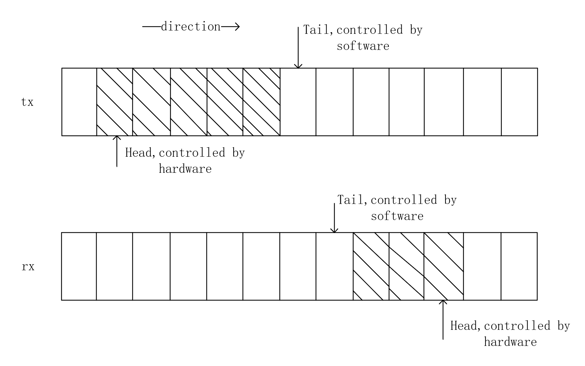

# Shell

```shell
grep -v '^$' 1.txt
```

这里的`^$`是一个正则表达式，表示匹配空行。`^`表示行的开始，`$`表示行的结束，两者之间没有任何字符，所以匹配空行。`-v`选项表示输出不匹配该模式的行，即过滤掉匹配模式的行。

# SQL

```c++
SHOW VARIABLES LIKE 'innodb_buffer_pool_size';: 显示 InnoDB 缓冲池大小，这是 InnoDB 存储引擎使用的内存池。

SHOW VARIABLES LIKE 'query_cache_size';: 显示查询缓存的大小，如果启用了查询缓存的话。

SHOW STATUS LIKE 'Qcache%';: 显示与查询缓存相关的状态信息，包括查询缓存命中率等。

SHOW STATUS LIKE 'Threads_connected';: 显示当前连接到服务器的线程数。

SHOW STATUS LIKE 'Threads_running';: 显示当前正在运行的线程数。

SHOW STATUS LIKE 'Threads_cached';: 显示当前缓存的线程数。
```

# String Hash & Rabin-Karp

```c++
typedef unsigned long long ULL;
ULL PRIME=131;
```

```c++
class Solution {
public:
    unsigned long long PRIME = 31;
    int find(string s,int mid){
        uint64_t p=1;
        uint64_t d=0;
        for(int i=0;i<mid;i++){
            d=d*PRIME+s[i]-'a';
            p*=PRIME;
        }
        unordered_set<uint64_t> ss;
        ss.insert(d);
        for(int i=mid;i<s.length();i++){
            d=d*PRIME+s[i]-'a'-p*(s[i-mid]-'a');
            if(ss.count(d)!=0){
                return i;
            }
            ss.insert(d);
        }
        return -1;
    }
    string longestDupSubstring(string s) {
        int l=0,r=s.length()-1;
        int pos=-1;
        int len=0;
        while(l<r){
            int mid=(l+r+1)/2;
            int res=find(s,mid);
            if(res==0){
                r=mid-1;
            }else {
                pos=l;
                l=mid;
                len=mid;
            }
        }
        if(pos==-1) return "";
        return s.substr(pos+1,len);
    }
};
```

# C++

### 强制类型转换

### `static_cast<type>(expression)`

- **用途**：用于非多态类型的转换。可以用来转换基础数据类型（如int转float，或指针类型之间的转换，只要不涉及底层const的转换）。
- **例子**：`int a = 10; float b = static_cast<float>(a);`

### 2. `dynamic_cast<type>(expression)`

- **用途**：主要用于处理多态性，安全地将基类指针或引用转换为派生类指针或引用，而且在转换不成功时能够检测到。
- **例子**：`Base* b = new Derived(); Derived* d = dynamic_cast<Derived*>(b);`
- **注意**：`dynamic_cast`要求基类有虚函数，因为它使用运行时类型信息（RTTI）来检查转换的安全性。

### 3. `const_cast<type>(expression)`

- **用途**：用于修改类型的const或volatile属性。最常用于去除指针或引用的const属性。
- **例子**：`const int a = 10; int* b = const_cast<int*>(&a);`

### 4. `reinterpret_cast<type>(expression)`

- **用途**：提供低级别的重新解释转换，几乎可以进行任何指针、整型之间的转换。但使用时需非常小心，因为它可能导致平台依赖的代码。
- **例子**：`int* a = new int(65); char* b = reinterpret_cast<char*>(a);`

hash底层std::vector<std::list<int>> table; 

map->RBT

智能指针: .get()

```c++
#include<bits/stdc++.h>
std::copy(src.begin(),src.end(),target.begin());//terget cap must larger than src!! else error!
std::copy(src.begin(), src.end(), std::back_inserter(dest));//recommand!

std::vector<int> src = {1, 2, 3, 4, 5};
std::vector<int> dest(10); // 假设dest已经被一些方式填充了
//if dest has reserve cap, and fill from back
std::copy_backward(src.begin(), src.end(), dest.end());//fill the last 5 elements!

std::move(src.begin(), src.end(), dest.begin());//Attention!! use this must reserve place!! or segment fault!
std::move(src.begin(), src.end(), std::back_inserter(dest));
std::move_backward(src.begin(), src.end(), dest.end());//move content to dest

std::advance(it,j);// move iterator it forward j step, j can be positive or negative!
```

## Virtual Function

```
C c;
A* aPtr = &c;
B* bPtr = &c;

aPtr->func(); // 输出: C's func
bPtr->func(); // 输出: C's func
```

即使`aPtr`和`bPtr`分别是`A*`和`B*`类型的指针，由于它们实际指向的对象是`C`类型的，所以调用的是`C`中重写的`func`函数。这就是多态性的体现，它允许你用基类的指针或引用来操作派生类对象，并调用正确版本的虚函数。

# Trie Tree

```c++
struct Node{
    Node *child[26]{};
    int min_l=INT_MAX,i;
};

class Solution {
public:
    vector<int> stringIndices(vector<string>& wordsContainer, vector<string>& wordsQuery) {
        Node *root=new Node();
        for(int idx=0;idx<wordsContainer.size();idx++){
            auto &s=wordsContainer[idx];
            int l=s.length();
            auto cur=root;
            if(cur->min_l>l){
                cur->min_l=l;
                cur->i=idx;
            }
            for(int i=s.length()-1;i>=0;i--){
                int b=s[i]-'a';
                if(cur->child[b]==nullptr){
                    cur->child[b]=new Node();
                }
                cur=cur->child[b];
                if(l<cur->min_l){
                    cur->min_l=l;
                    cur->i=idx;
                }
            }
        }
        vector<int> ans;
        for(auto &s:wordsQuery){
            auto cur=root;
            for(int i=s.length()-1;i>=0&&cur->child[s[i]-'a'];i--){
                cur=cur->child[s[i]-'a'];
            }
            ans.push_back(cur->i);
        }
        return ans;
    }
};
```

```c++
class Trie {
private:
    vector<Trie*> children;
    bool isEnd;

    Trie* searchPrefix(string prefix) {
        Trie* node = this;
        for (char ch : prefix) {
            ch -= 'a';
            if (node->children[ch] == nullptr) {
                return nullptr;
            }
            node = node->children[ch];
        }
        return node;
    }

public:
    Trie() : children(26), isEnd(false) {}

    void insert(string word) {
        Trie* node = this;
        for (char ch : word) {
            ch -= 'a';
            if (node->children[ch] == nullptr) {
                node->children[ch] = new Trie();
            }
            node = node->children[ch];
        }
        node->isEnd = true;
    }

    bool search(string word) {
        Trie* node = this->searchPrefix(word);
        return node != nullptr && node->isEnd;
    }

    bool startsWith(string prefix) {
        return this->searchPrefix(prefix) != nullptr;
    }
};
```

# BRT OlogN

* Search O(logN), worst O(logN)
* Insert O(1), worst O(logN)
* Delete O(1), worst O(logN)

#### Python

```python
from sortedcontainers import SortedList
sl=SortedList()
sl.remove(cnt)
sl.add(cnt)
sl[-1] #max element
```

Python 默认minheap

存负数来实现maxheap！

```python
h=[]
heappush(h,-(num,x))
heappop(h)

#h[0][0],h[0][1] is top of the heap!
```

```go
class MyClass:
    __slots__ = ['name', 'description']
    
    def __init__(self, name, description):
        self.name = name
        self.description = description

obj = MyClass('example', 'This is an example.')
```

`__slots__`的使用是一个相对高级的特性，主要用于优化程序。当你在一个类中定义`__slots__`变量时，它会告诉Python不要使用普通的字典来保存该类的实例属性，而是为实例分配一个固定大小的数组来保存这些属性。

减少内存使用，加快访问速度

#### Java

```java
Map<Integer, Long> cnt = new HashMap<>();
TreeMap<Long, Integer> m = new TreeMap<>();
m.containsKey(num);
m.merge(num, -1, Integer::sum) == 0
m.remove(num);
m.lastKey();
```

#### Go

```go
t:=redblacktree.New[int,int]()
t.GetNode(cnt[x])
t.Remove(node.Key)
t.Put(cnt[x], 1)
int64(t.Right().Key)
```

#### C++

```c++
multiset<long long> f;
auto it=f.find(num);
if(it!=f.end()){
    f.erase(it);
}
f.insert(num);
*f.rbegin();

std::for_each(f.begin(),f.end(),[](const int &element){
    std::cout<<element<<" ";
})
```

## 懒删除堆??

就是不改变，如果heap顶部和真实值不一样，就不断删除！

# LFU

freq_table存的是freq, Node list

freq_table存的是key, Node list iterator

```c++
struct Node{
    int key_,val_,freq_;
    Node(int key,int value,int freq):key_(key),val_(value),freq_(freq){}
};
class LFUCache {
    unordered_map<int,list<Node>::iterator> key_table;
    unordered_map<int,list<Node>> freq_table;
    int minfreq{},capacity{};
public:
    LFUCache(int capacity):minfreq(0),capacity(capacity) {
        key_table.clear();
        freq_table.clear();
    }
    
    int get(int key) {
        if(capacity==0) return -1;
        if(key_table.find(key)==key_table.end()) return -1;
        int val=(*key_table[key]).val_;
        int freq=(*key_table[key]).freq_;
        freq_table[freq].erase(key_table[key]);
        if(freq_table[freq].size()==0){
            freq_table.erase(freq);
            if(minfreq==freq) minfreq+=1;
        }
        freq_table[freq+1].push_front(Node(key,val,freq+1));
        key_table[key]=freq_table[freq+1].begin();
        return val;
    }
    
    void put(int key, int value) {
        if(capacity==0) return;
        if(key_table.find(key)==key_table.end()){
            if(key_table.size()==capacity){
                auto it=freq_table[minfreq].back();
                key_table.erase(it.key_);
                freq_table[minfreq].pop_back();
                if(freq_table[minfreq].size()==0){
                    freq_table.erase(minfreq);
                }
            }
            freq_table[1].push_front(Node(key,value,1));
            key_table[key]=freq_table[1].begin();
            minfreq=1;
        }
        else{
            auto node=key_table[key];
            int freq=(*node).freq_;
            freq_table[freq].erase(node);
            if(freq_table[freq].size()==0){
                freq_table.erase(freq);
                if(minfreq==freq)
                    minfreq+=1;
            }
            freq_table[freq+1].push_front(Node(key,value,freq+1));
            key_table[key]=freq_table[freq+1].begin();
        }
    }
};
```

# Dijkstra

```c++
class Graph {
public:
    vector<vector<int>> g;
    Graph(int n, vector<vector<int>>& edges) :g(n, vector<int>(n, INT_MAX / 2)){
        for(auto &edge:edges){
            g[edge[0]][edge[1]]=edge[2];
        }
    }
    
    void addEdge(vector<int> edge) {
        g[edge[0]][edge[1]]=edge[2];
    }
    
    int shortestPath(int node1, int node2) {
        int n = g.size();
        vector<int> dis(n,INT_MAX/2),vis(n);
        dis[node1]=0;
        while(1){
            int x=-1;
            for(int i=0;i<n;i++){
                if(!vis[i]&&(x<0||dis[i]<dis[x])){
                    x=i;
                }
            }
            if(x<0||dis[x]==INT_MAX/2){
                return -1;
            }
            if(x==node2){
                return dis[x];
            }
            vis[x]=true;
            for(int y=0;y<n;y++){
                dis[y]=min(dis[y],dis[x]+g[x][y]);
            }
        }
    }
};

/**
 * Your Graph object will be instantiated and called as such:
 * Graph* obj = new Graph(n, edges);
 * obj->addEdge(edge);
 * int param_2 = obj->shortestPath(node1,node2);
 */
```

```c++
class Graph {
    vector<vector<pair<int, int>>> g; // 邻接表
public:
    Graph(int n, vector<vector<int>> &edges) : g(n) {
        for (auto &e : edges) {
            g[e[0]].emplace_back(e[1], e[2]);
        }
    }

    void addEdge(vector<int> e) {
        g[e[0]].emplace_back(e[1], e[2]);
    }

    int shortestPath(int start, int end) {
        // dis[i] 表示从起点 start 出发，到节点 i 的最短路长度
        vector<int> dis(g.size(), INT_MAX);
        dis[start] = 0;
        priority_queue<pair<int, int>, vector<pair<int, int>>, greater<>> pq;
        pq.emplace(0, start);
        while (!pq.empty()) {
            auto [d, x] = pq.top();
            pq.pop();
            if (x == end) { // 计算出从起点到终点的最短路长度
                return d;
            }
            if (d > dis[x]) { // x 之前出堆过，无需更新邻居的最短路
                continue;
            }
            for (auto &[y, w] : g[x]) {
                if (d + w < dis[y]) {
                    dis[y] = d + w; // 更新最短路长度
                    pq.push({dis[y], y});
                }
            }
        }
        return -1; // 无法到达终点
    }
};
```

# Shuffle

```c++
class Solution {
public:
    Solution(vector<int>& nums) {
        this->nums = nums;
        this->original.resize(nums.size());
        copy(nums.begin(), nums.end(), original.begin());
    }
    
    vector<int> reset() {
        copy(original.begin(), original.end(), nums.begin());
        return nums;
    }
    
    vector<int> shuffle() {
        vector<int> shuffled = vector<int>(nums.size());
        list<int> lst(nums.begin(), nums.end());
      
        for (int i = 0; i < nums.size(); ++i) {
            int j = rand()%(lst.size());
            auto it = lst.begin();
            advance(it, j);
            shuffled[i] = *it;
            lst.erase(it);
        }
        copy(shuffled.begin(), shuffled.end(), nums.begin());
        return nums;
    }
private:
    vector<int> nums;
    vector<int> original;
};
```

```c++
class Solution {
private:
    vector<int> ans;
public:
    Solution(vector<int>& nums):ans(nums){}
    
    vector<int> reset() {
        return ans;
    }
    
    int randInt(int min,int max){
        return rand()%(max-min+1)+min;
    }
    vector<int> shuffle() {
        auto shuffle=ans;
        for(int i=0;i<shuffle.size();i++){
            int j=randInt(i,shuffle.size()-1);
            swap(shuffle[i],shuffle[j]);
        }
        return shuffle;
    }
};
```

# Redis

1. 完全基于内存，绝大部分请求是纯粹的内存操作，非常快速；
2. 数据结构简单，对数据操作也简单；
3. 采用单线程，避免了不必要的上下文切换和竞争条件，也不存在多进程或者多线程导致的切换而消耗 CPU，不用去考虑各种锁的问题，不存在加锁释放锁操作，没有因为可能出现死锁而导致的性能消耗；
4. 使用多路 I/O 复用模型，非阻塞 IO。

### skiplist

an element in layer i appears in layer i+1 with some fixed probability p

Average ：OlogN， Worst ON

#### why skiplist?

并发环境下，红黑树在插入和删除的时候可能需要做一些rebalance的操作，这样的操作可能会涉及到整个树的其他部分，而skiplist的操作显然更加局部性一些，锁需要盯住的节点更少，因此在这样的情况下性能好一些。

区间查找数据时，跳表可以做到 O(logn) 的时间复杂度定位区间的起点，然后在原始链表中顺序往后遍历就可以了，非常高效

首先它是list！建立索引可以更快查找！

#### Insert

假如一直往原始列表中添加数据，但是不更新索引，就可能出现两个索引节点之间数据非常多的情况，极端情况，跳表退化为单链表，从而使得查找效率从 O(logn) 退化为 O(n)

我们需要在插入数据的时候，索引节点也需要相应的增加、或者重建索引，来避免查找效率的退化

### 多路 I/O 复用模型epoll & select & poll

https://kiprey.github.io/2021/05/epoll/

**I/O多路复用允许程序监视多个文件描述符（FD）**，等待一个或多个FD成为“准备就绪”状态，从而执行非阻塞I/O操作。这些技术常用于实现高性能的网络服务器

server→client (fd[i]) 文件描述符，套接字，注意从3开始，因为0、1、2：标准输入、标准输出、标准错误输出，是操作系统内核占用

#### select : bitmap

- `select`是最早的I/O多路复用技术。它允许程序监视一组FD（轮询过程是由操作系统内核完成的，而不是用户代码主动轮询），以查看是否有数据可读、可写或是否有异常条件等待处理。
  - `select`的FD集合大小受限于`FD_SETSIZE`，通常为1024，这限制了它能够监视的FD数量。
  - 每次调用`select`时，都需要把FD集合从用户空间复制到内核空间，这在FD数量大时效率低。
  - `select`每次返回时，都需要遍历整个FD集合来确定哪些FD准备就绪，这造成了O(n)的复杂度。

```c++
select(max+1,&read_fds,&write_fds,&except_fds,NULL); //last null is time limit
//max+1 limit the max length in loop, and in 32bit system maximize is 1024, 64bit is 2048
FD_ZERO(&read_fds);//initialize, set bitmap into 0
FD_SET(fd[i],&read_fds);//set 1
```

select调用是将bitmap copy to kernel, since kernel is faster than user mode (user mode need to ask kernel mode evertime)

#### poll

`poll`为每个FD维护一个`pollfd`结构体，`poll`使用一个数组的`pollfd`结构体来跟踪每个FD，也有说是链表的

- **特点**：`poll`与`select`功能相似，但提供了一种不依赖于最大FD数量限制的机制。
  - 使用了一种不同的方式来传递待监视的FD列表，允许监视更多的FD。
  - 但与`select`相似，`poll`在处理大量FD时仍然需要遍历整个列表，复杂度同样是O(n)。

#### epoll

epoll所支持的fd上限是最大可以打开的数目，具体数字可以`cat /proc/sys/fs/file-max`查看9223372036854775807

- `epoll`使用一种事件通知机制，只返回那些真正发生了事件的FD，这降低了大量FD场景下的处理时间。
- `epoll`可以在O(1)时间复杂度内完成操作，显著提高了性能。

`epoll`内部使用红黑树来管理所有的FD，以及一个链表来存储准备就绪的事件。红黑树是一种自平衡的二叉查找树，用于高效地管理大量FD的插入、删除和查找操作。

- **红黑树**：用于存储所有被监视的FD，确保即使FD数量很大时，操作效率也很高。
- **就绪列表**：当FD状态改变，且对应事件被监视时，该FD会被添加到一个就绪列表中，`epoll_wait`调用时会返回这些准备就绪的事件

- `epoll_create()`新建一个 epoll 实例，执行时会返回一个指向 **epoll 实例**的文件描述符。
  - 红黑树
  - 就绪事件链表

- `epoll_ctl()`动态设置某个 epoll 实例的**工作列表**上的条目。
  - 增add
  - 删del
  - 改mod
  
- `epoll_wait()`等待IO事件。如果当前没有事件（即就绪队列为空）则阻塞等待。

#### 两种触发模式

LT

传统 select/poll 的水平触发（Level Triggered, LT），缺省工作模式，同时还支持**阻塞**和**非阻塞**的socket。当某个文件描述符准备就绪后，内核会**持续通知**用户，直到重新变为未就绪状态。

ET

边缘触发（Edge Triggered），高速工作模式，只支持**非阻塞**的socket。当某个文件描述符从未就绪**变成**就绪时，内核会通过epoll通知用户。**注意，只通知一次**。通知动作只会在文件描述符从未就绪变成就绪这个时刻触发。如果一个已经就绪的文件描述符迟迟不被处理，即一直位于就绪状态，那么该文件描述符就一直**不会**触发通知。

**水平触发**和**边缘触发**

思考一下这个例子：

1. 文件描述符 rfd 作为管道的读取端，被注册进 epoll 实例中。
2. 管道的另一端写入2kb数据至管道。
3. 调用 `epoll_wait` 等待IO事件，返回 rfd。
4. 管道本地端通过 rfd 读取了1kb的数据。
5. 继续调用`epoll_wait`。结果是?

如果文件描述符 rfd 被注册进 epoll 实例时使用**边缘触发模式（EPOLLET）**，那么第5步的函数调用**将会被挂起**，**即便有数据没有读完**。因为边缘触发模式仅在受监视的文件描述符上发生更改才会传送事件。

使用边缘触发模式时，最好使用**非阻塞的文件描述符**，这样可以避免阻塞其他等待读写的任务。

**水平触发模式**在第5步的函数调用中不会被挂起，而是返回 rfd，因为缓冲区中仍然存在没有读完的数据。

# Trap

pc：program counter

* syscall
* exception
* interruption

trap应该对于被打断的指令是透明的，也就是说被打断的指令不应该知道这个地方产生了trap，产生trap之后现场应该得以恢复并继续执行被打断的指令。

- `stvec`：trap handler的地址，由kernel写入

- `sepc`：保存trap发生时的现场program counter，因为接下来`pc`要被取代为`stvec`。`sret`是从trap回到现场的指令，将`sepc`写回到`pc`

- `scause`：一个trap产生的原因代码，由CPU写入

- `sscratch`：放在trap handler的最开始处

- `sstatus`：控制设备中断是否被开启，如果`sstatus`中的SIE位被清除，则RISC-V将推迟设备中断。SPP位指示这个trap是在user space中产生的还是在kernel space产生的，并将控制`sret`回到什么模式

  以上寄存器只在supervisor模式下发生的trap被使用

syscall的argument可以用`argint`、`argaddr`、`argfd`等函数从内存中取出

当发生异常、中断或系统调用时，当前执行环境需要被保存，以便之后可以恢复执行。这时，操作系统或硬件会创建一个trapframe来保存这些信息。

# Page Fault

在XV6中，一旦用户空间进程触发了page fault，会导致进程被杀掉。这是非常保守的处理方式。

- trampoline page，它使得内核可以将一个物理内存page映射到多个用户地址空间中。
- guard page，它同时在内核空间和用户空间用来保护Stack。

当一个用户应用程序触发了page fault，page fault会使用与Robert教授上节课介绍的相同的trap机制，将程序运行切换到内核，同时也会将出错的地址存放在STVAL寄存器中

当访问vitual address时，违反里面flag的规则，如试图访问PTE_V为0的虚拟地址或user访问PTE_U为0/kernel访问PTE_U为1以及其他违反PTE_W/PTE_R等flag，会产生page faults，exception会存在scause里，因此会有对应的handler function来处理情况

# Walk

walk函数模拟了MMU，返回的是va对应的最低级page table的PTE

MMU全称为内存管理单元（Memory Management Unit），它是计算机硬件的一部分，负责管理虚拟内存和物理内存之间的映射。当程序尝试访问虚拟地址（VA）时，MMU将这个虚拟地址转换为实际的物理地址（PA），以便CPU可以访问实际的物理内存位置。

# COW copy on write

在`fork`时，一般都是将父进程的所有user memory复制到子进程中，但是`fork`之后一般会直接进行`exec`，这就会导致复制过来的user memory又被放弃掉。因此改进的思路是：子进程和父进程共享一个物理内存，但是mapping时将PTE_W置零，只有当子进程或者父进程的其中一个进程需要向这个地址写入时产生page fault，此时才会进行copy

这里分配新页是kalloc()，释放页是kfree()，并且要多一个flag来标记PTE_COW，这里在kalloc完了后**memmove**完了后要kfree掉旧的地址

```
kvmmap (kernel/vm.c:132) calls mappages (kernel/vm.c:143), which installs mappings into a
page table for a range of virtual addresses to a corresponding range of physical addresses. It does
this separately for each virtual address in the range, at page intervals. For each virtual address to
be mapped, mappages calls walk to find the address of the PTE for that address
```

```
copyout and copyin copy data to and from user virtual addresses provided as
system call arguments; they are in vm.c because they need to explicitly translate those addresses
in order to find the corresponding physical memory.
```

这里还要对页表进行引用的记录，kalloc， cnt+1,cnt归0的时候就push到free list里

用spinlock来保护这个count structure！

# Lazy Allocation

旧的`sbrk()`申请分配内存，但是申请的这些内存进程很可能不会全部用到，因此改进方案为：当进程调用`sbrk()`时，将修改`p->sz`，但是并不实际分配内存，并且将PTE_V置0。当在试图访问这些新的地址时发生page fault再进行物理内存的分配

# Lock contention

当进程需要切换时，首先通过system call或中断陷入内核态，进入该进程的内核线程，然后将**内核线程**的上下文（注意不是用户进程的上下文，用户进程的上下文已经保存在了trapframe里面）切换到当前CPU的scheduler线程，再将上下文切换到需要运行的进程的内核线程，最后返回用户空间。

**实现一个per CPU freelist，以减小各个进程同时调用`kalloc`、`kfree`造成的对`kmem.lock`锁的竞争**

也就是原本是所有cpu都从一个free list里分配回收页，会涉及kmem.lock的锁竞争，这里就是每个cpu都维护一个free list，如果用完了，就从别的cpu里偷一个

buffer cache采用了一个全局的锁`bcache.lock`来负责对buffer cache进行读写保护，当xv6执行读写文件强度较大的任务时会产生较大的锁竞争压力，因此需要一个哈希表，将buf entry以`buf.blockno`为键哈希映射到这个哈希表的不同的BUCKET中，给每个BUCKET一个锁，`NBUCKET`最好选择素数，这里选择13

不能像上一个一样给每个CPU一个`bcache`，因为文件系统在多个CPU之间是真正实现共享的，否则将会造成一个CPU只能访问某些文件的问题。

这里cpu有自己的cpuid，映射到hash里，然后因为持有这个锁，如果没有找到buf，则要获取别的hash lock，当心死锁！所以只能在另一个半区里找！

如果refcnt==0，找LRU策略找到可以用的，移到buf里

# Test and Set

确保了在任何时刻，只有一个线程能够成功修改目标变量，从而实现了对共享资源的安全访问。

```c++
bool test_and_set(int *lock) {
    bool old = *lock;
    *lock = 1;
    return old;
}
```

- **简单**："Test and Set" 操作由于其简洁性，在很多硬件中都有直接支持。
- **有效**：对于某些应用场景，尤其是那些锁只会被短时间持有的情况，"Test and Set" 可以非常有效。

- **自旋等待**：如果一个线程无法获取锁，它可能会进入一个紧密循环（自旋），不断地尝试获取锁。这会消耗CPU资源，特别是当锁被长时间持有时。
- **饥饿**：在高负载情况下，某些线程可能会长时间获取不到锁，导致饥饿问题。

# 内存屏障（Memory Barrier）

```c++
; processor 0
mov [_x], 1
mfence
mov r1, [_y]

; processor 1
mov [_y], 1
mfence
mov r2, [_x]
```

可以使用 `mfence` 指令实现内存屏障。`mfence` 前后的指令会严格以 `mfence` 为界线，`mfence` 之前的读写指令会在界线之前完成并全局生效，之后的指令不会重排到界线之前执行

每一个线程必须等待其他所有线程都到达barrier之后才能继续进行下面的操作,需要用到`pthread_cond_wait(&cond, &mutex)`和`pthread_cond_broadcast(&cond)`来进行线程的sleep和唤醒其他所有`&cond`中睡眠的线程. 需要对`barrier.c`中的`barrier()`进行实现.

# Volatile

在多线程编程中，`volatile`关键字是一种变量修饰符，用于告诉编译器该变量的值可能会被多个线程同时访问和修改，因此在每次使用时都需要直接从**内存**中读取它的值，而不是使用**缓存**中的值

# Buffer cache layer

1. 将对磁盘块的访问权限进行同步，保证内存中只保存一个该磁盘块的拷贝，且一次只有一个内核线程访问这个拷贝，但同时可以有多个对这个block的引用
2. 将被频繁访问的块缓存到内存中

# Soft Link

- disk层：对virtio硬盘上的文件块进行读写操作
- buffer cache层：对磁盘文件块进行缓存，并确保只有1个内核进程能在一段时间内修改文件块上存储的数据。
- logging层：让更高的层级能够将对文件块的所有update打包到一个*transaction*中，从而能保证所有文件块能够在将要崩溃时原子地进行update
- inode层：为每个文件提供一个独一无二的*inode number*
- directory层：将每个文件夹作为一个特殊的inode，这个inode的内容是文件夹entry
- pathname层：将文件夹组织为层级，并通过递归查找来解析路径
- file descriptor层：将管道、设备等UNIX资源用文件系统进行抽象

软链接文件指向的文件可能也是一个软链接文件，`open`需要递归地找到最终的非软链接文件，但是可能出现软链接文件互相链接的情况，会产生死循环，因此规定递归查找软链接的深度不能超过10.

首先要判断是否存在`path`所代表的inode，如果不存在就用`create`添加一个`T_SYMLINK`类型的inode。在inode的最后添加需要软链接到的`target`的路径名称

# Cache Ring

DMA(Direct Memory Access)是可以不通过CPU直接访问内存的机制，在进行DMA传输时DMA Engine控制PCI总线，将内存中的数据和FIFO data buffer (64KB)中的数据互传

**发送数据的流程：**

CPU将IP数据包打包放入内存中，通知DMA Engine进行DMA传输，数据放入FIFO data buffer中。MAC将IP数据包拆分为最小64KB，最大1518KB的数据帧，每一帧包含了目标MAC地址、自己的MAC地址和数据包中的协议类型以及CRC校验码。目标MAC地址通过ARP协议获取。PHY接受MAC传送的数据，将并行数据转化为串行数据后进行编码，在转变为模拟信号将数据进行传输。



RAM中的tx/rx buffer是一个环形结构，有head和tail2个指针，其中head的位置由网卡控制，在进行发送时，每发送完成一个packet网卡就会自动将head向前移动一个mbuf，而需要将某个packet发送时，软件将tail向前移动一个mbuf；在进行接收时，每接收到一个packet网卡自动将head向前移动一个mbuf，软件读取tail所指向的mbuf，并向前移动。移动到最后一个mbuf后从头开始，形成一个wrap-up的结构。

```c++
int
e1000_transmit(struct mbuf *m)
{
  //
  // the mbuf contains an ethernet frame; program it into
  // the TX descriptor ring so that the e1000 sends it. Stash
  // a pointer so that it can be freed after sending.
  //
  acquire(&e1000_lock); 
  uint32 indx=regs[E1000_TDT];
  if((tx_ring[indx].status&E1000_TXD_STAT_DD)==0){
    release(&e1000_lock);
    return -1;
  }else if(tx_mbufs[indx]!=0){
    mbuffree(tx_mbufs[indx]);
    tx_mbufs[indx] = 0;
  }
  tx_mbufs[indx]=m;
  tx_ring[indx].addr=(uint64)m->head;
  tx_ring[indx].length=m->len;
  //3.3.3.1 e1000_dev.h #93,94
  tx_ring[indx].cmd=E1000_TXD_CMD_EOP | E1000_TXD_CMD_RS;

  regs[E1000_TDT]=(indx+1)%TX_RING_SIZE;//update tail
  if(&tx_ring[indx] == 0 || tx_mbufs[indx] == 0){
    release(&e1000_lock);
    return -1;
  }
  release(&e1000_lock);
  return 0;
}
```

以transmit为例，这里先判断传送了没（descript done？）如果没有则报错，不然看是否还有残存的数据，如果有则清除

当环满时被去除（释放）的mbuf是位于`E1000_TDT`（Transmit Descriptor Tail）索引处的描述符之前关联的mbuf（如果有的话）。这是因为`E1000_TDT`指向的是环中下一个要使用的位置，所以环满的情况下，处理的是这个位置上一个循环周期内可能遗留的mbuf。简而言之，去除的是即将被新数据覆盖位置的mbuf，而不是环中头部的mbuf。

# mmap & mumap (using Lazy Allocation)

在`mmap`用于访问设备内存（例如，通过PCIe连接的硬件设备）时，DMA可以发挥作用

因为常规的文件系统操作是用户态发起`read`syscall，然后在buffer cache中查找是否有相应的数据，如果没有就从磁盘中拷贝数据到buffer cache中，因为buffer cache处在内核态，因此需要将buffer cache`copyout`到用户进程的虚拟内存中，这就需要2次拷贝操作，而在mmap中只需要直接将文件数据拷贝到对应的用户空间虚拟内存即可。

需要使用 **fsync** 或者其他文件系统相关的操作来确保数据同步到磁盘。

how to use

```c++
#include <stdio.h>
#include <stdlib.h>
#include <sys/mman.h>
#include <sys/stat.h>
#include <fcntl.h>
#include <unistd.h>
#include <string.h>

int main() {
    int fd;
    struct stat sb;
    char *mapped;
    const char *message = "Hello, mmap!";

    // 以读写模式打开文件
    fd = open("example.txt", O_RDWR);
    if (fd == -1) {
        perror("open");
        return 1;
    }

    // 获取文件的属性
    if (fstat(fd, &sb) == -1) {
        perror("fstat");
        return 1;
    }

    // 执行映射
    mapped = mmap(NULL, sb.st_size, PROT_READ | PROT_WRITE, MAP_SHARED, fd, 0);
    if (mapped == MAP_FAILED) {
        perror("mmap");
        return 1;
    }

    // 修改映射区域的内容
    // 注意：这里假设文件足够大，可以容纳message
    strncpy(mapped, message, strlen(message));

    // 可选：使用msync同步映射区域的修改到文件
    // msync(mapped, sb.st_size, MS_SYNC);

    // 执行解映射
    if (munmap(mapped, sb.st_size) == -1) {
        perror("munmap");
        return 1;
    }

    close(fd);

    return 0;
}

```

需要在trap handler里加入page fault

why lazy allocation

> The reason to be lazy is to ensure that `mmap` of a large file is fast, and that `mmap` of a file larger than physical memory is possible.

这里lazy就是分配一个空页

然后判断当前fault的地址是在哪一个VMA的合法范围中，找到这个VMA后分配一页物理页，并用`mappages`将这一页物理页映射到fault的用户内存中，然后用`readi`打开需要映射的文件，将对应的文件内容用`readi`放入这一页内存中去。

VMA (virtual memory area) !!!!相当与一个VMA记录一个mmap操作，这里

VMA会记录一些有关连续虚拟内存地址段的信息。在一个地址空间中，可能包含了多个section，每一个section都由一个连续的地址段构成，对于每个section，都有一个VMA对象。连续地址段中的所有Page都有相同的权限，并且都对应同一个对象VMA（例如一个进程的代码是一个section，数据是另一个section，它们对应不同的VMA，VMA还可以表示属于进程的映射关系，例如下面提到的Memory Mapped File）

The VMA should contain a pointer to a `struct file` for the file being mapped; `mmap` should increase the file's reference count so that the structure doesn't disappear when the file is closed

这里vma包含了对fd，用了要+refcnt！munmap里文件无ref就write back to disk！

find the VMA for the address range and unmap the specified pages (hint: use `uvmunmap`). If `munmap` removes all pages of a previous `mmap`, it should decrement the reference count of the corresponding `struct file`. If an unmapped page has been modified and the file is mapped `MAP_SHARED`, write the page back to the file. Look at `filewrite` for inspiration.

# Malloc

sbrk(size) 用linked list实现

free!

也有用mmap的！

# Message Queue(MQ) &Kafka

https://juejin.cn/post/6844903495670169607#heading-5

Kafka 的消息队列一般分为两种模式：点对点模式和发布订阅模式

Kafka 中会有一个或者多个消费者，如果一个生产者生产的消息由一个消费者进行消费的话，那么这种模式就是点对点模式

如果一个生产者或者多个生产者产生的消息能够被多个消费者同时消费的情况，这样的消息队列成为发布订阅模式的消息队列

Kafka 有四个核心API，它们分别是

- Producer API，它允许应用程序向一个或多个 topics 上发送消息记录
- Consumer API，允许应用程序订阅一个或多个 topics 并处理为其生成的记录流
- Streams API，它允许应用程序作为流处理器，从一个或多个主题中消费输入流并为其生成输出流，有效的将输入流转换为输出流。
- Connector API，它允许构建和运行将 Kafka 主题连接到现有应用程序或数据系统的可用生产者和消费者。例如，关系数据库的连接器可能会捕获对表的所有更改

# Zero-Copy

在没有零拷贝的情况下，数据通常需要经过以下步骤从一个地方传输到另一个地方：

1. **从磁盘读取数据到内核空间**的缓冲区。
2. **从内核空间复制数据到用户空间**的缓冲区。
3. **从用户空间复制数据回到内核空间**的网络缓冲区。
4. **从内核空间发送数据**到网络。

零拷贝技术通过以下几种方式减少或消除这些复制操作：

- **直接内存访问（DMA）传输**：允许硬件设备（如网络接口卡）直接读写内存，绕过CPU。
- **内存映射（Memory Mapped I/O）**：应用程序通过将文件映射到其地址空间的一部分，直接在内存中访问文件数据，避免读取文件内容到用户空间的缓冲区。
- **发送文件（sendfile）系统调用**：允许在内核中直接将数据从文件系统传输到网络，无需将数据复制到用户空间。
- **使用分散/聚集I/O（Scatter/Gather I/O）**：允许应用程序在单个系统调用中读写到多个缓冲区，减少上下文切换和缓冲区的复制。

- **减少CPU负载**：通过减少数据复制操作，CPU可以用于处理其他任务，从而提高整体系统性能。
- **降低延迟**：数据传输操作更高效，减少了处理时间。
- **减少内存带宽的消耗**：避免了多次数据复制对内存带宽的需求。

# MVCC

也就是每个数据不覆盖老数据，用timestamp和transaction version来，有一个version chain，head是newest的，不用锁contention，隔离性是每个事务是看得到其开始时间前的数据版本snapshot！

DBMS maintains multiple physical versions of a single logical object in the database. When a transaction writes to an object, the DBMS creates a new version of that object. When a transaction reads an object, it reads the newest version that existed when the transaction started

The fundamental concept/benefit of MVCC is that writers do not block writers and readers do not block readers. This means that one transaction can modify an object while other transactions read old versions.

1. **版本控制**：每当数据被修改时，MVCC不会直接覆盖旧数据，而是创建一个新版本的数据。这意味着数据库中的数据可以有多个版本，每个版本都有其对应的时间戳或事务ID。
2. **事务隔离**：MVCC允许每个事务看到一个一致的、不变的数据库快照，这是通过让每个事务**仅访问对应于其开始时间之前的数据版本实现的**。这样，事务就不会看到其他并发事务所做的修改，从而确保了事务的隔离性。
3. **并发控制**：通过允许读操作访问旧版本的数据，而写操作创建新版本的数据，MVCC可以大大**减少读写操作之间的锁争用，从而提高并发性能。**

Repeat Read是undo log读到老的数据

# Wound-Wait

**Wound**（伤害）: 如果请求资源的进程具有较早的时间戳（即较高的优先级），那么持有资源的进程将被“伤害”，这意味着持有资源的进程需要释放资源并回滚其操作。然后，资源将被分配给请求资源的进程。

**Wait**（等待）: 如果请求资源的进程具有较晚的时间戳（即较低的优先级），那么它将被迫等待，直到资源变为可用。

新的有更高的txn id

# Extendible Hash Table

普通的hash里的bucket没有chain的上限

Extendible Hash Table 由一个 directory 和多个 bucket 组成

bucket有桶深，然后正常hash，如果桶满了，则split把hash尺寸扩大一倍，也就是depth增加1，这里的global depth也就是取hash值的后几位！这里如果未满的桶就会有多个dir同时指向这个bucket，后续split的时候就不用再增加global depth，这里也就是local depth

在代码中的体现就是，当需要插入 K 时，发现 bucket 已满，首先判断当前 bucket 的 local depth 是否等于 global depth：

若相等，即仅有一个指针指向 bucket，需要对 dir 扩容。
若不相等，即有多个指针指向 bucket，则无需扩容，将原来指向此 bucket 的指针重新分配。

# LRU-K

list存k个time stamp

Hash+linkedlist

# Buffer Pool Manager

FlushPage ：只是把page 内容写回到磁盘上，注意如果Dirty的话需要写回disk！

buffer pool里存的是frame，一个page id对应一个frame id，然后还有一个free list来维护空闲的frame id

Extendible Hash Table实现的page id映射到frame id

Pincount表示是否有进程在使用这个page，没有则可以delete

# BPlusTree

存的是索引

leaf min_size=max_size/2 , leaf 有next_page_id，因为底层它们是连接起来的

internal min_size=(max_size+1)/2

head+ flexible array

Search

lower_bound+distance

Insert

Delete

iterator

这里都是只加R Lock

Concurrency

先锁住 parent page， 2. 再锁住 child page， 3. 假设 child page 是*安全*的，则释放 parent page 的锁。*安全*指当前 page 在当前操作下一定不会发生 split/steal/merge。同时，*安全*对不同操作的定义是不同的，Search 时，任何节点都安全；Insert 时，判断 max size；Delete 时，判断 min size。

因此可以提前释放掉其祖先的锁来提高并发性能。

Search 只加读锁

Insert 写锁，判断是否split

在 child page 不安全时，需要持续持有祖先的写锁。并在出现安全的 child page 后，释放所有祖先写锁。

然后向上递归插入的时候还是会持有锁，所以直接从page set里拿page指针，不用再加锁

然后这里的祖先会存在transaction的pageset里，然后delete的页page id也会存在delete page set里

Delete写锁，判断size是否改变，也需要对 sibling 加锁。并在完成 steal/merge 后马上释放

### RAII

```cpp
std::scoped_lock<std::mutex> lock(mutex_);
```

这里其实就是一个经典的 RAII。在初始化 lock 时，调用 `mutex_.Lock()`，在析构 lock 时，调用 `mutex_.Unlock()`。这样就通过简单的一行代码成功保证了在 lock 的作用域中对 mutex 全程上锁。离开 lock 的作用域后，由于 lock 析构，锁自动释放。

会出现死锁，leaf index 左到右，delete 锁sibling，就死锁了，这里iterator得不到锁就自动放弃

乐观锁

split/steal/merge，对沿途的节点上读锁，并及时释放，对 leaf page 上写锁。当发现操作对 leaf page 确实不会造成 split/steal/merge 时，可以直接完成操作。当发现操作会使 leaf page split/steal/merge 时，则放弃所有持有的锁，从 root page 开始重新悲观地进行这次操作，即沿途上写锁。


1. **`std::unique_lock<std::mutex> lock(lock_request_queue->latch_);`**
   - 这条语句在构造`unique_lock`对象时自动对互斥锁`lock_request_queue->latch_`上锁。这意味着不需要显式调用`.lock()`，互斥锁将在`unique_lock`对象作用域结束时自动解锁（这得益于RAII - 资源获取即初始化机制）。
   - 这种用法在确保互斥锁在作用域内总是被正确锁定和解锁的情况下非常有用，即使在作用域内抛出异常时也是如此。
2. **`std::unique_lock<std::mutex> lock(lock_request_queue->latch_, std::adopt_lock);`**
   - 当互斥锁在创建`unique_lock`对象之前已经手动锁定时，使用这种语句。`std::adopt_lock`标志表示`unique_lock`应该接管对互斥锁的现有锁定的所有权，而不是尝试再次上锁。
   - 这意味着你必须在这行代码之前手动调用过`lock_request_queue->latch_`的`.lock()`。然后`unique_lock`负责在其作用域结束时解锁互斥锁。这种用法适用于需要在创建`unique_lock`对象之前锁定互斥锁的更复杂的锁定逻辑，可能是由于条件锁定或为了与需要手动锁定的代码接口。
   - 重要的是，使用`std::adopt_lock`时必须确保互斥锁确实已经被锁定，因为未这样做将导致未定义行为。

总结来说，主要区别在于锁定的管理：

- 不使用`std::adopt_lock`时，`std::unique_lock`会在构造时尝试锁定互斥锁。
- 使用`std::adopt_lock`时，`std::unique_lock`假定互斥锁已经被锁定，并接管解锁的责任，而不再尝试锁定。

# 火山模型

Iterator Model，或 Pipeline Model，或火山模型。每个算子都有 `Init()` 和 `Next()` 两个方法。`Init()` 对算子进行初始化工作。`Next()` 则是向下层算子请求下一条数据。当 `Next()` 返回 false 时，则代表下层算子已经没有剩余数据，迭代结束。可以看到，火山模型一次调用请求一条数据，占用内存较小，但函数调用开销大，特别是虚函数调用造成 cache miss 等问题。


executor里的plan是查询计划


seqscan就是用Table Itertor，

Insert

Delete要更新index，这里一个table有多个index

```
 table_index_ = exec_ctx_->GetCatalog()->GetTableIndexes(table_info_->name_);
 这里对每一个table_index_
 it->index_->InsertEntry(key, *rid, exec_ctx_->GetTransaction());
```

这里就是Insert和Delete都从Next里读出我们要操作的tuple，然后从里面读出key和index


# TopN

Sort 也是 pipeline breaker。在 `Init()` 中读取所有下层算子的 tuple，并按 ORDER BY 的字段升序或降序排序。Sort 算子说起来比较简单，实现也比较简单，主要需要自定义 `std::sort()`

limit和 SeqScan 基本一模一样，只不过在内部维护一个 count，记录已经 emit 了多少 tuple。当下层算子空了或 count 达到规定上限后，不再返回新的 tuple。

TopN就是priority_queue，Init读出所有的下层算子tuple，加入queue然后再取前n个

# Optimizer

在 Optimizer 生成的查询计划中，Join 会被优化成具体的 HashJoin 或 NestedIndexJoin 等等

# Aggregation

Aggregation 是 pipeline breaker。也就是说，Aggregation 算子会打破 iteration model 的规则。原因是，在 Aggregation 的 `Init()` 函数中，我们就要将所有结果全部计算出来。

```c++
void AggregationExecutor::Init() {
  child_->Init();
  Tuple tuple;
  RID rid;
  while (child_->Next(&tuple, &rid)) {
    auto agg_key = MakeAggregateKey(&tuple);
    auto agg_val = MakeAggregateValue(&tuple);
    aht_.InsertCombine(agg_key, agg_val);
  }
  aht_iterator_ = aht_.Begin();
}
```

key和val全部存在aht里 aggregation hash table

count *计算总行数，不管是不是null

count(column) 计算非null的行

```sql
SELECT min(t.z), max(t.z), sum(t.z) FROM t GROUP BY t.x, t.y;
```

group by（AggregateKey）为 `{t.x, t.y}`，aggregate（AggregateValue）为 `{t.z, t.z, t.z}`。aggregate 规则为 `{min, max, sum}`。

如果是aht是null的话，要填入空值

**收集数据**：在`Init()`函数中，Aggregation算子通过遍历整个输入表或数据源，将需要聚合的数据根据`GROUP BY`字段收集起来

然后这里有InsertCombine就是得到min，max，sum等规则，也就是真正存入的是满足条件的 

# NestedLoopJoin 

1. **外层循环**：选择一个表作为外表（通常是左表），遍历这个表中的每一行。
2. **内层循环**：对于外层循环中的每一行，遍历另一个表（内表，通常是右表）的每一行。
3. **匹配条件**：对于外表的当前行和内表的每一行，检查它们是否满足连接条件（如`ON`子句中指定的条件）。如果满足，就将这两行的组合作为结果集的一部分。
4. **重复**：重复步骤2和3，直到外表的所有行都被处理过。

有inner join和left join，区别就是是否null的也输出

https://www.jianshu.com/p/e7e6ce1200a4

# 聚簇索引（Clustered Index）

- **物理存储**：在聚簇索引中，表中的数据行物理上按索引键的顺序存储。这意味着聚簇索引决定了数据在磁盘上的物理排列。因为这种安排，每个表只能有一个聚簇索引，因为数据只能按照一种顺序物理存储。
- **检索效率**：聚簇索引对于经常按顺序查询的数据非常有效，例如，当你需要基于范围的查询时（如查找所有在特定日期之间的订单），由于数据行在物理上是连续的，所以可以更快地访问这些数据。
- **例子**：假设你有一个员工表，以员工ID作为聚簇索引。这意味着所有员工记录都将按员工ID的顺序存储在磁盘上。

# 非聚簇索引（Non-Clustered Index）

遍历 B+ 树叶子节点。由于我们实现的是非聚簇索引，在叶子节点只能获取到 RID，需要拿着 RID 去 table 查询对应的 tuple。

- **物理存储**：非聚簇索引和数据的物理存储无关。非聚簇索引包含索引键和指向数据行的指针（或引用），因此，即使索引是有序的，数据本身可以以任意顺序存储。这允许一个表拥有多个非聚簇索引。
- **检索效率**：非聚簇索引适用于快速定位单个行或少数几行，但如果需要大范围的扫描，可能不如聚簇索引高效。访问非聚簇索引中的数据可能需要两次查找：首先在索引中查找指针，然后使用这个指针去找到实际的数据行。
- **例子**：继续使用员工表的例子，假设你经常根据员工的部门ID来查询员工。你可以创建一个非聚簇索引在部门ID上，这样查询特定部门的员工时就可以更快。

# Concurrency

不同隔离级别下的锁管理

包括锁升级

利用 2PL 实现并发控制

table lock和row lock

- `request_queue_`：实际存放锁请求的队列。
- `cv_` & `latch_`：条件变量和锁，配合使用可以实现经典的等待资源的模型。
- `upgrading_`：正在此资源上尝试锁升级的事务 id。

```c++
/**
   * [LOCK_NOTE]
   *
   * GENERAL BEHAVIOUR:
   *    Both LockTable() and LockRow() are blocking methods; they should wait till the lock is granted and then return.
   *    If the transaction was aborted in the meantime, do not grant the lock and return false.
   *
   *
   * MULTIPLE TRANSACTIONS:
   *    LockManager should maintain a queue for each resource; locks should be granted to transactions in a FIFO manner.
   *    If there are multiple compatible lock requests, all should be granted at the same time
   *    as long as FIFO is honoured.
   *
   * SUPPORTED LOCK MODES:
   *    Table locking should support all lock modes.
   *    Row locking should not support Intention locks. Attempting this should set the TransactionState as
   *    ABORTED and throw a TransactionAbortException (ATTEMPTED_INTENTION_LOCK_ON_ROW)
   *
   *
   * ISOLATION LEVEL:
   *    Depending on the ISOLATION LEVEL, a transaction should attempt to take locks:
   *    - Only if required, AND
   *    - Only if allowed
   *
   *    For instance S/IS/SIX locks are not required under READ_UNCOMMITTED, and any such attempt should set the
   *    TransactionState as ABORTED and throw a TransactionAbortException (LOCK_SHARED_ON_READ_UNCOMMITTED).
   *
   *    Similarly, X/IX locks on rows are not allowed if the the Transaction State is SHRINKING, and any such attempt
   *    should set the TransactionState as ABORTED and throw a TransactionAbortException (LOCK_ON_SHRINKING).
   *
   *    REPEATABLE_READ:
   *        The transaction is required to take all locks.
   *        All locks are allowed in the GROWING state
   *        No locks are allowed in the SHRINKING state
   *
   *    READ_COMMITTED:
   *        The transaction is required to take all locks.
   *        All locks are allowed in the GROWING state
   *        Only IS, S locks are allowed in the SHRINKING state
   *
   *    READ_UNCOMMITTED:
   *        The transaction is required to take only IX, X locks.
   *        X, IX locks are allowed in the GROWING state.
   *        S, IS, SIX locks are never allowed
   *
   *
   * MULTILEVEL LOCKING:
   *    While locking rows, Lock() should ensure that the transaction has an appropriate lock on the table which the row
   *    belongs to. For instance, if an exclusive lock is attempted on a row, the transaction must hold either
   *    X, IX, or SIX on the table. If such a lock does not exist on the table, Lock() should set the TransactionState
   *    as ABORTED and throw a TransactionAbortException (TABLE_LOCK_NOT_PRESENT)
   *
   *
   * LOCK UPGRADE:
   *    Calling Lock() on a resource that is already locked should have the following behaviour:
   *    - If requested lock mode is the same as that of the lock presently held,
   *      Lock() should return true since it already has the lock.
   *    - If requested lock mode is different, Lock() should upgrade the lock held by the transaction.
   *
   *    A lock request being upgraded should be prioritised over other waiting lock requests on the same resource.
   *
   *    While upgrading, only the following transitions should be allowed:
   *        IS -> [S, X, IX, SIX]
   *        S -> [X, SIX]
   *        IX -> [X, SIX]
   *        SIX -> [X]
   *    Any other upgrade is considered incompatible, and such an attempt should set the TransactionState as ABORTED
   *    and throw a TransactionAbortException (INCOMPATIBLE_UPGRADE)
   *
   *    Furthermore, only one transaction should be allowed to upgrade its lock on a given resource.
   *    Multiple concurrent lock upgrades on the same resource should set the TransactionState as
   *    ABORTED and throw a TransactionAbortException (UPGRADE_CONFLICT).
   *
   *
   * BOOK KEEPING:
   *    If a lock is granted to a transaction, lock manager should update its
   *    lock sets appropriately (check transaction.h)
   */

  /**
   * [UNLOCK_NOTE]
   *
   * GENERAL BEHAVIOUR:
   *    Both UnlockTable() and UnlockRow() should release the lock on the resource and return.
   *    Both should ensure that the transaction currently holds a lock on the resource it is attempting to unlock.
   *    If not, LockManager should set the TransactionState as ABORTED and throw
   *    a TransactionAbortException (ATTEMPTED_UNLOCK_BUT_NO_LOCK_HELD)
   *
   *    Additionally, unlocking a table should only be allowed if the transaction does not hold locks on any
   *    row on that table. If the transaction holds locks on rows of the table, Unlock should set the Transaction State
   *    as ABORTED and throw a TransactionAbortException (TABLE_UNLOCKED_BEFORE_UNLOCKING_ROWS).
   *
   *    Finally, unlocking a resource should also grant any new lock requests for the resource (if possible).
   *
   * TRANSACTION STATE UPDATE
   *    Unlock should update the transaction state appropriately (depending upon the ISOLATION LEVEL)
   *    Only unlocking S or X locks changes transaction state.
   *
   *    REPEATABLE_READ:
   *        Unlocking S/X locks should set the transaction state to SHRINKING
   *
   *    READ_COMMITTED:
   *        Unlocking X locks should set the transaction state to SHRINKING.
   *        Unlocking S locks does not affect transaction state.
   *
   *   READ_UNCOMMITTED:
   *        Unlocking X locks should set the transaction state to SHRINKING.
   *        S locks are not permitted under READ_UNCOMMITTED.
   *            The behaviour upon unlocking an S lock under this isolation level is undefined.
   *
   *
   * BOOK KEEPING:
   *    After a resource is unlocked, lock manager should update the transaction's lock sets
   *    appropriately (check transaction.h)
   */

```


Repeat表示多次读取的数据是一样的，

read commit表示确保一个事务不读另一个事务未提交的数据

read uncommit一个事务可以读另一个事务未提交的数据

upgrade的事务优先级最高

request list里前排都是granted有锁的，后面按照优先级事务进行排队

如果存在这样的请求，则代表当前事务在此前已经得到了在此资源上的一把锁，接下来可能需要锁升级。需要注意的是，这个请求的 `granted_` 一定为 true。因为假如事务此前的请求还没有被通过，事务会被阻塞在 LockManager 中，不可能再去尝试获取另一把锁。

也就是说锁升级里肯定是granted的事务，然后再请求锁升级

这里获取锁是条件变量+mutex

```c++
while(!Granted_Lock()){
	cv_.wait();
}
cv.notify_all();
```

锁检测就是dfs，经过的txn就加入cycle_set，如果里面有则表示有cycle了

# 凉经

## `delete` 和 `free` 的区别

`delete` 和 `free` 都是用于释放之前分配的内存，但它们在用法和底层机制上有明显的区别：

- **`free`** 是 C 语言的标准库函数，用于释放通过 `malloc`、`calloc` 或 `realloc` 分配的内存。`free` 仅仅释放内存，不会调用任何构造函数或析构函数，因为 C 语言不支持构造函数或析构函数的概念。
- **`delete`** 是 C++ 的操作符，用于释放通过 `new` 操作符分配的内存。与 `free` 不同，`delete` 在释放对象占用的内存之前，会调用对象的析构函数（如果有的话），以确保正确地进行资源清理，比如关闭文件、释放分配的资源等。

## Fork() & pid

fork()返回子进程的pid！pid是唯一的！

- If `fork()` returns `-1`, it indicates an error occurred while trying to fork the process.
- If `fork()` returns `0`, the code is being executed in the child process.
- If `fork()` returns a positive value, the code is being executed in the parent process, and this value is the PID of the newly created child process.

## C 和 C++ 强制转换的底层原理

在底层，这些转换指示编译器如何重新解释内存中的数据。例如，将一个 `int` 类型的指针转换为 `char *` 类型的指针，转换操作本身不会改变指针所指向的内存内容，但允许通过 `char *` 类型的指针以不同的方式访问这块内存（如按字节访问而不是按整数访问）。

## g++原理

#### 1. 预处理（Preprocessing）

- **步骤**：预处理器处理源代码文件中的指令，如宏定义（`#define`）、文件包含（`#include`）和条件编译指令（`#ifdef`、`#ifndef`等）。
- **结果**：生成扩展源代码，已经展开所有宏定义，包含所有包含的文件，移除了所有的条件编译部分（根据条件编译指令）。

#### 2. 编译（Compilation）

- **步骤**：编译器将预处理后的扩展源代码转换为汇编代码。这个过程包括语法分析、语义分析、优化等。
- **结果**：生成汇编代码文件。这些文件包含平台特定的汇编指令。

#### 3. 汇编（Assembly）

- **步骤**：汇编器将汇编代码转换为机器代码，生成目标文件。目标文件包含了可执行代码但还未进行地址绑定。
- **结果**：生成目标文件（在UNIX系统中通常是`.o`或`.obj`文件）。

#### 4. 链接（Linking）

- **步骤**：链接器将一个或多个目标文件与库（库文件可以是静态库`.a`或动态库`.so`）一起链接，解析外部引用，确定最终的内存地址，并生成可执行文件或库文件。
- **结果**：生成最终的可执行文件或库文件

## 从代码输出到终端输出

stdin  0

stdout 1

stderr 2

标准输入输出报错三个标准文件描述符fd，stdout默认链接到console，可以通过管道

这里

# 面经

### TCP

里第二次到第三次握手中间服务器可能会收到SYN洪泛攻击

## Redis

#### 缓存穿透（Cache Penetration）

**定义**：缓存穿透是指查询一个数据库中不存在的数据，由于缓存不会记录这种查询，导致每个查询都要到数据库去查询，如果有大量这样的查询，会对数据库造成很大压力。

**解决方法**：

- **空值缓存**：即使数据库中没有查到数据，也将这个“空”结果缓存起来，但需要设置较短的过期时间。
- **布隆过滤器**：在缓存和数据库之间使用布隆过滤器，先检查布隆过滤器中是否存在这个键，如果不存在就直接返回，不再查询数据库。

#### 缓存雪崩（Cache Avalanche）

**定义**：缓存雪崩是指缓存中大量的数据在同一时间过期，导致原本应该访问缓存的请求都转向了数据库，数据库瞬时压力剧增，造成系统性能急剧下降或服务崩溃。

**解决方法**：

- **设置不同的过期时间**：使缓存的过期时间有所差异，避免大量缓存同时过期。
- **使用持久化**：结合缓存数据的持久化，如Redis的RDB、AOF等方式，即使发生大规模缓存失效，也可以快速恢复缓存数据。
- **限流降级**：采用限流措施，保护数据库和系统的稳定。

#### 缓存击穿（Cache Breakdown）

**定义**：缓存击穿指一个热点key非常热，大量的请求，热点key在缓存中过期的瞬间，持续的大量请求就穿破缓存，直接请求数据库。

**解决方法**：

- **设置热点数据永不过期**：对于热点数据设置为永不过期，需要程序自己控制数据的更新。
- **互斥锁**：在缓存失效后（通常是热点数据），通过设置互斥锁或分布式锁确保数据库只会被一个请求查询并更新缓存。

### 当通过Chrome浏览器输入地址直到返回内容中间经历了什么样的过程？

1. **域名解析**：浏览器将域名解析为IP地址，可能通过DNS查找。
2. **建立连接**：浏览器与服务器建立TCP连接（如果是HTTPS，则还包括TLS握手过程）。
3. **发送HTTP请求**：浏览器向服务器发送HTTP请求。
4. **服务器处理请求**：服务器处理请求并生成响应。
5. **发送HTTP响应**：服务器将响应数据回送给浏览器。
6. **渲染页面**：浏览器接收响应并渲染页面。

### 了解的HTTP方法和它们之间的区别

- **GET**：请求获取资源。
- **POST**：提交数据给服务器。
- **PUT**：更新服务器上的资源。
- **DELETE**：删除服务器上的资源。
- **HEAD**：获取资源的元数据。
- **PATCH**：对资源进行部分更新。

### HTTP的返回码有哪些？

- **2xx**：成功（例如，200 OK）。
- **3xx**：重定向（例如，301 Moved Permanently）。
- **4xx**：客户端错误（例如，404 Not Found）。
- **5xx**：服务器错误（例如，500 Internal Server Error）。

### HTTPS和HTTP之间的区别是什么？

HTTPS是HTTP的安全版本，通过SSL/TLS进行加密，保证了数据传输的安全性和完整性。

### HTTP1.1和HTTP2的区别是什么？

HTTP2引入了多路复用、服务器推送、头部压缩等特性，以提高性能和效率。

### Close Wait状态是什么意思，Fin Wait和Close Wait之间的区别是什么？

- **CLOSE WAIT**：表示本端接收到对方的FIN报文，等待本端关闭连接。
- **FIN WAIT**：表示等待对方确认自己的FIN报文。

### HTTP加密算法的基本原理，对称加密和非对称加密？

- **对称加密**：加密和解密使用相同的密钥。速度快，适合大量数据加密。
- **非对称加密**：使用一对公钥和私钥，一个用于加密，另一个用于解密。适合小量数据加密和身份验证。

### TCP连接写数据过快

在TCP连接建立好后，如果数据发送（写入）速度过快，超过了接收方处理或网络传输的能力，可能会导致几种情况：

1. **发送方缓冲区满**：每个TCP连接在发送方都有一个发送缓冲区，用于暂存待发送的数据。如果应用程序写入数据的速度持续超过网络传输和接收方处理的速度，发送缓冲区可能会被填满。当发送缓冲区满时，TCP协议将暂停应用程序的写操作，直到缓冲区中的数据被发送出去并确认接收，腾出空间来。
2. **接收方缓冲区溢出**：类似地，接收方也有一个接收缓冲区。如果发送方的数据传输速度过快，接收方应用程序来不及处理缓冲区中的数据，可能会导致接收缓冲区溢出。TCP协议通过流量控制机制（如接收窗口）来避免这种情况，确保发送方的发送速度能与接收方的处理速度相匹配。
3. **网络拥塞**：如果网络路径上的某个环节成为瓶颈，数据发送过快也可能导致网络拥塞。TCP协议通过拥塞控制机制（如慢启动、拥塞避免、快重传、快恢复）来调整数据的发送速率，以适应网络当前的拥塞状况。

### Slice扩容后在原Slice上修改数据新Slice会发生变化吗？

当Slice扩容导致重新分配了底层数组时，在原Slice上的修改不会影响到新的Slice，因为它们指向了不同的底层数组。但如果没有重新分配底层数组，即扩容操作没有超过原Slice的容量，则它们仍然共享同一个底层数组，此时一个Slice上的修改会影响到另一个。

### C++ std里执行类似操作会怎么样（vector取引用然后扩容）？

在C++中，`std::vector`在进行扩容时，如果新的大小超过了当前容量，将分配一个新的内存区域并移动（或复制）元素到新的内存区域。如果你持有指向vector元素的指针或引用，扩容操作可能会使这些指针或引用变为悬空，因为它们指向的内存已经不再被vector所使用。

### Go关闭Channel时有哪些需要注意的事情，怎么判断channel是否已经关闭呢？

关闭Channel时需要注意：

- 只有发送方应该关闭channel，接收方不应该关闭它，否则会导致panic。
- 向已关闭的channel发送数据会导致panic。
- 从已关闭的channel接收数据是安全的，会立即返回，而不会阻塞，并返回元素类型的零值。

判断channel是否已经关闭：

- 从channel接收数据时，可以通过第二个返回值来判断channel是否被关闭。如果返回的布尔值为`false`，则表示channel已经关闭并且没有更多的数据。

```go
v, ok := <-ch
if !ok {
    // channel ch is closed
}
```

### Go的interface和Java的interface有什么区别，继承有什么区别？

- **Go的interface**：是隐式实现的，任何类型只要实现了interface定义的所有方法，就实现了该interface，无需显式声明。Go不支持传统的面向对象编程中的继承，而是通过组合和接口来实现类似的功能。

### GC的常见算法

- **标记-清除（Mark-Sweep）**：垃圾收集器遍历所有对象，标记所有可达的对象，然后清除未标记的对象。                    

### Map 并发读写

Go的`map`在没有适当同步控制的情况下并不是并发安全的。

如果你尝试在多个goroutine中并发读写同一个`map`（即至少有一个goroutine在写入），那么程序可能会遇到运行时错误，导致`panic`。这是因为同时有多个goroutine修改`map`可能会导致`map`内部状态的不一致性。

**使用互斥锁（Mutex）**：使用`sync.Mutex`或`sync.RWMutex`来保护`map`，确保每次只有一个goroutine可以对其进行修改。`sync.RWMutex`是读写互斥锁，对于读多写少的情况是一个不错的选择，因为它允许多个goroutine同时读取`map`，只在写入时才需要互斥访问

### 什么是panic

`panic`是Go语言中的一个内建函数，当调用时会立即停止当前函数的执行，开始逐层向上（函数调用栈）传播，直到达到当前goroutine的顶部，然后程序崩溃并输出panic消息。

### 索引的了解

- **索引**是数据库管理系统中一个能够提高数据检索速度的数据结构。它存储了数据库表中一列或多列的值和这些值所在行的物理地址。
- 索引可以显著加快数据的检索速度，尤其是在执行SELECT查询操作时。
- 但索引也不是没有代价的，它会占用额外的磁盘空间，并且在插入、删除、更新数据时会增加额外的维护成本，因为数据库需要同时更新索引。

### 适合加索引的字段

- **高查询频率字段**：经常作为查询条件（WHERE子句中）的字段。
- **作为连接键的字段**：在多表JOIN操作中用作连接条件的字段。
- **有高度选择性的字段**：字段的唯一值很多，选择一个值能够大幅缩小结果集的范围。
- **排序和分组字段**：在ORDER BY、GROUP BY、DISTINCT等操作中使用的字段。

### 不适合加索引的字段

- **更新非常频繁的字段**：频繁更新的字段会导致索引频繁重建，影响性能。
- **数据重复值多的字段**：如果一个字段中的值大多数都是相同的，那么索引这个字段的效果会很差，因为它不能有效地减少搜索范围。
- **数据类型大的字段**：例如，大型的文本字段（TEXT、BLOB）不适合直接建立索引，如果需要，可以考虑对其进行散列或创建前缀索引。
- **表记录数较少的表**：对于只有少数几条记录的表，全表扫描的速度可能与索引扫描相当，甚至更快。

### TCP 2MSL

TCP（Transmission Control Protocol）连接在关闭时需要等待2倍的最大报文段生存时间（Maximum Segment Lifetime，MSL）是为了确保网络中所有可能的剩余数据报文段都已经消失，以确保之前的连接不会对新的连接产生干扰。tcp

TCP 连接是通过 IP 地址和端口号来标识的。IP 地址用于确定主机的位置，而端口号则用于确定主机上的应用程序。因此，一个 TCP 连接由源 IP 地址、源端口号、目标 IP 地址和目标端口号唯一确定。

Socket 是在 TCP/IP 协议族中用于实现网络通信的一种编程接口或抽象概念。它允许应用程序通过网络发送和接收数据，而无需了解底层网络细节。在网络编程中，Socket 提供了一种机制，使得应用程序能够通过网络与其他应用程序进行通信。

Socket 可以看作是应用程序与网络之间的“插座”，它是一种抽象概念，用于描述两个不同主机之间的通信连接。通过 Socket，应用程序能够创建连接、发送数据、接收数据以及关闭连接等操作。

理解 Socket 的一个重要概念是它由 IP 地址和端口号组合而成，因此可以唯一标识一个网络连接。在网络编程中，开发人员可以利用 Socket 编程接口来创建、绑定、监听和接受连接，以及发送和接收数据。

1. 如果直接输出 `map[string]*student`，会打印出该 map 中所有键值对的地址，即指向 `student` 结构体的指针。
2. 当遍历该 map 并打印结果时，由于 map 的迭代顺序是不确定的（无序性），每次遍历的顺序可能不同，但会打印出该 map 中所有键值对的地址。
3. 关于深浅拷贝：
   - **浅拷贝**：只复制对象的引用，而不是对象本身的内容。修改其中一个对象的属性可能会影响另一个对象。适用于对象较小且不包含引用类型的情况。
   - **深拷贝**：复制对象本身的内容，包括引用类型的数据，新对象与原对象完全独立，修改一个对象不会影响另一个对象。适用于对象较大或包含引用类型的情况。
4. 关于深拷贝：
   - **切片**：切片可以进行浅拷贝，但不会进行深拷贝。可以通过复制切片的方式实现浅拷贝。
   - **Map**：Map 也是进行浅拷贝，复制 map 会创建一个新的 map，但仍然引用相同的键值对。需要深拷贝时，需要逐个复制键值对。
   - **结构体**：结构体的深浅拷贝取决于结构体内部字段的类型，如果字段是基本类型则进行浅拷贝，如果字段包含引用类型，则需要手动实现深拷贝。
5. 避免深拷贝结构体的方法包括：
   - 使用指针类型：在复制结构体时，只是复制指针，而不是整个结构体。这样可以节省内存并避免不必要的复制。
   - 使用 `sync.Mutex` 等同步机制来保护结构体的字段，以确保多个 goroutine 访问时不会出现数据竞争。

# 在浏览器输入域名到出现画面的过程涉及多个步骤，简要概括如下：

1. **DNS解析**：浏览器首先会将输入的域名发送给DNS服务器进行解析，获取域名对应的IP地址。如果DNS缓存中有该域名对应的IP地址，则直接返回，否则会向上游DNS服务器查询。
2. **建立TCP连接**：一旦获得了目标服务器的IP地址，浏览器会通过TCP协议与服务器建立连接。这个过程包括TCP三次握手，确保客户端和服务器之间建立可靠的连接。
3. **发送HTTP请求**：一旦TCP连接建立完成，浏览器会向服务器发送HTTP请求，请求访问特定的资源，如HTML文件、图片、样式表等。
4. **服务器处理请求**：服务器接收到浏览器发送的请求后，会根据请求的内容进行相应的处理，比如查询数据库、生成动态内容等。
5. **服务器返回响应**：服务器处理完请求后，会将相应的资源以HTTP响应的形式返回给浏览器。响应中包含了HTTP状态码、响应头部信息以及实际的资源内容。
6. **浏览器解析渲染**：浏览器收到服务器返回的响应后，会根据响应的内容进行解析和渲染。对于HTML文件，浏览器会解析HTML结构，构建DOM树；对于CSS文件，浏览器会解析样式表，构建CSSOM树；最后将DOM树和CSSOM树结合，进行页面布局和绘制，最终呈现在用户的屏幕上。
7. **完成页面加载**：当页面的所有资源都被加载和渲染完成后，浏览器会触发`DOMContentLoaded`事件，表示DOM树已经构建完成；当页面所有资源（包括图片、样式表、脚本等）都加载完成后，浏览器会触发`load`事件，表示页面已经完全加载完成。

这些步骤构成了从输入域名到浏览器显示页面的整个过程。值得注意的是，每个步骤都可能受到网络状况、服务器性能、页面内容复杂度等因素的影响，因此实际的加载时间可能会有所不同。

# Count 1

```
n-=n&(-n);

```

