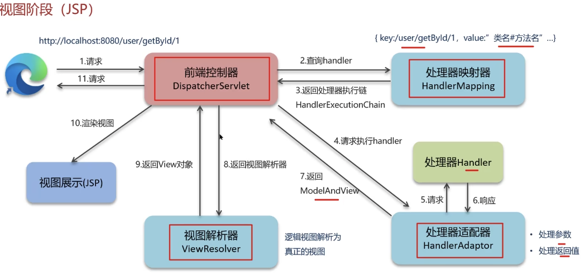

# BootCamp

```lua
     +-----------------+
     |      JDK        |
     |  +-----------+  |
     |  |    JRE    |  |  开发工具如编译器（javac）、调试器（jdb）、打包工具（jar）等
     |  | +-------+ |  |
     |  | |  JVM  | |  |  Java 核心类库
     |  | +-------+ |  |
     |  +-----------+  |
     +-----------------+
```

### Syntactical

```java
import java.util.Scanner;
//use Scanner and System.out
nextInt()
//read next input
```

Memory management is automatic with the help of the garbage collector. Developers use `new` for object instantiation, but memory deallocation is handled automatically.

`Arrays.asList(couponEntity)`用于将数组或单个对象转成 `List` 类型的集合

### Datatypes

boolean

Int

byte

char

double

float

int

long

short

null

```java
String myString;
int[] myArray;
myString.length();
myString.charAt(index);
```

#### Final

`final` 含义是这是最终的、不可更改的结果，被 `final` 修饰的变量只能被赋值一次，赋值后不再改变。

#### String

String is Object! is not datatype!!

`==` compare the **same object!** rather than value!

`str1.equals(str2)`

```java
public class StringComparison {
    public static void main(String[] args) {
        String str1 = "hello";
        String str2 = "HELLO";
        String str3 = "world";
        String str4 = new String("hello");

        // 使用 == 运算符
        System.out.println("Using == :");
        System.out.println(str1 == str2); // false
        System.out.println(str1 == str4); // false

        // 使用 equals() 方法
        System.out.println("Using equals() :");
        System.out.println(str1.equals(str2)); // false
        System.out.println(str1.equals(str4)); // true

        // 使用 equalsIgnoreCase() 方法
        System.out.println("Using equalsIgnoreCase() :");
        System.out.println(str1.equalsIgnoreCase(str2)); // true

        // 使用 compareTo() 方法
        System.out.println("Using compareTo() :");
        System.out.println(str1.compareTo(str2)); // 32 (根据Unicode值的差值)
        System.out.println(str1.compareTo(str3)); // -15 (根据Unicode值的差值)

        // 使用 compareToIgnoreCase() 方法
        System.out.println("Using compareToIgnoreCase() :");
        System.out.println(str1.compareToIgnoreCase(str2)); // 0
        System.out.println(str1.compareToIgnoreCase(str3)); // -15
    }
}

```

#### Scanner

```java
import java.util.Scanner;

Scanner scan=new Scanner(System.in);
int a=scan.nextInt();
String c=scan.nextLine();
```

### BufferReader

```java
BufferedReader reader = new BufferedReader(new FileReader("input.txt"));
String line;
while ((line = reader.readLine()) != null) {
    System.out.println(line);
}
reader.close();
```

### Lambda

```java
// 1. 不需要参数，返回值为 5
() -> 5

// 2. 接收一个参数（数字类型），返回其 2 倍的值
x -> 2 * x

// 3. 接受 2 个参数（数字）并返回他们的差值
(x, y) -> x – y

// 4. 接收 2 个 int 类型整数并返回他们的和
(int x, int y) -> x + y

// 5. 接受一个 String 对象并在控制台打印，不返回任何值（看起来像是返回 void）
(String s) -> System.out.print(s)
```

### Data Structures & Collection

`import java.math.BigInteger;`

```java
import java.util.*;
import java.util.ArrayList;
import java.util.List;
import java.util.LinkedList;

static void add() {
    array.add(1);  // 时间复杂度为 O(1) 
    linked.add(1);  // 时间复杂度为 O(1) 
}

static void get() {
    array.get(10);  // 时间复杂度为 O(1) 
    linked.get(10);  // 时间复杂度为 O(11) 
}

static void addIdx() {
    array.add(0, 2);  // 最坏情况下时间复杂度为 O(n)
    linked.add(0, 2);  // 最坏情况下时间复杂度为 O(n)
}

static void size() {
    array.size();  // 时间复杂度为 O(1)
    linked.size();  // 时间复杂度为 O(1)
}


public class test {
    public static void main(String[] args) throws Exception {
        // ArrayList is just like vector in c++
        ArrayList<String> arryList = new ArrayList<>();
        arryList.add("a");
        arryList.add("b");
        fruits.get(0);
		arryList.set(1,"c");
        fruits.remove(0);
        for(String c:arrayList){
            //...
        }
      
        // LinkedList
        LinkedList<String> linkedList = new LinkedList<>();
        linkedList.add("London");
        linkedList.add("Paris");
	
        //TreeMap
        Map<Integer, Integer> cnt = new TreeMap<>();
        Map<Integer, Integer> cnt = new HashMap<>();
        count=cnt.getOrDefault(card, 0);
        cnt.put(count);

        for (Map.Entry<Integer, Integer> entry : cnt.entrySet()) {
            entry.getKey();
            entry.getValue();
        }
        for (int key : cnt.keySet()) {
            cnt.get(key);
        }
        for (int value : cnt.values())
        
        // HashMap
        HashMap<String, Integer> hashMap = new HashMap<>();
        hashMap.put("Alice", 25);
        hashMap.put("Bob", 30);

        // HashSet
        HashSet<String> hashSet = new HashSet<>();
        hashSet.add("Red");
        hashSet.add("Green");

        // Stack
        Stack<Integer> stack = new Stack<>();
        stack.push(10);
        stack.push(20);

        // Queue
        Queue<Integer> queue = new LinkedList<>();
        queue.add(5);
        queue.add(15);
    
    		Set<Integer> s1=new HashSet<>();
        Set<Integer> s2 = new LinkedHashSet<>();//保持插入顺序的 Set。
      	TreeSet<Integer> s1=new TreeSet<>();
      	TreeSet<Integer> s4 = new TreeSet<>((x, y) -> {return y - x;});  // 降序 
    }

  	static Set<Integer> s1 = new HashSet<>();
    static Set<Integer> s2 = new LinkedHashSet<>();

    static void add() {
        s1.add(1);
    }

    static void contains() {  // 判断 set 中是否有元素值为 2，有则返回 true，否则返回 false 
        s1.contains(2);
    }

    static void test1() {  // s1 与 s2 的并集 
        Set<Integer> res = new HashSet<>();
        res.addAll(s1);
        res.addAll(s2);
    }

    static void test2() {  // s1 与 s2 的交集 
        Set<Integer> res = new HashSet<>();
        res.addAll(s1);
        res.retainAll(s2);
    }

    static void test3() {  // 差集：s1 - s2 
        Set<Integer> res = new HashSet<>();
        res.addAll(s1);
        res.removeAll(s2);
    }
}
```

### Oops Concepts

#### Automatic Memory Management

Java uses automatic memory management through garbage collection. The responsibility of allocating and deallocating memory is handled by the Java Virtual Machine (JVM).

#### Inheritance and Method Overriding

all classes implicitly inherit from the `Object` class, which serves as the root of the class hierarchy. Java supports single inheritance, meaning a class can only inherit from one superclass

#### Interface

一个类不能继承多个类，但一个类可以实现多个接口，这被视为一种多重继承的形式。

```java
public interface MyInterface {
    void method1();
    void method2();
}

public class MyClass implements MyInterface {
    @Override
    public void method1() {
        System.out.println("Method1 implementation");
    }
    
    @Override
    public void method2() {
        System.out.println("Method2 implementation");
    }
}

public class Test {
    public static void main(String[] args) {
        MyInterface myObject = new MyClass();
        myObject.method1(); // 输出 "Method1 implementation"
        myObject.method2(); // 输出 "Method2 implementation"
    }
}
///---------------------------------------------------------------------///
public interface InterfaceA {
    void methodA();
}

public interface InterfaceB {
    void methodB();
}

public class MyClass implements InterfaceA, InterfaceB {
    @Override
    public void methodA() {
        System.out.println("MethodA implementation");
    }
    
    @Override
    public void methodB() {
        System.out.println("MethodB implementation");
    }
}
```

#### Exception Handling

#### Polymorphism and Dynamic Binding

所有的方法（除了 `static` 方法和 `final` 方法）默认都是虚拟方法（virtual methods），即它们在运行时是通过动态绑定来调用的

```java
class Animal {
    void makeSound() {
        System.out.println("Animal sound");
    }
}

class Dog extends Animal {
    @Override
    void makeSound() {
        System.out.println("Dog barks");
    }
}

public class Test {
    public static void main(String[] args) {
        Animal a = new Dog();
        a.makeSound(); // 输出 "Dog barks"
    }
}
```

**Animal a = new Dog();**: 这行代码创建了一个 `Dog` 对象，但用 `Animal` 类型的引用 `a` 来引用它。

**a.makeSound();**: 由于 `a` 实际上引用的是一个 `Dog` 对象，调用 `makeSound()` 方法时，Java 会在运行时决定调用 `Dog` 类的 `makeSound()` 方法，而不是 `Animal` 类的 `makeSound()` 方法。因此，输出是 "Dog barks"。

**Animal a = new Animal();**: 这会创建一个 `Animal` 对象，`a.makeSound()` 调用的是 `Animal` 类的 `makeSound()` 方法，输出是 "Animal sound"。

**Dog a = new Animal();**: 这种写法在 Java 中是不允许的，因为 `Animal` 是 `Dog` 的父类，不能把父类对象赋值给子类引用。这会导致编译错误。

### Multithreading

```java
public class MultiThreadExample {
    public static void main(String[] args) {
        // 创建并启动第一个线程(use interface Runnable)
        Thread thread1 = new Thread(new MyRunnable(), "Thread 1");
        thread1.start();

        // 创建并启动第二个线程(use extends Threads)
        Thread thread2 = new MyThread("Thread 2");
        thread2.start();
    }

    // 实现 Runnable 接口的类
    static class MyRunnable implements Runnable {
        public void run() {
            System.out.println(Thread.currentThread().getName() + " is running");
        }
    }

    // 继承 Thread 类的子类
    static class MyThread extends Thread {
        public MyThread(String name) {
            super(name);
        }

        public void run() {
            System.out.println(Thread.currentThread().getName() + " is running");
        }
    }
}
```

#### States

including `NEW`, `RUNNABLE`, `BLOCKED`, `WAITING`, `TIMED_WAITING`, and `TERMINATED`

Threads can be assigned priorities ranging from 1 to 10. The default priority is 5

#### interrupt & join

当线程调用 `interrupt` 方法时，如果线程处于阻塞状态（如 `sleep`、`wait`、`join` 等），会抛出 `InterruptedException` 异常，如果线程没有处于阻塞状态，会设置线程的中断标志

```java
public class InterruptExample {
    public static void main(String[] args) throws InterruptedException {
        Thread thread = new Thread(() -> {
            try {
                // 模拟线程执行任务
                Thread.sleep(5000);
            } catch (InterruptedException e) {
                // 捕获到中断异常
                System.out.println("Thread interrupted");
            }
        });

        thread.start();
        Thread.sleep(1000);
        thread.interrupt();
        //thread.join();
    }
}
```

#### Thread Communication

```java
public class ThreadCommunicationExample {
    public static void main(String[] args) {
        Object lock = new Object();
        
        Thread thread1 = new Thread(() -> {
            synchronized (lock) {
                try {
                    System.out.println("Thread 1 waiting");
                    lock.wait();
                    System.out.println("Thread 1 resumed");
                } catch (InterruptedException e) {
                    e.printStackTrace();
                }
            }
        });

        Thread thread2 = new Thread(() -> {
            synchronized (lock) {
                try {
                    System.out.println("Thread 2 starting");
                    Thread.sleep(2000);
                    System.out.println("Thread 2 notifying");
                    lock.notify();
                } catch (InterruptedException e) {
                    e.printStackTrace();
                }
            }
        });

        thread1.start();
        thread2.start();
    }
}
```

# JDBC


1. **连接到数据库**：JDBC 提供了一种标准的方法来连接各种数据库。
2. **执行 SQL 语句**：可以使用 JDBC 执行 SQL 查询、插入、更新和删除操作。
3. **处理结果集**：从数据库中获取查询结果，并在 Java 程序中处理这些数据。
4. **事务管理**：支持数据库事务，允许开发人员控制事务的提交和回滚。

### Connection

`DriverManager`

```java
        Connection connection = DriverManager.getConnection(
          "jdbc:mysql://127.0.0.1:3306/data?user=root&password=123456");
```

`DataSource`

```java
        DataSource dataSource = new UnpooledDataSource(
                "com.mysql.cj.jdbc.Driver",
                "jdbc:mysql://127.0.0.1:3306/data?user=root&password=123456&AllowPublicKeyRetrieval=true",
                "root","qwer1234");
```

### Statement

- Statement 不支持输入参数，有sql注入的风险
- PreparedStatement：增加了设置SQL参数的方法
- CallableStatement：增加了调用存储过程以及检索存储过程调用结果的方法

```java
Connection connection = DriverManager.getConnection("");
String sql = "SELECT * FROM admin WHERE username = ? AND password = ?";
PreparedStatement preparedStatement = connection.prepareStatement(sql);
preparedStatement.setString(1,"username");
preparedStatement.setString(2,"password");
ResultSet resultSet = preparedStatement.executeQuery();

// the function below is like to have risk of sql injection
String sql2 = "SELECT * FROM admin WHERE username = 'username' AND password = 'password'";
Statement statement2 = connection.createStatement();
ResultSet resultSet2 = statement.executeQuery(sql);
```

### Eg Code

```java
import java.sql.Connection;
import java.sql.DriverManager;
import java.sql.ResultSet;
import java.sql.Statement;

public class JDBCDemo {
    public static void main(String[] args) {
        // 数据库连接信息
        String jdbcUrl = "jdbc:mysql://localhost:3306/mydatabase";
        String username = "root";
        String password = "password";

        Connection connection = null;
        Statement statement = null;
        ResultSet resultSet = null;

        try {
            // 加载 MySQL 驱动程序
            Class.forName("com.mysql.cj.jdbc.Driver");

            // 获取数据库连接
            connection = DriverManager.getConnection(jdbcUrl, username, password);

            // 创建 Statement 对象
            statement = connection.createStatement();

            // 执行查询
            String sql = "SELECT * FROM users";
            resultSet = statement.executeQuery(sql);

            // 处理结果集
            while (resultSet.next()) {
                int id = resultSet.getInt("id");
                String name = resultSet.getString("name");
                String email = resultSet.getString("email");
                System.out.println("ID: " + id + ", Name: " + name + ", Email: " + email);
            }
        } catch (Exception e) {
            e.printStackTrace();
        } finally {
            // 关闭资源
            try {
                if (resultSet != null) resultSet.close();
                if (statement != null) statement.close();
                if (connection != null) connection.close();
            } catch (Exception e) {
                e.printStackTrace();
            }
        }
    }
}
```


# SSM

**Spring**：核心框架，提供依赖注入（Inversion of Control, IoC）和面向切面编程（Aspect-Oriented Programming, AOP）等功能，用于管理整个应用的对象生命周期和事务管理。

**SpringMVC**：Spring 框架中的 MVC 模块，用于构建 Web 应用程序，处理 HTTP 请求并返回响应，遵循 Model-View-Controller 设计模式。

**MyBatis**：一个持久层框架，用于简化与数据库的交互。相比于 Hibernate 等 ORM 框架，MyBatis 提供了更细粒度的 SQL 操作控制，开发者可以编写自己的 SQL 语句。

## Sping


# MaBatisPlus

先封装SQL，接着调用JDBC操作数据库，最后把数据库返回的表结果封装成Java类。


# JUC

重点的部分在于：**Synchornized锁升级机制**，**ReentrantLock**，**AQS**，**CAS**，**线程池**

### 并发并行

Concurrency: 统一时间处理多个任务，不断切换任务执行

Parallelism：多个任务统一时间执行（在不同核心上运行），物理上的同时运行


#### Override Run()

( bad extension! since one class can only extend one class! so it only extends Thread and cannot extend other thread!

```java
package org.example;

public class Mythread extends Thread {
    @Override
    public void run(){
        for(int i=0;i<100;i++){
            System.out.println(getName()+"hello");
        }
    }
}
```

#### Override Runnable()

不能直接获得thread类中的方法

这里implements Runnable通过多个线程共享一个 `Runnable` 实例是其典型用法之一

```java
package org.example;

public class MyRun implements Runnable {
    @Override
    public void run() {
        for(int i=0;i<100;i++) {
            Thread t = Thread.currentThread(); 
            System.out.println(t.getName() + "myrun");
        }
    }
}
```

```java
MyRun mr=new MyRun();
Thread t1=new Thread(mr);
Thread t2=new Thread(mr);

t1.setName("1");
t1.setName("2");

t1.start();
t2.start();
```

#### Override Callable() -> can get Result!

```java
import java.util.concurrent.Callable;

public class MyCallable implements Callable<Integer> {
    @Override
    public Integer call() throws Exception{
        int sum=0;
        for(int i=1;i<100;i++){
            sum+=i;
        }
        return sum;
    }
}
```

# JVM

重点在于：**类加载过程**，**内存分区**，**垃圾回收算法**，**垃圾回收器**

# Java八股

### 单继承限制

**单继承限制**：Java 中一个类只能继承一个类，如果继承了 `Thread`，就无法继承其他类

### Runnable and Callable

`Runnable` 是一个简单的任务接口，适合不需要返回结果或抛出异常的任务。

```java
public interface Runnable{
	void run();
}
```

没有返回值。

不能抛出受检异常（Checked Exception）。

`Callable` 是一个任务接口，适合需要返回结果或抛出异常的任务。

```java
public interface Callable<V> {
    V call() throws Exception;
}
```

execute 提交一个`Runnable`任务

submit 提交一个task返回`Future`， `future.get()` 方法，可以阻塞当前线程并等待任务执行完成，返回结果


# Redis 2025.01.12 

### 穿透

Cache Penetration

getById/1

根据Id查询文章，如果hit返回res，redis没有查询disk，然后返回结果，返回前也把请求缓存到redis

穿透：redis里没有，disk也没有

* 缓存空数据{key:1,value:null} 消耗内存，可能会数据不一致,(类似于双删延迟)

- 布隆过滤器（hash算法，bitmap）,首先经过bloom filter,拦截不存在的数据, bloom filter存在是不保证的,不存在是一定的

>bitmap
>
>key->multiple hash function->hash1, hash2, hash3, then turn these position into 1, use  & to judge
>
>Redisson, Guava: implementation 
>
>```java
>bloomfilter.tryInit(size,0.05);//误判率
>```

### 击穿

Cache Breakdown / Cache Miss Storm

一个热点key突然过期

热点key设置过期时间,然后并发的request会把DB打崩


* 互斥锁 (强一致性)
* 逻辑过期  key过期了只有在查询的时候返回old value,然后异步更新

### 雪崩

cache avalanche

统一时间大量key同时失效或者redis宕机

给不同key的TTL设置随机值

redis集群(Sentinel,集群模式)

降级限流策略 nginx或者spring cloud gateway

添加多级缓存 Guava或Caffeine

>  没有什么问题是加一层解决不了的

### 双写一致

双写一致:修改了数据库同时也更新缓存数据,让redis和db数据一致

延迟双删->delete redis->change disk-> delay->delete redis

有脏数据的风险

要**强一致性**就加分布式锁,性能就低了

要性能好点就+RWLock

```java
RReadWriteLock readWriteLock = redissonClient.getReadWriteLock("ITEM_READ_WRITE_LOCK");
RLock writeLock = readWriteLock.writeLock();
RLock readLock = readWriteLock.readLock();
try{
	writeLock.lock(); // 加锁
}
```


**最终一致性**

允许短暂不一致,保证最终一致性

异步通知,MQ或者Canal中间件 的方式

### 持久化

#### RDB 

Redis Database Backup file (redis数据快照)

```
redis-cli
save
bgsave #子进程来执行RDB
```

redis.conf

```
save 900 1 #900s里1key修改就bgsave
```


只拷贝**Page table**所以快

如果RDB的时候有写怎么办,就直接copy-on-write,就是复制出来再修改

连次RDB之间可能会丢失备份(如果宕机了) ,二进制文件,体积小,恢复快,可能丢数据

### AOF

Append only file

redis处理每一个write都记录在AOF

```
appendonly yes
appendfsync everysec #性能适中,最多丟1s数据
```

cpu资源占用低,主要是磁盘的IO资源,但是AOF重写会占用大量的CPU和内存

宕机恢复速度慢

### 数据过期，淘汰策略

Lazy Deletion 只有在**访问键**时，Redis 才会检查它是否过期

Scheduled Deletion  每 **100ms** 扫描一批设置了**过期时间**的 key，随机选择一些进行检查和删除

Eviction Policy 当 Redis **内存达到上限**时，Redis 需要**主动清理**数据

> **`volatile-lru`**（默认）：从**设置了过期时间的 key** 中，**淘汰最久未使用的 key**。
>
> **`volatile-ttl`**：从设置了过期时间的 key 中，优先淘汰**即将过期**的 key。
>
> **`allkeys-lru`**：对**所有 key**，淘汰最久未使用的 key（即使没有过期时间）。
>
> **`noeviction`**：内存满了后，直接返回错误，不删除任何 key。

**Lazy Expiration** 高并发热点 key，防止缓存击穿,Redis 不会删除数据

### 分布式锁

setnx

redisson

场景:集群定时任务,抢单,幂等性

```java
Integer num=(Integer) redisTemplate.opsForValue().get("num");
if(num==null || num<0){
    throw new RuntimeException
}
num=num-1;
redisTemplate.opsForValue().set("num",num);
```

超卖问题

加锁 synchronized() **线程同步**，防止多个线程同时访问 **同一个对象** 造成数据不一致的问题。这个单体是没问题的,但是集群就不行了

```java
synchronized(this){

}
```

**`this` 代表当前对象**

- 用于 **实例方法、构造方法** 里，指向 **当前对象**。
- `this.name = name;` 避免变量冲突

#### setnx

```
SET lock value NX EX 10 #放在一起保证原子性,这里NX互斥,EX超时
DEL key #释放锁 
```

加锁有EX时长,如果业务执行太长超过lock EX time

#### Redisson

1 **WatchDog**,有一个thread进行监控,如果业务太久就增加setnx时长

**Redisson 会自动续期**，不需要手动增加 `SETNX` 过期时间

**默认 30 秒持有锁，每 10 秒自动续期**，只要任务没有完成，锁就不会被释放,每ReleaseTime/3做一次续期

手动释放锁,通知Watch Dog


2 **重试机制,尝试等待,高并发增加分布式锁的使用性能**

```java
RLock lock = redissonClint.getLock("a");
boolen isLock=lock.tryLock(10,TimeUnit.SECONDS); //while time =10 s
if(isLock){
    try{
        
    }finally{
        lock.unlock();
    }
}
//boolen isLock=lock.tryLock(10,30,TimeUnit.SECONDS); //30 is EX time, 30设置了就没有watch dog的监听了,不设置过期时间就是默认有watch Dog做续期
```

3 **加锁 设置过期时间等redisson命令都是lua脚本完成,保证执行的原子性**

> 在 Redis 中，分布式锁的核心操作是：
>
> 1. **加锁**（SETNX）
> 2. **设置过期时间**（EXPIRE）
> 3. **解锁**（DEL）
>
> 如果我们**直接用普通命令实现加锁**：
>
> ```
> bashCopyEditSETNX myLock "thread-1"  # 尝试加锁
> EXPIRE myLock 10          # 设置超时时间
> ```
>
>  **问题：这两个命令是分开的，存在并发安全问题！**
>
> - 如果 **在 `SETNX` 和 `EXPIRE` 之间** 发生 **线程崩溃** 或 **服务器宕机**，锁 **可能永远不会过期**（**死锁问题**）。
> - **多个客户端可能同时加锁**，导致多个实例误认为自己持有锁。
>
> **✅ 解决方案：使用 Lua 脚本，一次性完成加锁 + 过期时间，保证原子性！**

### 锁的重入（Reentrant Locking）

同一个线程在持有锁的情况下，可以再次获取该锁，而不会发生死锁

redisson实现的锁是可以重入的

hash结构记录,key=thread id,value=reentrant times

主从一致性
Redis Master, Redis Slave,主从同步,为了防止Master加锁后down了,然后Slave变成Master后再加锁的情况:

RedLock:不止在一个redis实例上加锁,而是在多个redis实例上创建锁(n/2+1)  但是很少用,性能差 

为了保持数据强一致性,使用zookeeper实现的分布式锁 

### 集群方案

主从复制

哨兵模式 (可以解决高可用,高并发读问题)

监控Master Slave的正常工作,Master故障就Slave升Master,通知redis cli端

heartbeat监控,主观下线,过半数Quorum就客观下线

分片集群 (可以解决海量数据存储,高并发写问题)

**多个master**,每个master存不同数据,有自己的slave,master之间互相监控ping

client可以访问任意master,都会被转发到正确节点

通过hash来分流

### 为什么Redis单线程怎么快

内存,单线程不用上下文切换可竞争条件,多线程要线程安全

I/O多路复用,非阻塞IO 

Redis瓶颈是网络延迟, I/O多路服用高效网络请求

* User Space & Kernel Space
* Blocking IO, Nonblocking IO, IO Multiplexing


select

poll

好了就发signal,然后kernel论询查哪个fd好了

epoll

`epoll` **告诉用户进程具体哪个 socket（fd）变成可读/可写**

性能影响IO diskIO,socketIO多线程

# Mysql 2025.1.19

Master-Slave Replication

**主库（Master）**：负责处理所有的 **写入（INSERT, UPDATE, DELETE）** 操作，并将数据的变更同步到从库。

**从库（Slave）**：**只读数据库**，从主库接收更新数据，并提供 **查询（SELECT）** 业务，减轻主库压力。

**读写分离**：主库负责写，从库负责读，提升数据库性能。

**数据备份**：主库数据同步到多个从库，防止数据丢失。

**高可用**：主库崩溃时，可以将某个从库提升为主库（故障转移）

### 定位慢查询

**多表查询** 这个有

聚合查询

表数据过大查询

深度分页查询

表象:页面加载慢,接口压测响应时间过长超过1s

Arthas

Prometheus, Skywalking 接口响应时间+追踪

Mysql自带慢日志查询(我也没用过) `/etc/mysql/my.cnf`

```shell
slow_query_log=1
long_query_time=2
#/var/lib/mysql/localhost-slow.log
```

首先回答场景:比如当时接口测试压测结果很慢5s,用MySQL慢日志查询,检测出sql里超过2s的日志(在调试阶段),dev时不用慢日志查询

### 如何优化

**多表查询**  : 优化sql语句

聚合查询  : 优化sql语句,临时表

表数据过大查询: 添加index

深度分页查询

分析sql的执行计划

**EXPLAIN** DESC获取mysql查询信息

key,key_len检查是否索引命中,也就是是否利用到了index

```shell
#Extra建议
Using where; Using Index #不需要回表,索引列都能找到
Using index condition #查找使用了索引,需要table lookup
#type sql连接类新
system #查询的内置表
const #primary key查询
eq_ref #primary 或者唯一索引查询,只能返回一条数据
ref #其他索引查询,比如查name,可能返回多个
range #范围查询
index #索引树扫
all #全盘扫
```

### 回表查询Table Lookup

查询数据时，先通过 **索引** 查找 **主键 ID**，然后再通过 **主键索引（Clustered Index）** 获取完整的数据行。这通常发生在 **非聚簇索引（Secondary Index）** 查询

### Index

B+树利于扫库+区间查询

叶子节点天然形成双向链表，顺序扫描更高效

 **磁盘 I/O 访问次数少**,因为按照page存取16KB

Mysql底层的innoDB采用的B+树,路径短,disk读取代价低

### Cluster Index

Primary key

没Primary key就用地一个Unique的Index

没有Unique的index, innoDB就会生成一个rowid作为隐藏的cluster index

### 覆盖索引

- 查询使用了索引，并需要返回的列，在该索引中已经全部能够找到（不需要回表查询）

 ```sql
 #当id、name创建了索引，id为主键
 select * from user where id = 1; 
 #是覆盖索引，聚集索引中包含id
 select id, name from user where name = 'jack'; 
 #是覆盖索引，二级索引中包含id，且name是索引
 select id, name, gender from user where name = 'jack'; 
 #是覆盖索引，二级索引中包含id，且name是索引,但是没有gender,需要回表查询
 ```

如果返回列中没有创建索引,可能会触发table lookup,尽量避免select *

用id查询直接cluster index查询,性能好

### MySQL超大分页处理

- 当数据量特别大，limit分页查询，需要进行排序，效率低
- 解决：覆盖索引+子查询

```sql
select * from tb limit 900000,10;
#查询900010个返回900000-900010的数据, sort代价高

select * from tb t,
(select id from tb order by id limit 900000,10) a
where t.id=a.id
```

先找id,然后再从id查询过滤

**先用索引查找 `id`（子查询）**

```sql
SELECT id FROM tb ORDER BY id LIMIT 900000,10;
```

- 由于 `id` 是 **索引字段**，MySQL 只需要 **遍历索引 B+ 树**，可以 **快速跳过前 900000 条数据**。
- **索引查找是 O(log N)，比 O(N) 全表扫描快很多**。

**再用 `JOIN` 进行回表查询（避免大范围回表）**

```sql
WHERE t.id = a.id;
```

- 由于 `id` 是索引，**只查询 10 行数据，不会进行大规模回表**。
- **相比直接 `LIMIT 900000, 10`，可以避免大量数据扫描**

### 创建索引

- 表数据量大，查询频繁，可以给表创建索引（单表超过10万条）
- 字段常被用于条件、排序、分组，创建索引
- 使用联合索引（复合索引），避免回表
- 控制索引数量

```sql
show index from tb;
#有多个column name的key name相同就是Composite Index
```

### Composite Index

**普通索引** 只针对 **单个字段**（如 `INDEX idx_name(name)`）。

**联合索引** 可以在 **多个字段** 上建立索引（如 `INDEX idx_name_age(name, age)`），查询时可以**同时利用**索引，提高查询效率。

联合索引的 **查询生效规则** 受 **最左前缀匹配原则（Leftmost Prefix Matching Rule）**

```sql
CREATE INDEX idx_name_age_city ON users (name, age, city);
(name)
(name, age)
(name, age, city)
SELECT * FROM users WHERE name = 'Tom';  -- ✅ 使用索引
SELECT * FROM users WHERE name = 'Tom' AND age = 25;  -- ✅ 使用索引
SELECT * FROM users WHERE name = 'Tom' AND age = 25 AND city = 'New York';  -- ✅ 使用索引
SELECT * FROM users WHERE age = 25;  -- ❌ 不能使用 (name, age, city) 索引
SELECT * FROM users WHERE age = 25 AND city = 'New York';  -- ❌ 因为跳过了 name，索引无法生效
SELECT * FROM users WHERE name = 'Tom' city = 'New York';  -- ❌ 只查name,city的索引失效
```

如果查询 age 和 city，需要额外创建索引 `INDEX idx_age_city(age, city);`

### 多个索引如何存储

**多个索引** 时，MySQL 为每个索引 **创建一棵独立的 B+ 树**

**主键索引（聚簇索引）**：完整数据行存储在叶子节点

**每个二级索引（非聚簇索引）**：叶子节点存储 **索引列值 + 主键 ID**

MySQL 的 **索引和数据主要存储在磁盘（Disk）**，但 **查询时会加载部分索引和数据到内存（Memory）**，以提高性能。

索引在 **内存和磁盘之间的存储机制** 受 **InnoDB 缓冲池（Buffer Pool）**

内存缓存（**Memory - Buffer Pool**）

**MySQL 在查询时，不会每次都去磁盘，而是会把部分索引页和数据页加载到内存**，存储在 **InnoDB Buffer Pool**。

**B+ 树的内部节点（非叶子节点）会尽可能加载到内存**，这样查询时可以**快速查找到叶子节点**。

### 索引什么时候失效

其实并没有遇到过 :(

使用explain在sql前判断是否索引失效

- 联合索引，违反最左前缀原则

- 范围查询右边的列，不能使用索引

  - ```sql
    select * from tb where name='a' and status>'1' and address = 'b';
    #这里的status是范围查询,右边的address Miss
    ```

- 不要在索引列上进行运算操作

- 字符串不加单引号（数字类型与String类型的 ‘0’）

- 以百分号%开头like模糊查询，索引失效

可以用Explain来查看sql是否有index miss的情况

### SQL优化

表设计优化->阿里开发手册

- 避免使用select *
- 避免索引失效写法
- 用union all代替union，union会多一次过滤，效率低 (union去掉重复)
- 避免在where字句中对字段进行表达式操作（可能索引失效
- join优化,能inner join就不要left join和right join,如必须就要小表为驱动, inner join会把小表放外面,大表放里

### 事务特性（ACID）

原子性（Atomicity）：事务是不可分割的最小操作单元，要么全部完成，要么全部失败

一致性（Consistency）：事务完成时，必须使所有数据都保持一致

隔离性（Isolation）：允许并发事务同时对其数据进行读写和修改的能力， 隔离性可以防止多个事务并发执行时由于交叉执行而导致数据的不一致。

持久性（Durability）：事务处理结束后，对数据的修改就是永久的

### Isolation level

读未提交（Read uncommitted）

读提交（read committed） Oracle默认的隔离级别,解决脏读：读到事务没提交的数据

可重复读（repeatable read） MySQL默认的隔离级别,解决不可重复读：事务读取同一条数据，读取数据不同

串行化（Serializable）表级锁，读写都加锁，效率低下,安全性高,不能并发。解决幻读：查询时没有数据，插入时发现已经存在，好像出现幻觉

### WAL write ahead log

flush dirty page 的时候,发生错误宕机,redo log数据恢复,保证持久性

undo log记录修改前数据 (logistic log),就是 insert时,undo log就delete,记录一个相反的日志,undo log可以roll back,保证transaction的原子性和一致性

### MySQL主从同步

Binlog日志,DDL和DML都记录,不包含查询操作

Master 写binlog ->被Slave的IOthread读到,更新Relay log,再SQL thread去执行


binlog是MySql的日志，redolog和undolog是InnoDB的日志

### 分库分表 Sharding & Partitioning

没用过,但是有了解过20G,100W以上

#### Vertical Partitioning 

按不同业务拆库

把一个大表按照字段进行拆分：

- `user_basic_info`（id, name, age）
- `user_contact_info`（id, email, phone）

表中部分字段访问频率高，部分字段访问频率低

避免宽表导致的性能问题（单行数据过大）

#### Sharding 水平 

分表

```
user_0 (id: 1-99999)
user_1 (id: 100000-199999)
user_2 (id: 200000-299999)
```

将数据分布到不同的数据库中：

```
db1.user_0, db1.user_1
db2.user_2, db2.user_3
```

分布式事务一致性,跨节点关联查询,跨节点分页,排序,主键啥的,加一层中间件Middleware,比如sharding,没有什么是加一层middleware不能解决的哈哈哈哈

### MVCC

事务隔离性->lock锁 or MVCC

隐藏字段，undo log日志，readView读视图

- 隐藏字段是指：在mysql中给每个表都设置了隐藏字段，有一个是trx_id(事务id)，记录每一次操作的事务id，是自增的；另一个字段是roll_pointer(回滚指针)，指向上一个版本的事务版本记录地址
- undo log主要的作用是记录回滚日志，存储老版本数据，在内部会形成一个版本链，在多个事务并行操作某一行记录，记录不同事务修改数据的版本，通过roll_pointer指针形成一个链表 (事务提交后可被立即删除)
- readView解决的是一个事务查询选择版本的问题，在内部定义了一些匹配规则和当前的一些事务id判断该访问那个版本的数据，不同的隔离级别**快照读** Snapshot Read是不一样的，最终的访问的结果不一样。如果是rc隔离级别，每一次执行快照读时生成ReadView，如果是rr隔离级别仅在事务中第一次执行快照读时生成ReadView，后续复用. Current Read当前读就是加锁的到最新版本

ReadView访问规则


# frame 2025.1.20

MVC= model+view+controller

controller 处理请求，调用model进行业务逻辑处理，Model 处理数据后，将数据返回给 Controller

`Controller 层  ->  Service 层  ->  DAO（Mapper）层  ->  数据库`

```
Controller（控制层）	处理 HTTP 请求，调用 Service 层	@Controller, @RestController
Service（业务逻辑层）	业务逻辑处理，调用 DAO 层	@Service
Mapper / DAO（数据访问层）	负责数据库交互	MyBatis @Mapper, JPA @Repository
Model（模型层）	数据实体对象	@Entity, @Data
```

### Server存放Controller,Mapper, Service

`@RestController` 或 `@Controller`

通常与具体的 URL 路径绑定（通过 `@RequestMapping`、`@GetMapping` 等）

### POJO存放实体类

Entity就是实体类，实体类一般与数据库表对应。（数据库字段一般是下划线命名，实体类属性一般是驼峰命名）使用注解如 `@Entity`、`@Table`、`@Id`、`@Column` 等标识和配置。只负责存储数据，没有业务逻辑

DTO数据传输对象，DTO一般是作为方法传入的参数在使用，不局限于前端给controller层传参，也可以是controller层给service层传参

VO是视图对象，用于前端数据的展示，所以一般是controller层把VO传给前端，然后前端展示

### Spring的bean是Singleton

bean是否为单例，主要看其作用域。Spring的bean默认情况下是单例的。

prototype:一个bean的定义里可以有多个实例

单例bean是线程安全的吗? 不是thread safe的!

> 无状态（Stateless）Bean 是指不存储实例变量（成员变量）或持久化数据的 Bean, Bean则是线程安全的
>
> 有状态的，那么Bean则不是线程安全的,有状态就是有可变的状态,比如Service类和DAO类
>
> 一个bean就是一个对象,在个对象类里不应该有成员变量(无状态)

UserController 类默认是由 Spring 容器管理的单例 Bean（由于 @Controller 注解）因此，多个请求可能会同时访问 getById 方法。

### AOP (我用过操作日志,比如对一个数据库操作添加时间,注册时间)

**增强（Advice）** 指的是在 **不修改原始代码的情况下，为方法增加额外的功能**

**AOP 的底层使用了动态代理(jdk default,cglib)，而动态代理本质上依赖于反射**

**在特定位置切入自己的逻辑**，从而**简化代码、增强功能、减少重复**

- 面向切面编程，将与业务无关，可重用的模块抽取出来，做统一处理
- 使用场景：记录操作日志、缓存处理、spring中内置事务处理

在**所有方法执行前后**自动记录日志

在**某些方法调用时**进行权限验证

在**异常抛出时**进行统一处理

`/aop/SysAspect`

```java
@Component
@Aspect //切面类

//切点找的这个注解,如果有在个注解com.hychen.annotation.Log,就进入下面的around
@Pointcut("@annotation(com.hychen.annotation.Log)")
private void pointCut(){
    
}

public Object around(ProceedingJoinPoint joinPoint){
    //获取被增强的类和方法的信息
    Signature signature = joinPoint.getSignature();
    MethodSignature methodSignature.getMethod();
    //获取被增强的类的function
    Method method=methodSignature.getMethod();
}
```

我在controller里的`public User getById`加了一个 `@Log("11")`

### transaction实现本质是AOP

方法前开启trx,执行后关闭提交or回滚trx

声明式

```java
@Around("pointcut()")
public Object around(Proceeding.JoinPoint joinPoint) throws Throwable{
    try{
        //init a transaction
    	System.out.println("方法执行前...");
        Object proceed=joinPoint.proceed(); //继续执行被AOP切面拦截的方法
        System.out.println("方法执行后...");
        //commit transaction
        return proceed;
    }catch(Exception e){
        e.printStackTrace();
        // roll back
        return null;
    }
}
```

`@Around`**就是把被切的方法“包裹”起来**，在它**执行前后都能插入代码**，相当于“拦截器”或“包装器（Wrapper）”

```java
public class UserService {
    @Log  // 被 AOP 切入的注解
    public String getUser(String name) {
        System.out.println("执行 getUser 方法");
        return "Hello, " + name;
    }
}
```

```
方法执行前...
执行 getUser 方法
方法执行后...
```

### 事务失效场景

#### try catch

**事务（Transaction）中不能 `try-catch` 直接吞掉异常，必须抛出**

在 Spring 事务管理（`@Transactional`）中，有一个**重要的原则**：

- **如果方法内部 `try-catch` 处理了异常，并且不往外抛出，事务不会回滚！**
- **事务管理默认只有** **`RuntimeException`（非受检异常）和 `Error`** **才会触发回滚**，而**`checked Exception`（受检异常）默认不会回滚**。

**Spring 事务在方法调用前**，开启事务（默认是 `Connection.setAutoCommit(false)`）。

**方法执行过程中**，如果抛出了 `RuntimeException` 或 `Error`，Spring 事务管理会**捕获异常，并触发回滚**（`Connection.rollback()`）。

**如果方法正常执行完毕**，Spring 事务会**提交事务**（`Connection.commit()`）。

**如果方法内部 `try-catch` 捕获了异常**，Spring 事务管理**认为方法执行成功，不会回滚事务**。

1. **`try` 块中如果没有异常**，整个 `try` 代码执行完后，`catch` 不会执行，直接进入 `finally`。
2. **`try` 块中如果发生异常**，**立即跳到 `catch`**，`try` 里面异常之后的代码不会执行。
3. **`finally` 块一定会执行**，无论 `try` 还是 `catch` 发生了什么（除非 `System.exit(0)` 终止 JVM）。

#### throw exception

roll back只捕获抛出的`RuntimeException` 异常

**检查异常（`Checked Exception`，如 `IOException`, `SQLException`）不会触发回滚**，除非手动指定 `rollbackFor`

```java
@Transactional(rollbackFor=Exception.class)
//只要是异常都回滚
```

#### non public

本质上都是通过反射，什么情况下会让反射失效就会让这个事务失效

Spring为方法创建代理、添加事务通知，前提是public的 

解决：改为public方法

### Bean 生命周期


### `@Component & @ComponentScan` 

**标记一个类为 Spring 组件（Bean）**

**交给 Spring 容器管理**

**可以在其他地方（如 `@Autowired`）直接使用**

**支持自动扫描（`@ComponentScan`）**

`@SpringBootApplication` 内部包含 `@ComponentScan`，会自动扫描 **同级及以下所有包** 里的 `@Component` 类。

或者可以手动指定扫描路径`@ComponentScan("com.example.service")`, 这样 Spring 只会扫描 `com.example.service` 目录下的 `@Component`

`@Component` 创建的 Bean 可以被 `@Autowired` 注入

这里@Bean就是手动注册,Spring不会自动扫描,而是调用 `userService()` 方法创建 Bean

```java
@Configuration
public class AppConfig {
    @Bean
    public UserService userService() {
        return new UserService();
    }
}
```

而@Component自动扫描

### `@Configuration`

**用于定义 Spring Bean**（结合 `@Bean`）

**代替 XML 配置文件**（Spring 以前用 `applicationContext.xml`）

**Spring Boot 允许自动扫描和加载配置**

### @Controller

处理 Web 请求（MVC）

❌ 需要手动 `@ResponseBody`

```java
@Controller
public class UserController {
    @GetMapping("/hello")
    @ResponseBody  // 需要手动加，否则返回的是视图
    public String hello() {
        return "Hello, Spring!";
    }
}
```

@Controller public class UserController {    @GetMapping("/hello")    @ResponseBody  // 需要手动加，否则返回的是视图    public String hello() {        return "Hello, Spring!";    } }

### @RestController

`@Controller + @ResponseBody`

✅ 默认返回 JSON

`@Component`**通用组件**标记为 Spring 组件，默认被扫描（如果需要 `@Bean`）

`@Service`  **Service 层**  业务逻辑类，语义清晰

`@Repository`**DAO 层**数据访问层，异常转换

`@Controller`**Web 层**处理 HTTP 请求 

**Web 层用 `@RestController`**（如果是 JSON API）

### Reflection

`method.invoke()`是反射的核心

```java
UserService userService = new UserService();
userService.getUser();  // 直接调用方法
```

但如果方法名在运行时才确定（比如**AOP、动态代理、框架**等场景），我们可以用 **反射**：

```java
Method method = UserService.class.getMethod("getUser");
method.invoke(userService); // 运行时调用 getUser() 方法
```

**`Method.invoke()` 允许我们动态调用方法，而不需要在编译时写死方法名！**


### 循环引用 Circular Dependency

A init成半成品,需要B对象,去IOC里找对象,没有B就initB,B要A,但是没有A就循环了


### 代理对象->三级缓存 解决set方法的注入依赖 (三级还不了解)

set是初始化好了后依赖注入(这之后都能解决)

构造函数的循环依赖,这里缓存没法解决 (延迟加载 @Lazy), 什么时候需要对象再进行bean对象的创建

```java
public A(B b){}
public B(A a){}

public A(@Lazy B b){}
public B(@Lazy A a){}
```

### MVC流程

springmvc的核心：dispatcherServlet




用@RestController 可以不用加 @ResponseBody

### SpringBoot自动配置原理

`@Component` 只是一个**普通组件（Bean）**，被 `@ComponentScan` 发现并注册到 Spring 容器中。

`@Configuration` 是一个**特殊的 `@Component`，用于定义 Bean**，并且可以确保 `@Bean` 方法的**单例性**。

为什么 `@Configuration` 可以保证 `@Bean` 方法返回的是单例？

Spring 通过 **CGLIB 代理**增强 `@Configuration`，保证 `@Bean` 方法只会执行一次，并返回同一个 Bean 实例。

`@SpringBootApplication`中有一个`@EnableAutoConfiguration`注解,里面通过`@Import`注解导入相关配置选择器, 里面有`@ConditionalOnClass` 查看是否有对应的class文件,有就加载,把config的所有Bean加入Spring容器里


### Annotation

#### Spring


**`@Controller`**：标注在类上，表示这个类是一个控制器，Spring MVC 会解析它。

**`@ResponseBody`**：标注在方法上，表示**方法返回的对象会被自动转换为 JSON 或 XML，而不是返回视图页面**。

**`@RestController`**：是 `@Controller` 和 `@ResponseBody` 的组合，作用于整个类，使所有方法默认都返回 JSON（无需额外加 `@ResponseBody`）。

`@Controller` 的核心作用

**用于处理 HTTP 请求**（如 GET/POST 请求）

**返回 HTML 视图（如 `thymeleaf`、`JSP`、`freemarker`）**

**通常用于 MVC 模式的 Web 应用**

**配合 `ModelAndView` 或 `Model` 传递数据到视图层**

`@Controller` 默认解析的是**视图名**，所以如果返回字符串 `"hello"`，Spring 会认为要跳转到 `hello.html` 页面，而不是返回 JSON。


### MyBatis

这块还不是很懂,等二刷


创建完Session后执行SQL查询

使用 Mapper 接口

```java
public interface UserMapper{
    User selectUserById(int id);
    List<User> selectAllUsers();
}

UserMapper mapper = session.getMapper(UserMapper.class);
User user=mapper.selectUserById(1);
```

解析 SQL 语句

XML 映射文件

```xml
<mapper namespace="com.example.mapper.UserMapper">
    <select id="selectUserById" parameterType="int" resultType="com.example.model.User">
        SELECT * FROM users WHERE id = #{id}
    </select>
</mapper>
```

使用注解

```java
public interface UserMapper {
    @Select("SELECT * FROM users WHERE id = #{id}")
    User selectUserById(int id);
}
```

`#{}` 表示 **预编译参数**（防止 SQL 注入）。

MyBatis 在执行前会把 `#{}` 替换为 `?` 并绑定参数。

```
User user = mapper.selectUserById(1);

SELECT * FROM users WHERE id = ? 
```

### Interceptor

请求处理的不同阶段（如控制器处理请求前、请求后、视图渲染后等）执行一些逻辑

**请求预处理**

- 在请求到达控制器之前，可以对请求进行检查或修改。
- 例如：
  - 用户权限验证（判断用户是否已登录，是否有权限访问特定资源）。
  - 检查请求参数的合法性。
  - 设置特定的上下文信息（如用户信息、追踪 ID）。
  - 日志记录，例如记录请求的 URL、请求时间等。

**请求后处理**

- 在控制器处理完请求后，返回视图之前，执行特定逻辑。
- 例如：
  - 修改响应内容或附加信息。
  - 记录操作日志或处理统计数据。
  - 清理线程上下文中的信息，防止内存泄漏。

**视图渲染后处理**

- 在视图渲染完成后，通常用来进行资源清理等操作。
- 例如：
  - 清除缓存或关闭打开的资源。
  - 记录整个请求的耗时。

拦截器可以通过实现 `HandlerInterceptor` 接口来定义。它提供了以下三个方法：

```java
public interface HandlerInterceptor {
    // 在请求进入 Controller 之前执行，返回 false 则请求中断
    boolean preHandle(HttpServletRequest request, HttpServletResponse response, Object handler);

    // 在 Controller 执行完成后，尚未返回视图时执行
    void postHandle(HttpServletRequest request, HttpServletResponse response, Object handler, ModelAndView modelAndView);

    // 在请求完成（视图渲染完成）后执行
    void afterCompletion(HttpServletRequest request, HttpServletResponse response, Object handler, Exception ex);
}
```

**注册拦截器** 为了使拦截器生效，需要将其注册到拦截链中。通过实现 `WebMvcConfigurer` 接口的 `addInterceptors` 方法可以注册拦截器，同时可以配置哪些路径需要拦截，哪些路径排除。

```java
@Configuration
public class WebConfig implements WebMvcConfigurer {

    @Override
    public void addInterceptors(InterceptorRegistry registry) {
        registry.addInterceptor(new MyInterceptor())
                .addPathPatterns("/**")        // 拦截所有路径
                .excludePathPatterns("/login", "/error"); // 排除登录和错误页面
    }
}
```

定义一个简单的拦截器：

```java
public class MyInterceptor implements HandlerInterceptor {

    @Override
    public boolean preHandle(HttpServletRequest request, HttpServletResponse response, Object handler) {
        // 判断用户是否已登录
        if (request.getSession().getAttribute("user") == null) {
            response.sendRedirect("/login");
            return false; // 中断请求
        }
        return true; // 放行请求
    }

    @Override
    public void postHandle(HttpServletRequest request, HttpServletResponse response, Object handler, ModelAndView modelAndView) {
        // 可以在这里修改 ModelAndView，例如添加额外的全局信息
        System.out.println("postHandle: 请求处理完成");
    }

    @Override
    public void afterCompletion(HttpServletRequest request, HttpServletResponse response, Object handler, Exception ex) {
        System.out.println("afterCompletion: 请求完成，清理资源");
    }
}
```

拦截器
```java
implements HandlerInterceptor  //继承拦截器
boolean preHandle(){}		//重写方法，返回true放行；返回false拦截

implements WebMvcConfigurer		//配置，注册拦截器
void addInterceptors         //重写方法，可添加排除拦截的路径
```

Spring MVC 的拦截器（Interceptor）通常是先创建一个拦截器类（实现 `HandlerInterceptor` 接口），然后再通过 `WebMvcConfigurer` 进行注册，使其生效

# SpringCloud 2025.1.21

- 注册中心/配置中心 Nacos
- 服务网关 Gateway
- 负载均衡 Ribbon
- 服务调用 Feign
- 服务保护 Sentinel

zookeeper 是cp（一致性、分区容错）、redis是ap（可用性和分区容错）ca（不能同时实现）所以有一个最终一致性和强一致性的问题  

服务注册：服务提供者需要把自己的信息注册到nacos，由nacos保存这些信息，如：ip、服务名称、端口

服务发现：服务消费者向nacos拉取服务列表信息，如果服务提供者有集群，会使用负载均衡算法，选择一个发起调用

服务监控：服务提供者会向nacos发送心跳，如果90秒没收到心跳，则服务从nacos剔除


nacos支持配置中心

### Ribbon

微服务load balance主要用了ribbon组件，feign远程调用用的Ribbon

Ribbon已经进入维护模式，Netflix不再积极开发新功能。而Spring Cloud LoadBalancer作为替代，不仅提供了Ribbon的核心功能，还引入了一些新特性和改进

nginx的负载均衡是服务端的负载均衡 ribbon是客户端的

- 远程调用的feign会使用Ribbon实现负载均衡

负载均衡策略

- 轮询、
- 权重，响应时间长、权重小
- 随机
- 忽略短路的服务器，选择并发数低的server
- RetryRule:重试机制的选择逻辑
- 区域敏感策略（默认）以区域可用服务器为基础做服务器选择

几乎所有的负载均衡算法都有：轮询、随机、权重、最小连接数

```
	1.	外部请求进入 Nginx
	•	客户端（浏览器、APP、小程序）访问 https://www.example.com/api/orders/12345
	•	这个请求首先进入 Nginx。
	2.	Nginx 反向代理请求到 API Gateway
	•	Nginx 配置了反向代理，它会将 /api/* 的请求转发给 API Gateway（例如 http://gateway-service:8080）。
	•	这时候，Nginx 的作用是 外部负载均衡，它可以均衡多个 API Gateway 实例（例如 gateway-service-1 和 gateway-service-2）。
	3.	API Gateway 使用 Ribbon 负载均衡
	•	API Gateway 接收到 Nginx 转发的请求后，它需要调用后端 订单服务（order-service） 来获取订单详情。
	•	API Gateway 通过 Ribbon 负载均衡，动态选择一个可用的订单服务实例（如 order-service-1 或 order-service-2）。
	•	这个选择的逻辑由 Ribbon 负责，它会从服务注册中心（如 Eureka/Nacos）获取可用的 order-service 列表，然后根据负载均衡策略（轮询、随机等）选择一个实例。
	4.	订单服务处理请求并返回
	•	订单服务实例（如 order-service-2）接收请求并查询数据库，获取订单 12345 的信息，并返回给 API Gateway。
	5.	API Gateway 将数据返回给 Nginx
	•	API Gateway 收到订单服务的响应，并将其返回给 Nginx。
	6.	Nginx 将最终响应返回给客户端
	•	Nginx 作为反向代理，把 API Gateway 的响应返回给客户端。
```

**Nginx 位于客户端和 API Gateway 之间**，主要用于**外部请求的负载均衡**

**Ribbon 位于 API Gateway 和后端微服务（如订单服务、用户服务等）之间**，主要用于**微服务间的负载均衡**。

自定义Load Balance

* 实现IRule接口，指定负载均衡

* client端配置文件里配置局部，针对单个serveice


### 服务雪崩

server之间用Feign远程调用，A->B->C->D，一个服务失败导致整个链路的服务都失败

D坏了C会不断发起请求，因为一个服务连接数是一定的，调用失败的连接没释放，占满就不能对外提供服务

Solution：Hystix熔断降级

服务降级 （部分服务不可用）
当服务调用不可用时，服务自我保护机制，确保服务不会崩溃（不在抛异常，而是返回给用户消息）在**Feign接口**中fallback编写降级逻辑（处理服务调用失败，如返回网络连接失败）
服务熔断（整个服务）
如果10秒内请求失败率超过50%，触发熔断机制之后每隔5秒重新尝试请求，失败则继续熔断、成功则恢复正常请求默认关闭，需要手动开启


### 如何监控微服务

springboot-admin 状态信息，不咋用

prometheus Grafana复杂

zipkin链路追踪

skywalking链路追踪


可以看到拓扑图和面板性能剖析，然后有一些规则，比如过去10min里成功率低于80%两次或者响应超过1s 3次之类的

### 限流（预防）

并发的确大，突发流量（抢券）

防止恶意刷接口，DDoS攻击，但是会伪装

tomcat maxThreads="150"最大连接数 （单体系统可以）

User->Nignx->Gateway->Service

- **Nginx限流**
  控制速率，漏桶算法 ，固定速率处理请求，可应对突发流量控制并发数，限制单个ip的连接数

  - 桶有容量，多的会抛弃或者延迟处理

  控制并发连接数，比如限制单个IP最多20个连接，然后限制server同时处理并发连接的总数

- **网关限流**
  **令牌桶**算法，可根据IP或路径限流，可设置每秒填充速率，和令牌桶总容量每秒生成令牌，每个令牌对应一个请求，可提前生成令牌 （redis存储令牌）

  - 就是请求需要申请令牌，有令牌才会被处理，没有就被阻塞或者丢弃

这里最好做一个qps的项目和压测结果

### CAP & BASE

C consistency
A avaibility
P partition tolerant

**基本可用（Basically Available）**

**系统在出现故障或部分节点异常时，仍能提供核心功能，只是可能会有一定的性能损失或部分功能降级。**

>  **电商网站**：高峰期（如双十一）数据库压力大，某些商品的库存信息可能会**延迟**更新，但用户仍然可以下单，系统不会直接宕机。
>
> **银行转账**：如果银行核心系统压力过大，转账记录可能稍后才会同步到账，而不是立即更新，但不会影响整体业务可用性。

**降级处理**：某些功能暂时不可用（比如电商秒杀时，非核心推荐系统关闭）。

**限流/熔断**：系统保护，限制请求量，避免整体崩溃。

**软状态（Soft State）**

**系统允许数据在不同节点之间有一定的中间状态，不要求立即同步一致。**

> **缓存一致性**：数据库更新后，缓存不会立即同步更新，而是 **延迟同步** 或 **定期刷新**。

**异步复制**（如 MySQL 的 binlog 复制机制）

**缓存+TTL（缓存过期策略）**

**MQ 事件驱动（保证数据最终一致）**

**最终一致性（Eventually Consistent）**

**系统不会保证实时一致性，但在一定时间内，数据最终会达到一致的状态**

> **DNS 解析**：全球的 DNS 服务器同步更新时，可能会有几分钟的延迟。
>
> **社交平台点赞**：你给某个帖子点赞后，可能你的朋友过几秒才会看到点赞数更新
>
> 转账

**事件驱动（Eventual Consistency via Messaging）**：如 Kafka、RabbitMQ 处理延迟更新。

**数据同步（Background Syncing）**：数据库副本延迟同步（如 MySQL 的 **主从复制**）。

**冲突检测（Conflict Resolution）**：如 Amazon DynamoDB 采用 **向量时钟（Vector Clock）** 解决并发冲突。


BASE 选择 **AP（高可用 + 分区容忍性）**，牺牲了**强一致性**，但保证了最终一致性

最终一致，也就是各个事务分别提交，如果有不一致就恢复数据（AP）采用 **补偿机制、重试机制、数据同步等方式** 来让系统 **最终达到一致状态**，而不是回滚，因为已经提交了！

CP就是完成业务先不提交，看彼此结果，一致后提交或者回滚

### Seata？

不会，等二刷
TC 协调全局事务提交或者回滚
TM 定义全局事务范围，开启全局事务提交，回滚
RM like certain service，一个micro service 就是一个RM 

TC项目管理、TM开发小组leader、RM开发员工、员工负责各个微服务，leader只管把人拉群，项目管理负责协调各模块对接和进度


XA是CP模式，强一致性但是弱性能


### MQ分布式事务

它主要用于解决**跨服务的数据一致性**问题，避免因网络延迟、服务故障等问题导致数据不一致。

 **基于 MQ 的事务消息** 方案则采用 **“消息驱动+重试补偿”** 的方式，保证系统的最终一致性。

**预留消息（Prepare/半消息）**

生产者发送**预留消息**到 MQ，但此时消息处于**“待确认”**状态，MQ 不会立即投递给消费者。

**执行本地事务**

生产者在自己的数据库执行本地事务（如插入订单、扣减库存等）。

**提交或回滚事务消息**

**本地事务成功** → 生产者向 MQ **确认提交** 事务消息，MQ 将正式投递消息给消费者。

**本地事务失败** → 生产者**回滚** 事务消息，MQ **丢弃** 该消息。

**消费者处理消息**

消费者获取事务消息，执行对应的业务操作（如发货、通知）。

如果消费失败，可以利用**消息幂等性+重试机制**，确保消息最终被正确消费。

**MQ 事务状态回查（可选）**

如果生产者在执行本地事务时宕机，导致 MQ 无法收到提交或回滚状态，MQ **会定期回查** 生产者事务状态，确保消息的最终一致性。

### 接口幂等性

RESTful

GET，DELETE幂等

POST增量更新不幂等，绝对值更新幂等，PUT

#### Redis+token

 

#### 分布式锁

redissonClient

```java
finally{
	lock.unlock();
}
```

### 任务调度 xxl-job

xxl-job

解决集群任务重复执行问题

cron表达式

定时任务失败，重拾统计 （设置重试次数，邮件告警）

任务量大分片执行（分片广播，比如用consistent hash，多个实例一起执行）

路由策略：

round轮询，fallover 故障转移，第一个heartbeat检测成功的，sharding_broadcast分片广播

# MQ 2025.1.22

### RabbitMQ 消息不丢失

Publisher -> exchange -> {queue1,queue2} -> {consumer1,consumer2}

#### publisher confirm  生产者确保msg到达queue

msg到MQ后返回一个结果ack给发送者publisher

Publisher -> exchange (failed send nack publish-confirm)

Exchange->queue(failed send publish-return ack)

消息失败过后：回调方法即时重发，记录日志，保存到数据库定时重发，重发后删除表中数据

#### 消息持久化

MQ因为是内存存储，所以宕机或者重启会丢失，queue里就持久化

持久化exchange，持久化queue，持久化消息

#### consumer confirm

manual ack

**auto ack/nack**

none

失败重试机制：retry机制->重试次数到了就send to error.direct人工处理

### 重复消费

网络波动/consumer failed，MQ没收到ack，msg还在MQ中，因为retry会重复处理消息

* 每个msg设置一个唯一的id，UUID，consumer验证业务id是否存在，有id就不处理，没有就处理
* 幂等方案，加redisson分布式锁，数据库锁，悲观锁或者乐观锁（效率低下）

### 死信交换机

Dead letter 死信，也就是不被执行直接丢弃

* 消息被拒绝（**basic.nack **或**basic.reject**），且**requeue=False**
* 消息在队列中超过设定的生存时间（TTL）
* 队列的最大长度达到限制，新的消息被丢弃

当消息变成死信时，RabbitMQ **可以将其转发到另一个交换机Dead Letter Exchange（DLX）** 进行后续处理。


### 延迟队列(TTL+DLX)

TTL结束还没消费，变成DL，（TTL可能是queue设置的，也可能是本身设置的）

msg ttl=5000，x-message=10000，哪个短以哪个为准

**订单超时取消**， **支付延迟处理**， **定时任务**， **消息重试**

DLX 里的消息会再次变成死信吗，不会！DLX 本身没有 TTL，也不会自动变成死信

rabbitmq-delayed-message-exchange 插件（目前还没用过，希望后面项目里可以用到）

### RabbitMQ消息堆积

publisher >> consumer, queue full ->Dead Letter (discard)

* increase consumer
* consumer use thread pool to handle (utilize cpu)
* increase capacity of queue, increase the accumulation limit

提高堆积上限，惰性队列（Lazy queue）

旨在优化 **消息堆积** 和 **内存使用**，适用于 **大规模消息存储** 的场景

**惰性队列（Lazy Queue）** 采用 **磁盘优先策略**：

**消息默认写入磁盘**，只有在消费时才加载到内存。

**避免占用大量 RAM**，即使消息堆积较多，也不会导致服务器 OOM（内存溢出）。

**适用于延迟消费、大量消息堆积的场景**（如日志存储、任务队列）。

```java
QueueBuilder.lazy()
```

### 高可用机制

#### classic cluster

**共享元数据（Metadata）** 实现高可用性和负载均衡

metadata(如队列名称、交换机等)

queue3有queue1的metadata，会传递queue1里

当前节点宕机，队列消息丢失（如果没有HA）High Availability

#### Mirrored Queue

主从模式，队列及其消息复制到多个节点，避免单点故障

主宕机后镜像节点会代替成为新的Master

无法处理主宕机，副未同步的情况

#### 仲裁队列

主从基于raft协议

```java
QueueBuilder.quorum();//仲裁队列
```

### Kafka 

等二刷

**Kafka 默认将消息写入磁盘**，不会主动丢弃数据（除非配置了数据清理策略）。

**Kafka 依赖 Linux 页缓存（Page Cache）**，大量数据其实直接读取内存，避免频繁磁盘 I/O

#### 消息如何不丢失

#### 消费顺序

consumer会维护多个分区，每个partition会有offset

# Data Structure 2025.1.24

String 是 **不可变（immutable）** 的，这意味着 **一旦创建，**String **对象的值就不能被改变**。如果你尝试修改 String，实际上是创建了一个新的 String 对象，而不是在原对象上修改

### List

vector

**ArrayList**

数组

**LinkedList**

链表

Array连续内存的插入删除效率很低

Array大小固定，如果不够只能新建数组手动复制

ArrayList可扩展，初始大小10，声明大小，扩展1.5倍

lazy load 不会立即分配空间，首次 add() 时 **容量变 10**

Array to List & List to Array

```java
String[] strs=new String[10];
List<String> list=Arrays.asList(strs);//内容变了受影响
//list=new ArrayList<String>();
list.toArray(new String[list.size()]);//不受影响（new object）
```

ArrayList & LinkedList are not thread safe

* local variable within function (each thread owns one on stack)

* use Collections

  > Collections.synchronizedList(), add every list method a synchronized, but iterator() is still not safe during tranverse.

  > `synchronized` 关键字 **手动指定同步的代码块**，可以只锁定某些关键操作，提高并发效率 (fine grained)

### Set

HashSet LinkedHashSet

TreeSet

### Map

HashTable thread safe, but slow（not use)

**HashMap** thread unsafe, fast.    LinkedHashMap

**ConcurrentHashMap** thread safe

**TreeMap** RBT （近似平衡，最多需要 1~2 次旋转，允许高度最多 `2*log(n)`，适合插入/删除频繁）

**每个节点要么是红色，要么是黑色**。

**根节点必须是黑色**。

**每个叶子节点（`NULL`）都是黑色**。（即所有 `NULL` 指针视为黑色）

**红色节点的子节点必须是黑色**（即**不能有连续的红色节点**）。

**任意节点到其所有叶子节点的路径上，必须包含相同数目的黑色节点**（即**黑色平衡**）。

**BST** Binary Search Tree

### Hash conflict

bucket or slot，一般用linkedlist，或者改成RBT，可以防止DDoS攻击？

### HashMap

hashmap same key （cover value）

different key->put into 链表 or RBT (数组长度>64，链表长度>8转换成RBT) （RBT node<6 转成单链表）

jdk 1.7 or 1.8 HashMap区别，1.7数组+单链表, 1.8 单数组+链表+RBT

HashMap加载因子`DEFAULT_LOAD_FACTOR`，扩容阈值threshold=vector capacity * load factor


hash扰动算法，使hash更具加均匀，减少hash冲突

```java
(h=key.hashCode())^(h>>>16);
```


```java
(n-1)&hash //代替取模销量高
//equals to hash%n, 这里n必须要是2的幂
```

为什么hashmap array 长度是2的幂？

* 位运算代替取模销量高
* extend扩容重新分配bucket效率好 

hashmap 1.7扩容多线程会造成死循环，因为头插法，而1.8以后尾插法不会死循环

# JUC 2025.1.25

## Thread

线程Context Switch成本更低

仅需切换线程的寄存器、程序计数器和栈 （PC，stack，register）

进程Context Switch需要切换页表（Page Table），影响MMU缓存

> Memory Management Unit, CPU 里的一个硬件模块,负责 **虚拟地址到物理地址的映射**，同时也执行 **内存保护、缓存控制**，**缓存机制**，主要是 **TLB（Translation Lookaside Buffer**） 用于加速虚拟地址到物理地址的转换

需要切换整个进程的状态（寄存器、程序计数器、地址空间、内核态数据等）

### concurrent & parallel

parellel就是物理上一起允许，concurrent交替执行

### create Thread

##### 1 extends Threads{}

```java
public class MyThread extends Thread{
  @Override
  public void run(){
    
  }
}
MyThread t1=new MyThread();
t1.start();
```

##### 2 runnable Interface

无法throw exception，只能内部加try catch

```java
public class MyRunnable implements Runnable{
  @Override
  public void run(){
    
  }
}
MyRunnable mr = new MyRunnable();
Thread t1=new Thread(mr);
t1.start();
```

##### 3 callable interface

```java
public class MyCallable implements Callable<String>{
  @Override
  public String call() throws Exception{
    Thread.currentThread().getName();
    return "OK";
  }
}
MyCallable mc = new MyCallable();
FutureTask<String> ft=new FutureTask<String>(mc);

Thread t1=new Thread(ft);
t1.start();
String result=ft.get();
```

##### 4 ThreadPool

```java
public class MyExecutors implements Runnable{
  @Override
  public void run(){
    
  }
}

ExecutorService threadPool=Executors.newFixedThreadPool(3);
threadPool.submit(new MyExecutors());
threadPool.shutdown();
```

### Run() & Start()

start()=create a new thread + run() 只能调用一次

run()=on local thread+run() 可以多次调用

### FutureTask&Future

##### Future

**`Future` 只是一个接口，不能直接运行任务**，通常用于线程池。

`ExecutorService.submit(Callable)` 返回 `Future`

线程池（ExecutorService）执行异步任务

不能直接运行，需要 `ExecutorService` 提交

##### FutureTask

`FutureTask` 是 `Runnable` 的实现，可以直接交给 `Thread` 运行

直接 `new FutureTask(Callable)`

独立线程执行任务

可以直接用 `Thread` 启动

### thread State

```java
public enum Statr{
  NEW,
  RUNNABLE,
  BLOCKED,
  WAITING,
  TIMED_WAITING,
  TERMINATED,
}
```

Start后有执行权（CPU时间片）才能执行，结束TERMINATED

Blocked don't have lock

```java
synchronized(LOCK){
}
```

Waited

```java
try {
  LOCK.wait();//release Lock and release cpu resource
}

synchronized(LOCK){
  LOCK.notify();
}
```

### T1,T2,T3 join

`t.join()` **会让当前线程等待 `t` 线程执行完成**，然后才继续执行当前线程后面的代码。sy

```java
Thread t1=new Thread(()->{
//...
});
Thread t2=new Thread(()->{
	try{
		t1.join();
	}catch(InterruptedException e){
		//...
	}
});
Thread t3=new Thread(()->{
	try{
		t2.join();
	}catch(InterruptedException e){
		//...
	}
});
t1.start();
t2.start();
t3.start();
```

### notify() & notifyAll()

notify()随机唤醒一个wait()

notifyAll()唤醒所有

### wait() & sleep()

wait will first get lock of object, but sleep dont need to

Sleep if in synchronized code block, it will not release lock

### interrupt

打断阻塞的线程`wait,sleep,join`会抛出`InterruptionException`错误

打断正常线程，根据打断状况标记是否退出线程 `t.interrupt()`

## Safety

### Synchronized

**synchronized** 是 Java 提供的**关键字（锁机制）**，用于 **保证多线程访问共享资源时的**：互斥，同一时刻只有一个线程持有对象锁

- **互斥性（Mutual Exclusion）**：确保同一时刻只有一个线程执行 `synchronized` 代码块。
- **可见性（Visibility）**：确保线程修改的变量对其他线程可见（基于 Java 内存模型）。

```java
synchronized(LOCK){}
//获取 LOCK 对象的锁，进入同步代码块
```

```java
private final Object LOCK=new Object();
//只锁定{}代码块，提高性能
synchronized(LOCK){
  cnt++;
}

//锁住整个方法，影响性能
public synchronized void increment(){
  cnt++;
}
```

底层是monitor实现，内部有三个属性


### Monitor (JVM,C++)

重量级锁

锁主要存在四种状态，依次是：无锁状态、偏向锁状态、轻量级锁状态、重量级锁状态，性能依次是从高到低。锁可以从偏向锁升级到轻量级锁，再升级的重量级锁。但是锁的**升级是单向的，也就是说只能从低到高升级，不会出现锁的降级**。

重量级锁：底层使用**monitor，会涉及用户态与内核态的切换**，性能较低，多线程竞争锁

轻量级锁：线程加锁时间错开（**没有竞争**）时使用。**修改了对象头的锁标志**，修改使用了CAS，不同线程交替持有

偏向锁：**当一个线程获取锁后，JVM 认为这个锁“偏向”这个线程**，后续这个线程 **不需要再竞争锁，直接使用**，避免 **CAS（Compare-And-Swap）**开销，如果没有其他线程争抢锁，则不会升级为更重的锁（如轻量级锁或重量级锁）一个线程持有

### Object memory structure


jdk 18后抛弃了Biased Locking


### Biased Locking

**第一次获取锁**：JVM 让第一个线程持有锁，并 **在对象头（Mark Word）记录线程 ID** 

**后续加锁**：如果**同一个线程再次加锁**，无需 CAS，直接执行**（极快！）**

**其他线程尝试获取锁**：如果另一个线程竞争锁，**偏向锁会撤销，升级为轻量级锁**。

### Lightweight Locking

**轻量级锁主要用于** **"少量线程竞争" 的情况**，避免进入操作系统的互斥锁（Mutex）

轻量级锁通过 **CAS（Compare-And-Swap）**操作来实现，不会阻塞线程，提高性能

**如果竞争加剧，轻量级锁会升级为重量级锁**（让线程进入操作系统的等待队列）

```java
synchronized(obj){
  method2();
}
public static void method2(){
  synchronized(obj){
    
  }
}
```

同一个thread里lock reentrantlock重入，所以不存在竞争，lightweight locking


先创建一个obj，无锁状态01，然后加轻量级锁后进行CAS交换，obj存锁地址，lock里存obj的hash code

然后lock record有几个就代表重入锁几次 

### JMM memory model

Thread-Local Storage，TLS机制，为每个线程提供**独立的变量副本**，从而避免了多线程共享变量时的竞争问题

定义了**共享内存**中**多线程程序读写操作**

JMM把内存分为：私有的工作内存、共享的主内存

线程共享：堆、方法区

线程私有：程序计数器、虚拟机栈、本地方法栈

线程间相互隔离，交互需要通过主内存

### CAS compare and swap

like spin lock

比较是否与读取数据时相同，不同则重新读取再做操作

没有加锁，线程不会陷入阻塞，效率较高

如果竞争激烈，重试频繁发生，效率会受影响（spin有重试次数上限）

CAS直接调用Unsafe里底层的os的CAS指令

### 乐观锁(**Optimistic Locking**)与悲观锁(Pessimistic Locking)

CAS 乐观锁，synchronize悲观锁

### native

本地方法 系统提供，c/c++实现的

### volatile

`@JCStressTest`

保证**变量的可见性**和**防止指令重排序**。但是，它**不能保证原子性**

```java
private static volatile boolean flag = true;
```

当 **Thread B** 修改 `flag = false` 时，**JVM 会确保所有 CPU 核心中的缓存失效**，并强制所有线程都从**主存**读取 `flag` 的最新值

读屏障是阻止下方越过

写屏障是阻止上方越过

所以volatile 写放最后，读放最开始

```java
volatile int x;
int y;
y=1;
x=1;//写放最后
r.r1=x;//读放最开始
r.r2=y;
```

### AQS AbstractQueuedSynchronizer

抽象队列同步器，是一种锁机制，内部是有一个state(0可以获取锁，1就得进入队列）和一个FIFO的双向队列

- ReentrantLock 阻塞式锁
- Semaphora 信号量
- CountDownLatch 倒计时锁

如何保证原子性？多个线程修改state时，使用CAS操作

底层基于CAS:基于乐观锁与自旋的原理，保证了线程操作的原子性

支持公平锁，也支持非公平锁

### **公平锁**（Fair Lock）和**非公平锁**（Unfair Lock）

**公平锁**指的是**多个线程按照申请锁的顺序（FIFO）依次获取锁**，类似于排队机制

**非公平锁**指的是**线程获取锁时不一定按照申请锁的顺序**，可能会发生**插队现象**


### ReentrantLock

- 利用CAS+**AQS**实现
- ReentrantLock可重入，调用lock获取锁后，再次调用lock是不会阻塞的
- 支持公平锁与非公平锁，无参默认是非公平锁，可传参设置为公平锁

```java
ReentrantLock lock=new ReentrantLock();
try{
  lock.lock(); 
}finally{
  lock.unlock();
}
```

monitor own获得当前锁的线程


```
ReentrantLock
 ├── Sync (继承自 AQS)
 │   ├── state (锁状态)
 │   ├── exclusiveOwnerThread (当前持有锁的线程)
 │   ├── CLH 队列 (等待锁的线程)
 │   ├── ConditionObject (条件变量)
 │   ├── acquire() / release() (加锁/解锁)
 │   ├── tryAcquire() (公平 / 非公平获取锁)
```

**`lock()` 方法不会响应中断**，所以 `t1` **不会立即释放锁**

`lockInterruptibly()`，那么当 `t1.interrupt()` 被调用时，它会立刻退出，并释放锁。

### synchronized & Lock

synchronized jvm/c++ 代码块自动释放锁

lock interface, jdk/java 需要unlock释放锁

lock (fair lock, interruptable, timeout, multi-variable)

```java
lock.lock();//不可打断
lock.lockInterruptibly();//可打断
t1.interrupt();//打断
lock.tryLock();//success return true, failed return false
lock.tryLock(2, TimeUnit.SECONDS);//2s里不断尝试获取锁
```

```java
new Thread(()->{
	lock.lock();
	try{
		c1.await();
	}finally{
		lock.unlock();
	}
},"t1").start();

new Thread(()->{
	lock.lock();
	try{
		c2.await();
	}finally{
		lock.unlock();
	}
},"t2").start();

new Thread(()->{
	lock.lock();
	try{
		c1.signal();
		c2.signal();

	}finally{
		lock.unlock();
	}
},"t3").start();
```

`signal()`FIFO 唤醒

`signalALL() `FIFO 唤醒所有

- Lock有不同实现，如ReentrantLock、ReentrantReadWriteLock（读写锁）

性能

- 没有竞争时，synchronized做了很多优化，如偏向锁、轻量级锁，性能好
- 竞争激烈时，lock的实现性能更好

### DeadLock

jps得到<threadid>

jstack -l <threadid>找到死锁

**独占（互斥）**

**持有并等待**

**不可抢占**

**循环等待**

### ConcurrentHashMap

1.7jdk 数组+链表

segment里有多个数组，就是锁整个segment


1.8jdk 数组+链表/RBT

CAS+synchronized

CAS控制数组节点添加

synchronized只锁当前链表或RBT对首节点，fine grained粒度更细性能更好

### 并发三大特性

#### 原子性Atomicity

一个操作要么全部执行成功，要么全部失败，不可分割、不可中断

* juc的lock

* synchronized
* AtomicInteger (底层CAS)

#### 可见性Visibility

**当一个线程修改共享变量，其他线程能立即看到这个修改**。

* synchronized
* volatile一般用这个
* LOCK

#### 有序性Ordering

**程序执行的顺序按照代码编写的逻辑顺序执行，但编译器和 CPU 可能会进行指令重排序**。

使用volatile禁止指令重排序，确保写入顺序和读取顺序一致

但是防止指令重排（Memory Barrier / 内存屏障）可能会影响性能

过度使用 `volatile`、`synchronized`、`Lock` 可能会降低程序的执行效率

volatile开销较低，会影响 CPU 缓存一致性

## Thread Pool

### ThreadPoolExecutor

`Executors`是 **Java 提供的线程池工厂类**

`newCachedThreadPool()` 无界线程池，最大线程数 = ` Integer.MAX_VALUE`

**如果有空闲线程，则复用**，否则创建新线程

**适用于短时大量任务（如高并发瞬时请求）**，但**容易引发 OOM（内存溢出）**

```java
ExecutorService cachedThreadPool = Executors.newCachedThreadPool();
cachedThreadPool.execute(() -> {
		System.out.println(Thread.currentThread().getName() + " 执行任务");
});
cachedThreadPool.shutdown();
```


`newFixedThreadPool()` **线程数固定（nThreads）**，不会回收

```java
ExecutorService fixedThreadPool = Executors.newFixedThreadPool(3);
fixedThreadPool.execute(() -> {
		System.out.println(Thread.currentThread().getName() + " 执行任务");
});
fixedThreadPool.shutdown();
```


`newScheduledThreadPool()`

**可以执行定时任务和周期任务**。

**线程数固定**，适用于**定期执行任务**。

```java
ScheduledExecutorService scheduledPool = Executors.newScheduledThreadPool(2);

// 任务 1：延迟 3 秒执行
scheduledPool.schedule(() -> {
    System.out.println("延迟任务执行");
}, 3, TimeUnit.SECONDS);

// 任务 2：每 2 秒执行一次（周期任务）
scheduledPool.scheduleAtFixedRate(() -> {
    System.out.println("定期任务执行 " + System.currentTimeMillis());
}, 1, 2, TimeUnit.SECONDS);
```


`newSingleThreadExecutor()`

**只有一个线程**，保证任务**按顺序执行**。

**适用于顺序任务（如日志写入、事件处理）**。

### parameters

```java
ThreadPoolExecutor(
    int corePoolSize,        // 核心线程数
    int maximumPoolSize,     // 最大线程数
    long keepAliveTime,      // 线程空闲存活时间
    TimeUnit unit,           // 时间单位
    BlockingQueue<Runnable> workQueue, // 任务队列
    ThreadFactory threadFactory, // 线程工厂 r->new Thread(r,"name"+c.getAndIncrement()),
    RejectedExecutionHandler handler // 拒绝策略 new ThreadPoolExecutor.DiscardPolicy()
)
```

| **核心线程数（corePoolSize）**    | 线程池中始终保持的最小线程数量           |
| --------------------------------- | ---------------------------------------- |
| **最大线程数（maximumPoolSize）** | 线程池可以创建的最大线程数               |
| **空闲存活时间（keepAliveTime）** | 超过核心线程数的线程在空闲时，存活的时间 |
| **任务队列（workQueue）**         | 存放未执行的任务                         |
| **线程工厂（threadFactory）**     | 创建线程的工厂（可自定义）               |
| **拒绝策略（handler）**           | 当任务满时的处理方式                     |


**默认（AbortPolicy）**：适用于**关键任务，必须执行**。

**CallerRunsPolicy**：适用于**任务较少，能用主线程执行**。

**DiscardPolicy**：适用于**不重要的任务**（如日志）。

**DiscardOldestPolicy**：适用于**保证新任务执行**。


```java
// 自定义线程池
ThreadPoolExecutor executor = new ThreadPoolExecutor(
    4, 10, 60L, TimeUnit.SECONDS,
    new LinkedBlockingQueue<>(100),
    Executors.defaultThreadFactory(),
    new ThreadPoolExecutor.CallerRunsPolicy()
);

```

### BlockingQueue

| **队列类型**                        | **特性**                                                     | **适用场景**                 |
| ----------------------------------- | ------------------------------------------------------------ | ---------------------------- |
| **ArrayBlockingQueue**              | 有界，基于**数组**FIFO, only one lock                        | 适用于固定大小任务，防止 OOM |
| **LinkedBlockingQueue**(主要用这个) | 无界（默认`Integer.MAX_VALUE`），支持有界，基于**链表**FIFO.  two locks(head and tail, can both insert queue and pop) | 适用于任务数不确定的情况     |
| **SynchronousQueue**                | 无缓冲队列，直接交给线程                                     | 适用于高吞吐任务，避免排队   |
| **PriorityBlockingQueue**           | 优先级队列，按优先级执行任务                                 | 适用于定制任务优先级         |
| **DelayedWorkQueue**                | 优先级队列，执行时间最靠前的先出队（每个任务都有一个到期时间 `nextExecutionTime`） | 适用于定时任务（如缓存清理） |

### corePoolSize

N是CPU核数

```java
Runtime.getRuntime().availableProcessors();
```

- IO密集型任务：文件读写、DB读写、网络请求
  - 核心线程数设置为2N+1
- CPU密集型任务：计算型、Bitmap，Gson转换
  - 核心线程数设置为N+1

高并发执行时间短->CPU密集 (N+1)

低并发执行时间长->IO密集 (N*2+1), CPU密集就(N+1)

高并发执行时间长 首先考虑缓存cache，增加server 然后再threadpool

java里IO比较多

### 不允许Executors，用ThreadPoolExecutor

FixedThreadPool and SingleThreadPool blockingQueue最大Integer.MAX_VALUE`，堆积request导致OOM

CachedThreadPool允许创建thread最大`Integer.MAX_VALUE`，创建大量thread导致OOM

## Senario

### CountDownLatch 

```java
CountDownLatch latch = new CountDownLatch(2);	//参数2
new Thread(()->{
	latch.countDown;	//调用一次减1
}).start();
new Thread(()->{
	latch.countDown;
}).start();
latch.await();			//为0时唤醒，继续执行
```

### Future

### Semaphore

控制某个方法允许并发访问线程的数量（信号量）

```java
Semaphore semaphore=new Semaphore(3);
try{
  semaphore.acquire();
}finally{
  semaphore.release();
}
```

### ThreadLocal

每个 `Thread` 内部都有一个 **`ThreadLocalMap`**

`ThreadLocal` 变量 **不存在线程之间共享**，它的值存储在 **当前线程的 `ThreadLocalMap`** 里，而不是全局变量。

**每个线程操作 `ThreadLocal` 变量时，都是访问自己的 `ThreadLocalMap`，不会影响其他线程**。

```java
Thread.currentThread().ThreadLocalMap = {
    ThreadLocal1 -> value1,
    ThreadLocal2 -> value2,
    ...
}
//每个线程（Thread）都有一个 ThreadLocalMap
//一个 ThreadLocal 实例只能存储一个键值对。
```

set设置值、get获取值、remove清除值

```java
static ThreadLocal<String> threadLocal = new ThreadLocal<>();
private static ThreadLocal<Integer> threadLocalValue = ThreadLocal.withInitial(() -> 0);
```

`threadLocal`用static修饰是为了让所有thread可见，在**所有线程中共享同一个 `ThreadLocal` 实例**，但每个线程仍然**存储自己的独立副本**

### reference

强引用

弱引用

ThreadLocal会导致内存泄漏，因为ThreadLocalMap中key是弱引用、value是强引用

内存泄漏：已动态分配的堆内存由于某种原因程序未释放或无法释放

也就是GC发现OOM了，优先去除WeakReference，也就是Key没了，value还在

要主动remove释放key和value

# JVM 2025.1.27

### Program Counter Register

thread private register

**存储当前线程正在执行的字节码指令地址**，**控制代码执行顺序**

### Memory Structure

**shared**: Heap, Method Area(Metaspace), Runtime Constant Pool

Heap is shared, stores **object instance** and **array**, can throw `OutOfMemoryError`, can GC

Stack is private, store local variable and method reference, can throw `StackOverFlowError`, cannot GC


**对象存放在堆中，虚拟机占存放着对象的地址**

当一个对象被创建后，JVM 会在**堆**中分配内存来存储该对象的字段（成员变量）。

**对象的引用（地址）存储在**方法的**栈帧（Stack Frame）**中的**局部变量表（Local Variable Table）**里。

这样，当一个方法运行时，它可以通过 **栈中的引用** 访问 **堆中的对象**。


Metaspace store class or constant, java7的方法区/永久代放在java8的Metaspace（in local memory) to save heap space, to avoid OOM

JDK 8 之后，JVM 使用 **Metaspace** 取代了 **永久代（PermGen）**

### stack

FILO, 每个线程有自己的独立的虚拟机stack，是线程安全的，由stack frame组成

stack里只能有一个活动stack frame，对应当前正在执行的那个方法

GC主要设计heap memory，而stack frame is popped from stack, the memory will be freed.

Stack memory size is **1024K**, so if total memory is 512m, it has 512 stack, if we change the stack frame memory size, the number of stack frame will reduced.

### Stack Overflow

#stack frame太多导致内存溢出，recursive call function

### Method Space

各个线程共享的内存区域，存储

* class Metadata

* runtime constant pool
* 静态变量（`static` 修饰的变量）

jvm启动时创建，关闭释放

MetaSpace默认没有上限

`-XX:MaxMetaspaceSize=8m` ，太小会报错 OOM

### Constant Pool

存储各种**编译期生成的常量**，如字符串常量、基本数据类型常量、类、方法信息等

为了提高**内存利用率**和**执行效率**

可以看作一张表，jvm指令根据这个表找到执行的class name， method name，parameter type，字面量等信息

当类被加载时，constant pool信息会放入runtime constant pool，里面符号地址变为真实地址`#20 -> 0x1020`

**JDK 8+**运行时**常量池**存放在 **元空间（Metaspace）**

### Direct Memory & NIO(New IO) & BIO(Blocking IO)

DM是JVM **堆外**的一块内存区域（虚拟机的系统内存），**不受 JVM 垃圾回收（GC）管理**，由操作系统直接分配和释放。直接内存通常用于**提高 I/O 读写效率**，减少 Java 堆内存的拷贝开销，即使它的分配回收成本高

**JVM 默认配置下**，Direct Memory 的最大大小 **与堆 (`-Xmx`) 大小相同**

`MaxDirectMemorySize = -Xmx`

`java -Xmx4g -XX:MaxDirectMemorySize=1g -jar app.jar`

BIO


**第一次**：从 **磁盘/网络** 读取数据到 **操作系统的内核缓冲区（Kernel Buffer）**。

**第二次**：从 **内核缓冲区** 拷贝到 **JVM 堆内存（Java Heap）** 供程序使用

**每个请求都需要一个线程** 处理，线程会一直等待数据传输完成（阻塞）。

适用于 **连接数较少**，但 **数据量大** 的场景（如传统文件 IO）

NIO **基于 Buffer 和 Channel** 的 IO 方式


数据不需要拷贝到 **JVM 堆**，直接在 **OS 内核缓冲区** 和 **Direct Memory（堆外内存）** 之间传输。

**只需要拷贝一次**，减少了 **JVM 堆内存和 OS 内核缓冲区之间的拷贝**，提高了性能。

线程可以在数据未就绪时 **继续执行其他任务**，不会一直等待。

适用于 **高并发、网络通信** 场景（如 Netty、Kafka）

### class loader

它按照 **类的全限定名（Fully Qualified Name）** 找到 `.class` 文件，并将其转换为 JVM 可执行的 **字节码（Bytecode）**，二进制的，可以用于JVM解释执行或者即时编译JIT

`.java->javac->.class(Bytecode)->jvm interpreter/JIT`

- Bootstrap 启动类加载器
- ExtClassLoader 扩展类加载器
- AppClassLoader 应用类加载器

### Parent Delegation Model 双亲委派机制

类加载机制，当一个类加载器要加载一个类时，它会先委托给父类加载器去加载，只有当父类加载器找不到该类时，才由自身去加载。**防止重复加载**，防止核心类API `String`被篡改，确保稳定性

### 类加载的过程

加载：将字节码文件通过IO流读取到JVM的方法区，并同时在堆中生成Class对像。

验证：校验字节码文件的正确性。

准备：为类的静态变量分配内存，并初始化为默认值；对于final static修饰的变量，在编译时就已经分配好内存了。

解析：将类中的符号引用转换为直接引用。

初始化：对类的静态变量初始化为指定的值，执行静态代码。

```java
public class B{
	static int num;
}
public class A extends B{
	static int num1;
}
//首次访问这个类的static或者static method就初始化
//子类init后父类没初始化，引发父类初始化
//子类访问父类num1，只触发父类init
```

### String Constant

存储在 JVM 的字符串常量池（String Pool）

字符串对象一般存储在堆（Heap）收到GC管理

```java
String s1="hello";//constant
String s2=new String("hello");//object
```

### Garbage Collection

GC heap，对象没有引用指向它，就是垃圾

#### 引用计数法

会出现循环引用，就失效了，引发内存泄漏

#### Reachability Analysis 可达性分析算法

**从 GC Roots（GC 根对象）出发**，找出所有可以到达的对象

没有任何 GC Roots 关联的对象，就会被标记为垃圾

| **GC Roots 类型**               | **示例**                                  |
| ------------------------------- | ----------------------------------------- |
| **JVM 栈（Stack）中的局部变量** | 方法内部的变量 `Person p = new Person();` |
| **静态变量（Static Fields）**   | `static Person p = new Person();`         |
| **常量池中的引用**              | `String s = "hello";`                     |
| **JNI（本地方法）引用**         | `Native` 方法中引用的对象                 |

### 回收算法

- 标记清除
  根据可达性分析进行标记，再清除，碎片化内存不连续（不用）

- 标记整理
  标记清除后，将存活对象都向内存一段移动（需要移动效率低）

- 复制算法

  一分为二，交换两个内存大角色，无碎片但是内存使用率低（用的多）

### 分代回收

Eden/s1/s0 8:1:1和old gen, new:old=1:2

Eden不足就复制到s1，然后释放内存

然后有不足就s1和存活的复制到s0，释放内存

经过多次复制就复制到old gen

### MinorGC MixedGC FullGC

MinorGC 在young gen，STW短

MixedGC在yound+old gen 部分区域回收，G1收集器特有？这个是什么？

FullGC在yound+old gen全局回收，STW长，（不要使用）

### GC

Serial GC

会阻塞别的thread，一个GC thread来STW来清除

Parallel GC，default jdk8

Parallel New复制 和 Parallel Old 标记整理，所有线程都STW

CMS GC（Concurrent Mark-Sweep GC）


G1 GC（Garbage First GC，jdk9 default）

等二刷！

### Reference

```java 
System.gc();
if(weadRef.get()!=null){
  weakRef.get().name;//依然存活
}
```


#### Strong reference

只要GC Roots能找到，就不会被回收

`User user=new User();`

除非user=null才会被回收

#### Soft reference

```java
User user=new User();
SoftReference softReference=new SoftReference(user);
```

**如果 JVM 内存不足，才会回收软引用的对象，避免 OOM**

#### Weak reference

```java
User user=new User();
WeakReference weakReference=new WeakReference(user);
//这里user就说weak reference
```

**立即回收弱引用的对象**，即使内存充足

适用于缓存和 WeakHashMap（自动回收 key）

ThreadLocal内存泄漏就是weak Reference

```java
static class Entry extends WeakReference<ThreadLocal<?>>{
	Object value;
	Entry(ThreadLocal<?> k,Object v){
		super(k);//调用 WeakReference<ThreadLocal<?>> 的构造方法
		value=v;
	}
}
```

#### Phantom Reference

**不会影响对象的 GC，GC 一定会回收虚引用对象**

**用于监控对象回收（如 Direct Memory 释放、JVM GC 监听）**

 **必须配合 `ReferenceQueue` 使用**

先加入引用队列，释放user，然后再释放 

### JVM参数设置

```
nohup java -Xms512m -Xmx1024m -jar xxx.jar &
```

`-Xms`堆的初始大小

`-Xmx`堆的最大大小

虚拟机栈一般每个线程开1m memory，一般256k就足够

`-Xss` stack的大小 `-Xss128k`

`jps`

`jstack`

```shell
ps -eo pid,ppid,cmd,%cpu --sort=-%cpu | head
ps H -eo pid,tid,%cpu | grep #process_id
jstack #process_id
```

# Senario 2025.1.27

## 设计模式

#### Simple Factory Pattern

不是设计模式，通过一个 **静态工厂方法**，根据参数创建不同类型的对象，避免直接 `new`

```java
public class A {
    public static Animal createAnimal() {
        return new Animal(); // 需要返回一个 Animal 对象
    }
}

// 直接通过类名调用静态方法
Animal animal = A.createAnimal();
```

#### Factory Method Pattern

**每个子类都有自己的工厂方法**，负责创建对应的对象，对象类型较多，符合开闭原则

#### Abstract Factory Pattern

可以创建其他工厂，也就是工厂的工厂

### Strategy Pattern

等二刷

### Chain of Responsibility Pattern

等二刷

### SSO 单点登录 JWT

一处登陆，处处运行 

单体的tomcat里session可以共享，但是微服务分布式多个tomcat里session不共享

* JWT
* Oauth2
* CAS


### RBAC Role-Based Access Control


### 对称加密/非对称加密

对称加密：Encryption and decryption 采用相同的key密钥

非对称加密：加密私钥private key，解密公钥public key

### 难点

设计模式

登录，最开始if else（微服务？）但是经常有业务上的修改

所以设计了工厂设计模式和策略模式

线上bug cpu占用高，内存泄漏，线程死锁

调优：慢sql，慢接口，缓存方案（redis+bloom filter）

组件封装：分布式锁，接口幂，分布式事务，支付通用

### 日志采集

可以定位问题

ELK：Elasticsearch，Logstash，Kibana

logstash动态收集过滤数据（从logback里）


### 查看日志的命令

```shell
tail -f xx.log  #-f 查看变化的内容
tail -n 100 -f xx.log
head -n 100 xx.log
cat -n | tail -n +100|head -n 100
cat -n xx.log | grep "debug"
|more |less
```

### 压测

指标：响应时间，QPS，并发数，吞吐量，cpu，内存，disk io，错误率

LoadRunner，Apache Jmeter

监控： Prometheus+Grafana

链路追踪：skywalking，zipkin

线上诊断根据 Arthas

### fire frame


# 二刷

brackets，parentheses 括号

recursive递归

traverse遍历

### Reference

```java
Person p1 = new Person();  // 创建对象，p1 是引用
Person p2 = p1;  // p2 复制 p1 的引用
p1=null;//就不引用
```

`new Person()` 在堆（Heap）上创建一个 `Person` 对象

**它返回的是对象的引用**，而不是对象本身。

**这个引用存储在栈（Stack）中**，并指向堆中的对象。

而C++的`new Person()`返回的直接是地址

### Static

**属于类（Class），而不是实例（Object）**。所有实例共享

Java 默认所有的非 `static` 方法都是**虚方法（virtual methods）**，不需要加 `virtual` 关键字

**方法调用默认是动态绑定（dynamic binding）**，这类似于 C++ 中的 `virtual` 机制

Polymorphism 多态

### final

**对基本数据类型（int, double, boolean）**：

- `final` **保证值不会改变**
- **如果 `static final` 修饰，它会被存入** **常量池**（编译期确定）

**对对象引用（非基本类型）**：

- `final` 只保证 **引用不可变（不能指向新对象），但对象的内容可以修改**

在编译期就能确定的值，会存入常量池

**运行时才能确定的值，不会存入常量池**

### interface

```java
interface Animal{
  	void speak();//public abstract void speak();
}//just statement, cannot implement

class Dog implements Animal{
  	public void speak(){
      
    }
}
```

```java
public interface Animal{}
//加上 public，那么这个接口可以被任何包（package）中的类访问
//不加 public，这个接口默认是 package-private（包级可见），意味着只能在当前包内访问
```

# Mysql

创建数据库

```sql
DROP DATABASE IF EXISTS mydb;
CREATE DATABASE mydb;

CREATE DATABASE IF NOT EXISTS mydb;

SHOW DATABASES;
SHOW CREATE DATABASE mydb;
USE mydb;
```

创建表

```sql
SHOW TABLES;
DROP TABLE IF EXISTS mytable;
CREATE TABLE users (
    id INT AUTO_INCREMENT PRIMARY KEY,  -- 自增的主键
    name VARCHAR(100) NOT NULL,         -- 非空的字符串字段
    email VARCHAR(255) UNIQUE,          -- 唯一约束
    age INT CHECK (age >= 18),          -- 限制年龄必须大于等于18（某些 MySQL 版本可能不支持 CHECK）
    created_at TIMESTAMP DEFAULT CURRENT_TIMESTAMP  -- 创建时间，默认为当前时间
);

INSERT INTO users (name, email, age) 
VALUES 
('Alice', 'alice@example.com', 25),
('Bob', 'bob@example.com', 30),
('Charlie', 'charlie@example.com', 22);
```

Rename

```sql
select device_id as user_infos_example from user_profile limit 2
```

判断非空

```sql
IS NOT NULL
```

排序

```sql
order by device_id; #default 就是升序
order by device_id asc; #升序
order by device_id desc; #降序
```

包含信息

```sql
where university like '%beijing%';
```

avg

```sql
select count(1) as male_num,avg(gpa) as avg_gpa from user_profile where gender='male';
```

having

过滤分组后的数据 `group by`

```sql
select university,avg(question_cnt) as avg_question_cnt,avg(answer_cnt) as avg_answer_cnt from user_profile 
group by 1 
having avg(question_cnt) < 5 or avg(answer_cnt) < 20
```

```sql
select university,avg(question_cnt) as avg_question_cnt from user_profile group by university order by avg_question_cnt asc
```

join

```sql
SELECT A.*, B.*
FROM A
JOIN B ON A.id = B.id;

select a.device_id,
a.question_id,
a.result
from question_practice_detail a join user_profile b 
on a.device_id=b.device_id where b.university='浙江大学'
order by question_id
```

distinct

```sql
count(a.question_id)/count(distinct a.device_id) as avg_answer_cnt
```

Union all

和or不同点就在于union all 把两个条件分别查出来不去重合并，而or就是去重的

```sql
select
    device_id,gender,age,gpa
from
    user_profile 
where 
    university='山东大学' 
union all
select
    device_id,gender,age,gpa
from
    user_profile 
where 
     gender='male'
```

case

```sql
CASE 
    WHEN condition1 THEN result1
    WHEN condition2 THEN result2
    ELSE result3  -- 可选（当所有条件都不满足时返回）
END
```

```sql
SELECT
    CASE 
        WHEN age < 25 OR age IS NULL THEN '25岁以下'  
        WHEN age >= 25 THEN '25岁及以上'             
    END AS age_cut, 
    COUNT(1) AS number  
FROM user_profile
GROUP BY 1;
```


```sql
UPDATE users SET age = 23 WHERE name = 'Charlie';
```

```sql
DELETE FROM users WHERE name = 'Bob';
TRUNCATE TABLE users; #删除所有数据且重置 AUTO_INCREMENT
```

