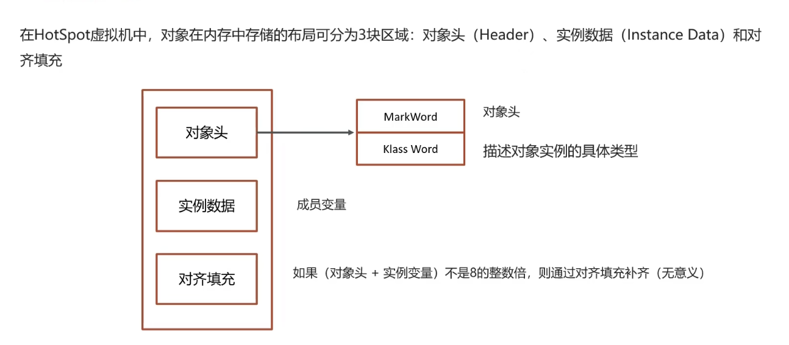

# 幂等如何实现

### 唯一业务标识（推荐首选）

- 为每次交易生成一个全局唯一的 `orderId`（UUID、雪花算法、数据库自增 + 时间戳等）。

- 作为数据库主键 / 唯一索引。

- 插入订单时，利用 **数据库的幂等性** 保证不会重复插入。

- 更新订单时，加上条件，比如：

  ```
  UPDATE orders 
  SET status = 'PAID' 
  WHERE order_id = ? AND status = 'CREATED';
  ```

  → 如果已经是 `PAID`，就不会再更新，保证幂等。

### Token/防重令牌

- 在下单前，生成一个 `token`，写到 Redis 里。
- 下单时必须携带这个 `token`，并且 Redis `DEL` 成功才能继续。
- 重复请求因为 `token` 已经被删掉，就会失败。
- 常见于秒杀/抢购场景。

### 幂等表 / 去重表

在分布式环境下，请求可能被 **重试 / 重放**（比如支付回调、MQ「至少一次投递」）。

我们希望：同一个「业务请求」只被处理一次。

做法：在数据库里建一张 **幂等表**，专门用来记录「业务唯一请求号」

```sql
CREATE TABLE idempotent_record (
    request_id VARCHAR(64) NOT NULL,
    biz_type   VARCHAR(32) NOT NULL,
    created_at TIMESTAMP DEFAULT CURRENT_TIMESTAMP,
    PRIMARY KEY (request_id, biz_type)
);
```

业务请求到来时，先尝试插入一条 `request_id`

如果插入成功 → 说明这是**第一次请求**，继续执行业务逻辑。

如果插入失败（主键冲突） → 说明**请求已处理过**，直接返回成功（丢弃重复请求）

### 状态机控制

- 订单天然是个 **状态机**：`CREATED → PAID → SHIPPED → COMPLETED`。

- 每个状态只能往下走，不能回退。

- 在状态流转时加条件：

  ```
  UPDATE orders 
  SET status = 'SHIPPED' 
  WHERE order_id = ? AND status = 'PAID';
  ```

  → 保证不会因为重复调用「发货」接口导致多次发货。

# 数据库里的乐观锁和悲观

### CAS是原子操作！！！

### 悲观锁（Pessimistic Lock）

- **认为冲突一定会发生**，所以操作数据前要「锁住」。

- 典型实现：

  ```
  SELECT * FROM orders WHERE id = 1 FOR UPDATE;
  ```

  → 事务持有行锁，别人必须等我释放后才能修改。

- 应用：库存扣减（防止超卖）。

- 缺点：锁竞争严重时性能差，容易阻塞。

### 乐观锁（Optimistic Lock）

**认为冲突不常发生**，所以操作时不加锁，而是在提交时检查「有没有人动过数据」。

常见实现：加一个 `version` 字段，每次更新时带上条件：

```
UPDATE orders 
SET stock = stock - 1, version = version + 1 
WHERE id = 1 AND version = 5;
```

- 如果 `version` 匹配 → 更新成功。
- 如果 `version` 不匹配 → 说明数据被别人修改过，当前操作失败，需要重试。

应用：高并发下的库存扣减、账户余额修改。

优点：无锁，提高并发性能。

缺点：需要业务侧写**重试逻辑**。

有点类似CAS，但是它依靠的ACID来实现原子操作的！！！

# `System.gc()` 和 Full GC 都不保证立即执行

调用 `System.gc()` 是 **向 JVM 发出建议**，告诉它“现在可以尝试进行垃圾回收”。

**JVM 可以选择忽略**这个请求，也可以延迟执行，具体行为取决于 JVM 实现（HotSpot、OpenJ9 等）和垃圾收集器（G1、Parallel GC、ZGC 等）。

也就是说，调用 `System.gc()` 并不意味着马上就会触发 GC，也不保证会进行 Full GC。

例如，在 G1 或 ZGC 下，`System.gc()` 可能只触发一次并发标记或某个 region 回收，而不是立刻清理整个堆。

虽然 Full GC 本身是“立即执行”一旦触发，但触发条件不一定立刻满足，即 **你不能保证每次调用 System.gc() 都会立即触发 Full GC**

```
-XX:+ExplicitGCInvokesConcurrent  # 对 G1/并发 GC 有效
-XX:+DisableExplicitGC            # 禁止 System.gc() 的调用
```


# 堆内内存 vs 堆外内存

| **维度**     | **堆内内存（Heap Memory）**         | **堆外内存（Off-Heap Memory）**                              |
| :----------- | :---------------------------------- | :----------------------------------------------------------- |
| **存储内容** | 对象实例、数组（`new`关键字创建的） | 直接内存（如`ByteBuffer.allocateDirect`）、JNI调用、Metaspace（类元数据） |
| **管理方式** | JVM自动GC管理（分代回收）           | 手动管理（需显式释放，如`Unsafe`或`ByteBuffer`的`cleaner`）  |
| **分配速度** | 较慢（需GC参与）                    | 较快（直接调用操作系统API，如`malloc`）                      |
| **内存溢出** | `OutOfMemoryError: Java heap space` | `OutOfMemoryError: Direct buffer memory` 或 `OutOfMemoryError: Metaspace` |
| **典型用途** | 业务对象、集合类                    | 网络IO（Netty）、大数据（Spark）、缓存（Ehcache）            |

```
jstack <java_pid> | grep <nid>  # 将线程ID（16进制）与堆栈关联
```

- **常见原因**：死循环、锁竞争、频繁GC、算法复杂度高。

```
jstat -gcutil <pid> 1000  # 每秒打印GC统计
```

- `YGC/YGCT`：年轻代GC次数/耗时。
- `FGC/FGCT`：Full GC次数/耗时（频繁Full GC会导致CPU飙升）。

```
jmap -dump:format=b,file=heap.hprof <pid>  # 生成堆转储
jhat heap.hprof  # 分析（或使用MAT工具）
```

Young Gen (Eden + Survivor0 + Survivor1) / Old Gen

```
-Xms512m -Xmx512m       # 堆初始/最大大小
-XX:NewRatio=2           # 老年代/年轻代比例（2:1）
-XX:SurvivorRatio=8      # Eden/Survivor比例（8:1:1）
```

Metaspace存储**类元数据**（如类名、方法字节码）

```
-XX:MaxMetaspaceSize=256m  # 限制大小
-XX:MetaspaceSize=64m     # 初始大小
```

# ...

本质就是一个数组

Java 中可变参数只能用于方法的**最后一个参数**；

一个方法中只能有**一个可变参数**；

可变参数内部是通过数组来实现的。

# Aopcontext.currentProxy()

是 Spring AOP 提供的一个 **获取当前 AOP 代理对象** 的方法。它主要用于解决 **内部方法调用无法触发切面（增强）** 的问题

当一个类内部调用自己类的方法时，这种 **“自调用”** 不会经过 Spring 的 AOP 代理，因此 **切面不会生效**

```java
@Service
public class MyService {
    @Transactional
    public void methodA() {
        methodB();  // <-- 自调用，事务不会生效
    }

    @Transactional
    public void methodB() {
        // some db operation
    }
}
```

 `@Transactional`不会走代理

```
((MyService) AopContext.currentProxy()).methodB();
```

使用条件就是开启AOP `@EnableAspectJAutoProxy(exposeProxy = true)`

**只能在 AOP 代理对象管理的类中使用**（比如加了 `@Service`、`@Component` 的 Bean）。

# @Autowired VS @Resource

```java
@Autowired
private UserService userService;
```

Spring 会找 **所有类型是 `UserService` 的 Bean**。

如果找到多个，需要用 `@Qualifier("xxx")` 指定 Bean 名称，否则报错。

可以配合 `@Primary` 指定首选 Bean。

默认必须注入，若可能为 null，加 `@Autowired(required = false)`。

此外可以使用`@Lazy`来延迟加载

> Spring 默认会在容器启动时就创建所有 `@Component`、`@Service` 等单例 Bean。
>
> 但有些 Bean：
>
> - 初始化代价很大（比如连接外部系统）
> - 不一定每次都用到
> - 或者会出现**循环依赖**

### `@Resource` —— **默认按名字注入**

```java
@Resource
private UserService userService;
```

默认会找 **名字为 `userService` 的 Bean**，名字优先。

找不到才会退回到按类型。

不支持 `@Primary` 和 `@Qualifier`。

如果名字匹配多个 Bean，会报错。

```java
@Service("userServiceA")
public class UserServiceA implements UserService {}

@Service("userServiceB")
public class UserServiceB implements UserService {}
```

`@Service`就是注册bean

```java
@Autowire
@Qualifier("userServiceA")
private UserService userService;

@Resource(name="userServiceA")
private UserService userService;
//可以

@Resource
private UserService userService;
//找不到会有问题
```

# RESTFUL是什么？和http关系是什么？

**RESTful 是一种 Web API 的设计风格（不是协议，不是标准）**，全称是：

> **RE**presentational **S**tate **T**ransfer

它的核心思想是：

用 URL 表示资源（Resource）

用 HTTP 方法（GET、POST、PUT、DELETE）来对资源进行操作。

## RESTful 与 HTTP 的关系？

- **HTTP 是协议**：定义了浏览器和服务器如何通信（GET/POST 等）
- **RESTful 是设计风格**：利用 HTTP 协议去优雅地设计接口

RESTful 是“构建在 HTTP 协议之上的一种接口设计规范”。

HTTP 是传输协议，RESTful 是一种接口设计方法。RESTful 是用 HTTP 来优雅地操作资源的方式。

# Synchronize

static class可以有static的method

### 锁在对象上

`synchronized` 作用在**静态方法**

```java
public synchronized static void myStaticMethod() {
    // 临界区代码
}
```

这和 `synchronized(MyClass.class)` 是**等价的**，锁的对象是类的 `Class` 对象（即 `MyClass.class`），也属于**类锁**。

`synchronized` 锁在 **非静态方法** 上（实例锁）

```java
public synchronized void myMethod() {
    // 临界区代码
}
```

这个锁的是当前对象实例（`this`），属于 **对象锁（实例锁）**

也就是说：

- 每个对象有自己的锁
- 不同对象调用这个方法，**互不干扰**
- 同一个对象多线程调用这个方法，**互斥执行**

```java
A a1 = new A();
A a2 = new A();

Thread t1 = new Thread(() -> a1.myMethod());
Thread t2 = new Thread(() -> a2.myMethod());
```

上面这两个线程不会互相阻塞，因为 `a1` 和 `a2` 是不同对象，各自持有自己的锁。

`synchronized` 作用在**静态方法** ⇒ 类锁（`MyClass.class`）

`synchronized` 作用在**实例方法** ⇒ 对象锁（`this`）

### 锁在class上

```java
synchronized (A.class) { ... }              // 类锁
```

这是**类锁**（Class-level lock），作用于整个类的 Class 对象（JVM 中每个类只有一个 Class 对象）。

作用范围是：**同一个类的所有线程共享这个锁，不管这些线程访问的是哪个对象，只要使用这个类锁的代码块，就互斥执行。**

典型用途：控制所有该类对象共享资源的访问，比如静态变量的操作。

控制所有实例间的同步

# `equals` 未改写可以直接比较两个对象是否相等

浅拷贝对象是不同的，但是里面数值是引用，list，array，set 都是浅拷贝，equals都不等！但是里面的key value相等

比较是否是同一个对象，比较两个对象的引用是否相同（即是否是同一个对象）

```java
public boolean equals(Object obj) {
    return (this == obj);
}
```

Hashcode将对象映射为一个整数，用于快速定位数据在哈希结构（如 HashMap、HashSet）中的“**桶（bucket）**”

```java
Object a = new Object();
Object b = new Object();

System.out.println(a.equals(b)); // false，因为它们是两个不同的对象
System.out.println(a == b);      // 也是 false

Object c = a;
System.out.println(a.equals(c)); // true
```

可以比较，但结果是：**只比较引用地址是否相等**，即：

默认的 `equals` 方法是 Object 类中的，源码如下：

```java
public boolean equals(Object obj) {
    return (this == obj);
}
```

所以如果你没有重写 `equals()`，比较的就是**是否是同一个对象实例**，即和 `==` 的结果是一样的。

# 最最基本的语法！我tm都错了

```java
interface AtomicIntegerFactory {
    AtomicInteger create(int initValue);
}

@RestController
@RequestMapping("/api")
public class Thread1 {
    @Autowired
    private AtomicIntegerFactory factory;

    private final Map<Long, AtomicInteger> counterMap = new ConcurrentHashMap<>();
    private final int limit = 100; // 默认QPS限制为100

    @RequestMapping("/qps")
    public String checkQPS() throws Exception {
        try {
            qps(limit);
            return "请求通过";
        } catch (Exception e) {
            return "请求被限流";
        }
    }

    private void qps(int limit) throws Exception {
        long currentSecond = System.currentTimeMillis() / 1000;
        AtomicInteger counter = counterMap.computeIfAbsent(currentSecond, k -> factory.create(0));
        
        int currentCount = counter.incrementAndGet();
        if (currentCount > limit) {
            throw new Exception("QPS超限");
        }
    }
}
```


**ArrayList线程安全吗** → 默认**不安全**，可以用`Collections.synchronizedList`或者`CopyOnWriteArrayList`加锁

**throw vs throws**：

- `throw`抛出具体异常
- `throws`声明可能抛出的异常，给调用者处理

throws在函数名边上，throw就正常抛出

**接口 vs 抽象类!!!!!!**

- 接口只能有**默认方法（default）**、**静态方法**，不能有实例变量
- 抽象类可以有方法实现、成员变量

#### redissons 参数

```
SET lock:user123 "locked" NX EX 5
SET key value NX EX 10
```

# Filter和Interceptor!!!!!!!

**Filter 是“Servlet 管”，Interceptor 是“Spring 管”；Filter 管得更底层，Interceptor 更贴近业务**

运行顺序不同，Filter在请求发出到Servlet之间，Interceptor是Servlet到controller之间

配置方式不同，Filter webxml，Interceptor spring 配置文件配置，比如JWTInterceptor，或者注解方法

Filter依赖Servlet容器，Interceptor不依赖

Filter只对Request，Response操作

Interceptor对Request，Response，handler，modelAndView，exception

Interceptor **Spring**层面（基于AOP思想，拦截的是Controller）只拦截Controller层

**按注册顺序执行**，`preHandle -> Controller -> postHandle -> afterCompletion`

Filter **Servlet**层面（在请求进入Servlet前、响应返回客户端前处理）**可以拦截所有请求**（包括静态资源，比如CSS、JS）

```
客户端请求
   ↓
Filter（过滤器，Servlet层面）
   ↓
Servlet（DispatcherServlet）
   ↓
Interceptor.preHandle（拦截器前置逻辑）
   ↓
Controller（真正处理请求）
   ↓
Interceptor.postHandle（拦截器后置逻辑，controller执行成功后调用）
   ↓
视图渲染（ModelAndView）
   ↓
Interceptor.afterCompletion（请求结束后，不管成功/异常，都会执行）
   ↓
Filter（响应返回前）
   ↓
客户端接收响应
```

**Controller 返回的是业务处理的“结果”**，这个结果可能是：

- JSON 数据（给前端 API 的）
- 页面名（跳转到某个模板页面）
- 视图对象（Spring MVC 自动渲染）
- 甚至什么都不返回（比如上传接口）

# Java basic

### instanceof

```java
if (!(handler instanceof HandlerMethod)) {
    return true;
}
```

`handler` 代表拦截到的资源，如果它不是 `HandlerMethod`（也就是 Controller 里的方法），说明拦截到的是静态资源（比如 CSS、JS、图片等），那就直接放行

这个就是判断拦截到的对象是不是HandlerMethod

### 多态

重载（Overload）是方法签名不同

重写（Override）是子类修改父类的方法实现。

面向对象：继承，封装，多态

用统一的接口调用不同的对象，从而产生不同的行为

多态的主要形式有两种，重载，也就是参数不同，重写，子类重写父类

### String、StringBuffer、StringBuilder

**String**：

- `String` 是不可变类，每次对其内容的修改都会生成新的 `String` 对象，因此效率较低。
- 适用于不需要修改字符串内容的场合。

**StringBuffer**：

- `StringBuffer` 是可变类，允许修改字符串内容，且线程安全（同步）。基于synchronized
- 适用于多线程环境下对字符串进行修改的场合，但由于其线程同步的机制，性能较低。

**StringBuilder**：

- `StringBuilder` 也是可变类，功能与 `StringBuffer` 类似，但它是 **非线程安全** 的。
- 适用于单线程环境下对字符串进行修改时，性能优于 `StringBuffer`。

### final, finally, finalize

`final`：修饰变量、方法、类，表示不可变、不可重写或不可继承

`finally`：用于异常处理，表示无论异常是否发生，都会执行的代码块`try catch finally`

`finalize`: `java.lang.Object` 类中的一个方法，主要用于在垃圾回收器回收对象之前执行一些清理操作

```java
@Override
protected void finalize() throws Throwable {
    // 清理资源代码
    System.out.println("Object is being finalized");
    super.finalize();  // 调用父类的 finalize() 方法
}
```

当垃圾回收器准备回收对象时，如果该对象的 `finalize()` 方法没有被调用过，垃圾回收器会调用该对象的 `finalize()` 方法

在 `finalize()` 方法内，你可以释放一些资源或做其他必要的清理工作。

`finalize()` 方法默认什么也不做，如果没有重写的话

如果在 `finalize()` 中抛出异常，垃圾回收器会忽略它，并且不会阻止对象的销毁

`finalize()` 方法的调用会增加垃圾回收的时间和性能开销，因为每个对象都需要经过垃圾回收器检查和调用 `finalize()`

### String class

```java
final class String {
    // String 类不能被继承
}
```

final class不可继承

`String` 是不可修改的（immutable）

一旦创建了一个 `String` 对象，它的值就不能被改变。任何对 `String` 对象的操作，都会返回一个新的 `String` 对象，而不会修改原始的 `String` 对象

为什么 `String` 是不可修改的

* **线程安全**：
  - 因为 `String` 是不可修改的，它是线程安全的。这使得多个线程可以共享同一个 `String` 对象，而不需要担心数据竞争和同步问题。

* 哈希值缓存：
  * `String` 类通常会缓存其哈希值。在字符串常量池（String Pool）中，`String` 对象只有在首次使用时才会被创建，然后被多个引用共享。不可修改保证了该字符串的哈希值在整个生命周期内保持一致。

* 性能优化：
  - 在 Java 中，`String` 对象在内存中通常是共享的，因为它们的不可变性使得垃圾回收变得更高效，同时减少了内存占用

.java->javac->.class->jvm(JIT)->linux/win/Mac

`.class` 字节码


### Syntactical

```java
return new Exception("new error");
```

```java
import java.util.Scanner;
//use Scanner and System.out
nextInt()
//read next input
```

Memory management is automatic with the help of the garbage collector. Developers use `new` for object instantiation, but memory deallocation is handled automatically.

`Arrays.asList(couponEntity)`用于将数组或单个对象转成 `List` 类型的集合

### Datatypes

`boolean`，`Int`，`byte`，`char`，`double`，`float`，`int`，`long`，`short`，`null`

```java
String myString;
Char[] myArray;
myString.length();
myString.charAt(index);
myArray=myString.toCharArray();
```

#### Integer & int 区别

**`int`** 是 **基本数据类型**，用于表示一个 32 位的整数，它在内存中直接存储其值，不是对象

**`Integer`** 是 **`int`** 的封装类，属于 **引用类型**。它是一个类，可以将基本类型 `int` 包装成一个对象

```java
//int to string
String.valueOf(num);
Integer.toString(num);

//string to int
Integer.parseInt(str);
Integer.valueOf(str);
```

#### Scanner

```java
import java.util.Scanner;

Scanner scan=new Scanner(System.in);
int a=scan.nextInt();
String c=scan.nextLine();
```

### BufferReader

```java
BufferedReader reader = new BufferedReader(new FileReader("input.txt"));
String line;
while ((line = reader.readLine()) != null) {
    System.out.println(line);
}
reader.close();
```

### Lambda

```java
// 1. 不需要参数，返回值为 5
() -> 5

// 2. 接收一个参数（数字类型），返回其 2 倍的值
x -> 2 * x

// 3. 接受 2 个参数（数字）并返回他们的差值
(x, y) -> x – y

// 4. 接收 2 个 int 类型整数并返回他们的和
(int x, int y) -> x + y

// 5. 接受一个 String 对象并在控制台打印，不返回任何值（看起来像是返回 void）
(String s) -> System.out.print(s)
```

### Oops Concepts

#### Interface

一个类不能继承多个类，**但一个类可以实现多个接口**，这被视为一种多重继承的形式。

```java
public interface MyInterface {
    void method1();
    void method2();
}

public class MyClass implements MyInterface {
    @Override
    public void method1() {
        System.out.println("Method1 implementation");
    }
    
    @Override
    public void method2() {
        System.out.println("Method2 implementation");
    }
}

public class Test {
    public static void main(String[] args) {
        MyInterface myObject = new MyClass();
        myObject.method1(); // 输出 "Method1 implementation"
        myObject.method2(); // 输出 "Method2 implementation"
    }
}
///---------------------------------------------------------------------///
public interface InterfaceA {
    void methodA();
}

public interface InterfaceB {
    void methodB();
}

public class MyClass implements InterfaceA, InterfaceB {
    @Override
    public void methodA() {
        System.out.println("MethodA implementation");
    }
    
    @Override
    public void methodB() {
        System.out.println("MethodB implementation");
    }
}
```

#### Exception Handling

#### Polymorphism and Dynamic Binding

所有的方法（除了 `static` 方法和 `final` 方法）默认都是虚拟方法（virtual methods），即它们在运行时是通过动态绑定来调用的

```java
class Animal {
    void makeSound() {
        System.out.println("Animal sound");
    }
}

class Dog extends Animal {
    @Override
    void makeSound() {
        System.out.println("Dog barks");
    }
}

public class Test {
    public static void main(String[] args) {
        Animal a = new Dog();
        a.makeSound(); // 输出 "Dog barks"
    }
}
```

**Animal a = new Dog();**: 这行代码创建了一个 `Dog` 对象，但用 `Animal` 类型的引用 `a` 来引用它。

**a.makeSound();**: 由于 `a` 实际上引用的是一个 `Dog` 对象，调用 `makeSound()` 方法时，Java 会在运行时决定调用 `Dog` 类的 `makeSound()` 方法，而不是 `Animal` 类的 `makeSound()` 方法。因此，输出是 "Dog barks"。

**Animal a = new Animal();**: 这会创建一个 `Animal` 对象，`a.makeSound()` 调用的是 `Animal` 类的 `makeSound()` 方法，输出是 "Animal sound"。

**Dog a = new Animal();**: 这种写法在 Java 中是不允许的，因为 `Animal` 是 `Dog` 的父类，不能把父类对象赋值给子类引用。这会导致编译错误。

#### interrupt & join

当线程调用 `interrupt` 方法时，如果线程处于阻塞状态（如 `sleep`、`wait`、`join` 等），会抛出 `InterruptedException` 异常，如果线程没有处于阻塞状态，会设置线程的中断标志

这里主线程运行t2.join()就是主线程等待t2执行完成

```java
public class InterruptExample {
    public static void main(String[] args) throws InterruptedException {
        Thread thread = new Thread(() -> {
            try {
                // 模拟线程执行任务
                Thread.sleep(5000);
            } catch (InterruptedException e) {
                // 捕获到中断异常
                System.out.println("Thread interrupted");
            }
        });

        thread.start();
        Thread.sleep(1000);
        thread.interrupt();
        //thread.join();
    }
}
```

#### Thread Communication

```java
public class ThreadCommunicationExample {
    public static void main(String[] args) {
        Object lock = new Object();
        
        Thread thread1 = new Thread(() -> {
            synchronized (lock) {
                try {
                    System.out.println("Thread 1 waiting");
                    lock.wait();
                    System.out.println("Thread 1 resumed");
                } catch (InterruptedException e) {
                    e.printStackTrace();
                }
            }
        });

        Thread thread2 = new Thread(() -> {
            synchronized (lock) {
                try {
                    System.out.println("Thread 2 starting");
                    Thread.sleep(2000);
                    System.out.println("Thread 2 notifying");
                    lock.notify();
                } catch (InterruptedException e) {
                    e.printStackTrace();
                }
            }
        });

        thread1.start();
        thread2.start();
    }
}
```

## JDBC


1. **连接到数据库**：JDBC 提供了一种标准的方法来连接各种数据库。
2. **执行 SQL 语句**：可以使用 JDBC 执行 SQL 查询、插入、更新和删除操作。
3. **处理结果集**：从数据库中获取查询结果，并在 Java 程序中处理这些数据。
4. **事务管理**：支持数据库事务，允许开发人员控制事务的提交和回滚。

### Connection

`DriverManager`

```java
        Connection connection = DriverManager.getConnection(
          "jdbc:mysql://127.0.0.1:3306/data?user=root&password=123456");
```

`DataSource`

```java
        DataSource dataSource = new UnpooledDataSource(
                "com.mysql.cj.jdbc.Driver",
                "jdbc:mysql://127.0.0.1:3306/data?user=root&password=123456&AllowPublicKeyRetrieval=true",
                "root","qwer1234");
```

### Statement

- Statement 不支持输入参数，有sql注入的风险
- PreparedStatement：增加了设置SQL参数的方法
- CallableStatement：增加了调用存储过程以及检索存储过程调用结果的方法

```java
Connection connection = DriverManager.getConnection("");
String sql = "SELECT * FROM admin WHERE username = ? AND password = ?";
PreparedStatement preparedStatement = connection.prepareStatement(sql);
preparedStatement.setString(1,"username");
preparedStatement.setString(2,"password");
ResultSet resultSet = preparedStatement.executeQuery();

// the function below is like to have risk of sql injection
String sql2 = "SELECT * FROM admin WHERE username = 'username' AND password = 'password'";
Statement statement2 = connection.createStatement();
ResultSet resultSet2 = statement.executeQuery(sql);
```

### Eg Code

```java
import java.sql.Connection;
import java.sql.DriverManager;
import java.sql.ResultSet;
import java.sql.Statement;

public class JDBCDemo {
    public static void main(String[] args) {
        // 数据库连接信息
        String jdbcUrl = "jdbc:mysql://localhost:3306/mydatabase";
        String username = "root";
        String password = "password";

        Connection connection = null;
        Statement statement = null;
        ResultSet resultSet = null;

        try {
            // 加载 MySQL 驱动程序
            Class.forName("com.mysql.cj.jdbc.Driver");

            // 获取数据库连接
            connection = DriverManager.getConnection(jdbcUrl, username, password);

            // 创建 Statement 对象
            statement = connection.createStatement();

            // 执行查询
            String sql = "SELECT * FROM users";
            resultSet = statement.executeQuery(sql);

            // 处理结果集
            while (resultSet.next()) {
                int id = resultSet.getInt("id");
                String name = resultSet.getString("name");
                String email = resultSet.getString("email");
                System.out.println("ID: " + id + ", Name: " + name + ", Email: " + email);
            }
        } catch (Exception e) {
            e.printStackTrace();
        } finally {
            // 关闭资源
            try {
                if (resultSet != null) resultSet.close();
                if (statement != null) statement.close();
                if (connection != null) connection.close();
            } catch (Exception e) {
                e.printStackTrace();
            }
        }
    }
}
```


## Sping

## 

# Java八股

### Static

类变量，所有类的实例共享同一个 `static` 变量，`funcA.staticA`

类方法，类加载时进行

静态代码块，在类加载时只会执行一次。

**Java** 中的 `static` 主要用于类的级别，而不涉及文件作用域

**静态成员函数（static 方法）** 在 Java 中的确只能直接访问 **静态成员（static 变量、静态方法）**

#### 什么时候初始化？

下面三个整个成为class load

- **加载**：将类的字节码加载到内存中，并生成对应的 `Class` 对象。这个阶段主要是将 `.class` 文件中的二进制数据读取到内存中，并创建一个 `Class` 对象来表示这个类。

- **链接阶段=验证、准备和解析** 其中准备阶段就是：为静态变量分配内存并设置默认值（`0`、`null` 等），带有初始值的 `final` 静态变量会在这个阶段直接赋值。
- **初始化阶段**：执行静态变量的赋值操作和静态初始化块中的代码，按照代码中的顺序执行。

通过这两个阶段，Java 确保静态变量在类被首次使用之前已经被正确初始化。

具体的初始化时机是：当类的某个静态成员被访问时，JVM 会确保该类已经被加载并进行初始化

解析就是把符号引用变成直接引用

**符号引用**：一种逻辑描述，存储在 `.class` 文件的常量池中，与内存布局无关

**直接引用**：具体的内存地址或偏移量，JVM 可以直接使用

将符号引用转换为直接引用的过程，确保 JVM 能够正确找到并调用类、方法或字段

#### 比如

```java
private static final int VM_COUNT = 10; 
```

**编译期确定**，`final` + `static` 的基本类型和字符串常量在**编译期**就被优化到**常量池**里了，直接作为常量用，不走赋值流程。

```java
static ExecutorService executor;
```

**先分配内存，默认是 null**，后面得手动初始化 `executor = Executors.newFixedThreadPool(10)` 这种。

```java
private static final ByteArrayOutputStream outContent = new ByteArrayOutputStream();
```

### 单继承限制

**单继承限制**：Java 中一个类只能继承一个类，如果继承了 `Thread`，就无法继承其他类

### Runnable and Callable

`Runnable` 是一个简单的任务接口，适合不需要返回结果或抛出异常的任务。

```java
public interface Runnable{
	void run();
}
```

没有返回值。

不能抛出受检异常（Checked Exception）。

`Callable` 是一个任务接口，适合需要返回结果或抛出异常的任务。

```java
public interface Callable<V> {
    V call() throws Exception;
}
```

execute 提交一个`Runnable`任务

submit 提交一个task返回`Future`， `future.get()` 方法，可以阻塞当前线程并等待任务执行完成，返回结果

# Redis 2025.01.12 3.1 8.28三刷

SpringCache是一种集成多种缓存方案的接口，是一层抽象层

启动类加上`@EnableCaching`

`@Cacheput()`

`@Cacheable()`

```java
@Cacheable(cacheNames="userCache",key="#id")
```

`@CacheEvict`

```java
@DeleteMapping
@CacheEvict(cacheNames = "userCache",key="#id") //key的形式 userCache::10
public void deleteById(Long id){userMapper.deleteById(id);}
 
@DeleteMapping("/delAll")
@CacheEvict(cacheNames="userCache",allEntries = true)
public void deleteAll(){
    userMapper.deleteAll();
}
```

场景：缓存，分布式锁，计数器，保存token，消息队列MQ，延迟队列

### 穿透 Cache Penetration

根据Id查询文章，如果hit返回res，redis没有查询disk，然后返回结果，返回前也把请求缓存到redis

穿透：redis里没有，disk也没有 （受外部攻击）

* 缓存空数据`{key:1,value:null}`消耗内存，可能会数据不一致,(类似于双删延迟)就是后续有数据了，但是redis里value还是null

- 布隆过滤器`hash+bitmap`，首先经过bloom filter，拦截不存在的数据, bloom filter不存在就一定没有，有的话实际也不一定存在（误判）

>bitmap
>
>key->multiple hash function->hash1, hash2, hash3
>
>p1=hash1(key), p2=hash2(key), p3=hash3(key)
>
>then turn these position into 1, use  & to judge
>
>**Redisson**, Guava: implementation 
>
>```java
>bloomfilter.tryInit(size,0.05);//误判率
>//bloomFilter.tryInit(100000, 0.01);
>//init的时候就要加入数据了
>bloomfilter.add(x); 
>```

**缓存预热时，预热bloom filter**

数组越大误判率越小，数组越小误判率越大，但是大数组会更多内存损耗

bloom filter hash碰撞怎么办

* 增加哈希函数数量

* 增加数组，降低误判率

* 双bloom filter，**没有什么是加一中间层没法解决的**

### 击穿Cache Miss Storm/Cache Breakdown

注意看这里加锁的时机，是先**cache未命中加互斥锁**！

击穿就是本来redis有，但是热点key expire，需要到数据库查询，然后更新redis，但是会有**50ms的空档**，并发的request会把DB打崩


* 互斥锁 (强一致性)
* 逻辑过期  这里也获取互斥锁，只不过是直接返回old value，然后另开一个线程异步更新value+expire time

### 雪崩 Cache avalanche

同一时间大量key同时失效或者redis宕机

* 给不同key的TTL设置随机值

* redis集群(Sentinel,集群模式)

* 降级限流策略 nginx或者spring cloud gateway

* 添加多级缓存 Guava或Caffeine

>  没有什么问题是加一层解决不了的

### 双写一致

为了解决分布式系统中多个存储之间的数据一致性问题，比如数据库和缓存，数据库和消息队列

写入缓存的数据都是读多写少的！不然不如直接读数据库，因此读多写少，可以用读写锁

双写一致:修改了数据库同时也更新缓存数据, 让redis和db数据一致

* 延迟双删->delete redis->change disk-> delay->delete redis

有脏数据的风险

要**强一致性**就加锁,性能就低了，RWLock适用于强一致性的业务，因为在Write的时候还是会阻塞别的Read！

```java
RReadWriteLock readWriteLock = redissonClient.getReadWriteLock("ITEM_READ_WRITE_LOCK");
//这里ITEM_READ_WRITE_LOCK名称要一致！
RLock writeLock = readWriteLock.writeLock();

RLock readLock = readWriteLock.readLock();
try{
	writeLock.lock(); // 加锁
  redisTemplate.opsForValue().get(key);
  redisTemplate.opsForValue().set(key);
  redisTemplate.opsForValue().delete(key);
}
```


但是实际上我们一般有**最终一致性**就好了，允许短暂不一致，保证最终一致性

**异步通知**，就是先修改数据库，然后item-service发布消息到MQ，cache-service监听MQ，然后更新缓存

（据说Canal已经不用了，好处是不改变业务代码 ）

基于Canal的异步通知，修改数据到item-service，然后写入数据库， 数据库一旦变化，cannal监听mysql的binlog（二进制日志），通知cache-service数据变化，更新缓存

### 持久化 （就是存到disk里）

#### RDB (Redis Database Backup)

```shell
redis-cli
save #主进程，会阻塞别的命令
bgsave #子进程来执行RDB
```

redis.conf

```shell
save 900 1 #900s里1key修改就bgsave
```


只拷贝**Page table**所以快

如果RDB的时候有写怎么办，就直接copy-on-write，就是复制出来再修改

两次RDB之间可能会丢失备份(如果宕机了) ，**二进制文件，体积小，恢复快，可能丢数据** 适用于一致性要求不高的场景

这里RDB存的是kv对！而不是操作！AOF是记录操作！！！

### AOF (append only file) 在磁盘里

先写redis，再写AOF的吗！

为了避免命令的写入过程中对Redis的性能造成过多影响。执行命令后，AOF文件会追加操作日志，保证命令能被存在磁盘上。

redis处理每一个write都记录在AOF，因此会比RDB大得多！注意这里是写操作！（如`SET`、`LPUSH`、`HSET`等）

```shell
appendonly yes
appendfsync everysec #性能适中,最多丟1s数据
```

写回策略

* **每次写操作都写入AOF**：每次命令执行后立即写入AOF文件，保证数据的持久化，但性能相对较低。
* **每秒写入（`appendfsync everysec`）**：默认策略，每秒写入一次。性能和持久化之间取得平衡
* **从不写入（`appendfsync no`）**：完全依赖操作系统来刷新数据到磁盘，性能最优，但丢失的数据最多

`bgrewriteaof`可以让AOF文件执行重写功能，只会留下最后一次操作

cpu资源占用低，主要是**磁盘的IO资源**，但是**AOF重写会占用大量的CPU和内存**

宕机恢复速度慢

### 数据过期，淘汰策略

Lazy Deletion 只有在**访问键**时，Redis 才会检查它是否过期

Scheduled Deletion  每 **100ms** 扫描**一批**设置了**过期时间**的 key（不是扫全部！），随机选择一些进行检查和删除，清理耗时不超过xxms，尽可能少占用主进程的操作

一般都是lazy deletion和schedule deletion结合使用

Eviction Policy 当 Redis **内存达到上限**时，Redis 需要**主动清理**数据

> `noeviction` 默认！
>
> `volatile-lru`：从**设置了过期时间的 key** 中，**淘汰最久未使用的 key**
>
> `volatile-ttl`：从设置了过期时间的 key 中，优先淘汰**即将过期**的 key
>
> `allkeys-lru`：对**所有 key**，淘汰最久未使用的 key（即使没有过期时间）
>
> `noeviction`：内存满了后，直接返回错误，不删除任何 key

还有lfu least frequently used

有置顶数据，就lru+不设置过期时间，热点数据就lru，高频访问数据就lfu，默认就no eviction报错

lru linklist+hashmap

lfu linklist+hashmap+freq_hashmap

**Lazy Expiration** 高并发热点 key，防止缓存击穿,Redis 不会删除数据

### DCL（Distributed Cache Lock）

**加锁时，最重要的是保证分布式系统中的锁的唯一性和可用性**。核心问题包括：

- **锁的公平性**：确保多个请求能公平地获取锁，而不至于某些请求饿死。
- **死锁避免**：加锁时需要避免死锁，通常通过锁超时、锁竞争机制等来防止。
- **锁的可见性**：在分布式系统中，要保证锁的状态能在所有节点间同步。
- **性能**：加锁和解锁的性能需要权衡，避免由于加锁带来的性能瓶颈。

### 分布式锁 setnx, redisson

可以用setnx实现一个分布式锁

redis.set()加锁

Redis.get()解锁

```java
boolen lock=redis.setnx("lock_key","locked");
if (lock) {
    try {
        // 执行任务
    } finally {
        redis.del("lock_key");
    }
}
```

场景：集群定时任务，抢单，幂等性

#### 超卖问题！！

```java
Integer num=(Integer) redisTemplate.opsForValue().get("num");
if(num==null || num<0){
    throw new RuntimeException
}
num=num-1;
redisTemplate.opsForValue().set("num",num);
```

加锁 synchronized() **线程同步**，防止多个线程同时访问**同一个对象** 造成数据不一致的问题。这个单体是没问题的，但是集群就不行了，因为synchronized是本地锁！！

`synchronized` 是JVM 层面的内建同步机制，通常与对象、类的方法或代码块关联，不提供显式的死锁检测和避免机制

而普通加锁`ReentrantLock` 支持可重入锁、尝试锁定、定时锁定等，`tryLock()` 方法可以尝试获取锁并返回一个布尔值，从而避免死锁

```java
synchronized(this){}
public synchronized void foo(){}

Lock lock=new ReentrantLock();
if(lock.tryLock()){
  try{
  }finally{
    lock.unlock();
  }
}
```

**`this` 代表当前对象**

- 用于 **实例方法、构造方法** 里，指向 **当前对象**。
- `this.name = name;` 避免变量冲突

#### setnx (set if not exist)

这里**key就是锁的名称**，表示加锁的资源，key要唯一

**value是锁的唯一表示，通常设置为当前线程的唯一ID，UUID或者thread id**

```shell
SET lock value NX EX 10 #放在一起保证原子性,这里NX互斥,EX超时
DEL key #释放锁 
```

加锁有EX时长,如果业务执行太长超过lock EX time

#### Redisson

1 **WatchDog**,有一个thread进行监控,如果业务太久就增加setnx时长

**Redisson 会自动续期**，不需要手动增加 `SETNX` 过期时间

**默认 30 秒持有锁，每 10 秒自动续期**，只要任务没有完成，锁就不会被释放,每ReleaseTime/3做一次续期

手动释放锁,通知Watch Dog


2 **重试机制,尝试等待,高并发增加分布式锁的使用性能**（一般情况下），不然循环到一定次数就获取锁失败

注意，这里Reddison有读写锁`RReadWriteLock`和普通分布式锁`RLock`

`RLock`基于`SETNX`实现，**可重入**，watchdog续期

`tryLock`尝试获取锁，`10` 秒是获取锁的最大等待时间。如果在 10 秒内成功获得锁

```java
RLock lock = redissonClint.getLock("a");
boolen isLock=lock.tryLock(10,TimeUnit.SECONDS); //while time =10 s
if(isLock){
    try{
        
    }finally{
        lock.unlock();
    }
}
//boolen isLock=lock.tryLock(10,30,TimeUnit.SECONDS); //30 is EX time, 30设置了就没有watch dog的监听了,不设置过期时间就是默认有watch Dog做续期
```

3 **加锁 设置过期时间等redisson命令都是lua脚本完成,保证执行的原子性**

> 在 Redis 中，分布式锁的核心操作是：
>
> 1. **加锁**（SETNX）
> 2. **设置过期时间**（EXPIRE）
> 3. **解锁**（DEL）
>
> 如果我们**直接用普通命令实现加锁**：
>
> ```bash
> SETNX myLock "thread-1"  # 尝试加锁
> EXPIRE myLock 10          # 设置超时时间
> ```
>
>  **问题：这两个命令是分开的，存在并发安全问题！**
>
> - 如果 **在 `SETNX` 和 `EXPIRE` 之间** 发生 **线程崩溃** 或 **服务器宕机**，锁 **可能永远不会过期**（**死锁问题**）。
> - **多个客户端可能同时加锁**，导致多个实例误认为自己持有锁。
>
> **解决方案：使用 Lua 脚本，一次性完成加锁 + 过期时间，保证原子性！**

### Lua脚本

为什么是原子性的？

**单线程执行模型**

没有显式的线程或中断

### 锁的重入（Reentrant Locking）

**同一个线程**在持有锁的情况下，可以再次获取该锁，而不会发生死锁

Redisson 是一个 Redis 客户端，它提供了许多高级的分布式数据结构和功能，其中之一就是分布式锁 (`RLock`)。这个锁的实现依赖于 Redis

redisson实现的锁`RLock`是可以重入的，redis里有hash结构记录，Key=LockName，Value={field:thread_id,value:reentrant times}

锁的重入信息并不是记录在 Java 线程本身，而是记录在 Redis 服务器中，使用 Redis 的 **Hash 结构** 来维护

### 主从一致性

Redis Master, Redis Slave,主从同步,为了防止Master加锁后down了,sentinel会把Slave变成Master后再加锁的情况，然后新线程也来获取锁，出现两个线程持有同一把锁的情况

**RedLock**:不止在一个redis实例上加锁,而是在多个redis实例上创建锁(n/2+1)  但是很少用,性能差 

为了保持数据强一致性,使用zookeeper实现的分布式锁 

redis主要保证AP，也就是高可用性，说白了就是redis解决不了主从不一致的问题

如果一定要强一致性，就采用**zookeeper**实现的分布式锁，可以CP

zookeeper是读多写少，因为leader和follower都可以读，顺序一致性

raft是

- 严格保证**线性一致性**
- 简化状态机复制逻辑
- 所有操作有序通过Leader

### 集群方案

高并发读：主从集群，高可用：哨兵集群，高并发写：分片集群

#### 主从复制

可以实现读写分离，master主要写，slave/replica主要读，变相增强了并发能力

但是需要主从同步


> - 全量同步是第一次建立连接：从节点请求主节点同步数据，其中从节点会携带自己的**replication id和offset**偏移量。主节点判断是否是第一次请求，主要判断的依据就是，主节点与从节点是否是同一个replication id，如果不是，就说明是第一次同步，那主节点就会把自己的replication id和offset发送给从节点，让从节点与主节点的信息保持一致。在同时主节点会执行bgsave，生成rdb文件后，发送给从节点去执行，从节点先把自己的数据清空，然后执行主节点发送过来的rdb文件，这样就保持了一致。
> - 当然，如果在rdb生成执行期间，依然有请求到了主节点，而主节点会以命令的方式记录到缓冲区，缓冲区是一个日志文件，最后把这个日志文件发送给从节点，这样就能保证主节点与从节点完全一致了，后期再同步数据的时候，都是依赖于这个日志文件，这个就是全量同步
> - 增量同步指的是，当从节点服务重启之后，数据就不一致了，所以这个时候，从节点会请求主节点同步数据，主节点还是判断不是第一次请求，不是第一次就获取从节点的offset值，然后主节点从命令日志中获取offset值之后的数据，发送给从节点进行数据同步

#### 哨兵模式 （监控，故障恢复，通知）

可以解决高可用,高并发读问题

监控Master Slave的正常工作,Master故障就Slave升Master,通知redis cli端

heartbeat监控,未响应主观下线,过Quorum sentinel认为主观下线就变成客观下线


分布式里脑裂问题，会导致数据丢失，比如两个master后其中一个降为slave，slave清空数据去同步master数据

#### 分片集群 

可以解决海量数据存储,**高并发写**问题

**多个master**,每个master**存不同数据**,有自己的slave,master之间互相监控ping

slave读，master写，主从多slave可以应对高并发读，分片多master可以应对高并发写

client可以访问任意master,都会被转发到正确节点（router）

通过hash来分流，hash槽有16384个

### 为什么Redis单线程怎么快

* 主要原因是内存

* 单线程不用上下文切换可竞争条件,多线程要线程安全

* **I/O多路复用,非阻塞IO** ！！

一般IO都是瓶颈，disk读写是mysql瓶颈，IO网络读写是redis瓶颈

一般都是用户拷贝到内核缓冲区，内核通过网卡发送，然后读入内核缓冲区，拷贝回用户缓存区

Redis瓶颈是网络延迟, I/O多路复用高效网络请求

* User Space & Kernel Space
* Blocking IO, Nonblocking IO, IO Multiplexing


阻塞IO user在等内核数据时候，是阻塞的！

非阻塞IO 就是阻塞等待，问了没回就过一会儿继续再问，忙等会导致cpu空转

IO多路复用，单线程监听多个socket

* select fd固定大小，fd_set bitset MAX 1024

* poll fd数量动态`struct pollfd` **结构体数组**，理论上无限制（受内存限制），和select一样都是tranverse的到可用fd

好了就发signal,然后kernel论询查哪个fd好了

* epoll 用的红黑树用于存储和管理注册的文件描述符，**就绪队列Ready Queue**用于存储那些已经准备好进行 I/O 操作的文件描述符，是一个链表

`epoll` **告诉用户进程具体哪个 socket（fd）变成可读/可写**，然后写入kernel space的buffer

性能影响IO diskIO,socketIO多线程

### redis网络模型

单线程影响性能是IO，socketIO

下面这里多线程加快性能：redis 6.0之后，**命令回复处理器多线程**，命令请求处理里的接受数据多线程，连接应答处理器单线程


### 数据结构!!!!!!!!!!!!!!

ZSET skiplist实现的？按照分数权重进行排序（有序的）,skiplist+hashmap(k:key,v:score，value)

默认是skiplist+hashmap

当Zset的元素较少（小于一定阈值）时，使用压缩列表来节省内存 ziplist

SET 无序唯一，底层使用**哈希表**

Hash，底层使用**哈希表**，通过字段和值的映射来存储

**List** 是一个双向链表，它可以用来存储多个元素，支持在两端进行高效的插入和删除操作

底层实现是Quicklist

**压缩列表**：为了优化内存，`quicklist` 会将链表中的部分节点通过 **压缩列表**（ziplist）来存储。压缩列表是一个内存节省的结构，通过将多个小元素紧密存储在一起，提高空间利用率

Redis 的列表有两个版本：

1. **小列表**（元素少/总长度小）：
   - **压缩列表 (ziplist)**：连续内存块存储，节省空间，适合小数据。
2. **大列表**（元素多/元素很长）：
   - **Quicklist**（**Redis 3.2** 开始）：
     - 折中了 **链表** 和 **压缩列表**。
     - 每段数据是压缩列表，中间用 **双向链表** 串起来，既支持快速插入删除，也省空间。

String 一个简单的键值对，其中键是字符串，值也可以是字符串、整数或浮点数

`String` 类型底层实现使用的是 **SDS（Simple Dynamic String）**SDS 是动态字符串，它的大小会根据需要自动增长或缩小

Redis 会自动将数字类型的字符串（例如 `"100"`）存储为 **整数** 类型，节省内存

如果字符串很长，Redis 就用 **`char[]`** 形式存储，也就是 **传统 C 字符串**。

它是堆上的连续内存块，数据结构类似

### Quicklist对于双向链表的改进（每个链表节点存了一个压缩列表）

**Quicklist**是Redis对传统双向链表的优化

每个双向链表节点都可以存储一个**压缩列表**（ziplist），而不是单纯的指针。

压缩列表是一种紧凑的内存结构，用于节省空间，特别是在元素较少时。

通过这种方式，Quicklist在双向链表的同时保持了**内存的高效性**和**速度**，并且对于频繁的增删操作具有较高的性能。

ziplist就是三部分，len，type，content

### 为什么用skiplist而不是B+树，RBT呢

skiplist**范围查找**快，RBT范围查找需要中序遍历，效率低

skiplist插入删除逻辑比红黑树简单，维护成本低

skiplist**支持顺序遍历**，有“链表结构”，顺序访问效率高（比如 `ZRANGE`）

跳表用多级索引结构，有冗余，但读写更快

跳表结构易于实现 lock-free 并发结构

Redis 是 **内存数据库**，不需要像 B+ 树那样做“磁盘友好”的优化

Redis 追求极致性能，高频插入中跳表的**写性能更稳定**

### Redis如何测试

`redis-benchmark -h localhost -p 6379 -c [concurrent_connections] -n [number_of_requests]`

- `redis-cli --latency -h [hostname] -p [port]`：监视Redis服务器的延迟。
- `redis-cli --stat`：提供Redis服务器的统计信息，包括每秒处理的命令数

### 项目里的Redis

查询商品、营业状态，高频的查询，根据类别查询商品list

这里opsForValue()就是string类型，然后这里返回List<DishVO>的存储格式会依据 `redisTemplate` 的序列化策略进行处理

都是懒删除

```java
RedisTemplate redisTemplate= new RedisTemplate();
// 设置连接工厂
redisTemplate.setConnectionFactory(redisConnectionFactory);
// 设置key的序列化器
redisTemplate.setKeySerializer(new StringRedisSerializer());
// 设置value的序列化器
```

# Zero-Copy零拷贝

传统IO流程：

1. 数据从磁盘拷贝到**内核缓冲区**
2. 从内核缓冲区拷贝到**用户缓冲区**
3. 用户缓冲区再拷回内核缓冲区（比如`write()`）

如何避免用户态和内核态拷贝？

#### mmap

按需加载，而不是一次性拷贝！！！lazy load

将文件直接映射到用户空间的内存中，应用程序可以直接访问文件数据，而无需将数据拷贝到用户缓冲区

#### sendfile

内核空间中直接将数据从文件描述符传输到网络套接字，无需将数据拷贝到用户空间。

#### splice

在内核空间中直接将数据从一个文件描述符传输到另一个文件描述符，无需将数据拷贝到用户空间。

#### DMA（直接内存访问）

硬件直接访问内存

#### 网络通信

如高性能 Web 服务器（Nginx、Apache）和消息队列（Kafka）

**Netty**里也用 **DirectBuffer**（堆外内存）实现零拷贝

# Mysql 2025.1.19 3.10 8.28二刷

### 如何用sql语句实现undolog？

```sql
START TRANSACTION;  -- 开始事务
COMMIT;             -- 提交事务
ROLLBACK;           -- 回滚事务
```

手工在 MySQL CLI 里执行，也是一条条敲的

```sql
START TRANSACTION;

UPDATE account SET balance = balance - 100 WHERE id = 1;
-- OK

UPDATE account SET balance = balance + 100 WHERE id = 999;
-- ERROR 1062: ... （报错）
```

如果报错就`ROLLBACK;`

没报错就`COMMIT;`

**undo log**：记录修改之前的数据，用于 **回滚 (ROLLBACK)** 和 **一致性读 (MVCC)**

**redo log**：记录修改之后的数据，用于 **崩溃恢复 (Crash Recovery)**

### B+树 SSD还有优势吗

SSD 随机访问性能提

B+树一个page可以存上百个索引，IO次数少（很关键），因为SSD还是比内存慢

适合范围索引

SSD可以用LSM树RocksDS，适合写多读少的场景

### innodb如何实现事务隔离级别的？不同隔离级别下锁隔离机制有什么不同？

InnoDB 使用多种机制来实现事务的 **隔离级别**，包括 **锁机制**、**MVCC**

MVCC 允许数据库在 **没有锁的情况下** 实现并发读操作，提高了事务的并发性和性能

- **共享锁(S锁)**：允许并发读，阻止其他事务获取排他锁
- **排他锁(X锁)**：阻止其他事务获取任何锁
- **意向锁(IS/IX)**：表级锁，表明事务将在行上获取S或X锁
- **间隙锁(Gap Lock)**：锁定索引记录间的间隙
- **临键锁(Next-Key Lock)**：记录锁+间隙锁的组合

#### READ UNCOMMITTED

- 不加任何读锁
- 写操作仍需要X锁
- 可能脏读，性能最高但一致性最差

#### READ COMMITTED

- **SELECT**：使用MVCC，不加锁(快照读)
- **UPDATE/DELETE**：
  - 对扫描到的记录加X锁
  - 不持有间隙锁(可能导致幻读)
- **current read**(SELECT...FOR UPDATE)
  - 只锁定符合条件的现有记录(无间隙锁)

#### REPEATABLE READ (MySQL默认)

- **SELECT**：使用MVCC，**首次读取建立一致性视图**
- **UPDATE/DELETE**：
  - 使用Next-Key Lock锁定扫描范围内的记录和间隙
  - 防止幻读(在索引上)
- **锁定读**：
  - 使用Next-Key Lock锁定记录和间隙
  - 唯一索引等值查询退化为记录锁

#### SERIALIZABLE

- 所有普通SELECT自动转为SELECT...FOR SHARE
- 使用Next-Key Lock范围锁定
- 并发度最低，完全串行化

### SQL执行流程

##### 1连接管理

**客户端发起连接**，MySQL 通过 **连接器** 处理认证（账号、密码等）

##### 2SQL解析与优化

**词法分析**：识别SQL关键字，比如`SELECT`、`FROM`等。

**语法分析**：判断SQL语法是否正确，生成 **解析树**

**选择最优执行计划**（比如选择走哪个索引）

**确定表连接顺序**（如果多表查询）

```sql
EXPLAIN SELECT * FROM users WHERE id = 1;
```

#### 3执行器

执行器按优化器生成的执行计划，一步一步执行

**先检查权限**（确保你有查询`users`表的权限）

然后调用 **存储引擎** 层 **读取数据**

#### 4存储引擎

MySQL 支持多种存储引擎，最常用的是 **InnoDB**（默认）

### MyISAM

不支持事务，表锁，不支持外键，读取快，不支持事务开销小，数据索引分开存储

### Primary key 和 unique key区别

**主键约束**要求字段的值唯一，并且**不能为NULL**

**唯一键**约束也要求字段值唯一，但与主键不同，**唯一键列可以包含 `NULL` 值**

**多个 `NULL` 值**：在唯一键（`UNIQUE`）中，多个 `NULL` 值是允许的，SQL 标准中认为两个 `NULL` 值是不相等的，所以 `NULL` 可以重复出现在唯一键列中

### Master-Slave Replication

**主库（Master）**：负责处理所有的 **写入（INSERT, UPDATE, DELETE）** 操作，并将数据的变更同步到从库。

**从库（Slave）**：**只读数据库**，从主库接收更新数据，并提供 **查询（SELECT）** 业务，减轻主库压力。

**读写分离**：主库负责写，从库负责读，提升数据库性能。

**数据备份**：主库数据同步到多个从库，防止数据丢失。

**高可用**：主库崩溃时，可以将某个从库提升为主库（故障转移）

### 定位慢查询

多表查询 

聚合查询 Aggregate Query

> Count(), Avg(), Sum(), MIN(), MAX()都是聚合查询
>
> 聚合操作通常会依赖数据库的索引来加速数据访问
>
> 如果查询涉及的列没有索引，或者索引不合适，数据库需要扫描整个表的数据，进行大量的计算，这会导致查询变慢

表数据过大查询

深度分页查询 

> LIMIT 10 OFFSET 1000
>
> 而使用游标，查询会从一个已知的“游标”开始，效率更高

表象:页面加载慢,接口压测响应时间过长超过1s

使用Arthas

Prometheus, **Skywalking** 接口响应时间+追踪

首先通过skywalking等检测工具确定瓶颈是mysql

Mysql自带慢日志查询(我也没用过) `/etc/mysql/my.cnf`

```shell
slow_query_log=1 #start 慢日志查询
long_query_time=2 
#/var/lib/mysql/localhost-slow.log
```

首先回答场景:比如当时接口测试压测结果很慢5s,用MySQL慢日志查询,检测出sql里超过2s的日志(在调试阶段),dev时不用慢日志查询

### 如何优化 EXPLAIN

多表查询  : 优化sql语句

聚合查询  : 优化sql语句,临时表

表数据过大查询: 添加index索引

深度分页查询：覆盖索引

分析sql的执行计划

**EXPLAIN** DESC获取mysql查询信息

key是命中的索引，key_len是索引占用大小

EXPLAIN 里检查这两个可以知道是否命中索引

Extra是优化建议

```shell
#Extra建议
Using where; Using Index #不需要回表,索引列都能找到
Using index condition #查找使用了索引,需要table lookup，需要回表查询
#type sql连接类新
system #查询的内置表
const #primary key查询
eq_ref #primary 或者唯一索引查询,只能返回一条数据
ref #其他索引查询,比如查name,可能返回多个
range #范围查询
index #索引树扫
all #全盘扫
```

### 回表查询Table Lookup

查询数据时，先通过 **索引** 查找 **主键 ID**，然后再通过 **主键索引（Clustered Index）** 获取完整的数据行。这通常发生在 **非聚簇索引（Secondary Index）** 查询

### 如何避免回表？

使用覆盖索引

不要用select *

使用 `JOIN` 替代子查询，这样 **MySQL 可能会使用 `Nested Loop Join` 进行优化**，减少回表查询

```sql
SELECT email FROM users WHERE id IN (SELECT user_id FROM orders WHERE amount > 100);

SELECT u.email 
FROM users u
JOIN orders o ON u.id = o.user_id
WHERE o.amount > 100;
```

### Index 什么是索引

**帮助mysql高效获取数据的数据结构**

**提高数据检索效率，降低数据库的IO成本，不需要全表扫描**

**降低数据排序成本，降低CPU消耗**

### Index原理

B+树利于**扫库+区间查询**

叶子节点天然形成**双向链表，顺序扫描更高效**

**磁盘 I/O 访问次数少**,因为按照page存取16KB

Mysql底层的innoDB采用的B+树,路径短,disk读取代价低

### Cluster Index

* Primary key

* 没Primary key就用地一个Unique的Index（这里Unique得是非空）

* 没有Unique的index, innoDB就会生成一个rowid作为隐藏的cluster index

Cluster Index必须要有并且只能有一个

### Secondary Index=Non-Clustered Index

就是二级索引的value只包含primary key！

### 覆盖索引=不需要回表查询

- 查询使用了索引，并需要返回的列，在该索引中已经全部能够找到（不需要回表查询）

 ```sql
 #当id、name创建了索引，id为主键
 select * from user where id = 1; 
 #是覆盖索引，聚集索引中包含id
 select id, name from user where name = 'jack'; 
 #是覆盖索引，二级索引中包含id，且name是索引
 select id, name, gender from user where name = 'jack'; 
 #不是覆盖索引，二级索引中包含id，且name是索引,但是没有gender,需要回表查询
 ```

如果返回列中没有创建索引,可能会触发table lookup,尽量避免`select *` !!

用id查询直接cluster index查询,性能好

### MySQL超大分页处理（比如排序1000000，但只返回10）

- 当数据量特别大，limit分页查询，需要进行排序，效率低
- 解决：**覆盖索引**+子查询

```sql
select * from tb limit 900000,10;
#查询900010个返回900000-900010的数据, sort代价高
#limit a,b 是offset a，返回b个
select * from tb t,
(select id from tb order by id limit 900000,10) a
where t.id=a.id
#这种就借助索引，比上面加载整个表快！
```

先找id,然后再从id查询过滤

**先用索引查找 `id`（子查询）**

```sql
SELECT id FROM tb ORDER BY id LIMIT 900000,10;
```

- 由于 `id` 是 **索引字段**，MySQL 只需要 **遍历索引 B+ 树**，可以 **快速跳过前 900000 条数据**。
- **索引查找是 O(log N)，比 O(N) 全表扫描快很多**。

**再用 `JOIN` 进行回表查询（避免大范围回表）**

```sql
WHERE t.id = a.id;
```

- 由于 `id` 是索引，**只查询 10 行数据，不会进行大规模回表**。
- **相比直接 `LIMIT 900000, 10`，可以避免大量数据扫描**

### 创建索引

- 表数据量大，查询频繁，可以给表创建索引（单表超过10万条）
- 字段常被用于条件、排序、分组，创建索引
- 使用**联合索引**（复合索引），避免回表
- 控制索引数量

```sql
show index from tb;
#有多个column name的key name相同就是Composite Index
```

### Composite Index

**普通索引** 只针对 **单个字段**（如 `INDEX idx_name(name)`）。

**联合索引** 可以在 **多个字段** 上建立索引（如 `INDEX idx_name_age(name, age)`），查询时可以**同时利用**索引，提高查询效率。

联合索引的 **查询生效规则** 受 **最左前缀匹配原则（Leftmost Prefix Matching Rule）**

```sql
CREATE INDEX idx_name_age_city ON users (name, age, city);
(name)
(name, age)
(name, age, city)
SELECT * FROM users WHERE name = 'Tom';  -- ✅ 使用索引
SELECT * FROM users WHERE name = 'Tom' AND age = 25;  -- ✅ 使用索引
SELECT * FROM users WHERE name = 'Tom' AND age = 25 AND city = 'New York';  -- ✅ 使用索引
SELECT * FROM users WHERE age = 25;  -- ❌ 不能使用 (name, age, city) 索引
SELECT * FROM users WHERE age = 25 AND city = 'New York';  -- ❌ 因为跳过了 name，索引无法生效
SELECT * FROM users WHERE name = 'Tom' city = 'New York';  -- ❌ 只查name,city的索引失效
```

如果查询 age 和 city，需要额外创建索引 `INDEX idx_age_city(age, city);`

### FORCE INDEX

**强制使用某个索引**（即使优化器可能会选择其他查询方式）

**`FORCE INDEX (索引名)`**：强制使用索引

**`USE INDEX (索引名)`**：建议优化器使用索引

**`IGNORE INDEX (索引名)`**：避免使用某个索引

MySQL **无法强制使用一个不存在的索引**

### 联合索引咋存的？

就是其中一个key就是a=?,b=?也是联合的！

整体还是和b+树一样

### 多个索引如何存储

**多个索引** 时，MySQL 为每个索引 **创建一棵独立的 B+ 树** 除了主键

**主键索引（聚簇索引）**：完整数据行存储在叶子节点

**每个二级索引（非聚簇索引）**：叶子节点存储 **索引列值 + 主键 ID**

MySQL 的 **索引和数据主要存储在磁盘（Disk）**，但 **查询时会加载部分索引和数据到内存（Memory）**，以提高性能。

索引在 **内存和磁盘之间的存储机制** 受 **InnoDB 缓冲池（Buffer Pool）**

内存缓存（**Memory - Buffer Pool**）

**MySQL 在查询时，不会每次都去磁盘，而是会把部分索引页和数据页加载到内存**，存储在 **InnoDB Buffer Pool**。

**B+ 树的内部节点（非叶子节点）会尽可能加载到内存**，这样查询时可以**快速查找到叶子节点**。

### UPDATE为什么要INDEX？

没INDEX会全表扫描，消耗IO

如果多个事务同时更新某个表，并且 `UPDATE` 语句的 `WHERE` 条件没有索引，数据库会锁定大量行，增加死锁的可能性。

使用索引可以**减少锁竞争**，提升多个并发 `UPDATE` 操作的性能

### TRUNCATE & DELETE

DELETE 支持事务回滚，保留自增

TRUNCATE 清空整个表，重制自增，不能事务回滚

```sql
truncate table a;
```

### Like模糊查询如何优化

**索引可以优化 `LIKE 'keyword%'` 查询，但不能优化 `LIKE '%keyword%'`**。

- **索引适用于**：`LIKE 'abc%'`（前缀匹配）
- **索引无效**：`LIKE '%abc%'`（通配符在前）数据库必须 **全表扫描**

或者创建前缀索引，比如username前10个

```sql
CREATE INDEX idx_name ON users(name(10)); -- 只索引前10个字符
SELECT * FROM users WHERE name LIKE 'John%';
```

### 数据库主键自增

序号生成策略可以有多种方法，如使用**雪花算法，UUID**，或者数据库自增

分库分表会重复

可以使用**分布式ID，比如UUID**（但是也不推荐，因为非有序，并且占空间）

知道雪花算法，但是没细看过，是分布式唯一 ID 生成算法，用于分布式系统，不重复且按时间排序！所以这个是有序的！！

雪花算法：生成 **分布式唯一ID** 的算法，总共64bit

* 1bit符号位

- **41bit 时间戳**（可用69年）
- **10bit 机器ID**（1024台机器）
- **12bit 自增序列号**（同一毫秒支持4096个ID）2^12=4096

优点：有序递增，防止索引碎片，性能高

缺点：时间回拨会导致ID重复

### **时钟回拨问题**

 如果服务器时间回退了，可能会导致ID冲突。常见解决方案有：

- **等到时间追上来**（简单但卡住生成）。
- **用额外的位记录回拨次数**（多占用位）。
- **强制重启生成器**（代价大）。

### **高并发场景**

 在同一毫秒内如果序列号用完了（超过4096个），Snowflake默认**阻塞到下一毫秒**继续生成，可能导致短暂延迟。

### **分布式环境下的机器ID冲突**

 机器ID得确保唯一，常用方案有：

- 配置中心分配ID（比如Zookeeper）。
- 启动时动态获取ID（比如从数据库取唯一号）

### 美团在 Leaf-Snowflake 里做了几个关键改进

多了一个 **3位的时钟序号**（Clock Sequence），核心作用是：

- **每次时钟回拨**，就**增加时钟序号**，确保新ID比旧ID大，避免重复ID和乱序。
- **序号最多支持 8 次回拨**（2³=8），如果超过了，就报错或者等待。

**12bit 自增序列号**变成了9bit

### 索引什么时候失效

其实并没有遇到过 :(

使用explain在sql前判断是否索引失效

- 联合索引，违反**最左前缀原则**

- **范围查询**右边的列，不能使用索引

  - ```sql
    select * from tb where name='a' and status>'1' and address = 'b';
    #这里的status是范围查询,右边的address Miss
    ```

- 不要在索引列上进行运算操作 or？

- 字符串不加单引号（数字类型与String类型的 ‘0’）

- 以百分号%开头like模糊查询，索引失效

可以用Explain来查看sql是否有index miss的情况

### Query Optimizer

优化 SQL 查询，使其执行更高效。优化器会根据数据库的统计信息、查询的复杂度等因素，选择最佳的执行计划。

- **选择最佳的执行计划**：选择合适的索引、连接顺序等来执行 SQL 查询。
- **避免不必要的全表扫描**：通过使用索引或优化查询语句，避免扫描整个表。
- **重写查询**：有时优化器会重写 SQL 查询，使用更高效的方式进行查询（例如，将子查询转换为联接）。
- **统计信息**：优化器使用表的统计信息（如行数、索引分布等）来评估执行成本。

例如，优化器可以选择使用索引来查询数据，从而减少磁盘 I/O 操作，提高查询效率

### SQL优化

表设计优化->阿里开发手册

索引的优化

sql语句的优化

- 避免使用select *
- 避免索引失效写法
- 用union all代替union，union会多一次过滤，效率低 (union去掉重复) union all会包含重复的
- 避免在where字句中对字段进行表达式操作（可能索引失效 （比如substr)
- join优化，能inner join就不要left join和right join，如必须就要小表为驱动, inner join会把小表放外面,大表放里（自动的！）

主从复制，读写分离

分库分表（数据量>5M)

### ACID

事务就是一组的SQL操作，不可以分割，要么全部执行成功，要么一个都不执行（回滚）

原子性（Atomicity）：事务是不可分割的最小操作单元，要么全部完成，要么全部失败

一致性（Consistency）：事务完成时，必须使所有数据都保持一致

隔离性（Isolation）：允许并发事务同时对其数据进行读写和修改的能力， 隔离性可以防止多个事务并发执行时由于交叉执行而导致数据的不一致。

持久性（Durability）：事务处理结束后（提交或者回滚后），对数据的修改就是永久的，保存在disk里

A->B 1000

### 并发事务问题

脏读 一个事务读了未提交的数据，然后修改回滚

不可重复读 一个事务多次读数据不一样

幻读 T1读了n行数据，T2插入了，T1在读数据变多了

### Isolation level

读未提交（Read uncommitted）最差，无锁

读提交（read committed） Oracle默认的隔离级别,解决脏读：读到事务没提交的数据，read是用共享锁，write是用互斥锁。行锁？？

**可重复读（repeatable read） MySQL** **默认的隔离级别！！！**解决不可重复读：事务读取同一条数据，读取数据不同 （主要依赖row lock行锁）+**间隙锁（Gap Lock）**

**使用行锁（Record Lock）** 确保在事务 `Commit` 之前，其他事务无法修改该行数据。

串行化（Serializable）效率低下,安全性高,不能并发。解决幻读：查询时没有数据，插入时发现已经存在，好像出现幻觉

行锁，间隙锁，范围锁，防止幻读（幻读其实就是先后两次读的记录个数不一样）

### undo log 和 redo log 回滚的时候用的

**Redo log记录的是状态，比如k多少写入v多少，而不是记录操作！！！！**

**Undo Log**（未提交事务）：回滚到原始状态。一致性和原子性

**Redo Log**（已提交事务）：重做确保数据一致。内存里没写disk的时候宕机要重新跑，持久性

redo log保证了事务**的持久性**，undo log保证了事务的**原子性和一致性**

redo log是记录物理修改，undo log记录逻辑修改，通过逆操作恢复原来的数据

都存放在disk里

**查询 Buffer Pool**：

- 事务提交后，数据先在 **Buffer Pool**（内存缓存）中修改，而不是直接写入磁盘。
- 如果数据页（Page）已经在 Buffer Pool 里，就直接修改；如果不在，则从磁盘加载进 Buffer Pool，再修改。

> **数据库在加载 page 时确实使用到了 Page Cache**，但这里有一个非常重要的细节：数据库通常会使用 **双重缓存（Double Buffering）** 策略，即同时利用操作系统的 Page Cache 和数据库自己的 Buffer Pool。
>
> ```
> 磁盘 (Disk)
>     ↓ (物理I/O)
> 操作系统 Page Cache   ←── 第一次缓存
>     ↓ (内存拷贝)
> 数据库 Buffer Pool    ←── 第二次缓存  
>     ↓
> 数据库工作内存
> ```

有些数据库可以配置直接I/O，跳过OS缓存

```
磁盘 (Disk)
    ↓ (直接I/O)
数据库 Buffer Pool    ←── 只有一次缓存
    ↓  
数据库工作内存
```

```
[mysqld]
innodb_flush_method = O_DIRECT
```

**数据页标记为 Dirty Page**：

- **Dirty Page**：指 **被修改但未写回磁盘** 的数据页。
- 事务提交 **不会立即刷盘**，数据可能仍在 Buffer Pool 里。

**日志记录 (WAL)**：Write-Ahead Logging

- **事务修改的数据** 会先写入 **Redo Log**（持久化到磁盘），确保即使宕机，也能恢复数据。
- **WAL 规则**：日志必须先写入磁盘，再修改 Buffer Pool 里的数据。

**Buffer Pool Page 逐步刷盘**：

- 刷盘策略

  （Flush Policy）：

  - **CheckPoint 触发**（定期/日志过多时）。
  - **LRU 置换**（Buffer Pool 空间不足时）。
  - **事务的特殊要求**（如 `COMMIT AND FORCE`）。

- 刷盘后，Dirty Page 变为 **Clean Page**。

redo log buffer, redo log file, 事务改完后buffer写到disk里，因为是追加，是顺序磁盘io


### Binlog 二进制的日志

**Binlog** 是存储在磁盘上的

数据格式

**Statement-based replication (SBR)**

- 记录SQL语句本身，表示对数据库的操作。优点是日志文件小，缺点是某些SQL语句在主从复制中可能无法正确执行。

**Row-based replication (RBR)**

- 记录每一行数据的变更，确保数据一致性。虽然比SBR更占空间，但更适合主从复制和容错。

mixed就是两者结合起来

### **Binlog和Redo Log的两阶段提交**

undo log 数据修改前写

redo log数据修改时

binlog 事务提交时

如果事务回滚binlog已经写了，就会主从不一致

### WAL write ahead log 先写日志再修改数据

flush dirty page 的时候,发生错误宕机,redo log数据恢复,保证持久性

undo log记录修改前数据 (logistic log),就是 insert时,undo log就delete,记录一个相反的日志,undo log可以roll back,保证transaction的原子性和一致性

### MySQL主从同步

**Binlog**日志,DDL和DML都记录,不包含查询SELECT，SHOW操作

Master 写binlog ->被Slave的IOthread读到，更新Relay log，再SQL thread去执行

binlog是MySql的日志，redolog和undolog是InnoDB的日志


### 分库分表 Sharding & Partitioning

价格使用decimal 名称使用varchar id用的是bigint

没用过,但是有了解过20G,100W以上

#### Vertical Partitioning 

按不同业务拆库

把一个大表按照字段进行拆分：

- `user_basic_info`（id, name, age）
- `user_contact_info`（id, email, phone）

表中部分字段访问频率高，部分字段访问频率低

避免宽表导致的性能问题（单行数据过大）

#### horizon partitioning

一个库拆成多个库，提高稳定性可用性，解决单库大数据高并发的性能瓶颈问题

路由规则

* id取模
* id范围路由

#### Sharding 分表

#### 选择选取分片键（Sharding Key）

推荐选择业务上稳定、不频繁变动的字段，如`user_id`或`order_id`，常选业务稳定且具备一定分散性的字段，如用户ID

避免频繁更新且不易控制的字段


一个表分开，防止IO争抢锁表？

```
user_0 (id: 1-99999)
user_1 (id: 100000-199999)
user_2 (id: 200000-299999)
```

将数据分布到不同的数据库中：

```
db1.user_0, db1.user_1
db2.user_2, db2.user_3
```

#### 分库分表问题

分布式事务一致性

跨节点关联查询

跨节点分页，排序

主键啥的

加一层中间件Middleware，比如**sharding-sphere**，mycat

**没有什么是加一层middleware不能解决的哈哈哈哈**

### MVCC

快照读： 读取的是**历史版本的数据**，不加锁。依赖 MVCC（多版本并发控制），可以实现**非阻塞读**。普通的sql

当前读：读最新版本，会加锁，防止其他事务修改，`select ... for update`、`update`、`delete`, 或者`SET`之类的

事务隔离性->lock锁 or **MVCC多版本并发控制**

隐藏字段，undo log日志，readView读视图

- 隐藏字段是指：在mysql中给每个表都设置了隐藏字段，有一个是**trx_id**(事务id)，记录每一次操作的事务id，是自增的；另一个字段是**roll_pointer**(回滚指针)，指向上一个版本的事务版本记录地址 
- undo log主要的作用是记录回滚日志，存储老版本数据，在内部会形成一个**版本链**，在多个事务并行操作某一行记录，记录不同事务修改数据的版本，通过roll_pointer指针形成一个链表 (事务提交后可被立即删除)， 头部新，尾部老
- readView解决的是一个事务查询选择版本的问题，在内部定义了一些匹配规则和当前的一些事务id判断该访问那个版本的数据，不同的隔离级别**快照读** Snapshot Read是不一样的，最终的访问的结果不一样。如果是**rc隔离级别，每一次执行快照读时生成ReadView**，如果是**rr隔离级别仅在事务中第一次执行快照读时生成ReadView，后续复用**. Current Read当前读就是加锁的到最新版本，**读取的是最新数据**（不走 MVCC 快照）

### Undo Log 里有什么

ReadView访问规则

`m_ids`活跃事务id合集

`min_trx_id`

`max_trx_id` 最大事务id+1

`creator_trx_id`

Read Committed的情况


Read Repeated的情况

### SQL Injection

恶意用户通过输入特殊字符，破坏原本的 SQL 逻辑

```sql
<select id="selectUserByName" resultType="User">
    SELECT * FROM user WHERE name = '${name}'
</select>
session.selectOne("selectUserByName", "admin' OR '1'='1");
```

查出了所有用户

如何防止？ 使用`#{}`预编译，SQL 先编译，再传入参数

# frame 2025.1.20 3.12 8.31二刷

DDD架构 就是处理放在service里，而不是在controller里有处理逻辑

**MVC= model+view+controller**

controller 处理请求，调用model进行业务逻辑处理，Model 处理数据后，将数据返回给 Controller

`Controller 层  ->  Service 层  ->  DAO（Mapper）层  ->  数据库`

```
Controller（控制层）	处理 HTTP 请求，调用 Service 层	@Controller, @RestController
Service（业务逻辑层）	业务逻辑处理，调用 DAO 层	@Service
Mapper / DAO（数据访问层）	负责数据库交互	MyBatis @Mapper, JPA @Repository
Model（模型层）	数据实体对象	@Entity, @Data
```

### Server存放Controller,Mapper, Service

`@RestController` 或 `@Controller`

通常与具体的 URL 路径绑定（通过 `@RequestMapping`、`@GetMapping` 等）

### POJO存放实体类

Entity就是实体类，实体类一般与数据库表对应。（数据库字段一般是下划线命名，实体类属性一般是驼峰命名）使用注解如 `@Entity`、`@Table`、`@Id`、`@Column` 等标识和配置。只负责存储数据，没有业务逻辑

DTO数据传输对象，DTO一般是作为方法传入的参数在使用，不局限于前端给controller层传参，也可以是controller层给service层传参

VO是视图对象，用于前端数据的展示，所以一般是controller层把VO传给前端，然后前端展示

### Spring的bean是Singleton

**单例 Bean 并不是线程安全的！** 因为多个线程可能会同时访问 `@Controller` 中的**可变成员变量**，导致数据竞争（Race Condition）

bean是否为单例，主要看其作用域

Spring的bean默认情况下是单例的。

@scope注解默认singleton

`@Scope("prototype")`:一个bean的定义里可以有多个实例

> 无状态（Stateless）Bean 是指不存储实例变量（成员变量）或持久化数据的 Bean, Bean则是线程安全的
>
> 有状态的，那么Bean则不是线程安全的,有状态就是有可变的状态,比如Service类和DAO类
>
> 一个bean就是一个对象,在个对象类里不应该有成员变量(无状态)

UserController 类默认是由 Spring 容器管理的单例 Bean（由于 @Controller 注解）因此，多个请求可能会同时访问 getById 方法

### Bean咋来的

singleton的Bean会存在ApplicationContext/BeanFactory的内存中

可以通过applicationContext.getBean(y)拿到bean

### AOP

如果你用 `@Around("@annotation(Loggable)")`，其实就是：

- Spring AOP 会扫描到某个方法上有 `@Loggable` 注解
- 把这个方法作为 Pointcut 选中
- 然后代理生成的对象会在调用这个方法时，把你的环绕逻辑织入

这里Joint Point 就是方法级别，所以 **切口就是一个“方法的执行”**。不像 AspectJ 那样可以切到字段、构造器

**增强（Advice）** 指的是在 **不修改原始代码的情况下，为方法增加额外的功能**

面向切面编程，将与业务无关，可重用的模块抽取出来，做统一处理，这个模块叫做(Aspect切面) 

降低重复代码，降低耦合性，提高项目可维护性

* 缓存处理
* 记录日志
* spring中内置事务处理

### **动态代理的特点：**

- 代理类在编译时并没有被明确创建，而是在运行时由 JVM 动态生成。
- 代理对象和目标对象都实现相同的接口，代理对象通过反射调用目标对象的方法，执行增强操作。
- Java 中有两种常见的动态代理方式：**JDK 动态代理** 和 **CGLIB 动态代理**。


### 我用过公共字段填充

**AOP 的底层使用了动态代理(jdk default,cglib)，而动态代理本质上依赖于反射**

**在特定位置切入自己的逻辑**，从而**简化代码、增强功能、减少重复**


在**所有方法执行前后**自动记录日志

在**某些方法调用时**进行权限验证

在**异常抛出时**进行统一处理

`/aop/SysAspect`

```java
@Component // 将切面类加入 Spring 容器
@Aspect //加在class前，表示这是一个切面类

//切点找的这个注解,如果有在个注解com.hychen.annotation.Log,就进入下面的around
@Pointcut("@annotation(com.hychen.annotation.Log)")
private void pointCut(){
    
}

@Around("pointcut()")
public Object around(ProceedingJoinPoint joinPoint){
    //获取被增强的类和方法的信息
    Signature signature = joinPoint.getSignature();
    MethodSignature methodSignature = (MethodSignature) signature;
    //获取被增强的类的function
    Method method=methodSignature.getMethod();
  
  	//让目标方法继续执行，并返回它的结果,不调用就停住了，相当于拦截了
    Object result = joinPoint.proceed();
    return result;
}
```

最终拿到 **`Method`** 对象，这是真正的 Java 反射 `Method`，可以用来：

- **获取方法注解**
- **执行方法**
- **获取方法参数、返回类型等**

**`Pointcut`**（切点）  只是**定义了拦截规则**，决定**哪些方法要增强**

**`JoinPoint`**  **在方法真正被拦截时**，提供了**具体的运行时信息**

我在controller里的`public User getById`加了一个 `@Log("11")`

注意我需要先定义一个`@Pointcut("@Annotation(com.xxx.xx.xx)")`来表明在哪些方法上触发增强

```java
@Pointcut("@Annotation(com.xxx.xx.xx)")//表明切点
private void pointCut() {}//本质上就是个占位符，不需要写逻辑代码。
```

`@annotation(com.example.MyAnnotation)`匹配带有 `@MyAnnotation` 注解的方法

`execution(* com.example..*(..))`匹配 `com.example` 包及子包所有方法

`@Before` 不能阻止执行

`@After` 不能阻止执行

`@Around`  能阻止执行，包裹在整个方法前后

### AOP失效

private/protected

### transaction实现本质是AOP

方法前开启trx,执行后关闭提交or回滚trx

声明式事务，不入侵业务代码

```java
@Transactional
@Around("pointcut()")
public Object around(Proceeding.JoinPoint joinPoint) throws Throwable{
    try{
        //init a transaction，开启事务
    	  System.out.println("方法执行前...");
      	//执行业务代码
        Object proceed=joinPoint.proceed(); //继续执行被AOP切面拦截的方法
      	//结束事务
        System.out.println("方法执行后...");
        //commit transaction
        return proceed;
    }catch(Exception e){
        e.printStackTrace();
        // roll back回滚
        return null;
    }
}
```

`@Around`**就是把被切的方法“包裹”起来**，在它**执行前后都能插入代码**，相当于“拦截器”或“包装器（Wrapper）”

```java
public class UserService {
    @Log  // 被 AOP 切入的注解
    public String getUser(String name) {
        System.out.println("执行 getUser 方法");
        return "Hello, " + name;
    }
}
```

```
方法执行前...
执行 getUser 方法
方法执行后...
```

### 事务失效场景

#### try catch

**事务（Transaction）中不能 `try-catch` 直接吞掉异常，必须抛出**

在 Spring 事务管理（`@Transactional`）中，有一个**重要的原则**：

- **如果方法内部 `try-catch` 处理了异常，并且不往外抛出，事务不会回滚！**
- **事务管理默认只有** **`RuntimeException`（非受检异常）和 `Error`** **才会触发回滚**，而**`checked Exception`（受检异常）默认不会回滚**。

**Spring 事务在方法调用前**，开启事务（默认是 `Connection.setAutoCommit(false)`）。

**方法执行过程中**，如果抛出了 `RuntimeException` 或 `Error`，Spring 事务管理会**捕获异常，并触发回滚**（`Connection.rollback()`）。

**如果方法正常执行完毕**，Spring 事务会**提交事务**（`Connection.commit()`）。

**如果方法内部 `try-catch` 捕获了异常**，Spring 事务管理**认为方法执行成功，不会回滚事务**。

1. **`try` 块中如果没有异常**，整个 `try` 代码执行完后，`catch` 不会执行，直接进入 `finally`。
2. **`try` 块中如果发生异常**，**立即跳到 `catch`**，`try` 里面异常之后的代码不会执行。
3. **`finally` 块一定会执行**，无论 `try` 还是 `catch` 发生了什么（除非 `System.exit(0)` 终止 JVM）。

#### throw exception

roll back只捕获抛出的`RuntimeException` 异常！！！

**检查异常（`Checked Exception`，如 `IOException`, `SQLException`）不会触发回滚**，除非手动指定 `rollbackFor`

```java
@Transactional(rollbackFor=Exception.class)
//只要是异常都回滚
```

#### non public

本质上都是通过反射，什么情况下会让反射失效就会让这个事务失效

**Spring为方法创建代理、添加事务通知，前提是public的** 

解决：改为public方法

### 什么叫创建代理？

**"为方法创建代理"** 这一说法主要指的是通过 AOP (面向切面编程) 技术，**在目标方法执行之前、之后或中间插入额外的逻辑**

### Bean 生命周期

#### BeanDefinition

xml里的<bean>封装成BeanDefinition

里面有类名，初始化方法名，属性值，scope，延迟初始化

构造函数，如果 Bean 是通过无参构造函数（或默认构造函数）创建的，Spring 会**先创建一个空的对象**，然后DI依赖注入，然后初始化，最后返回Bean Instance

#### 什么是依赖注入？

依赖注入指的是给bean的成员变量赋值

然后Aware 接口就是赋值Name，Factory，ApplicationContext 

接下来是postProcessBefore执行，初始化，postProcessAfter执行


### enhance 增强是什么

在原有对象的行为基础上，通过某种方式（如代理、字节码修改等）**添加或修改功能**，而不直接修改原始代码

通常是通过一些技术（比如代理模式、字节码操作等）动态地改变对象的行为。

```java
public class UserServiceProxy extends UserService {
    @Override
    public void addUser(String username) {
        System.out.println("Logging: Adding user " + username);  // 增强：添加日志记录
        super.addUser(username);  // 调用原始的 addUser 方法
    }
}
```


```java
Enhancer enhancer=new Enhancer();
enhancer.setSuperclass(bean.getClass());//设置需要增强的类
//这个回调会在代理对象的方法被调用时执行
enhancer.setCallback(new InvocationHandler() {
    @Override
    public Object invoke(Object o, Method method, Object[] objects) throws Throwable {
        return method.invoke(method,objects);
    }
});
return enhanser.create();
```

代理对象上的方法 `method`，而 `o` 是代理对象本身，`objects` 是方法的参数

这个代码作用就是把bean增强一下返回

enhance是CGLIB的

### 什么是代理？

代理就是通过某种机制（比如字节码操作或反射）在运行时**创建一个新的对象**，这个对象的行为与原始对象相似，但可以对其方法进行**拦截和修改**

原始对象

代理对象：`method.invoke(proxy, args)` 的目标，`method.invoke(o, objects)` 调用的是原始对象的方法，这样代理对象就会表现得和目标对象一样

### invoke是什么？

`invoke` 是代理对象的方法调用的拦截器。你可以在这里执行**增强行为**，然后再让原始方法继续执行。它不是“复制”原始值，而是“调用”原始方法，并可能在调用前或后进行一些处理

如果将原始对象类比为父类，代理对象类比为子类，那么`invoke`方法就像是子类中重写了父类的方法。

当你调用代理对象的方法时，实际上调用的是子类（代理对象）中的方法，而子类方法中会调用`invoke`方法来决定如何处理这个调用

### Reflection

反射可以绕过编译时的限制，动态地操作类、方法、字段等，而不需要在编写代码时就确定它们

`method.invoke()`是反射的核心

```java
UserService userService = new UserService();
userService.getUser();  // 直接调用方法
```

但如果方法名在运行时才确定（比如**AOP、动态代理、框架**等场景），我们可以用 **反射**：

```java
Method method = UserService.class.getMethod("getUser");
method.invoke(userService); // 运行时调用 getUser() 方法
```

**`Method.invoke()` 允许我们动态调用方法，而不需要在编译时写死方法名！**


#### 一般反射步骤

获取class

```java
// 方式1：通过类名.class
Class<?> clazz = UserService.class;

// 方式2：通过对象的 getClass() 方法
UserService userService = new UserService();
Class<?> clazz = userService.getClass();

// 方式3：通过 Class.forName() 方法
Class<?> clazz = Class.forName("com.example.UserService");
```

获取method

```java
Method method = clazz.getMethod("methodName", parameterTypes);  // 获取公共方法
Method privateMethod = clazz.getDeclaredMethod("privateMethod", parameterTypes);  // 获取私有方法
privateMethod.setAccessible(true);  // 如果方法是私有的，可以使用 setAccessible() 来访问
```

invoke

```java
public Object invoke(Object obj, Object... args) throws IllegalAccessException, InvocationTargetException
  
method.invoke(userService, "Alice");
```

private

```java
privateMethod.setAccessible(true);
```

### 循环引用 Circular Dependency 太难了不会，就知道三级缓存

A init成半成品,需要B对象,去IOC里找对象,没有B就initB,B要A,但是没有A就循环了


### 代理对象->三级缓存 解决set方法的注入依赖 (三级还不了解)

set是初始化好了后依赖注入(这之后都能解决)

构造函数的循环依赖，这里缓存没法解决 (延迟加载 @Lazy), 什么时候需要对象再进行bean对象的创建

```java
public A(B b){}
public B(A a){}

public A(@Lazy B b){}
public B(@Lazy A a){}
```

### MVC流程 DispatcherServlet！

springmvc的核心：dispatcherServlet


后端JSON数据发回前端通过HTTP

### SpringBoot自动配置原理!!!!!核心EnableAutoConfiguration

#### `@SpringBootApplication` =`@SpringBootConfiguration`+`@EnableAutoConfiguration`+`@ComponentScan`

@SpringBootConfiguration目的和@Configration一样，说明这是配置类

@EnableAutoConfiguration

@ComponentScan扫描当前和子包

里面通过`@Import`注解导入相关配置选择器, 里面有`@ConditionalOnClass` 查看是否有对应的class文件,有就加载,把config的所有Bean加入Spring容器里


### Annotation

#### Spring


`@RequestMapping` 可以用于任何 HTTP 方法，允许你指定请求的 URL、方法类型、参数等

包括`@PostMapping` 和`@GetMapping`

```java
@RequestMapping(value = "/example", method = RequestMethod.POST)
@RequestMapping(value = "/example", method = RequestMethod.GET)
```

**`@Controller`**：标注在类上，表示这个类是一个控制器，Spring MVC 会解析它。

**`@RequestBody`**：JSON转java对象

**`@ResponseBody`**：标注在方法上，表示**方法返回的对象会被自动转换为 JSON 或 XML

**`@RestController`**： `@Controller` + `@ResponseBody` ，作用于整个类，使所有方法默认都返回 JSON（无需额外加 `@ResponseBody`）。

`@Controller` 的核心作用

**用于处理 HTTP 请求**（如 GET/POST 请求）

**返回 HTML 视图（如 `thymeleaf`、`JSP`、`freemarker`）**

**通常用于 MVC 模式的 Web 应用**

**配合 `ModelAndView` 或 `Model` 传递数据到视图层**

`@Controller` 默认解析的是**视图名**，所以如果返回字符串 `"hello"`，Spring 会认为要跳转到 `hello.html` 页面，而不是返回 JSON。


#### @Component & @ComponentScan 

**标记一个类为 Spring 组件（Bean）**

**交给 Spring 容器管理**

**可以在其他地方（如 `@Autowired`）直接使用**

**支持自动扫描（`@ComponentScan`）**

`@SpringBootApplication` 内部包含 `@ComponentScan`，会自动扫描 **同级及以下所有包** 里的 `@Component` 类。

或者可以手动指定扫描路径`@ComponentScan("com.example.service")`, 这样 Spring 只会扫描 `com.example.service` 目录下的 `@Component`

`@Component` 创建的 Bean 可以被 `@Autowired` 注入

这里@Bean就是手动注册,Spring不会自动扫描,而是调用 `userService()` 方法创建 Bean

```java
@Configuration
public class AppConfig {
    @Bean
    public UserService userService() {
        return new UserService();
    }
}
```

而@Component自动扫描

#### @Configuration

**用于定义 Spring Bean**（结合 `@Bean`）

**代替 XML 配置文件**（Spring 以前用 `applicationContext.xml`）

**Spring Boot 允许自动扫描和加载配置**

#### @Controller

处理 Web 请求（MVC）

❌ 需要手动 `@ResponseBody`

```java
@Controller
public class UserController {
    @GetMapping("/hello")
    @ResponseBody  // 需要手动加，否则返回的是视图
    public String hello() {
        return "Hello, Spring!";
    }
}
```

`@Component`**通用组件**标记为 Spring 组件，默认被扫描（如果需要 `@Bean`）

`@Service`  **Service 层**业务逻辑类，语义清晰

`@Repository`**DAO 层**数据访问层，异常转换

`@Controller`**Web 层**处理 HTTP 请求 

**Web 层用 `@RestController`**（如果是 JSON API）

`@Component` 只是一个**普通组件（Bean）**，被 `@ComponentScan` 发现并注册到 Spring 容器中。

`@Configuration` 是一个**特殊的 `@Component`，用于定义 Bean**，并且可以确保 `@Bean` 方法的**单例性**。

为什么 `@Configuration` 可以保证 `@Bean` 方法返回的是单例？

Spring 通过 **CGLIB 代理**增强 `@Configuration`，保证 `@Bean` 方法只会执行一次，并返回同一个 Bean 实例。

#### Lombok

**Java 编译时注解处理库**，它可以帮助开发者 **自动生成样板代码**（如 `getter`、`setter`、`toString()`、`equals()`、`hashCode()` 等）

`@Data` 可以一键生成 **getter、setter、toString()、equals() 和 hashCode()**

### MyBatis


首先配置文件，确定可以连接哪些数据库

然后创建会话工厂，用于创建会话session

创建完Session后执行SQL查询

使用 Mapper 接口

```java
public interface UserMapper{
    User selectUserById(int id);
    List<User> selectAllUsers();
}

UserMapper mapper = session.getMapper(UserMapper.class);
User user=mapper.selectUserById(1);
```

解析 SQL 语句

XML 映射文件

```xml
<mapper namespace="com.example.mapper.UserMapper">
    <select id="selectUserById" parameterType="int" resultType="com.example.model.User">
        SELECT * FROM users WHERE id = #{id}
    </select>
</mapper>
```

使用注解

```java
public interface UserMapper {
    @Select("SELECT * FROM users WHERE id = #{id}")
    User selectUserById(int id);
}
```

`#{}` 表示 **预编译参数**（防止 SQL 注入）。

MyBatis 在执行前会把 `#{}` 替换为 `?` 并绑定参数。

```
User user = mapper.selectUserById(1);

SELECT * FROM users WHERE id = ? 
```

### Mybatis支持延迟加载？

查询用户先不查询订单，如果需要再查询->这是延迟加载

```xml
<collection property = "orderlist" ofType="order" select="xx.x.xx.xxx" column="id" fetchType="lazy">
</collection>
```

希望**所有关联对象**默认延迟加载，可以在 `mybatis-config.xml` 里全局配置

```xml
<settings>
    <setting name="lazyLoadingEnabled" value="true"/>
    <setting name="aggressiveLazyLoading" value="false"/>
</settings>
```


### Mybatis的缓存

Mybatis支持一级二级缓存，本质是一个HashMap

一级缓存是session作用域

二级缓存是namespace 和 mapper的作用域，意味着多个 `SqlSession` 可以共享一个缓存

`mybatis-config.xml`

```xml
<settings>
    <setting name="cacheEnabled" value="true"/>
</settings>
```

```xml
<mapper namespace="com.example.mapper.UserMapper">
    <cache/>
    <!-- 其他SQL语句和映射-->
</mapper>
```

### Interceptor

请求处理的不同阶段（如控制器处理请求前、请求后、视图渲染后等）执行一些逻辑

**请求预处理**

- 在请求到达控制器之前，可以对请求进行检查或修改。
- 例如：
  - 用户权限验证（判断用户是否已登录，是否有权限访问特定资源）。
  - 检查请求参数的合法性。
  - 设置特定的上下文信息（如用户信息、追踪 ID）。
  - 日志记录，例如记录请求的 URL、请求时间等。

**请求后处理**

- 在控制器处理完请求后，返回视图之前，执行特定逻辑。
- 例如：
  - 修改响应内容或附加信息。
  - 记录操作日志或处理统计数据。
  - 清理线程上下文中的信息，防止内存泄漏。

**视图渲染后处理**

- 在视图渲染完成后，通常用来进行资源清理等操作。
- 例如：
  - 清除缓存或关闭打开的资源。
  - 记录整个请求的耗时。

拦截器可以通过实现 `HandlerInterceptor` 接口来定义。它提供了以下三个方法：

```java
public interface HandlerInterceptor {
    // 在请求进入 Controller 之前执行，返回 false 则请求中断
    boolean preHandle(HttpServletRequest request, HttpServletResponse response, Object handler);

    // 在 Controller 执行完成后，尚未返回视图时执行
    void postHandle(HttpServletRequest request, HttpServletResponse response, Object handler, ModelAndView modelAndView);

    // 在请求完成（视图渲染完成）后执行
    void afterCompletion(HttpServletRequest request, HttpServletResponse response, Object handler, Exception ex);
}
```

**注册拦截器** 为了使拦截器生效，需要将其注册到拦截链中。通过实现 `WebMvcConfigurer` 接口的 `addInterceptors` 方法可以注册拦截器，同时可以配置哪些路径需要拦截，哪些路径排除。

```java
@Configuration
public class WebConfig implements WebMvcConfigurer {

    @Override
    public void addInterceptors(InterceptorRegistry registry) {
        registry.addInterceptor(new MyInterceptor())
                .addPathPatterns("/**")        // 拦截所有路径
                .excludePathPatterns("/login", "/error"); // 排除登录和错误页面
    }
}
```

定义一个简单的拦截器：

```java
public class MyInterceptor implements HandlerInterceptor {

    @Override
    public boolean preHandle(HttpServletRequest request, HttpServletResponse response, Object handler) {
        // 判断用户是否已登录
        if (request.getSession().getAttribute("user") == null) {
            response.sendRedirect("/login");
            return false; // 中断请求
        }
        return true; // 放行请求
    }

    @Override
    public void postHandle(HttpServletRequest request, HttpServletResponse response, Object handler, ModelAndView modelAndView) {
        // 可以在这里修改 ModelAndView，例如添加额外的全局信息
        System.out.println("postHandle: 请求处理完成");
    }

    @Override
    public void afterCompletion(HttpServletRequest request, HttpServletResponse response, Object handler, Exception ex) {
        System.out.println("afterCompletion: 请求完成，清理资源");
    }
}
```

拦截器
```java
implements HandlerInterceptor  //继承拦截器
boolean preHandle(){}		//重写方法，返回true放行；返回false拦截

implements WebMvcConfigurer		//配置，注册拦截器
void addInterceptors         //重写方法，可添加排除拦截的路径
```

Spring MVC 的拦截器（Interceptor）通常是先创建一个拦截器类（实现 `HandlerInterceptor` 接口），然后再通过 `WebMvcConfigurer` 进行注册，使其生效

### 项目里的JWT拦截器

这里@Component注册到 Spring 容器 IOC里

```java
public boolean preHandle(HttpServletRequest request, HttpServletResponse response, Object handler) throws Exception {
    System.out.println("当前线程"+Thread.currentThread().getId());

    //判断当前拦截到的是Controller的方法还是其他资源
    if (!(handler instanceof HandlerMethod)) {
        //当前拦截到的不是动态方法，直接放行
        return true;
    }
  
 		//jwtProperties.getAdminTokenName()获取的是 JWT 令牌在请求头中的名称（比如 "Authorization" 或其他自定义的令牌名称）
  	//1、从请求头中获取令牌
    String token = request.getHeader(jwtProperties.getAdminTokenName());

    //2、校验令牌
    try {
        log.info("jwt校验:{}", token);
        Claims claims = JwtUtil.parseJWT(jwtProperties.getAdminSecretKey(), token);
        Long empId = Long.valueOf(claims.get(JwtClaimsConstant.EMP_ID).toString());
        log.info("当前员工id：", empId);


        BaseContext.setCurrentId(empId);
        //3、通过，放行
        return true;
    } catch (Exception ex) {
        //4、不通过，响应401状态码
        response.setStatus(401);
        return false;
    }
}
```

# SpringCloud 2025.1.21 3.12二刷

- 注册中心/配置中心 Nacos
- 服务网关 Gateway
- 负载均衡 Ribbon
- 服务调用 Feign
- 服务保护 Sentinel

zookeeper 是cp（一致性、分区容错）、redis是ap（可用性和分区容错）ca（不能同时实现）所以有一个最终一致性和强一致性的问题  

服务注册：服务提供者需要把自己的信息注册到nacos，由nacos保存这些信息，如：ip、服务名称、端口

服务发现：服务消费者向nacos拉取服务列表信息，如果服务提供者有集群，会使用负载均衡算法，选择一个发起调用

服务监控：服务提供者会向nacos发送心跳，如果90秒没收到心跳，则服务从nacos剔除


nacos支持配置中心

### Ribbon

微服务load balance主要用了ribbon组件，feign远程调用用的Ribbon

Ribbon已经进入维护模式，Netflix不再积极开发新功能。而Spring Cloud LoadBalancer作为替代，不仅提供了Ribbon的核心功能，还引入了一些新特性和改进

nginx的负载均衡是服务端的负载均衡 ribbon是客户端的

- 远程调用的feign会使用Ribbon实现负载均衡

负载均衡策略

- 轮询、
- 权重，响应时间长、权重小
- 随机
- 忽略短路的服务器，选择并发数低的server
- RetryRule:重试机制的选择逻辑
- 区域敏感策略（默认）以区域可用服务器为基础做服务器选择

几乎所有的负载均衡算法都有：轮询、随机、权重、最小连接数

```
	1.	外部请求进入 Nginx
	•	客户端（浏览器、APP、小程序）访问 https://www.example.com/api/orders/12345
	•	这个请求首先进入 Nginx。
	2.	Nginx 反向代理请求到 API Gateway
	•	Nginx 配置了反向代理，它会将 /api/* 的请求转发给 API Gateway（例如 http://gateway-service:8080）。
	•	这时候，Nginx 的作用是 外部负载均衡，它可以均衡多个 API Gateway 实例（例如 gateway-service-1 和 gateway-service-2）。
	3.	API Gateway 使用 Ribbon 负载均衡
	•	API Gateway 接收到 Nginx 转发的请求后，它需要调用后端 订单服务（order-service） 来获取订单详情。
	•	API Gateway 通过 Ribbon 负载均衡，动态选择一个可用的订单服务实例（如 order-service-1 或 order-service-2）。
	•	这个选择的逻辑由 Ribbon 负责，它会从服务注册中心（如 Eureka/Nacos）获取可用的 order-service 列表，然后根据负载均衡策略（轮询、随机等）选择一个实例。
	4.	订单服务处理请求并返回
	•	订单服务实例（如 order-service-2）接收请求并查询数据库，获取订单 12345 的信息，并返回给 API Gateway。
	5.	API Gateway 将数据返回给 Nginx
	•	API Gateway 收到订单服务的响应，并将其返回给 Nginx。
	6.	Nginx 将最终响应返回给客户端
	•	Nginx 作为反向代理，把 API Gateway 的响应返回给客户端。
```

**Nginx 位于客户端和 API Gateway 之间**，主要用于**外部请求的负载均衡**

**Ribbon 位于 API Gateway 和后端微服务（如订单服务、用户服务等）之间**，主要用于**微服务间的负载均衡**。

自定义Load Balance

* 实现IRule接口，指定负载均衡

* client端配置文件里配置局部，针对单个serveice


### 服务雪崩

server之间用Feign远程调用，A->B->C->D，一个服务失败导致整个链路的服务都失败

D坏了C会不断发起请求，因为一个服务连接数是一定的，调用失败的连接没释放，占满就不能对外提供服务

Solution：Hystix熔断降级

服务降级 （部分服务不可用）
当服务调用不可用时，服务自我保护机制，确保服务不会崩溃（不在抛异常，而是返回给用户消息）在**Feign接口**中fallback编写降级逻辑（处理服务调用失败，如返回网络连接失败）
服务熔断（整个服务）
如果10秒内请求失败率超过50%，触发熔断机制之后每隔5秒重新尝试请求，失败则继续熔断、成功则恢复正常请求默认关闭，需要手动开启


### 如何监控微服务

springboot-admin 状态信息，不咋用

prometheus Grafana复杂

zipkin链路追踪

skywalking链路追踪


可以看到拓扑图和面板性能剖析，然后有一些规则，比如过去10min里成功率低于80%两次或者响应超过1s 3次之类的

### 限流（预防）

并发的确大，突发流量（抢券）

防止恶意刷接口，DDoS攻击，但是会伪装

tomcat maxThreads="150"最大连接数 （单体系统可以）

User->Nignx->Gateway->Service

- **Nginx限流**
  控制速率，漏桶算法 ，固定速率处理请求，可应对突发流量控制并发数，限制单个ip的连接数

  - 桶有容量，多的会抛弃或者延迟处理

  控制并发连接数，比如限制单个IP最多20个连接，然后限制server同时处理并发连接的总数

- **网关限流**
  **令牌桶**算法，可根据IP或路径限流，可设置每秒填充速率，和令牌桶总容量每秒生成令牌，每个令牌对应一个请求，可提前生成令牌 （redis存储令牌）

  - 就是请求需要申请令牌，有令牌才会被处理，没有就被阻塞或者丢弃

这里最好做一个qps的项目和压测结果

### CAP & BASE

C consistency
A avaibility
P partition tolerant

**基本可用（Basically Available）**

**系统在出现故障或部分节点异常时，仍能提供核心功能，只是可能会有一定的性能损失或部分功能降级。**

>  **电商网站**：高峰期（如双十一）数据库压力大，某些商品的库存信息可能会**延迟**更新，但用户仍然可以下单，系统不会直接宕机。
>
> **银行转账**：如果银行核心系统压力过大，转账记录可能稍后才会同步到账，而不是立即更新，但不会影响整体业务可用性。

**降级处理**：某些功能暂时不可用（比如电商秒杀时，非核心推荐系统关闭）。

**限流/熔断**：系统保护，限制请求量，避免整体崩溃。

**软状态（Soft State）**

**系统允许数据在不同节点之间有一定的中间状态，不要求立即同步一致。**

> **缓存一致性**：数据库更新后，缓存不会立即同步更新，而是 **延迟同步** 或 **定期刷新**。

**异步复制**（如 MySQL 的 binlog 复制机制）

**缓存+TTL（缓存过期策略）**

**MQ 事件驱动（保证数据最终一致）**

**最终一致性（Eventually Consistent）**

**系统不会保证实时一致性，但在一定时间内，数据最终会达到一致的状态**

> **DNS 解析**：全球的 DNS 服务器同步更新时，可能会有几分钟的延迟。
>
> **社交平台点赞**：你给某个帖子点赞后，可能你的朋友过几秒才会看到点赞数更新
>
> 转账

**事件驱动（Eventual Consistency via Messaging）**：如 Kafka、RabbitMQ 处理延迟更新。

**数据同步（Background Syncing）**：数据库副本延迟同步（如 MySQL 的 **主从复制**）。

**冲突检测（Conflict Resolution）**：如 Amazon DynamoDB 采用 **向量时钟（Vector Clock）** 解决并发冲突。


BASE 选择 **AP（高可用 + 分区容忍性）**，牺牲了**强一致性**，但保证了最终一致性

最终一致，也就是各个事务分别提交，如果有不一致就恢复数据（AP）采用 **补偿机制、重试机制、数据同步等方式** 来让系统 **最终达到一致状态**，而不是回滚，因为已经提交了！

CP就是完成业务先不提交，看彼此结果，一致后提交或者回滚

### Seata？

不会，等二刷
TC 协调全局事务提交或者回滚
TM 定义全局事务范围，开启全局事务提交，回滚
RM like certain service，一个micro service 就是一个RM 

TC项目管理、TM开发小组leader、RM开发员工、员工负责各个微服务，leader只管把人拉群，项目管理负责协调各模块对接和进度


XA是CP模式，强一致性但是弱性能


### MQ分布式事务

MQ消息删除本地缓存？

它主要用于解决**跨服务的数据一致性**问题，避免因网络延迟、服务故障等问题导致数据不一致。

 **基于 MQ 的事务消息** 方案则采用 **“消息驱动+重试补偿”** 的方式，保证系统的最终一致性。

**预留消息（Prepare/半消息）**

生产者发送**预留消息**到 MQ，但此时消息处于**“待确认”**状态，MQ 不会立即投递给消费者。

**执行本地事务**

生产者在自己的数据库执行本地事务（如插入订单、扣减库存等）。

**提交或回滚事务消息**

**本地事务成功** → 生产者向 MQ **确认提交** 事务消息，MQ 将正式投递消息给消费者。

**本地事务失败** → 生产者**回滚** 事务消息，MQ **丢弃** 该消息。

**消费者处理消息**

消费者获取事务消息，执行对应的业务操作（如发货、通知）。

如果消费失败，可以利用**消息幂等性+重试机制**，确保消息最终被正确消费。

**MQ 事务状态回查（可选）**

如果生产者在执行本地事务时宕机，导致 MQ 无法收到提交或回滚状态，MQ **会定期回查** 生产者事务状态，确保消息的最终一致性。

### 接口幂等性

RESTful

GET，DELETE幂等

POST增量更新不幂等，绝对值更新幂等，PUT

#### Redis+token

 

#### 分布式锁

redissonClient

```java
finally{
	lock.unlock();
}
```

### 任务调度 xxl-job

xxl-job

解决集群任务重复执行问题

cron表达式

定时任务失败，重拾统计 （设置重试次数，邮件告警）

任务量大分片执行（分片广播，比如用consistent hash，多个实例一起执行）

路由策略：

round轮询，fallover 故障转移，第一个heartbeat检测成功的，sharding_broadcast分片广播

# MQ 2025.1.22 3.12 8.31二刷 

### 解耦，异步，削峰

### RabbitMQ 消息丢失

Publisher -> exchange -> {queue1,queue2} -> {consumer1,consumer2}

#### publisher confirm  生产者确保msg到达queue 确认机制，类似ack

msg到MQ后返回一个结果ack给发送者publisher

Publisher -> exchange (failed send **nack** publish-confirm)

Exchange->queue(failed send **publish-return** ack)

消息失败过后：回调方法即时重发，记录日志，保存到数据库定时重发，重发后删除表中数据

#### 消息持久化

MQ因为是内存存储，所以宕机或者重启会丢失，queue里就持久化

持久化exchange，持久化queue，持久化消息

#### consumer confirm

manual ack

**auto ack/nack**

none

失败重试机制：retry机制->重试次数到了就send to error.direct人工处理

### 重复消费

网络波动/consumer failed，MQ没收到ack，msg还在MQ中，因为retry会重复处理消息

* 每个msg设置一个唯一的id，UUID，consumer验证业务id是否存在，有id就不处理，没有就处理
* 幂等方案，加redisson分布式锁，数据库锁，悲观锁或者乐观锁（效率低下）

### 什么是幂等（Idempotency）

**无论请求执行多少次，结果都一样，不能产生副作用**。唯一 ID（业务 ID / 消息 ID / 订单号）是实现幂等的核心手段之一

### 那为什么还要用锁？（redisson、数据库锁等）

**原因：是为了防止并发时出现幂等检查失效的情况。**

来看一个并发例子：

1. 两个线程 A、B 几乎同时收到相同的 msg；
2. A 去查数据库：ID 不存在；
3. B 也去查数据库：ID 不存在；
4. A 和 B 都进入处理逻辑，业务被执行了两次！

这时候就算你有“唯一 ID 检查”，也拦不住并发穿透。

### 死信交换机

场景：订单超时被丢弃了，限时优惠，定时发布

Dead letter 死信，也就是不被执行直接丢弃

* 消息被拒绝（**basic.nack **或**basic.reject**），且**requeue=False**
* 消息在队列中超过设定的生存时间（TTL）
* 队列的最大长度达到限制，新的消息被丢弃

当消息变成死信时，RabbitMQ **可以将其转发到另一个交换机Dead Letter Exchange（DLX）** 进行后续处理。


### 延迟队列(TTL+DLX)

TTL结束还没消费，变成DL，（TTL可能是**queue设置的，也可能是本身设置的**）

msg ttl=5000，x-message=10000，哪个短以哪个为准

**订单超时取消**， **支付延迟处理**， **定时任务**， **消息重试**

DLX 里的消息会再次变成死信吗，不会！DLX 本身没有 TTL，也不会自动变成死信

rabbitmq-delayed-message-exchange 插件（目前还没用过，希望后面项目里可以用到）

### RabbitMQ消息堆积

publisher >> consumer, queue full ->Dead Letter (discard)

* increase consumer
* consumer use thread pool to handle (utilize cpu)
* increase capacity of queue, increase the accumulation limit

提高堆积上限，**惰性队列（Lazy queue）**

旨在优化 **消息堆积** 和 **内存使用**，适用于 **大规模消息存储** 的场景

**惰性队列（Lazy Queue）** 采用 **磁盘优先策略**：

**消息默认写入磁盘**，只有在消费时才加载到内存。

**避免占用大量 RAM**，即使消息堆积较多，也不会导致服务器 OOM（内存溢出）。

**适用于延迟消费、大量消息堆积的场景**（如日志存储、任务队列）。

```java
QueueBuilder.lazy()
```

### 高可用机制

#### classic cluster

**共享元数据（Metadata）** 实现高可用性和负载均衡

metadata(如队列名称、交换机等)

queue3有queue1的metadata，会传递queue1里

当前节点宕机，队列消息丢失（如果没有HA）High Availability

#### Mirrored Queue

主从模式，队列及其消息复制到多个节点，避免单点故障

主宕机后镜像节点会代替成为新的Master

无法处理主宕机，副未同步的情况

#### 仲裁队列

主从基于raft协议

```java
QueueBuilder.quorum();//仲裁队列
```

### Kafka

**Kafka 默认将消息写入磁盘**，不会主动丢弃数据（除非配置了数据清理策略）。

**Kafka 依赖 Linux 页缓存（Page Cache）**，大量数据其实直接读取内存，避免频繁磁盘 I/O

#### 消息如何不丢失

#### 消费顺序

consumer会维护多个分区，每个partition会有offset

### Kafka与RabbitMQ


Kafka不支持直接**手动删除单条消息**，但提供以下方法：

- **保留策略删除**：根据时间（`retention.ms`）或大小（`retention.bytes`）自动删除；
- **删除整个主题或分区的数据**：通过命令行工具删除指定的Topic数据；
- 通过修改topic的offset，可以变相跳过一些消息（不是真删除）。

**拉模式（Pull）**：消费者主动拉取消息，Kafka不会主动推送。

**推模式（Push）**：消息自动推送到消费者。

Kafka延迟稍高，因采用批量处理（默认ms级延迟）。

RabbitMQ通常延迟极低（微秒级到毫秒级）。

# Data Structure 2025.1.24 3.13二刷

### FileReader & BufferedReader

普通IO：每次读取一个字符或少量字符。频繁的磁盘 I/O 操作，性能较低。适合读取小文件或不需要高性能的场景。

BufferedReader 内部维护一个缓冲区（默认大小为 8KB），一次性从磁盘读取大量数据到缓冲区。后续读取操作直接从缓冲区中获取数据，减少磁盘 I/O 操作。提供 `readLine()` 方法，方便逐行读取文本文件。

#### Map

- `HashMap`：JDK1.8 之前 `HashMap` 由数组+链表组成的，数组是 `HashMap` 的主体，链表则是主要为了解决哈希冲突而存在的（“拉链法”解决冲突）。JDK1.8 以后在解决哈希冲突时有了较大的变化，当链表长度大于阈值（默认为 8）（将链表转换成红黑树前会判断，如果当前数组的长度小于 64，那么会选择先进行数组扩容，而不是转换为红黑树）时，将链表转化为红黑树，以减少搜索时间。

- `LinkedHashMap`：`LinkedHashMap` 继承自 `HashMap`，所以它的底层仍然是基于拉链式散列结构即由数组和链表或红黑树组成。另外，`LinkedHashMap` 在上面结构的基础上，增加了一条双向链表，使得上面的结构可以保持键值对的插入顺序。同时通过对链表进行相应的操作，实现了访问顺序相关逻辑。

- `Hashtable`：数组+链表组成的，数组是 `Hashtable` 的主体，链表则是主要为了解决哈希冲突而存在的。

- `TreeMap`：红黑树

- ```java
  Map<String, Integer> map = new HashMap<>();
  map.put("A", 1);
  System.out.println(map.get("A")); // 输出 1
  map.remove("B");
  ```

### Queue

java里Queue是一个接口，LinkedList作为Queue的实现，Queue这个interface里实现了`offer`,`poll`,`peek`

```java
Queue<Integer> q=new LinkedList<>();
q.offer(1);
q.peek();
q.poll();
```

- `PriorityQueue`: `Object[]` 数组来实现小顶堆

- ```java
  PriorityQueue<Integer> maxHeap = new PriorityQueue<>(Collections.reverseOrder());//max heap
  ```

- `DelayQueue`:`PriorityQueue` 延迟队列，其中的元素只有到了其指定的延迟时间，才能够从队列中出队

- `ArrayDeque`: 可扩容动态双向数组

- ```java
  PriorityQueue<Integer> pq=new PriotityQueue<>();
  pq.add();
  pq.poll();
  
  Deque<String> deque = new ArrayDeque<>();
  deque.addFirst("A"); // 栈操作
  deque.addLast("B");  // 队列操作
  System.out.println(deque.pollFirst()); // 输出 A
  ```

* `BlockingQueue`

### ConcurrentLinkedQueue/ConcurrentLinkedDeque

线程安全的双端队列

- 单端队列：`LinkedList` 或 `ConcurrentLinkedQueue`。
- 双端队列：`LinkedList` 或 `ConcurrentLinkedDeque`。

它基于**非阻塞**的链表实现，支持**高并发**场景，非常适合生产者-消费者模型或者多线程任务队列

#### 单端队列

```java
Queue<Integer> queue= new LinkedList<>(); 
queue.offer(1);
queue.offer(2);
queue.poll();
```

#### 双端队列 

```java
Deque<Integer> deque = new LinkedList<>();
```

`addFirst`+`addLast`+`pollLast`+`pollFirst`

### List

vector 线程安全的 `ArrayList`, 所有方法加 `synchronized`，vector不用了！

ArrayList 动态数组，默认容量 `10`，超过后 1.5 倍扩容，Array静态数组

**LinkedList** 链表 

Array连续内存的插入删除效率很低

Array大小固定，如果不够只能新建数组手动复制

lazy load 不会立即分配空间，首次 add() 时 **容量变 10**

Array to List & List to Array

```java
String[] strs=new String[10];
List<String> list=Arrays.asList(strs);//内容变了受影响
//list=new ArrayList<String>();
list.toArray(new String[list.size()]);//不受影响（new object）
```

ArrayList & LinkedList are not thread safe

* local variable within function (each thread owns one on stack)

* use Collections

  > Collections.synchronizedList(), add every list method a synchronized, but iterator() is still not safe during tranverse.

  > `synchronized` 关键字 **手动指定同步的代码块**，可以只锁定某些关键操作，提高并发效率 (fine grained)

```java
List<String> list = new ArrayList<>();
list.add(1, "X"); // 在索引 1 插入 X
list.get(1);
list.remove("B");  // 按值删除
list.remove(1);     // 按索引删除
```

### Set

* HashSet: HashMap实现的

* LinkedHashSet: HashSet 的子类，并且其内部是通过 LinkedHashMap

* TreeSet: RBT 不能get(index)来索引查

* ```java
  Set<String> set = new HashSet<>();
  set.add("A");
  set.remove("B");
  
  Set<Integer> set = new TreeSet<>();
  set.add(3);
  Iterator<Integer> iterator = set.iterator();
  while (iterator.hasNext()) {
      iterator.next();
  }
  ```

### Map

`HashMap` 是否允许 `null`：

- **允许一个 `null` 作为 key**（只能有一个）
- **允许多个 `null` 作为 value**

`HashMap` 是非线程安全的，`Hashtable` 是线程安全的,因为 `Hashtable` 内部的方法基本都经过`synchronized` 修饰，不要用`Hashtable`，保证线程安全就`ConcurrentHashMap`

`ConcurrentHashMap` jdk 1.7 **每个 `Segment` 维护一个 `ReentrantLock`**，插入时 **只锁住一个 `Segment`，而不是整个 `ConcurrentHashMap`**，提高并发性能

jdk 1.8+ CAS+synchronized **使用 `synchronized` 保护单个桶的并发修改**。**使用 CAS（Compare-And-Swap）进行无锁并发操作**，比如 `putIfAbsent()` 方法

**`synchronized` 用于锁住单个桶（Bucket）**，而 **CAS 用于无锁地修改某些特定的操作**。这种设计是为了在保证线程安全的同时，最大限度地提高并发性能。

```cpp
ConcurrentHashMap
 ├── Bucket 1 (CAS + synchronized)
 ├── Bucket 2 (CAS + synchronized)
```

**LinkedHashMap**继承HashMap，但是有额外的线程记录先后顺序，多用于LRU，线程不安全

```java
class LRUCache extends LinkedHashMap<Integer,Integer>{
    private static final float DEFAULT_LOAD_FACTOR = 0.75f;
    private final int capacity;

    public LRUCache(int capacity) {
        super(capacity, DEFAULT_LOAD_FACTOR, true);//这里的true开启LRU
        this.capacity = capacity;
    }
    
    public int get(int key) {
        return super.getOrDefault(key, -1);
    }
    
    @Override
    protected boolean EldestEntry(Map.Entry<Integer, Integer> eldest) 		{
        return size() > capacity;
    }

}
```

**TreeMap** RBT （近似平衡，最多需要 1~2 次旋转，允许高度最多 `2*log(n)`，适合插入/删除频繁）

**每个节点要么是红色，要么是黑色**。

**根节点必须是黑色**。

**每个叶子节点（`NULL`）都是黑色**。（即所有 `NULL` 指针视为黑色）

**红色节点的子节点必须是黑色**（即**不能有连续的红色节点**）。

**任意节点到其所有叶子节点的路径上，必须包含相同数目的黑色节点**（即**黑色平衡**）。

**BST** Binary Search Tree

### Hash conflict

bucket or slot，一般用linkedlist，或者改成RBT，可以防止DDoS攻击？

### Hashcode() & equals()

如果两个对象通过`equals()`方法认为是相等的，那么它们的`hashCode()`值也必须相等

但**反过来不成立**：即两个对象的`hashCode()`相等，不一定意味着它们通过`equals()`比较相等

在哈希表中查找时，先通过`hashCode()`找到可能的存储位置，再通过`equals()`判断对象是否相等。

**存储时的位置不同：** `HashMap` 会根据对象的 `hashCode` 来确定存储位置。如果 `a.hashCode()` 和 `b.hashCode()` 不相同，`HashMap` 会认为它们是不同的对象，即使它们通过 `equals` 方法判断为相等。这会导致 `a` 和 `b` 被存储在不同的桶（bucket）中，甚至可能导致哈希冲突。

**查找时的问题：** 当你尝试使用 `a` 或 `b` 作为键来查找值时，`HashMap` 会首先通过 `hashCode` 来定位位置。如果两个对象的 `hashCode` 不一致，`HashMap` 可能无法正确找到相等的对象，从而导致查找失败。

`(h=key.hashCode())^(h>>>16);`

`>>`算术位移，负数的右移操作会用符号位（`1`）填充空出来的位置，保持负数的符号不变

`>>>`逻辑位移，即无论操作数的符号如何，都会用 `0` 填充空出来的位置，而不保留符号位

### HashMap

hashmap same key （cover value）

**different key->put into 链表** or **RBT** (数组长度>64，链表长度>8转换成RBT) （RBT node<6 转成单链表）

jdk 1.7 or 1.8 HashMap区别，1.7数组+单链表, 1.8 单数组+链表+RBT

HashMap加载因子`DEFAULT_LOAD_FACTOR`，扩容阈值threshold=vector capacity * load factor

负载因子是哈希表中 **元素的数量与桶的数量的比例**。它是决定 `HashMap` 何时扩容的一个关键因素。

这里啥时候扩容呢？比如桶数组元素有n个，插入0.75*n就扩容！这里负载因子一般是0.75

hash扰动算法，使hash更具加均匀，减少hash冲突，这里是为了融入高位的信息！

```java
(h=key.hashCode())^(h>>>16);
```

无符号右移，忽略符号位，空位都以 0 补齐

n>32,移动n%32

`x<<42`等同于`x<<10`，`x>>42`等同于`x>>10`，`x >>>42`等同于`x >>> 10`

```java
(n-1)&hash //代替取模销量高
//equals to hash%n, 这里n必须要是2的幂
```

为什么hashmap array 长度是2的幂？如果是10，就取大于10的最小2的幂，比如16

* 位运算代替取模效率高(n-1)&hash>hash%n!!
* extend扩容重新分配bucket效率好 

hashmap 1.7扩容多线程会造成死循环，因为头插法，而1.8以后尾插法不会死循环

# JUC 2025.1.25 3.14二刷

重点的部分在于：**Synchornized锁升级机制**，**ReentrantLock**，**AQS**，**CAS**，**线程池**

## Thread

线程Context Switch成本更低

仅需切换线程的寄存器、程序计数器和栈 （PC，stack，register）

进程Context Switch需要切换页表（Page Table），影响MMU缓存

> Memory Management Unit, CPU 里的一个硬件模块,负责 **虚拟地址到物理地址的映射**，同时也执行 **内存保护、缓存控制**，**缓存机制**，主要是 **TLB（Translation Lookaside Buffer**） 用于加速虚拟地址到物理地址的转换

需要切换整个进程的状态（寄存器、程序计数器、地址空间、内核态数据等）

### concurrent & parallel

parellel就是物理上一起允许，concurrent交替执行

### create Thread

##### 1 extends Threads{}

```java
public class MyThread extends Thread{
  @Override
  public void run(){
    
  }
}
MyThread t1=new MyThread();
t1.start();
```

##### 2 runnable Interface

无法throw exception，只能内部加try catch

```java
public class MyRunnable implements Runnable{
  @Override
  public void run(){
    
  }
}
MyRunnable mr = new MyRunnable();
Thread t1=new Thread(mr);
t1.start();
```

##### 3 callable interface

```java
public class MyCallable implements Callable<String>{
  @Override
  public String call() throws Exception{
    Thread.currentThread().getName();
    return "OK";
  }
}
MyCallable mc = new MyCallable();
FutureTask<String> ft=new FutureTask<String>(mc);

Thread t1=new Thread(ft);
t1.start();
String result=ft.get();
```

##### 4 ThreadPool

```java
public class MyExecutors implements Runnable{
  @Override
  public void run(){
    
  }
}

ExecutorService threadPool=Executors.newFixedThreadPool(3);
threadPool.submit(new MyExecutors());
threadPool.shutdown();
```

### Run() & Start()

start()=create a new thread + run() 只能调用一次

run()=on local thread+run() 可以多次调用

```java
t1.run();
t2.run();
t3.run();
//主线程顺序执行
```

### FutureTask&Future&CompletableFuture

##### Future.get()

futureTask.get(2, TimeUnit.SECONDS);

##### Future.cancel()

```java
boolean cancelled = futureTask.cancel(true);
```

`mayInterruptIfRunning=true`：尝试中断正在运行的任务

`mayInterruptIfRunning=false`：如果任务未开始就取消，已开始就不管

##### Future

**`Future` 只是一个接口，不能直接运行任务**，通常用于线程池。

`ExecutorService.submit(Callable)` 返回 `Future`

线程池（ExecutorService）执行异步任务

不能直接运行，需要 `ExecutorService` 提交

##### FutureTask

`FutureTask` 是 `Runnable` 的实现，可以直接交给 `Thread` 运行

直接 `new FutureTask(Callable)`

独立线程执行任务

可以直接用 `Thread` 启动

```java
import java.util.concurrent.Callable;
import java.util.concurrent.FutureTask;

public class FutureTaskExample {
    public static void main(String[] args) throws Exception {
        // 创建一个 Callable 任务
        Callable<Integer> callable = () -> {
            System.out.println("任务执行中...");
            Thread.sleep(2000);
            return 42;
        };

        // 包装成 FutureTask
        FutureTask<Integer> futureTask = new FutureTask<>(callable);

        // 启动线程执行任务
        Thread thread = new Thread(futureTask);
        thread.start();

        System.out.println("主线程继续执行...");

        // 获取任务结果（阻塞）
        Integer result = futureTask.get();
        System.out.println("任务完成，结果：" + result);
    }
}
```

##### CompletableFuture

异步!!!!

支持异步回调、组合、等待和取消操作

**`supplyAsync`**：异步执行一个带返回值的任务（`Supplier`）。

**`thenApply`**：在计算完成后继续进行处理。

**`thenAccept`**：在计算完成后仅对结果进行处理，不返回新的结果。

**`allOf`**：等待多个 `CompletableFuture` 完成，并执行后续的处理。

**`anyOf`**：等待任意一个 `CompletableFuture` 完成。

```java
import java.util.concurrent.CompletableFuture;
import java.util.concurrent.ExecutionException;

public class CompletableFutureExample {
    public static void main(String[] args) throws ExecutionException, InterruptedException {
        // 创建一个异步任务
        CompletableFuture<Integer> future = CompletableFuture.supplyAsync(() -> {
            // 模拟一个耗时的任务
            try {
                Thread.sleep(1000);
            } catch (InterruptedException e) {
                e.printStackTrace();
            }
            return 123;
        });

        // 在任务完成后处理结果
        future.thenAccept(result -> {
            System.out.println("Task completed with result: " + result);
        });

        // 阻塞并获取结果
        Integer result = future.get();  // 等待异步任务完成
        System.out.println("Result from future: " + result);
    }
}

```

避免回调地狱！因为CompletableFuture有链式写法

```java
CompletableFuture.supplyAsync(() -> fetchData())
    .thenApply(data -> process(data))
    .thenAccept(result -> System.out.println("最终完成"));
```

#### allOf

```java
// 使用 allOf 等待所有任务完成
	CompletableFuture<?> future1=CompletableFuture.supplyAsync(()->{});
  CompletableFuture<?> future2=CompletableFuture.supplyAsync(()->{});
  CompletableFuture<?> future3=CompletableFuture.supplyAsync(()->{});
        CompletableFuture<Void> allOfFuture = CompletableFuture.allOf(future1, future2, future3);

        // 等待所有任务完成后获取它们的结果
        allOfFuture.thenRun(() -> {
            try {
                Integer result1 = future1.get();
                Integer result2 = future2.get();
                Integer result3 = future3.get();
                System.out.println("Task 1 result: " + result1);
                System.out.println("Task 2 result: " + result2);
                System.out.println("Task 3 result: " + result3);
            } catch (InterruptedException | ExecutionException e) {
                e.printStackTrace();
            }
        });

        // 阻塞主线程，直到所有任务完成
        allOfFuture.join();
    }
}
```

```java
CompletableFuture<Void> allOf = CompletableFuture.allOf(futures.toArray(new CompletableFuture[0]));
        allOf.join();  // Block until all futures are completed

return futures.stream().map(CompletableFuture::join).collect(Collectors.toList());
```


### thread State

```java
public enum State{
  NEW,
  RUNNABLE,
  BLOCKED,
  WAITING,
  TIMED_WAITING,
  TERMINATED,
}
```

Start后有执行权（CPU时间片）才能执行，结束TERMINATED

Blocked don't have lock 当一个线程 **正在等待获取一个锁**（即 **同步锁**）时，它会进入 `BLOCKED` 状态。线程没有获得锁，必须等待其他持有锁的线程释放锁后，才能继续执行

```java
synchronized(LOCK){
}
```

Waited它正在等待其他线程执行某个动作（如通知、完成等），以便继续执行

`wait()` 会释放锁，并且使当前线程进入等待队列

```java
try {
  LOCK.wait();//release Lock and release cpu resource
}

synchronized(LOCK){
  LOCK.notify();
}
```

### T1,T2,T3 顺序执行？

#### 方法一，T2里join T1，然后T3里join等T2

`t.join()` **会让当前线程等待 `t` 线程执行完成**，然后才继续执行当前线程后面的代码。

```java
Thread t1=new Thread(()->{
//...
});
Thread t2=new Thread(()->{
	try{
		t1.join();
	}catch(InterruptedException e){
		//...
	}
});
Thread t3=new Thread(()->{
	try{
		t2.join();
	}catch(InterruptedException e){
		//...
	}
});
t1.start();
t2.start();
t3.start();
```

#### 方法二 **CompletableFuture**

所以在默认 `commonPool` 下，**你不能保证 T1/T2/T3 一定是不同的线程**。

```java
// 创建三个CompletableFuture对象
CompletableFuture<Void> future = CompletableFuture.runAsync(() -> {
    // 执行T1任务
    System.out.println("T1: " + Thread.currentThread().getName());
}).thenRunAsync(() -> {
    // 执行T2任务
    System.out.println("T2: " + Thread.currentThread().getName());
}).thenRunAsync(() -> {
    // 执行T3任务
    System.out.println("T3: " + Thread.currentThread().getName());
});
// 等待所有任务完成，并获取结果
future.join();
```

#### 信号量Semaphore!!!最好 acquire release

如果300个thread顺序执行，就直接创建300个semaphore=new Semaphore(300);

semaphore[i].acquire()

semaphore[i+1].release()

```java
import java.util.concurrent.Semaphore;

public class SequentialThreads {
    private static final int THREAD_COUNT = 300;
    private static final Semaphore[] semaphores = new Semaphore[THREAD_COUNT];

    public static void main(String[] args) {
        // 初始化信号量数组，第一个线程的信号量默认可用
        for (int i = 0; i < THREAD_COUNT; i++) {
            semaphores[i] = new Semaphore(i == 0 ? 1 : 0); // 只有第一个信号量可用
        }

        for (int i = 0; i < THREAD_COUNT; i++) {
            final int threadId = i;
            new Thread(() -> {
                try {
                    semaphores[threadId].acquire(); // 获取当前信号量
                    System.out.println("Thread " + (threadId + 1) + " is executing...");
                    Thread.sleep(100);  // 模拟任务
                } catch (InterruptedException e) {
                    e.printStackTrace();
                } finally {
                    // 释放下一个线程的信号量
                    if (threadId + 1 < THREAD_COUNT) {
                        semaphores[threadId + 1].release();
                    }
                }
            }).start();
        }
    }
}

```

### notify() & notifyAll()

notify()随机唤醒等待队列中的一个线程的一个线程wait()

notifyAll()唤醒所有

wait绑定notify，然后wait需要获取锁，也就和synchronized绑定

### notify() vs signal()!!

**`notifyAll()`** 是基于 **对象锁**（`synchronized`）的，而 **`signalAll()`** 是基于 **条件变量（`Condition`）**

notify必须要在synchronized块里用

wait是需要持有对象锁，如果没有锁，直接用wait会

- 如果线程不持有锁，调用 `wait()` 就没有锁可释放，逻辑上会矛盾，因此 Java 直接禁止这种行为。
- 程序会抛出 `IllegalMonitorStateException` 运行时异常

```java
Object lock = new Object();

new Thread(() -> {
    synchronized (lock) {
        try {
            lock.wait(); // 等待
        } catch (InterruptedException e) {
            Thread.currentThread().interrupt();
        }
    }
}).start();

new Thread(() -> {
    synchronized (lock) {
        lock.notifyAll();  // 唤醒所有等待线程
    }
}).start();
```

同一对象的等待队列里唤醒

signal 是 **`Condition`** 类的方法，它们与 **`ReentrantLock`** 一起使用

**`signal()`**：唤醒 **一个** 在当前 `Condition` 上等待的线程

### wait() & sleep()

wait will first get lock of object, but sleep dont need to

**获取锁**：在调用 `wait()` 时，必须先获取对象的锁。`wait()` 是用来实现线程间的通信的，它必须在 **同步代码块**（即持有该对象的锁）内调用。

**释放锁**：`wait()` 调用后，线程会释放当前持有的锁，并进入 **等待队列**，直到有其他线程调用 `notify()` 或 `notifyAll()` 唤醒它。此时，线程处于 **阻塞状态**，但不持有锁。

Sleep if in synchronized code block, it will not release lock

### interrupt

打断阻塞的线程`wait,sleep,join`会抛出`InterruptionException`错误

打断正常线程，根据打断状况标记是否退出线程 `t.interrupt()`

## Safety

### Synchronized

有点类似于悲观锁，而CAS类似于乐观锁，`ConcurrentHashMap`中，`CAS` 和 `synchronized` 经常结合使用

**synchronized** 是 Java 提供的**关键字（锁机制）**，用于 **保证多线程访问共享资源时的**：互斥，同一时刻只有一个线程持有对象锁

- **互斥性（Mutual Exclusion）**：确保同一时刻只有一个线程执行 `synchronized` 代码块。
- **可见性（Visibility）**：确保线程修改的变量对其他线程可见（基于 Java 内存模型）。

```java
synchronized(LOCK){}
//获取 LOCK 对象的锁，进入同步代码块
```

```java
private final Object LOCK=new Object();
//只锁定{}代码块，提高性能
synchronized(LOCK){
  cnt++;
}

//锁住整个方法，影响性能
public synchronized void increment(){
  cnt++;
}
```

底层是monitor实现，内部有三个属性


### Monitor (JVM,C++)

重量级锁

锁主要存在四种状态，依次是：无锁状态、偏向锁状态、轻量级锁状态、重量级锁状态，性能依次是从高到低。锁可以从偏向锁升级到轻量级锁，再升级的重量级锁。但是锁的**升级是单向的，也就是说只能从低到高升级，不会出现锁的降级**。

重量级锁：底层使用**monitor，会涉及用户态与内核态的切换**，性能较低，多线程竞争锁

**线程真正的挂起和唤醒，是通过操作系统的调度器完成的，JVM 只是发起请求**

轻量级锁：线程加锁时间错开（**没有竞争**）时使用。**修改了对象头的锁标志**，修改使用了CAS，不同线程交替持有

偏向锁：**当一个线程获取锁后，JVM 认为这个锁“偏向”这个线程**，后续这个线程 **不需要再竞争锁，直接使用**，避免 **CAS（Compare-And-Swap）**开销，如果没有其他线程争抢锁，则不会升级为更重的锁（如轻量级锁或重量级锁）一个线程持有

### Object memory structure




jdk 18后抛弃了Biased Locking


### Biased Locking

**第一次获取锁**：JVM 让第一个线程持有锁，并 **在对象头（Mark Word）记录线程 ID** 

**后续加锁**：如果**同一个线程再次加锁**，无需 CAS，直接执行**（极快！）**

**其他线程尝试获取锁**：如果另一个线程竞争锁，**偏向锁会撤销，升级为轻量级锁**。

### Lightweight Locking

**轻量级锁主要用于** **"少量线程竞争" 的情况**，避免进入操作系统的互斥锁（Mutex）

轻量级锁通过 **CAS（Compare-And-Swap）**操作来实现，不会阻塞线程，提高性能

**如果竞争加剧，轻量级锁会升级为重量级锁**（让线程进入操作系统的等待队列）

```java
synchronized(obj){
  method2();
}
public static void method2(){
  synchronized(obj){
    
  }
}
```

同一个thread里lock reentrantlock重入，所以不存在竞争，lightweight locking


先创建一个obj，无锁状态01，然后加轻量级锁后进行CAS交换，**obj存锁地址**，lock里存obj的hash code

然后lock record有几个就代表重入锁几次 

### JMM memory model

Thread-Local Storage，TLS机制，为每个线程提供**独立的变量副本**，从而避免了多线程共享变量时的竞争问题

定义了**共享内存**中**多线程程序读写操作**

JMM把内存分为：私有的工作内存、共享的主内存

**线程共享：堆、方法区**

**线程私有：程序计数器、虚拟机栈、本地方法栈**

线程间相互隔离，交互需要通过主内存

### CAS compare and swap

like spin lock

比较是否与读取数据时相同，不同则重新读取再做操作

没有加锁，线程不会陷入阻塞，效率较高

如果竞争激烈，重试频繁发生，效率会受影响（spin有重试次数上限）

CAS直接调用Unsafe里底层的os的CAS指令

### ABA

**场景**：多线程抢占、队列操作、内存回收等

A线程读取到A，B线程改成B又改回A，A线程以为没变，导致BUG

- **加版本号**（AtomicStampedReference）
- **加时间戳**（AtomicMarkableReference）

**AQS**（AbstractQueuedSynchronizer）用 **版本号** 解决ABA，比如 **`AtomicStampedReference`**

### 乐观锁(**Optimistic Locking**)与悲观锁(Pessimistic Locking)

CAS 乐观锁，synchronize悲观锁

### native

本地方法 系统提供，c/c++实现的

### AtomicInteger

`Atomic` 或 `synchronized`

基于 CAS 实现，轻量级原子操作

`AtomicInteger count = new AtomicInteger(0);`

### volatile

```java
volatile int count = 0;
count++; // 实际上是三个操作：
1. 读取 count
2. count + 1
3. 将结果写回 count
```

本身并不能保证线程安全，保证**变量的可见性**和**防止指令重排序**。但是，它**不能保证原子性**

`volatile`变量可以是堆上的对象字段，也可以是栈上的局部变量。关键是**共享性**，而不是位置。

当一个变量声明为`volatile`时，JVM会通过**内存屏障**（memory barriers）来确保其修改对其他线程立即可见。

对`volatile`变量的写操作不会被**缓存**，并且**强制刷新**到主内存。

读操作直接从主内存读取，而不是从线程本地缓存（如CPU缓存、寄存器等）读取

`@JCStressTest`

**可见性**：当一个线程修改了被 `volatile` 修饰的变量的值，其他线程可以立即看到这个修改。换句话说，`volatile` 保证了 **线程之间对变量值的同步更新**。

**禁止指令重排序**：编译器和 JVM 在优化时可能会对代码执行顺序进行指令重排序，而 `volatile` 可以 **防止对变量的访问和更新顺序的重排序**，确保按正确的顺序执行。

```java
private static volatile boolean flag = true;
```

**当 Thread B 修改 `flag = false` 时，JVM 会确保所有 CPU 核心中的缓存失效，并强制所有线程都从主存读取 `flag` 的最新值->可见性！！！！！非常重要**

读屏障是阻止下方越过

写屏障是阻止上方越过

所以volatile 写放最后，读放最开始

```java
volatile int x;
int y;
y=1;
x=1;//写放最后
r.r1=x;//读放最开始
r.r2=y;
```

### AQS AbstractQueuedSynchronizer

**抽象队列同步器，是一种锁机制**，内部是有一个state(0可以获取锁，1就得进入队列）和一个FIFO的双向队列，**这个双向队列是不加锁的！**通过CAS实现锁机制

- ReentrantLock 阻塞式锁
- Semaphora 信号量
- CountDownLatch 倒计时锁

如何保证原子性？多个线程修改state时，使用CAS操作

底层基于CAS:基于乐观锁与自旋的原理，保证了线程操作的原子性

支持公平锁，也支持非公平锁

### **公平锁**（Fair Lock）和**非公平锁**（Unfair Lock）

**公平锁**指的是**多个线程按照申请锁的顺序（FIFO）依次获取锁**，类似于排队机制

**非公平锁**指的是**线程获取锁时不一定按照申请锁的顺序**，可能会发生**插队现象**


### ReentrantLock

- 利用CAS+**AQS**实现
- ReentrantLock可重入，调用lock获取锁后，再次调用lock是不会阻塞的
- 支持公平锁与非公平锁，无参默认是非公平锁，可传参设置为公平锁
- 需要手动释放

```java
ReentrantLock lock=new ReentrantLock();
try{
  lock.lock(); 
}finally{
  lock.unlock();
}
```

monitor own获得当前锁的线程


```
ReentrantLock
 ├── Sync (继承自 AQS)
 │   ├── state (锁状态)
 │   ├── exclusiveOwnerThread (当前持有锁的线程)
 │   ├── CLH 队列 (等待锁的线程)
 │   ├── ConditionObject (条件变量)
 │   ├── acquire() / release() (加锁/解锁)
 │   ├── tryAcquire() (公平 / 非公平获取锁)
```

**`lock()` 方法不会响应中断**，所以 `t1` **不会立即释放锁**

`lockInterruptibly()`，那么当 `t1.interrupt()` 被调用时，它会立刻退出，并释放锁。

### synchronized & Lock

synchronized jvm/c++ 代码块自动释放锁，一般是轻量级锁，CAS操纵，竞争激烈就升级变成重量级锁，需要操作系统调度，性能缺失

lock interface, jdk/java 需要unlock释放锁

lock (fair lock, interruptable, timeout, multi-variable)

```java
lock.lock();//不可打断
lock.lockInterruptibly();//可打断
t1.interrupt();//打断
lock.tryLock();//success return true, failed return false
lock.tryLock(2, TimeUnit.SECONDS);//2s里不断尝试获取锁
```

```java
Lock lock = new ReentrantLock();
Condition c1 = lock.newCondition();
Condition c2 = lock.newCondition();

new Thread(()->{
	lock.lock();
	try{
		c1.await();
	}finally{
		lock.unlock();
	}
},"t1").start();

new Thread(()->{
	lock.lock();
	try{
		c2.await();
	}finally{
		lock.unlock();
	}
},"t2").start();

new Thread(()->{
	lock.lock();
	try{
		c1.signal();
		c2.signal();

	}finally{
		lock.unlock();
	}
},"t3").start();
```

`signal()`FIFO 唤醒

`signalALL() `FIFO 唤醒所有

- Lock有不同实现，如ReentrantLock、ReentrantReadWriteLock（读写锁）

性能

- 没有竞争时，synchronized做了很多优化，如偏向锁、轻量级锁，性能好
- 竞争激烈时，lock的实现性能更好

这里先lock.lock()然后再c1.wait()，会释放锁waiting，然后signal唤醒

T3 c2.waiting

T2 c1.waiting

​     c2.signal()

T1 c1.signal()

Condition c1 = lock.newCondition(); 条件变量？

### DeadLock

jps得到<threadid>

jstack -l <threadid>找到死锁

**独占（互斥）**

**持有并等待**

**不可抢占**

**循环等待**

### ConcurrentHashMap

1.7jdk 数组+链表

segment里有多个数组，就是锁整个segment


1.8jdk 数组+链表/RBT

CAS+synchronized

CAS控制数组节点添加

synchronized只锁当前链表或RBT对首节点，fine grained粒度更细性能更好

### 这里细节就是！！

```
【先尝试 CAS 插入空桶】
          ↓ 失败或桶非空
【再使用 synchronized 锁住桶】
```

先尝试 CAS（乐观无锁）插入空桶，如果失败或桶不为空，再用 synchronized 锁定桶。

如果当前桶为空（`table[i] == null`）：

- 使用 **CAS** 原子地插入节点，不加锁，效率高。
- 如果 CAS 成功，插入完成。
- 如果 CAS 失败，说明别的线程也在插入这个桶，进入下一个

如果当前桶已经有节点了（即不是空桶）：

- 那就说明发生哈希冲突了。
- 此时进入 `synchronized`，对这个桶的**头节点**加锁，进行链表或红黑树的插入逻辑。

### 并发三大特性

#### 原子性Atomicity

一个操作要么全部执行成功，要么全部失败，不可分割、不可中断

* juc的lock

* synchronized
* **AtomicInteger** (底层CAS)

#### 可见性Visibility

**当一个线程修改共享变量，其他线程能立即看到这个修改**。

* synchronized
* **volatile**一般用这个
* LOCK

#### 有序性Ordering

**程序执行的顺序按照代码编写的逻辑顺序执行，但编译器和 CPU 可能会进行指令重排序**。

使用**volatile**禁止指令重排序，确保写入顺序和读取顺序一致

但是防止指令重排（Memory Barrier / 内存屏障）可能会影响性能

过度使用 `volatile`、`synchronized`、`Lock` 可能会降低程序的执行效率

volatile开销较低，会影响 CPU 缓存一致性

## Thread Pool!!!

```java
executor.shutdown();  // 停止接受新任务，但会继续执行已提交的任务
List<Runnable> notExecutedTasks = executor.shutdownNow();  // 停止所有任务并返回未执行的任务
```

### Execute VS Submit

**`execute()`**：

- 用于提交没有返回值的 **`Runnable`** 任务
- 不会返回任何 `Future` 对象，因此无法获取任务执行的结果或控制任务的取消

**`submit()`**：

- 用于提交 **`Callable`** 或 **`Runnable`** 任务，且会返回一个 `Future` 对象
- `submit()` 允许我们获取任务的结果或对任务进行取消

### 这里咋用

```java
for(int currVm = 1; currVm < VM_COUNT + 1; currVm++) {
    Callable r = new StartNodeTask(currVm);
    tasks.add(r);
}

List<Future<Object>> futures = executor.invokeAll(tasks);//顺序执行！
Future<?> future=executor.submit(task1);//run one task
for(Future f : futures) f.get();//wait for all tasks to finish
```

### ThreadPoolExecutor

`Executors`是 **Java 提供的线程池工厂类**

#### newCachedThreadPool

`newCachedThreadPool()` 无界线程池，最大线程数 = ` Integer.MAX_VALUE` ，60s空闲就回收

**如果有空闲线程，则复用**，否则创建新线程

**适用于短时大量任务（如高并发瞬时请求）**，但**容易引发 OOM（内存溢出）**

```java
ExecutorService cachedThreadPool = Executors.newCachedThreadPool();
cachedThreadPool.execute(() -> {
		System.out.println(Thread.currentThread().getName() + " 执行任务");
});
cachedThreadPool.shutdown();
```

#### newFixedThreadPool

`newFixedThreadPool()` **线程数固定（nThreads）**，不会回收，池子满了就**排队等待**

```java
ExecutorService fixedThreadPool = Executors.newFixedThreadPool(3);
fixedThreadPool.execute(() -> {
		System.out.println(Thread.currentThread().getName() + " 执行任务");
});
fixedThreadPool.shutdown();
```

#### newScheduledThreadPool

**可以执行定时任务和周期任务**。

**线程数固定**，适用于**定期执行任务**。

```java
ScheduledExecutorService scheduledPool = Executors.newScheduledThreadPool(2);

// 任务 1：延迟 3 秒执行
scheduledPool.schedule(() -> {
    System.out.println("延迟任务执行");
}, 3, TimeUnit.SECONDS);

// 任务 2：每 2 秒执行一次（周期任务）
scheduledPool.scheduleAtFixedRate(() -> {
    System.out.println("定期任务执行 " + System.currentTimeMillis());
}, 1, 2, TimeUnit.SECONDS);
```

#### newSingleThreadExecutor

**只有一个线程**，保证任务**按顺序执行**。

**适用于顺序任务（如日志写入、事件处理）**。

### parameters

```java
ThreadPoolExecutor(
    int corePoolSize,        // 核心线程数
    int maximumPoolSize,     // 最大线程数
    long keepAliveTime,      // 线程空闲存活时间
    TimeUnit unit,           // 时间单位
    BlockingQueue<Runnable> workQueue, // 任务队列
    ThreadFactory threadFactory, // 线程工厂 r->new Thread(r,"name"+c.getAndIncrement()),
    RejectedExecutionHandler handler // 拒绝策略 new ThreadPoolExecutor.DiscardPolicy()
)
```

| **核心线程数（corePoolSize）**    | 线程池中始终保持的最小线程数量           |
| --------------------------------- | ---------------------------------------- |
| **最大线程数（maximumPoolSize）** | 线程池可以创建的最大线程数               |
| **空闲存活时间（keepAliveTime）** | 超过核心线程数的线程在空闲时，存活的时间 |
| **任务队列（workQueue）**         | 存放未执行的任务                         |
| **线程工厂（threadFactory）**     | 创建线程的工厂（可自定义）               |
| **拒绝策略（handler）**           | 当任务满时的处理方式                     |


**默认（AbortPolicy）**：适用于**关键任务，必须执行**。

**CallerRunsPolicy**：适用于**任务较少，能用主线程执行**。

**DiscardPolicy**：适用于**不重要的任务**（如日志）。

**DiscardOldestPolicy**：适用于**保证新任务执行**。


```java
// 自定义线程池
ThreadPoolExecutor executor = new ThreadPoolExecutor(
    4, 10, 60L, TimeUnit.SECONDS,
    new LinkedBlockingQueue<>(100),
    Executors.defaultThreadFactory(),
    new ThreadPoolExecutor.CallerRunsPolicy()
);

```

### BlockingQueue

支持阻塞操作（等待队列为空时的`take()`和队列满时的`put()`）的队列，常用于生产者-消费者模型。

阻塞队列的原理主要是利用 `wait` 和 `notify` 等机制，当队列为空时，消费者线程会调用 `take()` 方法，该方法会阻塞，直到队列中有元素可用；当队列满时，生产者线程会调用 `put()` 方法，该方法会阻塞，直到队列有空间。

| **队列类型**                        | **特性**                                                     | **适用场景**                 |
| ----------------------------------- | ------------------------------------------------------------ | ---------------------------- |
| **ArrayBlockingQueue**              | 有界，基于**数组**FIFO, only one lock                        | 适用于固定大小任务，防止 OOM |
| **LinkedBlockingQueue**(主要用这个) | 无界（默认`Integer.MAX_VALUE`），支持有界，基于**链表**FIFO.  two locks(head and tail, can both insert queue and pop) | 适用于任务数不确定的情况     |
| **SynchronousQueue**                | 无缓冲队列，直接交给线程                                     | 适用于高吞吐任务，避免排队   |
| **PriorityBlockingQueue**           | 优先级队列，按优先级执行任务                                 | 适用于定制任务优先级         |
| **DelayedWorkQueue**                | 优先级队列，执行时间最靠前的先出队（每个任务都有一个到期时间 `nextExecutionTime`） | 适用于定时任务（如缓存清理） |

synchronousQueue

```java
SynchronousQueue<Integer> queue = new SynchronousQueue<>();

// 生产者线程
new Thread(() -> {
    System.out.println("put 1");
    queue.put(1); // 阻塞，直到有消费者 take
    System.out.println("put done");
}).start();

// 消费者线程
new Thread(() -> {
    try {
        Thread.sleep(1000);
        System.out.println("take " + queue.take());
    } catch(Exception e) {}
}).start();
```

ArrayBlockingQueue 线程安全，ReentrantLock

在 `put` 和 `take` 等方法中，`ArrayBlockingQueue` 会在需要时自动获取 `ReentrantLock`。

锁的加持是由 `ReentrantLock` 和 `Condition` 内部管理的，你无需显式地调用 `lock()` 或 `unlock()`，这些都会在队列操作中自动管理。

也就是一个锁 lock，在put和take都需要获取同一个lock才行


LinkedBlockingQueue 两个锁，head，tail

### corePoolSize

N是CPU核数

```java
Runtime.getRuntime().availableProcessors();
```

- IO密集型任务：文件读写、DB读写、网络请求
  - 核心线程数设置为2N+1
- CPU密集型任务：计算型、Bitmap，Gson转换
  - 核心线程数设置为N+1

高并发执行时间短->CPU密集 (N+1)

低并发执行时间长->IO密集 (N*2+1), CPU密集就(N+1)

### 为什么IO密集就N*2+1呢？

因为一半线程可以IO操作，但是因为CPU空闲，因此可以还可以一边干别的事情

**高并发执行时间长 首先考虑缓存cache，增加server 然后再threadpool**

java里IO比较多

### 一个4核的cpu，可以分配多少线程？

```java
int coreNum = Runtime.getRuntime().availableProcessors(); // 4
ExecutorService cpuPool = Executors.newFixedThreadPool(coreNum);
```

**可以创建非常非常多的线程数量，只要内存够，但每个线程占用一定栈空间（通常 ~1MB**），所以：

> ✅ 线程数 = “合理利用资源的数量”
>  ❌ ≠ “最大能创建的线程数”

你可以创建很多线程，但太多会导致：

- 上下文切换频繁，反而效率低
- 内存消耗大
- 稳定性差（可能OOM）

### 线程本质是什么？

一个4核cpu，物理线程只有8个，但是软件线程，用户线程可以创建上千个

软件线程：由操作系统或程序自己创建的执行路径，远远多于物理线程。

>  操作系统支持**多线程调度**。
>
> 操作系统有调度器（Scheduler），它使用**时间片轮转（Time Slicing）**来实现“看起来是并发”的运行。
>
> - 比如你有1000个线程，但只有8个物理线程可用。
> - OS会快速切换这些线程的执行状态，每个线程占用CPU一点点时间。
> - 人眼和大多数程序感知不到这种“切换”，所以就像是“并发”运行。
>
> **结论**：线程 ≠ 物理线程。线程是逻辑抽象，可以多于物理核心，依靠OS调度实现并发。

`ulimit -a` 查看一个进程最多可以开多少个线程

### user线程和kernel线程

user上下文切换都在user，快，切换开销小，某个用户线程崩溃可能导致整个进程挂掉

kernel切换要陷入内核态，慢，切换开销大

### 线程模型

#### 1:1 模型（一个用户线程对一个内核线程）

- 常见于 Linux 上的 `pthread` 实现。
- 每个线程都由内核管理，能充分利用多核。
- 缺点：创建/销毁线程成本高、系统资源消耗大。

#### **M:1 模型（多个用户线程对应一个内核线程）**

- 全部在用户空间管理，切换快。
- 缺点：**一个线程阻塞，整个进程挂住**（因为共享一个内核线程）

#### **M:N 模型（多个用户线程映射到多个内核线程）**

- 更加灵活，可以在用户空间高效调度，同时利用多核。
- 实现复杂，调度器需要和内核配合。
- 例子：Go 协程（Goroutines）、早期 Java 绿色线程（Green Threads）、Rust async 任务等。

### 不允许Executors，用ThreadPoolExecutor!!!OOM

FixedThreadPool and SingleThreadPool blockingQueue最大`Integer.MAX_VALUE`，堆积request导致OOM!!!!!

CachedThreadPool允许创建thread最大`Integer.MAX_VALUE`，创建大量thread导致OOM


## Senario

### CountDownLatch !!!!!如何使用

这里只能不断减少，而不能回复！也就是CountDownLatch(2); latch.countDown()；只能不断减少，来控制内存的访问顺序？

```java
CountDownLatch latch = new CountDownLatch(2);	//参数2
new Thread(()->{
	latch.countDown();	//调用一次减1
}).start();
new Thread(()->{
	latch.countDown();
}).start();
latch.await();			//为0时唤醒，继续执行
```

### Future

### Semaphore

控制某个方法允许并发访问线程的数量（信号量）

```java
Semaphore semaphore=new Semaphore(3);
try{
  semaphore.acquire();
}finally{
  semaphore.release();
}
```

### 项目里的ThreadLocal

jwt前端登录请求，得到jwt令牌，存在localstorage里，后面请求都会带上这个token，在后端被intercepter 拦截后解析出员工id，存入threadlocal，BaseContext.save....然后在这次请求里，可以通过threadlocal可以访问用户信息，而不用通过数据库去查询，JWT是无状态的，不像session在server是有状态的

**ThreadLocalMap**

Threadlocalmap里key就是threadlocal对象，value就是员工id！

ThreadLocal 数据在请求结束时会释放，但有坑——如果线程池重用线程，ThreadLocal 可能残留旧数据。

```java
@Override
public void afterCompletion(HttpServletRequest request, HttpServletResponse response, Object handler, Exception ex) throws Exception {
    BaseContext.removeCurrentId();
}
```

### ThreadLocal!!!!!

每个 `Thread` 内部都有一个 **`ThreadLocalMap`**

`ThreadLocal` 变量 **不存在线程之间共享**，它的值存储在 **当前线程的 `ThreadLocalMap`** 里，而不是全局变量。

**每个线程操作 `ThreadLocal` 变量时，都是访问自己的 `ThreadLocalMap`，不会影响其他线程**。

```java
Thread.currentThread().ThreadLocalMap = {
    ThreadLocal1 -> value1,
    ThreadLocal2 -> value2,
    ...
}
//每个线程（Thread）都有一个 ThreadLocalMap
//一个 ThreadLocal 实例只能存储一个键值对。
```

set设置值、get获取值、remove清除值

```java
static ThreadLocal<String> threadLocal = new ThreadLocal<>();
private static ThreadLocal<Integer> threadLocalValue = ThreadLocal.withInitial(() -> 0);
```

`threadLocal`用static修饰是为了让所有thread可见，在**所有线程中共享同一个 `ThreadLocal` 实例**，但每个线程仍然**存储自己的独立副本**

但是会有内存泄漏风险

### reference

强引用

弱引用

ThreadLocal会导致内存泄漏，因为ThreadLocalMap中key是弱引用、value是强引用

内存泄漏：已动态分配的堆内存由于某种原因程序未释放或无法释放

也就是GC发现OOM了，优先去除WeakReference，也就是Key没了，value还在

要主动remove释放key和value

# JVM 2025.1.27 3.14二刷

重点在于：**类加载过程**，**内存分区**，**垃圾回收算法**，**垃圾回收器**

### Program Counter Register

thread private register

**存储当前线程正在执行的字节码指令地址**，**控制代码执行顺序**

### Memory Structure!!!!!! very Important

**shared**: Heap, Method Area(Metaspace), Runtime Constant Pool

!!Heap is shared, stores **object instance** and **array**, can throw `OutOfMemoryError`, can GC

**Stack is private**, store **local variable and method reference**, can throw `StackOverFlowError`, cannot GC

**虚拟机栈（JVM Stack）**：

- 每个线程都有自己的虚拟机栈，栈中存储着 **方法调用的局部变量**、**操作栈**（用于存放计算过程中产生的中间结果）以及 **栈帧**（每次方法调用时会创建一个新的栈帧，包含方法的局部变量、返回地址等信息）。

**本地方法栈（Native Stack）**：

- 本地方法栈是专门为 **JVM 调用本地方法（native methods）** 时使用的栈。这个栈存储本地方法调用中的数据（例如 C/C++ **函数的调用**）

**对象存放在堆中，虚拟机占存放着对象的地址**

当一个对象被创建后，JVM 会在**堆**中分配内存来存储该对象的字段（成员变量）。

**对象的引用（地址）存储在**方法的**栈帧（Stack Frame）**中的**局部变量表（Local Variable Table）**里。

这样，当一个方法运行时，它可以通过 **栈中的引用** 访问 **堆中的对象**。


Metaspace store class or constant, java7的方法区/永久代放在java8的Metaspace（in local memory) to save heap space, to avoid OOM

JDK 8 之后，JVM 使用 **Metaspace** 取代了 **永久代（PermGen）**

### 堆heap结构

young generation=eden+2*survivor

old generation

优化垃圾回收效率GC

对象刚被创建时，通常分配在 **Eden** 区

在 **Minor GC**（年轻代回收）时，**存活的对象**会被复制到 **Survivor** 区，然后根据年龄判断是否晋升到 **Old Generation**。

对象经历多次回收后，如果仍然存活，就会从 Survivor 区晋升到 **Old Generation**

### 分代回收策略

新生代回收更频繁，年轻代的垃圾大部分是短生命周期的对象，回收频繁 （minor GC，快）

而老年代的对象生命周期长，回收不频繁 （Full GC，就是young+old，慢）

避免了长时间的停顿影响

### 为什么要两个survivor

存活的对象会被从 Eden 区复制到 Survivor 区。Survivor 区轮流使用，称为 S0 和 S1，确保每次 GC 都有一个空的 Survivor 区来接收幸存对象。

**避免直接晋升到老年代**：如果只有一个 Survivor 区，频繁的 GC 会导致存活对象过早晋升到老年代，造成老年代过早的压力，从而增加 Full GC 的频率。

**减少内存碎片**：每次 GC 都可以将对象从一个 Survivor 区复制到另一个 Survivor 区，并通过 Survivor 区之间的交换减少内存碎片。

### stack

FILO, **每个线程有自己的独立的虚拟机stack，是线程安全的，由stack frame组成**

stack里只能有一个活动stack frame，对应当前正在执行的那个方法

GC主要设计heap memory，而stack frame is popped from stack, the memory will be freed.

Stack memory size is **1024K**, so if total memory is 512m, it has 512 stack, if we change the stack frame memory size, the number of stack frame will reduced.

### Stack Overflow

#stack frame太多导致内存溢出，recursive call function

### Method Space

各个线程共享的内存区域，存储

* class Metadata

* **runtime constant pool**
* **静态变量**（`static` 修饰的变量）

jvm启动时创建，关闭释放

MetaSpace默认没有上限

`-XX:MaxMetaspaceSize=8m` ，太小会报错 OOM

### Constant Pool

编译期的 Class 文件常量池

运行时常量池Runtime Constant Pool

`static final` 是基本类型（`int`、`float`、`boolean` 等）或**字符串**，**且编译期能确定值**，就会放进常量池

但是拼接字符串这种编译器确定不了的不行

如果 `static final` 是**引用类型**（除了字符串），就**不会进常量池**，因为对象创建是在**运行期**完成的

```java
private static final Integer NUMBER = 1000;  // ❌ 不进常量池，Integer 是对象
private static final int[] NUMBERS = {1, 2, 3};  // ❌ 数组是引用类型
```

存储各种**编译期生成的常量**，如字符串常量、基本数据类型常量、类、方法信息等

为了提高**内存利用率**和**执行效率**

可以看作一张表，jvm指令根据这个表找到执行的class name， method name，parameter type，字面量等信息

**当类被加载时，constant pool信息会放入runtime constant pool**，里面符号地址变为真实地址`#20 -> 0x1020`

**JDK 8+**运行时**常量池**存放在 **元空间（Metaspace）**

### 如何查看Constant Pool

```shell
javap -v ConstantPoolTest.class
Constant pool:
   #1 = String    #2 // Hello, World!
   #2 = Utf8      Hello, World!
   #3 = Integer    10
```

### Direct Memory & NIO(New IO) & BIO(Blocking IO)

DM是JVM **堆外**的一块内存区域（虚拟机的系统内存），**不受 JVM 垃圾回收（GC）管理**，由操作系统直接分配和释放。直接内存通常用于**提高 I/O 读写效率**，减少 Java 堆内存的拷贝开销，即使它的分配回收成本高

**JVM 默认配置下**，Direct Memory 的最大大小 **与堆 (`-Xmx`) 大小相同**

`MaxDirectMemorySize = -Xmx`

`java -Xmx4g -XX:MaxDirectMemorySize=1g -jar app.jar`

BIO


**第一次**：从 **磁盘/网络** 读取数据到 **操作系统的内核缓冲区（Kernel Buffer）**。

**第二次**：从 **内核缓冲区** 拷贝到 **JVM 堆内存（Java Heap）** 供程序使用

**每个请求都需要一个线程** 处理，线程会一直等待数据传输完成（阻塞）。

适用于 **连接数较少**，但 **数据量大** 的场景（如传统文件 IO）

NIO **基于 Buffer 和 Channel** 的 IO 方式


数据不需要拷贝到 **JVM 堆**，直接在 **OS 内核缓冲区** 和 **Direct Memory（堆外内存）** 之间传输。

**只需要拷贝一次**，减少了 **JVM 堆内存和 OS 内核缓冲区之间的拷贝**，提高了性能。

线程可以在数据未就绪时 **继续执行其他任务**，不会一直等待。

适用于 **高并发、网络通信** 场景（如 Netty、Kafka）

### class loader

它按照 **类的全限定名（Fully Qualified Name）** 找到 `.class` 文件，并将其转换为 JVM 可执行的 **字节码（Bytecode）**，二进制的，可以用于JVM解释执行或者即时编译JIT

`.java->javac->.class(Bytecode)->jvm interpreter/JIT`

- **Bootstrap 启动类加载器**
- **ExtClassLoader 扩展类加载器**
- **AppClassLoader 应用类加载器**
- 自定义类加载器（Custom ClassLoader）

自定义加载器 → 应用类加载器 → 扩展类加载器 → 引导类加载器

### Parent Delegation Model 双亲委派机制

**解决类加载器之间的冲突问题**，保证**类加载的顺序和安全性**

**子类加载器** 会将类加载请求 **委派给父类加载器**，直到请求传递到最顶层的 **Bootstrap ClassLoader**，如果父类加载器无法加载类，则由子类加载器进行加载。

**Bootstrap ClassLoader** 是 JVM 内置的类加载器，它负责加载 Java 核心库（如 `rt.jar`、`resources.jar` 等）。

### **避免重复加载**

通过委派机制，同一个类如果被不同的类加载器加载，会导致 **类加载冲突** 和 **重复加载**，使用双亲委派机制可以避免这类问题。

### **保证核心类库的安全性**

使用双亲委派机制，**核心类库（如 JDK 自带的类）由顶层加载器（Bootstrap ClassLoader）负责加载**，避免了用户自定义类加载器加载核心类库，降低了潜在的安全风险。例如，`java.lang.String` 类由 **Bootstrap ClassLoader** 加载，**自定义类加载器** 无法覆盖和篡改它。

### **加载顺序明确**

每个类加载器有一个明确的层级关系，避免了加载过程中的混乱和错误。

类加载机制，当一个类加载器要加载一个类时，它会先委托给父类加载器去加载，只有当父类加载器找不到该类时，才由自身去加载。**防止重复加载**，防止核心类API `String`被篡改，确保稳定性

### 失效

自定义类加载器覆盖父类加载器的加载行为

在多重类加载器中并行加载

### 类加载的过程

**加载（Loading）**

- **读取 `.class` 文件**，加载字节码到内存，生成 `Class` 对象
- **加载静态变量**（`final static` 编译期常量已在此阶段存入常量池）

**链接（Linking）**

- **验证（Verify）**：确保字节码安全性
- **准备（Prepare）**：静态变量初始化为默认值，`final static` 编译期常量已完成赋值
- **解析（Resolve）**：符号引用 → 直接引用

**初始化（Initialization）**

- 执行 **静态代码块** 和 **静态变量初始化**（非编译期常量的 `final static` 变量在此阶段赋值）

```java
public class B{
	static int num;
}
public class A extends B{
	static int num1;
}
//首次访问这个类的static或者static method就初始化
//子类init后父类没初始化，引发父类初始化
//子类访问父类num1，只触发父类init
```

### String Constant

存储在 JVM 的字符串常量池（String Pool）

**字符串对象**一般存储在堆（Heap）GC管理

```java
String s1="hello";//constant
String s2=new String("hello");//object
```

### Garbage Collection

GC heap，对象没有引用指向它，就是垃圾

#### 引用计数法

会出现循环引用，就失效了，引发内存泄漏

#### Reachability Analysis 可达性分析算法

**从 GC Roots（GC 根对象）出发**，找出所有可以到达的对象

没有任何 GC Roots 关联的对象，就会被标记为垃圾

| **GC Roots 类型**               | **示例**                                  |
| ------------------------------- | ----------------------------------------- |
| **JVM 栈（Stack）中的局部变量** | 方法内部的变量 `Person p = new Person();` |
| **静态变量（Static Fields）**   | `static Person p = new Person();`         |
| **常量池中的引用**              | `String s = "hello";`                     |
| **JNI（本地方法）引用**         | `Native` 方法中引用的对象                 |

### 什么时候GC？

内存不足

- **年轻代（Young Generation）** 空间不足时触发 **Minor GC**
  - 新生对象进入 **Eden 区**，Eden 满了就触发 Minor GC
  - **存活对象** 进入 **Survivor 区**（From、To），达到一定次数晋升到 **老年代**
- **老年代（Old Generation）** 空间不足时触发 **Major GC / Full GC**
  - 当老年代塞不下新晋升的对象，触发 Major GC
  - Major GC 比 Minor GC 慢得多，而且会有 **STW**（Stop-The-World），线程暂停

年轻代满了 Minor GC

老年代满了 Major GC/Full GC

System.gc()

### 回收算法

- 标记清除
  根据**可达性分析进行标记**，再清除，碎片化内存不连续（不用）

- 标记整理
  标记清除后，将存活对象都向内存一段移动（需要移动效率低）

- 复制算法

  一分为二，交换两个内存大角色，无碎片但是内存使用率低（用的多）

### 跨代引用的话如何处理！！！！

#### GC 中为什么要特别处理隔代引用？

以 **Minor GC（只回收年轻代）** 为例：

为了效率，Minor GC 通常只遍历 GC Roots 和年轻代内部引用来判断存活对象，**不会默认遍历整个老年代**（因为开销太大）

但是如果老年代中有对象引用了年轻代对象，而 GC 不知道这个引用，就可能误删这个年轻代对象（悬空引用，导致程序错误）。

如果新生代对象引用了老年代的对象，就需要**扫描整个老年代找指向新生代的引用**，这就很慢，得不偿失。

卡表（Card Table）+ 记忆集（Remembered Set）

#### Card Table（卡表）

堆内存被划分成很多小块（通常是 512 字节为一个单位，叫一个 card）。

每当一个老年代对象 **写入一个字段，且这个字段指向新生代对象时**，就会：

- 把对应 card 的状态标记为“脏”（dirty）；
- 记录这个 card 被修改过。

这个过程靠的是 **“写屏障（Write Barrier）”**，即写引用时执行额外的逻辑。

#### **Remembered Set（记忆集）**

在 GC 时，GC 会扫描**卡表中被标记为“脏”的区域，只检查这些地方有没有老年代引用年轻代的情况**

每个 Region 都维护一个 **记忆集（RSet）**，记录哪些其他 Region 有对象引用了这个 Region 的对象。

- 如果一个老年代 Region 的对象引用了新生代 Region 中的对象，新生代 Region 的 RSet 就会记录这个引用。
- 在 GC 时，**只需要扫描 RSet 指向的新 Region**，而不是全堆遍历，极大地优化了性能。

```
GC Root
  ↓
[Minor GC 开始扫描 新生代 Region-Y1]
  ↓
[查找 Region-Y1 的 RSet]
  ↓
[发现 Region-O1 中的 Card #1 是脏的，有指向我的引用]
  ↓
[只扫描 Region-O1 中 Card #1 范围的对象]
  ↓
[找到了 oldObj.field -> youngObj，youngObj 是活的]

```

### 分代回收

Eden/s1/s0 8:1:1和old gen, new:old=1:2

Eden不足就复制到s1，然后释放内存

然后有不足就s1和存活的复制到s0，释放内存

经过多次复制就复制到old gen

### MinorGC MixedGC FullGC

**STW暂停时间 stop the world**

MinorGC 在young gen，STW短

MixedGC在yound+old gen 部分区域回收，G1收集器特有？这个是什么？

FullGC在yound+old gen全局回收，STW长，（不要使用）

### GC!!!!!

Serial GC串型，就这一个线程在回收

会阻塞别的thread，一个GC thread来STW来清除

Parallel GC，default jdk8

Parallel New复制 和 Parallel Old 标记整理，所有线程都STW

**CMS GC（Concurrent Mark-Sweep GC）**

这里为什么重新标记

1. **初始标记（Initial Mark）**
   - 停顿（Stop-the-world）
   - 标记从GC Roots直接可达的对象，速度快。
2. **并发标记（Concurrent Mark）**
   - 不停顿
   - 从初始标记的对象开始，进行全堆遍历，标记可达对象。
3. **重新标记（Remark）**
   - 停顿
   - **为什么需要重新标记？**
     - 因为并发标记期间，用户线程还在运行，对象图可能发生变化（如新对象引用、原有引用断开）。
     - 所以需要一个短暂的阶段，再次修正标记结果，保证准确性。
4. **并发清除（Concurrent Sweep）**
   - 不停顿
   - 清除不可达的对象，释放内存。


适合低延迟场景

并发回收老年代（不会 stop-the-world 很久）

缺点：

- **容易产生碎片**！！！！！！
- **多阶段 STW**
- 会发生**"失败回收" → 退化为 Full GC（单线程）**

### 什么时候退化

回收线程太慢 → 老年代内存不足

并发标记阶段没完成就触发 GC

老年代碎片太多，无法分配大对象

退化后会走 `Serial Old GC`，**单线程、耗时长、卡顿大**

### G1 GC（Garbage First GC，jdk9 default）

**很少产生碎片**

并发 + 增量回收，**延迟可预测**。有自己的内部算法，避免碎片化，支持“混合回收”：Young + Old 一起回收

**低延迟**和**高吞吐量**的垃圾回收器

不区分区域，二刷讲heap分成多个region，每个region可以是eden，survivor，old

多线程执行垃圾回收任务，提高回收效率

采用**并发标记（Concurrent Marking）和增量回收（Incremental Compaction）**，减少 GC 停顿时间。

避免全堆压缩

传统 GC 可能需要全堆压缩，而 G1 采用 **增量压缩**（Incremental Compaction），只对一部分区域进行回收，从而降低 STW（Stop-The-World）时间。增量回收类似redis里的scheduled deletion，**分批次处理**，避免一次性处理导致的长时间停顿。
Garbage First is 追踪region的垃圾比例，优先回收垃圾多的区域，最大化回收效率

可以通过设置`-XX:MaxGCPauseMillis=100`

它动态决定：“我这次 GC 该回收多少块，才能控制在 100ms 内完成？”

### 分配大对象

G1 对于**大于 Region 一半大小（>RegionSize / 2）的对象**，会直接放入 **连续的多个 Region 中**，称为 **Humongous Object**。

> 例如，Region 大小是 4MB，一个 3MB 的对象就要占用连续的 Humongous Region。

如果内存里虽然空 Region 很多，但它们是 **不连续的**，就可能：

- 无法找到一段 **连续的空闲 Region**
- 导致 **大对象分配失败**
- 引发 **Full GC**

##### **内存利用率下降**

碎片导致：

- 很多 Region 里只剩一点点活跃对象；
- 这些 Region 没法被完全释放；
- 等于是空间浪费了——虽然总堆空间还有很多，但实际可用空间很少。

### region化+并发压缩机制

G1 是一种 **“拷贝式 GC”**（copying collector），意思是：

> 在 Minor GC 或 Mixed GC 时，会把存活对象 **从一个 Region 拷贝到另一个 Region**

- Eden 区对象经过 GC，一部分对象存活；
- 这些对象会被 **拷贝到 Survivor 区 或 Old 区的新的 Region 中**；
- 原来的 Eden Region 被清空，释放掉，供后续重用。

通过这种方式，就**避免了原地标记清除带来的碎片问题**。每次 GC 都是“拷贝存活对象 + 清空原 Region”。

老年代也可能存在碎片，比如某个 Old Region 只剩少量对象，浪费空间。G1 会在 **Mixed GC** 中处理这个问题。

1. **标记阶段**（并发）：G1 找出所有存活对象；
2. **计算阶段**：分析哪些 Region 的回收性高（即回收后可以释放很多空间）；
3. **拷贝阶段**：将这些 Region 中的存活对象 **拷贝到其他 Region** 中；
4. **清空旧 Region**：被拷贝出来的原始 Region 就可以回收了；
5. ✅ 最终效果：对象被“搬家”，**形成连续的可用空间，减少碎片**。

> 这就叫 **“并发压缩”（Concurrent Compaction）**，虽然拷贝阶段是在 Stop-The-World 期间完成，但 G1 尽量减少停顿时间。

### Reference!!!!!!

```java 
System.gc();
if(weadRef.get()!=null){
  weakRef.get().name;//依然存活
}
```

#### Strong reference

只要GC Roots能找到，就不会被回收

`User user=new User();`

除非user=null才会被回收

#### Soft reference

```java
User user=new User();
SoftReference softReference=new SoftReference(user);
```

**如果 JVM 内存不足，才会回收软引用的对象，避免 OOM**

#### Weak reference

```java
User user=new User();
WeakReference weakReference=new WeakReference(user);
//这里user就说weak reference
```

**立即回收弱引用的对象**，即使内存充足

适用于缓存和 WeakHashMap（自动回收 key）

ThreadLocal内存泄漏就是因为key是weak Reference

```java
static class Entry extends WeakReference<ThreadLocal<?>>{
	Object value;
	Entry(ThreadLocal<?> k,Object v){
		super(k);//调用 WeakReference<ThreadLocal<?>> 的构造方法
		value=v;
	}
}
```

#### Phantom Reference

**不会影响对象的 GC，GC 一定会回收虚引用对象**

**用于监控对象回收（如 Direct Memory 释放、JVM GC 监听）**

 **必须配合 `ReferenceQueue` 使用**

先加入引用队列，释放user，然后再释放 

### 总结一下Reference

#### Strong Reference

对象不会被 GC 自动回收，除非没有任何引用指向它，用new创造的，除非置null

#### Soft Reference（图片缓存、对象池）

在内存不足时，JVM 会尝试回收软引用对象，适用于缓存场景，适用于 **`SoftReference<T>`** 类

#### Weak Reference

只要 GC 运行，弱引用对象就会被立即回收，适用于非必须对象，比如 ThreadLocal

主要用于 **ThreadLocal、缓存、WeakHashMap** 等场景

**ThreadLocal** 生命周期绑定到线程，线程销毁时随之销毁

避免内存泄漏。实际上kv存到**ThreadLocalMap**里，`ThreadLocalMap` 是 `Thread` 内部的一个**弱键（WeakReference）哈希表**，key soft reference， value strong reference

如果 `ThreadLocal` 被回收（因为它是 `WeakReference`），但 `ThreadLocalMap` 仍然持有 `Value`，会发生 **Key = null，Value 还存活** 的情况

比如使用ThreadPool，线程不会结束，Threadlocal对象没有被手动remove()就一直存在threadlocalmap里，占用内存，同理长生命周期的ExecutorService线程不会立即销毁

```java
ThreadLocal<Integer> threadLocal = new ThreadLocal<>();
try{
  threadLocal.set(42);
  Integer value=threadLocal.get();
}finally{
	threadLocal.remove()//每次调用完就删除
}
```

即使 `ThreadLocal` 被 GC 了，`ThreadLocalMap` 也不会残留 `Value`，不会发生泄漏。

**WeakHashMap**：键（Key）是弱引用，防止长期占用内存

#### Phantom Reference

对象随时都会被 GC 回收，主要用于检测对象何时被回收，配合 ReferenceQueue 处理资源释放

虚引用对象 **无法通过 `get()` 方法获取**，总是返回 `null`

主要用于**检测对象是否被回收**，配合 `ReferenceQueue` 使用

适用于 **`PhantomReference<T>`** 类

监测对象何时被回收，进行**资源清理**（如关闭文件、清理缓冲区

```java
import java.lang.ref.PhantomReference;
import java.lang.ref.ReferenceQueue;

public class PhantomReferenceExample {
    public static void main(String[] args) {
        ReferenceQueue<Object> queue = new ReferenceQueue<>();
        PhantomReference<Object> phantomRef = new PhantomReference<>(new Object(), queue);

        System.out.println(phantomRef.get()); // 总是返回 null

        System.gc(); // 触发 GC
        System.out.println(queue.poll() != null); // true，说明对象已被回收
    }
}
```

`WeakReference<Object> weakRef`

`weakRef.get()` 回收了就null，没回收就非null

```
普通对象->强引用
缓存对象->软引用
短生命周期防止内存泄漏->弱引用
资源管理清理->虚饮用
```

### JVM参数设置！！！

```
nohup java -Xms512m -Xmx1024m -jar xxx.jar &
```

`-Xms`堆的初始大小

`-Xmx`堆的最大大小

`-Xmn`：新生代大小（包括 Eden + Survivor）

`-XX:NewRatio`：老年代和新生代比例

`-XX:+UseG1GC`：启用 G1 垃圾回收器（推荐）java9默认G1！

`-XX:+UseParallelGC`：多线程 GC（高吞吐）

`-XX:+UseConcMarkSweepGC`（CMS）低延迟，但现在逐渐被 G1 替代

虚拟机栈一般每个线程开1m memory，一般256k就足够

`-Xss` stack的大小 `-Xss128k`

`jps `类似于 Linux 的 `ps` 命令，但专门用于 Java 进程

`jstack` 查看线程堆栈的，常用于排查死锁、线程卡住等问题

`jstack <pid>`：打印所有线程的堆栈信息。这里pid是进程id，查看当前进程的所有线程的堆栈信息

`jstack -F <pid>`：强制生成线程堆栈（当普通命令被阻塞时）

看线程卡在哪，可以根据 `BLOCKED`、`WAITING`、`RUNNABLE` 状态找瓶颈

比如 `Deadlock detected` 就能快速定位死锁线程

```shell
ps -eo pid,ppid,cmd,%cpu --sort=-%cpu | head
ps H -eo pid,tid,%cpu | grep #process_id
jstack #process_id
```

`jmap` 是 JVM 提供的**堆内存分析工具**，主要用来查看内存使用情况和生成堆转储文件

`jmap -heap <pid>`：查看堆内存分配情况，包括 Eden、Survivor、老年代、Metaspace。

`jmap -histo <pid>`：打印堆中对象的实例数量、大小、类名，排查内存泄漏非常好用！

`jmap -dump:format=b,file=heap_dump.hprof <pid>`：生成堆快照，配合 `MAT（Memory Analyzer Tool）` 分析内存泄漏。

# Senario 2025.1.27

## 设计模式

#### Simple Factory Pattern

DCL

不是设计模式，通过一个 **静态工厂方法**，根据参数创建不同类型的对象，避免直接 `new`

```java
public class A {
    public static Animal createAnimal() {
        return new Animal(); // 需要返回一个 Animal 对象
    }
}

// 直接通过类名调用静态方法
Animal animal = A.createAnimal();
```

#### Factory Method Pattern

**每个子类都有自己的工厂方法**，负责创建对应的对象，对象类型较多，符合开闭原则

#### Abstract Factory Pattern

可以创建其他工厂，也就是工厂的工厂

### Strategy Pattern

等二刷

### Chain of Responsibility Pattern

### 为什么要用jwt而不是session和cookie呢

#### **无状态认证 (Stateless Authentication)**

- **JWT**：JWT 是无状态的，它的所有信息都包含在 token 本身，而不是存储在服务器端。这意味着服务器不需要维护任何状态信息，所有的认证数据都在客户端持有，每次请求都会携带 token。这样可以避免服务器端存储用户会话的负担。
- **Session 和 Cookie**：传统的 **Session** 机制需要将会话信息存储在服务器端。每次客户端发起请求时，服务器必须查找并验证会话信息，增加了服务器的负担。如果是分布式环境（例如微服务架构），保持会话的一致性和同步会变得更加复杂

#### **可扩展性**

- **JWT**：JWT 在分布式环境下尤其有优势。由于 JWT 是无状态的，它不依赖于服务器端的会话存储，因此在多个服务之间进行认证时非常方便。例如，微服务架构中每个服务可以独立验证 JWT，而不需要访问集中式的会话存储。
- **Session 和 Cookie**：在分布式系统中，Session 必须存储在共享的数据库或缓存中（如 Redis），并且每个请求必须从这个共享存储中读取 Session 信息，这可能会影响性能，尤其在高并发环境下。此外，Session 状态的一致性维护也较为复杂。

#### **性能**

- **JWT**：由于 JWT 不依赖于服务器端的会话存储，服务器每次接收到请求时只需要验证 JWT 是否有效，无需查找存储在数据库中的 Session 数据，这在性能上具有优势。
- **Session 和 Cookie**：每次请求都需要读取服务器端存储的 Session 信息，这会增加服务器的负担，特别是在高并发情况下。会话存储的查找操作也会成为性能瓶颈。

#### **跨域支持**

- **JWT**：JWT 在跨域请求时更加灵活。JWT 可以通过 HTTP 请求头中的 Authorization 字段传递，这使得它能够跨越不同的域进行认证，尤其适合现代前后端分离的应用。
- **Session 和 Cookie**：Cookie 通常依赖于浏览器发送，且默认只能与指定的域名进行交互，这使得跨域认证变得复杂。使用 Cookie 时，涉及到跨域请求时可能会遇到各种安全限制和复杂配置（如 CORS 策略）。

#### **灵活性**

- **JWT**：JWT 可以包含丰富的自定义数据，不仅限于认证信息，还可以包含用户角色、权限、过期时间等信息。这使得 JWT 成为一种自带认证信息的方便工具。它可以携带应用特定的元数据，减少额外的请求或数据库查询。
- **Session 和 Cookie**：虽然 Session 也可以存储相关的认证信息，但这需要额外的存储操作，并且 Session 中的数据量通常有限，尤其是在性能要求较高的系统中，过多的会话数据存储可能会降低系统性能。

#### **过期和刷新机制**

- **JWT**：JWT 通常有 **过期时间**（`exp`），可以非常灵活地控制 token 的生命周期。过期后，用户必须重新认证或使用 **刷新 token** 来获取新的 JWT。这种机制使得管理认证更加灵活且简便。
- **Session 和 Cookie**：Session 也有过期时间，但需要服务器端维护 Session 状态，并且当用户会话过期时，必须手动清理过期的会话数据，且这通常会增加服务器端的负担。

### JWT原理

JWT 更符合设计 RESTful API 时的Stateless（无状态）原则 

JWT 本质上就是一组字串，通过（`.`）切分成三个为 Base64 编码的部分：


Header,Payload,**Signature**

Payload不加密，base64URL编码，Signature不是加密！而是生成一个 **哈希值作为签名**，HS256

`signature = HMAC_SHA256( base64Url(header) + "." + base64Url(payload), secret )`

这里服务端只存一个secret key就行，然后解析signature，对比查看header和payload

JWT 通常是这样的：`xxxxx.yyyyy.zzzzz`

JWT在POST login时返回，客户端（如浏览器）将JWT保存在`localStorage`或`sessionStorage`中，每次请求时将JWT放入`Authorization`头中发送给服务器。（联想postman里的Authrization的请求）

**与`sessionStorage`相比，存储在`localStorage`**中的数据没有时间限制，即数据在用户关闭浏览器窗口或标签页后依然可以保持

也可以放在Cookie里

#### 保证登录的是当前用户

**JWT校验**

- 服务器验证JWT的签名是否有效
- 检查JWT中的用户ID和角色是否匹配

**拦截器校验**

- 在请求到达业务逻辑前，通过拦截器验证JWT的有效性。
- 如果JWT无效或过期，返回401未授权错误。（联想postman里的Authrization的请求）

#### 改进点：

- 使用HTTPS防止Token被窃取。
- 设置较短的Token过期时间，并使用Refresh Token机制续期。
- 对敏感操作（如修改密码）进行二次验证。

#### 如何防止 JWT 被篡改!!!!!得背

有了签名之后，即使 JWT 被泄露或者截获，黑客也没办法同时篡改 Signature、Header、Payload。

因为服务端拿到 JWT 之后，会解析出其中包含的 Header、Payload 以及 Signature 。服务端会根据 Header、Payload、密钥再次生成一个 Signature。拿新生成的 Signature 和 JWT 中的 Signature 作对比，如果一样就说明 Header 和 Payload 没有被修改。

如果服务端的秘钥也被泄露的话，黑客就可以同时篡改 Signature、Header、Payload 了。黑客直接修改了 Header 和 Payload 之后，再重新生成一个 Signature 就可以了。

**密钥一定保管好，一定不要泄露出去。JWT 安全的核心在于签名，签名安全的核心在密钥。**

payload里加入exp过期时间

- **HttpOnly Cookie**：将JWT存储在HttpOnly Cookie中，防止JavaScript访问，避免XSS攻击。
- **Secure Cookie**：确保Cookie仅通过HTTPS传输，防止中间人攻击。
- **Session Storage**：如果必须在前端存储，可以使用Session Storage（页面关闭后失效），但需注意XSS攻击的风险。
- **Local Storage**：不推荐，因为容易被XSS攻击窃取。

JWE（JSON Web Encryption）加密

```java
public boolean preHandle(HttpServletRequest request, HttpServletResponse response, Object handler) throws Exception {
        System.out.println("当前线程"+Thread.currentThread().getId());

        //判断当前拦截到的是Controller的方法还是其他资源
        if (!(handler instanceof HandlerMethod)) {
            //当前拦截到的不是动态方法，直接放行
            return true;
        }

        //1、从请求头中获取令牌
        String token = request.getHeader(jwtProperties.getAdminTokenName());

        //2、校验令牌
        try {
            log.info("jwt校验:{}", token);
            Claims claims = JwtUtil.parseJWT(jwtProperties.getAdminSecretKey(), token);
            Long empId = Long.valueOf(claims.get(JwtClaimsConstant.EMP_ID).toString());
            log.info("当前员工id：", empId);


            BaseContext.setCurrentId(empId);
            //3、通过，放行
            return true;
        } catch (Exception ex) {
            //4、不通过，响应401状态码
            response.setStatus(401);
            return false;
        }
    }
```

### BaseContext

通常用于存储与当前线程相关的上下文信息，在多线程环境中传递数据（例如用户信息、请求上下文等），而无需显式地传递这些信息

`BaseContext.setCurrentId(empId)` 看起来是将当前员工的 ID 存储在当前线程的 `ThreadLocal` 变量中

然后是开启JWT拦截器，在WebMvcConfig里开启

```java
@Autowired
private JwtTokenAdminInterceptor jwtTokenAdminInterceptor;

protected void addInterceptors(InterceptorRegistry registry) {
    log.info("开始注册自定义拦截器...");
    registry.addInterceptor(jwtTokenAdminInterceptor)
            .addPathPatterns("/admin/**")
            .excludePathPatterns("/admin/employee/login");
}
```

`addPathPatterns("/api/**")` 是指定哪些请求需要被拦截。

`excludePathPatterns("/login", "/register")` 是排除哪些请求不被拦截

当你将拦截器添加到 `InterceptorRegistry` 后，它会自动被 Spring 的 IOC 容器管理并在适当的时间被调用。

### 拦截器原理

拦截器的配置通过 `WebMvcConfigurer` 进行注册

当请求到达时，Spring 会根据配置自动调用注册的拦截器，并执行 `preHandle`、`postHandle` 和 `afterCompletion` 等方法

DispatcherServlet后进入springMVC里，拦截器会在请求被处理之前、之后或在视图渲染之前进行调用

**前置拦截器**：在请求到达控制器之前执行。如果 `preHandle()` 返回 `true`，请求会继续执行。如果返回 `false`，请求会被阻止，后续的处理（如控制器方法执行）将不会发生。

**控制器方法**：拦截器的 `preHandle()` 方法执行完毕后，Spring 会调用控制器方法来处理请求。

**后置拦截器**：控制器方法执行完毕后，后置拦截器的 `postHandle()` 方法会被调用，允许你对控制器返回的结果进行处理（例如修改模型）。

**最终处理**：视图渲染完成后，拦截器的 `afterCompletion()` 方法会被调用，可以在这里做一些清理工作，比如记录日志等。

### SSO 单点登录 JWT

一处登陆，处处运行 

单体的tomcat里session可以共享，但是微服务分布式多个tomcat里session不共享

* JWT
* Oauth2
* CAS


### RBAC Role-Based Access Control

- **认证 (Authentication)：** 你是谁。
- **授权 (Authorization)：** 你有权限干什么。

Authorization在Authentication后，RBAC是基于角色的鉴权机制


### Cookie!!!!!+Session

Session id可以用于识别用户信息（UUID/hashkey），会过期，过期了server就清除session id和信息了，如果id无效就创建新session

如果希望用户在 Session 过期后仍能恢复登录状态，可以：

1. **让 Cookie 记录一个长期有效的 Token**（如 JWT），用它来重新生成 Session
2. Session 过期时，后端通过 Token 重新创建 Session


`Cookie` 和 `Session` 都是用来跟踪浏览器用户身份的会话方式

**`Cookie` 存放在客户端，一般用来保存用户信息**

**`Session` 的主要作用就是通过服务端记录用户的状态**

下次访问网站的时候页面可以自动帮你登录的一些基本信息给填了。除此之外，`Cookie` 还能保存用户首选项，主题和其他设置信息

使用 `Cookie` 保存 `SessionId` 或者 `Token` ，向后端发送请求的时候带上 `Cookie`，这样后端就能取到 `Session` 或者 `Token` 了。这样就能记录用户当前的状态了，因为 HTTP 和HTTPS协议是state less的，但是 HTTPS 连接是“有状态的”

Keep-Alive: HTTPS 连接建立后，多个 HTTP 请求可以共享一个 TCP 连接（但每个请求仍然是独立的）。

HTTP 80，HTTPS 443

> HTTP每个请求都是独立的，服务器不会主动记住上一次请求的状态
>
> Token和Cookie就是提供信息，让server记住一些状态（如用户登录状态、购物车信息等）

### 对称加密/非对称加密

对称加密：Encryption and decryption 采用相同的key密钥

非对称加密：加密私钥private key，解密公钥public key

RAS是非对称，3DES，AES都是对称加密

### HTTPS是非对称结合对称加密

SSL/TLS

* client发起HTTPS请求

* server给client一个CA证书

* client验证CA有效

* client生成一个private key，通过server的pub key加密后发送给server，server获取这个private key

到这里是非对称加密（建立连接的过程）

后面就是都是用这个密钥加密，就是对称加密

### 难点

设计模式

登录，最开始if else（微服务？）但是经常有业务上的修改

所以设计了工厂设计模式和策略模式

线上bug cpu占用高，内存泄漏，线程死锁

调优：慢sql，慢接口，缓存方案（redis+bloom filter）

组件封装：分布式锁，接口幂，分布式事务，支付通用

### 日志采集

可以定位问题

ELK：Elasticsearch，Logstash，Kibana

logstash动态收集过滤数据（从logback里）


### 查看日志的命令

```shell
tail -f xx.log  #-f 查看变化的内容
tail -n 100 -f xx.log
head -n 100 xx.log
cat -n | tail -n +100|head -n 100
cat -n xx.log | grep "debug"
|more |less
```

### 压测

指标：响应时间，QPS，并发数，吞吐量，cpu，内存，disk io，错误率

LoadRunner，Apache Jmeter

监控： Prometheus+Grafana

链路追踪：skywalking，zipkin

线上诊断根据 Arthas

### fire frame


# 二刷

### 本地缓存

本地缓存未删除干净怎么办？

- RocketMQ消息可能丢失或延迟。
- 本地缓存删除失败（如网络问题）

1. **重试机制**：在删除失败时重试几次。
2. **定时任务**：定期检查并清理无效缓存。
3. **分布式锁**：确保删除操作的原子性。
4. **本地缓存过期时间**：设置较短的过期时间，避免脏数据长期存在

HashMap

**链表法**

**红黑树**

**Rehash**

- 使用`ConcurrentHashMap`支持高并发。
- 使用`WeakHashMap`防止内存泄漏

### Reference

```java
Person p1 = new Person();  // 创建对象，p1 是引用
Person p2 = p1;  // p2 复制 p1 的引用
p1=null;//就不引用
```

`new Person()` 在堆（Heap）上创建一个 `Person` 对象

**它返回的是对象的引用**，而不是对象本身。

**这个引用存储在栈（Stack）中**，并指向堆中的对象。

而C++的`new Person()`返回的直接是地址

### Static

**`static` 变量** 是所有实例共享的 **字段**，但 **类本身可以多次实例化**。

**属于类（Class），而不是实例（Object）**。所有实例共享

Java 默认所有的非 `static` 方法都是**虚方法（virtual methods）**，不需要加 `virtual` 关键字

**方法调用默认是动态绑定（dynamic binding）**，这类似于 C++ 中的 `virtual` 机制

Polymorphism 多态

### final

`final` 表示**最终的、不可改变的**

**对基本数据类型（int, double, boolean）**：

- `final` **保证值不会改变**
- **如果 `static final` 修饰，它会被存入** **常量池**（编译期确定）

**对对象引用（非基本类型）**：

- `final` 只保证 **引用不可变（不能指向新对象），但对象的内容可以修改**

**修饰方法**

子类**不能重写**这个方法

修饰类

不能被继承

**在编译期就能确定的值，会存入常量池**

**运行时才能确定的值，不会存入常量池**

### abstract

```java
abstract class A{
  abstract void B();//子类必须实现
  void C(){}//子类可以直接用
}
```

子类必须实现所有**抽象方法**，**普通方法**可以继承

单继承

### interface

**只能定义常量** (`public static final`)，不能有别的成员变量

**方法默认是抽象的** (`public abstract`)，只是声明不能实现！

Java 8 引入了 `default` 和 `static` 方法可以有实现。

```java
interface Animal{
  	void speak();//public abstract void speak();
}//just statement, cannot implement

class Dog implements Animal{
  	public void speak(){
      
    }
}
```

```java
public interface Animal{}
//加上 public，那么这个接口可以被任何包（package）中的类访问
//不加 public，这个接口默认是 package-private（包级可见），意味着只能在当前包内访问
```

支持多实现

# Servlet & Websocket & Session & Cookie

### Servlet 是Java Web的组件

Servlet可以通过`HttpSession`对象来存储会话数据，使得服务器能够跨请求跟踪用户会话状态

- **处理客户端（浏览器）的 HTTP 请求**
- **生成动态 Web 内容（HTML、JSON、XML 等）**
- **与数据库或其他业务逻辑交互**
- **返回 HTTP 响应**

1. **客户端（浏览器）发送 HTTP 请求**
2. **Servlet 容器（Tomcat）接收请求**
3. **Servlet 解析请求参数，执行业务逻辑**
4. **Servlet 生成响应（HTML、JSON 等）并返回给客户端**
5. **客户端渲染响应内容**

### Session

**Session** 是服务器端存储用户状态的方式，通常在第一次请求时创建，并返回一个 `sessionid` 给客户端

Web应用通过`HTTP`请求的Cookie来管理Session

切换了网络，IP port变了，原本的Session失效，特别是基于tcp的session

如果用cookie存SessionID，这个ID还是保存的，只要Cookie没有丢失，Session应该还是有效的，尽管在极少数情况下，网络变化可能会使Web服务器认为它是新的请求（例如负载均衡等情况）

### Cookie

**Cookie** 则是客户端存储数据的机制，服务器通过 `Set-Cookie` 响应头把 `sessionid` 保存在客户端的 Cookie 里

可以增加签名防止伪造sha256

### WebSocket 用@ServerEndpoint注解

HTTP1.0是短连接，是单向的，基于请求响应模式；

HTTP/1.1中使用持久连接，允许复用同一个TCP连接来传输多个请求

WebSocket是长连接（有点像打电话，双向消息），支持双向通信。HTTP和WebSocket底层都是TCP连接。

当切换网络时，WebSocket连接会丢失，需要重新建立连接

WebSocket与Servlet可以结合使用，在Servlet中可以通过`@WebSocket`等注解来实现WebSocket的支持

业务里的代码，这里定时任务用cron `@Scheduled(cron = "0/5 * * * * ?")`

`onOpen`、`onMessage`、`onClose`

```java
@ServerEndpoint("/ws/{sid}")
private static Map<String, Session> sessionMap = new HashMap();
//key sid,value sessionid

public void sendToAllClient(String message) {
    Collection<Session> sessions = sessionMap.values();
    for (Session session : sessions) {
        try {
            //服务器向客户端发送消息
            session.getBasicRemote().sendText(message);
        } catch (Exception e) {
            e.printStackTrace();
        }
    }
}
```

```java
@ServerEndpoint("/websocket")
public class MyWebSocket {
    @OnOpen
    public void onOpen(Session session) {
        System.out.println("Connected: " + session.getId());
    }

    @OnMessage
    public void onMessage(String message, Session session) {
        System.out.println("Received: " + message);
        session.getAsyncRemote().sendText("Echo: " + message);
    }

    @OnClose
    public void onClose(Session session) {
        System.out.println("Disconnected: " + session.getId());
    }
}
```


应用

聊天应用（微信网页版）

实时推送（股票行情、游戏状态同步）

实时协作（Google Docs的多人编辑）

### HttpClient

后端服务调用第三方 API或者支付

有点类似于我llm里调用api来实现问答

# JUNIT

**`@BeforeAll`**
 在 **所有测试方法** 运行前执行，通常用来做全局初始化操作（比如启动服务、准备资源）。
 **必须是 `static` 方法**，因为它在类加载时就会执行。

**`@AfterAll`**
 在 **所有测试方法** 执行完毕后运行，负责清理资源（比如恢复输出流、关闭连接等）。
 **也必须是 `static` 方法**。

**`@AfterEach`**
 在 **每个测试方法** **运行后** 执行，适合做单次用例的收尾工作，比如重置状态、清理缓存。

# Mysql

创建数据库

```sql
DROP DATABASE IF EXISTS mydb;
CREATE DATABASE mydb;

CREATE DATABASE IF NOT EXISTS mydb;

SHOW DATABASES;
SHOW CREATE DATABASE mydb;
USE mydb;
```

创建表

```sql
SHOW TABLES;
DROP TABLE IF EXISTS mytable;
CREATE TABLE users (
    id INT AUTO_INCREMENT PRIMARY KEY,  -- 自增的主键
    name VARCHAR(100) NOT NULL,         -- 非空的字符串字段
    email VARCHAR(255) UNIQUE,          -- 唯一约束
    age INT CHECK (age >= 18),          -- 限制年龄必须大于等于18（某些 MySQL 版本可能不支持 CHECK）
    created_at TIMESTAMP DEFAULT CURRENT_TIMESTAMP  -- 创建时间，默认为当前时间
);

INSERT INTO users (name, email, age) 
VALUES 
('Alice', 'alice@example.com', 25),
('Bob', 'bob@example.com', 30),
('Charlie', 'charlie@example.com', 22);
```

Rename

```sql
select device_id as user_infos_example from user_profile limit 2
```

判断非空

```sql
IS NOT NULL
```

排序

```sql
order by device_id; #default 就是升序
order by device_id asc; #升序
order by device_id desc; #降序
```

包含信息

```sql
where university like '%beijing%';
```

avg

```sql
select count(1) as male_num,avg(gpa) as avg_gpa from user_profile where gender='male';
```

having

过滤分组后的数据 `group by`

```sql
select university,avg(question_cnt) as avg_question_cnt,avg(answer_cnt) as avg_answer_cnt from user_profile 
group by 1 
having avg(question_cnt) < 5 or avg(answer_cnt) < 20
```

```sql
select university,avg(question_cnt) as avg_question_cnt from user_profile group by university order by avg_question_cnt asc
```

join

```sql
SELECT A.*, B.*
FROM A
JOIN B ON A.id = B.id;

select a.device_id,
a.question_id,
a.result
from question_practice_detail a join user_profile b 
on a.device_id=b.device_id where b.university='浙江大学'
order by question_id
```

distinct

```sql
count(a.question_id)/count(distinct a.device_id) as avg_answer_cnt
```

Union all

和or不同点就在于union all 把两个条件分别查出来不去重合并，而or就是去重的

```sql
select
    device_id,gender,age,gpa
from
    user_profile 
where 
    university='山东大学' 
union all
select
    device_id,gender,age,gpa
from
    user_profile 
where 
     gender='male'
```

case

```sql
CASE 
    WHEN condition1 THEN result1
    WHEN condition2 THEN result2
    ELSE result3  -- 可选（当所有条件都不满足时返回）
END
```

```sql
SELECT
    CASE 
        WHEN age < 25 OR age IS NULL THEN '25岁以下'  
        WHEN age >= 25 THEN '25岁及以上'             
    END AS age_cut, 
    COUNT(1) AS number  
FROM user_profile
GROUP BY 1;
```


```sql
UPDATE users SET age = 23 WHERE name = 'Charlie';
```

```sql
DELETE FROM users WHERE name = 'Bob';
TRUNCATE TABLE users; #删除所有数据且重置 AUTO_INCREMENT
```

