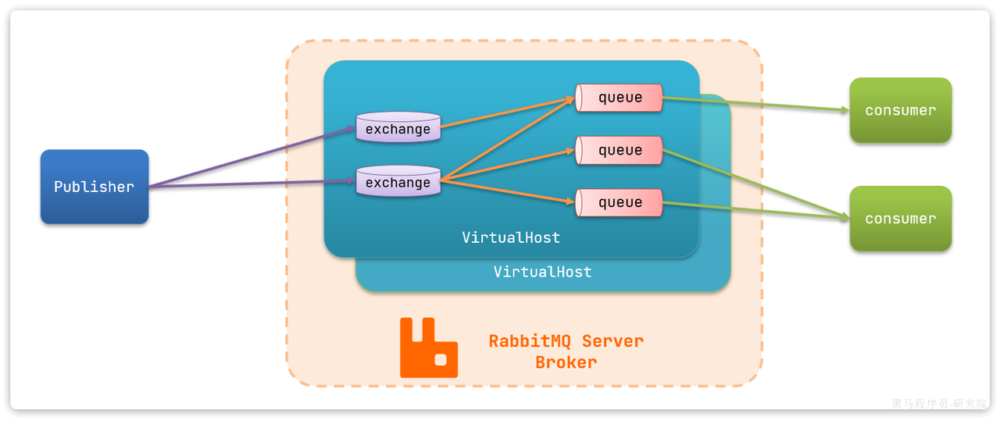

# MQ

Message Queues

**Messages are stored on the queue until they are processed and deleted**.

Message queues can be used to decouple heavyweight processing, to buffer or batch work, and to smooth spiky workloads.

### 同步处理

类似视频通话，一对一，异步可以一对多

### 异步处理

**生产者发送消息**：在需要执行某个任务时，生产者（Producer）将任务内容作为消息发送到消息队列（Queue）中。这一过程是快速的，生产者在发送完消息后立即返回，继续执行其他操作，而不需要等待任务的处理结果。

**消息队列存储消息**：消息队列充当一个中介角色，暂时存储生产者发送的消息。消息队列确保消息在队列中不会丢失，通常会使用持久化机制将消息保存到磁盘。

**消费者读取消息**：消费者（Consumer）是一个或多个独立运行的进程或线程，从消息队列中读取并处理消息。消费者的处理速度不需要和生产者同步，只要有能力在一段时间内处理完队列中的消息即可。

**处理结果**：消费者处理完消息后，可以选择将处理结果返回给生产者，或者更新系统中的其他部分。但无论哪种情况，消费者的处理是异步进行的，不会阻塞生产者的操作。

**EG** :电商平台的订单处理

### 削峰/限流

### 降低系统耦合性

**发布-订阅模式工作**，消息发送者（生产者）发布消息，一个或多个消息接受者（消费者）订阅消息

发布订阅模型（Pub/Sub） 使用主题（Topic）作为消息通信载体，类似于广播模式；发布者发布一条消息，该消息通过主题传递给所有的订阅者

除了发布-订阅模式，还有**点对点订阅模式**

### 分布式事务

分布式事务的解决方案之一就是 MQ 事务

事务允许事件流应用将消费，处理，生产消息整个过程定义为一个原子操作

### 顺序保证

### 延时/定时处理

### Cons

* MQ挂掉or Message Loss
* 系统复杂性提高，保证消息没有被重复消费、处理消息丢失的情况、保证消息传递的顺序性等等问题
* 万一消息的真正消费者并没有正确消费消息导致数据不一致

# RPC vs MQ

RPC 双向直接网络通讯，立即处理

MQ 有中间载体

# RabbitMQ

```shell
docker run \
 -e RABBITMQ_DEFAULT_USER=hychen11 \
 -e RABBITMQ_DEFAULT_PASS=0602 \
 -v mq-plugins:/plugins \
 --name mq \
 --hostname mq \
 -p 15672:15672 \
 -p 5672:5672 \
 --network hm-net\
 -d \
 rabbitmq:3.8-management
 
 # -p 15672:15672 \控制台端口
 # 5672收发消息的端口
```

```shell
docker container ls -a
#include closed container
docker start #{container_name}
docker rm #{container_name}
```

Publisher -> queue -> Consumer



这里建立好queue和exchange后要bind！

### AMQP协议

**交换器 (Exchange)**：消息代理服务器中用于把消息路由到队列的组件。

**队列 (Queue)**：用来存储消息的数据结构，位于硬盘或内存中。

**绑定 (Binding)**：一套规则，告知交换器消息应该将消息投递给哪个队列


# RocketMQ

# Kafka

