# System Design

### design web

first may meet bottle neck, then scaling up

Overview: users can follow each other, post and view post timeline

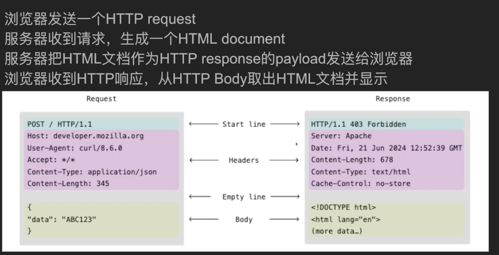

数据库与业务代码之间增加一层抽象层ORM对象关系映射，ORM隐藏了数据库操作，db.session.add(user); db.session.commit(); 等

MVC model view controller，model封装数据，controller响应请求，view数据展示

#### Function Requirement

* register, login
* follow other user
* See other's posts   

#### Data Entity

2个模型表存数据实体(User,Post)，1个关联表存多对多关系(Follow)

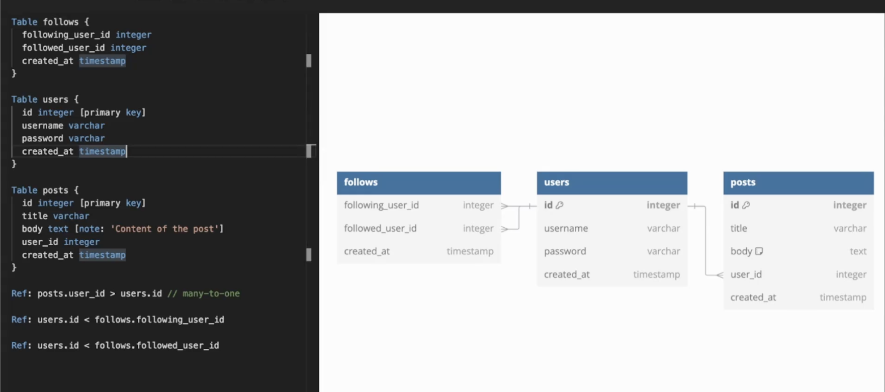

这里user_Id 是foreign key外键，注意看下面建数据库如何表示foreign key！

`foreign_key (user_id) references users (id)`

```sql
create table users(
  id integer primary_key,
  username varchar,
  password varchar,
  created_at timestamp
);

create table posts(
  id integer primary_key,
  title varchar,
  body text,
  user_id integer,
  created_at timestamp,
  foreign_key (user_id) references users (id)
);

create table follows(
  following_user_id integer,
  followed_user_id integer,
  created_at timestamp,
  foreign_key (following_user_id) references users (id),
  foreign_key (followed_user_id) references users (id),
);
```

展示关注用户最近10篇post

```sql
select p.id, p.title, p.body, p.user_id, p.created_at
from posts p
join follows f on p.user_id = f.followed_user_id
where f.following_user_id = <User ID>
order by p.created_at desc
limit 10 offset 0
```

但是join表开销巨大

#### 解决方法

* 抖音/微博那样的“推荐流”：后台异步计算用户可能感兴趣的 post，放入 Redis/ES/消息队列中
* 限定关注数 + 分批加载
* 预聚合 + 时间轴表（Timeline 表）

设计一个 `timeline` 表，把关注用户的 post 预先“推送”到当前用户的时间轴上 Fan-out on write 

Fan-out广播

```sql
CREATE TABLE timeline (
  user_id INTEGER,               -- 当前登录用户
  post_id INTEGER,               -- 他关注的人的post
  post_user_id INTEGER,          -- 发帖人是谁
  created_at TIMESTAMP,          -- 发帖时间
  FOREIGN KEY (user_id) REFERENCES users(id),
  FOREIGN KEY (post_id) REFERENCES posts(id)
);
```

当某个用户发帖后，比如用户 A：

```sql
-- 查出所有关注他的人
SELECT following_user_id
FROM follows
WHERE followed_user_id = A;
```

然后写入 timeline 表

```
for each follower:
    insert into timeline (user_id=follower, post_id=新发帖ID, post_user_id=A, created_at=帖子时间)
```

查询当前用户的 timeline 就变得非常快了

```sql
SELECT *
FROM posts p
JOIN timeline t ON p.id = t.post_id
WHERE t.user_id = :current_user_id
ORDER BY p.created_at DESC
LIMIT 10;
```

#### RESTful API

REST就是收取发送的都是资源，也就是我收到的就是html，这个在服务器端就渲染了

而RESTful API，抽象成一个API返回json文件，前端自行渲染

```json
"pagination":{
	"currentPage":1,
	"pageSize":10,
	"totalCount":100
}
```

POST请求可能需要验证身份

这里header里加上

```
POST /api/posts
header:
	Content-Type: application/json
	Authorization: Bearer <token>
body:
  {"title":xx, "body":xx}
```

这里的Authorization里的Bearer用来传递身份令牌（token），这个在登录时就获取了，后续请求都携带，可以是JWT，也可以是Oauth的access_token  

而session存在Cookie里， `Cookie: JSESSIONID=abc123xyz`，后端服务器根据这个 session ID 去 Redis 或内存中查找用户状态

Oauth里有一个临时授权码code来换取token，然后有了access_token后就可以直接访问资源了

### scaling database/scalibility

* 数据分区（分库分表、水平切分、Sharding）

* 功能分区（拆分不同微服务，User Service，Product Service，Order Service，Payment Service，微服务、单体拆分、Vertical Partitioning）

* 添加副本 scale cube 复制多份数据 （主从复制、读写分离、Replica Set）（Master Slave）

首先估算QPS，封底估算，100M user, 10/day, 10K QPS, peek read QPS = 30-50K QPS

MySQL read 1-5K QPS, write 低一个数量级，因为要建立索引 <1k 

**solution replication+shardig**

shardingKey : post_id, user_id，有优劣势 然后取模

如果用user_id，比如名人都在一个db上，访问timeline查询会造成大量的负载，相当于热点数据

使用post_id可以分担负载，坏处就是查一个用户的话得遍历所有的shard

scatter and gather, 需要跨分片查询

### Optimize Latency

正常查询，再查latency high，热门post起来缓存

这里需要计算一下需要多少缓存

```
Post(post_id, content, user_id, timestamp)
3*4byte+140\*2byte = 292 bytes

cache storage = 100M * 2/day * 3day * 300Bytes = 180GB
20% hot post = 180*20% = 36G //单机都可以
```

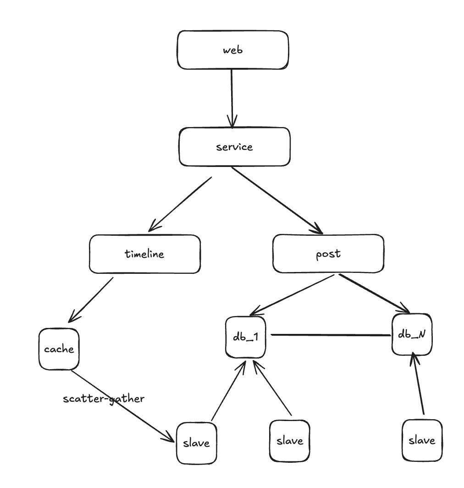

还可以更快吗？就绕过传统查询，直接在user发布的时候给他的follower预构建timeline，follower可以直接读取，也就是post到follower对应的timeline的cache里

#### Fan-out

fanout可以理解为广播，就是push之类的

Not time sensitive, so we can use Async, which is MQ

这里timeline cache大小估算，cache - (post_id, user_id)，针对userid去读表，避免join的操作

```
cache - 100M * 8B * 100 = 80GB
QPS - 2k * 100 = 200K
```

push推送模型，生成timeline速度快，读取也快

缺点一 follower多，写入放大很多倍，名人会产生一个hot spot，二是每个用户构建了cache，但是不是所有账号都活跃

pull读取的时候再获取post，也就是要先登录，不活跃账号不消耗资源，也没有分发的hot spot问题，缺点就是生成timeline慢，延迟高，关注用户太多需要大量排序合并再排序 ，不能实时更新，只有登录后才生成timeline

如何结合呢？普通用户push，post的时候直接发送到对应的timeline cache上

名人就pull，follower登录有再去数据库里缓存上他们发的帖，timeline service上合并

可以把peek的数量严格的限制住

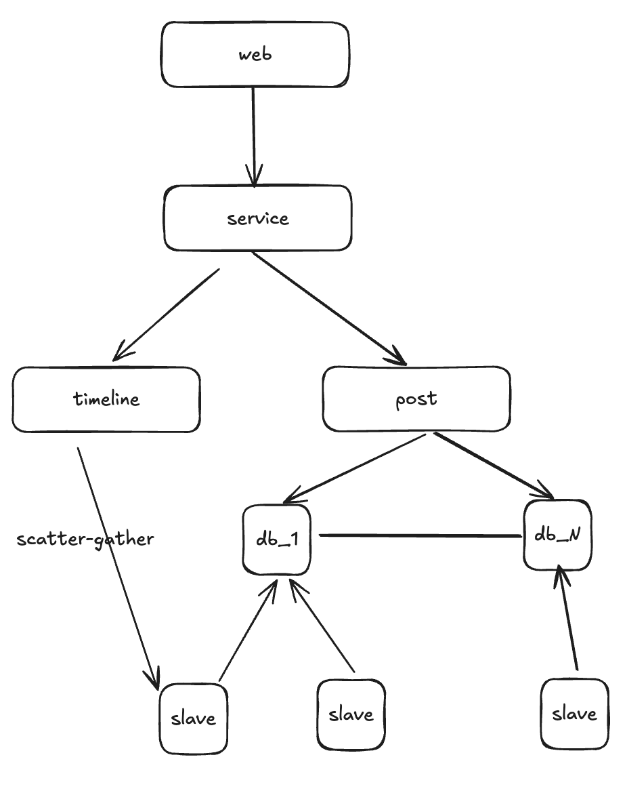

### video sharing platform (tiktok)

#### Functional requirement

1 upload video

2 watch video 

#### Non-functional requirements

1 scalibility

2 availability

3 video latency

4 Fault tolerance

#### scaling estimate

1B DAU (Daily Active User)

watch 100/day

upload 1/day

Average 1 min -> 10M, duration 15s-3min 

**split** backend service into 2 part, one upload and one view, pros is workload isolation (functional partitioning) , cons is 

Three ways for scale out

*  data partitioning

*  functional partitioning

*  replication

#### SQL vs NoSQL

SQL事务操作复杂，Join不能跨库，没有shard

NoSQL不支持事务操作，内建shard

如何选择呢？一般取决于有什么，比如有user表在MySQL里，就继续用MySQL

#### video storage 

**Blob(Binary Large Objec)** Storage，非结构化数据的云存储

HDFS (Hadoop Distributed FileSystem)

HyDFS (Hybrid Distributed FileSytem)

HDFS 分割文件成不同的chunk，64M，会有多个replica，劣势读取速度慢，存储空间偏大，但是便宜

> 为什么HDFS便宜？ 存储空间更大，甚至还会冗余三份副本
>
> 大规模数据存储成本 vs 传统存储方式（如高性能 NAS、SAN、商业数据库）
>
> * 硬件成本每 TB 低很多
>   * HDFS使用廉价的通用服务器
>   * 传统存储（如 Oracle RAC、NAS）通常需要：专用存储设备（如 SAN、磁盘阵列），商业硬件，昂贵且封闭
> * 软件层面：开源、免授权
>   * HDFS 是开源的，基于 Apache License，无授权费
>   * 商业数据库/存储系统动辄按节点、CPU 核心计费（Oracle，IBM）
> * 可横向扩展（scale out），避免提前一次性投入大规模硬件
>   * 可以从三台机器开始部署，扩容到几十台
>   * 传统系统通常需要一次性采购高端硬件，且扩展性差
>
> * 现在HDFS有Erasure Coding 纠删码，可以做到1.4x存储，10块原始块，4块校验块，任意保留 10 个块，就能解出原始数据，Reed-Solomon，只要你有任意 `k` 块，就能还原原始 `k` 个数据
>
>   ```
>   D1, D2, ..., D10
>   P1 = a1*D1 + a2*D2 + ... + a10*D10  
>   P2 = b1*D1 + b2*D2 + ... + b10*D10  
>   P3 = c1*D1 + c2*D2 + ... + c10*D10  
>   P4 = d1*D1 + d2*D2 + ... + d10*D10  
>   系数是预定义的、不同的，形成一个可逆的矩阵
>   线性方程组
>   有 10 个未知数（D1~D10）
>   只要有任意 10 个块（D 或 P），我们就有 10 个方程 → 可以解出原始数据
>   ```
>
>   pros: 适合冷数据、大规模数据湖
>
>   cons: 编码解码开销大（CPU + 网络）不适合写入频繁的热数据（恢复过程复杂）,计算密集
>
>   更加简单的例子就是D1，D2，P1=D1+D2，这三块里可以丢失任意一块

第二点原因是适合碎片化存储

#### Fix the issue of exposed storage interface

不可以直接存storage，即暴露storage，替代方案就是开辟一个临时的存储空间raw存原始视频

#### upload video

1min ->10 MB，

upload有压缩的余地

方案一：当成文件存储，chunk 1MB，10 chunks

方案二：syntax， segmentation分割 

因为手机app，存在网络不稳定的问题

1. failed->Retry
2. parallel，哪部分失败了哪部分重传

传完后给upload service一个signal，上传完成后就是处理视频

#### upload finished

upload service finished, then send to MQ (msg: done, address: raw bucket) 

MQ have tasks for workers to consume

**worker pool** can dynamically adjust workers' number according to Message Backlog Condition

Message Backlog 就是消息挤压

#### worker pool

split raw file into small chunks and then merge into complete video

File Integrity Verification 校验，使用SHA-256，直接hash文件内容，进行校验码的对比

然后做转码，播放的时候根据用户网速和设备动态调整，所以我们视频会被转码成不同格式，eg. 一个1080p的视频，会转成360p，480p和1080p三个可选版本

最后把编码好的视频放进blob storage里，同时写入metadata

metadata还要有一个状态status `start->ready->processing->done`

processing失败会触发retry，扭转到ready

相比于直接upload video存入blob storage，有风险

#### view video

先查metadata，然后再读blob storage，cons分发慢，并且可能会造成hotspot

解决方法是靠近用户侧引入CDN (Content Delivery Network)

首先CDN代替我们读blob storage，再进行视频分发

Pros 视频放在CDN里，优化了传输速度，降低了Latency

Cons 引入了额外的cost

所以只存放热门视频，需要extractor Service来定期查找hot spot的视频，再替换CDN里的视频

#### Optimize latency

方案一：视频切小段，看到什么地方就只把这个segment推送给你，而不是整个加载完成再播放，并且动态调整视频清晰度

方案二：streaming protocol, apple HTTP Live Streaming流媒体协议，边传输边播放

#### wrap up

方案一：view service采用feed形式，数据库查关注了哪些人，发了哪些视频，然后倒序排一下，形成一个news feed 然后推送给用户

> ##### Feed Pull 模式
>
> 常用于新闻流、短视频、社交平台等推荐场景。
>
> 这里不一定按照时间顺序倒排，有时候也会按权重 + 时间混合排序，score = engagement_score + freshness_score
>
> 实时按需查询。
>
> 好处：实时、准确，不用预存储每个人的 feed。
>
> 缺点：高并发下查询慢，难以支撑巨量用户访问。
>
> ##### 用户量大、频繁拉取，实时查询太慢
>
> 提前把每个用户的 Feed 算好、存入 Redis （Push）
>
> Pros：Redis存储快，推用不需要实时查询
>
> Cons：大V放大读写压力（Fan-out），需要异步处理推送，甚至引入削峰限流（比如 Kafka）+ 分批 fan-out
>
> ##### 用 Kafka + 微服务实现异步化
>
> 大V发布内容时，有几十万、几百万粉丝，不可能实时遍历 + 写入 Redis。
>
> 发布消息到 Kafka，异步处理粉丝 Feed 写入任务
>
> 非阻塞：写 Kafka 不需要等消息被处理。
>
> 可扩展：消费服务可以横向扩容。
>
> 可落盘容错：Kafka 消息不怕服务崩。
>
> ##### 大V发内容，用户频繁访问大V的动态，热点聚焦 等容易形成hot spot 的情况
>
> 大V不推送，改为pull，普通用户push
>
> 分批异步推送 + 限流优先推送活跃粉丝（近7天活跃）剩下批量处理或延迟写入
>
> Feed 合并缓存，Redis 里不每人存一份，而是：每条内容存一次（用内容 ID 映射元数据），用户 Redis 里只存内容 ID 列表，节省内存，减少重复数据

方案二：不同视频做不同权重，做一个推荐系统 recommendation

引入一个双塔模型，视频特征，用户特征分别embedding成一个vector，根据用户特征选取视频推荐，优化视频观看指标

cons：引入团队，更多的追踪指标

方案三：数字治理，不同region有不同的tag要求，会有多个数据中心进行独立的处理

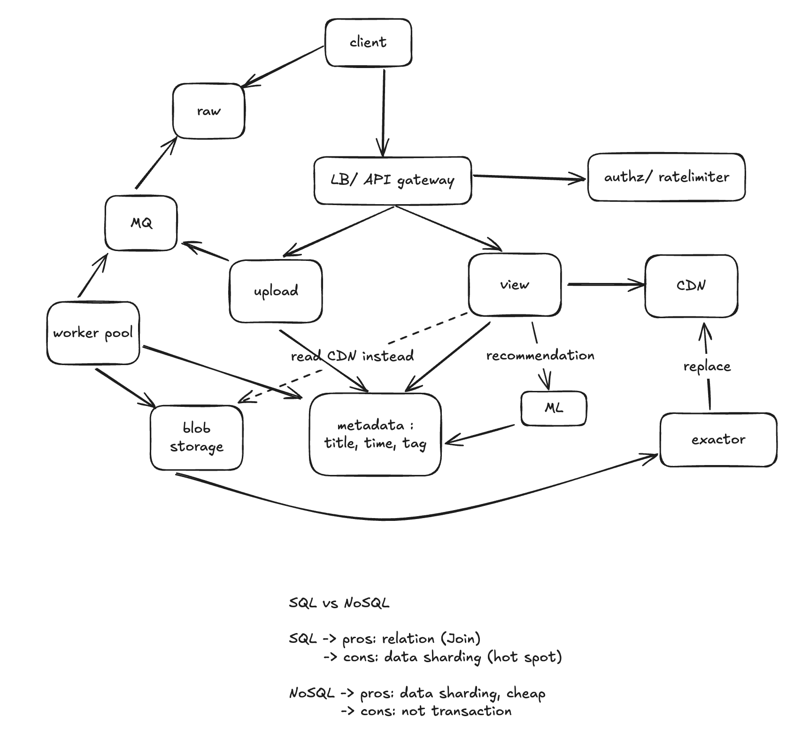

### Data Retrieval/ Indexing (POI Service)

cache->query Index->modeling

design a POI service (Point of Interest)

#### Functional requirement

1 search nearby by location

2 view details

3 owner can edit / delete

#### Non-functional requirements

1 low latency : 1s

2 freshness : 1day

3 scalable

4 Fault tolerance (FT)

#### scaling estimate

1B Month Active User -> 50% -> 500M DAU (Daily Active User)

200M Business

Storage:

1 NoSQL

2 RDBM

3 in memory (redis)

business table: 

```text
+ id 4B
+ owner_id 4B
+ longitude 8B
+ latitude 8B
address
city
state
country
zip_code
description 5KB //2500words
photo_url 
```

200M * 10KB = 2TB 

2TB可以放memory，但是不值当，多台机器shard数据，如果需要latency 100ms值得，但是这里1s

此外memory需要snapshot或者checking Point备份 

NoSQL vs RDBM

NoSQL cheap, faster query, more features for out-of-box usage

> Out-of-the-box solution 开箱即用
>
> Out-of-the-box feature 默认自带的功能

```
Search:
500M * 5 q/day
=25k QPS
Peak 100k QPS

Business:
200M * 1 update/mon
=70 QPS
Peak 300 QPS
```

read QPS 100K, write QPS 300, Master-Slave mode, single master is already enough

经纬度可以建立联合索引，但是不能范围查询，（最左匹配）最多只能固定经度，维度范围查，也就是查一定范围里的店铺id需要全表扫了

#### Geolocation建立索引 Geohash, Quadtree

数据库有geolocation的extension实现组件

##### Geohash

**经纬度编码成一个字符串**（Base32 编码），这个字符串的前缀越长，代表的范围越小，精度越高。

1. **将经纬度范围不断二分**（先经度，再纬度，交替进行）：经度从 `[-180, 180]`，纬度从 `[-90, 90]`
2. 每次二分产生一位二进制码（0表示左/下，1表示右/上）
3. 生成的 bit 序列再使用 **Base32 编码**成字符串，如 `"wx4g0ec1"`

相近地理位置的点，其 Geohash 前缀往往是相同的。

利用 **字符串前缀匹配**，可以高效实现“附近查找”。适合范围查询

##### Quadtree

把地图不断划分为 4 个象限（左上、右上、左下、右下），形成一棵 **四叉树结构** Quadtree

1. 起始：整张地图是一个节点，称为 Root
2. 每次划分为 4 个子区域，每个子区域作为子节点
3. 根据点的经纬度落在哪个象限，插入到对应的子树中
4. 递归继续划分，直到达到最小单位或点数过少

查询一个区域（如圆形、矩形范围）时，只遍历与之相交的树节点

相当于做区域剪枝，减少搜索空间

这里拆分可以有条件比如区域大于100个商家可以继续拆

QuadTree 是一个内存结构

#### trade-off

quadtree可以作为index

问题一：如何fit into memory, leaf heavy的结构

leaf有(business_id, lat, long, short_brief) 100B左右

200M business, each node store 100 business

200M/100 * (100\*50B) = 10G 完全可以放进memory里

构建index几分钟左右，从存储中读取所有数据，然后构建树，并且存在disk上，有一个seed

> **seed** 在这个上下文中指的是一个**持久化保存的、预构建好的、完整的索引结构副本**（如 Quadtree 或 Geohash 树），可用于系统启动时快速加载。
>
> 每次cold start或者crash重启，不用重新扫全量数据重新构建索引
>
> load seed → deserialize → 放入内存 → 开始服务

因为是in-memory storage容易丢失，crash就丢失了，只需要从seed里把预构建好的树copy出来

Peek read-100K QPS, 一般也就20 shards，是在不行引入auto scaling增加副本

如何update这个树，方案一：live update 方案二：eventually consistency，每小时rebuild一下，每小时做一次blue green rollout，重新构建好的seed推到线上去

这里建立cache有没有必要呢？可以建立，但是有额外的开销，可以建立在search前，越往前效果越好

#### wrap up

根据deployment区域去划分，东中西部三个区域的server，分成三个部分，坏处cost高

isolate failure region, blast radius减少，此外quadtree可以更小

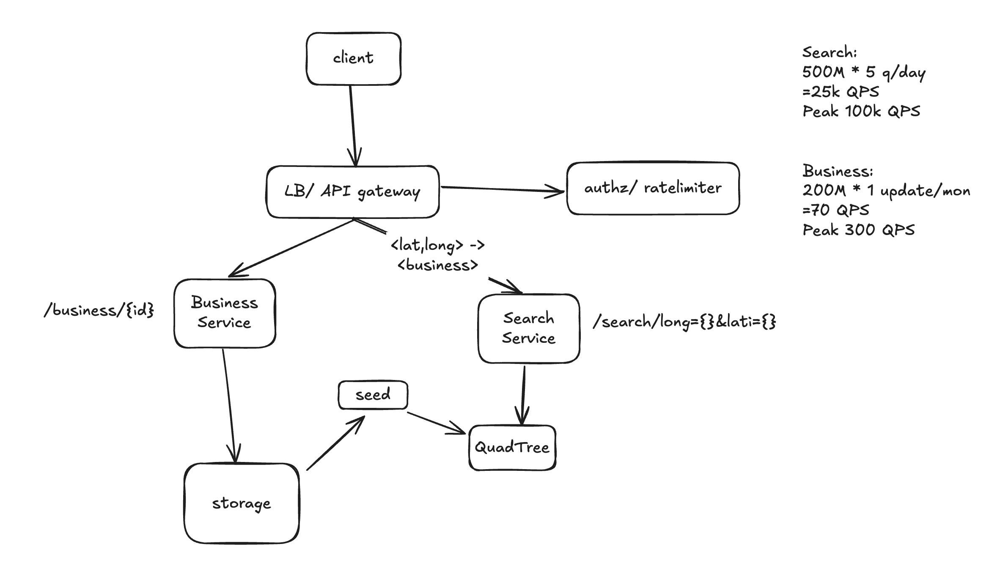

### Job Scheduler

1. internal system, about 10k DAU

2. MVP minimal viable product 满足最基本功能

3. scope jobs can be all types

   > task just run once？
   >
   > service need to bind and monitor

#### Functional requirement

1. user can submit tasks (tasks can be short-term temp script or long run service)

2. user can view task result on dashboard
3. Advance features:
   + Schedule some tasks in future (cron service)
     + check email every 30 minutes
     + Database backup on 12pm every day
   + spark hadoop DAG(Directed Acyclic Graph), job dependency 

#### Non-functional requirements

1. latency
   + submit task execution within 10s
   + Dashboard sync within 60s
2. scalability
3. reliability

#### Job data model

* repo (code/ config/ executable binary)
* metadata
  * job id
  * owner id
  * executable url
  * Input/Output path
  * created_time
  * status
  * num_of_retry

#### State Machine

```
ready -> waiting -> running -> success
          ^          |
          |          v
        retry <- failed# -> final failure
        < 3          >= 3
```

#### QPS estimate

DAU 10k, 1000 job/user/day

= 10k * 1000 request/ 100k sec = 100 QPS

peak QPS is about 3-5 average QPS, 500QPS (Read)

submission QPS = 10k *100 / 100k = 10QPS

peak QPS = 50 QPS (write)

#### Data storage

only one repo need to consider single point failure

solution: Master-Slave, or Dual Master / Master-Master

> Dual Master
>
> 都可以对外提供写服务，数据会在两个主节点之间实时同步
>
> 两边都是 *active*，既能处理读也能处理写
>
> 双向同步数据（可能是数据库、缓存、文件等）
>
> 一边挂了，另一边立刻接管，而且原本就已经在工作，不需要等待启动
>
> - 高可用 + 负载均衡（两边都能干活）
> - 切换快，因为双方一直是活动状态
>
> - 数据冲突风险高（两边同时写时可能冲突，需要冲突检测或业务避免冲突）
> - 同步延迟可能导致不一致
>
> Hot Standby / Active-Standby 双机热配
>
> 两台机器，一台是 **主机（Active）** 对外提供服务，另一台是 **备用机（Standby）**，平时不处理业务，但会实时同步主机数据，一旦主机故障就切换到备用机。
>
> 主机是 active，备用机是 standby
>
> Standby 不对外服务，但跟主机保持数据同步（热备状态）
>
> * 切换快（几秒级甚至毫秒级）
>
> * 数据一致性好（通常用心跳检测 + 数据镜像）
> * Standby 平时闲置，资源利用率低
> * 不能分担主机压力

#### NoSQL vs SQL

need **tie breaker signal** 

* Data model need foreign key support
* query pattern 是不是需要做一些联表的join查询
* consistency requirement，是不是可以退化到最终一致性而放弃强一致性

> **tie breaker（决胜信号/仲裁信号）** 是指在出现**脑裂（split-brain）或仲裁平局**时，用来打破僵局、决定谁继续当“主”的特殊信号或机制

没有tie breaker signal怎么办，会defer这个decision，开闭原则（好的架构会增加未作出决策的数量）

也就是如果不是blocker，就不要一上来就定死，后面不好变更

#### queue trade-off

Peak Shaving and Valley Filling

in memory? in disk

in memory 扩容方便，无状态

in disk不丢失，扩容麻烦

如果是in disk的话，和数据库不一致了，哪个是source of truth呢？需要加分布式锁或者transaction，实现双写一致，同时成功或者同时失败

但是分布式锁会增加latency，并且会有连带关系，比如queue down了会导致data store反而不能写东西了

in memory的话，queue就依赖于datastore，从data store推导出queue的状态

可以Message queue as Database，比如Kafka Database，QPS 不高，不行partition，优势是streaming system，延时低，可以提供比较低的SLA（Service Level Agreement） 进行保证，坏处streaming database接受度不高

Database as queue接受度高，spanner queue，实现了push和pull的语义，工程届有实例，但是单机性能不高，因为没有spanner高性能数据库，但是可以通过sharding解决，并且QPS不高，把数据存进database里，`select * from job_table where status=running and num_retry<3 order by id limit n`， 这样就实现了一个Queue的semantic

单独加入一个informer或者publisher，datastore和worker隔开，informer每秒轮询查询数据库，找出可以执行的任务 ，然后publish

#### assign task

获得任务后如何把任务丢给worker去执行

* worker发起rpc，去pull下来一个任务运行，运行完成回调rpc，任务状态写回数据库
  * 好处informer不用管理很多，比如完成回调，fire and forget，任务丢出去就不管了
  * 坏处worker需要轮询informer，95%的时间会得到idle空转，并且rpc是worker发起，说明worker权限大，不安全，此外worker也可以挂掉，状态无法更新，或者heartbeat通报心跳，但是rpc多了会拥塞，或者增加timeout，但是long-term不知道什么时候停机
* informer发起rpc，push model，informer跟踪worker状态
  * 好处worker不用发起请求
  * informer需要长期追踪worker状态，还需要额外建立一个长连接，需要知道task对应worker的地址，因为要通信
* hybird (push, pull) informer push task, worker 运行的时候搭载sidecar边车模式，60s发送一次heartbeat
  * 好处安全，避免worker发起rpc，informer不用维护task于worker映射，因为sidecar可以管理metadata，heartbeat每隔60s汇报一次状态
  * 坏处加入sidecar，增加了worker的开销

> **Sidecar（边车）** 是一种分布式系统架构设计模式，核心思想是**将应用程序的辅助功能（如日志、监控、网络代理等）剥离到一个独立的进程/容器中**，与主应用（Worker）并行运行，就像摩托车的边车（Sidecar）一样附着在主应用旁，提供协同服务。
>
> Sidecar通常通过标准协议（HTTP/gRPC）与主应用通信，主应用可用任意语言编写
>
> 解耦，worker只需要关注业务逻辑，其他跨领域功能（如认证、加密、服务发现）交给Sidecar处理。

#### resource allocation

* add resource

* exponential back-off retry
  * short term 增加informer等待时间，做一个exponential back-off，第一次失败1s，第二次2s
* save resource from runtime
  * eg, vm execute task, change vm into container, more **Lightweight**
  * 但是问题是container会暴露更多攻击面，需要加一层隔离，**gVisor** 是google的sandbox运行时的隔离，它介于传统容器（如 Docker）和虚拟机（如 KVM）之间
  * 裁剪vm，是的vm更加轻量，google的no-vm或者aws的firecracker，体积小于5m，启动时间小于500ms
* Reallocate resource
  * workload isolation，IO heavy尽量占满bandwidth，compute heavy尽量使用高性能硬件资源
  * 混合部署
* recycle
  * google的auto pilot，tencent的gocrane自动回收资源 
  * 常驻内存production service优先保证高可用性
  * temporay task延后或者压缩，preemptive可抢占的任务

#### Scheduler

**K8s Scheduler**：新 Pod 来了 → 马上找宿主机

**Spark Scheduler**：任务很多 → 分两步，先分任务给 Executor，再分资源给 Executor

**Cron Job**：到时间 → 跑命令

##### Kubernetes scheduler

**调度对象**：**Pod（容器化应用）** 到 **Node（集群中的计算节点）**

**调度目标**：让每个 Pod 落到最合适的节点上，考虑资源利用率、负载均衡、亲和性/反亲和性等规则。

**触发方式**：事件驱动（有新 Pod 待调度时立即触发）

**调度过程**：

1. **过滤（Filtering）**：剔除资源不足或不满足约束的节点。
2. **打分（Scoring）**：对剩余节点评分（比如 CPU 空闲率高的节点得分高）。
3. **绑定（Binding）**：把 Pod 绑定到选中的节点上。

##### Spark scheduler

分布式计算框架

第一层driver端端Job/Stage/Task调度，Spark 会把用户提交的作业拆分成 **Job → Stage → Task**，由 **Task Scheduler** 分配 Task 给 Executor 执行（任务逻辑的依赖和分发）类似我HyDFS里的scheduler

第二层集群资源调度器（Cluster Manager），可以是 YARN、Mesos、K8s 或 Spark Standalone，它决定 Spark 的 **Executor** 在哪些节点启动，占多少 CPU/内存。（关心底层机器资源的分配。）类似于HyDFS里的Rescheduler

##### Linux Cron Job

对象是任意可执行脚本/命令。在**固定的时间**或**周期性**执行任务（时间驱动）。

`crond` 守护进程会每分钟检查一次 `/etc/crontab` 和用户的 `crontab` 文件，看哪些任务需要运行。

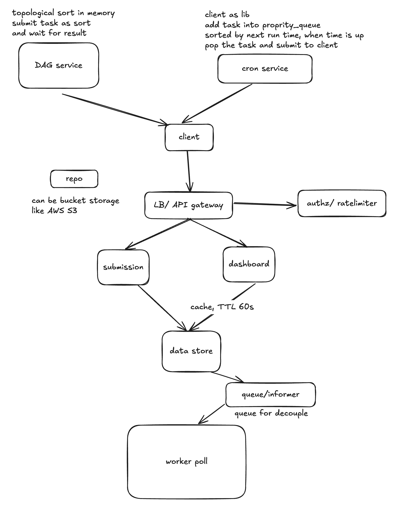

### File sharing platform

#### Functional requirements 

1. upload/download files
2. sync files across devices
3. handle conflicts

#### Non-functional requirements 

1. latency 20s
2. scalibility (support large files)
3. availability >> consistency
4. Reliability (fault tolerance)

#### estimate QPS

100M user -> 20% DAU = 20M

QPS = 20M *10 files /day = 2k QPS

peak QPS 10k QPS

##### high QPS NoSQL vs SQL

NoSQL 比如redis 100K QPS

SQL 读写分离，sharding

NewSQL (TiDB) high latency (10k-50KQPS)

#### optimization

* chunk，10M太大，1M太碎了，一般5M，10G -> 200 chunks, upload 10 chunks at once
  * 断点续传，retry机制

* 完整性验证，MD5算法

  * > MD5 算法就是任意长度输入转为固定长度的128为hash值，也就是32位16进制

* 压缩：在client消耗几ms时间压缩，极大减小传输体积，文本类可以减少80%，视频音频不会减少很多

* pre-signature URL

  * client传大文件到file management后，需要验证完整性，再传blob storage，传了两次

  * pre-signature URL已经在blob storage内部，只传一次

  * > **Pre-Signed URL**（预签名 URL）是云存储服务（如 AWS S3、阿里云 OSS）提供的一种临时授权机制，允许用户通过一个有时效性的 URL 直接访问或操作私有资源，**无需身份验证**
    >
    > **绕过后端鉴权** 大文件上传/下载、高并发访问（如用户上传头像）

#### status update

##### trust but verify

client传完给file management一个消息，然后file management依然去blob storage验证，验证完再修改metadata的status

#### upload

##### fully sync

修改文件，修改后的文件新的副本全部上传

##### delta sync

只上传修改的部分

由于已经使用chunk，两种做法，一直接替换chunk，二append only，使用version_timestamp, copy on write，返回完整文件

一如果替换的chunk损坏，无法回滚

二多消耗存储空间

添加tombstone，标记删除的chunk但是仍然保留，db一天一扫，去除标记30天的chunk

#### download

state management给client通知

pull vs push

pull : client check version and download

Cons: brust transmission pattern, 不均匀，浪费资源

long polling，web socket 可以建立长链接不用频繁创建连接，long polling可以直接使用http协议但是开销大

push: sse server side event (http)

文件有变化会创建一个事件源给client

#### State service <-> client

client 感知文件变化，联系file management，拉取最新的metadata，拿到最新的blob storage url，将raw byte从storage直接下载到本地 (Direct server return，DSR)

#### conflict

* first writer win
* keep both, 保留最后的version后缀

#### log seq

文件变动作为operational event写入log seq，state management不追踪最新状态，而是维护offset

#### CDC (Change Data Capture)

冷热分离，增加access time，超过一年没访问，该文件移入冷存储里

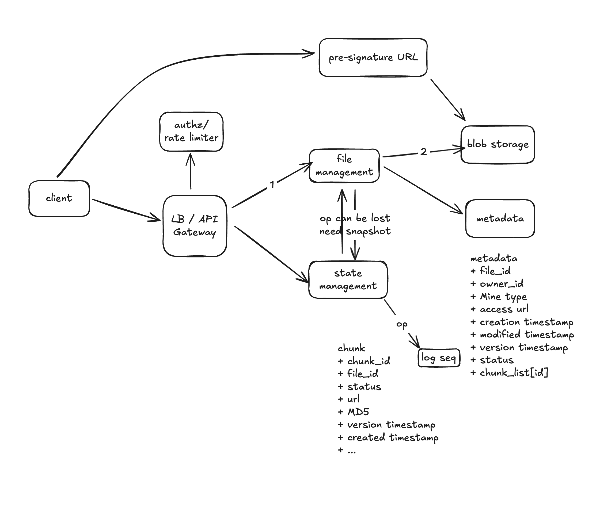

### Ad Event Aggregation System

50 M ad_id

1B click event

1B/100K = 10k QPS

#### CTR (Click-Through Rate)

CTR = # click / # impression 

in general it is around 1%

100B impression, QPS 1M

#### Functional requirements 

1. aggregate metric of a given ad_id in last k minutes
2. top k ad_id in last n minutes
3. filtering 
4. 2yr historical data

#### Non-functional requirements 

1. latency < 15s
2. scalibility 
3. High QPS
4. High throughput
5. data correctness & data integrity - payment related
6. FT (fault tolerance)

Fast, good, cheap, 2 out of 3!!!!!

in general high throughput means high latency

#### estimate QPS

10B < ... < 100B

request = 0.1 KB

100B / 100k = 1M QPS, peak 3M QPS

Avg 100 MB /sec, 300 MB/sec

Storage = 100B *0.1kB = 10TB/ day

1month = 300 TB

#### Data collection

* high QPS, don't use RDBMs

* NoSQL
  * 3M QPS  = 15k QPS * 200 nodes
  * 带id的写都会有hotspot问题，解决办法就是增加随机后缀摊一下流量
  * In memory KV storage. 100k-200k /sec = 15-30 nodes, 内存存储成本高，需要持久化，异步落盘，有数据丢失的风险

* Message Queue like Kafka
  * 100k ops/ sec = 30 brokers
  * latency高，带缓冲

* log file 直接写log file
  * big data file format, low latency, 从MQ的zookeeper系统维护变为IO bottle neck的维护，需要batch flush等加速写入的优化，latency又会增加

#### real-time processing

MapReduce/ Flink

* batch processing (MapReduce) (high latency)
* minibatch
* streaming  (Flink)
  * (input speed > processing speed)
  * server down problem
  * checkpoint in isolated system

1 node 50k event/sec

3M / 50k = 60nodes

Note: popular ad_id (hotspot)

1min context window, flush interval = 10s

上游的checkpoint会跟着计算窗口一起移动，streaming不需要checkpoint，出现宕机直接从上游的上一个checkpoint重新计算就可以

#### data storage

OLAP (apach doris)

查询慢

1. cold/hot (if small size, store in memory, store 30 days data) 
1. cache (store aggregate query data in cache)
1. Prebuilt ad_id/ geo (aggregate by id or geologic)

#### data correctness

streaming process have **Late Arriving Events** or **Event Reordering**

> Late Arriving Events 事件迟到
>
> - 在流处理中，数据事件因网络延迟、系统故障等原因，**未按实际发生顺序到达处理系统**。
>   *示例*：用户点击事件的时间戳是 `10:00:00`，但系统在 `10:00:05` 才收到（本应在 `10:00:02` 处理）
> - 窗口聚合结果不准确（如按小时统计的 PV 漏计）。
> - 状态计算错误（如会话超时判断失效）
>
> Event Reordering 事件重排
>
> 通过技术手段**将迟到事件插入到正确的时间位置**，保证处理逻辑基于事件时间（Event Time）而非处理时间（Processing Time）
>
> - **水位线（Watermark）**：标记事件时间的进度，延迟超过阈值的数据视为迟到（如 Flink 的 `allowedLateness`）。
> - **侧输出（Side Output）**：将迟到事件单独处理，最后合并结果（如 Spark Structured Streaming 的 `withWatermark`）。

| **机制**                    | **作用**                                       | **示例**                                             |
| :-------------------------- | :--------------------------------------------- | :--------------------------------------------------- |
| **事件时间（Event Time）**  | 以数据实际发生的时间为准，而非到达系统的时间。 | 用户行为日志中的 `timestamp` 字段。                  |
| **水位线（Watermark）**     | 动态跟踪事件时间进度，决定窗口何时触发计算。   | Flink 的 `BoundedOutOfOrdernessTimestampExtractor`。 |
| **状态管理（State）**       | 持久化中间状态，支持故障恢复和重复数据处理。   | Spark 的 `checkpoint`、Flink 的 `StateBackend`。     |
| **幂等写入（Idempotency）** | 确保重复操作结果一致（如通过唯一 ID 去重）。   | Kafka 生产者启用 `enable.idempotence=true`。         |

##### reconcile

对账？

上游streaming processing

下游batch processing，使用cron job，如mapReduce来处理，然后upsert (insert+update)，合并覆盖掉流系统处理的结果，实现数据对账

* lambda架构？同时使用批处理和流处理，流处理实时但是不一定准确，批处理准确但是有延迟的结果，缺点需要维护两套系统
* kappa全部依赖流系统，也就是在data collection这里再做一次data refill回填，重新计算后upsert，容错低了，exactly-once语意，需要可靠的状态管理和恢复机制

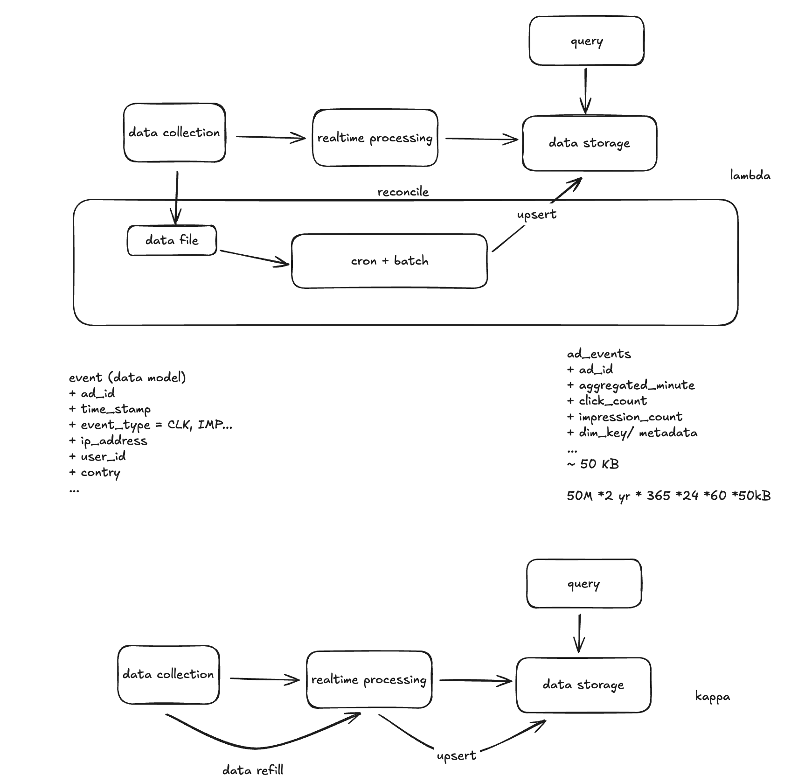

### Chat System

#### Function Requirement

+ 1-1 chat
  + online msg delivery
  + support offline msg
+ Group chat (<200)
+ presence status

#### Non-function Requirement

+ Scalability, 1B user
+ low latency < 500ms
+ High consistency
+ FT

####  IO handling

1. Polling 

   * Clients 轮询 servers看是否有新的消息，但是可能90%以上时间都是空的，每次查询会建立新连接，TCP 三次握手开销大 

2. long polling

   * 长连接减少网络请求和服务器负载，但是服务器端并发上来也是不小开销（本质上还是client发起pull请求）

   * 每个连接占用一个FD，Linux默认约1024，可通过`ulimit -n`调整

   * 端口复用（`SO_REUSEADDR`）和快速回收（`tcp_tw_reuse`）可优化端口利用率

   * 内存占用：一个TCP连接占用3-10KB内核内存（取决于缓冲区大小）

   * 网络协议上：作为客户端时，本地临时端口（默认范围32768-60999）可能耗尽。 主动关闭连接会进入`TIME_WAIT`（默认60秒），占用资源

     * ```bash
       net.ipv4.tcp_tw_reuse = 1     # 允许复用TIME_WAIT连接
       net.ipv4.tcp_fin_timeout = 30 # 缩短FIN超时
       ```

   * 应用层性能：选择高性能I/O模型（如epoll、kqueue）比多线程/多进程更高效，Nginx1M级别并发连接（epoll+NIO）。使用长连接（如HTTP/1.1 Keep-Alive、HTTP/2）减少握手开销。二进制协议（如gRPC）比文本协议（如HTTP/1.1）更节省资

3. websocket
   * 双方主动发送消息，延迟低，开销小，传输效率高，但是兼容差，不像long polling基于http
4. QUIC

手机app不稳定，可能会切换ip，因此需要额外逻辑，比如client给一个client token，定位用户使用token，而不是ip

#### msg delivery

##### session affinity

引入session registration，可以查找client所在的chat server然后切换过去（重定向）可以降低latency，防止跨服

坏处就是：开了多个单聊，需要不断切换，会有业务上的抖动，此外hotspot需要rehashing/ sharding

场景：规模不大，实时要求高，比如游戏房间

##### msg sync

一个用户分配一个server，然后通过消息转发，首先是落盘存储，随后session registration查询，再rpc或者转发msg

好处可以水平扩容，分摊热度

坏处多一次转发，latency高，并且session registration需要高的一致性

此外serverA, serverB之间时钟消息不同步，需要处理消息顺序问题，代码复杂度高

优化就是不要转发，因为n台server就是n^2的链路，考虑使用总线，有消息写到消息队列或者数据存储，接受方订阅消息的队列

问题就是这个中心话可能会造成hotspot，单点bottleneck

#### Actor model

用“**Actor**”来替代线程、锁和共享内存的概念，让系统在高并发下更容易写、扩展和维护

1B user 

高并发（每个在线用户都有自己的会话逻辑）

高可靠（消息不能乱序或丢失）

代码可维护（不想写一堆复杂的锁和同步逻辑）

传统多线程共享内存的方式需要加锁、避免死锁、处理竞争条件，代码会很复杂

**Actor Model** 把这些复杂性隐藏起来，每个用户、连接、群聊，都用一个 Actor 表示

> 1. **一切都是 Actor**
>    - Actor = 独立运行的对象/进程（有自己的状态和行为）
>    - 例如：每个用户是一个 Actor，每个群聊是一个 Actor
> 2. **Actor 之间通过消息传递（message passing）通信**
>    - 不直接共享内存
>    - 发消息是**异步**的（发送者不会阻塞等待）
>    - 每个 Actor 自己维护**消息收件箱（mailbox）**，顺序处理消息
> 3. **Actor 的行为**
>     每个 Actor 收到一条消息时，可以：
>    - 更新自己的状态
>    - 给其他 Actor 发送消息
>    - 创建更多 Actor

#### group chat

引入group registration，一个group成员分布在10个不同的chat server上，消息需要转发10份到不同的服务器上，server内部可以进行同机路由

#### offline storage

如果client未上线，也就是在session registration里找不到信息，存在offline里，后面client上线后去offline storage里找，再读

保持30days

#### High Level Diagram

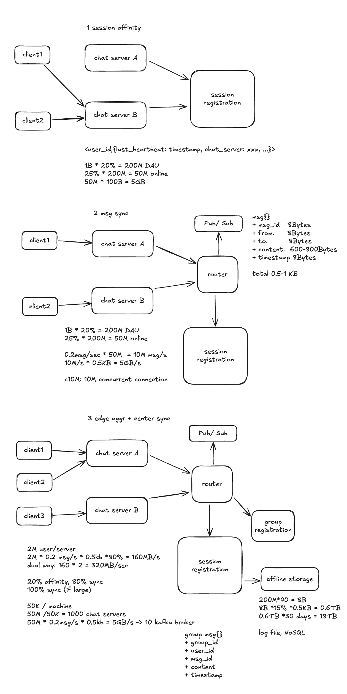

### Payment System

PSP (Payment service platform) API

target: Bookkeeping + Internal Clearing 记账+内部清算

1. initialization
2. Execution (PSP API)
3. recording
4. notification
5. clearing

#### Functional requirements

+ Merchant send payment request
+ client can pay
+ merchant can query payment status

#### Non-functional requirements

+ Security
+ Reliability- handle failure
+ Consistency
+ Correctness

#### Payment integration

1. Server-to-server
   * 商家手机卡号+cvv发给银行，相当于自己建立一个PSP，大厂首选，一般不会这么做，因为会接触到PAN（primary account number），需要PCI审计
2. SDK
   * Stripe paypal
   * 直接PSP的JS lib嵌入UI，然后商家得到token，用token调用PSP API
   * 存在供应链攻击的风险
3. inframe
4. hosted redirect
   * **PCI Compliance Burden **低

#### Data entity

data model

* single center table
* tree table: order+payment+ledger

金融数据需要保证一致性，内部一致性可以使用RDBMs来保证，外部一致性

网卡导致double spending/charging，需要做exactly once，需要idempotency key

workflow都需要带idempotency key，client checkout时，server会生成一个idem key，后续都带idem key，然后payment service做de-duplication，拦截，随后更新状态

PSP会有一个callback URL，完成会回调通知，如果网络问题调用失败，未通知到超过一定时间，就轮询主动查询

#### retry

1. timeout
2. exponential backoff
3. jitter 每次向后端发请求的时间间隔加入+-15%抖动
4. dead letter queue

#### Double-entry bookkeeping

复式记账，每笔交易影响两个账号，金额相等方向相反的操作

ledger不可更改，append only数据库

alibaba ledgerDB, Amazon QLDB (Quantum Ledger DB)

#### Clearing

一天对账一次，银行定期会发settlement file结算报告

#### problem

一笔交易轮询最后fail了，但是PSP现实通过了，状态机的跳变，可以设置状态机的不可覆盖，扭转等

一张表维护实时操作状态，一张账务表负责资金的守恒

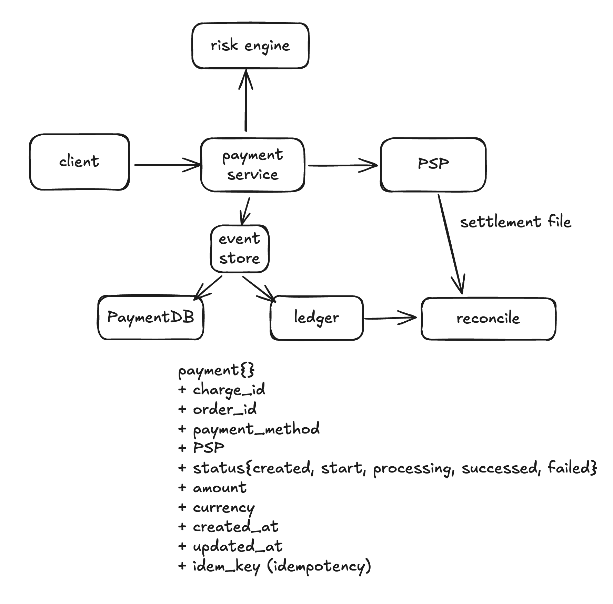

### ChatGPT

#### Goal metric

1. Throughput
2. Latency

一般过来的消息会带上上下文，存Redis，然后WAL异步落盘

session manager会根据session_id找到所有的对话上下文，打包成一个任务放进MQ里，然后inference service可以从MQ里取到对应的Task，进行推理返回消息

#### VLLM KV Cache

GPT 

1. token by token
2. auto regression

注意这里llama3 8B使用了 GQA (Group Query Attention)

query 头数还是 32

但 **K/V 头数更少**，例如这里 `n_kv = 8`

意思是：32 个 Q 头共享这 8 个 K/V 头的 KV cache（Q 会 map 到这些 KV 头）

#### Batching

1. naive batching

2. continuous batching

​	不用等都处理完，有空位就从MQ里取，throughput增加，降低latency

* prefill write cache (time to first token)

 * decode (read cache append one token) (time to incremental token)

   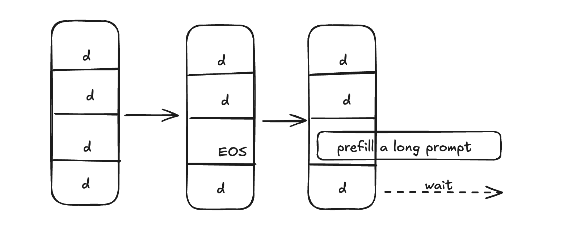

* chunked prefill

  类似os的抢占机制

#### PD disaggregation

同一节点内部，不同GPU上

分成两个不同的节点，分别优化两个不同的节点，比如decode node上启用cuda graph，减少CPU开销，因为GPU执行的任务都是CPU assigned，但是decode GPU会等CPU。这里可以调节decode和prefill的比例

##### reduce KV cache

* quantization, FP16-FP8
* Paged Attention
  * Flash-Attention 主要减少计算 SRAM和HBM之间内存的访问
  * paged attention减少存储的KV碎片
* prefix sharding
* compression
  * Cache Gen
  * Sliding window attention

##### networking

* InfiniBand
* ROCEv2

##### streaming pipeline

Overlap Prefill & Decode

某些系统（如TGI、vLLM）会在Prefill完成前**提前启动部分Decode**（例如Prefill完成80%时开始Decode前几个token）

#### Parallelism

* tensor parallelism
  * 存在All-Reduce通信，每个层做两次同步
* expert parallelism
  * 存在热门专家，负载不均衡的问题 
* context parallelism
  * ring attention

流水线并行一般用在training而不是inference

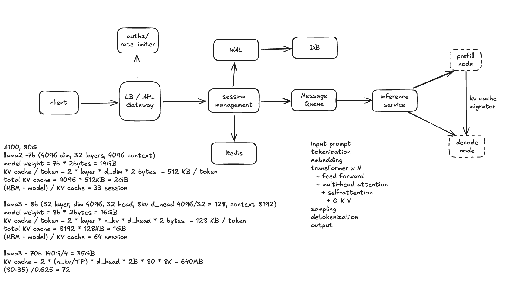

# OOD

SOLID+design pattern

- **封装（Encapsulation）**：隐藏实现细节，仅暴露接口
- **继承（Inheritance）**：子类复用父类的代码 
- **多态（Polymorphism）**：不同对象可以调用相同接口 类似c++的virtual，`@Override`看实际的object instance
- **抽象（Abstraction）**：只暴露必要信息，隐藏不必要的细节 `public abstract void sound();`不用实现

**不能被实例化**（不能 `new` 一个 `abstract` 类） 

**必须被子类继承**，子类要么实现所有的 `abstract` 方法，要么自己也定义为 `abstract`

```java
package org.example;

class Main {
    public static void main(String[] args) {
        Animal a=new Dog("11");
        Animal b=new Cat("22");
        a.getName();
        a.sound();

        b.getName();
        b.sound();

    }
}

abstract class Animal{
    protected String name;

    public Animal(String name){
        this.name=name;
    }

    public abstract void sound();

    public void getName() {
        System.out.println(name);
    }
}

class Dog extends Animal{
    public Dog(String name) {
        super(name);
    }
    @Override
    public void sound(){
        System.out.println("Dog sound");
    }

    public void getName(){
        System.out.println(name);
    }
}

class Cat extends Animal{
    public Cat(String name) {
        super(name);
    }
    @Override
    public void sound(){
        System.out.println("Cat sound");
    }

    public void getName(){
        System.out.println(name);
    }
}
```

## SOLID

**S - 单一职责原则（SRP, Single Responsibility Principle）**

- 一个类应该只有一个引起它变化的原因，即一个类只负责一个功能。

**O - 开闭原则（OCP, Open/Closed Principle）**

- 类应该**对扩展开放，对修改关闭，即尽量通过扩展而不是修改代码来增加新功能**。

**L - 里氏替换原则（LSP, Liskov Substitution Principle）**

- 子类必须能够替换其基类，不能破坏程序的正确性。

**I - 接口隔离原则（ISP, Interface Segregation Principle）**

- 接口应该小而精，不应该强迫实现类依赖它们不需要的方法。

**D - 依赖倒置原则（DIP, Dependency Inversion Principle）**

- 依赖抽象（接口或抽象类）而不是具体实现，减少耦合

## parkinglot

停车场由若干层（Level）与若干车位（ParkingSpot）组成。支持不同车辆类型（Motorcycle、Car、Bus）与不同车位尺寸（Motorcycle, Compact, Large）。系统需支持：

- 停车（park）与取车（unpark）并返回 Ticket（包含车位信息）。
- 能查找可用车位数/状态。
- 支持并发场景（尽量无全局阻塞），并且当策略有变化时容易扩展（例如从“第一个空位”改成“优先地面层”）。
- 要尽量遵循 SOLID 并使用合适设计模式。

Functional requirements:

- The parking lot has multiple parking spots, including compact, regular, and oversized spots.
- The parking lot supports parking for motorcycles, cars, and trucks.
- Customers can park their vehicles in spots assigned based on vehicle size.
- Customers receive a parking ticket with vehicle details and entry time at the entry point and pay a fee based on duration, vehicle size, and time of day at the exit point.

Non-functional requirements:

- The system must scale to support large parking lots with many spots and vehicles.
- The system must reliably track spot assignments and ticket details to ensure accurate operations.

```c++

```

## elevator

```c++

```

## amazon locker

```c++

```

## Linux file search

```c++

```

## Pizza

```c++

```

# design pattern

### Singleton Pattern

#### Eager Singleton

**`static` 变量** 是所有实例共享的 **字段**，但 **类本身可以多次实例化**。

```java
class Eager{
		public static final Eager eager= new Eager();// static
  	private Eager() { }
		public static Eager getInstance(){
      	return eager;
    }
}
```

**`final` 确保引用不会被修改**，防止 **被覆盖** 或 **误赋值**，确保单例对象是唯一的。

**线程安全**，不用额外的同步代码

#### Lazy Singleton

DCL Double-Checked Locking 保证线程安全，防止创建多个instance

`synchronized(lazy.class)`锁整个类，不能只锁lazy，因为可能是null，`throw NullPointerException`

`volatile`  to avoid **Memory Reordering**

`lazy = new Lazy();` 不是一个原子操作，它包括 **三步**：

1. **分配内存**
2. **调用构造方法**
3. **将 `lazy` 指向这块内存**

**指令重排** 可能导致 **步骤 2 和 3 交换顺序**：

- 线程 A 在 **步骤 3** 之前释放锁。
- 线程 B 读取到 `lazy` **已指向内存**，但对象 **尚未完全初始化**，导致错误。

`volatile` **阻止指令重排**，保证 `lazy` 在对象完全初始化后才对其他线程可见。

```java
class Lazy{
		public static volatile Lazy lazy;// static
  	private Lazy() { }
  
		public static Lazy getInstance(){
      	if(lazy==null){
            synchronized(lazy.class){
                if(lazy==null){
                    lazy=new Lazy();
                }
            }
        }
      	return lazy;
    }
}
```

### factory pattern

#### simple factory pattern

用static function来创造对象，避免用new

**违反OCP**：每次新增产品都要修改 `AnimalFactory`

```java
package org.example;

class Main {
    public static void main(String[] args) {
        Animal a=AnimalFactory.CreateAnimal("dog");
        a.speak();
        Animal b=AnimalFactory.CreateAnimal("cat");
        b.speak();
    }
}

interface Animal{
    void speak();
}

class Dog implements Animal{
    public void speak(){
        System.out.println("Dog");
    }
}

class Cat implements Animal{
    public void speak(){
        System.out.println("Cat");
    }
}

class AnimalFactory{
    public static Animal CreateAnimal(String type){
        if(type.equals("dog")){
            return new Dog();
        }else if(type.equals("cat")){
            return new Cat();
        }else{
             throw new IllegalArgumentException("Unknown animal type");
        }
    }
}
```

#### Factory Method Pattern

 如果用 `static` 方法，那就是简单工厂，这个不能用static！

每个子类都有自己的 **工厂方法**，负责创建自己的对象，符合 **开闭原则**

**符合开闭原则**：添加新产品时，只需新增工厂类，不改动现有代码

```java
class DogFactory{
    public Animal CreateAnimal(){
        return new Dog();
    }
}

class CatFactory{
    public Animal CreateAnimal(){
        return new Cat();
    }
}

public static void main(String[] args) {
    DogFactory dogFactory=new DogFactory();
    Animal a=dogFactory.CreateAnimal();
    a.speak();
    CatFactory catFactory=new CatFactory();
    Animal b=catFactory.CreateAnimal();
    b.speak();
}
```

#### Abstract Factory Pattern

这里一个abstract factory, 来创建多个工厂

```java
package org.example;

class Main {
    public static void main(String[] args) {
        DogFactory dogFactory=new DogFactory();
        Animal a=dogFactory.createAnimal();
        Sound a1=dogFactory.createSound();
        a.type();
        a1.makeSound();
        CatFactory catFactory=new CatFactory();
        Animal b=catFactory.createAnimal();
        Sound b1=catFactory.createSound();
        b.type();
        b1.makeSound();
    }
}
//定义了factory应该实现的class
interface AnimalFactory{
    Animal createAnimal();
    Sound createSound();
}

interface Sound{
    void makeSound();
}
interface Animal{
    void type();
}

class DogFactory implements AnimalFactory{
    public Animal createAnimal() {
        return new Dog();
    }
    public Sound createSound() {
        return new DogSound();
    }
}

class CatFactory implements AnimalFactory{
    public Animal createAnimal() {
        return new Cat();
    }
    public Sound createSound() {
        return new CatSound();
    }
}


class Dog implements Animal{
    public void type() {
        System.out.println("Dog");
    }
}

class DogSound implements Sound{
    public void makeSound() {
        System.out.println("DogSound");
    }
}

class Cat implements Animal{
    public void type() {
        System.out.println("Cat");
    }
}

class CatSound implements Sound{
    public void makeSound() {
        System.out.println("CatSound");
    }
}
```

### strategy pattern

相当于把不同方法放在`PaymentStrategy`里，然后可以设置这个object instance来改变策略，在Context里

```java
package org.example;

class Main {
    public static void main(String[] args) {
        ShoppingCart cart=new ShoppingCart();
        cart.setPaymentStrategy(new CreditCard("1111"));
        cart.checkout(100);

        cart.setPaymentStrategy(new Paypal());
        cart.checkout(2000);

        cart.setPaymentStrategy(new WeChat());
        cart.checkout(3000);
    }
}

interface PaymentStrategy {
    void pay(int amount);
}

class CreditCard implements PaymentStrategy{
    private String CardNumber;
    public CreditCard(String CardNumber) {
        this.CardNumber=CardNumber;
    }

    @Override
    public void pay(int amount) {
        System.out.println("credit:"+amount);
    }
}

class Paypal implements PaymentStrategy{
    @Override
    public void pay(int amount) {
        System.out.println("Paypal:"+amount);
    }
}

class WeChat implements PaymentStrategy{
    @Override
    public void pay(int amount) {
        System.out.println("WeChat:"+amount);
    }
}

class ShoppingCart{
    private PaymentStrategy paymentStrategy;

    public void setPaymentStrategy(PaymentStrategy paymentStrategy) {
        this.paymentStrategy=paymentStrategy;
    }

    public void checkout(int amount) {
        if(paymentStrategy==null){
            throw new NullPointerException("paymentStrategy is null");
        }
        paymentStrategy.pay(amount);
    }
}
```

这里可以有一个ApplicationContext,把Strategy放在Map里

这里读取配置文件里的数据，在yaml里

```yaml
login:
	types:
		account:accountGranter
		sms:smsGranter
		we_chat:weChatGranter
```

`loginTypeConfig.getTypes()`拿到所有的配置

放在`granterPool`里

`applicationContext.getBean(y)` 从Bean里得到实例

singleton 范围的 Bean 会被存储在 ApplicationContext/BeanFactory 的内存中

```java
private static Map<String,UserGranter> granterPool=new ConcurrentHashMap<>();

@Autowired
private LoginTypeConfig loginTypeConfig;

public void setApplicationContext(ApplicationContext applicationContext)throw BeansException{
		loginTypeConfig.getTypes().forEach((k,y)->{
      	granterPool.put(k,(UserGranter) applicationContext.getBean(y));
    });
}

//调用
@Autowired
private UserLoginFactory factory;

UserGranter granter=factory.getGranter(loginReq.getType());
if(granter==null){
  	//failed
}
granter.login(loginReq);


public UserGranter getGranter(String grantType){
  	UserGranter tokenGranter=granterPool.get(grantType);
  	return tokenGranter;
}
```

### responsibility chain pattern

允许多个对象依次处理请求，直到某个对象能够处理它为止。它的核心思想是 **将请求的发送者和接收者解耦**，并允许多个对象构成一条“责任链”，请求在链上传递，直到有对象处理它或者到达链的末端

**Handler（处理者接口/抽象类）**：定义一个 `handleRequest()` 方法，每个具体的处理者都会实现这个方法，并决定是否处理请求，或者将请求传递给下一个处理者。

**ConcreteHandler（具体处理者）**：继承 `Handler`，实现请求处理逻辑，并维护对下一个处理者的引用。

**Client（客户端）**：创建处理链，并向第一个处理者发送请求。

首先就是创建一个abstract class，然后里面有设置下一个Logger，和abstract func

然后就是实现3个Logger级别，然后就create LoggerChain, `createLoggerChain()`

```java
package org.example;

class Main {
    public static void main(String[] args) {
        Logger loggerChain=LoggerChain.createLoggerChain();
        loggerChain.LogMessage("1",LogLevel.INFO);
        loggerChain.LogMessage("2",LogLevel.WARNING);
        loggerChain.LogMessage("3",LogLevel.ERROR);

    }
}

//abstract class
abstract class Logger{
    protected Logger nextLogger;

    public void setNextLogger(Logger logger){
        this.nextLogger=logger;
    }

    public void LogMessage(String message,LogLevel level){
        if(canHandle(level)){
            write(message);
        }else if(nextLogger!=null){
            nextLogger.LogMessage(message,level);
        }
    }

    public abstract boolean canHandle(LogLevel level);

    public abstract void write(String message);
}

enum LogLevel{
    INFO,WARNING,ERROR
}

//define every level class

class InfoLogger extends Logger{
    @Override
    public boolean canHandle(LogLevel level){
        return level==LogLevel.INFO;
    }

    @Override
    public void write(String message){
        System.out.println("INFO:"+message);
    }
}

class WarningLogger extends Logger{
    @Override
    public boolean canHandle(LogLevel level){
        return level==LogLevel.WARNING;
    }

    @Override
    public void write(String message){
        System.out.println("Warning:"+message);
    }
}


class ErrorLogger extends Logger{
    @Override
    public boolean canHandle(LogLevel level){
        return level==LogLevel.ERROR;
    }

    @Override
    public void write(String message){
        System.out.println("Error:"+message);
    }
}
//create logger chain
class LoggerChain{
    public static Logger createLoggerChain(){
        Logger infoLogger=new InfoLogger();
        Logger warningLogger=new WarningLogger();
        Logger errorLogger=new ErrorLogger();

        infoLogger.setNextLogger(warningLogger);
        warningLogger.setNextLogger(errorLogger);

        return infoLogger;
    }
}
```

### OOD

```java
package org.example;

import java.util.ArrayList;
import java.util.List;

class Main {
    public static void main(String[] args) {
        // **构造文件系统**
        File root = new File("root", 0, false);
        File file1 = new File("file1.txt", 2 * 1024 * 1024, true); // 2MB
        File file2 = new File("file2.xml", 4 * 1024 * 1024, true); // 6MB, .xml
        File file3 = new File("abc_test.log", 8 * 1024 * 1024, true); // 8MB, 不是 .xml
        File folder = new File("subfolder", 0, false);
        File file4 = new File("data.xml", 10 * 1024 * 1024, true); // 10MB, .xml
        File file5 = new File("document.xml", 1 * 1024 * 1024, true); // 1MB, .xml (小于 5MB)
        File file6 = new File("large_file.txt", 15 * 1024 * 1024, true); // 15MB, 不是 .xml

        // **构造层次结构**
        root.addChild(file1);
        root.addChild(file2);
        root.addChild(folder);
        root.addChild(file3);
        folder.addChild(file4);
        folder.addChild(file5);
        root.addChild(file6);

        // **创建 UnixFindSystem 并运行搜索**
        UnixFindSystem unixFindSystem = new UnixFindSystem();
        unixFindSystem.search(root);
    }
}

class File{
    private String fileName;
    private long fileSize;
    private boolean isFile;
    private List<File> children;

    public File(String fileName, long fileSize,boolean isFile) {
        this.fileName = fileName;
        this.fileSize = fileSize;
        this.isFile = isFile;
        this.children = new ArrayList<>();
    }

    public void addChild(File file){
        children.add(file);
    }

    public boolean isFile(){
        return isFile;
    }

    public String getFileName(){
        return fileName;
    }

    public long getFileSize(){
        return fileSize;
    }
    public List<File> getChildren(){
        return children;
    }
}


abstract class Filter{
    protected Filter nextFilter;

    public void setNextFilter(Filter nextFilter){
        this.nextFilter = nextFilter;
    }
    public void LogMessage(File file) {
        if(match(file)){
            System.out.println("File: " + file.getFileName());
        }else if(nextFilter!=null){
            nextFilter.LogMessage(file);
        }else{
            System.out.println("No match");
        }
    }
    public abstract boolean match(File file);
}

class FileSizeFilter extends Filter{
    private static final long SIZE_THRESHOLD = 5 * 1024 * 1024;

    @Override
    public boolean match(File file) {
        return file.isFile()&&file.getFileSize()>SIZE_THRESHOLD;
    }
}

class FileSuffixFilter extends Filter{
    @Override
    public boolean match(File file) {
        return file.getFileName().endsWith("xml");
    }
}

class FilterChain{
    public static Filter createChain(){
        Filter filter=new FileSizeFilter();
        Filter fileSuffixFilter=new FileSuffixFilter();

        filter.setNextFilter(fileSuffixFilter);
        return filter;
    }
}

class UnixFindSystem{
    Filter filter=FilterChain.createChain();

    public void search(File root) {
        searchHelper(root);
    }

    private void searchHelper(File dir){
        if(dir==null) return;
        if(dir.isFile()) {
            filter.LogMessage(dir);
        }else{
            for(File child:dir.getChildren()){
                searchHelper(child);
            }
        }
    }
}
```


### Proxy Pattern

jdk动态代理，CGLIB动态代理

Dynamic Proxy **通过反射（Reflection）来动态创建代理对象**，拦截方法调用，并**在运行时**增强方法逻辑，如**日志、权限控制、事务管理**等

```java
import java.lang.reflect.InvocationHandler;
import java.lang.reflect.Method;
import java.lang.reflect.Proxy;

// 1. 定义接口
interface Service {
    void request();
}

// 2. 真实对象
class RealService implements Service {
    @Override
    public void request() {
        System.out.println("执行真实业务逻辑...");
    }
}

// 3. 动态代理处理器（InvocationHandler）
class DynamicProxyHandler implements InvocationHandler {
    private final Object realObject;

    public DynamicProxyHandler(Object realObject) {
        this.realObject = realObject;
    }

    @Override
    public Object invoke(Object proxy, Method method, Object[] args) throws Throwable {
        System.out.println("[LOG] 调用方法：" + method.getName());
        Object result = method.invoke(realObject, args); // 调用真实对象的方法
        System.out.println("[LOG] 方法调用结束");
        return result;
    }
}

// 4. 客户端使用动态代理
public class DynamicProxyDemo {
    public static void main(String[] args) {
        // 真实对象
        RealService realService = new RealService();

        // 生成动态代理
        Service proxyInstance = (Service) Proxy.newProxyInstance(
                realService.getClass().getClassLoader(),
                new Class[]{Service.class},
                new DynamicProxyHandler(realService)
        );

        // 使用代理对象调用方法
        proxyInstance.request();
    }
}
```

```java
import net.sf.cglib.proxy.Enhancer;
import net.sf.cglib.proxy.MethodInterceptor;
import net.sf.cglib.proxy.MethodProxy;
import java.lang.reflect.Method;

// 1. 真实对象（没有接口）
class RealService {
    public void request() {
        System.out.println("执行真实业务逻辑...");
    }
}

// 2. CGLIB 代理类
class CglibProxy implements MethodInterceptor {
    private final Object target;

    public CglibProxy(Object target) {
        this.target = target;
    }

    public Object getProxyInstance() {
        Enhancer enhancer = new Enhancer();
        enhancer.setSuperclass(target.getClass());
        enhancer.setCallback(this);
        return enhancer.create();
    }

    @Override
    public Object intercept(Object obj, Method method, Object[] args, MethodProxy proxy) throws Throwable {
        System.out.println("[LOG] 调用方法：" + method.getName());
        Object result = proxy.invokeSuper(obj, args);
        System.out.println("[LOG] 方法调用结束");
        return result;
    }
}

// 3. 客户端使用代理
public class CglibProxyDemo {
    public static void main(String[] args) {
        RealService realService = new RealService();
        RealService proxy = (RealService) new CglibProxy(realService).getProxyInstance();
        proxy.request();
    }
}
```

### Springboot Design Pattern

工厂设计模式 : Spring 使用工厂模式通过 **BeanFactory 、 ApplicationContext** 创建 bean 对象。

**代理设计模式 : Spring AOP 功能的实现。**

单例设计模式 : Spring 中的 Bean 默认都是单例的。

模板方法模式 : Spring 中 jdbcTemplate 、 hibernateTemplate 等以 Template 结尾的对数据库操作的类，它们就使用到了模板模式。 

包装器设计模式 : 我们的项目需要连接多个数据库，而且不同的客户在 每次访问中根据需要会去访问不同的数据库。这种模式让我们可以根据 客户的需求能够动态切换不同的数据源。

观察者模式**:** Spring 事件驱动模型就是观察者模式很经典的一个应用。 

适配器模式 :Spring AOP 的增强或通知(Advice)使用到了**适配器**模式、 spring MVC 中也是用到了适配器模式适配 **Controller** 

# 实战例子mt实习

在实习的时候使用到了工厂策略模式

首先定义工厂接口

 ```java
 public enum StateEnum {
     INIT, PROCESSING, SUCCESS, FAIL;
 }
 
 public interface StateHandler{
     StateEnum getState(); 
     OpResult execute(Request request) throws OpException;
 }
 ```

随后实现策略的注入

```java
@Component
public class StateHandlerFactory implements InitializingBean{

    private final Map<StateEnum, StateHandler> handlerMap = new HashMap<>();
		
    @Autowired
    private List<StateHandler> handlerList;
    
    @Override
    public void afterPropertiesSet() throws Exception {
        for (StateHandler handler : handlerList) {
            handlerMap.put(handler.getState(), handler);
        }
    }

    public OpResult route(Request request) {
        StateHandler handler = handlerMap.get(request.getState());
        if (handler == null) {
            return new OpResult(false, "No handler found for state: " + request.getState());
        }
        return handler.execute(request);
    }
}
```

随后实现策略

```java
@Service
public class InitStateHandler implements StateHandler {
    @Override
    public StateEnum getState() {
        return StateEnum.INIT;
    }

    @Override
    public OpResult execute(Request request) {
        return new OpResult(true, "Init handled: " + request.getPayload());
    }
}
```


