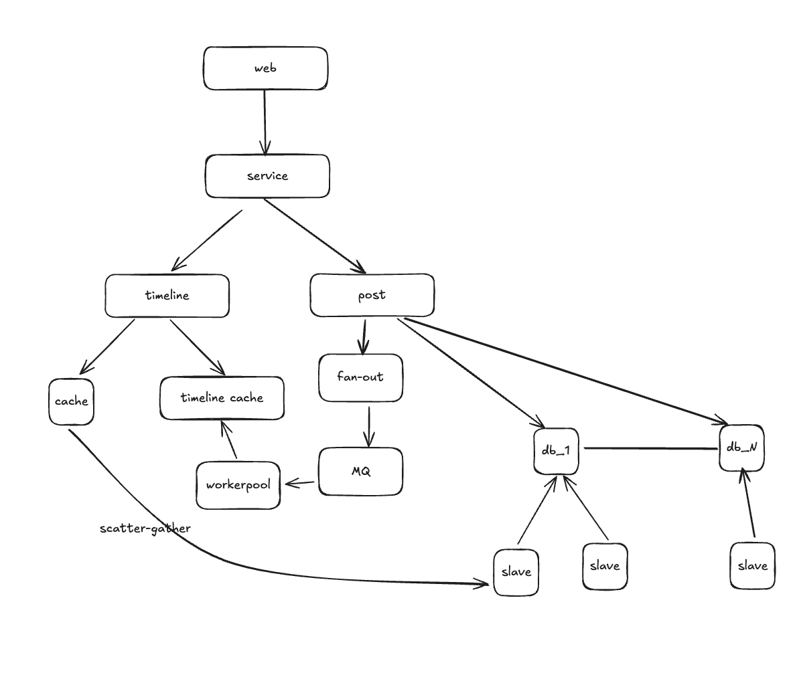

# System Design

### design web

first may meet bottle neck, then scaling up

Overview: users can follow each other, post and view post timeline


数据库与业务代码之间增加一层抽象层ORM对象关系映射，ORM隐藏了数据库操作，db.session.add(user); db.session.commit(); 等

MVC model view controller，model封装数据，controller响应请求，view数据展示

#### Function Requirement

* register, login
* follow other user
* See other's posts   

#### Data Entity

2个模型表存数据实体(User,Post)，1个关联表存多对多关系(Follow)


这里user_Id 是foreign key外键，注意看下面建数据库如何表示foreign key！

`foreign_key (user_id) references users (id)`

```sql
create table users(
  id integer primary_key,
  username varchar,
  password varchar,
  created_at timestamp
);

create table posts(
  id integer primary_key,
  title varchar,
  body text,
  user_id integer,
  created_at timestamp,
  foreign_key (user_id) references users (id)
);

create table follows(
  following_user_id integer,
  followed_user_id integer,
  created_at timestamp,
  foreign_key (following_user_id) references users (id),
  foreign_key (followed_user_id) references users (id),
);
```

展示关注用户最近10篇post

```sql
select p.id, p.title, p.body, p.user_id, p.created_at
from posts p
join follows f on p.user_id = f.followed_user_id
where f.following_user_id = <User ID>
order by p.created_at desc
limit 10 offset 0
```

但是join表开销巨大

#### 解决方法

* 抖音/微博那样的“推荐流”：后台异步计算用户可能感兴趣的 post，放入 Redis/ES/消息队列中
* 限定关注数 + 分批加载
* 预聚合 + 时间轴表（Timeline 表）

设计一个 `timeline` 表，把关注用户的 post 预先“推送”到当前用户的时间轴上 Fan-out on write 

Fan-out广播

```sql
CREATE TABLE timeline (
  user_id INTEGER,               -- 当前登录用户
  post_id INTEGER,               -- 他关注的人的post
  post_user_id INTEGER,          -- 发帖人是谁
  created_at TIMESTAMP,          -- 发帖时间
  FOREIGN KEY (user_id) REFERENCES users(id),
  FOREIGN KEY (post_id) REFERENCES posts(id)
);
```

当某个用户发帖后，比如用户 A：

```sql
-- 查出所有关注他的人
SELECT following_user_id
FROM follows
WHERE followed_user_id = A;
```

然后写入 timeline 表

```
for each follower:
    insert into timeline (user_id=follower, post_id=新发帖ID, post_user_id=A, created_at=帖子时间)
```

查询当前用户的 timeline 就变得非常快了

```sql
SELECT *
FROM posts p
JOIN timeline t ON p.id = t.post_id
WHERE t.user_id = :current_user_id
ORDER BY p.created_at DESC
LIMIT 10;
```

#### RESTful API

REST就是收取发送的都是资源，也就是我收到的就是html，这个在服务器端就渲染了

而RESTful API，抽象成一个API返回json文件，前端自行渲染

```json
"pagination":{
	"currentPage":1,
	"pageSize":10,
	"totalCount":100
}
```

POST请求可能需要验证身份

这里header里加上

```
POST /api/posts
header:
	Content-Type: application/json
	Authorization: Bearer <token>
body:
  {"title":xx, "body":xx}
```

这里的Authorization里的Bearer用来传递身份令牌（token），这个在登录时就获取了，后续请求都携带，可以是JWT，也可以是Oauth的access_token

而session存在Cookie里， `Cookie: JSESSIONID=abc123xyz`，后端服务器根据这个 session ID 去 Redis 或内存中查找用户状态

Oauth里有一个临时授权码code来换取token，然后有了access_token后就可以直接访问资源了

### scaling database/scalibility

数据分区

功能分区

添加副本 scale cube 复制多份数据

首先估算QPS，封底估算，100M user, 10/day, 10K QPS, peek read QPS = 30-50K QPS

MySQL read 1-5K QPS, write 低一个数量级，因为要建立索引 <1k 

**solution replication+shardig**

shardingKey : post_id, user_id，有优劣势 然后取模

如果用user_id，比如名人都在一个db上，访问timeline查询会造成大量的负载，相当于热点数据

使用post_id可以分担负载，坏处就是查一个用户的话得遍历所有的shard

scatter and gather, 需要跨分片查询

### Optimize Latency

正常查询，再查latency high，热门post起来缓存

这里需要计算一下需要多少缓存

```
Post(post_id, content, user_id, timestamp)
3*4byte+140\*2byte = 292 bytes

cache storage = 100M * 2/day * 3day * 300Bytes = 180GB
20% hot post = 180*20% = 36G //单机都可以
```


还可以更快吗？就绕过传统查询，直接在user发布的时候给他的follower预构建timeline，follower可以直接读取，也就是post到follower对应的timeline的cache里

### Fan-out

Not time sensitive, so we can use Async, which is MQ

这里timeline cache大小估算，cache - (post_id, user_id)，针对userid去读表，避免join的操作

```
cache - 100M * 8B * 100 = 80GB
QPS - 2k * 100 = 200K
```

push推送模型，生成timeline速度快，读取也快

缺点一 follower多，写入放大很多倍，名人会产生一个hot spot，二是每个用户构建了cache，但是不是所有账号都活跃

pull读取的时候再获取post，也就是要先登录，不活跃账号不消耗资源，也没有分发的hot spot问题，缺点就是生成timeline慢，延迟高，关注用户太多需要大量排序合并再排序 ，不能实时更新，只有登录后才生成timeline

如何结合呢？普通用户push，post的时候直接发送到对应的timeline cache上

名人就pull，follower登录有再去数据库里缓存上他们发的帖，timeline service上合并

可以把peek的数量严格的限制住



### video sharing platform (tiktok)


# OOD

SOLID+design pattern

- **封装（Encapsulation）**：隐藏实现细节，仅暴露接口
- **继承（Inheritance）**：子类复用父类的代码 
- **多态（Polymorphism）**：不同对象可以调用相同接口 类似c++的virtual，`@Override`看实际的object instance
- **抽象（Abstraction）**：只暴露必要信息，隐藏不必要的细节 `public abstract void sound();`不用实现

**不能被实例化**（不能 `new` 一个 `abstract` 类） 

**必须被子类继承**，子类要么实现所有的 `abstract` 方法，要么自己也定义为 `abstract`

```java
package org.example;

class Main {
    public static void main(String[] args) {
        Animal a=new Dog("11");
        Animal b=new Cat("22");
        a.getName();
        a.sound();

        b.getName();
        b.sound();

    }
}

abstract class Animal{
    protected String name;

    public Animal(String name){
        this.name=name;
    }

    public abstract void sound();

    public void getName() {
        System.out.println(name);
    }
}

class Dog extends Animal{
    public Dog(String name) {
        super(name);
    }
    @Override
    public void sound(){
        System.out.println("Dog sound");
    }

    public void getName(){
        System.out.println(name);
    }
}

class Cat extends Animal{
    public Cat(String name) {
        super(name);
    }
    @Override
    public void sound(){
        System.out.println("Cat sound");
    }

    public void getName(){
        System.out.println(name);
    }
}
```

## SOLID

**S - 单一职责原则（SRP, Single Responsibility Principle）**

- 一个类应该只有一个引起它变化的原因，即一个类只负责一个功能。

**O - 开闭原则（OCP, Open/Closed Principle）**

- 类应该**对扩展开放，对修改关闭，即尽量通过扩展而不是修改代码来增加新功能**。

**L - 里氏替换原则（LSP, Liskov Substitution Principle）**

- 子类必须能够替换其基类，不能破坏程序的正确性。

**I - 接口隔离原则（ISP, Interface Segregation Principle）**

- 接口应该小而精，不应该强迫实现类依赖它们不需要的方法。

**D - 依赖倒置原则（DIP, Dependency Inversion Principle）**

- 依赖抽象（接口或抽象类）而不是具体实现，减少耦合


# design pattern

### Singleton Pattern

#### Eager Singleton

**`static` 变量** 是所有实例共享的 **字段**，但 **类本身可以多次实例化**。

```java
class Eager{
		public static final Eager eager= new Eager();// static
  	private Eager() { }
		public static Eager getInstance(){
      	return eager;
    }
}
```

**`final` 确保引用不会被修改**，防止 **被覆盖** 或 **误赋值**，确保单例对象是唯一的。

**线程安全**，不用额外的同步代码

#### Lazy Singleton

DCL Double-Checked Locking 保证线程安全，防止创建多个instance

`synchronized(lazy.class)`锁整个类，不能只锁lazy，因为可能是null，`throw NullPointerException`

`volatile`  to avoid **Memory Reordering**

`lazy = new Lazy();` 不是一个原子操作，它包括 **三步**：

1. **分配内存**
2. **调用构造方法**
3. **将 `lazy` 指向这块内存**

**指令重排** 可能导致 **步骤 2 和 3 交换顺序**：

- 线程 A 在 **步骤 3** 之前释放锁。
- 线程 B 读取到 `lazy` **已指向内存**，但对象 **尚未完全初始化**，导致错误。

`volatile` **阻止指令重排**，保证 `lazy` 在对象完全初始化后才对其他线程可见。

```java
class Lazy{
		public static volatile Lazy lazy;// static
  	private Lazy() { }
  
		public static Lazy getInstance(){
      	if(lazy==null){
            synchronized(lazy.class){
                if(lazy==null){
                    lazy=new Lazy();
                }
            }
        }
      	return lazy;
    }
}
```

### factory pattern

#### simple factory pattern

用static function来创造对象，避免用new

**违反OCP**：每次新增产品都要修改 `AnimalFactory`

```java
package org.example;

class Main {
    public static void main(String[] args) {
        Animal a=AnimalFactory.CreateAnimal("dog");
        a.speak();
        Animal b=AnimalFactory.CreateAnimal("cat");
        b.speak();
    }
}

interface Animal{
    void speak();
}

class Dog implements Animal{
    public void speak(){
        System.out.println("Dog");
    }
}

class Cat implements Animal{
    public void speak(){
        System.out.println("Cat");
    }
}

class AnimalFactory{
    public static Animal CreateAnimal(String type){
        if(type.equals("dog")){
            return new Dog();
        }else if(type.equals("cat")){
            return new Cat();
        }else{
             throw new IllegalArgumentException("Unknown animal type");
        }
    }
}
```

#### Factory Method Pattern

 如果用 `static` 方法，那就是简单工厂，这个不能用static！

每个子类都有自己的 **工厂方法**，负责创建自己的对象，符合 **开闭原则**

**符合开闭原则**：添加新产品时，只需新增工厂类，不改动现有代码

```java
class DogFactory{
    public Animal CreateAnimal(){
        return new Dog();
    }
}

class CatFactory{
    public Animal CreateAnimal(){
        return new Cat();
    }
}

public static void main(String[] args) {
    DogFactory dogFactory=new DogFactory();
    Animal a=dogFactory.CreateAnimal();
    a.speak();
    CatFactory catFactory=new CatFactory();
    Animal b=catFactory.CreateAnimal();
    b.speak();
}
```

#### Abstract Factory Pattern

这里一个abstract factory, 来创建多个工厂

```java
package org.example;

class Main {
    public static void main(String[] args) {
        DogFactory dogFactory=new DogFactory();
        Animal a=dogFactory.createAnimal();
        Sound a1=dogFactory.createSound();
        a.type();
        a1.makeSound();
        CatFactory catFactory=new CatFactory();
        Animal b=catFactory.createAnimal();
        Sound b1=catFactory.createSound();
        b.type();
        b1.makeSound();
    }
}
//定义了factory应该实现的class
interface AnimalFactory{
    Animal createAnimal();
    Sound createSound();
}

interface Sound{
    void makeSound();
}
interface Animal{
    void type();
}

class DogFactory implements AnimalFactory{
    public Animal createAnimal() {
        return new Dog();
    }
    public Sound createSound() {
        return new DogSound();
    }
}

class CatFactory implements AnimalFactory{
    public Animal createAnimal() {
        return new Cat();
    }
    public Sound createSound() {
        return new CatSound();
    }
}


class Dog implements Animal{
    public void type() {
        System.out.println("Dog");
    }
}

class DogSound implements Sound{
    public void makeSound() {
        System.out.println("DogSound");
    }
}

class Cat implements Animal{
    public void type() {
        System.out.println("Cat");
    }
}

class CatSound implements Sound{
    public void makeSound() {
        System.out.println("CatSound");
    }
}
```

### strategy pattern

相当于把不同方法放在`PaymentStrategy`里，然后可以设置这个object instance来改变策略，在Context里

```java
package org.example;

class Main {
    public static void main(String[] args) {
        ShoppingCart cart=new ShoppingCart();
        cart.setPaymentStrategy(new CreditCard("1111"));
        cart.checkout(100);

        cart.setPaymentStrategy(new Paypal());
        cart.checkout(2000);

        cart.setPaymentStrategy(new WeChat());
        cart.checkout(3000);
    }
}

interface PaymentStrategy {
    void pay(int amount);
}

class CreditCard implements PaymentStrategy{
    private String CardNumber;
    public CreditCard(String CardNumber) {
        this.CardNumber=CardNumber;
    }

    @Override
    public void pay(int amount) {
        System.out.println("credit:"+amount);
    }
}

class Paypal implements PaymentStrategy{
    @Override
    public void pay(int amount) {
        System.out.println("Paypal:"+amount);
    }
}

class WeChat implements PaymentStrategy{
    @Override
    public void pay(int amount) {
        System.out.println("WeChat:"+amount);
    }
}

class ShoppingCart{
    private PaymentStrategy paymentStrategy;

    public void setPaymentStrategy(PaymentStrategy paymentStrategy) {
        this.paymentStrategy=paymentStrategy;
    }

    public void checkout(int amount) {
        if(paymentStrategy==null){
            throw new NullPointerException("paymentStrategy is null");
        }
        paymentStrategy.pay(amount);
    }
}
```

这里可以有一个ApplicationContext,把Strategy放在Map里

这里读取配置文件里的数据，在yaml里

```yaml
login:
	types:
		account:accountGranter
		sms:smsGranter
		we_chat:weChatGranter
```

`loginTypeConfig.getTypes()`拿到所有的配置

放在`granterPool`里

`applicationContext.getBean(y)` 从Bean里得到实例

singleton 范围的 Bean 会被存储在 ApplicationContext/BeanFactory 的内存中

```java
private static Map<String,UserGranter> granterPool=new ConcurrentHashMap<>();

@Autowired
private LoginTypeConfig loginTypeConfig;

public void setApplicationContext(ApplicationContext applicationContext)throw BeansException{
		loginTypeConfig.getTypes().forEach((k,y)->{
      	granterPool.put(k,(UserGranter) applicationContext.getBean(y));
    });
}

//调用
@Autowired
private UserLoginFactory factory;

UserGranter granter=factory.getGranter(loginReq.getType());
if(granter==null){
  	//failed
}
granter.login(loginReq);


public UserGranter getGranter(String grantType){
  	UserGranter tokenGranter=granterPool.get(grantType);
  	return tokenGranter;
}
```

### responsibility chain pattern

允许多个对象依次处理请求，直到某个对象能够处理它为止。它的核心思想是 **将请求的发送者和接收者解耦**，并允许多个对象构成一条“责任链”，请求在链上传递，直到有对象处理它或者到达链的末端

**Handler（处理者接口/抽象类）**：定义一个 `handleRequest()` 方法，每个具体的处理者都会实现这个方法，并决定是否处理请求，或者将请求传递给下一个处理者。

**ConcreteHandler（具体处理者）**：继承 `Handler`，实现请求处理逻辑，并维护对下一个处理者的引用。

**Client（客户端）**：创建处理链，并向第一个处理者发送请求。

首先就是创建一个abstract class，然后里面有设置下一个Logger，和abstract func

然后就是实现3个Logger级别，然后就create LoggerChain, `createLoggerChain()`

```java
package org.example;

class Main {
    public static void main(String[] args) {
        Logger loggerChain=LoggerChain.createLoggerChain();
        loggerChain.LogMessage("1",LogLevel.INFO);
        loggerChain.LogMessage("2",LogLevel.WARNING);
        loggerChain.LogMessage("3",LogLevel.ERROR);

    }
}

//abstract class
abstract class Logger{
    protected Logger nextLogger;

    public void setNextLogger(Logger logger){
        this.nextLogger=logger;
    }

    public void LogMessage(String message,LogLevel level){
        if(canHandle(level)){
            write(message);
        }else if(nextLogger!=null){
            nextLogger.LogMessage(message,level);
        }
    }

    public abstract boolean canHandle(LogLevel level);

    public abstract void write(String message);
}

enum LogLevel{
    INFO,WARNING,ERROR
}

//define every level class

class InfoLogger extends Logger{
    @Override
    public boolean canHandle(LogLevel level){
        return level==LogLevel.INFO;
    }

    @Override
    public void write(String message){
        System.out.println("INFO:"+message);
    }
}

class WarningLogger extends Logger{
    @Override
    public boolean canHandle(LogLevel level){
        return level==LogLevel.WARNING;
    }

    @Override
    public void write(String message){
        System.out.println("Warning:"+message);
    }
}


class ErrorLogger extends Logger{
    @Override
    public boolean canHandle(LogLevel level){
        return level==LogLevel.ERROR;
    }

    @Override
    public void write(String message){
        System.out.println("Error:"+message);
    }
}
//create logger chain
class LoggerChain{
    public static Logger createLoggerChain(){
        Logger infoLogger=new InfoLogger();
        Logger warningLogger=new WarningLogger();
        Logger errorLogger=new ErrorLogger();

        infoLogger.setNextLogger(warningLogger);
        warningLogger.setNextLogger(errorLogger);

        return infoLogger;
    }
}
```

### OOD

```java
package org.example;

import java.util.ArrayList;
import java.util.List;

class Main {
    public static void main(String[] args) {
        // **构造文件系统**
        File root = new File("root", 0, false);
        File file1 = new File("file1.txt", 2 * 1024 * 1024, true); // 2MB
        File file2 = new File("file2.xml", 4 * 1024 * 1024, true); // 6MB, .xml
        File file3 = new File("abc_test.log", 8 * 1024 * 1024, true); // 8MB, 不是 .xml
        File folder = new File("subfolder", 0, false);
        File file4 = new File("data.xml", 10 * 1024 * 1024, true); // 10MB, .xml
        File file5 = new File("document.xml", 1 * 1024 * 1024, true); // 1MB, .xml (小于 5MB)
        File file6 = new File("large_file.txt", 15 * 1024 * 1024, true); // 15MB, 不是 .xml

        // **构造层次结构**
        root.addChild(file1);
        root.addChild(file2);
        root.addChild(folder);
        root.addChild(file3);
        folder.addChild(file4);
        folder.addChild(file5);
        root.addChild(file6);

        // **创建 UnixFindSystem 并运行搜索**
        UnixFindSystem unixFindSystem = new UnixFindSystem();
        unixFindSystem.search(root);
    }
}

class File{
    private String fileName;
    private long fileSize;
    private boolean isFile;
    private List<File> children;

    public File(String fileName, long fileSize,boolean isFile) {
        this.fileName = fileName;
        this.fileSize = fileSize;
        this.isFile = isFile;
        this.children = new ArrayList<>();
    }

    public void addChild(File file){
        children.add(file);
    }

    public boolean isFile(){
        return isFile;
    }

    public String getFileName(){
        return fileName;
    }

    public long getFileSize(){
        return fileSize;
    }
    public List<File> getChildren(){
        return children;
    }
}


abstract class Filter{
    protected Filter nextFilter;

    public void setNextFilter(Filter nextFilter){
        this.nextFilter = nextFilter;
    }
    public void LogMessage(File file) {
        if(match(file)){
            System.out.println("File: " + file.getFileName());
        }else if(nextFilter!=null){
            nextFilter.LogMessage(file);
        }else{
            System.out.println("No match");
        }
    }
    public abstract boolean match(File file);
}

class FileSizeFilter extends Filter{
    private static final long SIZE_THRESHOLD = 5 * 1024 * 1024;

    @Override
    public boolean match(File file) {
        return file.isFile()&&file.getFileSize()>SIZE_THRESHOLD;
    }
}

class FileSuffixFilter extends Filter{
    @Override
    public boolean match(File file) {
        return file.getFileName().endsWith("xml");
    }
}

class FilterChain{
    public static Filter createChain(){
        Filter filter=new FileSizeFilter();
        Filter fileSuffixFilter=new FileSuffixFilter();

        filter.setNextFilter(fileSuffixFilter);
        return filter;
    }
}

class UnixFindSystem{
    Filter filter=FilterChain.createChain();

    public void search(File root) {
        searchHelper(root);
    }

    private void searchHelper(File dir){
        if(dir==null) return;
        if(dir.isFile()) {
            filter.LogMessage(dir);
        }else{
            for(File child:dir.getChildren()){
                searchHelper(child);
            }
        }
    }
}
```


### Proxy Pattern

jdk动态代理，CGLIB动态代理

Dynamic Proxy **通过反射（Reflection）来动态创建代理对象**，拦截方法调用，并**在运行时**增强方法逻辑，如**日志、权限控制、事务管理**等

```java
import java.lang.reflect.InvocationHandler;
import java.lang.reflect.Method;
import java.lang.reflect.Proxy;

// 1. 定义接口
interface Service {
    void request();
}

// 2. 真实对象
class RealService implements Service {
    @Override
    public void request() {
        System.out.println("执行真实业务逻辑...");
    }
}

// 3. 动态代理处理器（InvocationHandler）
class DynamicProxyHandler implements InvocationHandler {
    private final Object realObject;

    public DynamicProxyHandler(Object realObject) {
        this.realObject = realObject;
    }

    @Override
    public Object invoke(Object proxy, Method method, Object[] args) throws Throwable {
        System.out.println("[LOG] 调用方法：" + method.getName());
        Object result = method.invoke(realObject, args); // 调用真实对象的方法
        System.out.println("[LOG] 方法调用结束");
        return result;
    }
}

// 4. 客户端使用动态代理
public class DynamicProxyDemo {
    public static void main(String[] args) {
        // 真实对象
        RealService realService = new RealService();

        // 生成动态代理
        Service proxyInstance = (Service) Proxy.newProxyInstance(
                realService.getClass().getClassLoader(),
                new Class[]{Service.class},
                new DynamicProxyHandler(realService)
        );

        // 使用代理对象调用方法
        proxyInstance.request();
    }
}
```

```java
import net.sf.cglib.proxy.Enhancer;
import net.sf.cglib.proxy.MethodInterceptor;
import net.sf.cglib.proxy.MethodProxy;
import java.lang.reflect.Method;

// 1. 真实对象（没有接口）
class RealService {
    public void request() {
        System.out.println("执行真实业务逻辑...");
    }
}

// 2. CGLIB 代理类
class CglibProxy implements MethodInterceptor {
    private final Object target;

    public CglibProxy(Object target) {
        this.target = target;
    }

    public Object getProxyInstance() {
        Enhancer enhancer = new Enhancer();
        enhancer.setSuperclass(target.getClass());
        enhancer.setCallback(this);
        return enhancer.create();
    }

    @Override
    public Object intercept(Object obj, Method method, Object[] args, MethodProxy proxy) throws Throwable {
        System.out.println("[LOG] 调用方法：" + method.getName());
        Object result = proxy.invokeSuper(obj, args);
        System.out.println("[LOG] 方法调用结束");
        return result;
    }
}

// 3. 客户端使用代理
public class CglibProxyDemo {
    public static void main(String[] args) {
        RealService realService = new RealService();
        RealService proxy = (RealService) new CglibProxy(realService).getProxyInstance();
        proxy.request();
    }
}
```

### Springboot Design Pattern

工厂设计模式 : Spring 使用工厂模式通过 **BeanFactory 、 ApplicationContext** 创建 bean 对象。

**代理设计模式 : Spring AOP 功能的实现。**

单例设计模式 : Spring 中的 Bean 默认都是单例的。

模板方法模式 : Spring 中 jdbcTemplate 、 hibernateTemplate 等以 Template 结尾的对数据库操作的类，它们就使用到了模板模式。 

包装器设计模式 : 我们的项目需要连接多个数据库，而且不同的客户在 每次访问中根据需要会去访问不同的数据库。这种模式让我们可以根据 客户的需求能够动态切换不同的数据源。

观察者模式**:** Spring 事件驱动模型就是观察者模式很经典的一个应用。 

适配器模式 :Spring AOP 的增强或通知(Advice)使用到了**适配器**模式、 spring MVC 中也是用到了适配器模式适配 **Controller** 

# 实战例子mt实习

在实习的时候使用到了工厂策略模式

首先定义工厂接口

 ```java
 public enum StateEnum {
     INIT, PROCESSING, SUCCESS, FAIL;
 }
 
 public interface StateHandler{
     StateEnum getState(); 
     OpResult execute(Request request) throws OpException;
 }
 ```

随后实现策略的注入

```java
@Component
public class StateHandlerFactory implements InitializingBean{

    private final Map<StateEnum, StateHandler> handlerMap = new HashMap<>();
		
    @Autowired
    private List<StateHandler> handlerList;
    
    @Override
    public void afterPropertiesSet() throws Exception {
        for (StateHandler handler : handlerList) {
            handlerMap.put(handler.getState(), handler);
        }
    }

    public OpResult route(Request request) {
        StateHandler handler = handlerMap.get(request.getState());
        if (handler == null) {
            return new OpResult(false, "No handler found for state: " + request.getState());
        }
        return handler.execute(request);
    }
}
```

随后实现策略

```java
@Service
public class InitStateHandler implements StateHandler {
    @Override
    public StateEnum getState() {
        return StateEnum.INIT;
    }

    @Override
    public OpResult execute(Request request) {
        return new OpResult(true, "Init handled: " + request.getPayload());
    }
}
```


